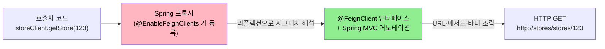
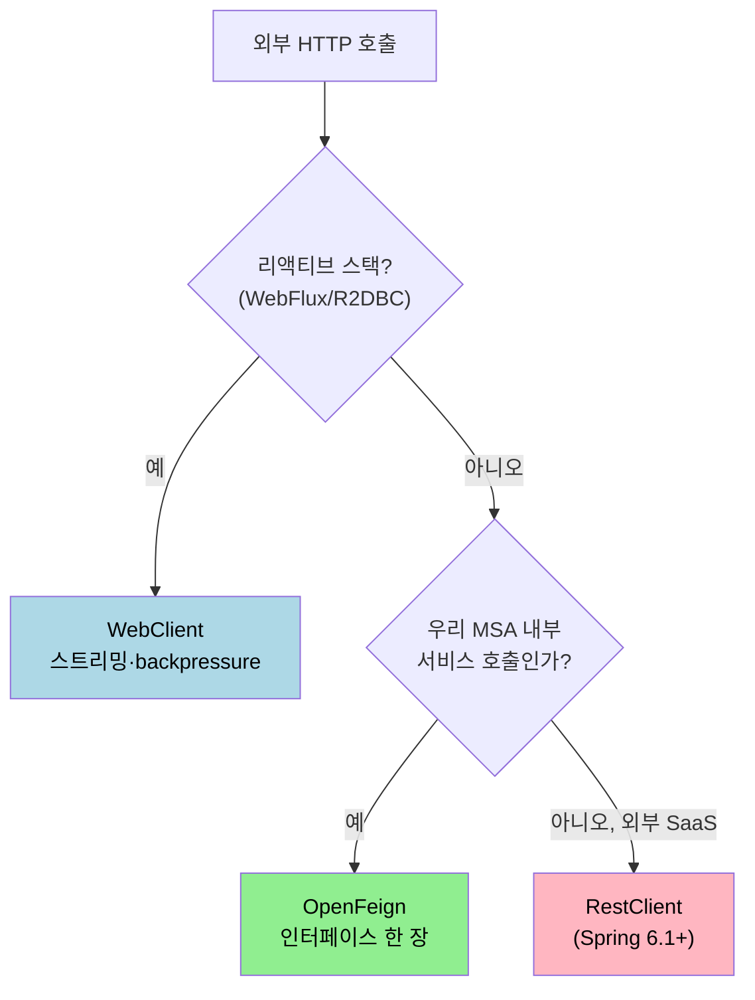

# OpenFeign 입문과 WebClient 비교

---

> 이 문서를 읽고 나면 OpenFeign 의 선언적 HTTP 클라이언트 패러다임을 한 문장으로 설명할 수 있고, WebClient 와 어느 상황에서 갈리는지 결정 트리로 답할 수 있습니다.


## 1. OpenFeign 이 푸는 문제

> RestTemplate · WebClient 로 외부 호출을 쓰다 보면 같은 패턴이 반복됩니다. URL 조립, 헤더 추가, 응답 역직렬화, 예외 변환 — 호출처 10곳이면 10번 같은 보일러플레이트가 생깁니다. OpenFeign 은 이 반복을 *인터페이스 선언* 으로 대체합니다.

WebClient 코드와 OpenFeign 인터페이스를 같은 호출에 대해 나란히 비교하면 차이가 분명합니다.

```java
// WebClient — 명령형 빌더
Mono<Store> store = webClient.get()
    .uri("/stores/{id}", storeId)
    .retrieve()
    .bodyToMono(Store.class);
```

```java
// OpenFeign — 선언적 인터페이스
@FeignClient("stores")
public interface StoreClient {
    @GetMapping("/stores/{id}")
    Store getStore(@PathVariable("id") Long id);
}

// 호출처
Store store = storeClient.getStore(storeId);
```

호출 코드 한 줄이면 끝납니다. 빌더 조립이 사라지고, 인터페이스 시그니처가 그대로 도메인 어휘입니다. Spring 이 런타임에 프록시로 구현체를 만들어 주기 때문에, 본문에 작성된 코드는 *호출 명세* 일 뿐 호출 *행위* 가 아닙니다.




## 2. WebClient · RestClient · OpenFeign 결정 트리

> 세 가지가 동시에 살아 있는 이유는 각자 자리가 다르기 때문입니다. "어느 게 가장 좋은가" 가 아니라 "우리 자리에 어느 게 맞는가" 가 정답입니다.



OpenFeign 이 가장 잘 어울리는 자리는 *MSA 내부 호출* 입니다. 이유는 두 가지입니다. 첫째, 같은 회사 안에서 서비스 간 호출이면 호출 대상 인터페이스를 공유 라이브러리로 패키지하기 좋습니다. 둘째, Spring Cloud LoadBalancer · Resilience4j 와 통합돼 service discovery, 재시도, 서킷브레이커를 인터페이스 차원에서 일괄 적용할 수 있습니다. 외부 SaaS API 호출에는 service discovery 전제가 없으므로 RestClient 가 더 자연스럽습니다.


## 3. 의존성과 활성화

> OpenFeign 사용은 두 단계입니다. 의존성 추가 + `@EnableFeignClients` 활성화.

```gradle
// build.gradle (Gradle 기준)
dependencies {
    implementation 'org.springframework.cloud:spring-cloud-starter-openfeign'
}

dependencyManagement {
    imports {
        mavenBom 'org.springframework.cloud:spring-cloud-dependencies:2023.0.x'
    }
}
```

Spring Cloud BOM 을 import 하면 starter 가 OpenFeign 4.x 라인을 가져옵니다. 직접 버전을 명시하지 않습니다 — Spring Boot 와의 호환 매트릭스를 BOM 이 관리합니다.

```java
// Application.java
@SpringBootApplication
@EnableFeignClients
public class Application {
    public static void main(String[] args) {
        SpringApplication.run(Application.class, args);
    }
}
```

`@EnableFeignClients` 가 *부트 시점에* `@FeignClient` 가 붙은 인터페이스를 스캔해 프록시 빈으로 등록합니다. 인터페이스만 작성하고 활성화 어노테이션을 빠뜨리면 `NoSuchBeanDefinitionException` 이 뜹니다.


## 4. 최소 예제

> 외부 호출 한 건을 OpenFeign 으로 처음 작성해 봅니다. 위 결정 트리에서 *MSA 내부 호출* 시나리오를 가정합니다.

```java
@FeignClient(name = "stores", url = "http://stores-service:8080")
public interface StoreClient {

    @GetMapping("/stores/{id}")
    Store getStore(@PathVariable("id") Long id);

    @PostMapping("/stores")
    Store create(@RequestBody StoreRequest request);
}
```

`name` 은 클라이언트 식별자입니다. service discovery 환경(Eureka·Consul) 이면 `name` 만으로 충분하고, 직접 URL 을 박고 싶으면 `url` 속성을 같이 줍니다. 본 예제는 학습용으로 `url` 을 명시했지만, 실제 운영에서는 service discovery + `name` 조합이 일반적입니다.

호출처에서는 일반 빈처럼 주입합니다.

```java
@Service
@RequiredArgsConstructor
public class StoreService {
    private final StoreClient storeClient;

    public Store findStore(Long id) {
        return storeClient.getStore(id);
    }
}
```

호출 코드 한 줄. WebClient 였다면 빌더 조립 4~5줄이 들어갔을 자리입니다.


## 5. 면접 대비 체크리스트

> 본 문서를 다 읽은 뒤 다음 질문에 답할 수 있어야 합니다.

1. OpenFeign 이 WebClient 대비 가지는 *유일한 강점* 은 무엇인가? 한 단어로 답한다면? (선언적 인터페이스 = 호출 코드 0줄)
2. `@EnableFeignClients` 를 빠뜨리면 어떤 예외가 발생하며, 왜 그런가?
3. OpenFeign 의 `name` 속성과 `url` 속성은 어떻게 다른가? service discovery 환경에서는 어느 쪽을 권장하는가?


## 다음에 읽을 것

- [`01-02.기본 설정과 인터페이스 선언.md`](01-02.기본%20설정과%20인터페이스%20선언.md) — `@FeignClient` 5속성과 application.yml 설정 깊이 들어가기
- [`../webflux/01-01.WebClient 입문과 RestTemplate·RestClient 비교.md`](../webflux/01-01.WebClient%20입문과%20RestTemplate·RestClient%20비교.md) — 반대편 갈래의 같은 입문 챕터
