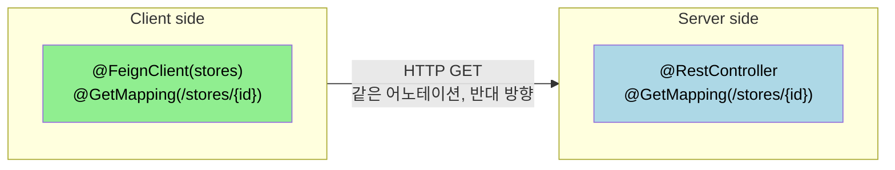
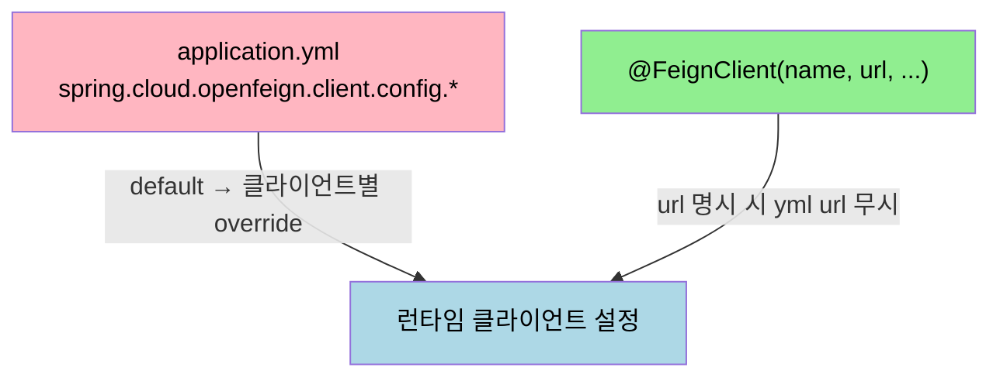

# 기본 설정과 인터페이스 선언

---

> 이 문서를 읽고 나면 OpenFeign 인터페이스를 선언하고 다섯 요소 — 이름, URL, 매핑 어노테이션, Path/Body, application.yml 설정 — 를 공식 문서 기준으로 채울 수 있습니다.


## 1. `@FeignClient` 5속성

> 입문 챕터(01-01)에서는 `name` + `url` 두 속성만 봤습니다. 실제로는 다섯 속성이 자주 쓰입니다.

| 속성 | 역할 | 사용 시점 |
|------|------|----------|
| `name` | 클라이언트 식별자. service discovery 키이자 application.yml 설정 키 | 모든 `@FeignClient` 에 필수 |
| `url` | 절대 URL. 명시하면 service discovery 를 건너뜀 | 학습·테스트, 또는 service discovery 미사용 환경 |
| `configuration` | 클라이언트별 `Configuration` 클래스 — Encoder/Decoder/Logger 등 override | 클라이언트마다 다른 설정이 필요할 때 |
| `fallback` | 서킷브레이커 fallback 빈 클래스 | Resilience4j 와 통합한 폴백 응답 |
| `contextId` | 같은 `name` 으로 여러 인터페이스를 둘 때 빈 충돌 회피 | 한 서비스에 인터페이스 분할 (예: ReadClient·WriteClient) |

`contextId` 가 필요한 자리를 공식 예제로 보면 다음과 같습니다.

```java
@FeignClient(contextId = "fooClient", name = "stores", configuration = FooConfiguration.class)
public interface FooClient {
    //..
}

@FeignClient(contextId = "barClient", name = "stores", configuration = BarConfiguration.class)
public interface BarClient {
    //..
}
```

두 인터페이스 모두 같은 `stores` 서비스를 가리키지만 `configuration` 이 다릅니다. `contextId` 를 빠뜨리면 빈 이름 충돌(`Bean definition collision`) 로 부트가 실패합니다.


## 2. Spring MVC 어노테이션 재사용

> OpenFeign 인터페이스는 *Spring MVC 컨트롤러와 같은 어노테이션* 을 씁니다. 이 설계가 OpenFeign 의 핵심 진입 비용을 낮춥니다 — Spring 사용자에게 새 어휘가 거의 없습니다.

```java
@FeignClient(name = "stores", url = "http://stores-service:8080")
public interface StoreClient {

    @GetMapping("/stores/{id}")
    Store getStore(@PathVariable("id") Long id);

    @GetMapping("/stores")
    Page<Store> list(Pageable pageable);

    @PostMapping(value = "/stores", consumes = "application/json")
    Store create(@RequestBody StoreRequest request);

    @PutMapping("/stores/{id}")
    void update(@PathVariable("id") Long id, @RequestBody StoreRequest request, @RequestHeader("X-Request-Id") String requestId);

    @DeleteMapping("/stores/{id}")
    void delete(@PathVariable Long id);
}
```

매핑 어노테이션은 컨트롤러 쪽과 의미가 완전히 같습니다. 차이는 *방향* 뿐입니다 — 컨트롤러는 *받는* 쪽, OpenFeign 은 *보내는* 쪽. `@RequestMapping(method=GET, value="/stores")` 도 동일하게 동작하므로 공식 문서 예제에서 두 표기가 섞여 등장합니다.




## 3. application.yml 설정

> `@FeignClient` 자체에는 적기 어려운 운영 설정 — 타임아웃, 로그 레벨, 재시도 — 은 `application.yml` 에 둡니다. 키 형식은 `spring.cloud.openfeign.client.config.{name}.*` 입니다.

```yaml
spring:
  cloud:
    openfeign:
      client:
        config:
          stores:
            connectTimeout: 5000
            readTimeout: 5000
            loggerLevel: basic
          default:
            connectTimeout: 3000
            readTimeout: 3000
            loggerLevel: none
```

`stores` 는 `@FeignClient(name="stores")` 의 `name` 과 매칭됩니다. `default` 키는 모든 클라이언트의 기본값이 되고, 클라이언트별 키가 있으면 *오버라이드* 됩니다. 공식 문서가 지원하는 설정 키는 `connectTimeout`, `readTimeout`, `loggerLevel`, `errorDecoder`, `retryer`, `defaultQueryParameters`, `defaultRequestHeaders`, `requestInterceptors`, `capabilities` 등입니다.



우선순위 함정 하나를 짚고 갑니다. `@FeignClient(url=...)` 과 `application.yml` 의 `url` 이 동시에 있으면 *어노테이션이 이깁니다*. 공식 문서 한 줄 인용: "the annotation's `url` attribute takes precedence. The property in application.yml is unused in this configuration." 학습 단계에서는 어노테이션에 박고, 환경별 분기가 필요해지는 시점에 yml 로 빼는 흐름이 자연스럽습니다.


## 4. logger level 의미

> `loggerLevel` 은 4단계입니다. 운영에서는 `none` 또는 `basic` 이 기본이고, 디버깅 시점에만 `full` 로 올립니다.

| 레벨 | 로그 내용 | 권장 시점 |
|------|----------|----------|
| `none` | 아무것도 안 찍음 | 운영 기본 |
| `basic` | 요청 method, URL, 응답 status, 소요 시간 | 운영에서 호출 패턴 모니터링 |
| `headers` | basic + 요청/응답 헤더 | 인증·인터셉터 디버깅 |
| `full` | headers + 요청/응답 본문, 메타데이터 | 로컬 디버깅 한정 |

`full` 을 운영에 켜면 PII(개인정보) 가 로그에 흐릅니다. 본 챕터 범위는 아니지만, 운영 진입 직전에 마스킹 인터셉터를 같이 검토하는 게 안전합니다.


## 5. 면접 대비 체크리스트

> 본 문서를 다 읽은 뒤 다음 질문에 답할 수 있어야 합니다.

1. `@FeignClient(name="x", url="http://...")` 와 `application.yml` 의 `spring.cloud.openfeign.client.config.x.url` 이 동시에 있으면 어느 쪽이 이깁니까? 그 이유는?
2. 같은 외부 서비스 `stores` 에 대해 인터페이스를 두 개로 분할하고 싶을 때 어떤 속성이 필요하며, 빠뜨리면 어떤 예외가 발생합니까?
3. OpenFeign 의 `loggerLevel: full` 을 운영에 켜면 어떤 위험이 있습니까?


## 다음에 읽을 것

- [`01-01.OpenFeign 입문과 WebClient 비교.md`](01-01.OpenFeign%20입문과%20WebClient%20비교.md) — 결정 트리와 최소 예제 (선행 문서)
- [`../webflux/01-02.WebClient 빌드와 인프라 설정.md`](../webflux/01-02.WebClient%20빌드와%20인프라%20설정.md) — 반대편 갈래의 빌드·인프라 설정
- [Spring Cloud OpenFeign Reference](https://docs.spring.io/spring-cloud-openfeign/docs/current/reference/html/) — 본 문서가 따라가는 공식 문서
