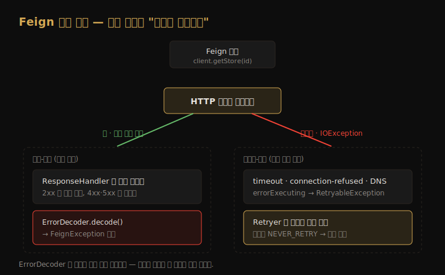
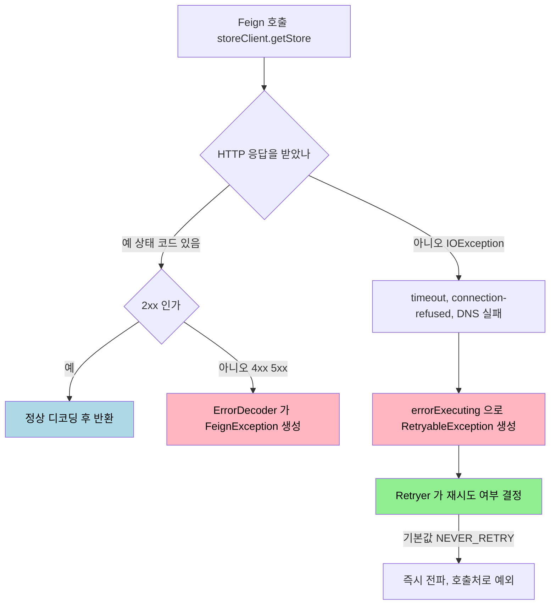

# 에러 모델 — 상태 코드 실패 vs 무응답 실패

---

> OpenFeign 의 에러 처리는 단 하나의 질문으로 갈립니다 — *상대 서버로부터 HTTP 상태 코드를 받았는가*. 404·500 처럼 상태 코드가 돌아온 실패는 `ErrorDecoder` 가 받고, 타임아웃·연결 거부·DNS 실패처럼 *상태 코드 자체가 없는* 실패는 `RetryableException` 이 되어 `ErrorDecoder` 가 도는 단계에 닿지 못합니다. 이 두 경로를 구분하지 못하면 "왜 내 `ErrorDecoder` 가 타임아웃 때는 안 불리지?" 라는 함정에 빠집니다.




## 1. 두 갈래 에러 경로 — 분기 기준은 "상태 코드 수신 여부"

> 같은 "호출 실패" 라도 응답을 받았느냐 못 받았느냐에 따라 Feign 내부에서 완전히 다른 길로 흐릅니다. 이 분기를 한 장의 흐름도로 먼저 머리에 새기는 편이 빠릅니다.

WebClient 를 다룰 때 [`../webflux/01-05.에러 처리와 재시도.md`](../webflux/01-05.에러%20처리와%20재시도.md) 에서 *HTTP 코드 기반 처리* 와 *transport·연산자 기반 처리* 가 두 계층으로 갈린다고 봤습니다. OpenFeign 도 같은 형식의 분업을 가지는데, 갈림목의 이름만 다릅니다 — 상태 코드를 받으면 `ErrorDecoder`, 못 받으면 `RetryableException` 입니다.



흐름도의 핵심은 오른쪽 갈래입니다. 응답이 아예 없는 실패는 `ErrorDecoder` 가 있는 *왼쪽 길* 에 닿지 못합니다. Feign 내부에서 응답을 받은 뒤 디코딩·에러 변환을 처리하는 단계(`ResponseHandler`)는 *응답 객체가 손에 있어야* 도는데, 무응답 실패는 그 단계 이전에 예외를 던지기 때문입니다. 이 갈래가 Feign 에러 모델에서 가장 자주 오해받는 지점이라, §3 에서 따로 떼어 봅니다.


## 2. 상태-경로 — ErrorDecoder (응답을 받은 경우만 호출)

> 상대 서버가 4xx·5xx 를 *응답으로* 돌려줬을 때만 `ErrorDecoder` 가 개입합니다. 응답 객체가 손에 있어야 디코딩할 대상이 있기 때문입니다.

`ErrorDecoder` 의 시그니처를 보면 두 번째 인자가 `Response` 입니다 — 즉 *응답이 존재한다는 전제* 가 메서드 정의에 박혀 있습니다.

```java
// feign.codec.ErrorDecoder
public interface ErrorDecoder {
    Exception decode(String methodKey, Response response);
}
```

Feign 코어의 기본 `ErrorDecoder` 구현은 4xx·5xx 응답을 `FeignException` 하위 예외로 변환합니다. 상태 코드별로 `FeignException.NotFound`(404), `FeignException.BadRequest`(400), `FeignException.InternalServerError`(500) 같은 자식 예외가 매핑됩니다. 호출처는 이 예외 타입이나 `status()` 값으로 분기합니다.

커스텀 `ErrorDecoder` 는 도메인 예외 변환의 자리입니다. 예를 들어 결제 서비스가 422 로 "잔액 부족" 을 알리면, 그 응답 바디를 읽어 `InsufficientBalanceException` 으로 바꾸는 책임이 여기 있습니다. 이때 변환 로직을 *사용처 서비스 코드* 가 아니라 `ErrorDecoder` 한 곳에 모으면, 같은 서비스를 호출하는 모든 인터페이스가 같은 예외 의미를 공유합니다.


## 3. 무응답-경로 — RetryableException (상태 코드 없음)

> 타임아웃·연결 거부·DNS 실패는 *응답이 없는* 실패입니다. Feign 은 전송 단계에서 터진 `IOException` 을 `RetryableException` 으로 바꿔 곧장 던지고, `ErrorDecoder` 가 도는 응답 처리 단계에는 닿지 않습니다.

여기가 가장 헷갈려 하는 자리입니다. "에러 처리를 `ErrorDecoder` 에 다 모았는데 왜 타임아웃은 거기로 안 오지?" 의 답이 이 절입니다. Feign 코어의 `SynchronousMethodHandler` 가 실제 HTTP 호출(`client.execute`)을 `try` 로 감싸는데, 여기서 `IOException` 이 나면 응답을 받기 *전* 이므로 catch 블록이 곧바로 예외를 만들어 던집니다.

```java
// feign.SynchronousMethodHandler (요지)
try {
    response = client.execute(request, options);
} catch (IOException e) {
    // 응답이 없는 실패 → errorExecuting 이 RetryableException 을 만들어 throw
    throw errorExecuting(request, e);
}
// ↓ 여기 아래의 응답 처리(ResponseHandler)에서만 ErrorDecoder 가 불린다
```

`errorExecuting(request, e)` 가 `IOException` 을 `RetryableException` 으로 감쌉니다. 핵심은 이 `throw` 가 *응답 처리 단계 이전* 에 일어난다는 점입니다 — `ErrorDecoder` 는 응답을 받은 뒤 `ResponseHandler` 안에서만 호출되므로, 무응답 실패는 그 코드에 도달할 길이 없습니다. "건너뛴다" 기보다 *그 단계 전에 빠져나간다* 가 정확합니다. 공식 레퍼런스도 순수 Feign 의 이 동작을 "it will automatically retry IOExceptions, treating them as transient network related exceptions" 라고 적습니다. 무응답 실패의 대표 유형은 다음과 같습니다.

- 연결 타임아웃(connect timeout): 상대 호스트와 TCP 연결을 맺지 못함
- 읽기 타임아웃(read timeout): 연결은 맺었으나 응답 본문이 제때 오지 않음
- 연결 거부(connection refused): 대상 포트에 수신 대기 중인 프로세스가 없음
- DNS 실패: 호스트명을 IP 로 해석하지 못함

이 타임아웃의 *기본값* 은 Feign 코어의 `Request.Options` 에 박혀 있습니다. 기본 생성자가 `connectTimeout=10초`, `readTimeout=60초` 입니다.

```java
// feign.Request.Options 기본 생성자
public Options() {
    this(10, TimeUnit.SECONDS, 60, TimeUnit.SECONDS, true);
}
```

운영에서 60초 읽기 타임아웃은 대체로 너무 깁니다 — 다운스트림이 느려질 때 60초씩 스레드를 붙잡고 있으면 호출 측 자원이 먼저 고갈됩니다. [`01-02.기본 설정과 인터페이스 선언.md`](01-02.기본%20설정과%20인터페이스%20선언.md) §3 에서 본 `connectTimeout`·`readTimeout` 설정 키로 서비스 특성에 맞게 줄이는 편이 안전합니다.


## 4. Retryer — 기본값은 NEVER_RETRY

> 무응답 실패가 `RetryableException` 으로 래핑된다고 해서 *자동으로 재시도되는 것은 아닙니다*. Spring Cloud OpenFeign 은 재시도를 기본적으로 꺼 둡니다.

여기서 순수 Feign 과 Spring Cloud OpenFeign 의 기본값이 갈립니다. 순수 Feign 의 기본 `Retryer` 는 `IOException` 을 자동 재시도합니다. 그 기본 간격·횟수는 Feign 코어 소스에 박혀 있는데, 기본 생성자가 `period=100ms`, `maxPeriod=1초`, `maxAttempts=5` 이고 매 시도마다 `1.5` 의 거듭제곱으로 간격을 늘립니다(`maxPeriod` 에서 상한). 반면 Spring Cloud OpenFeign 은 이 동작을 의도적으로 뒤집습니다. 공식 레퍼런스의 문장이 명확합니다.

> "A bean of `Retryer.NEVER_RETRY` with the type `Retryer` is created by default, which will disable retrying."

왜 끄는 게 기본일까요? 자동 재시도는 *멱등성이 보장되지 않는 호출* 에서 위험하기 때문입니다. POST 결제 요청이 읽기 타임아웃으로 실패했는데 Feign 이 조용히 재시도하면, 서버는 결제를 두 번 처리했을 수 있습니다. 그래서 Spring Cloud 는 "재시도는 호출자가 멱등성을 확인하고 명시적으로 켜라" 는 보수적 기본값을 택합니다. 재시도를 켜려면 `Retryer` 빈을 직접 등록합니다.

```java
@Configuration
public class FeignRetryConfig {
    @Bean
    public Retryer retryer() {
        // 인자 생략 시 기본값은 100ms, 1s, 5회. 여기서는 3회로 좁힌다
        return new Retryer.Default(100, TimeUnit.SECONDS.toMillis(1), 3);
    }
}
```

`Retryer.continueOrPropagate(RetryableException)` 가 매 실패마다 호출돼 *한 번 더 시도할지, 전파할지* 를 결정합니다. `NEVER_RETRY` 는 항상 전파를 택하므로, 무응답 실패가 한 번 나면 곧장 호출처로 예외가 올라갑니다.


## 5. ErrorDecoder 로 재시도 강제 — 503 + Retry-After

> 두 경로는 한 지점에서 교차합니다. `ErrorDecoder` 가 *상태 코드를 보고* `RetryableException` 을 반환하면, 상태-경로의 실패가 무응답-경로의 재시도 메커니즘으로 넘어갑니다.

`ErrorDecoder.decode()` 의 반환 타입은 `Exception` 입니다. 보통은 `FeignException` 을 반환하지만, `RetryableException` 을 반환하면 그 호출은 `Retryer` 로 넘어가 재시도 대상이 됩니다. 그런데 이 교차는 *기본 디코더에 이미 들어 있습니다*. Feign 코어의 기본 `ErrorDecoder` 구현이 응답에 `Retry-After` 헤더가 있으면 `FeignException` 대신 `RetryableException` 을 반환합니다. 소스의 요지는 다음과 같습니다.

```java
// feign 코어 기본 ErrorDecoder 의 decode (요지)
FeignException exception = errorStatus(methodKey, response, ...);
Long retryAfter = retryAfterDecoder.apply(firstOrNull(response.headers(), RETRY_AFTER));
if (retryAfter != null) {
    // Retry-After 가 있으면 그 시각 정보를 담아 RetryableException 으로 승격
    return new RetryableException(response.status(), exception.getMessage()
            , response.request().httpMethod(), exception, retryAfter
            , response.request(), methodKey);
}
return exception; // 없으면 일반 FeignException
```

`Retry-After` *없이도* 특정 상태(예: 503)를 재시도하고 싶다면 커스텀 `ErrorDecoder` 에서 직접 `RetryableException` 을 반환하면 됩니다. 어느 쪽이든 주의할 점은 같습니다. `RetryableException` 을 반환해도 `Retryer` 가 `NEVER_RETRY` 면 결국 전파됩니다. 재시도를 실제로 일으키려면 §4 의 `Retryer` 빈 등록이 *함께* 있어야 합니다. `ErrorDecoder` 는 "이 실패는 재시도해도 된다" 는 신호를 만들 뿐, 재시도 횟수·간격을 결정하는 것은 `Retryer` 입니다.


## 6. 여기서 멈추는 선 — 재시도 폭주·서킷은 resilience/ 로

> Feign 의 에러 모델은 *한 번의 호출* 안에서 일어나는 일까지입니다. 그 너머 — 재시도가 폭주하지 않게 막고, 연속 실패 시 호출 자체를 차단하는 — 는 별도 회복탄력성 계층의 몫입니다.

Feign 의 `Retryer` 는 "몇 번, 얼마 간격으로 재시도할지" 만 정합니다. 그런데 다운스트림이 죽었을 때 모든 호출자가 동시에 재시도하면 *재시도 폭주(retry storm)* 가 일어나 죽어가는 서버에 트래픽을 더 퍼붓습니다. 이걸 막는 jitter·exponential backoff, 그리고 연속 실패 시 호출을 아예 끊는 Circuit Breaker 는 Feign 의 책임 범위 밖입니다.

이 자리는 옆 폴더 `resilience/` 가 SSOT 입니다. 본 문서는 경계만 긋고 위임합니다.

- 재시도 백오프·jitter·재시도 폭주 방지 → [`../resilience/01-03.Retry — exponential backoff·jitter·재시도 폭주 방지.md`](../resilience/01-03.Retry%20—%20exponential%20backoff·jitter·재시도%20폭주%20방지.md)
- Circuit Breaker 상태 전이(CLOSED·OPEN·HALF_OPEN) → [`../resilience/01-02.Circuit Breaker 상세 — 상태 전이와 Sliding Window.md`](../resilience/01-02.Circuit%20Breaker%20상세%20—%20상태%20전이와%20Sliding%20Window.md)
- 타임아웃을 별도 스레드로 강제하는 TimeLimiter → [`../resilience/01-05.Rate Limiter & Time Limiter — 트래픽 제어와 타임아웃.md`](../resilience/01-05.Rate%20Limiter%20&%20Time%20Limiter%20—%20트래픽%20제어와%20타임아웃.md)

Feign 의 fallback·Circuit Breaker *배선* 방법은 다음 문서 [`01-04.실무 통합 — LoadBalancer·Circuit Breaker·fallback.md`](01-04.실무%20통합%20—%20LoadBalancer·Circuit%20Breaker·fallback.md) 에서 이어집니다.


## 7. 면접 대비 체크리스트

> 본 문서를 다 읽은 뒤 다음 질문에 답할 수 있어야 합니다.

1. `ErrorDecoder` 가 호출되지 않는 실패 유형은 무엇이며, 왜 그렇습니까? (무응답 — timeout·connection-refused·DNS. 디코딩할 `response` 객체가 없어 `RetryableException` 으로 우회)
2. Spring Cloud OpenFeign 의 기본 `Retryer` 는 무엇이고, 순수 Feign 과 어떻게 다릅니까? 왜 이렇게 설계됐습니까? (`NEVER_RETRY` vs `Retryer.Default` 1.5배·5회. 비멱등 호출의 중복 실행 위험 때문)
3. `ErrorDecoder` 가 특정 상태 코드(예: 503)에 대해 재시도를 일으키게 하려면 무엇을 반환하며, 그것만으로 충분합니까? (`RetryableException` 반환. `Retryer` 빈이 함께 등록돼야 실제 재시도 발생)


## 다음에 읽을 것

- [`01-04.실무 통합 — LoadBalancer·Circuit Breaker·fallback.md`](01-04.실무%20통합%20—%20LoadBalancer·Circuit%20Breaker·fallback.md) — fallback·서킷브레이커를 Feign 에 배선하는 법
- [`../resilience/01-01.Resilience4j 개요 — 5가지 모듈과 도입 결정.md`](../resilience/01-01.Resilience4j%20개요%20—%205가지%20모듈과%20도입%20결정.md) — 재시도·서킷·격리·속도제한을 한 라이브러리로
- [`../webflux/01-05.에러 처리와 재시도.md`](../webflux/01-05.에러%20처리와%20재시도.md) — WebClient 의 같은 분업(코드 기반 vs 연산자 기반)
