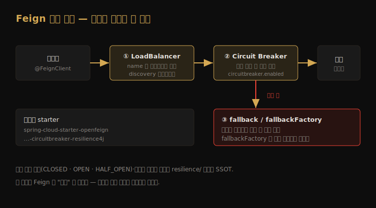

# 실무 통합 — LoadBalancer·Circuit Breaker·fallback

---

> 입문 챕터의 최소 예제는 `url` 을 직접 박은 단일 호출이었습니다. 실무의 OpenFeign 은 *service discovery 로 인스턴스를 고르고*, *서킷브레이커로 연속 실패를 끊고*, *fallback 으로 장애 시 대체 응답을 내놓는* 세 장치와 함께 배선됩니다. 본 문서는 이 세 가지를 Feign 쪽에서 *어떻게 켜는가* 에 집중하고, 서킷·재시도의 내부 이론은 옆 폴더 `resilience/` 로 위임합니다.




## 1. name 기반 해석 — Spring Cloud LoadBalancer

> `@FeignClient(name=...)` 의 `name` 은 단순 식별자가 아니라 *service discovery 키* 입니다. classpath 에 LoadBalancer 가 있으면 이 이름이 실제 인스턴스 주소로 풀립니다.

입문 챕터에서 `url` 을 명시하면 service discovery 를 건너뛴다고 봤습니다. `url` 을 빼고 `name` 만 두면 그때부터 Spring Cloud LoadBalancer 가 개입합니다. classpath 에 `spring-cloud-starter-loadbalancer` 가 있으면 Feign 호출이 `FeignBlockingLoadBalancerClient` 로 감싸지고, `name` 을 discovery 소스(Eureka·Consul·Kubernetes)에 질의해 살아 있는 인스턴스 목록을 받은 뒤 라운드로빈으로 하나를 고릅니다.

```java
// url 없음 → name="stores" 를 discovery 로 해석
@FeignClient(name = "stores")
public interface StoreClient {
    @GetMapping("/stores/{id}")
    Store getStore(@PathVariable("id") Long id);
}
```

`http://stores/stores/123` 처럼 호스트 자리에 *서비스 이름* 이 들어간 URL 이 만들어지고, LoadBalancer 가 이 `stores` 를 실제 IP·포트로 치환합니다. 호출 코드는 인스턴스가 몇 개인지, 어디 떠 있는지 알 필요가 없습니다 — 이 무지가 곧 MSA 에서 OpenFeign 이 권장되는 이유입니다.


## 2. Circuit Breaker 켜기 — circuitbreaker.enabled

> 연속 실패가 쌓이면 호출 자체를 잠시 끊어 죽어가는 서버를 보호하는 게 Circuit Breaker 입니다. Feign 은 프로퍼티 한 줄로 모든 메서드를 서킷으로 감쌉니다.

배선은 두 단계입니다. 의존성을 추가하고 프로퍼티를 켭니다. 공식 레퍼런스의 문장이 조건을 명확히 합니다. "If Spring Cloud CircuitBreaker is on the classpath and `spring.cloud.openfeign.circuitbreaker.enabled=true`, Feign will wrap all methods with a circuit breaker."

```gradle
dependencies {
    implementation 'org.springframework.cloud:spring-cloud-starter-openfeign'
    implementation 'org.springframework.cloud:spring-cloud-starter-circuitbreaker-resilience4j'
}
```

```yaml
spring:
  cloud:
    openfeign:
      circuitbreaker:
        enabled: true
```

이 한 줄이 켜지면 Feign 의 모든 메서드 호출이 Resilience4j Circuit Breaker 를 통과합니다. 서킷이 *열린(OPEN)* 동안에는 실제 HTTP 호출 없이 곧장 실패하고, 일정 시간 뒤 *반열림(HALF_OPEN)* 으로 넘어가 시험 호출을 보냅니다. 이 상태 전이의 임계값·윈도우 설정은 Resilience4j 쪽 설정이며, 이론은 [`../resilience/01-02.Circuit Breaker 상세 — 상태 전이와 Sliding Window.md`](../resilience/01-02.Circuit%20Breaker%20상세%20—%20상태%20전이와%20Sliding%20Window.md) 가 SSOT 입니다.


## 3. fallback vs fallbackFactory

> 서킷이 열렸거나 호출이 실패했을 때 *예외를 던지는 대신 대체 응답* 을 주고 싶을 때 fallback 을 답니다. 실패 원인을 알아야 하면 fallbackFactory 를 씁니다.

`@FeignClient` 의 `fallback` 속성에 인터페이스 구현 클래스를 지정하면, 호출이 실패할 때 그 구현의 메서드가 대신 불립니다. 캐시된 기본값·빈 목록·축약된 응답을 돌려주는 자리입니다.

```java
@FeignClient(name = "stores", fallback = StoreClientFallback.class)
public interface StoreClient {
    @GetMapping("/stores/{id}")
    Store getStore(@PathVariable("id") Long id);
}

@Component
class StoreClientFallback implements StoreClient {
    @Override
    public Store getStore(Long id) {
        return Store.unavailable(id); // 장애 시 대체 응답
    }
}
```

`fallback` 은 *왜 실패했는지* 를 모릅니다 — 그냥 "실패했다" 만 압니다. 실패 원인(타임아웃인지, 404 인지, 서킷이 열린 건지)에 따라 다르게 응답하려면 `fallbackFactory` 를 씁니다. 팩토리는 `Throwable cause` 를 인자로 받아, 원인별 분기가 가능한 fallback 인스턴스를 만들어 줍니다.

```java
@FeignClient(name = "stores", fallbackFactory = StoreClientFallbackFactory.class)
public interface StoreClient {
    @GetMapping("/stores/{id}")
    Store getStore(@PathVariable("id") Long id);
}

@Component
class StoreClientFallbackFactory implements FallbackFactory<StoreClient> {
    @Override
    public StoreClient create(Throwable cause) {
        return id -> {
            log.warn("stores 호출 실패, 원인={}", cause.toString());
            return Store.unavailable(id);
        };
    }
}
```

`fallback`·`fallbackFactory` 는 `circuitbreaker.enabled=true` 일 때만 동작합니다. 서킷브레이커가 호출을 감싸야 그 실패 지점에서 fallback 으로 분기할 수 있기 때문입니다.


## 4. 운영 로깅 — 켜는 자리와 끄는 자리

> 실무에서 Feign 호출이 "느린데 어디서 막히는지" 를 보려면 로깅이 필요합니다. 다만 운영에 `full` 을 켜면 개인정보가 흐르므로, 레벨 선택이 곧 운영 위생입니다.

[`01-02.기본 설정과 인터페이스 선언.md`](01-02.기본%20설정과%20인터페이스%20선언.md) §4 에서 `loggerLevel` 4단계를 봤습니다. 실무 배선의 관점에서 다시 보면, 운영 기본은 `none` 또는 `basic` 이고, 인증·인터셉터 문제를 좇을 때만 `headers`, 로컬에서만 `full` 입니다.

호출 패턴 모니터링 목적이면 `basic` 이 균형점입니다. 요청 method·URL·응답 상태·소요 시간만 찍히므로 본문은 새지 않으면서 "어느 호출이 느린가" 는 보입니다. 다운스트림 지연을 추적할 때 §1 의 LoadBalancer 가 *어느 인스턴스* 를 골랐는지까지 보고 싶으면, 별도 인터셉터로 선택된 호스트를 로그에 남기는 편이 `full` 을 켜는 것보다 안전합니다.


## 5. 면접 대비 체크리스트

> 본 문서를 다 읽은 뒤 다음 질문에 답할 수 있어야 합니다.

1. `@FeignClient(name="stores")` 에서 `url` 을 생략하면 `name` 은 어떻게 실제 주소로 풀립니까? 어떤 컴포넌트가 개입합니까? (Spring Cloud LoadBalancer — `FeignBlockingLoadBalancerClient` 가 discovery 질의 후 라운드로빈)
2. Feign 에 서킷브레이커를 켜는 두 가지 조건은 무엇입니까? (classpath 에 Spring Cloud CircuitBreaker + `spring.cloud.openfeign.circuitbreaker.enabled=true`)
3. `fallback` 과 `fallbackFactory` 는 어떻게 다르며, 언제 후자를 선택합니까? (후자는 `Throwable cause` 를 받아 실패 원인별 분기 가능)


## 다음에 읽을 것

- [`01-05.대안과 유지보수 상태 — @HttpExchange·RestClient.md`](01-05.대안과%20유지보수%20상태%20—%20@HttpExchange·RestClient.md) — OpenFeign 의 대안과 선택 기준
- [`../resilience/01-01.Resilience4j 개요 — 5가지 모듈과 도입 결정.md`](../resilience/01-01.Resilience4j%20개요%20—%205가지%20모듈과%20도입%20결정.md) — 서킷·재시도·격리·속도제한 5모듈
- [`01-03.에러 모델 — 상태 코드 실패 vs 무응답 실패.md`](01-03.에러%20모델%20—%20상태%20코드%20실패%20vs%20무응답%20실패.md) — fallback 이 받는 실패가 어디서 오는지
