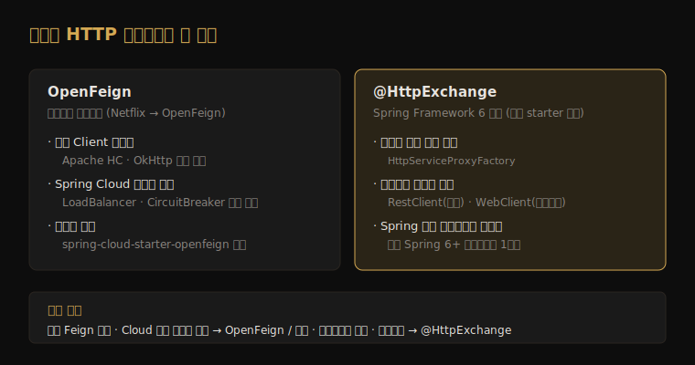

# 대안과 유지보수 상태 — @HttpExchange·RestClient

---

> OpenFeign 만 선언적 HTTP 클라이언트인 시절은 끝났습니다. Spring Framework 6 부터 프레임워크 자체에 `@HttpExchange` 선언적 인터페이스가 들어왔고, RestClient·WebClient 를 백엔드로 갈아 끼울 수 있습니다. 본 문서는 OpenFeign 의 *현재 위치* 를 짚고, Spring-native 대안과 무엇을 기준으로 갈리는지 정리합니다.




## 1. OpenFeign 의 현재 위치와 유지보수 상태

> OpenFeign 은 죽지 않았지만, *Spring 이 미는 1순위* 도 아닙니다. 이 어중간한 위치를 정확히 알아야 신규 프로젝트의 선택이 흔들리지 않습니다.

Feign 은 본래 Netflix OSS 의 일부였습니다. Netflix 가 다수 OSS 컴포넌트를 유지보수 모드로 돌린 뒤, Feign 은 `OpenFeign` 커뮤니티 프로젝트로 이관돼 지금도 활발히 관리됩니다. Spring Cloud OpenFeign 은 이 OpenFeign 코어를 Spring 생태계(LoadBalancer·CircuitBreaker·설정)에 통합하는 어댑터 계층입니다.

핵심은 *Spring Cloud OpenFeign 도 신규 기능 추가보다 유지보수 중심* 이라는 점입니다. Spring 팀은 새 프로젝트에 프레임워크 내장 `@HttpExchange` 를 권합니다. 그렇다고 OpenFeign 을 걷어내야 한다는 뜻은 아닙니다 — 이미 Feign 으로 짜인 코드, Spring Cloud LoadBalancer 와의 깊은 통합이 필요한 자리는 OpenFeign 이 여전히 합리적입니다. 결정은 §3 의 기준으로 내립니다.


## 2. Spring-native 대안 — @HttpExchange

> `@HttpExchange` 는 Spring Framework 6 가 내놓은 선언적 HTTP 인터페이스입니다. OpenFeign 과 발상이 같지만 *별도 의존성 없이* Spring 안에서 동작하고, 실제 호출은 RestClient 또는 WebClient 가 수행합니다.

작성 방식은 OpenFeign 과 거의 같습니다. 인터페이스에 어노테이션을 붙이고, 프록시가 구현체를 만듭니다. 차이는 어노테이션 이름(`@GetExchange` 등)과, 프록시를 만드는 주체가 `HttpServiceProxyFactory` 라는 점입니다.

```java
// 1) 선언적 인터페이스 — OpenFeign 과 발상 동일
public interface StoreClient {
    @GetExchange("/stores/{id}")
    Store getStore(@PathVariable Long id);
}

// 2) RestClient(동기) 또는 WebClient(리액티브) 를 백엔드로 프록시 생성
RestClient restClient = RestClient.create("http://stores-service:8080");
HttpServiceProxyFactory factory = HttpServiceProxyFactory
        .builderFor(RestClientAdapter.create(restClient))
        .build();
StoreClient client = factory.createClient(StoreClient.class);
```

여기서 설계의 핵심이 드러납니다. `@HttpExchange` 는 *전송을 직접 하지 않습니다* — `HttpServiceProxyFactory` 에 어떤 어댑터를 끼우느냐로 동기(RestClient)·리액티브(WebClient)가 결정됩니다. OpenFeign 이 자체 `Client` 추상화를 가진 것과 달리, `@HttpExchange` 는 Spring 의 기존 HTTP 클라이언트를 *재사용* 합니다. RestClient·WebClient 자체의 빌더·필터 사용법은 [`../webflux/README.md`](../webflux/README.md) 갈래가 다룹니다.


## 3. 결정 기준 — 무엇으로 갈리는가

> "OpenFeign 이냐 @HttpExchange 냐" 는 취향이 아니라 *프로젝트 맥락* 으로 갈립니다. 세 축으로 정리합니다.

| 기준 | OpenFeign | @HttpExchange (Spring-native) |
|------|-----------|------------------------------|
| 프로젝트 시점 | 기존 Feign 자산이 있는 코드베이스 | 신규 Spring 6+ 프로젝트 |
| 의존성 | spring-cloud-starter-openfeign 필요 | 프레임워크 내장 (별도 starter 불필요) |
| 전송 계층 | 자체 Client (Apache HC·OkHttp 교체) | RestClient(동기)·WebClient(리액티브) 어댑터 |

세 축을 한 문장으로 요약하면 이렇습니다. *Spring Cloud LoadBalancer·CircuitBreaker 와의 기성 통합* 이 핵심이면 OpenFeign 이 여전히 빠른 길이고, *프레임워크 표준만으로 가볍게* 가고 싶거나 신규 프로젝트면 `@HttpExchange` 가 미래 방향입니다. 리액티브 스택이면 `@HttpExchange` + WebClient 어댑터가 자연스럽고, 이 경우 OpenFeign 은 애초 후보가 아닙니다 — OpenFeign 은 블로킹 모델이기 때문입니다.

입문 챕터([`01-01`](01-01.OpenFeign%20입문과%20WebClient%20비교.md))의 결정 트리에 한 갈래가 더 붙는 셈입니다. "선언적 인터페이스를 원한다" 까지 왔을 때, 신규/표준이면 `@HttpExchange`, 기존 Feign 자산/Cloud 통합이면 OpenFeign 으로 갈립니다.


## 4. 면접 대비 체크리스트

> 본 문서를 다 읽은 뒤 다음 질문에 답할 수 있어야 합니다.

1. OpenFeign 의 Spring-native 대안은 무엇이며, 실제 HTTP 호출은 무엇이 수행합니까? (`@HttpExchange` — `HttpServiceProxyFactory` 에 RestClient·WebClient 어댑터를 끼워 전송)
2. `@HttpExchange` 와 OpenFeign 의 전송 계층 설계는 어떻게 다릅니까? (전자는 Spring 기존 클라이언트 재사용, 후자는 자체 `Client` 추상화)
3. 신규 프로젝트인데도 OpenFeign 을 고르는 게 합리적인 상황은 언제입니까? (Spring Cloud LoadBalancer·CircuitBreaker 와의 기성 통합이 핵심 요구일 때)


## 다음에 읽을 것

- [`01-01.OpenFeign 입문과 WebClient 비교.md`](01-01.OpenFeign%20입문과%20WebClient%20비교.md) — 선언적 vs 명령형 결정 트리(대안 갈래의 출발점)
- [`../webflux/README.md`](../webflux/README.md) — RestClient·WebClient 자체 사용법
- [Spring HTTP Interface Reference](https://docs.spring.io/spring-framework/reference/integration/rest-clients.html) — `@HttpExchange` 공식 문서
