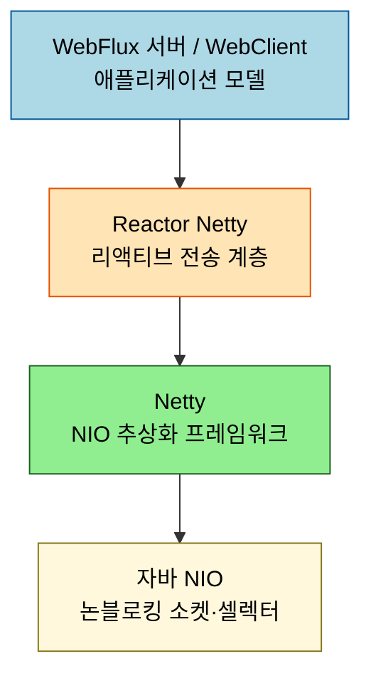
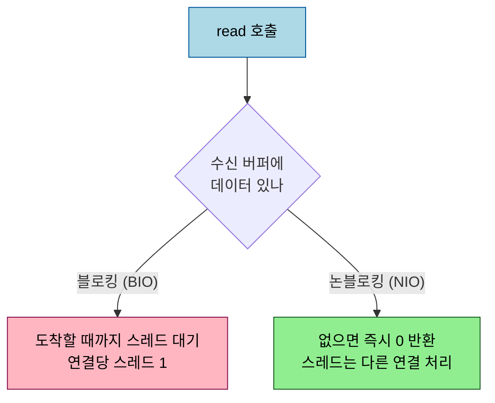

# Reactor Netty 입문 — WebFlux의 하부 전송 계층

---

> WebFlux 가 톰캣이 아니라 Netty 위에서 돈다는 사실은 [`01_core/04-01`](../../01_core/04-01.WebFlux%20서버%20—%20리액티브%20스택과%20어노테이션%20모델.md) 에서 봤습니다. 그 Netty 를 리액티브하게 감싼 것이 Reactor Netty 입니다. 본 문서는 Reactor Netty 가 무엇이고, 왜 WebFlux 의 기본 전송 계층인지, 그 토대인 논블로킹 소켓이 어떻게 한 스레드로 다중 연결을 처리하는지를 다룹니다.

## 0. 학습 목표

이 문서를 읽고 나면 Reactor Netty 가 무엇인지, WebFlux·WebClient 와 어떤 계층 관계인지, 논블로킹 소켓이 블로킹 방식과 무엇이 다른지를 설명할 수 있습니다. 채널 파이프라인·ByteBuf 같은 세부는 후속 편으로 미루고, 여기서는 "이 계층이 무엇이며 어디에 서 있는가" 를 잡습니다.

## 1. Reactor Netty 란

Reactor Netty 는 Netty 위에 Reactive Streams 를 얹은 네트워크 엔진입니다. 공식 설명으로는 Netty 기반의 논블로킹 TCP·HTTP·UDP·QUIC 클라이언트와 서버를 제공하며, backpressure(소비자가 감당할 만큼만 흘려보내는 흐름 제어)를 지원합니다. 마이크로서비스처럼 많은 연결을 적은 자원으로 다뤄야 하는 환경을 겨냥합니다.

토대인 Netty 는 자바 NIO 를 쓰기 쉽게 추상화한 네트워크 프레임워크입니다. 순수 자바 소켓 코드로 서버를 짜면 버퍼 관리·논블로킹 처리·예외 상황이 모두 손에 떨어지지만, Netty 는 이를 추상화된 API 로 감싸 더 안정적이고 빠르게 만듭니다. byte stream 을 다루는 `ByteBuf`, 연결마다 컨텍스트를 유지하는 `Channel`, TCP·SSL 지원이 그 예입니다. Reactor Netty 는 다시 그 위에 `Mono`/`Flux` 기반 API 를 올려, Spring 의 리액티브 코드와 자연스럽게 맞물리게 합니다.

## 2. WebFlux·WebClient 와의 계층 관계

Reactor Netty 가 서 있는 자리는 애플리케이션 코드 *아래* 입니다. WebFlux 서버([`01_core/04-01`](../../01_core/04-01.WebFlux%20서버%20—%20리액티브%20스택과%20어노테이션%20모델.md))가 `@RestController`·`RouterFunction` 으로 요청 처리를 선언하면, 그 요청이 실제 소켓을 오가는 일은 Reactor Netty 가 맡습니다. 아웃바운드인 WebClient 도 기본 전송으로 Reactor Netty 를 씁니다.

이 계층 구조 덕에 애플리케이션 코드는 소켓을 직접 다루지 않고도 논블로킹 이점을 누립니다. WebFlux 가 어노테이션 모델이든 함수형이든, 그 아래 전송은 같은 Reactor Netty 라는 점이 핵심입니다.

## 3. 논블로킹 소켓의 동작

Reactor Netty 의 성능 이점은 결국 *논블로킹 소켓* 에서 옵니다. 블로킹(BIO) 소켓은 `read` 를 호출하면 데이터가 도착할 때까지 그 스레드가 멈춰 기다립니다. 그래서 연결 하나에 스레드 하나가 묶이고, 연결이 많아지면 스레드가 동납니다. 논블로킹(NIO) 소켓은 다릅니다. `read` 를 호출했을 때 아직 데이터가 수신 버퍼에 도달하지 않았으면 기다리지 않고 즉시 0 을 반환합니다. 스레드는 멈추지 않고 다른 연결을 처리하러 갑니다.

덕분에 한 스레드(또는 적은 수의 이벤트 루프 스레드)가 여러 연결을 동시에 돌볼 수 있습니다. 대신 "언제 읽고 언제 쓸지" 를 직접 챙겨야 해 프로그램 복잡도가 올라갑니다. Netty 는 그 복잡도를 셀렉터·이벤트 루프·핸들러로 추상화해 개발자가 0 반환 처리 같은 저수준 분기를 직접 짜지 않게 합니다.

## 4. Netty 가 추상화하는 것

Netty 가 감싸 주는 핵심 부품은 다음과 같습니다. 순수 자바 소켓이었다면 이 일들을 모두 직접 다뤄야 했을 자리입니다.

| 부품 | 역할 | 순수 소켓 대비 |
|------|------|----------------|
| `ByteBuf` | byte stream 을 읽기·쓰기 인덱스로 다룸 | 자바 `ByteBuffer` 의 flip·position 관리 불편을 개선 |
| `Channel` | 하나의 연결을 표현, 컨텍스트 유지 | 연결별 세션 상태를 직접 들고 다닐 필요 없음 |
| 프로토콜 지원 | TCP·SSL 기본 제공 | 핸드셰이크·암호화를 직접 구현하지 않음 |

`Channel` 안에 컨텍스트를 유지한다는 점은 세션 관리를 가능하게 합니다. 한 연결로 오가는 요청·응답이 같은 컨텍스트를 공유하므로, 연결 단위 상태(인증 정보, 누적 버퍼 등)를 자연스럽게 들고 갈 수 있습니다. 이 부품들이 어떻게 맞물려 요청을 처리하는지 — 채널 파이프라인과 코덱, 이벤트 루프, `ByteBuf` 의 인덱스 구조 — 는 본 묶음의 후속 편에서 한 편씩 다룹니다([README 학습 순서](README.md) 참고).

## 5. 면접 대비 체크리스트

> 이 문서를 다 읽은 뒤 다음 질문에 답할 수 있어야 합니다.

1. Reactor Netty 는 Netty 와 어떤 관계입니까? WebFlux·WebClient 와는 어느 계층에 서 있습니까?
2. 논블로킹 소켓의 `read` 는 데이터가 없을 때 어떻게 동작합니까? 이것이 블로킹 방식과 비교해 무엇을 가능하게 합니까?
3. 순수 자바 소켓 대신 Netty 를 쓰면 무엇이 편해집니까? Netty 가 추상화하는 핵심 부품을 한 가지 이상 말할 수 있습니까?
