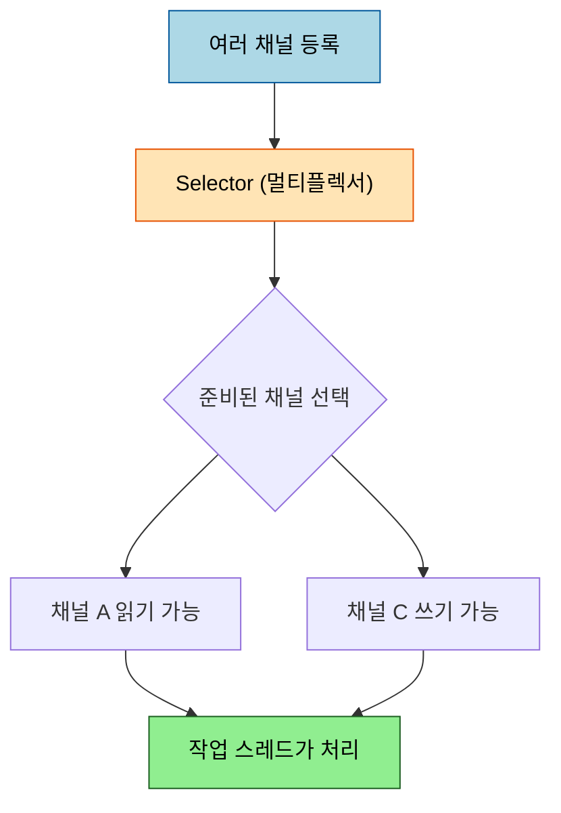

# 이벤트 기반 프로그래밍과 BIO vs NIO

---

> [`01-01`](01-01.Reactor%20Netty%20입문%20—%20WebFlux의%20하부%20전송%20계층.md) 에서 논블로킹 소켓이 한 스레드로 다중 연결을 처리한다고 봤습니다. 그 "한 스레드가 여러 연결을 어떻게 돌보는가" 의 답이 *이벤트 기반 프로그래밍* 이고, 그것을 가능하게 한 자바의 토대가 *NIO* 입니다. 본 문서는 BIO 와 NIO 의 차이, 그리고 Netty 가 선 리액터 패턴을 다룹니다.

## 0. 학습 목표

> 이 편이 끝나면 무엇을 답할 수 있어야 하는지 먼저 정합니다.

이 문서를 읽고 나면 BIO 와 NIO 가 입출력·버퍼·블로킹 면에서 무엇이 다른지, 이벤트 기반 프로그래밍과 리액터 패턴이 무엇인지, 그리고 BIO 와 NIO 중 언제 무엇을 고를지 설명할 수 있습니다.

## 1. BIO vs NIO — 스트림과 채널

> 블로킹 BIO 와 논블로킹 NIO 가 입출력 방식·버퍼·블로킹에서 어떻게 갈리는지 짚습니다.

자바의 전통적 입출력은 BIO(Blocking I/O)입니다. `ServerSocket`·`Socket` 으로 `read()`·`write()`·`accept()` 를 호출하면 그 작업이 끝날 때까지 스레드가 블로킹됩니다. 그래서 한 연결에 한 스레드가 묶이고, 연결 하나만 처리할 수 있습니다([`01-01 §3`](01-01.Reactor%20Netty%20입문%20—%20WebFlux의%20하부%20전송%20계층.md) 의 블로킹 소켓이 이것입니다). JDK 1.4 가 더한 NIO(New I/O)는 입출력 시 스레드가 블로킹되지 않아, 준비된 채널만 골라 처리합니다.

| 구분 | BIO | NIO |
|------|-----|-----|
| 입출력 방식 | 스트림 | 채널 |
| 버퍼 | 넌버퍼 | 버퍼 |
| 비동기 | 지원 안 함 | 지원 |
| 블로킹 | 블로킹만 | 블로킹·논블로킹 모두 |

두 가지 차이가 핵심입니다. 첫째, *스트림 vs 채널* — 스트림은 입력·출력이 단방향으로 나뉘어 읽기는 입력 스트림, 쓰기는 출력 스트림을 따로 써야 합니다. 채널은 양방향이라 하나로 입출력을 다 합니다. 둘째, *넌버퍼 vs 버퍼* — BIO 는 1바이트씩 직접 읽고 써서 느리고(그래서 `BufferedInputStream` 같은 보조 스트림을 덧대야 합니다), NIO 는 채널이 데이터를 버퍼에 모아 한 번에 처리해 성능이 낫습니다.

## 2. Selector — 한 스레드가 여러 채널을 돌보는 법

> NIO 가 한 스레드로 다중 연결을 굴리는 핵심 객체, 셀렉터의 동작을 봅니다.

NIO 가 한 스레드로 다중 연결을 처리하는 비결은 **셀렉터(Selector)** 입니다. 셀렉터는 여러 채널을 등록해 두고, 그중 *지금 바로 읽거나 쓸 준비가 된* 채널만 골라 알려 주는 멀티플렉서입니다. 스레드는 준비 안 된 채널을 기다리며 멈추지 않고, 준비된 것만 처리하므로 블로킹이 사라집니다.

톰캣의 NIO Connector 도 이 원리로 동작합니다. Acceptor 스레드가 요청을 받아 큐(버퍼)에 적재하면, 워커 스레드가 큐에서 꺼내 처리합니다. 덕분에 "N 커넥션 = 1 스레드" 가 가능해져 과도한 스레드 생성을 피합니다.

## 3. 이벤트 기반 프로그래밍과 리액터 패턴

> "준비된 채널만 처리" 가 이벤트로 추상화되고, Netty 가 선 리액터 패턴으로 정리되는 흐름을 봅니다.

NIO 의 "준비된 채널만 처리" 는 곧 *이벤트* 로 추상화됩니다. 소켓 연결, 데이터 수신·송신 같은 사건을 이벤트로 정의하고, 그 이벤트가 발생하면 미리 등록해 둔 처리 코드가 자동으로 실행됩니다. 프로그래밍 방식은 Sync I/O → 멀티스레드 → 스레드 풀 → 논블로킹(셀렉터) → 이벤트 기반 → 리액터 순으로 발전했고, Netty 가 선 자리가 마지막 리액터 패턴입니다.

리액터 패턴은 이벤트를 반응하는 객체(reactor)를 두어, 이벤트가 발생하면 애플리케이션 대신 reactor 가 받아 핸들러에 전달하는 구조입니다. Netty 는 채널에 직접 `read`/`write` 하지 않고 *데이터 핸들러* 를 거치게 해, 서버 코드를 클라이언트에서 재사용하고 이벤트별로 로직을 분리하며 에러 이벤트까지 함께 정의해 에러 처리 부담을 낮춥니다. 비동기 결과를 다루는 퓨처(future) 패턴 — 호출 즉시 결과 확인용 객체를 돌려받고, 리스너를 등록해 완료·에러 이벤트를 통지받는 방식 — 도 같은 이벤트 기반 발상 위에 있습니다.

## 4. BIO와 NIO 선택 기준

> NIO 가 항상 정답은 아니라 — 연결 수와 데이터 크기에 따라 BIO 가 나은 자리를 짚습니다.

NIO 가 항상 정답은 아닙니다. *연결 클라이언트 수가 많고, 한 입출력 처리가 오래 걸리지 않는* 경우에 NIO 가 유리합니다. 과도한 스레드 생성을 피하고 스레드를 재사용하며, 운영체제 버퍼(다이렉트 버퍼)로 입출력 성능도 좋아집니다. 반대로 *연결 수가 적고 대용량 데이터를 순차 처리* 해야 하면 BIO 가 나을 수 있습니다. NIO 는 모든 입출력이 버퍼를 거쳐야 해 즉시 처리하는 BIO 보다 복잡하고, 입출력이 오래 걸리면 대기 작업이 쌓여 제한된 스레드가 오히려 불리해집니다.

## 5. 면접 대비 체크리스트

> 이 문서를 다 읽은 뒤 다음 질문에 답할 수 있어야 합니다.

1. BIO 와 NIO 는 입출력 방식(스트림·채널)과 버퍼 면에서 어떻게 다릅니까?
2. NIO 가 한 스레드로 여러 연결을 처리하는 핵심 객체는 무엇이고, 어떻게 동작합니까?
3. 리액터 패턴에서 reactor 와 event handler 는 각각 무슨 일을 합니까?
4. 연결 수가 적고 대용량 데이터를 순차 처리할 때 NIO 보다 BIO 가 나을 수 있는 이유는?
