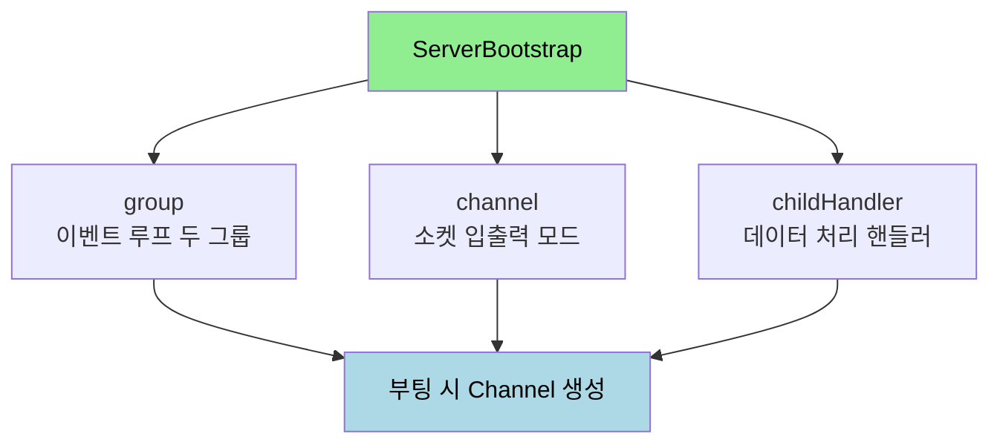
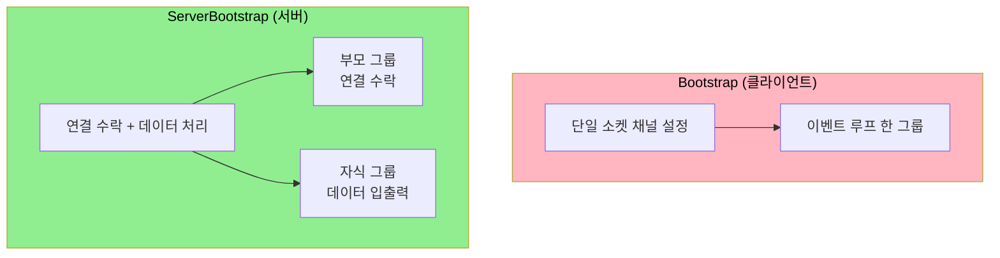

# 부트스트랩 — Netty 네트워크 프로그램의 시작점

---

> [`01-02`](01-02.이벤트%20기반%20프로그래밍과%20BIO%20vs%20NIO.md) 에서 Netty 가 선 자리가 이벤트 기반 리액터 패턴이라고 봤습니다. 이번에는 그 Netty 프로그램이 *시작할 때 가장 먼저 하는 일* — 부트스트랩(bootstrap) — 을 다룹니다. 이 문서를 읽고 나면 부트스트랩이 무엇을 설정하는지, 서버용과 클라이언트용이 어떻게 갈리는지, `group`·`channel`·`childHandler` 같은 API 가 각각 무엇을 정하는지 설명할 수 있습니다.


## 1. 부트스트랩이란

> 부트스트랩은 Netty 로 작성한 네트워크 프로그램이 시작할 때 가장 먼저 수행되는 일입니다. 애플리케이션이 어떤 동작을 할지 지정하고, 프로그램에 대한 각종 설정을 한자리에 모읍니다.

부트스트랩이 하는 일은 두 가지입니다. 하나는 *애플리케이션이 수행할 동작* 을 지정하는 것이고, 다른 하나는 이벤트 루프·채널 모드·포트 같은 *각종 설정* 을 지정하는 것입니다. 이 둘을 부트스트랩 한 곳에서 조립해 두면, 프로그램이 부팅될 때 그 설정대로 채널이 만들어지고 연결을 받기 시작합니다.

서버 부트스트랩의 최소 형태를 코드로 보면 다음과 같습니다.

```java
public EchoServer() {
  bossGroup = new NioEventLoopGroup(1);
  workerGroup = new NioEventLoopGroup();

  bootstrap = new ServerBootstrap();
  bootstrap.group(bossGroup, workerGroup) // 1
      .channel(NioServerSocketChannel.class) // 2
      .childHandler(new ChannelInitializer<SocketChannel>() { // 3
        @Override
        protected void initChannel(SocketChannel socketChannel) throws Exception {
          ChannelPipeline pipeline = socketChannel.pipeline();
          // 핸들러 설정
          pipeline.addLast(new EchoServerHandler());
        }
      });
}
```

코드를 따라가면 부트스트랩이 무엇을 조립하는지 보입니다. `group` 으로 이벤트 루프 두 개를 묶고(①), `channel` 로 소켓 입출력 모드를 정하고(②), `childHandler` 로 연결된 소켓이 주고받는 데이터를 어떤 핸들러로 처리할지 등록합니다(③). 즉 부트스트랩은 "어떤 스레드 모델로, 어떤 소켓 모드로, 어떤 핸들러를 거쳐" 통신할지를 한 번에 선언하는 자리입니다.




## 2. 부트스트랩에서 설정 가능한 항목

> 부트스트랩이 모으는 설정은 크게 여섯 가지입니다. 각각이 통신의 어느 측면을 정하는지 짚습니다.

부트스트랩에 담기는 설정은 다음과 같습니다.

- 이벤트 루프 — 소켓 채널에서 발생한 이벤트를 처리하는 스레드 모델의 구현이 담깁니다.
- 채널 전송 모드 — 소켓 모드와 입출력 종류로, 블로킹·논블로킹·epoll 중 무엇을 쓸지 정합니다.
- 채널 파이프라인 — 소켓 채널로 수신된 데이터를 처리할 핸들러를 지정합니다.
- 소켓 주소와 포트 — 어디에 바인딩해 연결을 받을지 정합니다.
- 소켓 옵션 — 버퍼 크기, keep-alive 같은 저수준 옵션을 정합니다.
- 프로토콜 — 어떤 통신 규약을 쓸지 정합니다.

구체적인 예로, "네트워크에서 수신한 데이터를 단일 스레드로 DB 에 저장하는 프로그램" 을 `8080` 포트와 NIO 소켓 모드로 짠다고 해 봅니다. 이 경우 채널 전송 모드는 서버 소켓 채널에 NIO 를 쓰고, 채널 파이프라인에는 데이터를 받아 DB 에 저장하는 이벤트 핸들러를 두며, 이벤트 루프는 단일 스레드를 지원하도록 설정하고, `8080` 포트에 바인딩합니다. 부트스트랩이 이 네 가지 결정을 한자리에 모아 주는 셈입니다.


## 3. ServerBootstrap 과 Bootstrap

> 부트스트랩은 서버를 위한 `ServerBootstrap` 과 클라이언트를 위한 `Bootstrap` 으로 나뉩니다. 둘을 가르는 기준은 "연결을 받는가, 거는가" 입니다.

부트스트랩을 쓰면 네트워크 애플리케이션을 작성할 때 유연성이 커집니다. 부트스트랩이 없다고 가정하면, 논블로킹 서버와 블로킹 서버 사이에서 소켓 채널의 입출력 방식을 바꿔야 할 때 고쳐야 할 소스 코드가 무지막지하게 많아집니다. 반면 Netty 를 쓰면 데이터를 처리하는 코드는 그대로 두고 부트스트랩의 설정만 바꾸면 됩니다. 소켓 채널의 입출력을 우아하게 추상화해 둔 덕분입니다.

서버와 클라이언트가 갈리는 이유는 역할이 다르기 때문입니다. 서버는 들어오는 연결을 *수락* 하고 그 연결마다 데이터를 처리해야 하므로 루프 그룹이 둘 필요하지만, 클라이언트는 자신이 여는 단일 소켓 하나만 다루므로 부모·자식 관계가 없습니다.



`Bootstrap` 은 기본적으로 `ServerBootstrap` 과 같고 몇 가지 측면에서 미세한 차이를 가집니다. 클라이언트는 단일 소켓 채널에 대한 설정만 하므로, 부모·자식이라는 관계에 해당하는 API 가 없습니다. 그래서 `childHandler`·`childOption` 같은 자식 전용 API 는 `ServerBootstrap` 에만 있습니다.


## 4. ServerBootstrap API

> 서버 부트스트랩이 제공하는 주요 메서드를 표로 정리합니다. 어느 메서드가 어떤 측면을 정하는지 알면 코드를 읽을 때 설정의 의도가 보입니다.

| API | 정하는 것 | 비고 |
|-----|----------|------|
| `group` | 이벤트 루프 설정 | 서버는 부모·자식 두 그룹을 받음 |
| `channel` | 소켓 입출력 모드 | `NioServerSocketChannel` 등 클래스로 지정 |
| `channelFactory` | 소켓 입출력 모드 | `channel` 대신 팩토리로 채널 생성 방식 지정 |
| `handler` | 서버 소켓 채널의 이벤트 핸들러 | 연결을 받는 서버 소켓 자체의 이벤트 처리 |
| `childHandler` | 클라이언트 소켓 채널의 데이터 가공 핸들러 | 연결된 소켓이 주고받는 데이터 처리 |
| `option` | 서버 소켓 채널의 소켓 옵션 | 연결 수락용 소켓에 적용 |
| `childOption` | 클라이언트 소켓 채널의 소켓 옵션 | 연결된 소켓에 적용 |

가장 헷갈리는 부분이 `group` 의 두 그룹입니다. 클라이언트는 연결 요청을 완료한 뒤 데이터 송수신 처리를 하나의 이벤트 루프로 모두 진행합니다. 그런데 서버는 연결 요청을 수락하는 일과 데이터를 송수신하는 일을 나눠야 하므로 루프 그룹이 둘 필요합니다. 앞의 EchoServer 코드에서 `bossGroup` 과 `workerGroup` 이 바로 이 둘입니다.

- 부모 스레드 그룹 — 클라이언트의 연결을 수락하는 역할을 맡습니다. EchoServer 의 `bossGroup` 입니다.
- 자식 스레드 그룹 — 수락된 소켓과 연결된 소켓의 데이터 입출력 및 이벤트 처리를 담당합니다. EchoServer 의 `workerGroup` 입니다.

`channel` 로 지정할 수 있는 서버 소켓 채널 클래스는 입출력 모드에 따라 갈립니다. `LocalServerChannel` 은 같은 JVM 내 통신, `OioServerSocketChannel` 은 블로킹 입출력, `NioServerSocketChannel` 은 논블로킹 입출력, `EpollServerSocketChannel` 은 리눅스 epoll 기반입니다. 입출력 방식을 바꾸고 싶으면 데이터 처리 핸들러는 그대로 두고 이 클래스만 교체하면 되는데, 이것이 §3 에서 말한 추상화의 이점입니다.


## 5. 면접 대비 체크리스트

> 본 문서를 다 읽은 뒤 다음 질문에 답할 수 있어야 합니다.

1. `ServerBootstrap` 의 `group` 에 그룹을 두 개 넘기는 이유는 무엇입니까? 부모 그룹과 자식 그룹은 각각 무엇을 담당합니까?
2. `ServerBootstrap` 에는 있고 `Bootstrap` 에는 없는 API 는 무엇이며, 그 차이가 생기는 이유는 무엇입니까?
3. 블로킹 서버를 논블로킹 서버로 바꿀 때 Netty 에서 고쳐야 하는 부분은 어디입니까? 부트스트랩의 추상화가 주는 이점은 무엇입니까?


## 다음에 읽을 것

- [`01-02.이벤트 기반 프로그래밍과 BIO vs NIO.md`](01-02.이벤트%20기반%20프로그래밍과%20BIO%20vs%20NIO.md) — 부트스트랩이 설정하는 이벤트 루프·NIO 의 토대 (선행 문서)
- [Reactor Netty 공식 레퍼런스](https://projectreactor.io/docs/netty/release/reference/) — 본 문서가 따라가는 공식 문서
