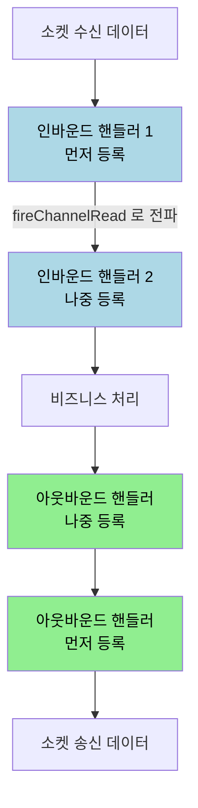
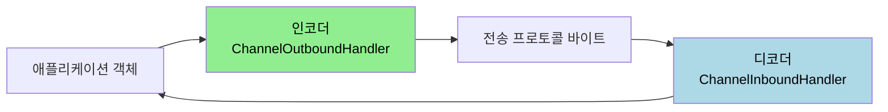

# 채널 파이프라인과 코덱

---

> [`01-03`](01-03.부트스트랩.md) 에서 `childHandler` 로 데이터 처리 핸들러를 등록한다고 봤습니다. 그 핸들러들이 실제로 줄지어 서서 데이터를 가공하는 통로가 채널 파이프라인(channel pipeline)입니다. 이 문서를 읽고 나면 파이프라인에 핸들러가 등록·실행되는 순서, 인바운드와 아웃바운드 핸들러가 반대 방향으로 도는 이유, 핸들러 사이에서 이벤트를 넘기는 방법, 그리고 코덱이 무엇인지 설명할 수 있습니다.


## 1. 채널 파이프라인이란

> Netty 는 데이터 입출력을 이벤트로 관리하므로, 개발자는 이벤트 핸들러만 구현하면 됩니다. 그 핸들러들이 늘어선 통로가 채널 파이프라인입니다.

소켓 채널이 데이터를 수신하면 Netty 이벤트 루프는 채널 파이프라인에 등록된 이벤트 핸들러를 순서대로 가져옵니다. 해당 이벤트 메서드가 구현돼 있으면 실행하고, 마지막 이벤트 핸들러에 도달할 때까지 다음 핸들러를 가져와 같은 과정을 반복합니다. 파이프라인은 채널과 이벤트 핸들러 사이에서 데이터를 입력에서 출력으로 전달하는 통로 역할을 합니다.

핸들러를 파이프라인에 등록하는 코드는 다음과 같습니다.

```java
bootstrap = new ServerBootstrap();

bootstrap.group(bossGroup, workerGroup)
.channel(NioServerSocketChannel.class)
.handler(new LoggingHandler(LogLevel.INFO))
.childHandler(new ChannelInitializer<SocketChannel>() { // 1
  @Override
  protected void initChannel(SocketChannel socketChannel) throws Exception { // 2
    ChannelPipeline pipeline = socketChannel.pipeline(); // 3
    pipeline.addLast(new LoggingHandler(LogLevel.INFO)); // 4
    pipeline.addLast(new EchoServerHandler()); // 4
  }
});
```

코드의 네 지점이 등록 과정을 보여줍니다. `childHandler` 메서드로 `ChannelInitializer` 를 설정하고(1), `initChannel` 은 클라이언트 소켓 채널이 생성될 때 호출되며(2), Netty 내부가 할당한 빈 채널 파이프라인을 가져온 뒤(3), `addLast` 로 이벤트 핸들러를 파이프라인에 등록합니다(4).


## 2. 파이프라인 등록과 초기화 순서

> 클라이언트가 접속하면 채널과 파이프라인이 만들어지고 핸들러가 설치되는 순서가 정해져 있습니다. 이 순서를 알면 `ChannelInitializer` 가 어느 시점에 호출되는지 보입니다.

실무에서는 `ChannelInitializer` 를 별도 클래스로 분리해 의존성을 주입받는 형태를 자주 씁니다.

```java
@Component
@RequiredArgsConstructor
public class ImageNettyChannelInitializer extends ChannelInitializer<SocketChannel> {

	private final ImageNettyInboundHandler imageNettyInboundHandler;

	@Override
	protected void initChannel(SocketChannel ch) {
		ChannelPipeline pipeline = ch.pipeline();

		ByteBuf delimiter = Unpooled.copiedBuffer("\n", CharsetUtil.UTF_8);
		int maxFrameLength = 5 * 1024 * 1024; // 5MB
		pipeline.addLast(new DelimiterBasedFrameDecoder(maxFrameLength, delimiter));

		pipeline.addLast(imageNettyInboundHandler);
	}
}
```

채널과 파이프라인이 만들어지는 순서는 다음과 같습니다.

1. 클라이언트가 서버 소켓에 접속을 요청합니다.
2. 해당 연결에 대응하는 클라이언트 소켓 채널 객체가 생성됩니다.
3. 빈 채널 파이프라인 객체가 생성되어 클라이언트 소켓 채널에 할당됩니다.
4. 클라이언트 소켓 채널에 등록된 `ChannelInitializer` 객체를 가져와 `initChannel` 을 호출합니다.
5. 채널에 할당된 파이프라인을 가져와 이벤트 핸들러를 등록합니다.

위 코드의 `DelimiterBasedFrameDecoder` 는 `\n` 을 기준으로 수신 바이트를 잘라 주는 디코더입니다. 핸들러 등록 순서가 곧 데이터 가공 순서이므로, 프레임을 자르는 디코더를 먼저 두고 그 결과를 받는 비즈니스 핸들러를 뒤에 둡니다.


## 3. 인바운드 이벤트 핸들러

> 인바운드 이벤트는 연결 상대가 어떤 동작을 취했을 때 발생하는 이벤트입니다. 채널 활성화, 데이터 수신 등이 여기 속합니다.

인바운드 핸들러는 Bottom-Up 형식으로 동작합니다. 가장 먼저 등록한 핸들러부터 마지막에 등록한 핸들러 순서로 이벤트가 흘러갑니다. 주요 이벤트 메서드는 다음과 같습니다.

| 메서드 | 호출 시점 |
|--------|----------|
| `channelRegistered` | Channel 이 EventLoop 에 등록되어 입출력을 처리할 수 있을 때 |
| `channelUnregistered` | Channel 이 EventLoop 에서 등록 해제되어 입출력을 처리할 수 없을 때 |
| `channelActive` | Channel 의 연결과 바인딩이 완료되어 활성화될 때 |
| `channelInactive` | Channel 이 활성 상태에서 벗어나 연결이 해제될 때 |
| `channelReadComplete` | Channel 에서 읽기 작업이 완료될 때 |
| `channelRead` | Channel 에서 데이터를 읽을 때 |
| `channelWritabilityChanged` | Channel 의 기록 가능 상태가 변경될 때 |
| `userEventTriggered` | POJO 가 파이프라인을 통해 전달되어 사용자 이벤트가 트리거될 때 |

여기서 공식 문서가 강조하는 책임이 하나 있습니다. 인바운드로 들어온 `ByteBuf` 는 참조 카운팅(reference counting) 으로 관리되므로, 처리한 핸들러가 직접 `release()` 를 호출해 해제해야 메모리 누수가 없습니다. 공식 예제는 `finally` 블록에서 `ReferenceCountUtil.release(msg)` 를 호출하라고 권합니다.

```java
public void channelRead(ChannelHandlerContext ctx, Object msg) {
    ByteBuf buf = (ByteBuf) msg;
    try {
        // ... 데이터 처리
    } finally {
        ReferenceCountUtil.release(msg);
    }
}
```

raw 예제가 쓴 `SimpleChannelInboundHandler<ByteBuf>` 는 이 해제를 자동으로 처리합니다. 공식 문서에 따르면 `SimpleChannelInboundHandler` 를 확장하면 수신한 메시지에 대해 `ReferenceCountUtil.release(msg)` 가 자동으로 호출되므로, 직접 `release` 를 쓰지 않아도 됩니다. 그래서 비즈니스 로직만 담는 인바운드 핸들러는 이 클래스를 베이스로 두는 편이 안전합니다.

```java
@Slf4j
public abstract class AbstractNettyInboundHandler extends SimpleChannelInboundHandler<ByteBuf> {

	@Override
	public void channelActive(ChannelHandlerContext ctx) {
		log.info("Channel active: {}", ctx.channel());
	}

	@Override
	public void channelInactive(ChannelHandlerContext ctx) {
		log.info("Channel inactive: {}", ctx.channel());
	}

	// 예외 발생 시
	@Override
	public void exceptionCaught(ChannelHandlerContext ctx, Throwable cause) {
		cause.printStackTrace();
		ctx.close();
	}
}
```


## 4. 아웃바운드 이벤트 핸들러

> 아웃바운드 이벤트는 소켓 채널에서 발생하는 이벤트 중 프로그래머가 요청한 동작에 해당하는 이벤트입니다. 연결 요청, 데이터 기록, 소켓 닫기 등입니다.

아웃바운드 핸들러는 Top-Down 형식으로 동작합니다. 인바운드와 반대로, 가장 마지막에 등록한 핸들러부터 가장 먼저 등록한 핸들러 순서로 이벤트가 흘러갑니다. 주요 이벤트 메서드는 다음과 같습니다.

| 메서드 | 호출 시점 |
|--------|----------|
| `bind` | Channel 을 로컬 주소로 바인딩 요청 시 |
| `connect` | Channel 을 원격 피어로 연결 요청 시 |
| `disconnect` | Channel 을 원격 피어로부터 연결 해제 요청 시 |
| `close` | Channel 을 닫는 요청 시 |
| `deregister` | Channel 을 EventLoop 에서 등록 해제 요청 시 |
| `read` | Channel 에서 데이터를 읽기 요청 시 |
| `flush` | 큐에 있는 데이터를 원격 피어로 플러시 요청 시 |
| `write` | Channel 을 통해 원격 피어로 데이터 기록 요청 시 |

아웃바운드 동작의 결과는 비동기로 돌아오므로 `ChannelFuture` 로 받습니다. 아래 클라이언트 전송 예제는 `writeAndFlush` 가 돌려준 `ChannelFuture` 에 리스너를 달아 성공·실패를 통지받습니다.

```java
public <T> void sendData(Channel channel, String dataType, T data) {
	LocalDateTime currentTime = LocalDateTime.now();
	long unixTimestamp = currentTime.toEpochSecond(ZoneOffset.UTC);

	String combinedData = clientName + " " + dataType + " " + data + " " + unixTimestamp;

	ChannelFuture future = channel.writeAndFlush(combinedData);

	future.addListener((ChannelFutureListener) channelFuture -> {
		if (!channelFuture.isSuccess()) {
			log.error("Failed to send data. Retrying...");
			// TODO 실패 시 로직 처리
		} else {
			log.info("Data sent successfully.");
		}
	});
}
```


## 5. 이벤트 이동 경로와 메서드 실행

> 여러 핸들러가 같은 파이프라인에 있을 때 이벤트가 어떻게 전파되는지가 핵심입니다. 같은 이벤트를 두 핸들러가 구현했을 때의 동작에 함정이 있습니다.

이벤트 전파에는 두 가지 규칙이 있습니다.

1. 서로 다른 이벤트 메서드를 구현한 핸들러를 등록하면, 등록 순서와 무관하게 각 이벤트 순서에 따라 실행됩니다.
2. 같은 이벤트 메서드를 구현한 핸들러를 둘 등록하면, 먼저 등록된 핸들러의 메서드만 호출되고 이벤트가 소모됩니다.

두 번째 규칙이 함정입니다. 두 번째 핸들러의 메서드까지 호출하고 싶으면, 첫 번째 핸들러에서 `ctx.fireChannelRead()` 같은 메서드로 이벤트를 직접 다음 핸들러에 넘겨야 합니다. 공식 문서도 인바운드 메시지를 다음 핸들러로 넘길 때 `release` 하지 말고 `ctx.fireChannelRead(buf)` 로 전달하라고 안내합니다. 즉 이벤트를 소모할지 다음으로 넘길지는 핸들러가 명시적으로 결정합니다.

```java
ChannelPipeline p = channel().pipeline();
p.addLast("1", new InboundReadHandler());
p.addLast("2", new InboundActiveHandler());
p.addLast("3", new OutboundWriteHandler());
p.addLast("4", new OutboundWriteHandler());
p.addLast("5", new ChannelDuplexHandler());
```




## 6. 코덱

> 코덱(codec)은 데이터를 전송 프로토콜 형식과 애플리케이션 객체 사이에서 변환하는 핸들러입니다. 인코더와 디코더 한 쌍으로 이루어집니다.

코덱은 인코더와 디코더로 나뉩니다. 인코더는 전송할 데이터를 전송 프로토콜에 맞춰 변환하는 아웃바운드 핸들러(`ChannelOutboundHandler`)이고, 디코더는 수신한 데이터를 전송 프로토콜에서 애플리케이션이 쓸 형식으로 변환하는 인바운드 핸들러(`ChannelInboundHandler`)입니다. 변환 방향이 정반대이므로 인코더가 아웃바운드, 디코더가 인바운드에 놓이는 것이 자연스럽습니다.



§2 에서 본 `DelimiterBasedFrameDecoder` 가 디코더의 한 예입니다. 수신한 바이트 스트림을 구분자 기준으로 잘라 다음 핸들러가 쓸 단위로 만들어 줍니다. 코덱을 파이프라인 앞쪽에 두면, 뒤의 비즈니스 핸들러는 프로토콜 변환을 신경 쓰지 않고 도메인 객체만 다룰 수 있습니다.


## 7. 면접 대비 체크리스트

> 본 문서를 다 읽은 뒤 다음 질문에 답할 수 있어야 합니다.

1. 인바운드 핸들러와 아웃바운드 핸들러는 실행 방향이 어떻게 다릅니까? 각각 Bottom-Up·Top-Down 인 이유는 무엇입니까?
2. 같은 이벤트 메서드를 구현한 핸들러를 둘 등록하면 어떤 일이 벌어지며, 두 번째 핸들러까지 실행하려면 어떻게 해야 합니까?
3. 인바운드 `ByteBuf` 의 `release` 책임은 누구에게 있습니까? `SimpleChannelInboundHandler` 를 쓰면 무엇이 달라집니까?
4. 인코더가 아웃바운드, 디코더가 인바운드 핸들러로 분류되는 이유는 무엇입니까?


## 다음에 읽을 것

- [`01-03.부트스트랩.md`](01-03.부트스트랩.md) — 파이프라인을 설정하는 부트스트랩 (선행 문서)
- [`01-05.바이트 버퍼.md`](01-05.바이트%20버퍼.md) — 파이프라인을 흐르는 데이터의 그릇, ByteBuf
- [Netty User Guide 4.x](https://github.com/netty/netty/wiki/User-guide-for-4.x) — 본 문서가 따라가는 공식 문서
