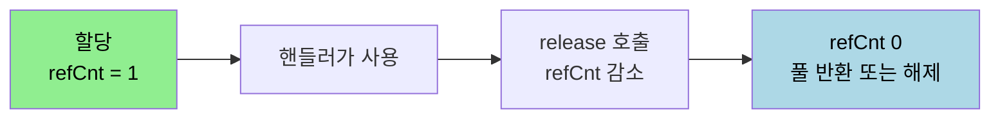

# 바이트 버퍼 — Netty ByteBuf

---

> [`01-04`](01-04.채널%20파이프라인과%20코덱.md) 에서 파이프라인을 흐르는 데이터가 `ByteBuf` 라고 봤습니다. 자바가 이미 NIO 버퍼 패키지를 제공하는데도 Netty 는 내부의 데이터 이동과 입출력에 자체 버퍼 API 를 씁니다. 이 문서를 읽고 나면 자바 NIO `ByteBuffer` 의 구조와 한계, Netty `ByteBuf` 가 그 한계를 어떻게 넘는지, 버퍼 종류와 생성 방법, 그리고 참조 카운팅이 무엇인지 설명할 수 있습니다.


## 1. 자바 NIO 바이트 버퍼

> 바이트 버퍼는 바이트 데이터를 저장하고 읽는 저장소입니다. 자바 NIO 의 `ByteBuffer` 는 내부 배열 상태를 세 속성으로 관리합니다.

자바 NIO 는 저장하는 데이터 형에 따라 `ByteBuffer`, `CharBuffer`, `IntBuffer` 같은 여러 버퍼를 제공합니다. 그중 `ByteBuffer` 클래스는 내부 배열의 상태를 세 속성으로 관리합니다.

- `capacity` — 버퍼에 저장 가능한 최대 크기로, 한 번 정해지면 바뀌지 않는 불변 값입니다.
- `position` — 지금 읽기나 쓰기 작업 중인 위치입니다.
- `limit` — 읽고 쓸 수 있는 공간의 최대치입니다.

세 속성을 하나로 관리하기 때문에 NIO `ByteBuffer` 에는 함정이 있습니다. 쓰기를 하다가 읽기로 전환하려면 `flip()` 을 호출해 `limit` 을 현재 `position` 으로 옮기고 `position` 을 0 으로 되돌려야 합니다. 이 `flip()` 을 깜빡하면 엉뚱한 위치를 읽게 되는데, 이것이 NIO 버퍼에서 흔한 실수입니다.


## 2. Netty 의 바이트 버퍼

> Netty 의 `ByteBuf` 는 자바 `ByteBuffer` 보다 빠르고, 할당과 해제 부담을 줄였으며, 무엇보다 읽기·쓰기 인덱스를 따로 둬 `flip()` 을 없앴습니다.

Netty 가 자체 버퍼를 쓰는 핵심 이유는 인덱스 모델에 있습니다. 공식 문서에 따르면 `ByteBuf` 는 읽기 인덱스(reader index)와 쓰기 인덱스(writer index)를 따로 둡니다. 데이터를 쓰면 쓰기 인덱스만 전진하고 읽기 인덱스는 그대로 있어, 메시지의 경계가 명확하게 구분됩니다. 그래서 NIO `ByteBuffer` 가 요구하던 `flip()` 호출이 아예 필요 없고, `flip()` 을 깜빡해 생기던 오류도 사라집니다.

```java
ByteBuf buf = ...;
buf.writeUnsignedInt(42);
assertThat(buf.readUnsignedInt(), is(42));
```

쓰기 직후 곧바로 읽어도 별도 전환 호출이 없는 것을 위 공식 예제가 보여줍니다. 두 버퍼의 차이를 인덱스 구조로 비교하면 다음과 같습니다.


`ByteBuf` 의 특징을 정리하면 다음과 같습니다.

- 읽기 인덱스와 쓰기 인덱스를 따로 보유해 `flip()` 이 불필요합니다.
- 용량이 가변이라 필요 시 늘어납니다.
- 각 데이터 형에 따른 읽기·쓰기 메서드를 제공합니다.

생성은 할당자(allocator)를 통합니다. `ByteBufAllocator` 인터페이스가 할당을 추상화하고, 실제로는 추상 구현체인 `PooledByteBufAllocator` 를 자주 씁니다.


## 3. 버퍼의 종류와 생성 방법

> `ByteBuf` 는 풀링 여부(Pooled/Unpooled)와 메모리 위치(Heap/Direct)의 조합으로 나뉩니다. 네 가지가 있고, 선택 기준이 다릅니다.

네티 바이트 버퍼의 종류는 네 가지입니다.

- `PooledHeapByteBuf` — 풀에서 가져오는 JVM 힙 메모리 버퍼
- `PooledDirectByteBuf` — 풀에서 가져오는 다이렉트(OS) 메모리 버퍼
- `UnpooledHeapByteBuf` — 풀을 안 쓰는 힙 메모리 버퍼
- `UnpooledDirectByteBuf` — 풀을 안 쓰는 다이렉트 메모리 버퍼

생성 방법은 할당자나 `Unpooled` 유틸리티로 갈립니다.

```java
PooledByteBufAllocator.DEFAULT.heapBuffer();
PooledByteBufAllocator.DEFAULT.directBuffer();
Unpooled.buffer();
Unpooled.directBuffer();
```

두 축의 선택 기준은 다음과 같습니다.

| 축 | 선택지 | 언제 |
|----|--------|------|
| 풀링 | Pooled | 버퍼를 자주 할당·해제하는 고성능 경로. 풀 재사용으로 GC·할당 부담 감소 |
| 풀링 | Unpooled | 일회성 버퍼, 테스트, 풀 관리 오버헤드가 불필요할 때 |
| 메모리 | Direct | 소켓 입출력. OS 버퍼와 직접 주고받아 복사가 줄어듦 |
| 메모리 | Heap | JVM 내부 처리. 배열 접근이 쉽고 GC 가 관리 |

소켓으로 바이트를 주고받는 전송 경로에서는 복사를 줄이는 Direct 버퍼가, 그리고 빈번한 할당을 견디는 Pooled 가 유리합니다. 그래서 실무 클라이언트 설정에서 `PooledByteBufAllocator.DEFAULT` 를 할당자로 지정하는 패턴이 흔합니다.


## 4. 참조 카운팅

> `ByteBuf` 는 참조 카운팅(reference counting)으로 메모리를 관리합니다. 누가 언제 해제하느냐가 메모리 누수를 가르는 핵심입니다.

공식 문서에 따르면 `ByteBuf` 는 할당과 해제 성능을 높이려고 참조 카운팅을 씁니다. 새로 할당된 참조 카운팅 객체의 초기 참조 수는 1 입니다.

```java
ByteBuf buf = ctx.alloc().directBuffer();
assert buf.refCnt() == 1;
```

객체를 `release()` 하면 참조 수가 하나 줄고, 참조 수가 0 이 되면 객체가 해제되거나 풀로 반환됩니다. 풀링 버퍼라면 메모리가 풀로 돌아가 재사용되고, 풀링이 아니면 GC 대상이 됩니다. [`01-04 §3`](01-04.채널%20파이프라인과%20코덱.md) 에서 인바운드 핸들러가 `release` 책임을 지거나 `SimpleChannelInboundHandler` 가 자동 해제한다고 본 이유가 여기 있습니다. 참조 수를 0 으로 떨어뜨리지 않으면 풀이 고갈되거나 메모리가 새기 때문입니다.




## 5. 면접 대비 체크리스트

> 본 문서를 다 읽은 뒤 다음 질문에 답할 수 있어야 합니다.

1. 자바 NIO `ByteBuffer` 가 쓰기에서 읽기로 전환할 때 `flip()` 이 필요한 이유는 무엇입니까?
2. Netty `ByteBuf` 가 `flip()` 없이 동작할 수 있는 이유는 무엇입니까? 어떤 인덱스 구조를 가집니까?
3. Pooled 와 Direct 버퍼는 각각 어떤 상황에서 유리합니까?
4. `ByteBuf` 의 참조 수가 0 이 되면 무슨 일이 벌어집니까? 해제를 깜빡하면 어떤 문제가 생깁니까?


## 다음에 읽을 것

- [`01-04.채널 파이프라인과 코덱.md`](01-04.채널%20파이프라인과%20코덱.md) — ByteBuf 가 흐르는 통로, 파이프라인 (선행 문서)
- [`01-06.Netty 컴포넌트와 서버 구현.md`](01-06.Netty%20컴포넌트와%20서버%20구현.md) — 버퍼·채널·핸들러를 묶는 전체 컴포넌트
- [Netty Reference Counted Objects](https://github.com/netty/netty/wiki/Reference-counted-objects) — 참조 카운팅 공식 문서
