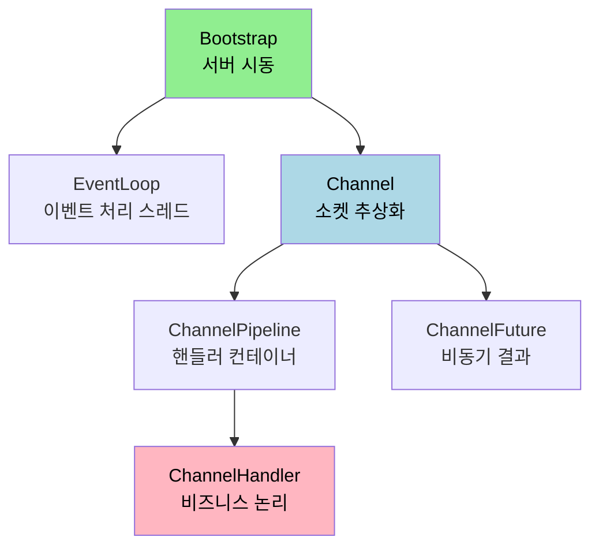
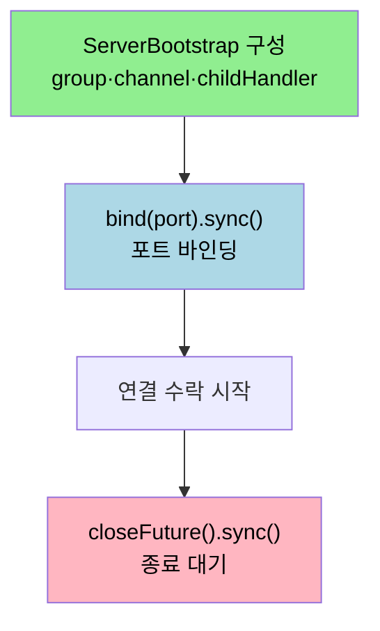

# Netty 컴포넌트와 서버 구현

---

> [`01-03`](01-03.부트스트랩.md) 부터 [`01-05`](01-05.바이트%20버퍼.md) 까지 부트스트랩·파이프라인·버퍼를 따로 봤습니다. 이번 문서는 그 조각들을 하나의 서버로 엮는 컴포넌트 전체를 정리합니다. 이 문서를 읽고 나면 Netty 서버를 이루는 핵심 컴포넌트 여섯 가지가 각각 무슨 일을 하는지, 그리고 서버가 부팅되어 연결을 받기까지의 진행 순서를 설명할 수 있습니다.


## 1. 모든 Netty 서버에 필요한 것

> 모든 Netty 서버에는 비즈니스 논리를 담는 핸들러와 서버를 띄우는 부트스트랩이 필요합니다. 그 사이를 여섯 컴포넌트가 채웁니다.

모든 네티 서버는 최소한 두 가지를 갖춰야 합니다. 하나 이상의 `ChannelHandler` 는 클라이언트로부터 받은 데이터를 서버 측에서 처리하는 비즈니스 논리를 구현합니다. 부트스트랩은 서버를 구성하는 시동 코드로, 최소한 서버가 연결 요청을 수신하는 포트와 바인딩하는 코드를 담습니다.

이 둘을 중심으로 Netty 는 여섯 컴포넌트를 통해 데이터를 처리합니다.

- `Channel` — 소켓 입출력을 추상화한 통로
- `EventLoop` — 채널의 이벤트를 처리하는 스레드 모델
- `ChannelFuture` — 비동기 입출력의 결과·상태를 담는 객체
- `ChannelHandler` — 데이터 처리 비즈니스 논리
- `ChannelPipeline` — 핸들러들을 엮는 컨테이너
- `Bootstrap` — 서버 시동 설정




## 2. Channel

> Channel 인터페이스는 소켓으로 직접 작업할 때의 복잡성을 크게 줄여 줍니다. 자바의 Socket 클래스를 한 겹 추상화한 자리입니다.

자바 기반 네트워크의 기본 구조는 `Socket` 클래스입니다. 기본 입출력 작업인 `bind`, `connect`, `read`, `write` 는 네트워크 전송이 제공하는 기본형을 직접 씁니다. Netty 의 `Channel` 인터페이스는 이 Socket 작업의 복잡성을 완화하는 API 를 제공합니다.

Netty 는 `Channel` 을 구현한 여러 특수 구현체를 제공하는데, 입문 단계에서는 `NioSocketChannel` 만 알아도 충분합니다.

| 클래스 | 기능 |
|--------|------|
| `EmbeddedChannel` | 실제 연결 없이 `ChannelHandler` 를 테스트하는 채널 |
| `EpollChannel` | 최대 성능을 위해 EPOLL Edge-Triggered 모드를 쓰는 리눅스 최적화 채널 |
| `KQueueChannel` | jni 라이브러리를 쓰는 채널 (macOS·BSD) |
| `LocalChannel` | 같은 JVM 내 로컬 채널 |
| `NioServerSocketChannel` | NIO 서버 소켓 채널 |
| `NioSocketChannel` | NIO 소켓 채널 |


## 3. EventLoop

> EventLoop 는 연결의 수명주기 동안 발생하는 이벤트를 처리하는 Netty 의 핵심 추상화입니다. 스레드·그룹과의 관계가 성능을 가릅니다.

`EventLoop` 는 연결의 수명주기 중 발생하는 이벤트를 처리하는 Netty 의 핵심 추상화를 정의합니다. 하나의 `EventLoop` 는 하나의 스레드에 묶이고, 여러 `EventLoop` 가 모여 `EventLoopGroup` 을 이룹니다. [`01-03 §4`](01-03.부트스트랩.md) 에서 본 부모·자식 그룹이 바로 이 `EventLoopGroup` 입니다.

공식 문서는 그룹별로 스레드 수를 따로 지정할 수 있음을 보여 줍니다. 연결 수락용(acceptor) 그룹과 데이터 처리용(worker) 그룹을 분리하고, worker 스레드 수를 코어 수에 맞춰 늘리는 식입니다.

```java
final int acceptorThreads = 1;
final int workerThreads = 10;
EventLoopGroup acceptorGroup = new NioEventLoopGroup(acceptorThreads);
EventLoopGroup workerGroup = new NioEventLoopGroup(workerThreads);

ServerBootstrap serverBootstrap = new ServerBootstrap().group(acceptorGroup, workerGroup);
```

한 `EventLoop` 가 한 스레드로 다중 연결을 돌보는 구조라, [`01-02`](01-02.이벤트%20기반%20프로그래밍과%20BIO%20vs%20NIO.md) 에서 본 "N 커넥션 = 1 스레드" 가 여기서 실현됩니다.


## 4. ChannelFuture

> Netty 의 모든 입출력은 비동기입니다. 호출은 즉시 반환되고, 그 결과는 ChannelFuture 로 나중에 확인합니다.

Netty 의 모든 I/O 처리는 비동기식입니다. 비동기식은 I/O 작업의 완료 여부와 상관없이 호출이 즉시 반환되며, 이때 `ChannelFuture` 인터페이스를 통해 I/O 처리가 완료됐는지 확인하고 결과를 검색합니다.

```java
// ChannelFuture: I/O operation의 결과나 상태를 제공하는 객체
// 지정한 host, port로 소켓을 바인딩하고 incoming connections을 받도록 준비함
ChannelFuture serverChannelFuture = serverBootstrap.bind(tcpPort).sync();
```

`ChannelFuture` 의 주요 함수는 다음과 같습니다.

- `addListener()` — 작업 완료를 통지받을 리스너를 등록합니다.
- `removeListener()` — 등록한 리스너를 제거합니다.
- `await()` — I/O 작업이 완료될 때까지 대기합니다.
- `sync()` — I/O 작업을 대기하다 실패하면 실패 이유를 반환합니다.

공식 예제는 쓰기 완료 후 연결을 닫는 패턴으로 리스너를 씁니다. `writeAndFlush` 가 돌려준 `ChannelFuture` 에 `ChannelFutureListener` 를 달아, `operationComplete` 에서 후속 동작을 합니다.

```java
final ChannelFuture f = ctx.writeAndFlush(time);
f.addListener(new ChannelFutureListener() {
    @Override
    public void operationComplete(ChannelFuture future) {
        ctx.close();
    }
});
```


## 5. ChannelHandler 와 Pipeline·Context·Initializer

> ChannelHandler 는 데이터를 처리하고, ChannelPipeline 은 핸들러를 엮으며, ChannelInitializer 는 핸들러를 설치하고, ChannelHandlerContext 는 둘 사이를 잇습니다.

`ChannelHandler` 는 입력과 출력으로 나뉩니다. `ChannelInboundHandler` 는 Channel 의 입력 데이터를 처리하며 `channelRead`(메시지가 들어올 때마다 호출), `channelReadComplete`(읽기 처리의 마지막 메시지를 처리했음을 통보), `exceptionCaught`(읽기 작업 중 예외 발생 시) 를 가집니다. `ChannelOutboundHandler` 는 출력 데이터를 처리하며 `bind`, `connect`, `read`, `flush` 를 가집니다. 자세한 메서드 목록과 실행 방향은 [`01-04`](01-04.채널%20파이프라인과%20코덱.md) 에서 다뤘습니다.

`ChannelPipeline` 은 `ChannelHandler` 체인을 위한 컨테이너를 제공하고, 체인에서 인바운드·아웃바운드 이벤트를 전파하는 API 를 정의합니다. Channel 이 생성되면 자체 `ChannelPipeline` 이 자동으로 할당되며, 핸들러 설치는 다음 순서로 일어납니다.

1. `ChannelInitializer` 구현체를 `ServerBootstrap` 에 등록합니다.
2. `ChannelInitializer.initChannel()` 이 호출되면 커스텀 핸들러 집합을 파이프라인에 설치합니다.
3. `ChannelInitializer` 는 자기 자신을 파이프라인에서 제거합니다.

```java
@Component
@RequiredArgsConstructor
public class NettyChannelInitializer extends ChannelInitializer<SocketChannel> {

	private final NettyHandler nettyHandler;

	@Override
	protected void initChannel(SocketChannel socketChannel) throws Exception {
		ChannelPipeline pipeline = socketChannel.pipeline();
		pipeline.addLast(nettyHandler);
	}
}
```

나머지 두 컴포넌트의 역할은 다음과 같습니다. `ChannelHandlerContext` 는 `ChannelHandler` 와 `ChannelPipeline` 간 연결을 나타내며, 핸들러를 파이프라인에 추가할 때 할당됩니다. `ChannelInitializer` 는 여러 핸들러를 파이프라인에 할당하기 위한 클래스로, Channel 생성 시 호출됩니다.


## 6. Bootstrap 과 진행 순서

> 컴포넌트가 모두 모이면 부트스트랩이 채널을 만들고, ChannelFuture 로 포트에 바인딩해 연결을 받습니다.

서버 설정을 도와주는 `ServerBootstrap` 빈은 다음과 같이 구성합니다. `boss` 그룹은 들어오는 연결을 수락해 worker 에게 등록하고, `worker` 그룹은 수락된 연결의 트래픽을 관리합니다.

```java
@Bean
public ServerBootstrap serverBootstrap(NettyChannelInitializer nettyChannelInitializer) {

	// boss: incoming connection을 수락하고, 수락한 connection을 worker에게 등록(register)
	// worker: boss가 수락한 연결의 트래픽 관리
	NioEventLoopGroup bossGroup = new NioEventLoopGroup(bossCount);
	NioEventLoopGroup workerGroup = new NioEventLoopGroup(workerCount);

	ServerBootstrap b = new ServerBootstrap();
	b.group(bossGroup, workerGroup)
		.channel(NioServerSocketChannel.class)
		.handler(new LoggingHandler(LogLevel.DEBUG))
		.childHandler(nettyChannelInitializer);

	// SO_BACKLOG: 동시에 수용 가능한 최대 incoming connections 개수
	b.option(ChannelOption.SO_BACKLOG, backlog);
	return b;
}
```

`SO_BACKLOG` 는 아직 수락되지 못한 연결이 대기하는 큐의 최대 크기입니다. 공식 예제는 이 값을 128 로 두고, 연결된 소켓에는 `childOption(ChannelOption.SO_KEEPALIVE, true)` 를 함께 설정합니다. `option` 은 연결을 수락하는 서버 소켓에, `childOption` 은 수락된 클라이언트 소켓에 적용된다는 [`01-03 §4`](01-03.부트스트랩.md) 의 구분이 여기서도 그대로입니다.

부트스트랩이 만든 채널을 포트에 바인딩하는 진행 순서는 다음과 같습니다.

```java
// 1. 부트스트랩에서 채널 생성 (위 serverBootstrap 빈)

// 2. 생성된 채널로 ChannelFuture 만들기 — 지정 포트로 서버 소켓 바인딩
ChannelFuture serverChannelFuture = serverBootstrap.bind(tcpPort).sync();

// 3. 서버 소켓이 닫힐 때까지 대기
serverChannel = serverChannelFuture.channel().closeFuture().sync().channel();
```



공식 예제는 종료 시 `bossGroup.shutdownGracefully()` 와 `workerGroup.shutdownGracefully()` 로 두 그룹을 정리해, 진행 중인 작업을 마치고 우아하게 종료합니다.


## 7. 면접 대비 체크리스트

> 본 문서를 다 읽은 뒤 다음 질문에 답할 수 있어야 합니다.

1. Netty 서버를 이루는 여섯 컴포넌트는 무엇이며, 각각 어떤 책임을 가집니까?
2. `EventLoop`·스레드·`EventLoopGroup` 은 어떤 관계입니까? boss 그룹과 worker 그룹의 스레드 수를 다르게 두는 이유는?
3. `ChannelFuture` 가 필요한 이유는 무엇입니까? Netty 의 I/O 가 비동기라는 점과 어떻게 연결됩니까?
4. `option(SO_BACKLOG)` 와 `childOption(SO_KEEPALIVE)` 는 각각 어느 소켓에 적용됩니까?


## 다음에 읽을 것

- [`01-05.바이트 버퍼.md`](01-05.바이트%20버퍼.md) — 컴포넌트가 주고받는 데이터의 그릇 (선행 문서)
- [`01-07.Netty 클라이언트 구현.md`](01-07.Netty%20클라이언트%20구현.md) — 같은 컴포넌트로 클라이언트를 짜는 자리
- [Netty User Guide 4.x](https://github.com/netty/netty/wiki/User-guide-for-4.x) — 본 문서가 따라가는 공식 문서
