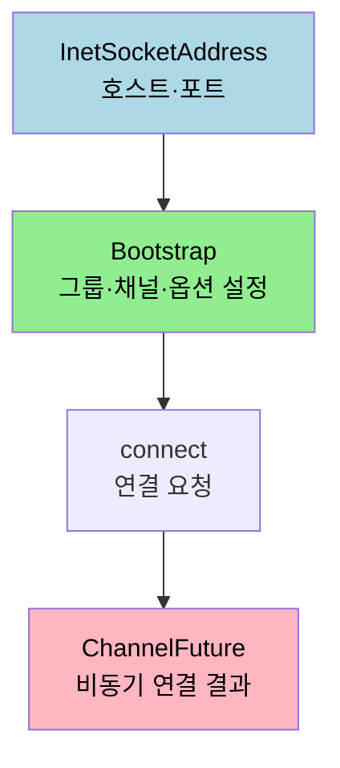
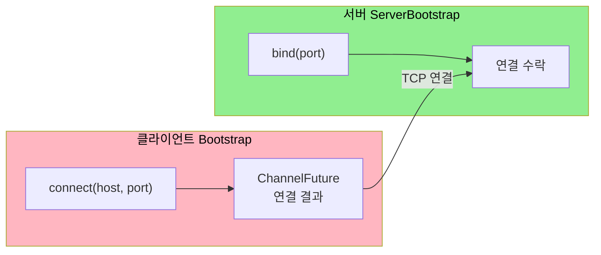

# Netty 클라이언트 구현

---

> [`01-06`](01-06.Netty%20컴포넌트와%20서버%20구현.md) 에서 `ServerBootstrap` 으로 서버를 띄웠습니다. 이번에는 같은 컴포넌트로 *연결을 거는* 클라이언트를 짭니다. 서버가 `ServerBootstrap` 으로 연결을 받았다면, 클라이언트는 `Bootstrap` 으로 연결을 겁니다. 이 문서를 읽고 나면 클라이언트 부트스트랩의 구성 요소, `TCP_NODELAY` 와 `PooledByteBufAllocator` 옵션의 의미, 그리고 비동기 연결을 `ChannelFutureListener` 로 다루는 방법을 설명할 수 있습니다.


## 1. 클라이언트 구성 요소

> 클라이언트는 접속할 주소를 정하고, 부트스트랩으로 채널을 설정한 뒤, connect 로 연결을 겁니다. 서버보다 단순한데, 단일 소켓만 다루기 때문입니다.

[`01-03 §3`](01-03.부트스트랩.md) 에서 봤듯 클라이언트는 자신이 여는 단일 소켓 하나만 다루므로 부모·자식 그룹이 없습니다. 그래서 `Bootstrap` 은 이벤트 루프 그룹을 하나만 받습니다. 클라이언트 구현은 접속 주소를 담는 `InetSocketAddress`, 채널을 설정하는 `Bootstrap`, 연결을 거는 `connect` 세 조각으로 이루어집니다.




## 2. InetSocketAddress

> 클라이언트가 접속할 호스트와 포트를 담는 객체입니다. 빈으로 등록해 두면 주소 설정을 한곳에서 관리할 수 있습니다.

```java
@Bean
public InetSocketAddress dataInetSocketAddress() {
	return new InetSocketAddress(host, dataPort);
}
```

접속 대상의 호스트와 포트를 `InetSocketAddress` 로 묶어 빈으로 등록합니다. 주소를 코드 곳곳에 흩어 두지 않고 한 빈에 모으면, 환경별 호스트·포트 변경을 설정 한 군데에서 처리할 수 있습니다.


## 3. Bootstrap 옵션

> 클라이언트 부트스트랩은 이벤트 루프와 채널 모드를 정하고, 두 가지 소켓 옵션 — TCP_NODELAY 와 할당자 — 을 함께 설정합니다.

```java
@Bean
public Bootstrap nettyBootstrap(EventLoopGroup eventLoopGroup) {
	Bootstrap bootstrap = new Bootstrap()
		.group(eventLoopGroup) // 이벤트 루프 설정
		.channel(NioSocketChannel.class) // 소켓 입출력 모드 설정
		.option(ChannelOption.TCP_NODELAY, true) // Nagle 알고리즘 사용 X
		.option(ChannelOption.ALLOCATOR, PooledByteBufAllocator.DEFAULT); // PooledByteBufAllocator 사용
	return bootstrap;
}
```

`group` 은 이벤트 루프를 하나만 받고, `channel` 은 클라이언트 소켓이므로 `NioSocketChannel` 을 씁니다([`01-06 §2`](01-06.Netty%20컴포넌트와%20서버%20구현.md) 의 채널 구현체 표 참고). 두 `option` 의 의미가 중요합니다.

`TCP_NODELAY` 는 Nagle 알고리즘을 켜고 끄는 옵션입니다. Nagle 알고리즘은 작은 패킷을 모아 한 번에 보내는 방식인데, 네트워크 혼잡도는 줄지만 모으는 동안 대기 시간이 늘어납니다. `TCP_NODELAY` 를 `true` 로 두면 Nagle 을 비활성화해 작은 데이터도 곧바로 보냅니다. 작은 데이터를 자주 보내는 워크로드라면 대기를 없애는 이 설정이 어울립니다. 다만 전송 횟수가 늘어 트래픽은 증가하므로, 데이터 특성에 따라 trade-off 를 판단합니다.

`ALLOCATOR` 에 `PooledByteBufAllocator.DEFAULT` 를 지정하는 이유는 [`01-05 §3`](01-05.바이트%20버퍼.md) 에서 본 풀링 이점 때문입니다. 메모리 할당·해제 오버헤드를 줄이려고 메모리를 풀에서 가져오거나 반환하는 방식을 쓰며, 메모리를 재사용하므로 성능이 오르고 사용량이 줄어듭니다. `DEFAULT` 는 기본 인스턴스라 여러 채널이 같은 인스턴스를 공유합니다.


## 4. connect 와 비동기 리스너

> 연결도 비동기입니다. connect 가 돌려준 ChannelFuture 에 리스너를 달아 성공·실패를 통지받습니다.

```java
public void connect() {
	// ChannelFuture: I/O operation의 결과나 상태를 제공하는 객체
	// 서버에 연결하고, 연결이 완료될 때까지 대기
	ChannelFuture clientChannelFuture = bootstrap.connect(tcpPort);

	// 연결 상태를 확인하기 위한 ChannelFutureListener 추가
	clientChannelFuture.addListener((ChannelFutureListener) future -> {
		if (future.isSuccess()) {
			Channel channel = future.channel();
			log.info("Connected to the server successfully.");
			managers.forEach(manager -> manager.sendData(channel));
		} else {
			log.error("Failed to connect to the server. Cause: ", future.cause());
		}
	});

	clientChannel = clientChannelFuture.channel();
	clientChannel.closeFuture().addListener((ChannelFuture future) -> log.info("Server channel closed."));
}
```

`bootstrap.connect()` 는 [`01-06 §4`](01-06.Netty%20컴포넌트와%20서버%20구현.md) 에서 본 `ChannelFuture` 를 돌려줍니다. 연결이 끝날 때까지 블로킹하지 않고, `addListener` 로 등록한 `ChannelFutureListener` 가 완료 시 호출됩니다. `future.isSuccess()` 로 성공·실패를 가르고, 성공하면 채널로 데이터를 전송하고 실패하면 `future.cause()` 로 원인을 로깅합니다. `closeFuture()` 에도 리스너를 달아 연결이 닫히는 시점을 통지받습니다.


## 5. 서버 편과의 대비

> 서버와 클라이언트는 같은 컴포넌트를 쓰되 방향이 반대입니다. 이 대비를 알면 한쪽을 알면 다른 쪽도 읽힙니다.

서버와 클라이언트의 구성이 어떻게 갈리는지 표로 정리합니다.

| 항목 | 서버 (`ServerBootstrap`) | 클라이언트 (`Bootstrap`) |
|------|--------------------------|---------------------------|
| 이벤트 루프 그룹 | 부모·자식 두 그룹 | 단일 그룹 |
| 채널 클래스 | `NioServerSocketChannel` | `NioSocketChannel` |
| 시작 동작 | `bind(port)` 로 연결 수락 | `connect(host, port)` 로 연결 요청 |
| 소켓 옵션 | `option`·`childOption` 분리 | `option` 만 |
| 핸들러 등록 | `childHandler` | `handler` |

핵심은 방향입니다. 서버는 연결을 받으려고 `bind` 하고 수락·처리 그룹을 나누지만, 클라이언트는 연결을 걸려고 `connect` 하고 단일 소켓만 관리합니다. 두 경우 모두 비동기 결과를 `ChannelFuture` 로 받는다는 점은 같습니다.




## 6. 면접 대비 체크리스트

> 본 문서를 다 읽은 뒤 다음 질문에 답할 수 있어야 합니다.

1. 클라이언트 `Bootstrap` 이 서버 `ServerBootstrap` 과 달리 이벤트 루프 그룹을 하나만 받는 이유는 무엇입니까?
2. `TCP_NODELAY` 를 `true` 로 두면 무엇이 달라집니까? Nagle 알고리즘과의 trade-off 는 무엇입니까?
3. `connect()` 가 돌려준 `ChannelFuture` 에 리스너를 다는 이유는 무엇입니까? 동기로 기다리지 않는 까닭은?
4. 서버와 클라이언트가 쓰는 채널 클래스와 시작 동작은 각각 어떻게 다릅니까?


## 다음에 읽을 것

- [`01-06.Netty 컴포넌트와 서버 구현.md`](01-06.Netty%20컴포넌트와%20서버%20구현.md) — 같은 컴포넌트로 서버를 짜는 자리 (대비 문서)
- [Spring Boot Reactor Netty Configuration | Baeldung](https://www.baeldung.com/spring-boot-reactor-netty) — Spring 에서 Reactor Netty 설정
