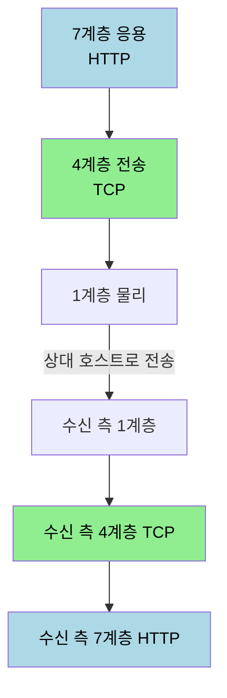
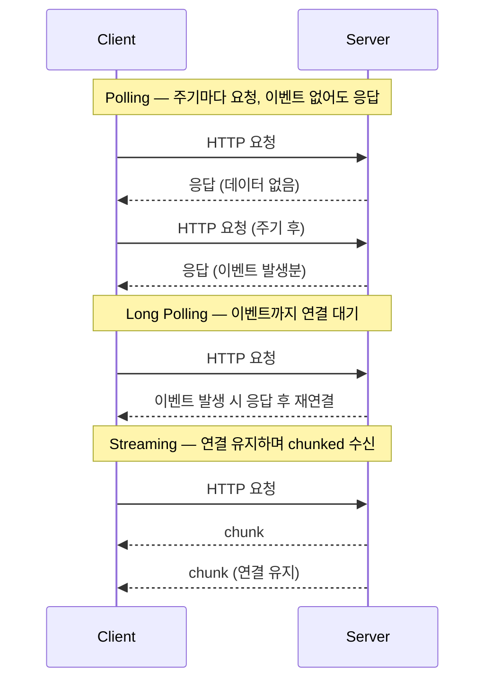
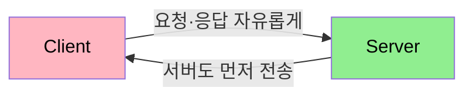

# HTTP·TCP 통신과 HTTP vs Socket

---

> 실시간 양방향 통신을 다루기 전에, 먼저 *왜 HTTP 만으로는 실시간이 안 되는가* 를 짚어야 합니다. 그 답은 HTTP 와 TCP 가 서로 다른 계층의 규약이고, HTTP 가 단방향 요청-응답 모델이라는 데 있습니다. 이 문서를 읽고 나면 HTTP 와 TCP 가 OSI 어느 계층에 속하는지, HTTP 가 단방향인 이유가 무엇인지, HTTP 로 실시간을 흉내 내는 세 방식의 한계가 무엇인지, 그리고 Socket·WebSocket 이 그 한계를 어떻게 넘는지 설명할 수 있습니다.

## 1. OSI 7계층과 프로토콜

> HTTP 와 TCP 는 둘 다 통신 규약이지만 서로 다른 계층의 규약입니다. 이 계층 차이가 두 통신의 성격을 가릅니다.

OSI(Open Systems Interconnection) 7계층은 국제표준기구(ISO)가 만든 네트워크 계층 모델입니다. 데이터를 주고받으려면 1계층부터 7계층까지를 차례로 거쳐야 하고, 각 계층마다 그 계층의 프로토콜 헤더가 데이터에 덧붙습니다. 헤더가 겹겹이 붙은 이 데이터 묶음을 패킷(packet)이라고 부릅니다.

여기서 TCP 와 HTTP 의 자리가 갈립니다. TCP 는 4계층(전송 계층)의 규약이고, HTTP 는 7계층(응용 계층)의 규약입니다. 데이터가 1계층까지 내려갔다 다시 올라와야 하므로, 7계층의 HTTP 통신도 결국 4계층의 TCP 통신을 거치게 됩니다. 이 사실 — "HTTP 도 TCP 를 거친다" — 이 뒤에서 HTTP 의 동작을 설명하는 열쇠입니다.

프로토콜(protocol)은 상호 간의 접속·통신 방식, 주고받을 자료의 형식, 오류 검출 방식, 코드 변환 방식, 전송 속도 등에 대해 미리 정해 둔 약속입니다. TCP 와 HTTP 는 각자 계층에서 이 약속을 정의한 규약입니다.

## 2. TCP 통신

> TCP 는 연결을 맺고 끊는 절차를 가진 규약입니다. 이 연결 위에서 소켓이 양방향 통신을 가능하게 합니다.

TCP 통신은 연결을 맺을 때 3-way handshake 라는 과정을 거치고, 연결을 끊을 때 4-way handshake 라는 과정을 거칩니다. 연결을 명시적으로 수립하고 종료한다는 점에서, 연결 없이 데이터만 던지는 방식과 구분됩니다.

TCP 통신에서는 소켓(socket)을 이용한 연결 방식을 씁니다. 소켓으로 연결을 맺으면 양방향 통신이 가능해지는데, 클라이언트와 서버가 서로 요청을 보낼 수 있는 구조라는 뜻입니다. 이 "양방향이 가능하다" 는 성질이 뒤에서 볼 Socket 통신의 토대가 됩니다.

## 3. HTTP 통신

> HTTP 도 TCP 위에서 이루어지는데, 그렇다면 TCP 와 무엇이 다를까요? 차이는 데이터를 주고받는 단계의 방식에 있습니다.

TCP 통신의 흐름은 `connect → transmit → disconnect` 의 과정을 거칩니다. HTTP 통신의 흐름도 겉보기에는 같은 `connect → transmit → disconnect` 이지만, 각 단계의 처리 주체가 다릅니다. `connect` 와 `disconnect` 는 TCP 의 방식으로 처리하고, 가운데 `transmit` 만 HTTP 의 방식으로 처리합니다. 연결을 맺고 끊는 일은 TCP 가, 실제 데이터를 실어 나르는 규약은 HTTP 가 맡는 셈입니다.

그렇다면 TCP 방식을 거의 다 쓰는데 HTTP 는 왜 TCP 처럼 양방향이 안 될까요? 여기서 의문이 생깁니다. HTTP 도 TCP 를 거치니 3~4 way handshake 를 거치고, TCP 에서 소켓을 사용해 연결과 끊음을 진행하며, 데이터 전송 과정도 결국 TCP 를 사용합니다. 그런데도 HTTP 는 단방향입니다.

답은 데이터를 전송할 때 쓰이는 *소켓의 통신 방식* 이 TCP 와 다르게 동작하기 때문입니다. 애초에 소켓이 사용되는 계층이 서로 다릅니다. HTTP 가 소켓 기반인 이유는 그 바탕이 TCP 이기 때문이지만, HTTP 의 `transmit` 단계는 요청 한 번에 응답 한 번으로 끝나는 단방향 규약으로 정의돼 있습니다. 그래서 같은 소켓을 쓰더라도 HTTP 는 양방향이 되지 못합니다.

HTTP 통신을 정리하면, 클라이언트의 요청이 있을 때만 서버가 응답해서 정보를 전송하고 곧바로 연결을 끊는 방식입니다. 그래서 세 가지 성질을 가집니다.

- 단방향 통신 — 클라이언트가 요청(Request)하고 서버가 응답(Response)하는 한 방향입니다.
- 연결 상태를 유지하지 않음 — 응답 뒤 연결을 끊는 무상태(stateless) 방식입니다.
- 매 요청마다 정보를 새로 만들어 통신 — 연결을 재사용하지 않으므로 요청마다 필요한 정보를 다시 실어 보냅니다.

HTTP 통신의 목적은 애초에 HTML·JSON·이미지 같은 파일 전송에 있습니다. 한편 소켓이 쓰인다고 해서 모두 소켓 프로그래밍이라 부르지는 않습니다. 그 소켓이 어떤 용도로 쓰이느냐에 따라 HTTP 프로그래밍이 되기도, 소켓 프로그래밍이 되기도 합니다. 동영상 스트리밍이나 실시간 채팅처럼 실시간 서비스를 구현할 때 쓰는 쪽이 소켓 프로그래밍이고, 여기에는 주로 웹 소켓 기술을 씁니다.

## 4. HTTP 로 실시간을 흉내 내는 세 방식

> HTTP 가 단방향이어도 실시간이 필요한 상황은 있습니다. 그래서 HTTP 위에서 실시간을 흉내 내는 세 방식이 나왔는데, 각각 한계가 분명합니다.

HTTP 의 실시간 통신 방식은 Polling, Long Polling, Streaming 세 가지입니다. 셋의 동작과 한계를 표로 먼저 정리합니다.

| 방식 | 동작 | 한계 |
|------|------|------|
| Polling | 브라우저가 일정 주기마다 서버에 HTTP 요청을 보냄 | 이벤트가 없어도 요청해 서버·클라이언트 부담. 주기 설정이 부하와 실시간성의 trade-off |
| Long Polling | 요청 시 서버가 연결을 바로 끊지 않고 일정 시간 대기 | 이벤트 발생 시 응답 후 다시 연결. 잦은 데이터 변경 시 서버 부담 큼 |
| Streaming | 응답을 완료하지 않은 채 계속 데이터를 받음 | 연결을 유지해 부하를 줄이지만, 클라이언트에서 서버로 데이터를 보내기 어려움 |

Polling 은 브라우저가 일정한 주기마다 서버에 HTTP 요청을 보내는 방식입니다. 실시간 야구 문자 중계처럼 5~10초 주기로 계속 업데이트하는 경우가 그 예입니다. 그런데 실시간 데이터의 갱신 주기는 예측할 수 없으므로, 이벤트가 없는데도 요청을 보내게 되어 불필요한 요청에 따른 서버·네트워크 과부하가 생깁니다. 주기(time interval)를 짧게 잡으면 실시간성은 좋아지지만 부하가 올라가고, 길게 잡으면 부하는 줄지만 실시간성이 떨어지는 trade-off 관계입니다.

Long Polling 은 HTTP 요청 시 서버가 연결을 바로 해제하지 않고 일정 시간 대기하는 방식입니다. Polling 의 서버 부하를 줄이면서 실시간성을 높이려는 절충입니다. 서버에 연결 요청을 보내 두면 서버는 이벤트가 발생할 때 응답하고 다시 연결을 받습니다. 다만 이벤트가 발생하면 대기 중인 클라이언트들에게 동시에 응답을 보내고 연결을 끊은 뒤 새 요청을 받으므로, 여러 클라이언트와 잦은 데이터 변경이 겹치면 서버 부담이 큽니다.

Streaming 은 요청에 대한 응답을 완료하지 않은 상태에서 계속 데이터를 받는 방식입니다. Long Polling 의 연결 재구축 부하를 해결합니다. 서버는 요청을 무한정 혹은 일정 시간 대기시키고, chunked 메시지를 이용해 응답하면서 연결을 계속 유지합니다. 클라이언트는 연결 요청을 보내 두고 계속 응답 데이터를 받습니다. 한계는 방향입니다. 서버가 클라이언트로 보내는 데는 좋지만, 클라이언트가 서버로 데이터를 보내기는 어렵습니다.

## 5. Socket 통신과 WebSocket

> 세 흉내 방식의 공통 한계는 결국 HTTP 의 단방향성입니다. Socket 통신은 연결을 유지한 채 양쪽이 자유롭게 주고받는 방식으로 이 한계를 넘습니다.

Socket 통신은 클라이언트와 서버가 특정 포트를 통해 연결을 성립한 상태를 유지하며, 실시간으로 양방향 통신을 하는 방식입니다. HTTP 와 달리 두 가지 성질을 가집니다.

- 양방향 통신 — 클라이언트와 서버가 서로 요청을 보냅니다. 서버도 클라이언트에게 먼저 요청할 수 있습니다.
- 연결 상태를 유지 — 연결을 끊지 않고 유지하는 상태 유지(stateful) 방식입니다.

Socket 통신은 최초의 handshake 과정에서 HTTP 프로토콜을 이용하기 때문에 그 순간에는 기존 HTTP 처럼 데이터를 주고받지만, 연결이 수립된 이후에는 간단한 데이터만 오갑니다. 매 요청마다 무거운 정보를 다시 싣는 HTTP 와 갈리는 지점입니다.

웹 소켓(WebSocket)은 7계층에서 양방향 통신을 하기 위해 만들어진 프로토콜 기술입니다. 일반 소켓(TCP 기반 소켓)처럼 양방향 실시간 통신이 가능하고 IP 와 포트를 사용해 통신한다는 공통점이 있지만, 동작 계층이 다릅니다. 웹 소켓은 HTTP 기반인 7계층에서 동작하고, 일반 소켓은 TCP 기반인 4계층에서 동작합니다.

웹 소켓은 WebSocket 프로토콜이라는 새 규약 위에서 이루어집니다. 별도의 전용 포트는 없으며 포트 `80` 과 `443` 을 사용하도록 설계됐습니다. HTTP 는 `80`, HTTPS 는 `443` 에서 이루어지므로, 웹 소켓은 HTTP·HTTPS 와 호환됩니다. 이 호환성 덕분에 방화벽이나 프록시 환경에서도 별도 포트 개방 없이 동작할 수 있습니다.

## 6. HTTP vs Socket 정리

> 두 통신 모델의 차이를 한 표로 정리합니다. 실시간이 필요하면 어느 쪽을 골라야 하는지가 이 표에서 드러납니다.

| 항목 | HTTP | Socket |
|------|------|--------|
| 방향성 | 단방향 (요청 후 응답) | 양방향 (서버도 먼저 전송) |
| 연결 유지 | 응답 후 끊음 | 연결 유지 |
| 상태 | 무상태(stateless) | 상태 유지(stateful) |
| 데이터 크기 | 매 요청마다 정보 새로 실음 | 연결 후 간단한 데이터만 오감 |
| 주 용도 | HTML·JSON·이미지 파일 전송 | 실시간 채팅·스트리밍 |

HTTP 는 파일을 주고받는 요청-응답에 최적화돼 있고, Socket 은 연결을 유지하며 양쪽이 수시로 메시지를 주고받는 실시간에 최적화돼 있습니다. 실시간성이 핵심이면 HTTP 흉내 방식(Polling 계열)의 부하·방향 한계 대신 Socket 계열을 택하는 편이 자연스럽습니다.

실시간 통신 기술을 네 갈래로 펼쳐 비교하면 선택 기준이 더 분명해집니다. Polling·Long Polling 은 HTTP 흉내, SSE 는 HTTP 기반 단방향 표준, WebSocket 은 양방향 전용 프로토콜입니다.

| 기술 | 통신 방향 | 실시간성 | 요청 오버헤드 | 서버 부하 | 방화벽 |
|------|----------|---------|--------------|----------|--------|
| Polling | 단방향 | 낮음 | 높음 | 중간 | 통과 |
| Long Polling | 단방향 | 중간 | 중간 | 높음 | 통과 |
| SSE | 단방향 | 높음 | 낮음 | 낮음 | 통과 |
| WebSocket | 양방향 | 높음 | 매우 낮음 | 높음 | 차단 가능 |

양방향이 빈번하면 WebSocket, 서버가 밀어 주기만 하면 되는 단방향이면 SSE 가 정답에 가깝습니다. 양방향이 가끔 필요한 정도면 "SSE + REST API" 조합으로도 충분합니다. SSE 의 동작 원리와 HTTP/2 기반은 [`01-02`](01-02.HTTP2와%20실시간%20통신%20기반.md) 와 [`02-01`](02-01.SSE%20원리와%20Spring%20구현.md) 에서 이어집니다.

## 7. 면접 대비 체크리스트

> 본 문서를 다 읽은 뒤 다음 질문에 답할 수 있어야 합니다.

1. HTTP 도 TCP 를 거치고 소켓을 쓰는데 왜 TCP 처럼 양방향이 되지 못합니까?
2. HTTP 로 실시간을 흉내 내는 세 방식(Polling·Long Polling·Streaming)은 각각 어떤 한계를 가집니까?
3. 웹 소켓이 전용 포트 대신 `80` 과 `443` 을 쓰도록 설계된 이유는 무엇입니까? 일반 소켓과 동작 계층은 어떻게 다릅니까?

## 다음에 읽을 것

- [`01-02.HTTP2와 실시간 통신 기반.md`](01-02.HTTP2와%20실시간%20통신%20기반.md) — HTTP/2 멀티플렉싱이 SSE 를 쓸 만하게 만든 배경
- [`02-01.SSE 원리와 Spring 구현.md`](02-01.SSE%20원리와%20Spring%20구현.md) — 단방향 푸시 SSE
- [`03-01.WebSocket 프로토콜과 핸드셰이크.md`](03-01.WebSocket%20프로토콜과%20핸드셰이크.md) — WebSocket 프로토콜 한 겹 아래
- [Reactor Netty 학습 MOC](../reactive-net/README.md) — WebSocket 도 결국 같은 전송 계층 위에서 동작
