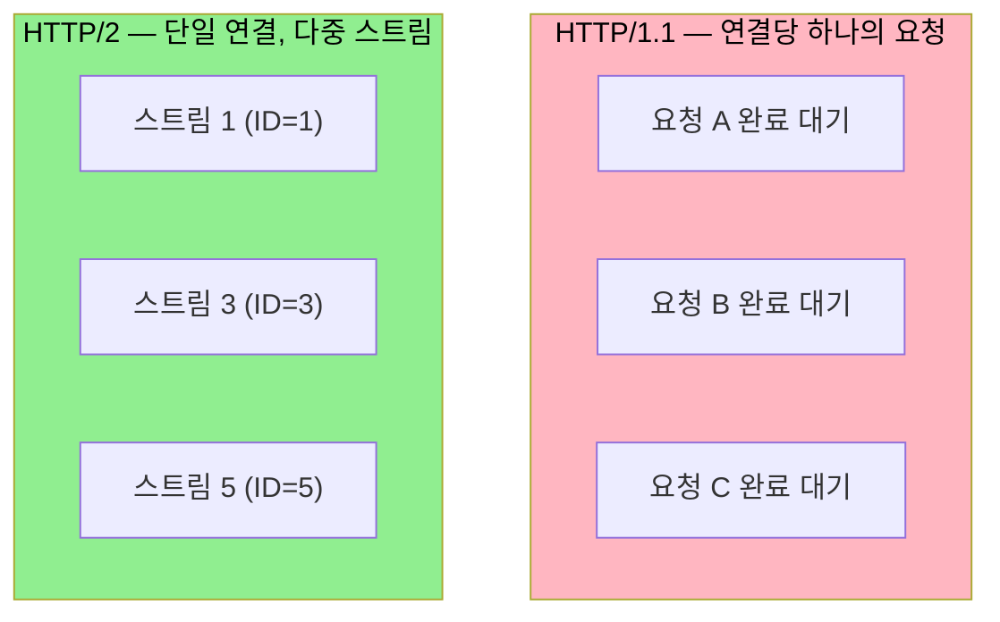
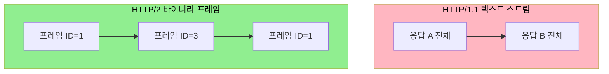

# HTTP/2와 실시간 통신 기반

---

> [`01-01`](01-01.HTTP·TCP%20통신과%20HTTP%20vs%20Socket.md) 에서 HTTP 의 단방향 한계와 실시간 흉내 방식을 봤습니다. 그런데 SSE 같은 HTTP 기반 실시간 기술이 실제로 쓸 만해진 데는 HTTP/2 의 멀티플렉싱이 큰 몫을 합니다. 이 문서를 읽고 나면 HTTP/1.1 의 연결 제한과 Head-of-Line Blocking, HTTP/2 가 이를 푸는 멀티플렉싱·프레임 구조, 그리고 SSE 와 HTTP/2 의 시너지를 설명할 수 있습니다.

## 1. HTTP/1.1 의 연결 제한

> HTTP/1.1 은 하나의 연결에서 요청-응답이 순차적입니다. 그래서 브라우저는 도메인당 여러 연결을 열어 병렬 처리하는데, 이 연결 수에 제한이 있습니다.

HTTP/1.1 은 하나의 연결에서 요청 A 의 응답이 완전히 도착할 때까지 요청 B 의 응답을 받을 수 없습니다. 큰 파일을 받는 중이면 뒤의 작은 요청들이 모두 대기하는데, 이것을 Head-of-Line Blocking 이라고 합니다. HTTP/1.1 에도 여러 요청을 연속으로 보내는 파이프라이닝이 있었지만, 응답은 여전히 요청 순서대로 와야 해서 같은 문제가 남았고 대부분의 브라우저에서 비활성화됐습니다.

이 한계를 피하려고 브라우저는 같은 도메인에 여러 TCP 연결을 엽니다. 다만 보안과 성능 이유로 동일 도메인에 최대 6개의 연결만 허용합니다. 웹페이지에 이미지·CSS·JS 가 수십 개 있으면 6개 연결로 나눠 병렬 처리합니다.

여기서 SSE 의 문제가 드러납니다. SSE 연결은 끊지 않고 계속 열어 두므로, 사용자가 같은 서비스의 탭을 6개 열면 SSE 가 6개 연결 슬롯을 모두 차지합니다. 그러면 일반 REST API 요청이나 이미지 로딩이 차단됩니다. Chrome·Firefox 에서 "Won't fix" 로 마감된 알려진 이슈입니다.

## 2. HTTP/2 멀티플렉싱

> HTTP/2 의 핵심은 멀티플렉싱입니다. 하나의 TCP 연결 위에서 여러 논리적 "스트림" 을 동시에 운영해, 6개 연결 제한을 사실상 해소합니다.

HTTP/2 는 하나의 TCP 연결 위에서 여러 요청을 동시에 처리합니다. 기본적으로 128개 안팎의 동시 스트림이 가능하며 서버 설정으로 더 늘릴 수 있습니다. 멀티플렉싱을 이해하려면 HTTP/2 의 기본 단위인 프레임과 스트림을 알아야 합니다.

- 프레임(frame) — HTTP/2 의 가장 작은 통신 단위입니다. 헤더 프레임, 데이터 프레임 등이 있습니다.
- 스트림(stream) — 하나의 요청-응답 쌍을 나타내는 논리적 채널입니다. 각 스트림은 고유한 ID 를 가집니다.
- 인터리빙(interleaving) — 여러 스트림의 프레임이 섞여서 전송됩니다. 하나의 응답이 끝날 때까지 기다리지 않고 동시에 여러 응답을 받습니다.

스트림 ID 는 클라이언트가 시작하면 홀수, 서버가 시작하면 짝수로 만들어집니다. 서버는 준비된 데이터부터 프레임으로 보내고, 클라이언트는 스트림 ID 를 보고 어떤 요청의 응답인지 구분합니다. 덕분에 Stream 1 의 응답이 매우 크더라도 Stream 3·5 의 작은 응답이 먼저 완료될 수 있습니다.

## 3. 바이너리 프레이밍 — 멀티플렉싱이 가능한 이유

> HTTP/1.1 은 텍스트 프로토콜이라 순서에 의존했고, HTTP/2 는 바이너리 프레임으로 메시지를 식별합니다. 이 차이가 인터리빙을 가능하게 합니다.

HTTP/1.1 은 텍스트 기반 프로토콜입니다. 요청·응답이 텍스트로 전송되고, 메시지의 끝을 알려고 빈 줄(`\r\n\r\n`)이나 `Content-Length` 헤더에 의존했습니다. 메시지를 순서로 구분하므로 순차 처리를 강제할 수밖에 없습니다.

HTTP/2 는 바이너리 프로토콜을 씁니다. 모든 메시지가 고정된 구조의 프레임으로 캡슐화됩니다. 핵심은 모든 프레임에 스트림 ID 가 들어 있다는 점입니다. 프레임이 어떤 순서로 도착하든 스트림 ID 를 보면 어떤 요청·응답에 속하는지 즉시 알 수 있어, 프레임 단위로 섞어 보내는 인터리빙이 가능해집니다.

HTTP/2 프레임은 9바이트 헤더를 가집니다.

| 필드 | 크기 | 설명 |
|------|------|------|
| Length | 3바이트 | 페이로드 길이 |
| Type | 1바이트 | 프레임 종류 (HEADERS=0x1, DATA=0x0) |
| Flags | 1바이트 | END_STREAM·END_HEADERS 등 |
| Stream ID | 4바이트 | 스트림 식별자 |
| Payload | 가변 | 실제 데이터 |

두 버전의 차이를 정리하면 다음과 같습니다.

| 특성 | HTTP/1.1 | HTTP/2 |
|------|----------|--------|
| 메시지 형식 | 텍스트 | 바이너리 프레임 |
| 메시지 식별 | 순서에 의존 | 스트림 ID |
| 메시지 경계 | Content-Length·빈 줄 | 프레임 Length 필드 |
| 동시 처리 | 불가 (순차) | 가능 (인터리빙) |

## 4. SSE 와 HTTP/2 의 시너지

> HTTP/2 위에서 SSE 는 6개 연결 제한에서 벗어납니다. 끊기지 않는 SSE 연결이 스트림 하나만 차지하기 때문입니다.

SSE 연결은 하나의 스트림을 점유합니다. HTTP/1.1 에서는 이것이 6개 연결 중 1개를 차지했지만, HTTP/2 에서는 128개 스트림 중 1개만 차지합니다. 탭을 10개 열어도 SSE 연결이 10개의 스트림만 쓰고, 나머지 스트림으로 다른 요청을 처리할 수 있습니다.

즉 [`01-01`](01-01.HTTP·TCP%20통신과%20HTTP%20vs%20Socket.md) 과 [`02-01`](02-01.SSE%20원리와%20Spring%20구현.md) 에서 본 SSE 의 "탭을 여러 개 열면 연결 슬롯을 잡아먹는" 한계가 HTTP/2 에서 사실상 사라집니다. SSE 가 더 이상 제한된 옵션이 아니라 효율적인 선택지가 된 배경입니다.

## 5. HTTP/2 에서도 여러 연결이 생기는 경우

> HTTP/2 의 단일 연결은 이상적인 경우이고, 실제로는 여러 연결이 열리기도 합니다. 원인을 알면 운영에서 연결 수를 예측할 수 있습니다.

| 상황 | 연결 수 | 이유 |
|------|---------|------|
| 단일 도메인, HTTP/2 | 1개 | 이상적인 경우 |
| 여러 도메인 | 도메인 수만큼 | Origin 분리 |
| Coalescing 가능 | 1개로 합침 | IP·인증서 공유 |
| 스트림 제한 초과 | 추가 연결 | 서버 설정 |
| HTTP/2 미지원 | 최대 6개 | HTTP/1.1 폴백 |

HTTP/2 도 도메인별로 연결이 분리됩니다. `api.example.com` 과 `cdn.example.com` 은 별도 연결입니다. 다만 Connection Coalescing 이라는 최적화가 있어, 여러 도메인이 같은 IP 와 같은 TLS 인증서를 공유하면 하나의 연결로 합칠 수 있습니다. 반대로 서버가 `SETTINGS_MAX_CONCURRENT_STREAMS` 로 동시 스트림 수를 제한하면(기본 100~128, 더 낮출 수도 있음) 그 수를 넘는 요청은 추가 연결을 만듭니다.

## 6. 면접 대비 체크리스트

> 본 문서를 다 읽은 뒤 다음 질문에 답할 수 있어야 합니다.

1. HTTP/1.1 의 Head-of-Line Blocking 은 무엇이며, 브라우저는 이를 어떻게 우회합니까?
2. HTTP/2 멀티플렉싱에서 프레임·스트림·인터리빙은 각각 무엇입니까?
3. HTTP/2 가 인터리빙으로 동시 처리를 할 수 있는 근본 이유(바이너리 프레이밍)는 무엇입니까?
4. SSE 가 HTTP/1.1 에서 겪던 연결 제한이 HTTP/2 에서 왜 사라집니까?

## 다음에 읽을 것

- [`01-01.HTTP·TCP 통신과 HTTP vs Socket.md`](01-01.HTTP·TCP%20통신과%20HTTP%20vs%20Socket.md) — HTTP 의 단방향 한계와 실시간 흉내 (선행 문서)
- [`02-01.SSE 원리와 Spring 구현.md`](02-01.SSE%20원리와%20Spring%20구현.md) — HTTP/2 위에서 동작하는 SSE
