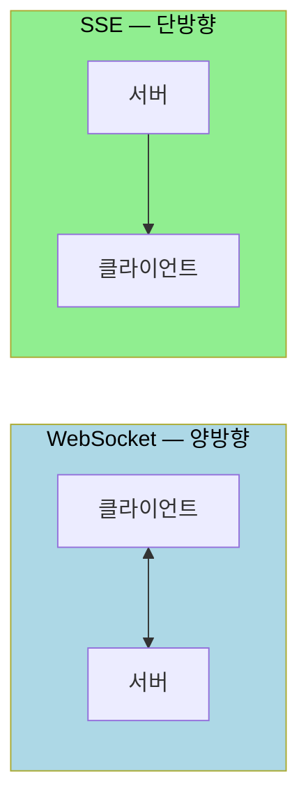
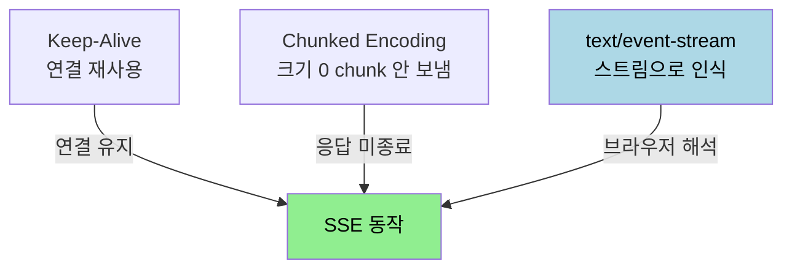
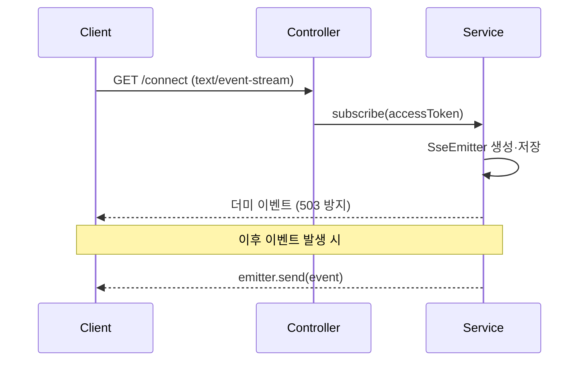

# SSE 원리와 Spring 구현

---

> [`01-01`](01-01.HTTP·TCP%20통신과%20HTTP%20vs%20Socket.md) 에서 HTTP 로 실시간을 흉내 내는 Streaming 방식을 봤습니다. SSE(Server-Sent Events)는 그 Streaming 을 표준화한 기술로, 서버가 클라이언트로 데이터를 실시간 스트리밍합니다. 이 문서를 읽고 나면 SSE 가 HTTP 위에서 동작하는 원리(Keep-Alive·Chunked·필수 헤더), 이벤트 스트림 포맷, 그리고 Spring `SseEmitter` 로 구현하는 방법을 설명할 수 있습니다.


## 1. SSE 란

> SSE 는 데이터를 실시간으로 Streaming 하는 기술입니다. 기존 HTTP 웹 서버에서 HTTP API 만으로 동작하므로 진입 비용이 낮습니다.

기존에는 서버의 변경된 데이터를 가져오려면 새로고침, 지속적인 요청을 보내는 ajax 폴링, 외부 플러그인을 써야 했습니다. WebSocket 도 쓸 수 있지만, HTTP 통신이 아니라 WebSocket 만을 위한 별도 서버와 프로토콜로 통신하므로 비용이 더 듭니다. SSE 는 기존 HTTP 웹 서버에서 HTTP API 만으로 동작하므로 개발이 한결 수월합니다.

공식 표준에 따르면 SSE 는 단일 HTTP 연결로 서버가 클라이언트에 실시간 스트리밍하는 표준이며, `text/event-stream` MIME 타입을 씁니다. 통신은 서버가 데이터 전송을 주도하는 단방향입니다. SSE 를 한 문장으로 정의하면 "HTTP 연결을 열어 두고 서버가 원할 때마다 클라이언트에게 데이터를 푸시하는 기술" 입니다.


## 2. SSE 의 특징과 사용 시점

> SSE 는 서버가 보내는 스트림을 받기만 하는 읽기 전용 단방향 통신입니다. HTTP 위에서 동작하고 자동 재연결을 제공합니다.

SSE 의 특징은 다음과 같습니다.

- 브라우저는 서버가 생성한 스트림을 계속 받습니다. 서버에서 보내는 스트림으로 읽기 전용입니다.
- 연결 유지를 위해 HTTP 프로토콜을 쓰며, HTTP/2 를 통한 multiplexing 도 가능합니다([`01-02`](01-02.HTTP2와%20실시간%20통신%20기반.md) 참고).
- 연결이 끊어지면 클라이언트가 오류를 감지하고 자동으로 다시 연결을 시도합니다. 이 자동 재연결은 [`02-02`](02-02.SSE%20신뢰성%20—%20재연결과%20손실%20복구.md) 에서 다룹니다.
- 텍스트 전용이라 바이너리 데이터(이미지·파일)는 직접 전송하지 못합니다.

사용 시점은 효율적인 단방향 통신이 필요하거나, 실시간 데이터 스트리밍에 HTTP 를 쓰려는 경우입니다. 암호 화폐·주가 피드 구독, 라이브 스포츠 점수, 뉴스 업데이트나 알림, AI 텍스트 스트리밍(ChatGPT 식)이 대표적입니다.


## 3. SSE vs WebSocket

> SSE 와 WebSocket 은 둘 다 실시간이지만 방향과 프로토콜이 다릅니다. 어느 쪽을 고를지는 단방향이냐 양방향이냐가 첫 갈림길입니다.

두 기술을 공식 기준으로 비교하면 다음과 같습니다.

| 항목 | WebSocket | SSE |
|------|-----------|-----|
| 통신 방향 | 양방향 (full-duplex) | 단방향 (서버에서 클라이언트로) |
| 프로토콜 | WebSocket 프로토콜 (ws/wss) | HTTP (`text/event-stream`) |
| 데이터 형태 | Binary·텍스트 | UTF-8 텍스트 |
| 자동 재접속 | 직접 구현 | 클라이언트가 자동 제공 |
| 연결당 버퍼 | 송·수신 양방향 | 송신 단방향 (비용 낮음) |
| 방화벽 친화 | 별도 프로토콜이라 까다로움 | HTTP 라 친화적 |
| 적합한 용도 | 채팅·트레이딩 등 양방향 | 알림·피드 등 단방향 푸시 |



WebSocket 은 양방향이라 단방향인 SSE 의 일도 할 수 있습니다. 그러나 스펙 차이 때문에 사용처가 갈립니다. 카카오톡·주식 트레이딩처럼 양방향 실시간이면 WebSocket 을, SNS 친구 요청이나 알람처럼 서버가 밀어 주기만 하면 되는 단방향이면 SSE 를 고릅니다. 연결당 버퍼와 핸드셰이크 비용은 SSE 가 더 낮으므로, 단방향으로 충분하면 SSE 가 효율적입니다.

양방향이 가끔 필요하다면 "SSE + REST API" 조합도 자주 씁니다. 서버에서 클라이언트로의 실시간 푸시는 SSE 가, 클라이언트에서 서버로의 사용자 액션은 REST API 가 맡는 분업입니다.


## 4. SSE 가 HTTP 위에서 동작하는 원리

> SSE 는 새 프로토콜이 아니라 HTTP 응답을 *끝내지 않는* 방식입니다. 세 가지 기술 — Keep-Alive 와의 차이, Chunked Encoding, MIME 타입 — 이 이를 가능하게 합니다.

HTTP 는 본래 "요청 다음 응답, 그리고 연결 종료" 패턴입니다. SSE 는 서버가 응답을 보내고도 연결을 닫지 않고 열어 둔 채, 새 데이터가 생길 때마다 같은 연결로 전송합니다. 즉 *하나의 응답이 끝나지 않고 계속 진행 중*인 상태를 유지합니다.

여기서 HTTP/1.1 의 `Connection: keep-alive` 와 헷갈리기 쉽습니다. Keep-Alive 는 TCP *연결을 재사용*하는 것이지 *응답을 재사용*하는 게 아닙니다. Keep-Alive 에서도 각 응답은 완료되며, 다음 데이터를 받으려면 새 요청이 필요합니다. 반면 SSE 는 응답 자체가 끝나지 않으므로, 서버가 원하는 시점에 데이터를 밀어 넣을 수 있습니다.

응답을 끝내지 않으려면 Chunked Transfer Encoding 을 씁니다. 일반 Chunked 응답은 마지막에 크기 0 인 chunk 를 보내 "응답 끝"을 알리는데, SSE 는 *의도적으로 크기 0 chunk 를 보내지 않아* 응답을 끝내지 않습니다. 그리고 브라우저가 이 끝나지 않는 응답을 "이벤트 스트림"으로 해석하게 하는 키가 `Content-Type: text/event-stream` 헤더입니다.



SSE 가 동작하려면 서버가 세 가지 헤더를 설정해야 합니다.

- `Content-Type: text/event-stream` — 브라우저에게 SSE 스트림임을 알립니다. 없으면 일반 HTTP 응답으로 처리됩니다.
- `Cache-Control: no-cache` — 프록시·브라우저가 실시간 데이터를 캐싱하지 않도록 합니다.
- `Connection: keep-alive` — 연결을 유지하도록 요청합니다.

Spring 에서는 `SseEmitter` 가 이 헤더 설정과 버퍼 flush 를 내부적으로 처리하므로, 핸들러 메서드의 `produces = MediaType.TEXT_EVENT_STREAM_VALUE` 만 지정하면 됩니다. 다만 앞단에 Nginx 같은 리버스 프록시가 있으면 프록시도 응답을 버퍼링하므로, SSE 경로에는 `proxy_buffering off` 와 충분한 `proxy_read_timeout` 설정이 필요합니다.


## 5. 이벤트 스트림 포맷

> SSE 의 응답은 정해진 텍스트 포맷을 가집니다. 이 포맷이 자동 재연결·이벤트 구분 같은 SSE 의 강점을 만듭니다.

MDN 공식 문서에 따르면 이벤트 스트림은 UTF-8 텍스트이고, 메시지는 빈 줄 한 쌍(`\n\n`)으로 구분됩니다. 각 메시지는 다음 필드로 이루어집니다.

| 필드 | 필수 | 의미 |
|------|------|------|
| `data:` | 필수 | 실제 메시지 내용. 연속된 `data` 줄은 개행으로 이어 붙임 |
| `event:` | 선택 | 이벤트 타입명. 클라이언트가 타입별로 핸들러를 분리하게 함 |
| `id:` | 선택 | 이벤트 ID. 클라이언트의 last event ID 값을 설정 |
| `retry:` | 선택 | 연결이 끊겼을 때 재연결까지 기다릴 시간(밀리초) |
| `:` 로 시작 | 선택 | 주석. 무시되며 연결 타임아웃을 막는 하트비트로 활용 |

각 메시지는 반드시 빈 줄(`\n\n`)로 끝나야 합니다. 끝나지 않으면 클라이언트는 메시지가 아직 안 끝났다고 판단합니다. `event:` 필드가 없으면 이벤트 타입은 기본값 `message` 가 됩니다.

이 필드들이 Spring `SseEmitter.event()` 빌더에 그대로 대응합니다. `id`·`event`·`data`·`reconnectTime`(= `retry`)를 빌더 메서드로 채워 보냅니다. 자동 재연결과 `id`·`retry` 의 동작은 [`02-02`](02-02.SSE%20신뢰성%20—%20재연결과%20손실%20복구.md) 에서 자세히 다룹니다.


## 6. Spring 구현 — 기본 흐름

> Spring 에서 SSE 는 `SseEmitter` 로 구현합니다. 연결 요청을 받아 Emitter 를 생성·저장하고, 이벤트가 발생하면 전송하는 흐름입니다.

`SseEmitter` 는 `ResponseBodyEmitter` 의 서브클래스로, W3C SSE 명세에 맞춰 이벤트를 전송합니다. 공식 문서의 최소 형태는 다음과 같습니다. 핸들러는 `SseEmitter` 를 만들어 어딘가 저장해 두고 반환하며, 이후 다른 스레드에서 `send()`·`complete()` 를 호출합니다.

```java
@GetMapping(path = "/events", produces = MediaType.TEXT_EVENT_STREAM_VALUE)
public SseEmitter handle() {
	SseEmitter emitter = new SseEmitter();
	// emitter를 어딘가 저장해 둔다
	return emitter;
}

// 다른 스레드에서
emitter.send("Hello once");
emitter.send("Hello again");
emitter.complete();
```

기본 흐름은 세 단계입니다.

1. 클라이언트가 SSE 연결 요청을 보냅니다.
2. 서버는 클라이언트와 매핑되는 `SseEmitter` 를 만들어 저장합니다.
3. 서버에서 이벤트가 발생하면 저장해 둔 emitter 로 데이터를 전달합니다.




## 7. Spring 구현 — Controller·Repository·Service

> 컨트롤러는 `text/event-stream` 으로 연결을 받고, Repository 는 Emitter 와 이벤트를 보관하며, Service 는 구독과 이벤트 전송을 처리합니다.

Controller 는 연결 요청을 `text/event-stream` MIME 으로 받고 `SseEmitter` 를 그대로 반환합니다.

```java
@RestController
@RequestMapping("/alarms")
@RequiredArgsConstructor
@Slf4j
public class AlarmController {

	private final SseService sseService;

	@GetMapping(value = "/connect", produces = MediaType.TEXT_EVENT_STREAM_VALUE)
	public SseEmitter subscribe(@RequestHeader(name = "Authorization") String accessToken) {
		return alarmService.subscribe(accessToken);
	}
}
```

반환값은 다른 객체로 감싸지 말고 `SseEmitter` 로 해야 클라이언트가 제대로 받습니다.

Repository 는 어떤 회원에게 어떤 Emitter 가 연결됐는지, 어떤 이벤트가 발생했는지를 보관합니다. 기존 `JpaRepository` 로는 이 상태를 담기 까다로우므로 `ConcurrentHashMap` 기반으로 따로 구현합니다.

```java
@Repository
public class EmitterRepository {

	private final Map<String, SseEmitter> emitters = new ConcurrentHashMap<>();
	private final Map<String, Object> eventCache = new ConcurrentHashMap<>();

	public SseEmitter save(String emitterId, SseEmitter sseEmitter) {
		emitters.put(emitterId, sseEmitter);
		return sseEmitter;
	}

	public void saveEventCache(String eventCacheId, Object event) {
		eventCache.put(eventCacheId, event);
	}

	public Map<String, SseEmitter> findAllEmitterStartWithByMemberId(String memberId) {
		return emitters.entrySet().stream()
				.filter(entry -> entry.getKey().startsWith(memberId))
				.collect(Collectors.toMap(Map.Entry::getKey, Map.Entry::getValue));
	}

	public void deleteById(String id) {
		emitters.remove(id);
	}
}
```

`emitters` 는 Emitter 자체를, `eventCache` 는 발생한 이벤트를 보관합니다. 이벤트 캐시가 [`02-02`](02-02.SSE%20신뢰성%20—%20재연결과%20손실%20복구.md) 의 `Last-Event-ID` 재개에서 유실 데이터를 보충하는 장치입니다.

Service 는 구독과 이벤트 전송을 처리합니다. 구독 시 Emitter 를 만들어 저장하고, 만료·타임아웃·오류에 자동 제거 콜백을 달며, 연결 직후 더미 이벤트를 한 번 보냅니다.

```java
public SseEmitter subscribe(String accessToken) {
	User user = userService.findUserEntity(accessToken, true);
	String userId = String.valueOf(user.getId());

	// 1. accessToken + _ + 현재 시간으로 id 생성
	String emitterId = makeTimeIncludeId(userId);

	// 2. 생성한 emitter repository에 저장
	SseEmitter emitter = sseRepository.save(emitterId, new SseEmitter(DEFAULT_TIMEOUT));

	// 3. emitter 만료되면 자동 제거
	emitter.onCompletion(() -> sseRepository.deleteById(emitterId));
	emitter.onTimeout(() -> sseRepository.deleteById(emitterId));
	emitter.onError((e) -> sseRepository.deleteById(emitterId));

	// 4. 503 에러를 방지하기 위한 더미 이벤트 전송
	String eventId = makeTimeIncludeId(userId);
	sendToClient(emitter, eventId, MESSAGE, emitterId, "EventStream Created. [userId=" + userId + "]");

	return emitter;
}
```

연결 직후 더미 이벤트를 보내는 이유는 503 에러 방지입니다. SSE 연결을 열고 아무 데이터도 보내지 않으면 일부 환경에서 응답이 비어 503 으로 처리될 수 있으므로, 연결 확인용 이벤트를 한 번 흘려보냅니다. `onCompletion`·`onTimeout`·`onError` 콜백으로 끝난 emitter 를 맵에서 제거하지 않으면, 끊긴 연결이 쌓여 메모리가 새고 브라우저의 연결 한도에 빨리 도달합니다.

실제 전송은 `SseEmitter.event()` 빌더로 `id`·`name`·`data` 를 채워 보냅니다.

```java
private void sendToClient(SseEmitter emitter, String eventId, String eventName, String emitterId, Object data) {
	try {
		emitter.send(SseEmitter.event()
			.id(eventId)       // 이벤트 ID
			.name(eventName)   // 이벤트 이름(이벤트 유형)
			.data(data));      // 전송 데이터
	} catch (IOException exception) {
		sseRepository.deleteById(emitterId);
	}
}
```


## 8. 면접 대비 체크리스트

> 본 문서를 다 읽은 뒤 다음 질문에 답할 수 있어야 합니다.

1. SSE 가 WebSocket 보다 진입 비용이 낮은 이유는 무엇입니까? 어떤 프로토콜 위에서 동작합니까?
2. HTTP/1.1 의 Keep-Alive 와 SSE 는 무엇이 다릅니까? "연결 재사용" 과 "응답 미종료" 의 차이는?
3. SSE 가 응답을 끝내지 않기 위해 Chunked Encoding 을 어떻게 활용합니까?
4. SSE 동작에 필요한 세 가지 HTTP 헤더는 무엇이며, Spring `SseEmitter` 는 이를 어떻게 처리합니까?
5. 연결 직후 더미 이벤트를 보내는 이유와, emitter 제거 콜백을 다는 이유는 무엇입니까?


## 다음에 읽을 것

- [`01-02.HTTP2와 실시간 통신 기반.md`](01-02.HTTP2와%20실시간%20통신%20기반.md) — SSE 가 올라타는 HTTP/2 멀티플렉싱 (선행 이론)
- [`02-02.SSE 신뢰성 — 재연결과 손실 복구.md`](02-02.SSE%20신뢰성%20—%20재연결과%20손실%20복구.md) — retry·Last-Event-ID·손실 복구
- [Spring MVC Async — SseEmitter](https://docs.spring.io/spring-framework/reference/6.2/web/webmvc/mvc-ann-async.html) — 본 문서가 따라가는 공식 문서
