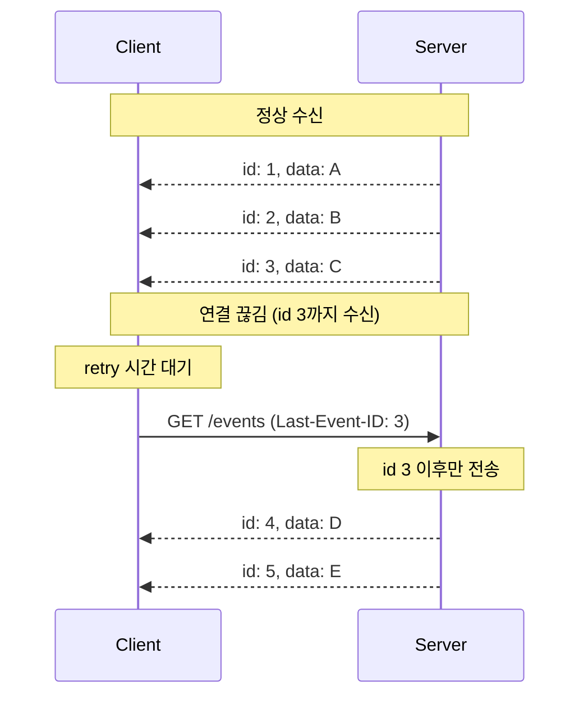
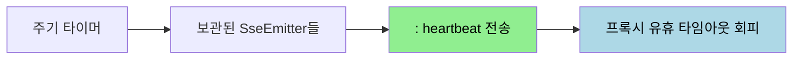
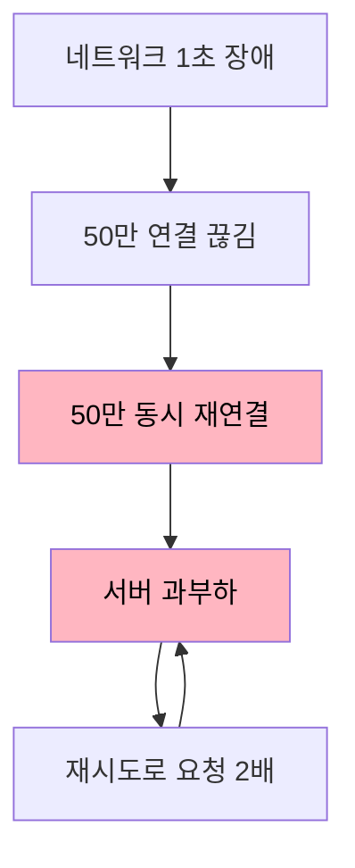

# SSE 신뢰성 — 재연결과 손실 복구

---

> [`02-01`](02-01.SSE%20원리와%20Spring%20구현.md) 에서 SSE 의 동작 원리와 Spring 구현을 봤습니다. 그런데 실시간 연결은 끊기기 마련이고, 끊긴 사이의 메시지를 어떻게 복구하느냐가 신뢰성을 가릅니다. 이 문서를 읽고 나면 SSE 의 자동 재연결, `retry`·`id`·Last-Event-ID 복구 메커니즘, 메시지 손실 시나리오와 방지 전략, 그리고 대규모 환경에서의 재접속 폭풍 대응을 설명할 수 있습니다.


## 1. 자동 재연결과 retry

> SSE 의 강점 중 하나는 브라우저가 연결이 끊기면 자동으로 다시 연결한다는 점입니다. 그 대기 시간을 서버가 `retry` 필드로 조정합니다.

네트워크가 끊기거나 서버가 연결을 종료하면, 클라이언트는 자동으로 재연결을 시도합니다. 기본 재연결 대기 시간은 브라우저마다 다르지만 보통 3초입니다. 서버는 `retry:` 필드로 이 대기 시간을 밀리초 단위로 지정할 수 있습니다.

`retry` 필드의 특징은 다음과 같습니다.

- 단위는 밀리초입니다. `retry: 5000` 이면 5초입니다.
- 첫 메시지에서 설정하면 이후 재연결에 적용되고, 중간에 다른 값으로 바꿀 수도 있습니다.
- 클라이언트 코드에서 현재 값을 직접 읽을 수는 없습니다.

Spring 에서는 `SseEmitter.event().reconnectTime(5000)` 으로 `retry` 값을 실어 보냅니다. 재연결 간격을 늘리면 서버 부하는 줄지만 복구가 느려지고, 줄이면 빨리 복구되지만 끊긴 직후 재연결 요청이 몰립니다. 이 trade-off 는 [`04-01`](04-01.연결%20관리와%20재연결%20전략.md) 의 지수 백오프로 더 정교하게 다룹니다.


## 2. id 와 Last-Event-ID — 손실 복구

> SSE 가 끊겼다 다시 연결될 때 그 사이의 메시지를 복구하는 장치가 `id` 와 `Last-Event-ID` 입니다. SSE 의 핵심 신뢰성 메커니즘입니다.

서버가 각 이벤트에 `id:` 를 부여하면, 재연결 시 클라이언트는 마지막으로 받은 이벤트 ID 를 `Last-Event-ID` HTTP 요청 헤더에 담아 보냅니다. 서버는 이 헤더를 읽어 클라이언트의 마지막 위치를 파악하고, 그 ID 이후의 이벤트만 전송합니다. 덕분에 데이터 유실이나 중복 전달을 막습니다.



서버가 이 복구를 지원하려면 세 가지를 해야 합니다.

1. 모든 이벤트에 `id:` 필드를 포함합니다.
2. 재연결 요청의 `Last-Event-ID` 헤더를 확인합니다.
3. 해당 ID 이후의 이벤트만 전송합니다.

Spring 구현에서는 재연결 요청을 받는 핸들러가 `@RequestHeader(value = "Last-Event-ID", required = false)` 로 마지막 ID 를 받습니다. 값이 있으면 [`02-01 §7`](02-01.SSE%20원리와%20Spring%20구현.md) 의 `EmitterRepository.eventCache` 에서 그 ID 이후 캐시된 이벤트를 꺼내 먼저 흘려보낸 뒤, 이후 실시간 이벤트를 이어 보냅니다.

```java
@GetMapping(value = "/connect", produces = MediaType.TEXT_EVENT_STREAM_VALUE)
public SseEmitter subscribe(@RequestHeader(name = "Authorization") String accessToken,
                            @RequestHeader(value = "Last-Event-ID", required = false, defaultValue = "") String lastEventId) {
	return alarmService.subscribe(accessToken, lastEventId);
}
```

`lastEventId` 가 비어 있지 않으면 그 이후 캐시 이벤트를 재전송해 누락분을 채웁니다. ID 는 고유하고 정렬 가능해야 하므로, 단순 증가 숫자·타임스탬프·ULID 같은 방식을 씁니다. 서버 재시작에도 견디려면 타임스탬프나 ULID 가 안전합니다.


## 3. 메시지 손실 시나리오

> 자동 재연결과 Last-Event-ID 가 있어도, 어떤 상황에서 메시지가 손실되는지 알아야 방어 지점을 잡습니다.

메시지 손실은 여러 경로로 발생합니다.

| 상황 | 원인 | 손실 기간 |
|------|------|-----------|
| 네트워크 단절 | Wi-Fi 전환, 모바일 터널 | 수초~수분 |
| 서버 재시작 | 배포, 스케일링 | 수초~수십 초 |
| 프록시 타임아웃 | Nginx·ALB 유휴 타임아웃 | 즉시 |
| 자동 재연결 지연 | 기본 재연결 대기 | 3초 (기본값) |
| 탭 비활성화 | 브라우저 백그라운드 스로틀링 | 탭 비활성 기간 전체 |

이 중 Last-Event-ID 로 복구되는 것은 "연결이 끊겼다 다시 붙는" 경우입니다. 프록시 타임아웃은 끊김을 빨리 유발하므로, 끊김 자체를 줄이는 하트비트가 함께 필요합니다.


## 4. 방지 전략 — 서버 하트비트

> 프록시·로드밸런서는 일정 시간 데이터가 없는 유휴 연결을 끊습니다. 서버가 주기적으로 하트비트를 보내 연결을 살아 있게 유지합니다.

Nginx 같은 리버스 프록시나 ALB 는 대개 60초 이상 데이터가 흐르지 않는 연결을 끊습니다. SSE 는 이벤트가 드물게 발생할 수 있으므로, 서버가 주기적으로 주석 줄(`:` 로 시작하는 하트비트)이나 빈 이벤트를 보내 연결을 유지합니다. [`02-01 §5`](02-01.SSE%20원리와%20Spring%20구현.md) 에서 본 `:` 주석이 이 하트비트입니다.

Spring 에서는 `ScheduledExecutorService` 나 `@Scheduled` 로 보관 중인 emitter 들에 주기적으로 하트비트를 보냅니다. 동시에 프록시 쪽도 `proxy_read_timeout` 을 충분히 늘리고 `proxy_buffering off` 로 버퍼링을 꺼야 하트비트가 즉시 전달됩니다.




## 5. 대규모 환경 — 연결 비용과 재접속 폭풍

> 수십만 동시 연결에서는 연결 유지 자체가 비용입니다. 그리고 순간 장애 후 모든 클라이언트가 동시에 재연결하면 서버가 무너지는 재접속 폭풍이 생깁니다.

SSE·WebSocket 연결을 유지하려면 50만 명 접속 시 50만 개의 연결 객체가 서버 메모리에 상주합니다. 데이터를 주고받지 않아도 서버는 이 연결들을 관리해야 하므로 메모리·파일 디스크립터·로드밸런서 연결 한도가 모두 압박받습니다. SSE 는 송신 단방향 버퍼만 쓰고 핸드셰이크가 일반 HTTP 라 WebSocket 보다 연결당 비용이 낮지만, "연결을 유지해야 한다" 는 근본 부담은 같습니다.

진짜 위험은 재접속 폭풍입니다. 네트워크 장비 교체나 순간 장애로 1초만 연결이 끊겨도 50만 연결이 동시에 재연결을 시도합니다. 핸드셰이크·TLS·인증이 한꺼번에 몰려 서버가 과부하되고, 재시도 로직이 요청을 2배로 늘려 복구 불가능한 상태로 빠질 수 있습니다.



이를 막는 핵심이 지수 백오프에 Full Jitter 를 더하는 것입니다. 기본 지수 백오프(`baseDelay × 2^attempt`)에 좁은 Jitter 를 더하면 재연결이 여전히 밀집됩니다. Full Jitter 는 대기 시간을 `0 ~ ceiling` 사이의 완전 랜덤으로 잡아, 재연결 시도를 시간 축에 균등하게 흩뿌립니다. 알고리즘의 구체적인 형태와 Close Code 별 재연결 판단은 [`04-01`](04-01.연결%20관리와%20재연결%20전략.md) 에서 다룹니다.


## 6. 면접 대비 체크리스트

> 본 문서를 다 읽은 뒤 다음 질문에 답할 수 있어야 합니다.

1. SSE 의 `retry` 필드는 무엇을 정하며, Spring 에서 어떻게 보냅니까?
2. `id` 와 `Last-Event-ID` 는 메시지 손실을 어떻게 복구합니까? 서버가 지원하려면 무엇을 해야 합니까?
3. 메시지 손실이 발생하는 상황 중 Last-Event-ID 로 복구되는 것과 그렇지 않은 것은 무엇입니까?
4. 서버 하트비트가 필요한 이유는 무엇이며, 프록시 설정은 어떻게 맞춰야 합니까?
5. 재접속 폭풍은 무엇이며, Full Jitter 가 왜 단순 지수 백오프보다 안전합니까?


## 다음에 읽을 것

- [`02-01.SSE 원리와 Spring 구현.md`](02-01.SSE%20원리와%20Spring%20구현.md) — SSE 동작 원리와 SseEmitter (선행 문서)
- [`04-01.연결 관리와 재연결 전략.md`](04-01.연결%20관리와%20재연결%20전략.md) — Close Code·지수 백오프·Fallback
