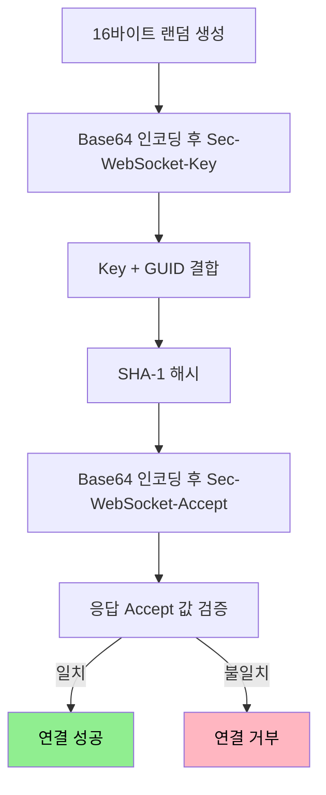
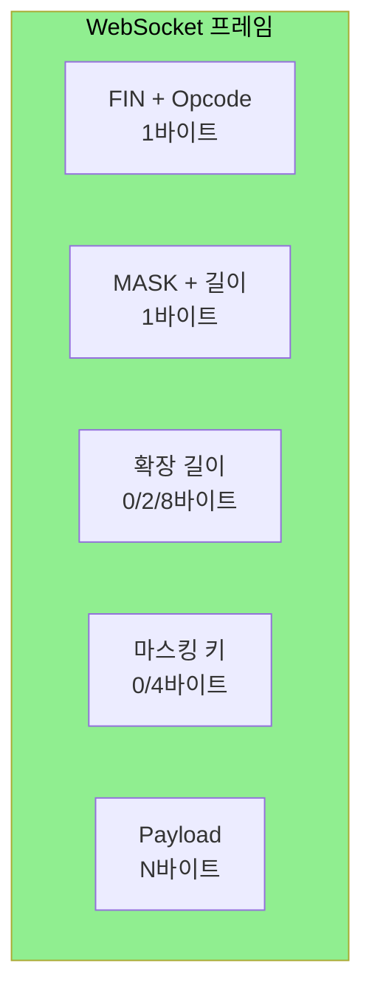

# WebSocket 프로토콜과 핸드셰이크

---

> [`01-01`](01-01.HTTP·TCP%20통신과%20HTTP%20vs%20Socket.md) 에서 WebSocket 이 양방향 실시간 통신이라고 봤고, [`03-03`](03-03.WebSocket%20vs%20STOMP.md) 에서 핸드셰이크 헤더를 짚었습니다. 이 문서는 그 아래 프로토콜을 한 겹 더 파고듭니다. 이 문서를 읽고 나면 핸드셰이크의 `Sec-WebSocket-Accept` 계산, WebSocket 프레임 구조와 마스킹, HTTP 가 단방향인데 WebSocket 이 양방향인 이유, 그리고 하나의 포트가 여러 연결을 구분하는 소켓 관리를 설명할 수 있습니다.


## 1. 핸드셰이크와 Sec-WebSocket-Accept

> WebSocket 연결은 HTTP 요청으로 시작해 `101 Switching Protocols` 로 전환됩니다. 그 과정에서 서버가 진짜 WebSocket 을 이해하는지 증명하는 값이 `Sec-WebSocket-Accept` 입니다.

클라이언트는 `Upgrade: websocket`·`Connection: Upgrade` 헤더와 16바이트 랜덤 값을 Base64 로 인코딩한 `Sec-WebSocket-Key` 를 담아 HTTP GET 요청을 보냅니다. 서버는 키를 검증하고 `101 Switching Protocols` 응답에 `Sec-WebSocket-Accept` 를 실어 돌려줍니다.

```http
GET /chat HTTP/1.1
Host: example.com
Upgrade: websocket
Connection: Upgrade
Sec-WebSocket-Key: dGhlIHNhbXBsZSBub25jZQ==
Sec-WebSocket-Version: 13
```

`Sec-WebSocket-Accept` 는 요청의 키에 고정 GUID 를 더해 SHA-1 로 해싱한 뒤 Base64 로 인코딩한 값입니다.

```text
Sec-WebSocket-Accept = Base64( SHA-1( Sec-WebSocket-Key + GUID ) )
```

GUID(매직 스트링)는 RFC 6455 가 정의한 고정 값 `258EAFA5-E914-47DA-95CA-C5AB0DC85B11` 입니다. 이 값이 필요한 이유는 세 가지입니다. 첫째, 일반 HTTP 서버가 WebSocket 요청을 잘못 처리하는 것을 막습니다. 둘째, 중간 프록시가 WebSocket 요청을 캐싱하지 않게 합니다. 셋째, 서버가 실제로 WebSocket 프로토콜을 이해하는지 클라이언트가 검증할 수 있습니다.



핸드셰이크 응답 상태 코드도 의미가 갈립니다. `101` 은 프로토콜 전환 성공, `200` 은 일반 HTTP 응답(WebSocket 업그레이드 실패), `400` 은 잘못된 핸드셰이크, `403` 은 Origin 검증 실패, `426` 은 업그레이드 필요입니다.


## 2. Full-Duplex — HTTP는 단방향, WebSocket은 양방향

> TCP 자체는 양방향인데 HTTP 는 단방향입니다. 그 차이가 프로토콜 규칙에 있고, WebSocket 은 `101` 이후 그 규칙을 벗습니다.

하나의 TCP 연결은 클라이언트에서 서버로, 서버에서 클라이언트로 가는 두 개의 독립적인 바이트 스트림을 가집니다. 즉 전송 계층은 본래 Full-Duplex 를 지원합니다. 그런데도 HTTP 가 단방향인 이유는 HTTP 프로토콜의 규칙 때문입니다.

| 제약 | 설명 |
|------|------|
| 요청 필수 | 서버는 클라이언트 요청 없이 데이터를 보낼 수 없음 |
| 순차 처리 | 요청·응답·요청 순서 강제 |
| 응답 1회 | 하나의 요청에 하나의 응답만 |

HTTP 는 1991년 문서 전송을 위해 설계됐고, 그때는 실시간 통신이 고려 대상이 아니었습니다. 단순성·무상태·캐싱 용이성을 얻는 대신 서버가 먼저 보내지 못하는 구조를 택한 것입니다.

WebSocket 은 `101 Switching Protocols` 응답 이후 같은 TCP 소켓에서 HTTP 규칙을 제거합니다. TCP 연결 자체는 그대로(같은 파일 디스크립터, 같은 소켓)지만, 프로토콜 해석 방식이 HTTP 파서에서 WebSocket 프레임 파서로 바뀌고, "요청 이후 응답" 규칙이 사라집니다.

| 계층 | HTTP 모드 | WebSocket 모드 |
|------|-----------|----------------|
| TCP 소켓 | 그대로 유지 | 그대로 유지 |
| 프로토콜 파서 | HTTP 요청·응답 파싱 | WebSocket 프레임 파싱 |
| 전송 규칙 | 요청-응답 순서 강제 | 양쪽 자유롭게 전송 |
| 메시지 경계 | Content-Length 헤더 | 프레임 길이 필드 |

그래서 WebSocket 모드에서는 수신과 송신이 독립적으로 돕니다. 서버는 클라이언트 요청을 기다리지 않고 언제든 프레임을 보낼 수 있습니다.


## 3. WebSocket 프레임 구조

> WebSocket 메시지는 "프레임" 단위로 전송됩니다. HTTP 헤더가 수백 바이트인 데 비해 프레임 헤더는 2~14바이트로 매우 작습니다.

WebSocket 프레임은 바이너리 형식이며 다음 필드로 이루어집니다.

| 필드 | 크기 | 설명 |
|------|------|------|
| FIN | 1비트 | 마지막 프레임인지 여부 (1=마지막) |
| Opcode | 4비트 | 메시지 종류 (1=텍스트, 2=바이너리, 8=종료, 9=핑, 10=퐁) |
| MASK | 1비트 | 마스킹 여부 (클라이언트에서 서버로는 반드시 1) |
| Payload Length | 7비트 | 데이터 길이 (0~125 그대로, 126=2바이트 추가, 127=8바이트 추가) |
| Masking Key | 0 또는 4바이트 | 마스킹 키 (MASK=1일 때만) |
| Payload Data | N바이트 | 실제 데이터 |

페이로드 크기에 따라 헤더 크기가 달라집니다.

| 페이로드 크기 | 헤더 크기 |
|---------------|-----------|
| 0~125 바이트 | 2 바이트 |
| 126~65535 바이트 | 4 바이트 |
| 65536+ 바이트 | 10 바이트 |
| 클라이언트에서 서버 (마스킹) | +4 바이트 |

클라이언트가 서버로 보낼 때만 마스킹하는 이유는 보안입니다. 마스킹 값으로 페이로드를 난독화해, 클라이언트가 악의적 데이터로 중간 프록시의 캐시를 오염시키는 공격을 막습니다. 서버가 클라이언트로 보낼 때는 마스킹하지 않습니다.

이 작은 헤더가 효율을 만듭니다. HTTP 는 요청마다 쿠키·인증 토큰 등 수백 바이트 헤더가 붙지만, WebSocket 은 핸드셰이크 1회 이후 프레임 헤더만 씁니다. 1000개 메시지를 보내면 HTTP 는 약 800KB, WebSocket 은 2~14KB 수준입니다.




## 4. 하나의 포트가 여러 연결을 구분하는 법

> 서버 주소가 하나인데 어떻게 수많은 클라이언트를 구분할까요? 답은 TCP 연결을 식별하는 4-Tuple 과, 역할이 다른 두 종류의 소켓에 있습니다.

TCP 연결은 네 가지 정보(4-Tuple)로 구분됩니다.

```text
연결 = (서버IP, 서버Port, 클라이언트IP, 클라이언트Port)

연결 1: (192.168.1.100:8080, 10.0.0.50:52341)  ← 클라이언트 A
연결 2: (192.168.1.100:8080, 10.0.0.51:49872)  ← 클라이언트 B
연결 3: (192.168.1.100:8080, 10.0.0.50:52342)  ← 클라이언트 A의 다른 탭
```

서버 주소(`192.168.1.100:8080`)는 같아도 클라이언트 IP·포트가 다르므로 구분됩니다. 같은 컴퓨터에서 탭을 여러 개 열면 OS 가 연결마다 다른 임시 포트(Ephemeral Port)를 자동 할당합니다.

서버 내부에는 역할이 다른 두 종류의 소켓이 있습니다.

| 구분 | Listen Socket | Connection Socket |
|------|---------------|-------------------|
| 역할 | 새 연결 요청 대기 | 실제 데이터 통신 |
| 개수 | 포트당 1개 | 클라이언트당 1개 |
| 생성 시점 | 서버 시작 시 | `accept()` 호출 시 |
| 사용 메서드 | `accept()` | `read()`·`write()` |

Listen Socket 은 특정 포트에서 새 연결 요청만 받습니다. 데이터 통신은 하지 않고 "새 손님이 왔다" 를 감지하는 역할이며, `accept()` 를 호출하면 Connection Socket 을 만들어 반환합니다. Connection Socket 은 클라이언트가 연결될 때마다 하나씩 생기고, 각자 상대 주소를 기억해 어떤 클라이언트와의 통신인지 식별합니다.

둘을 나누는 이유는 동시성입니다. Listen Socket 이 따로 있어야 새 연결을 받는 일과 기존 연결로 데이터를 주고받는 일이 서로를 막지 않습니다. 패킷이 도착하면 OS 커널이 4-Tuple 을 조회해 매칭되는 Connection Socket 의 수신 버퍼로 데이터를 넣고, 애플리케이션은 그 소켓에서 읽습니다.


## 5. ws 와 wss

> WebSocket 도 평문과 암호화 두 스킴이 있습니다. 공개망에서는 반드시 암호화된 `wss` 를 써야 합니다.

WebSocket URL 스킴은 두 가지입니다.

| 스킴 | HTTP 대응 | 기본 포트 | 암호화 |
|------|-----------|-----------|--------|
| `ws://` | `http://` | 80 | 없음 |
| `wss://` | `https://` | 443 | TLS |

`ws://` 는 핸드셰이크와 메시지가 평문으로 오갑니다. 공용 WiFi 같은 환경에서는 중간자 공격(MITM)에 노출되어 메시지 도청, 변조, 세션 하이재킹이 가능합니다. `wss://` 는 TLS 로 암호화 터널을 먼저 수립한 뒤 그 위에서 핸드셰이크와 메시지를 주고받으므로 중간에서 내용을 해독할 수 없습니다. 운영 환경에서는 `wss` 가 사실상 필수입니다.


## 6. 면접 대비 체크리스트

> 본 문서를 다 읽은 뒤 다음 질문에 답할 수 있어야 합니다.

1. `Sec-WebSocket-Accept` 는 어떻게 계산되며, 왜 필요합니까? GUID 의 역할은?
2. TCP 는 양방향인데 HTTP 가 단방향인 이유는 무엇입니까? WebSocket 은 `101` 이후 무엇이 바뀝니까?
3. WebSocket 프레임에서 클라이언트만 마스킹하는 이유는 무엇입니까?
4. 하나의 서버 포트가 여러 클라이언트를 어떻게 구분합니까? Listen Socket 과 Connection Socket 의 차이는?


## 다음에 읽을 것

- [`03-02.WebSocket 구현.md`](03-02.WebSocket%20구현.md) — Spring `WebSocketHandler` 로 구현
- [`03-03.WebSocket vs STOMP.md`](03-03.WebSocket%20vs%20STOMP.md) — 핸드셰이크와 STOMP 서브 프로토콜
- [RFC 6455 — The WebSocket Protocol](https://datatracker.ietf.org/doc/html/rfc6455) — 프레임·핸드셰이크 표준
