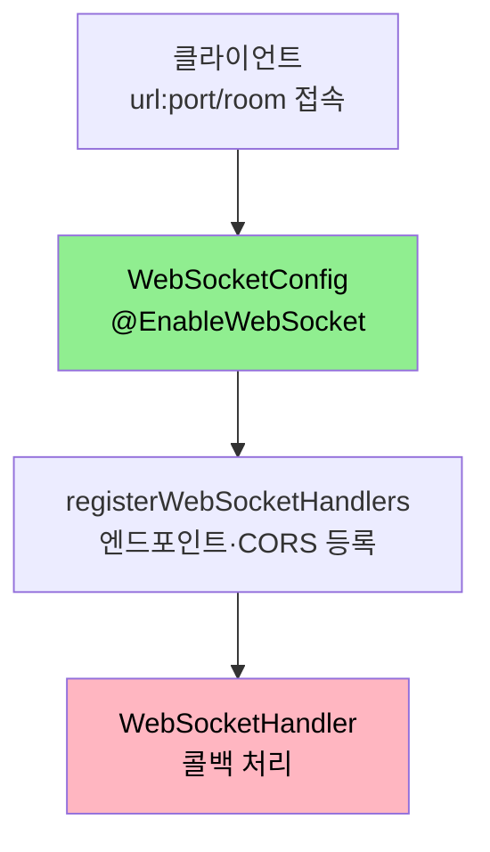
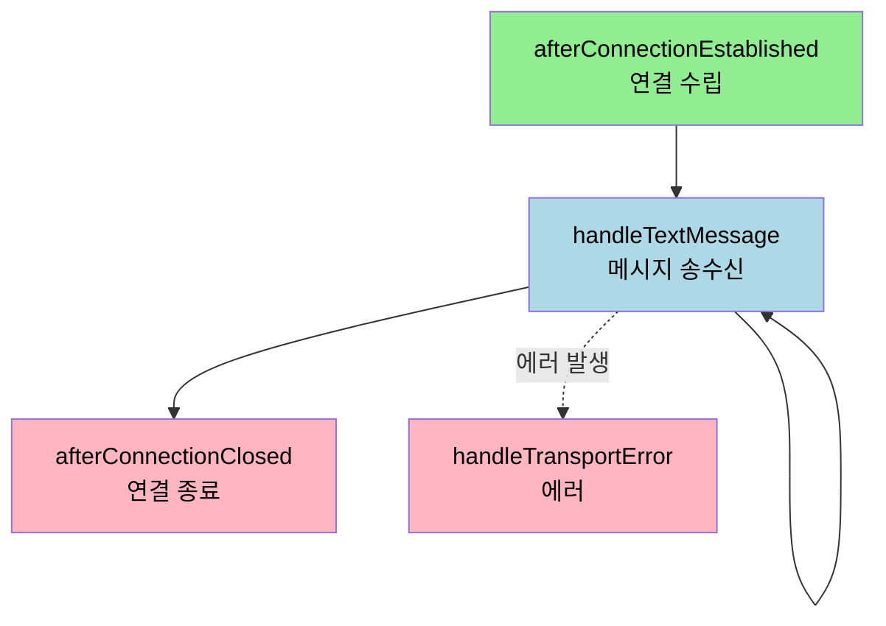

# WebSocket 구현

---

> [`02-01`](02-01.SSE%20원리와%20Spring%20구현.md) 의 SSE 가 서버에서 클라이언트로 미는 단방향이라면, WebSocket 은 양쪽이 수시로 주고받는 양방향입니다. 이 문서를 읽고 나면 Spring 에서 저수준 WebSocket 을 연동하는 설정, `WebSocketHandler` 의 네 가지 생명주기 콜백, 그리고 세션 관리로 채팅을 구현하는 방법을 설명할 수 있습니다. STOMP 를 얹는 방식은 [`03-04`](03-04.STOMP%20실무%20—%20Spring%20구현.md) 에서 따로 다룹니다.


## 1. 의존성과 테스트 도구

> Spring Boot 에서 WebSocket 은 starter 의존성 하나로 시작합니다. 동작 확인에는 WebSocket 전용 클라이언트를 씁니다.

```groovy
implementation 'org.springframework.boot:spring-boot-starter-websocket'
```

WebSocket 은 HTTP 요청-응답이 아니라 연결을 유지하는 통신이라, 일반 HTTP 도구로는 테스트가 어렵습니다. Simple WebSocket Client 같은 브라우저 확장이나 Postman 의 WebSocket 기능으로 연결을 열어 메시지를 주고받으며 확인합니다.

메시지를 객체로 다루려면 스펙을 정의하고 JSON 으로 직렬화합니다.

```java
@Getter
@Builder
@AllArgsConstructor
@NoArgsConstructor
public class Message {
    private String type;
    private String sender;
    private String receiver;
    private Object data;

    public void newConnect() { this.type = "new"; }
    public void closeConnect() { this.type = "close"; }
}
```

```java
public class Utils {
    private static final ObjectMapper objectMapper = new ObjectMapper();

    public static Message getObject(final String message) throws Exception {
        return objectMapper.readValue(message, Message.class);
    }

    public static String getString(final Message message) throws Exception {
        return objectMapper.writeValueAsString(message);
    }
}
```

WebSocket 프로토콜은 텍스트·바이너리 메시지 타입만 정의하고 내용은 정의하지 않으므로, 위처럼 `Message` 스펙과 `ObjectMapper` 변환을 직접 둡니다. 이 부분이 [`03-03`](03-03.WebSocket%20vs%20STOMP.md) 에서 STOMP 가 해결하는 지점입니다.


## 2. WebSocketConfig — 핸들러 등록

> WebSocket 서버를 켜고, 엔드포인트와 핸들러를 등록하고, CORS 를 설정합니다. `@EnableWebSocket` 이 진입점입니다.

```java
@Configuration
@RequiredArgsConstructor
@EnableWebSocket
public class WebSocketConfig implements WebSocketConfigurer {

    @Override
    public void registerWebSocketHandlers(WebSocketHandlerRegistry registry) {
        registry
                .addHandler(signalingSocketHandler(), "/room")
                .setAllowedOrigins("*");
    }

    @Bean
    public WebSocketHandler signalingSocketHandler() {
        return new WebSocketHandler();
    }
}
```

설정의 네 지점은 다음과 같습니다.

1. `@EnableWebSocket` 으로 WebSocket 서버를 사용하도록 정의합니다.
2. `addHandler(..., "/room")` 으로 WebSocket 서버의 엔드포인트를 정합니다. 클라이언트는 `url:port/room` 으로 접속합니다.
3. `setAllowedOrigins("*")` 로 클라이언트의 요청을 모두 수락합니다(CORS). 공식 문서는 운영에서 `*` 대신 허용할 오리진을 명시하도록 권합니다.
4. `WebSocketHandler` 클래스를 WebSocket 핸들러로 등록합니다.

`setAllowedOrigins` 는 어느 출처의 클라이언트가 WebSocket 핸드셰이크를 걸 수 있는지 제한하는 CORS 설정입니다. 학습 단계에서는 `*` 로 열어 두지만, 운영에서는 신뢰하는 도메인만 적는 편이 안전합니다.




## 3. WebSocketHandler 의 네 가지 콜백

> WebSocket 핸들러는 소켓 통신의 생명주기에 대응하는 함수들을 가집니다. 연결·메시지·종료·에러 네 가지입니다.

`TextWebSocketHandler` 를 확장하면 텍스트 메시지를 다루는 핸들러를 만들 수 있습니다. 공식 문서도 `handleTextMessage(session, message)` 를 구현해 메시지 처리 로직을 둔다고 안내합니다.

```java
@Component
@Log4j2
public class WebSocketHandler extends TextWebSocketHandler {

    private final Map<String, WebSocketSession> sessions = new ConcurrentHashMap<>();

    // 웹 소켓 연결
    @Override
    public void afterConnectionEstablished(WebSocketSession session) throws Exception {}

    // 양방향 데이터 통신
    @Override
    protected void handleTextMessage(WebSocketSession session, TextMessage textMessage) throws Exception {}

    // 소켓 연결 종료
    @Override
    public void afterConnectionClosed(WebSocketSession session, CloseStatus status) throws Exception {}

    // 소켓 통신 에러
    @Override
    public void handleTransportError(WebSocketSession session, Throwable exception) throws Exception {}
}
```

네 콜백이 각각 생명주기의 한 시점에 대응합니다.

| 콜백 | 호출 시점 | 인자 |
|------|----------|------|
| `afterConnectionEstablished` | 연결이 수립된 직후 | `WebSocketSession` |
| `handleTextMessage` | 텍스트 메시지를 받을 때 | `WebSocketSession`, `TextMessage` |
| `afterConnectionClosed` | 연결이 종료될 때 | `WebSocketSession`, `CloseStatus` |
| `handleTransportError` | 통신 에러가 날 때 | `WebSocketSession`, `Throwable` |

`WebSocketSession` 은 연결 하나를 나타내는 객체로, 고유 `id` 를 가지며 이 세션으로 메시지를 보냅니다. 접속한 모든 연결을 관리하려고 `ConcurrentHashMap<String, WebSocketSession>` 에 세션을 모읍니다.




## 4. 최초 연결 — afterConnectionEstablished

> 웹소켓에 접속하면 호출되는 콜백입니다. 세션을 저장하고 다른 사용자에게 입장을 알립니다.

```java
@Override
public void afterConnectionEstablished(WebSocketSession session) throws Exception {
    // 1. session 저장
    String sessionId = session.getId();
    sessions.put(sessionId, session);

    // 2. message 설정
    Message message = Message.builder().sender(sessionId).receiver("all").build();
    message.newConnect();

    // 3. 접속해 있는 모든 사용자에 알림(본인 제외)
    sessions.values().forEach(s -> {
        try {
            if (!s.getId().equals(sessionId)) {
                s.sendMessage(new TextMessage(Utils.getString(message)));
            }
        } catch (Exception e) {
        }
    });
}
```

연결이 수립되면 세션을 맵에 저장하고, 입장 메시지를 만들어 본인을 제외한 모든 세션에 보냅니다. 세션 맵을 직접 순회해 브로드캐스트하는 이 방식이 저수준 WebSocket 의 특징입니다. STOMP 를 쓰면 이 브로드캐스트를 브로커가 대신합니다.


## 5. 데이터 통신 — handleTextMessage

> 클라이언트가 보낸 메시지를 받아 다른 사용자에게 전달하는 콜백입니다. 채팅의 핵심입니다.

```java
@Override
protected void handleTextMessage(WebSocketSession session, TextMessage textMessage) throws Exception {
    String sessionId = session.getId();
    Message message = Utils.getObject(textMessage.getPayload());
    message.setSender(session.getId());

    // 접속해 있는 모든 사용자에 채팅 전송(본인 제외)
    sessions.values().forEach(s -> {
        try {
            if (!s.getId().equals(sessionId)) {
                s.sendMessage(new TextMessage(Utils.getString(message)));
            }
        } catch (Exception e) {
        }
    });
}
```

받은 메시지를 `Utils.getObject` 로 `Message` 객체로 파싱하고, 보낸 사람을 세션 ID 로 설정한 뒤, 본인을 제외한 모든 세션에 전달합니다. 누가 누구에게 보낼지를 코드가 직접 정하는데, 이 라우팅 책임이 STOMP 에서는 destination 과 브로커로 옮겨갑니다.


## 6. 연결 종료와 에러

> 연결이 끊기면 세션을 정리하고 퇴장을 알립니다. 에러 콜백은 통신 오류를 처리합니다.

```java
@Override
public void afterConnectionClosed(WebSocketSession session, CloseStatus status) throws Exception {
    // 1. session 제거
    String sessionId = session.getId();
    sessions.remove(sessionId);

    // 2. message 설정
    final Message message = new Message();
    message.closeConnect();
    message.setSender(sessionId);

    // 3. 접속해 있는 모든 사용자에 알림(본인 제외)
    sessions.values().forEach(s -> {
        try {
            if (!s.getId().equals(sessionId)) {
                s.sendMessage(new TextMessage(Utils.getString(message)));
            }
        } catch (Exception e) {
        }
    });
}
```

연결이 종료되면 세션 맵에서 해당 세션을 지우고, 퇴장 메시지를 남은 사용자에게 보냅니다. 세션을 제때 제거하지 않으면 끊긴 연결로 메시지를 보내려다 에러가 나므로, 종료 콜백에서의 정리가 중요합니다.

에러 콜백은 통신 중 예외가 났을 때 동작합니다.

```java
@Override
public void handleTransportError(WebSocketSession session, Throwable exception) throws Exception {
    super.handleTransportError(session, exception);
}
```


## 7. 면접 대비 체크리스트

> 본 문서를 다 읽은 뒤 다음 질문에 답할 수 있어야 합니다.

1. `TextWebSocketHandler` 의 네 가지 콜백은 각각 언제 호출됩니까?
2. 저수준 WebSocket 에서 메시지를 여러 사용자에게 보낼 때 라우팅 책임은 누가 집니까? STOMP 를 쓰면 무엇이 달라집니까?
3. `afterConnectionClosed` 에서 세션을 제거하지 않으면 어떤 문제가 생깁니까?
4. `setAllowedOrigins("*")` 는 무엇을 허용하는 설정이며, 운영에서 주의할 점은 무엇입니까?


## 다음에 읽을 것

- [`02-01.SSE 원리와 Spring 구현.md`](02-01.SSE%20원리와%20Spring%20구현.md) — 단방향 푸시가 필요할 때의 SSE (대비 문서)
- [`03-03.WebSocket vs STOMP.md`](03-03.WebSocket%20vs%20STOMP.md) — WebSocket 의 한계와 STOMP 가 푸는 문제
- [Spring WebSocket — Server](https://docs.spring.io/spring-framework/reference/6.2/web/websocket/server.html) — 본 문서가 따라가는 공식 문서
