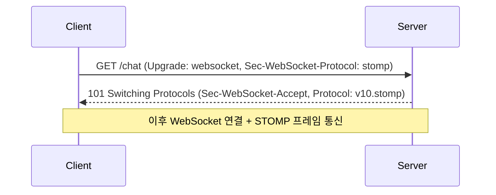
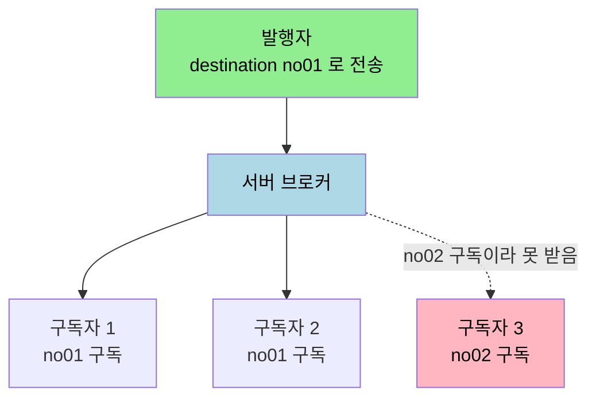

# WebSocket vs STOMP

---

> [`03-02`](03-02.WebSocket%20구현.md) 에서 저수준 WebSocket 으로 채팅을 짤 때 메시지 라우팅을 코드가 직접 처리했습니다. 그 불편함을 STOMP 가 어떻게 푸는지가 이 문서의 핵심입니다. 이 문서를 읽고 나면 WebSocket 핸드셰이크 과정, WebSocket 만으로 부족한 점, STOMP 가 더하는 pub/sub 모델, 그리고 STOMP 프레임 구조를 설명할 수 있습니다.


## 1. WebSocket 프로토콜

> WebSocket 은 하나의 TCP 접속에 전이중(full-duplex) 통신을 제공하는 프로토콜입니다. OSI 응용 계층에 있으면서 전송 계층의 TCP 에 의존합니다.

WebSocket 은 하나의 TCP 접속에 전이중 통신을 제공하는 컴퓨터 통신 프로토콜입니다. TCP 는 인터넷에서 해당 프로토콜의 단위인 세그먼트를 안정적으로, 순서대로, 에러 없이 보내는 프로토콜입니다. 웹소켓은 OSI 모델에서 응용 계층(Application Layer)에 위치하므로, 하위 전송 계층(Transport Layer)의 TCP 에 의존합니다. [`01-01`](01-01.HTTP·TCP%20통신과%20HTTP%20vs%20Socket.md) 에서 본 "웹소켓은 7계층, 일반 소켓은 4계층" 이 이 의존 관계를 말합니다.


## 2. WebSocket HandShake

> WebSocket 연결은 HTTP 요청으로 시작합니다. 이 초기화 과정을 WebSocket HandShake 라고 합니다.

연결을 위해 웹소켓 초기화 과정이 필요하며 이를 WebSocket HandShake 라고 합니다. 클라이언트가 HandShake 요청을 보내고 서버가 응답하면 연결이 열립니다. 요청 헤더는 다음과 같습니다.

```http
GET /chat HTTP/1.1
Host: localhost:8000
Upgrade: websocket
Connection: Upgrade
Sec-WebSocket-Key: dGhlIHNhbXBsZSBub25jZQ==
Sec-WebSocket-Version: 13
Sec-WebSocket-Protocol: v10.stomp, v11.stomp
```

각 헤더의 의미는 다음과 같습니다.

- `Upgrade` — 프로토콜을 전환하기 위한 헤더로, 웹소켓 요청 시 반드시 `websocket` 값을 가져야 합니다.
- `Connection` — 전송 완료 후 접속을 유지할지에 대한 헤더로, 웹소켓 요청 시 반드시 `Upgrade` 값을 가져야 합니다.
- `Sec-WebSocket-Key` — 유효한 요청인지 확인하는 키 값입니다.
- `Sec-WebSocket-Version` — 클라이언트가 쓰려는 웹소켓 프로토콜 버전입니다.
- `Sec-WebSocket-Protocol` — 클라이언트가 쓰려는 서브 프로토콜 후보입니다. 공식 예제는 `v10.stomp, v11.stomp` 로 STOMP 를 제안합니다.

서버 응답은 `101 Switching Protocols` 로 프로토콜 전환을 알립니다.

```http
HTTP/1.1 101 Switching Protocols
Upgrade: websocket
Connection: Upgrade
Sec-WebSocket-Accept: s3pPLMBiTxaQ9kYGzzhZRbK+xOo=
Sec-WebSocket-Protocol: v10.stomp
```

`Sec-WebSocket-Accept` 는 요청의 `Sec-WebSocket-Key` 에 고정 값을 더해 SHA-1 로 해싱한 뒤 base64 로 인코딩한 결과로, 웹소켓 연결의 시작을 알립니다. 공식 문서 응답 예제는 `Sec-WebSocket-Protocol: v10.stomp` 까지 포함하는데, 이는 요청에서 제안한 서브 프로토콜 중 STOMP 를 채택했다는 협상 결과입니다. 즉 핸드셰이크 단계에서 이미 "이 WebSocket 위에 STOMP 를 얹는다" 가 합의됩니다.




## 3. WebSocket 만으로 부족한 점

> WebSocket 은 메시지 타입만 정의하고 내용 규약은 정의하지 않습니다. 그래서 라우팅·처리 방식을 매번 직접 구현해야 합니다.

WebSocket 프로토콜은 `Text`, `Binary` 두 가지 메시지 타입은 정의하지만, 메시지의 내용에 대해서는 정의하지 않습니다. 그래서 WebSocket 만 쓰면 메시지가 어떤 요청인지, 어떤 형식인지, 어떻게 처리해야 하는지가 정해져 있지 않아 별도 구현이 필요합니다. [`03-02 §5`](03-02.WebSocket%20구현.md) 에서 세션 맵을 직접 순회하며 누구에게 보낼지 코드로 정한 것이 그 별도 구현이었습니다. 이를 해결하려고 STOMP 를 서브 프로토콜로 WebSocket 위에서 씁니다.


## 4. STOMP 란

> STOMP 는 메시지 전송을 효율적으로 하기 위한 프로토콜로, pub/sub(발행/구독) 방식으로 동작합니다.

STOMP 는 Simple Text Oriented Messaging Protocol 의 약자로, 메시징 전송을 효율적으로 하기 위한 프로토콜입니다. WebSocket 위에 얹는 서브 프로토콜이며 pub/sub 방식으로 동작합니다. 공식 문서는 STOMP 를 "WebSocket 을 위한 프레임 기반 메시징 포맷을 제공하는 서브 프로토콜" 로 설명하며, 메시지 브로커·user destination·인증 같은 구조화된 통신 패턴을 지원한다고 합니다. WebSocket 이 비워 둔 "메시지 내용 규약" 자리를 STOMP 가 채우는 셈입니다.


## 5. pub/sub 모델

> 발행자가 특정 주소로 메시지를 보내면, 서버는 그 주소를 구독하는 모든 클라이언트에게 전달합니다. 구독 주소가 라우팅의 기준입니다.

pub/sub 의 동작은 구독 주소를 중심으로 돕니다. 발행자가 메시지의 타깃을 `no01` 로 설정해 보내면, 서버는 메시지를 확인한 뒤 `no01` 을 구독하는 모든 클라이언트에게 전달합니다. 다른 주소 `no02` 를 구독하는 사용자는 `no01` 메시지를 받지 못합니다. 구독 주소(destination)가 누가 메시지를 받을지를 가르는 기준입니다.

채팅은 단방향으로 받기만 하지 않고 서로 메시지를 주고받으므로, 각 클라이언트가 구독과 발행을 동시에 진행합니다. 각 클라이언트에는 구독 중인 데이터를 받기 위한 queue 가 존재합니다.



[`03-02`](03-02.WebSocket%20구현.md) 의 저수준 WebSocket 이 세션 맵을 직접 순회해 브로드캐스트했다면, STOMP 는 이 라우팅을 브로커와 구독 주소에 맡깁니다. 코드는 "어느 주소로 보낼지" 만 정하면 됩니다.


## 6. STOMP 프레임 구조

> STOMP 메시지는 명령·헤더·본문으로 이루어진 프레임입니다. HTTP 메시지와 비슷한 구조라 익히기 쉽습니다.

공식 문서가 제시하는 STOMP 프레임의 기본 형식은 다음과 같습니다.

```text
COMMAND
header1:value1
header2:value2

Body^@
```

첫 줄은 명령(`COMMAND`)으로 `SEND`·`SUBSCRIBE`·`MESSAGE` 같은 동작을 나타냅니다. 그 아래 `header:value` 줄들이 메타데이터를 담고, 빈 줄 뒤에 본문(Body)이 오며, 프레임은 null 문자(`^@`)로 끝납니다. 구독은 `SUBSCRIBE` 명령에 destination 헤더를 담아 보내고, 발행은 `SEND` 명령에 destination 과 본문을 담아 보냅니다. WebSocket 이 정의하지 않던 "이 메시지가 무엇인지" 를 명령과 헤더가 표현하므로, 서버와 클라이언트가 약속된 방식으로 메시지를 해석할 수 있습니다.


## 7. 면접 대비 체크리스트

> 본 문서를 다 읽은 뒤 다음 질문에 답할 수 있어야 합니다.

1. WebSocket HandShake 에서 `Upgrade`·`Connection` 헤더는 각각 어떤 역할을 합니까? 응답의 `101 Switching Protocols` 는 무엇을 뜻합니까?
2. `Sec-WebSocket-Protocol` 헤더가 핸드셰이크에서 STOMP 와 어떻게 연결됩니까?
3. WebSocket 만으로 부족해 STOMP 를 얹는 이유는 무엇입니까?
4. STOMP 프레임은 어떤 구조를 가집니까? pub/sub 에서 구독 주소(destination)는 어떤 역할을 합니까?


## 다음에 읽을 것

- [`03-01.WebSocket 프로토콜과 핸드셰이크.md`](03-01.WebSocket%20프로토콜과%20핸드셰이크.md) — 핸드셰이크·프레임 구조 한 겹 아래
- [`03-02.WebSocket 구현.md`](03-02.WebSocket%20구현.md) — STOMP 가 대신하는 저수준 WebSocket 라우팅 (선행 문서)
- [`03-04.STOMP 실무 — Spring 구현.md`](03-04.STOMP%20실무%20—%20Spring%20구현.md) — Spring 으로 STOMP 를 실제 구현
- [Spring STOMP Overview](https://docs.spring.io/spring-framework/reference/6.2/web/websocket/stomp/overview.html) — STOMP 프레임 구조 공식 문서
