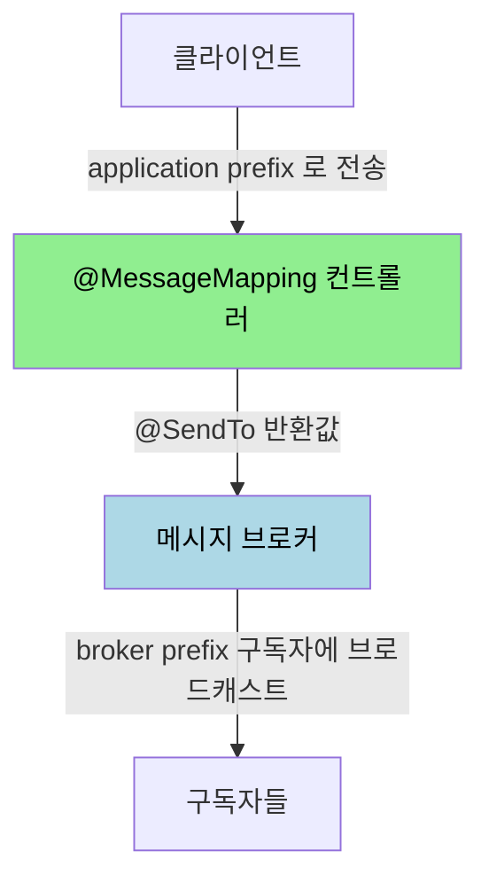
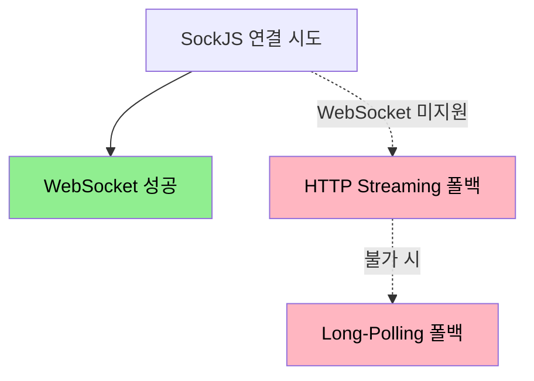

# STOMP 실무 — Spring 구현

---

> [`03-03`](03-03.WebSocket%20vs%20STOMP.md) 에서 STOMP 의 pub/sub 모델을 봤습니다. 이번에는 Spring Boot 로 STOMP 를 실제 구현합니다. 이 문서를 읽고 나면 메시지 브로커 설정, 클라이언트가 서버로·서버가 클라이언트로 보내는 방향을 가르는 어노테이션, SockJS 의 역할을 설명할 수 있습니다. 특히 `@MessageMapping` 과 `@SendTo` 의 방향은 흔히 헷갈리므로 공식 기준으로 정리합니다.


## 1. STOMP 메시지 흐름

> 클라이언트가 메시지를 보내면 서버 컨트롤러가 받아 처리하고, 그 결과를 구독자에게 브로드캐스트합니다.

```groovy
implementation 'org.springframework.boot:spring-boot-starter-websocket'
```

기본 흐름은 다음과 같습니다.

1. 클라이언트가 메시지를 보내면 STOMP 통신을 통해 서버에 메시지가 전달됩니다.
2. 컨트롤러의 `@MessageMapping` 이 그 메시지를 받습니다.
3. 컨트롤러의 `@SendTo` 가 특정 주제를 구독하는 클라이언트에게 결과를 보냅니다.


## 2. WebSocketConfig — 브로커·prefix·엔드포인트

> STOMP 설정은 세 가지를 정합니다. 어디로 접속할지(엔드포인트), 어디로 보낸 메시지를 컨트롤러가 받을지(application prefix), 어디를 브로커가 맡을지(broker prefix)입니다.

```java
@Configuration
@EnableWebSocketMessageBroker
public class WebSocketConfig implements WebSocketMessageBrokerConfigurer {

	@Override
	public void configureMessageBroker(MessageBrokerRegistry config) {
		// 브로커가 맡는 prefix — 구독·브로드캐스트 (서버 → 클라이언트)
		config.enableSimpleBroker("/client");

		// 컨트롤러가 받는 prefix — @MessageMapping 으로 라우팅 (클라이언트 → 서버)
		config.setApplicationDestinationPrefixes("/server");
	}

	@Override
	public void registerStompEndpoints(StompEndpointRegistry registry) {
		// WebSocket 핸드셰이크용 접속 경로
		registry.addEndpoint("/share")
			.setAllowedOriginPatterns("*")
			.withSockJS();
	}
}
```

세 메서드의 역할은 공식 문서 기준으로 다음과 같습니다.

- `@EnableWebSocketMessageBroker` — `@Configuration` 클래스에 붙여 WebSocket 을 통한 브로커 메시징을 활성화합니다. `WebSocketMessageBrokerConfigurer` 를 구현해 설정을 커스텀합니다.
- `setApplicationDestinationPrefixes` — 이 prefix 로 시작하는 destination 헤더를 가진 STOMP 메시지를 `@Controller` 의 `@MessageMapping` 메서드로 라우팅합니다. 공식 예제는 `/app` 을 씁니다.
- `enableSimpleBroker` — 내장 메시지 브로커를 켜서 구독과 브로드캐스트를 맡깁니다. 이 prefix 로 시작하는 메시지는 브로커로 라우팅됩니다. 공식 예제는 `/topic`·`/queue` 를 씁니다.
- `registerStompEndpoints` — WebSocket 연결을 위한 엔드포인트를 구성합니다. `withSockJS()` 는 WebSocket 을 지원하지 않는 환경을 위한 대체 옵션을 활성화합니다.

prefix 두 개의 방향이 핵심입니다. application destination prefix 는 클라이언트가 서버로 보내는 메시지가 가는 길이고, broker prefix 는 서버가 구독자에게 뿌리는 메시지가 가는 길입니다.



브로커는 내장 simple broker 외에 외부 메시지 브로커로 바꿀 수도 있습니다. 공식 문서는 `enableStompBrokerRelay("/topic", "/queue")` 로 RabbitMQ·ActiveMQ 같은 외부 STOMP 브로커에 연결하는 방식을 제공하며, 이때 TCP 연결 관리를 위해 reactor-netty 의존성이 필요합니다. 트래픽이 커지거나 여러 서버 인스턴스가 메시지를 공유해야 하면 simple broker 대신 relay 를 씁니다.


## 3. 서버 수신과 전송 — @MessageMapping·@SendTo

> 두 어노테이션의 방향은 흔히 헷갈립니다. `@MessageMapping` 은 받는 쪽, `@SendTo` 는 보내는 쪽입니다.

```java
@MessageMapping("/{planId}/title")
@SendTo("/client/{planId}/titleModify")
public ResponseEntity<Response<?>> titleModify(@Header(name = "Authorization") String accessToken,
                                               @DestinationVariable Long planId, @RequestBody PlanTitleDto planTitle) {
	// ...
	return ResponseEntity.ok(Response.of("", 200, "success"));
}
```

두 어노테이션의 정확한 방향은 공식 문서 기준으로 다음과 같습니다. "요청/응답" 이 아니라 "수신/브로드캐스트" 로 이해해야 정확합니다.

- `@MessageMapping("/{planId}/title")` — 클라이언트가 application destination prefix(`/server`)에 보낸 메시지를 *수신* 하는 핸들러입니다. 즉 클라이언트에서 서버로 들어오는 입구입니다.
- `@SendTo("/client/{planId}/titleModify")` — 핸들러의 반환값을 해당 destination 을 *구독하는 클라이언트들에게 브로드캐스트* 합니다. 즉 서버에서 구독자로 나가는 출구입니다.

클라이언트가 `/server/1/title` 로 보내면 `@MessageMapping("/{planId}/title")` 이 받고, 반환값이 `@SendTo("/client/1/titleModify")` 를 구독하는 모든 클라이언트에게 퍼집니다. [`03-03 §5`](03-03.WebSocket%20vs%20STOMP.md) 의 pub/sub 이 이 어노테이션 쌍으로 구현됩니다.

특정 사용자 한 명에게만 보내야 하면 `@SendToUser` 를 쓰고, 메시지를 받은 그 사용자에게만 보내는 형태도 가능합니다. 브로드캐스트(`@SendTo`)와 유니캐스트(`@SendToUser`)의 구분은 [`04-02`](04-02.실시간%20메시지%20동기화%20패턴.md) 의 ACK·DELTA 설계에서 다시 다룹니다.


## 4. SockJS 폴백

> SockJS 는 WebSocket 을 지원하지 않는 환경에서 HTTP 기반 기술로 대체 연결을 만들어 줍니다. `withSockJS()` 한 줄이 이를 활성화합니다.

§2 의 `registerStompEndpoints` 에서 `withSockJS()` 를 붙이면 SockJS 폴백이 켜집니다. SockJS 는 먼저 WebSocket 연결을 시도하고, 안 되면 HTTP Streaming·Long-Polling 같은 HTTP 기반 기술로 전환해 연결을 이어 갑니다. 이를 WebSocket Emulation 이라고 합니다. [`01-01 §4`](01-01.HTTP·TCP%20통신과%20HTTP%20vs%20Socket.md) 에서 본 HTTP 실시간 흉내 방식이 여기서 폴백 수단으로 다시 등장합니다.



기업 방화벽이 WebSocket 프로토콜을 차단하거나 구형 브라우저를 지원해야 할 때 SockJS 가 안전망이 됩니다. 서버 코드는 그대로 두고 엔드포인트에 `withSockJS()` 만 붙이면 되므로, 호환성이 중요한 서비스에서는 기본으로 켜 두는 편이 안전합니다.


## 5. 면접 대비 체크리스트

> 본 문서를 다 읽은 뒤 다음 질문에 답할 수 있어야 합니다.

1. `setApplicationDestinationPrefixes` 와 `enableSimpleBroker` 는 각각 어느 방향의 메시지를 맡습니까?
2. `@MessageMapping` 과 `@SendTo` 의 방향을 "수신/브로드캐스트" 로 정확히 설명하면 어떻게 됩니까?
3. simple broker 와 broker relay 는 언제 각각 쓰입니까?
4. SockJS 의 WebSocket Emulation 은 무엇이며, 어떤 폴백 기술을 씁니까?


## 다음에 읽을 것

- [`03-03.WebSocket vs STOMP.md`](03-03.WebSocket%20vs%20STOMP.md) — STOMP 의 pub/sub 모델과 프레임 (선행 문서)
- [`04-02.실시간 메시지 동기화 패턴.md`](04-02.실시간%20메시지%20동기화%20패턴.md) — SNAPSHOT/DELTA·메시지 타입 설계
- [Spring STOMP — Enable](https://docs.spring.io/spring-framework/reference/6.2/web/websocket/stomp/enable.html) — 브로커·prefix·엔드포인트 공식 설정
