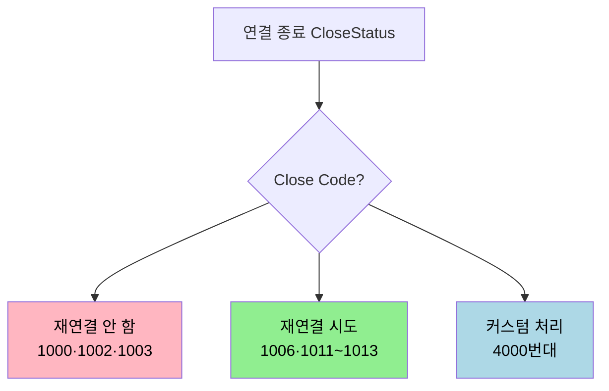
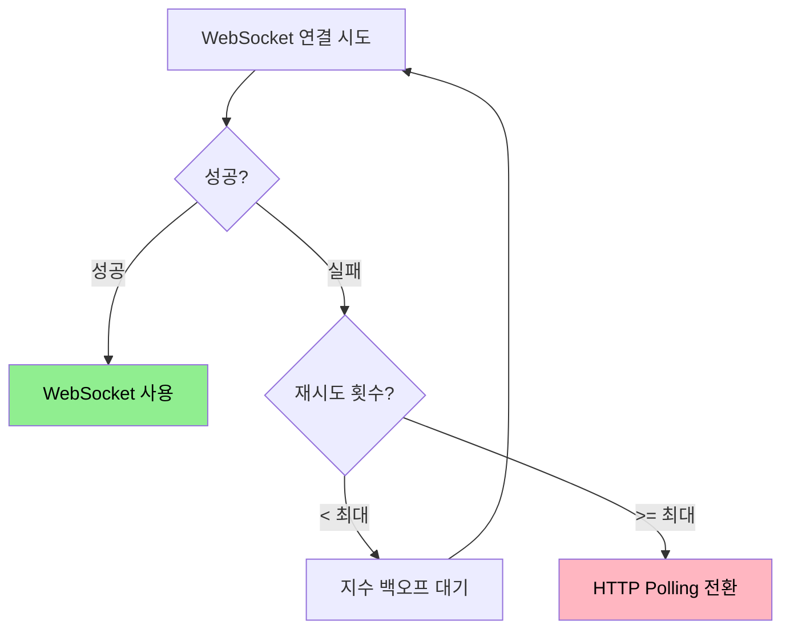

# 연결 관리와 재연결 전략

---

> [`03-02`](03-02.WebSocket%20구현.md) 에서 WebSocket 의 연결·종료·에러 콜백을 봤습니다. 실시간 연결은 끊기기 마련이라, 끊긴 이유를 분류하고 언제 어떻게 다시 붙을지 정하는 전략이 신뢰성을 가릅니다. 이 문서를 읽고 나면 WebSocket Close Code 의 의미, 코드별 재연결 판단, 지수 백오프와 Thundering Herd, 에러 유형 분류, 그리고 HTTP 폴링 Fallback 을 설명할 수 있습니다.


## 1. onError 와 onClose

> 연결이 끊길 때 두 콜백이 관여합니다. onError 는 오류가 났을 때, onClose 는 종료될 때 호출되며, 재연결 판단은 onClose 에서 합니다.

`onError` 는 연결 실패·프로토콜 오류 같은 오류가 났을 때 호출되고, `onClose` 는 연결이 종료될 때 정상·비정상을 가리지 않고 항상 호출됩니다.

| 항목 | onError | onClose |
|------|---------|---------|
| 호출 시점 | 오류 발생 시 | 연결 종료 시 (항상) |
| 제공 정보 | 제한적 (보안상 상세 없음) | Close Code·reason·정상 여부 |
| 재연결 결정 | 여기서 안 함 | Close Code 기반으로 결정 |

에러 발생 시에는 `onError` 다음 `onClose` 순서로, 정상 종료 시에는 `onClose` 만 호출됩니다. `onError` 는 보안상 상세 정보를 주지 않으므로, 재연결 여부는 `onClose` 가 받는 Close Code 로 판단합니다. Spring 서버에서는 `WebSocketHandler.afterConnectionClosed(session, CloseStatus status)` 의 `CloseStatus` 가 이 Close Code 를 담습니다.


## 2. Close Code 의 의미

> WebSocket 은 종료 사유를 표준 코드로 정의합니다. 코드를 보면 재연결을 시도해야 할지가 갈립니다.

주요 Close Code 와 재연결 여부는 다음과 같습니다.

| 코드 | 이름 | 의미 | 재연결 |
|------|------|------|--------|
| 1000 | Normal Closure | 의도된 정상 종료 | 안 함 |
| 1001 | Going Away | 서버 종료·페이지 이동 | 상황에 따라 |
| 1002 | Protocol Error | 프로토콜 오류 | 안 함 |
| 1003 | Unsupported Data | 지원 안 하는 데이터 형식 | 안 함 |
| 1006 | Abnormal Closure | 비정상 종료(네트워크 끊김) | 시도 |
| 1008 | Policy Violation | 정책 위반 | 안 함 |
| 1009 | Message Too Big | 메시지 크기 초과 | 안 함 |
| 1011 | Internal Error | 서버 내부 오류 | 시도 |
| 1012 | Service Restart | 서버 재시작 | 시도 |
| 1013 | Try Again Later | 일시적 과부하 | 지연 후 시도 |
| 4000~4999 | 애플리케이션 정의 | 서버 커스텀 코드 | 코드별 정의 |

판단 기준은 단순합니다. 정상 종료(1000)나 클라이언트 측 오류(1002·1003·1008·1009)는 재연결해도 같은 결과이므로 시도하지 않습니다. 네트워크 끊김(1006)이나 서버 측 일시 문제(1011~1013)는 재연결을 시도합니다. 커스텀 코드(4000번대)는 의미가 애플리케이션마다 다르므로, 예컨대 인증 실패(4001)·세션 만료(4002)는 토큰을 갱신한 뒤에 붙어야 하니 자동 재연결을 막습니다.




## 3. 지수 백오프와 Thundering Herd

> 서버 장애 시 모든 클라이언트가 동시에 즉시 재연결하면 이미 과부하인 서버가 더 빨리 죽습니다. 재연결 간격을 지수적으로 늘려 서버에 복구 시간을 줍니다.

서버가 장애 상태일 때 수천 클라이언트가 동시에 즉시 재연결을 시도하면 Thundering Herd 문제가 생깁니다. 과부하 서버에 연결 요청이 한꺼번에 몰려 더 빨리 무너집니다. 지수 백오프는 재연결 실패마다 대기 시간을 지수적으로 늘려 이를 완화합니다.

```text
대기시간 = min(baseDelay × 2^(attempts-1), maxDelay) + jitter
```

1초, 2초, 4초, 8초처럼 간격이 늘어나 서버가 복구할 시간을 법니다. 그런데 좁은 Jitter(예: 0~1초)만 더하면 재연결이 여전히 비슷한 시각에 몰립니다. [`02-02 §5`](02-02.SSE%20신뢰성%20—%20재연결과%20손실%20복구.md) 에서 본 Full Jitter 가 해법입니다. 대기 시간을 `0 ~ ceiling` 사이 완전 랜덤으로 잡아 재연결 시도를 시간 축에 균등하게 흩뿌립니다.

```text
ceiling = min(maxDelay, baseDelay × 2^attempts)
대기시간 = random(0, ceiling)

1차: random(0, 1000)   → 0~1초 어디든
2차: random(0, 2000)   → 0~2초 어디든
3차: random(0, 4000)   → 0~4초 어디든
```

재연결을 무한정 시도하면 안 되므로 최대 시도 횟수도 둡니다. 일정 횟수를 넘으면 자동 재연결을 멈추고 사용자에게 수동 재연결 UI 를 띄우거나 Fallback 으로 전환합니다.


## 4. 에러 유형 분류

> 에러는 연결의 어느 단계에서 났느냐로 나뉩니다. 단계별로 대응이 다릅니다.

| 단계 | 에러 유형 | 원인 | 대응 |
|------|-----------|------|------|
| 연결 전 | URL 유효성 오류 | 잘못된 프로토콜·URL | URL 검증 |
| 연결 중 | 핸드셰이크 실패 | 서버 다운·CORS | 재연결·Fallback |
| 연결 중 | 인증 실패 | 토큰 만료 | 토큰 갱신 후 재연결 |
| 연결 후 | 메시지 파싱 오류 | 잘못된 JSON | 로깅 후 무시 |
| 연결 후 | 연결 끊김 | 네트워크·서버 재시작 | 자동 재연결 |

연결 후의 메시지 파싱 오류는 연결 자체는 멀쩡하므로, 끊지 말고 로깅 후 해당 메시지만 버리는 편이 안전합니다. 잘못된 메시지 하나 때문에 연결을 재시작하면 상태 불일치가 더 커질 수 있습니다.


## 5. HTTP 폴링 Fallback

> WebSocket 을 쓸 수 없는 환경도 있습니다. 재연결이 반복 실패하면 HTTP 폴링으로 갈아타 서비스를 이어 갑니다.

WebSocket 을 못 쓰는 상황은 다음과 같습니다.

| 상황 | 설명 | 빈도 |
|------|------|------|
| 구형 브라우저 | WebSocket 미지원 | 매우 드묾 |
| 기업 방화벽·프록시 | ws/wss 포트 차단 | 간혹 |
| 불안정한 네트워크 | 연결 유지 어려움 | 가끔 |
| 재연결 반복 실패 | 일정 횟수 초과 | 가끔 |

이때 HTTP 폴링으로 전환합니다. 폴링은 실시간성이 폴링 간격만큼 떨어지고 서버 부하가 높지만, 방화벽 호환성이 좋아 어디서든 동작합니다. [`03-04`](03-04.STOMP%20실무%20—%20Spring%20구현.md) 에서 본 SockJS 가 바로 이 Fallback 을 자동화한 것으로, WebSocket 을 먼저 시도하고 안 되면 HTTP Streaming·Long-Polling 으로 내려갑니다.



Spring 에서는 STOMP 엔드포인트에 `withSockJS()` 를 붙이는 것으로 이 Fallback 을 서버가 지원합니다. 운영에서는 끊김을 줄이기 위해 STOMP 하트비트(`taskScheduler` 로 ping/pong)를 함께 설정해, 유휴 연결이 프록시에 의해 끊기는 것을 막습니다.


## 6. 면접 대비 체크리스트

> 본 문서를 다 읽은 뒤 다음 질문에 답할 수 있어야 합니다.

1. onError 와 onClose 는 각각 언제 호출되며, 재연결 판단은 왜 onClose 에서 합니까?
2. Close Code 1000·1006·4001 은 각각 재연결을 시도해야 합니까? 그 이유는?
3. Thundering Herd 는 무엇이며, Full Jitter 지수 백오프가 어떻게 막습니까?
4. WebSocket 을 못 쓰는 환경에서 HTTP 폴링 Fallback 은 무엇을 희생하고 무엇을 얻습니까?


## 다음에 읽을 것

- [`03-02.WebSocket 구현.md`](03-02.WebSocket%20구현.md) — 연결·종료·에러 콜백 (선행 문서)
- [`02-02.SSE 신뢰성 — 재연결과 손실 복구.md`](02-02.SSE%20신뢰성%20—%20재연결과%20손실%20복구.md) — SSE 쪽의 재연결·손실 복구
- [`04-02.실시간 메시지 동기화 패턴.md`](04-02.실시간%20메시지%20동기화%20패턴.md) — 재연결 후 상태를 맞추는 SNAPSHOT/DELTA
