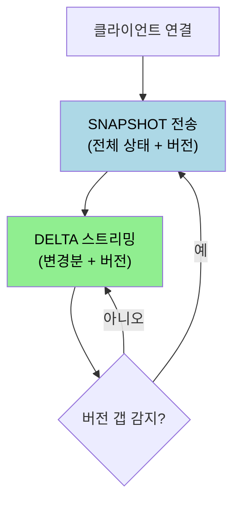
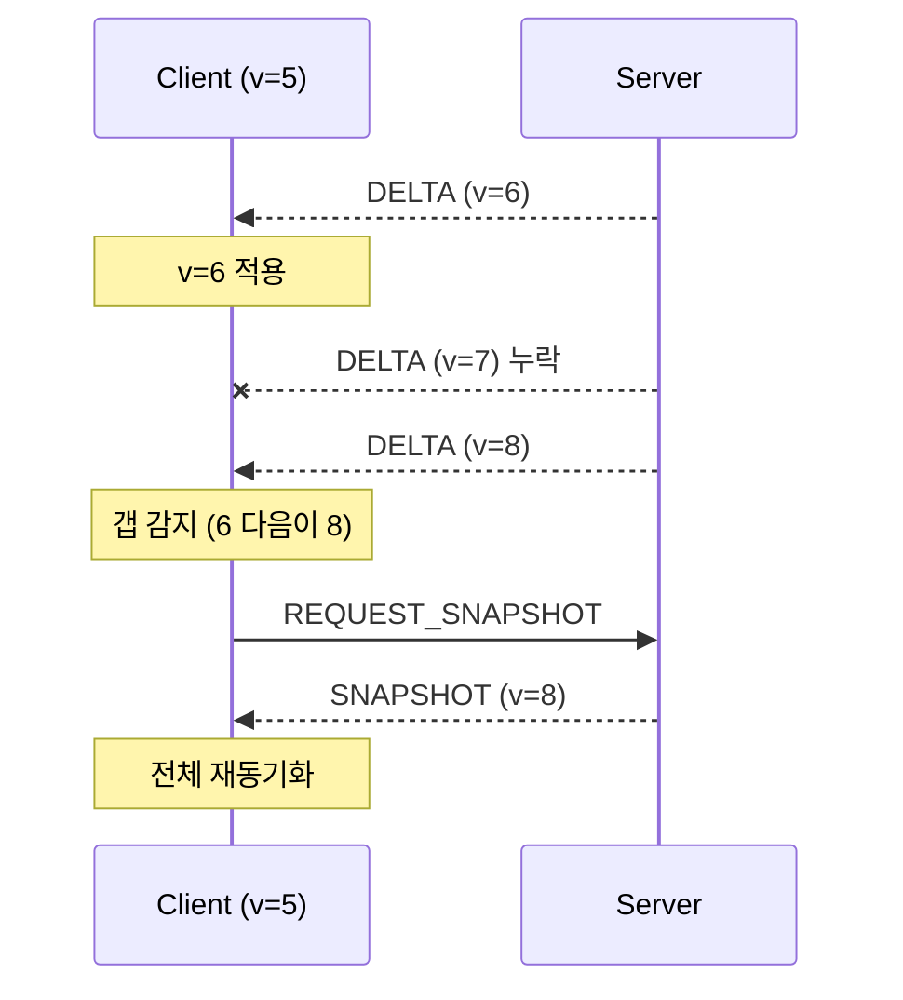
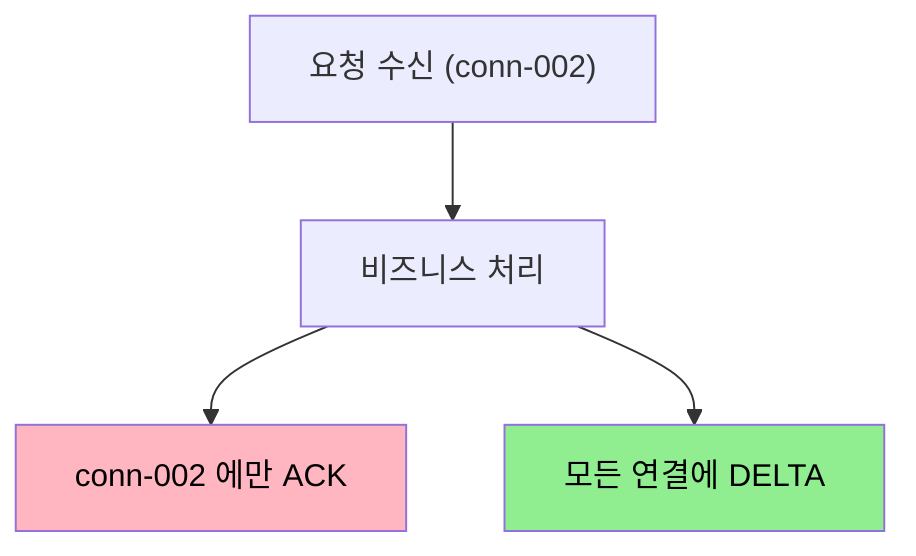

# 실시간 메시지 동기화 패턴

---

> [`03-04`](03-04.STOMP%20실무%20—%20Spring%20구현.md) 에서 STOMP 로 메시지를 주고받는 법을 봤고, [`04-01`](04-01.연결%20관리와%20재연결%20전략.md) 에서 끊긴 연결을 다시 붙이는 법을 봤습니다. 그런데 재연결 뒤 클라이언트 상태를 서버와 어떻게 맞출까요? 이 문서를 읽고 나면 SNAPSHOT/DELTA 패턴, 버전 관리와 갭 감지, 실시간 메시지 타입 설계, 그리고 이를 Spring STOMP 에 매핑하는 법을 설명할 수 있습니다.

## 1. SNAPSHOT 과 DELTA

> 전체 상태를 통째로 보내는 SNAPSHOT 과 변경분만 보내는 DELTA 를 결합하면, 정확성과 효율을 동시에 얻습니다.

SNAPSHOT 은 전체 상태를 한 번에 전송하는 메시지로, 클라이언트가 서버의 현재 데이터 전체를 알게 합니다. DELTA 는 변경된 부분만 전송해 네트워크 대역폭과 처리 비용을 아낍니다.

둘 중 하나만 쓰면 문제가 생깁니다. SNAPSHOT 만 쓰면 1000개 데이터에서 1개만 바뀌어도 1000개를 전송해 비효율적입니다. DELTA 만 쓰면 초기에 클라이언트가 현재 상태를 알 수 없고, 재연결 시 중간 변경분이 누락되면 상태가 어긋납니다. 그래서 둘을 결합합니다.

SNAPSHOT 은 초기 연결, 재연결, 클라이언트의 명시적 요청, 버전 갭이 너무 커서 DELTA 로 복구가 불가능할 때 보냅니다. DELTA 는 개별 항목의 생성·수정·삭제처럼 연결이 안정적인 동안의 실시간 업데이트에 씁니다.

## 2. 버전 관리와 갭 감지

> 네트워크 특성상 메시지가 순서대로 도착하지 않거나 누락될 수 있습니다. 버전 번호로 순서를 보장하고 누락을 감지합니다.

모든 메시지에 서버의 상태 버전(시퀀스 번호)을 실어 보냅니다. 클라이언트는 자신이 적용한 버전을 기억하고, 들어온 메시지의 버전과 비교합니다.

- 오래된 메시지(버전이 현재 이하)는 무시합니다.
- 버전이 `현재 + 1` 이면 정상 적용하고 클라이언트 버전을 올립니다.
- 버전이 `현재 + 1` 보다 크면 중간 DELTA 가 누락된 것이므로 갭을 감지하고 SNAPSHOT 을 재요청합니다.

존재하지 않는 항목에 대한 DELTA 도 갭의 신호입니다. UPDATE 가 왔는데 해당 항목이 클라이언트에 없으면 중간에 CREATE 를 놓친 것이므로 SNAPSHOT 을 재요청합니다. 반면 DELETE 는 멱등(idempotent)이라, 이미 없는 항목을 지우라는 DELTA 가 와도 문제없이 넘어갑니다.

## 3. 실시간 메시지 타입 설계

> WebSocket 은 메시지 내용 형식을 정의하지 않으므로, 각 메시지가 무엇인지 직접 설계해야 합니다. 방향과 목적으로 타입을 나눕니다.

[`03-01 §3`](03-01.WebSocket%20프로토콜과%20핸드셰이크.md) 에서 봤듯 WebSocket 표준(RFC 6455)이 정의하는 것은 프레임 타입(text·binary·ping·pong·close)·핸드셰이크·연결 유지뿐입니다. SNAPSHOT·DELTA 같은 메시지 타입 이름과 데이터 동기화 방식은 표준이 아니라 *설계 패턴* 입니다. 널리 쓰이는 검증된 방식이지만 프로젝트에 맞게 바꿀 수 있습니다.

방향과 목적으로 메시지 타입을 나누면 다음과 같습니다.

| 타입 | 방향 | 설명 | 사용 시점 |
|------|------|------|-----------|
| SNAPSHOT | 서버에서 클라이언트 | 전체 상태 전송 | 초기·재연결·갭 복구 |
| DELTA | 서버에서 클라이언트 | 개별 변경 전송 | 실시간 업데이트 |
| ACK | 서버에서 클라이언트 | 요청 처리 확인 | 클라이언트 요청 성공 시 |
| ERROR | 서버에서 클라이언트 | 오류 알림 | 권한 없음·유효성 실패 |
| SUBSCRIBE | 클라이언트에서 서버 | 구독 시작 | 특정 채널 수신 시작 |
| CREATE/UPDATE/DELETE | 클라이언트에서 서버 | 데이터 변경 요청 | 사용자 액션 |

설계 목표는 명확한 의도 전달, 요청-응답 추적(`requestId`), 확장 가능성, 타입 안전성입니다.

## 4. ACK 와 DELTA — 유니캐스트와 브로드캐스트

> 같은 변경이라도 ACK 와 DELTA 는 다른 대상에게 갑니다. ACK 는 요청자에게만, DELTA 는 모든 구독자에게 갑니다.

ACK 와 DELTA 는 목적이 다른 별개의 메시지입니다. ACK 는 요청자에게만 보내는 "확인" 메시지(유니캐스트)이고, DELTA/SNAPSHOT 은 모든 구독자에게 뿌리는 "상태 동기화" 메시지(브로드캐스트)입니다.

| 구분 | ACK | DELTA/SNAPSHOT |
|------|-----|----------------|
| 수신 대상 | 요청자만 (1:1) | 모든 구독자 (브로드캐스트) |
| 목적 | 요청 성공·실패 확인 | 상태 동기화 |
| requestId | 있음 (요청 매칭용) | 없음 |
| 실패 시 | 전송됨 (success=false) | 전송 안 됨 |

`requestId` 가 ACK 의 핵심입니다. 여러 요청이 동시에 진행될 때 비동기 처리라 응답 순서가 보장되지 않으므로, 클라이언트는 `requestId` 로 어떤 요청의 응답인지 매칭합니다. ACK 는 낙관적 업데이트를 확정하거나(UI 를 먼저 바꾸고 ACK 로 성공 확인), 실패 시 롤백하는 데 씁니다.

서버가 ACK 를 요청자에게만 보낼 수 있는 이유는 각 WebSocket 연결이 독립적인 세션이기 때문입니다. 서버는 메시지가 어떤 연결에서 왔는지 이미 알고 있어, 그 연결에만 ACK 를 보내고(유니캐스트) 상태 변경은 전체 연결에 뿌립니다(브로드캐스트).

## 5. Spring STOMP 매핑

> 위 설계 패턴은 Spring STOMP 의 어노테이션으로 자연스럽게 구현됩니다. 초기 SNAPSHOT, 브로드캐스트 DELTA, 유니캐스트 ACK 가 각각 대응합니다.

[`03-04`](03-04.STOMP%20실무%20—%20Spring%20구현.md) 의 STOMP 어노테이션이 이 패턴에 그대로 맞물립니다.

- **초기 SNAPSHOT** — `@SubscribeMapping` 을 쓰면 클라이언트가 구독하는 순간 한 번 실행되어, 그 구독자에게만 현재 전체 상태를 돌려줍니다. 재연결 후 첫 SNAPSHOT 을 보내기 좋은 자리입니다.
- **브로드캐스트 DELTA** — `@MessageMapping` 으로 변경 요청을 받고 `@SendTo("/topic/...")` 로 반환하면, 그 destination 을 구독하는 모든 클라이언트에게 변경분이 퍼집니다.
- **유니캐스트 ACK** — `@SendToUser` 를 쓰면 요청을 보낸 그 사용자에게만 메시지가 갑니다. ACK 처럼 요청자에게만 확인을 보낼 때 씁니다.

즉 "구독 시 전체 상태 + 변경 시 모두에게 DELTA + 요청자에게만 ACK" 라는 설계가 `@SubscribeMapping` + `@SendTo` + `@SendToUser` 세 어노테이션으로 표현됩니다. 버전 갭 감지 후의 SNAPSHOT 재요청은 클라이언트가 별도 destination(예: `/server/request-snapshot`)으로 보내고, 서버가 `@MessageMapping` + `@SendToUser` 로 그 클라이언트에게만 전체 상태를 돌려주는 형태로 구현합니다.

## 6. 면접 대비 체크리스트

> 본 문서를 다 읽은 뒤 다음 질문에 답할 수 있어야 합니다.

1. SNAPSHOT 과 DELTA 를 결합하는 이유는 무엇입니까? 각각 언제 보냅니까?
2. 버전 갭은 어떻게 감지하며, 감지하면 무엇을 합니까? DELETE 가 멱등이라는 게 왜 도움이 됩니까?
3. ACK 와 DELTA 는 수신 대상이 어떻게 다릅니까? `requestId` 는 왜 필요합니까?
4. 이 설계 패턴을 Spring STOMP 의 `@SubscribeMapping`·`@SendTo`·`@SendToUser` 에 어떻게 매핑합니까?

## 다음에 읽을 것

- [`03-04.STOMP 실무 — Spring 구현.md`](03-04.STOMP%20실무%20—%20Spring%20구현.md) — STOMP 어노테이션과 브로커 (선행 문서)
- [`04-01.연결 관리와 재연결 전략.md`](04-01.연결%20관리와%20재연결%20전략.md) — 재연결 후 SNAPSHOT 으로 상태 맞추기
