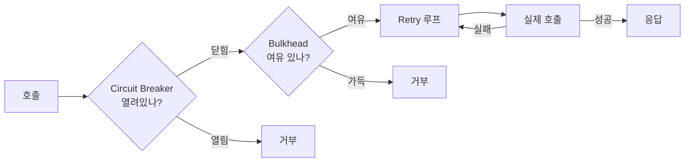

# Resilience4j 개요 — 5가지 모듈과 도입 결정

---

> Resilience4j 는 *외부 호출의 부분 실패* 를 *5가지 패턴* 으로 분담합니다. Circuit Breaker · Retry · Bulkhead · Rate Limiter · Time Limiter. 각 모듈은 *서로 다른 장애 형태* 에 답하며, *조합 순서가 결과를 바꿉니다*. 본 편은 *각 모듈이 어떤 자리에 들어가는지* 의 골격과 *Spring Boot 자동 구성·Annotation 통합* 의 기본 형태를 잡습니다. 모듈별 깊이는 02~05 가 받습니다.


## 라이브러리 위치 — 무엇을 대체하는가

Resilience4j 는 *Hystrix 의 후계자* 로 자주 설명됩니다. Netflix Hystrix 가 *2018 년 maintenance mode* 로 들어간 뒤, Spring Cloud Circuit Breaker 의 디폴트 구현이 Resilience4j 로 옮겨졌습니다. 차이점은 *함수형 데코레이터 모델* 과 *경량성* 입니다. Hystrix 가 *모든 호출을 별도 스레드 풀* 에서 실행했다면, Resilience4j 는 *Semaphore 모드* 와 *ThreadPool 모드* 를 선택 가능하게 만들어 *경량 케이스* 도 받칩니다.

Spring 자체의 *Spring Retry* (`@Retryable`) 가 *재시도만* 다루는 반면, Resilience4j 는 *재시도 + 서킷 + 격리 + 속도 제한 + 타임아웃* 5가지를 *하나의 데코레이터 체인* 으로 묶습니다. 외부 HTTP 호출이 1개 이상이면 보통 Resilience4j 가 답입니다.


## 5가지 모듈의 책임 분담

> 각 모듈은 *다른 장애 형태* 에 답합니다. 한 모듈로 모두 풀려고 하면 *흉내* 가 됩니다.

| 모듈 | 답하는 장애 형태 | 핵심 메커니즘 |
|------|---------------|------------|
| Circuit Breaker | 다운스트림이 *지속 실패* 중 | 실패율·느린 호출률 임계 초과 시 *호출 차단* |
| Retry | *일시적* 실패 (네트워크 끊김, 일시 5xx) | 백오프·jitter 로 N 번 재시도 |
| Bulkhead | 한 다운스트림이 *내 자원 전체를 점유* 함 | 동시 호출 수 제한 (Semaphore 또는 ThreadPool) |
| Rate Limiter | 내가 다운스트림 *호출 속도* 를 제한해야 | token bucket 으로 단위 시간 호출 수 제한 |
| Time Limiter | 단일 호출이 *오래 걸려* 자원 점유 | 타임아웃 후 강제 종료 |

### 장애 형태별 어떤 모듈인가

**외부 API 가 잠시 5xx 응답** → Retry. 일시 장애의 정의.

**외부 API 가 30 초째 응답 없음** → Time Limiter + Circuit Breaker. 타임아웃으로 호출 끝내고, 반복되면 서킷 열어 호출 자체를 막음.

**외부 API 호출이 1초당 100건씩 몰림 → 다운스트림이 거부** → Rate Limiter. 내 쪽에서 호출 속도 조절.

**외부 API 한 곳이 느려져 *그 호출* 만 100개 스레드 점유 → 다른 호출까지 멈춤** → Bulkhead. 한 다운스트림이 점유 가능한 자원 한도 설정.

**다운스트림이 *지속* 다운** → Circuit Breaker. 호출 자체를 차단해 *fail-fast* 로 사용자 응답 빠르게 회복.

이 5가지가 *대부분의 외부 호출 실패 형태* 를 분담합니다.


## 데코레이터 패턴 — 5가지를 조합하는 모델

> Resilience4j 의 모든 모듈은 *Supplier 를 받아 Supplier 를 리턴* 합니다. 함수 합성으로 *여러 모듈을 체인* 으로 묶을 수 있습니다.

```java
CircuitBreaker circuitBreaker = CircuitBreaker.ofDefaults("backendService");
Retry retry = Retry.ofDefaults("backendService");
Bulkhead bulkhead = Bulkhead.ofDefaults("backendService");

Supplier<String> supplier = () -> backendService.doSomething(param1, param2);

Supplier<String> decoratedSupplier = Decorators.ofSupplier(supplier)
        .withCircuitBreaker(circuitBreaker)
        .withBulkhead(bulkhead)
        .withRetry(retry)
        .decorate();

String result = Try.ofSupplier(decoratedSupplier)
        .recover(throwable -> "Hello from Recovery").get();
```

`Decorators` 빌더가 *적용 순서* 를 결정합니다. 위 예시는 *retry 가 가장 안쪽, circuit breaker 가 가장 바깥쪽* 입니다. 호출 순서를 그림으로 보면 다음과 같습니다.



### 데코레이터 순서가 중요한 이유

*Retry 를 가장 안쪽* 에 둔 이유는 *각 시도가 Circuit Breaker 에 한 번씩 기록* 되도록 하기 위함입니다. 만약 Retry 를 가장 바깥에 두면 *3 번 재시도 = 서킷 입장에서는 1 번의 호출* 로 카운트되어 *임계 도달이 느려집니다*.

| 순서 | 효과 |
|------|------|
| Retry 가 안쪽 | 각 재시도가 서킷·Bulkhead 에 카운트. 임계 빠르게 도달. *추천* |
| Retry 가 바깥쪽 | 재시도가 *한 묶음* 으로 카운트. 서킷이 느리게 반응 |

Spring Boot Annotation 기반에서는 *어노테이션 순서* 가 데코레이터 순서를 결정하지 *않습니다*. 자동 구성이 *AOP Order 기반의 고정 순서* 를 적용합니다. 디폴트 순서는 Bulkhead → TimeLimiter → RateLimiter → CircuitBreaker → Retry → Fallback 입니다 (안에서 바깥으로). 이 순서가 *재시도가 서킷 안에서 카운트되는* 동작을 디폴트로 만듭니다.


## Spring Boot 통합 — Annotation 기반

> Spring Boot 의 `resilience4j-spring-boot3` 스타터가 가장 자주 쓰는 통합 방식입니다. `application.yml` 로 설정하고, `@CircuitBreaker` 같은 어노테이션으로 적용합니다.

```yaml
resilience4j:
  circuitbreaker:
    instances:
      backendA:
        registerHealthIndicator: true
        slidingWindowSize: 100
        minimumNumberOfCalls: 10
        permittedNumberOfCallsInHalfOpenState: 3
        waitDurationInOpenState: 10s
        failureRateThreshold: 50
        slowCallRateThreshold: 100
        slowCallDurationThreshold: 3s

  retry:
    instances:
      backendA:
        maxAttempts: 3
        waitDuration: 100ms
        exponentialBackoffMultiplier: 2

  ratelimiter:
    instances:
      backendA:
        limitForPeriod: 10
        limitRefreshPeriod: 1s
        timeoutDuration: 0
```

```java
@Service
public class BackendService {

    @CircuitBreaker(name = "backendA", fallbackMethod = "fallback")
    @Retry(name = "backendA")
    @RateLimiter(name = "backendA")
    @Bulkhead(name = "backendA")
    public String process(String data) {
        return externalService.call(data);
    }

    private String fallback(String data, Exception ex) {
        return "Fallback response for: " + data;
    }

    @TimeLimiter(name = "backendA")
    @Bulkhead(name = "backendA", type = Bulkhead.Type.THREADPOOL)
    public CompletableFuture<String> processAsync(String data) {
        return CompletableFuture.supplyAsync(() ->
                externalService.call(data));
    }
}
```

설정의 *Instance 이름* (예: `backendA`) 이 어노테이션의 `name` 과 *매칭* 됩니다. *서로 다른 다운스트림마다* 다른 instance 를 만들면 *독립된 정책* 을 적용할 수 있습니다. `paymentService`, `inventoryService`, `userService` 가 각자의 서킷·재시도 정책을 가집니다.

### fallbackMethod 의 규칙

`fallbackMethod` 는 *같은 클래스의 메서드 이름* 입니다. 시그너처는 *원본 메서드의 모든 파라미터 + 마지막에 예외 타입* 이어야 합니다. 위 예시의 `fallback(String data, Exception ex)` 가 그 형태입니다.

여러 예외 타입을 다른 fallback 으로 처리하려면 *fallback 메서드 오버로딩* 으로 표현합니다.

```java
private String fallback(String data, CallNotPermittedException ex) {
    return "Circuit open. Cached: " + data;
}

private String fallback(String data, RequestNotPermitted ex) {
    return "Rate limited. Retry later: " + data;
}

private String fallback(String data, Exception ex) {
    return "Generic fallback: " + data;
}
```

런타임에 *실제 예외 타입* 에 가장 맞는 메서드가 선택됩니다.


## 비동기·Reactive 통합

> 동기 모델 (Supplier) 외에 *CompletableFuture* 와 *Reactor Mono/Flux* 도 지원합니다. WebClient 와 결합할 때는 Reactor 통합을 씁니다.

```java
import io.github.resilience4j.reactor.circuitbreaker.operator.CircuitBreakerOperator;

Mono<String> result = webClient.get()
        .uri("/api/resource")
        .retrieve()
        .bodyToMono(String.class)
        .transformDeferred(CircuitBreakerOperator.of(circuitBreaker))
        .transformDeferred(RetryOperator.of(retry));
```

`transformDeferred` 가 *Reactor 의 연산자 체인* 에 회복탄력성 모듈을 끼워 넣습니다. WebClient 의 *비동기 모델 자체* 가 *Bulkhead 의 ThreadPool 모드와 잘 안 맞으므로* Reactive 통합에서는 *Semaphore Bulkhead* 가 자연스럽습니다.


## Registry 와 모니터링

Resilience4j 의 모든 인스턴스는 *Registry* 가 관리합니다. Spring Boot 가 자동으로 빈으로 등록합니다.

```java
@Autowired
private CircuitBreakerRegistry circuitBreakerRegistry;

@Autowired
private RetryRegistry retryRegistry;

public void monitorCircuitBreaker() {
    CircuitBreaker circuitBreaker = circuitBreakerRegistry
            .circuitBreaker("backendA");

    CircuitBreaker.Metrics metrics = circuitBreaker.getMetrics();
    logger.info("Failure rate: {}%", metrics.getFailureRate());
    logger.info("State: {}", circuitBreaker.getState());
}
```

Micrometer 와 자동 통합되어 *Prometheus 메트릭* 으로 노출됩니다. `resilience4j_circuitbreaker_state`, `resilience4j_retry_calls`, `resilience4j_ratelimiter_available_permissions` 같은 지표가 자동으로 나옵니다. *서킷이 OPEN 으로 전환되면 알람* 같은 운영이 그 메트릭 위에 올라갑니다.

`registerHealthIndicator: true` 를 켜면 Spring Boot Actuator 의 `/actuator/health` 응답에 *각 서킷의 상태* 가 포함됩니다.


## 도입 결정 — 언제 *과한가*

Resilience4j 가 *과한* 경우가 있습니다.

**1. 외부 호출이 1~2 곳이고 *지속 안정* 한 경우** — Spring 의 `@Retryable` 한 줄 또는 WebClient `.retryWhen` 한 줄로 충분할 수 있습니다.

**2. Istio 같은 서비스 메시가 이미 *인프라 레벨* 에서 회복탄력성을 적용** — 같은 패턴을 두 레이어에서 중복하면 *디버깅이 어렵습니다*. 인프라 레벨이 충분하다면 애플리케이션 레벨은 *최소화* 하는 게 일반적입니다.

**3. 호출 흐름이 *동기 + 빠른 응답*** — Bulkhead·TimeLimiter·Circuit Breaker 의 가치가 *느린 호출* 에서 큰데, *대부분의 호출이 50ms 이내 끝나는* 경우 그 가치가 작아집니다.

반대로 Resilience4j 가 *답인 경우* 는 다음 신호 중 하나가 명확할 때입니다.

- 외부 API 가 *3 개 이상* 이고 각자 다른 SLA
- 다운스트림 장애가 *내 시스템 전체* 로 전파된 적이 있음
- *부분 실패* 의 정책이 *코드 곳곳* 에 흩어져 있어 일관성 없음


## 관련 문서

- [`./README.md`](./README.md) — 본 시리즈 진입점. 5편 학습 순서와 경계 기준
- [`../webflux/01-05.에러 처리와 재시도.md`](../webflux/01-05.에러%20처리와%20재시도.md) — WebClient 자체의 *retryWhen* 패턴. 본 편의 Reactor 통합 자리와 짝편이며 *어디까지 WebClient 만으로 끝나는지* 의 경계를 보여줍니다
- [`../../../04_messaging/05_ConsistencyPattern/05-05.Backoff 전략 비교와 선택.md`](../../../04_messaging/05_ConsistencyPattern/05-05.Backoff%20전략%20비교와%20선택.md) — Spring Kafka 의 BackOff 정책. 본 편 Retry 모듈의 *exponential·jitter* 와 같은 사고 모델이 Kafka 컨슈머 측에서 어떻게 적용되는지
- [`../../../08_cloud/service-mesh/11-03.Istio 레질리언스.md`](../../../08_cloud/service-mesh/11-03.Istio%20레질리언스.md) — 같은 5가지 패턴이 *인프라 레이어* 에서 어떻게 적용되는지. *애플리케이션 vs 인프라* 의 분담 결정에 필요한 비교 축
