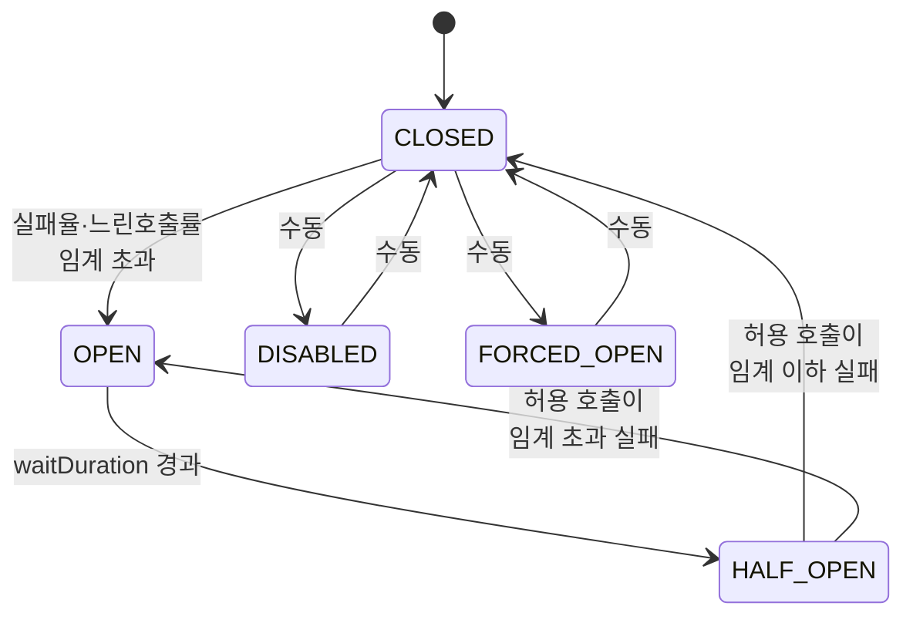

# Circuit Breaker 상세 — 상태 전이와 Sliding Window

---

> Circuit Breaker 는 *전구 회로의 차단기* 에서 유래한 이름입니다. *과부하 시 회로를 끊어* 시스템 전체 손상을 막는 발상을 *소프트웨어 호출* 에 옮겼습니다. 본 편은 *3가지 핵심 상태 (CLOSED · OPEN · HALF_OPEN)*, *Sliding Window 두 종류 (count-based · time-based)*, *Slow Call 분리 메커니즘*, 그리고 *상태 전이 이벤트 운영* 까지 다룹니다.


## 5가지 상태 모델

> Resilience4j 의 Circuit Breaker 는 *3개의 자동 상태* 와 *2개의 수동 상태* 를 가집니다.



| 상태 | 호출 동작 | 메트릭 기록 | 전이 조건 |
|------|---------|----------|---------|
| `CLOSED` | 정상 통과 | 기록 | 임계 초과 시 OPEN |
| `OPEN` | *모두 거부* (`CallNotPermittedException`) | 기록 안 함 | `waitDuration` 경과 시 HALF_OPEN |
| `HALF_OPEN` | 제한된 수만 통과 | 기록 | 임계 이하 실패 시 CLOSED, 초과 시 OPEN |
| `DISABLED` | 정상 통과 | 기록 안 함 | 수동 reset 만 |
| `FORCED_OPEN` | 모두 거부 | 기록 안 함 | 수동 reset 만 |

`DISABLED` 와 `FORCED_OPEN` 은 *운영 도구로 수동 제어* 하는 자리입니다. 정상 운영은 *세 자동 상태* 만 다룹니다.


## CLOSED — 정상 호출 + 메트릭 누적

> 디폴트 상태입니다. 호출이 *정상 통과* 하며 *Sliding Window* 에 결과 (성공·실패·느린 호출) 가 누적됩니다.

`minimumNumberOfCalls` 가 핵심 안전장치입니다. *충분한 표본* 없이 임계 평가하면 *처음 몇 개 호출 모두 실패* 같은 작은 표본으로 *서킷이 열려버립니다*. 디폴트 100건. 적은 트래픽이면 더 작게 (예: 10) 설정합니다.

```yaml
resilience4j:
  circuitbreaker:
    instances:
      backendA:
        minimumNumberOfCalls: 100
        failureRateThreshold: 50
        slowCallRateThreshold: 100
        slowCallDurationThreshold: 3s
```

위 설정의 해석은 *100건 이상 표본 + 실패율 50% 이상* 또는 *100건 이상 표본 + 느린 호출률 100% (= 모두 느림)* 일 때 OPEN 으로 전이입니다.


## OPEN — 호출 차단, 빠른 실패

> 임계 초과 직후의 상태입니다. *모든 호출이 즉시 거부* 되어 `CallNotPermittedException` 으로 끝납니다. 다운스트림에 호출이 *안 갑니다*.

이 동작이 *fail-fast* 의 핵심입니다. 다운스트림이 죽었다면 호출이 가도 *타임아웃 후 실패* 이고, 그 사이 *내 쪽 스레드·연결이 점유* 됩니다. OPEN 상태가 *호출 자체를 빠르게 거부* 해 자원 점유를 막습니다.

`waitDurationInOpenState` 가 *얼마나 기다린 후 HALF_OPEN 으로 갈지* 결정합니다. 디폴트 60초. 다운스트림 복구 시간 추정에 따라 조정합니다.

```yaml
waitDurationInOpenState: 10s
automaticTransitionFromOpenToHalfOpenEnabled: true
```

`automaticTransitionFromOpenToHalfOpenEnabled` 가 *시간 경과 시 자동 전이* 여부입니다. 디폴트 `false` 면 *다음 호출이 올 때* 전이를 평가합니다. `true` 로 켜면 *별도 스레드가 시간 추적* 해 자동 전이. 호출 빈도가 낮은 잡에 유용합니다.


## HALF_OPEN — 회복 시도

> OPEN 의 *waitDuration* 이 지나면 HALF_OPEN 으로 전이합니다. *제한된 수의 호출만* 통과시켜 다운스트림이 정말 회복됐는지 검사합니다.

`permittedNumberOfCallsInHalfOpenState` 가 *시험 호출 수* 입니다. 디폴트 10건. 이 10건의 *실패율* 이 *`failureRateThreshold` 미만* 이면 CLOSED 로, *초과* 면 다시 OPEN 으로 전이합니다.

```yaml
permittedNumberOfCallsInHalfOpenState: 3
failureRateThreshold: 50
```

위 설정이면 *HALF_OPEN 에서 3건 호출 → 실패율 50% 이상이면 다시 OPEN*, 미만이면 CLOSED. 3건 중 1건만 실패해도 33% 라 CLOSED 로 갑니다.

HALF_OPEN 의 *위험* 은 *시험 호출 동안 다운스트림에 부하* 가 갈 수 있다는 점입니다. `permittedNumberOfCallsInHalfOpenState` 가 너무 크면 *복구 안 된 다운스트림에 큰 트래픽* 이 가서 *다시 죽일* 수 있습니다. 3~10 정도가 안전한 디폴트입니다.


## Sliding Window — 표본 측정 방식

> 실패율·느린 호출률을 *어떤 표본* 으로 측정할지의 결정입니다. *count-based* 와 *time-based* 두 종류입니다.

### count-based — 마지막 N건

```yaml
slidingWindowType: COUNT_BASED
slidingWindowSize: 100
```

*최근 100건의 호출* 을 표본으로 합니다. 새 호출이 들어오면 *가장 오래된 1건이 표본에서 빠지고* 새 호출이 들어옵니다. 슬라이딩 윈도우의 이름이 여기서 왔습니다.

장점: *호출 빈도와 무관* 하게 일정 표본 유지.
단점: *트래픽이 적으면* 표본이 *오래된 데이터* 까지 포함. 1초 1건 호출이면 100건이 100초 전 데이터까지 봅니다.

### time-based — 최근 N초

```yaml
slidingWindowType: TIME_BASED
slidingWindowSize: 60
```

*최근 60초간의 호출* 을 표본으로 합니다. 60초 지난 호출은 표본에서 빠집니다.

장점: *최근 시간* 의 호출만 봐서 *시간 민감* 판단.
단점: *트래픽이 갑자기 폭증* 하면 표본이 커져 메모리 사용 증가. *순간 폭증의 영향* 이 그대로 표본에 반영.

일반적 선택은 *고트래픽이면 count-based*, *저트래픽이면 time-based* 입니다. 정확한 답은 호출 패턴에 달려 있어 *둘 다 시험* 해보는 게 안전합니다.


## Slow Call 분리 — 느린 호출도 실패로 본다

> *예외가 안 나지만 너무 느린 호출* 은 *부분 실패의 한 형태* 입니다. 다운스트림이 느려져 *전부 타임아웃 직전* 인 상황이 위험합니다.

Resilience4j 는 *Slow Call 비율* 을 별개 임계로 다룹니다.

```yaml
slowCallDurationThreshold: 3s
slowCallRateThreshold: 100
```

*3초 이상 걸리면 slow call* 로 분류. *slow call 비율이 100%* (= 모든 호출이 3초 이상) 면 *failure 와 마찬가지로* OPEN 으로 전이합니다.

이 분리가 *예외는 안 나지만 응답이 느려지는* 패턴을 잡습니다. 다운스트림이 DB 락 대기로 *느려졌지만 5xx 는 안 나는* 경우, slow call 메트릭만 임계를 넘습니다. 보통의 *failure 만 보는 서킷* 은 이 신호를 놓칩니다.

### Slow Call 메트릭과 Failure 메트릭의 합산

slow call 과 failure 는 *동시에 임계* 가 됩니다. 어느 쪽이든 먼저 임계 도달하면 OPEN 입니다. `slowCallRateThreshold` 가 작을수록 (예: 50%) 보수적, 클수록 (예: 100%) 관대.


## recordExceptions 와 ignoreExceptions

> *모든 예외를 실패로 카운트하는 게 항상 옳지는 않습니다*. 일부 예외는 *비즈니스 로직의 정상 결과* 이고, 일부는 *서킷이 잡아야 할 시스템 실패* 입니다.

```yaml
recordExceptions:
  - java.io.IOException
  - java.util.concurrent.TimeoutException
ignoreExceptions:
  - com.example.BusinessException
```

위 설정이면 *IOException·TimeoutException 만 실패로 카운트*, *BusinessException 은 카운트 안 함* (정상 처리한 것으로 봄). `BusinessException` 같은 비즈니스 오류 (예: *잔액 부족* 같은 도메인 거절) 는 *시스템 장애* 가 아니므로 서킷에 영향 주면 안 됩니다.

코드 레벨에서도 같은 설정이 가능합니다.

```java
CircuitBreakerConfig config = CircuitBreakerConfig.custom()
        .failureRateThreshold(50)
        .recordExceptions(IOException.class, TimeoutException.class)
        .ignoreExceptions(BusinessException.class)
        .build();
```


## 상태 전이 이벤트 — 운영의 진실 공급원

> 서킷 상태는 *외부에서 관측 가능* 해야 운영이 됩니다. Resilience4j 는 *이벤트 리스너* 와 *Micrometer 메트릭* 두 채널로 노출합니다.

```java
circuitBreaker.getEventPublisher()
        .onSuccess(event -> logger.info("Call succeeded"))
        .onError(event -> logger.error("Call failed: {}", event.getThrowable()))
        .onStateTransition(event -> logger.warn("State changed: {} -> {}",
                event.getStateTransition().getFromState(),
                event.getStateTransition().getToState()))
        .onIgnoredError(event -> logger.debug("Error ignored: {}", event.getThrowable()));
```

*상태 전이* (`STATE_TRANSITION`) 가 *알람 대상* 의 표준 신호입니다. *CLOSED → OPEN* 은 *다운스트림 장애 발생* 의 강한 신호. 운영자에게 즉시 알림이 갑니다.

이벤트를 *외부 시스템에 발행* 하는 패턴도 흔합니다. Kafka 토픽으로 상태 전이 이벤트를 발행해 *중앙 대시보드* 에서 *전체 서비스의 서킷 상태* 를 한눈에 보는 운영 모델.


## Micrometer 메트릭 자동 통합

Spring Boot 환경에서 `micrometer-core` 의존이 있으면 *자동으로 메트릭이 노출* 됩니다.

| 메트릭 | 의미 |
|--------|------|
| `resilience4j_circuitbreaker_state` | 현재 상태 (CLOSED=0, OPEN=1, HALF_OPEN=2 등) |
| `resilience4j_circuitbreaker_failure_rate` | 현재 실패율 (%) |
| `resilience4j_circuitbreaker_slow_call_rate` | 현재 느린 호출률 (%) |
| `resilience4j_circuitbreaker_calls` | 총 호출 수 (kind 라벨: successful·failed·ignored·not_permitted) |
| `resilience4j_circuitbreaker_buffered_calls` | Sliding Window 내 호출 수 |

Prometheus 로 긁어 Grafana 대시보드 만들면 *각 서킷의 상태와 실패율 추이* 가 시각화됩니다. 알람 룰은 보통 *`state == 1` 이 5분 이상 지속* 으로 둡니다 (일시 전이는 무시).


## 함정 — 자주 막히는 자리들

**1. `minimumNumberOfCalls` 가 너무 작아 *처음 몇 건 실패* 로 서킷이 열림** — 테스트 시 발생. 운영에선 트래픽이 충분해 잘 안 보이지만 *카나리 배포 직후* 처럼 트래픽 적은 시점에 발생. `recordFailurePredicate` 로 *어떤 실패를 카운트할지* 정밀화하거나 `minimumNumberOfCalls` 를 키우는 게 답.

**2. `BusinessException` 이 *실패로 카운트* 되어 정상 운영 중 서킷이 열림** — `ignoreExceptions` 설정 누락이 가장 흔한 원인. *도메인 거절은 서킷 측면에서 정상* 입니다.

**3. `failureRateThreshold` 가 100 으로 설정** — *모든 호출 실패할 때만* 열리는 관대한 설정. 보통 30~50 이 일반적. 100은 디버그용.

**4. `permittedNumberOfCallsInHalfOpenState` 가 너무 커서 복구 안 된 다운스트림이 다시 죽음** — HALF_OPEN 시험 호출 수를 *작게* 유지. 3~10 권장.

**5. *각 인스턴스마다 다른 정책* 인데 *전역 디폴트 한 개* 만 정의** — `resilience4j.circuitbreaker.configs` 로 *공통 정책 묶음* 정의 후 *instance 별 override* 가 표준 패턴.


## 코드 vs YAML — 어느 쪽이 답인가

설정을 *코드* 와 *YAML* 둘 다 가능합니다. 디폴트 권장은 *YAML* 입니다. 이유는 *환경별 분리* 입니다. *dev 는 관대, prod 는 엄격* 같은 정책 차이를 *프로필별 yml* 로 표현하기 자연스럽습니다.

코드 설정이 유리한 경우는 *런타임에 동적으로 정책을 바꿔야 할 때* 입니다. 외부 설정 서버 (Spring Cloud Config) 에서 *임계값을 받아 동적으로 적용* 같은 케이스. 일반 운영에서는 거의 안 쓰는 패턴입니다.


## 관련 문서

- [`./README.md`](./README.md) — 본 시리즈 진입점. 5편 학습 순서와 경계 기준
- [`./01-01.Resilience4j 개요 — 5가지 모듈과 도입 결정.md`](01-01.Resilience4j%20개요%20—%205가지%20모듈과%20도입%20결정.md) — 5가지 모듈의 *조합 순서* 와 *데코레이터 패턴*. 본 편의 Circuit Breaker 가 *다른 모듈과 어떻게 합쳐지는지* 의 자리. 특히 *Retry 가 안쪽, Circuit Breaker 가 바깥쪽* 인 이유가 본 편 OPEN 상태와 직결
- [`../../../06_observability/01_Foundations/01-04.SLO와 알림 — Error Budget, Burn Rate.md`](../../../06_observability/01_Foundations/01-04.SLO와%20알림%20—%20Error%20Budget,%20Burn%20Rate.md) — Circuit Breaker 상태 전이 이벤트가 *SLO 알람 룰* 과 결합되는 자리. *상태 = OPEN 5분 지속* 같은 룰의 사고 모델
- [`../../../08_cloud/service-mesh/11-03.Istio 레질리언스.md`](../../../08_cloud/service-mesh/11-03.Istio%20레질리언스.md) — Istio 의 *outlier detection* 이 *서비스 메시 레벨의 Circuit Breaker* 입니다. 같은 패턴이 *어플리케이션* (Resilience4j) 과 *인프라* (Istio) 양쪽에 있는 자리
