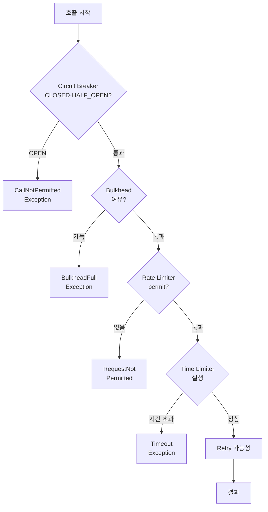

# Rate Limiter & Time Limiter — 트래픽 제어와 타임아웃

---

> 본 편은 *나머지 두 모듈* 을 한 자리에 다룹니다. **Rate Limiter** 는 *단위 시간 호출 수* 를 제한해 다운스트림이나 내가 *속도 초과* 로 거부당하는 것을 막습니다. **Time Limiter** 는 *단일 호출의 최대 시간* 을 강제해 *답이 없는 호출* 이 자원을 영원히 점유하는 것을 막습니다. 둘은 다른 측면을 풀지만 *비동기 호출 시리즈의 마무리* 라는 점에서 같이 봅니다.


## Rate Limiter — 단위 시간 호출 수 제한

### 답이 되는 자리

**1. 다운스트림이 *속도 제한* 정책을 가짐** — Stripe, GitHub API, Slack API 같은 외부 서비스가 *초당 N 건 또는 분당 N 건* 의 제한을 둡니다. 그 한도를 *내가 먼저 지켜* 다운스트림이 429 (Too Many Requests) 를 안 던지게 합니다.

**2. *내 자원 보호*** — 한 사용자가 *내 API 를 초당 1000 건* 호출하는 패턴을 막아 다른 사용자에게 자원을 보장합니다 (단, 이 자리는 보통 *API Gateway 레벨* 이 답이 더 좋습니다).

**3. *내부 처리 안정성*** — 외부 큐를 *너무 빠르게 소비* 하면 DB 가 못 따라옵니다. *소비 속도 제한* 으로 DB 와 보조 맞춤.

### token bucket 의미론

Resilience4j 의 Rate Limiter 는 *token bucket* 변형입니다. *주기적으로 permit 이 충전* 되고, *호출 시 permit 소비*. permit 이 없으면 *대기 또는 거부*.

```yaml
resilience4j:
  ratelimiter:
    instances:
      backendA:
        limitForPeriod: 10
        limitRefreshPeriod: 1s
        timeoutDuration: 0
```

| 설정 | 의미 |
|------|------|
| `limitForPeriod` | 한 주기에 발급되는 permit 수 |
| `limitRefreshPeriod` | 주기 길이 |
| `timeoutDuration` | permit 이 없을 때 대기 시간 (0 = 즉시 거부) |

위 설정은 *1초마다 10개 permit* 발급, *없으면 즉시 거부*. 결과적으로 *초당 10건 한도*.

```java
RateLimiterConfig config = RateLimiterConfig.custom()
        .limitRefreshPeriod(Duration.ofSeconds(1))
        .limitForPeriod(10)
        .timeoutDuration(Duration.ofMillis(500))
        .build();

RateLimiter rateLimiter = RateLimiter.of("backendName", config);

Supplier<String> restrictedSupplier = RateLimiter
        .decorateSupplier(rateLimiter, backendService::doSomething);
```

`timeoutDuration: 500ms` 면 *permit 이 없을 때 500ms 까지 기다리고* 그래도 없으면 `RequestNotPermitted` 예외. 처리량이 다운스트림 한도에 *바짝 붙는* 환경에서 *대기로 평탄화* 가 유용합니다.

### 비결정성 — 정확한 초당 N 건이 아님

token bucket 의 핵심 트레이드오프입니다. *주기 시작 시 10 개를 한꺼번에* 발급하므로 *주기 시작 직후 10개가 한꺼번에 통과* 가능합니다. 평균은 초당 10 건이지만 *순간 burst* 는 10건 동시 가능.

다운스트림이 *순간 burst* 도 거부하면 *주기를 더 잘게* 쪼개야 합니다. 예: 100ms 주기 + 1 건 발급 = 초당 10건 + burst 1.

### 클라이언트 vs 서버 측 Rate Limiting

| 측면 | 클라이언트 측 (내가 거는 호출) | 서버 측 (내가 받는 호출) |
|------|---------------------------|------------------------|
| 도구 | Resilience4j RateLimiter | API Gateway·Spring Cloud Gateway·Bucket4j |
| 책임 | 내가 *다운스트림 한도* 안에서 호출 | 내가 *사용자별 한도* 강제 |
| 거부 응답 | `RequestNotPermitted` (내가 처리) | 429 Too Many Requests (사용자가 받음) |

본 편은 *클라이언트 측* 에 집중합니다. 서버 측은 보통 *API Gateway 또는 Spring Cloud Gateway* 가 답입니다.

### 이벤트와 메트릭

```java
RateLimiter.Metrics metrics = rateLimiter.getMetrics();
int availablePermissions = metrics.getAvailablePermissions();
int waitingThreads = metrics.getNumberOfWaitingThreads();
```

`availablePermissions` 가 *현재 남은 permit*. 0 이 자주 보이면 *한도 재조정* 또는 *호출 패턴 조정* 신호.

Micrometer:

| 메트릭 | 의미 |
|--------|------|
| `resilience4j_ratelimiter_available_permissions` | 남은 permit |
| `resilience4j_ratelimiter_waiting_threads` | 대기 중 스레드 수 |


## Time Limiter — 단일 호출 시간 제한

### 답이 되는 자리

**1. *답이 안 오는 호출* 막기** — TCP 연결은 살아있지만 *서버가 처리를 못하는* 상태에서 호출이 *영원히 매달림*. 일반 HTTP 클라이언트의 *connection timeout* 과 *read timeout* 만으로는 부족한 자리.

**2. *비동기 자원 회수*** — `CompletableFuture` 가 *완료 안 되면 스레드·메모리가 점유*. TimeLimiter 가 *강제 종료* 로 자원 회수.

**3. SLA 강제** — *내 API 가 1초 안에 답해야* 한다면 *내부 호출도 1초 안에* 끝나야 함. TimeLimiter 가 그 상한을 강제.

### 비동기 전용

Time Limiter 는 *비동기 호출만* 지원합니다. *동기 호출의 타임아웃* 은 라이브러리 차원에서 강제 종료가 어렵습니다 (`Thread.interrupt` 가 항상 동작하지 않음). 그래서 *`CompletionStage` 또는 `Callable` 을 별도 스레드에서 실행* 후 *타이머가 시간 초과 시 cancel* 하는 모델.

```java
TimeLimiterConfig config = TimeLimiterConfig.custom()
        .timeoutDuration(Duration.ofSeconds(1))
        .cancelRunningFuture(true)
        .build();

TimeLimiter timeLimiter = TimeLimiter.of("backendName", config);

ScheduledExecutorService scheduler = Executors.newScheduledThreadPool(3);
Supplier<CompletionStage<String>> futureSupplier =
        () -> CompletableFuture.supplyAsync(backendService::doSomething);

Callable<String> restrictedCall = TimeLimiter
        .decorateFutureSupplier(timeLimiter, futureSupplier);
```

| 설정 | 의미 |
|------|------|
| `timeoutDuration` | 최대 실행 시간 |
| `cancelRunningFuture` | 시간 초과 시 *Future.cancel(true)* 호출 여부 |

`cancelRunningFuture: true` 가 디폴트입니다. *시간 초과 시 future 를 cancel* 해 내부 호출에 *interrupt 신호* 를 보냅니다. 단, *호출이 진짜 멈추는지* 는 *그 호출이 interrupt 에 반응하는지* 에 달려 있습니다. *blocking IO* 는 `Thread.interrupt` 에 잘 반응 안 하는 경우가 있습니다.

### WebClient 와의 결합

Reactor 의 *내장 `timeout(Duration)`* 이 *Time Limiter 와 동일한 의미* 를 제공합니다.

```java
Mono<String> result = webClient.get()
        .uri("/api/resource")
        .retrieve()
        .bodyToMono(String.class)
        .timeout(Duration.ofSeconds(1));
```

WebClient 에서는 *Reactor `timeout`* 으로 충분합니다. Resilience4j TimeLimiter 가 답인 자리는 *`CompletableFuture` 기반의 비동기 호출* 또는 *통합된 fallback·이벤트* 가 필요한 경우입니다.


## Rate Limiter × Time Limiter × 다른 모듈

본 시리즈 마무리로 *5가지 모듈의 통합 그림* 입니다.



데코레이터 순서로 보면 *Bulkhead → TimeLimiter → RateLimiter → CircuitBreaker → Retry → Fallback* (Spring Boot 자동 구성 디폴트). 안에서 바깥으로 갑니다.

Spring Boot 어노테이션:

```java
@Service
public class BackendService {

    @CircuitBreaker(name = "backendA", fallbackMethod = "fallback")
    @Retry(name = "backendA")
    @RateLimiter(name = "backendA")
    @Bulkhead(name = "backendA")
    public String process(String data) {
        return externalService.call(data);
    }

    private String fallback(String data, Exception ex) {
        return "Fallback response for: " + data;
    }

    @TimeLimiter(name = "backendA")
    @Bulkhead(name = "backendA", type = Bulkhead.Type.THREADPOOL)
    public CompletableFuture<String> processAsync(String data) {
        return CompletableFuture.supplyAsync(() ->
                externalService.call(data));
    }
}
```

위 예시의 *동기 메서드 process* 는 *Bulkhead·RateLimiter·Retry·CircuitBreaker* 4가지가 함께 적용됩니다. *비동기 메서드 processAsync* 는 *ThreadPool Bulkhead + TimeLimiter* 가 결합되어 *비동기 호출의 표준 패턴* 을 만듭니다.


## 함정 — 자주 막히는 자리들

### Rate Limiter

**1. *순간 burst 가 다운스트림 한도 초과*** — token bucket 의 burst 가능성 때문. 주기를 더 잘게 쪼개거나 *Bucket4j* 같은 *leaky bucket* 구현체로 대체.

**2. *분산 환경에서 인스턴스마다 독립 RateLimiter*** — 5 대 인스턴스 × 초당 10 건 = 실제로는 *초당 50 건* 으로 다운스트림에 호출. *분산 Rate Limiter* (Redis 기반) 가 답이지만 Resilience4j 의 디폴트는 *인스턴스 로컬* 입니다. *모든 인스턴스의 합* 이 한도를 안 넘게 *인스턴스 수 × instance 한도* 를 정합니다.

**3. *RateLimiter 한도가 다운스트림 한도와 같음*** — *내가 거는 호출 외에* *다른 서비스도 같은 다운스트림* 을 호출할 수 있습니다. 내 한도는 *다운스트림 한도의 일부* 로 정합니다.

### Time Limiter

**1. *동기 메서드에 적용 시도*** — 동기 리턴 타입 (예: `String`) 에 `@TimeLimiter` 를 붙이면 작동 안 함. *비동기 리턴 타입* (`CompletableFuture`) 만 가능.

**2. *cancelRunningFuture 에도 호출이 안 멈춤*** — 내부가 *blocking IO* 이면 `Thread.interrupt` 가 안 통합니다. JDBC 호출, 파일 IO 가 흔한 케이스. *드라이버 자체 타임아웃* (예: PreparedStatement queryTimeout) 과 결합이 필요.

**3. *TimeLimiter 만 적용하고 Bulkhead 없음*** — 호출 자체는 별도 스레드 풀이 *디폴트 ForkJoinPool* 에서 실행. 호출이 많으면 *공용 풀이 점유* 되어 다른 작업까지 영향. ThreadPool Bulkhead 와 결합이 표준.


## 마무리 — 5가지 모듈의 사용 패턴 요약

본 시리즈가 다룬 5가지 모듈의 *전형적 사용 패턴* 을 한 표로 정리합니다.

| 패턴 | 적용 모듈 | 자리 |
|------|---------|------|
| *외부 동기 호출* | Circuit Breaker + Retry + Semaphore Bulkhead + Rate Limiter | RestClient, Spring Cloud Feign 동기 |
| *외부 비동기 호출* | Circuit Breaker + Retry + ThreadPool Bulkhead + Time Limiter + Rate Limiter | CompletableFuture 기반 비동기 |
| *WebClient 호출* | Circuit Breaker + Retry + Semaphore Bulkhead + Reactor `timeout` | WebClient 가 *자체 비동기* 라 TimeLimiter 보다 Reactor timeout |
| *Kafka Consumer* | Retry + Backoff + DLT | Spring Kafka 의 ErrorHandler. Resilience4j 가 아닌 *Spring Kafka 측 정책* |

마지막 줄이 다음 시리즈 (`04_messaging/05_ConsistencyPattern/06-01·06-02`) 의 자리입니다. 메시징 측 회복탄력성은 *Resilience4j 가 아닌 Spring Kafka 자체* 가 받칩니다.


## 관련 문서

- [`./README.md`](./README.md) — 본 시리즈 진입점. 5편 학습 순서와 경계 기준
- [`./01-04.Bulkhead — Semaphore vs ThreadPool 격리.md`](01-04.Bulkhead%20—%20Semaphore%20vs%20ThreadPool%20격리.md) — ThreadPool Bulkhead 와 TimeLimiter 의 *비동기 결합* 자리. 두 편을 같이 봐야 *비동기 호출의 표준 회복탄력성 조합* 이 한 그림에 잡힙니다
- [`../webflux/01-05.에러 처리와 재시도.md`](../webflux/01-05.에러%20처리와%20재시도.md) — WebClient 의 *Reactor `timeout`* 패턴. 본 편 Time Limiter 와 *같은 의미를 다른 도구로* 제공
- [`../../../04_messaging/05_ConsistencyPattern/06-01.Poison Message 처리 — DLT 흡수의 한계와 격리 큐.md`](../../../04_messaging/05_ConsistencyPattern/06-01.Poison%20Message%20처리%20—%20DLT%20흡수의%20한계와%20격리%20큐.md) — 메시징 측 회복탄력성. 본 편의 *HTTP 호출 측 정책* 과 *Kafka Consumer 측 정책* 의 분담을 보여줍니다 (작성 예정)
