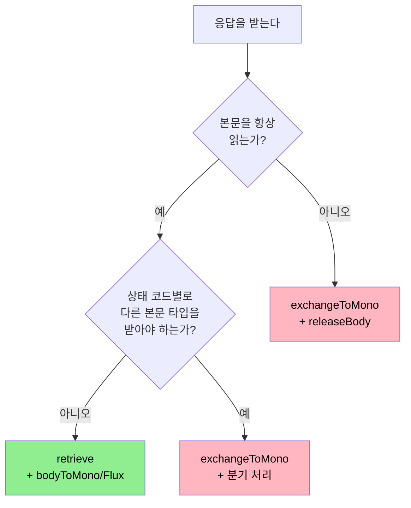

# 응답 처리 (retrieve와 exchangeToMono)

---

> WebClient가 응답을 다루는 두 진입점은 `retrieve()`와 `exchangeToMono(...)`다. 둘은 동작이 다르고 책임이 다르다. 본 챕터는 어느 쪽을 언제 골라야 하는지, 잘못 고르면 무엇이 새는지를 풀이한다.


## 두 진입점의 차이

> 한 줄로 줄이면 "retrieve는 안전한 기본값, exchangeToMono는 본문 라이프사이클까지 직접 책임지는 저수준 진입점"이다.

`retrieve()`는 다음과 같이 동작한다.

1. 응답 헤더를 받는다.
2. 상태 코드가 4xx/5xx면 자동으로 `WebClientResponseException`을 던진다(`onStatus`로 가로챌 수 있음).
3. 본문을 디코딩해 `Mono<T>` 또는 `Flux<T>`로 반환한다.
4. 본문 디코딩이 끝나면 응답 리소스가 자동 해제된다.

`exchangeToMono(Function<ClientResponse, Mono<T>>)`는 다음을 직접 한다.

1. 응답 헤더를 받는다.
2. 상태 코드 검사·본문 디코딩·리소스 해제를 모두 호출자가 결정한다.
3. 본문을 읽지 않으면 `releaseBody()`를 호출해 명시적으로 해제해야 한다.

기본 선택은 `retrieve()`다. 이유는 단순하다. 일반적인 호출은 본문을 끝까지 읽고 디코딩하는 흐름이며, 그 책임을 `retrieve()`가 자동으로 처리해 준다.

```java
// 가장 흔한 형태 — retrieve
Mono<User> userMono = client.get()
        .uri("/users/{id}", 42L)
        .retrieve()
        .bodyToMono(User.class);
```

`exchangeToMono`는 다음 두 경우에만 고른다.

1. 응답 헤더에 따라 본문을 다르게 디코딩한다(예: `Content-Type`을 보고 JSON/XML 분기).
2. 응답 헤더만 보고 본문을 읽지 않는다(예: `HEAD` 호출, 또는 304 Not Modified를 본문 없이 처리).


## `retrieve()`의 사용 패턴

> 실무 호출의 80% 이상은 이 형태로 끝난다. 변형 4가지를 정리한다.

### 1) 단일 객체 — `bodyToMono(Class)`

```java
Mono<User> user = client.get()
        .uri("/users/{id}", 42L)
        .retrieve()
        .bodyToMono(User.class);
```

`User`로 디코딩 가능한 응답이면 그대로 매핑된다. JSON Jackson 기본 코덱이 동작한다.

### 2) 제네릭 파라미터 타입 — `ParameterizedTypeReference`

`List<User>`나 `Map<String, User>` 같은 제네릭 타입은 `Class`로 표현 못 한다. Java 타입 소거 때문에 런타임에 제네릭 정보가 사라지기 때문이다.

```java
Mono<List<User>> users = client.get()
        .uri("/users")
        .retrieve()
        .bodyToMono(new ParameterizedTypeReference<List<User>>() {});
```

`ParameterizedTypeReference`는 익명 서브클래스 트릭으로 제네릭 정보를 보존한다. 자주 쓰는 형태이므로 패턴을 외워 둔다.

### 3) 컬렉션을 스트림으로 — `bodyToFlux(Class)`

응답이 JSON 배열이고 그 요소를 하나씩 처리하고 싶다면 `bodyToFlux`로 받는다.

```java
Flux<User> users = client.get()
        .uri("/users")
        .retrieve()
        .bodyToFlux(User.class);

users.subscribe(user -> log.info("user={}", user));
```

`bodyToMono(List.class)`와 `bodyToFlux(User.class)`의 차이는 동작 시점이다. `bodyToMono(List)`는 배열 전체를 한 번에 메모리에 올려 `List`로 만든 뒤 한 번 방출한다. `bodyToFlux`는 요소가 디코딩되는 대로 하나씩 방출한다. 응답이 거대하다면 `Flux` 쪽이 메모리 효율이 좋다.

### 4) 헤더·상태 코드까지 받기 — `toEntity` / `toEntityList` / `toBodilessEntity`

본문뿐 아니라 응답 헤더와 상태 코드도 같이 보고 싶다면 `ResponseEntity`로 받는다.

```java
Mono<ResponseEntity<User>> entity = client.get()
        .uri("/users/{id}", 42L)
        .retrieve()
        .toEntity(User.class);

entity.subscribe(e -> {
    HttpStatusCode status = e.getStatusCode();
    HttpHeaders headers = e.getHeaders();
    User body = e.getBody();
});
```

본문이 없는 호출(`PUT`, `DELETE` 등)은 `toBodilessEntity()`를 쓴다. 본문 디코딩 단계를 건너뛰지만 응답 코드와 헤더는 받는다.


## TPS 어댑터의 `retrieve` 사용

> 어댑터는 가장 단순한 형태로 응답을 받는다.

```java
// ApprovalUrlAdapter.java:175
TpsResponse<?> response = request.retrieve().bodyToMono(TpsResponse.class).block();
```

세 가지가 한 줄에 묶여 있다.

1. `retrieve()` — 4xx/5xx면 자동으로 `WebClientResponseException` 발생.
2. `bodyToMono(TpsResponse.class)` — 응답 본문을 `TpsResponse`로 디코딩.
3. `.block()` — Reactor 파이프라인을 동기로 변환해 결과를 즉시 받음. 동기 결정의 의미는 02-02에서 다룸.

`exchangeToMono`를 고르지 않은 이유는 단순하다. 응답 헤더에 따라 본문을 다르게 처리할 필요가 없고, 본문을 항상 끝까지 읽기 때문이다. `retrieve()`가 자동으로 해 주는 리소스 해제·상태 코드 변환을 직접 짤 동기가 없다.

⚠️ 한 가지 흥미로운 점은 `TpsResponse`의 응답 코드 `rsltCd`가 `"TPS200"`일 때만 성공으로 본다는 점이다(어댑터 line 184~190). 이 검증은 HTTP 200 OK가 떨어진 뒤에도 비즈니스 레벨로 실패를 알리는 API 패턴이다. `onStatus`는 HTTP 코드만 보므로 이 케이스는 본문을 파싱한 후 직접 검증해야 한다. 01-05 에러 처리 챕터에서 깊이 다룬다.


## `exchangeToMono`의 사용 패턴

> 응답 헤더에 따라 본문 처리를 분기해야 할 때 쓴다. 잘못 쓰면 본문이 새므로 책임이 무겁다.

```java
Mono<User> userMono = client.get()
        .uri("/users/{id}", 42L)
        .exchangeToMono(response -> {
            if (response.statusCode().is2xxSuccessful()) {
                return response.bodyToMono(User.class);
            }
            if (response.statusCode().value() == 404) {
                return response.releaseBody().then(Mono.empty());
            }
            return response.createException().flatMap(Mono::error);
        });
```

위 형태가 중요한 두 가지를 보여 준다.

### 1) 본문을 읽지 않을 때 `releaseBody()` 책임

응답 본문은 Netty 버퍼에서 청크 단위로 들어온다. `bodyToMono`/`bodyToFlux`/`toEntity` 중 하나를 호출하면 디코딩과 함께 자동으로 해제된다. `exchangeToMono` 안에서 본문을 읽지 않고 그냥 분기를 끝내면 버퍼가 메모리에 남아 leak이 된다.

`response.releaseBody().then(Mono.empty())` 형태로 명시적으로 해제한다. 잊으면 `LEAK: ByteBuf` 경고가 로그에 뜨고 메모리 사용량이 점진적으로 늘어난다.

### 2) `createException()`로 표준 예외 흐름 따라가기

상태 코드가 에러일 때 `WebClientResponseException`을 직접 만들고 싶다면 `createException()`을 쓴다. `retrieve()`가 자동으로 하는 일을 수동으로 따라가는 것이다.

`exchangeToMono`를 잘못 쓰면 다음과 같이 본문이 샌다.

```java
// ❌ 본문이 새는 안티패턴
client.get().uri("/users/{id}", 42L)
        .exchangeToMono(response -> {
            if (response.statusCode().is2xxSuccessful()) {
                return response.bodyToMono(User.class);
            }
            return Mono.empty();   // 본문 해제 없음 → leak
        });
```

`releaseBody()`를 호출하지 않았으므로 비-2xx 응답이 올 때마다 Netty 버퍼가 누적된다. 운영 환경에서 며칠 후 OOM이 떨어진다.


## 결정 트리 — `retrieve` vs `exchangeToMono`

> 한 페이지 결정 가이드.



> 다이어그램 풀이: 본문을 항상 끝까지 읽고 단일 타입으로 디코딩하면 `retrieve`. 본문을 안 읽거나 상태 코드별로 다른 타입을 받아야 하면 `exchangeToMono`. 후자는 `releaseBody` 책임이 따라온다.

판단 기준을 표로 정리한다.

| 상황 | 권장 |
|------|------|
| 일반적인 GET/POST 응답 처리 | `retrieve` |
| 4xx/5xx를 `onStatus`로 변환 | `retrieve` + `onStatus` |
| `Content-Type` 헤더로 본문 타입 분기 | `exchangeToMono` |
| `HEAD` 호출, 본문 없음 | `exchangeToMono` + `releaseBody` |
| 304 Not Modified 분기 처리 | `exchangeToMono` + `releaseBody` |
| 거대한 응답을 청크 단위로 처리 | `retrieve` + `bodyToFlux(DataBuffer)` |


## `bodyToMono`와 `bodyToFlux`의 메모리 동작

> 같은 응답을 두 메서드로 받으면 메모리 사용 패턴이 다르다.

응답이 1MB JSON 배열이고 요소가 1000개라고 하자.

```java
// 한 번에 메모리에 올림 (List 1MB)
Mono<List<User>> all = client.get().uri("/users").retrieve()
        .bodyToMono(new ParameterizedTypeReference<List<User>>() {});

// 요소 단위로 처리 (peak 메모리 1KB 정도)
Flux<User> stream = client.get().uri("/users").retrieve()
        .bodyToFlux(User.class);
```

`bodyToMono(List)`는 응답 본문 전체를 메모리에 올린 뒤 한 번에 디코딩한다. `maxInMemorySize` 한도에 부딪히기 쉽다. 응답이 작은 경우(<1MB) 별 차이가 없다.

`bodyToFlux(User.class)`는 응답 청크가 도착하는 대로 디코딩하면서 하나씩 방출한다. peak 메모리는 한 요소 크기 + 디코더 버퍼 정도다. 거대한 응답에서 의미가 크다.

다만 `Flux`로 받았다고 호출 코드에서도 스트림 처리를 해야 효과가 있다. `flux.collectList().block()` 같이 다시 List로 모으면 같은 메모리 비용이 들어간다.


## `block()`은 어디서 호출하는가

> 동기 결과가 필요할 때 `block()`을 쓰지만 어디서 호출하느냐가 중요하다.

`Mono`/`Flux`는 구독 시점까지 IO가 일어나지 않는다. `.subscribe()`는 비동기 콜백을 등록하고 즉시 반환하지만, `.block()`은 결과가 도착할 때까지 호출 스레드를 블로킹한다.

```java
// 일반 MVC 컨트롤러나 @Service에서는 OK
User user = client.get().uri("/users/{id}", 42L).retrieve()
        .bodyToMono(User.class)
        .block();

// WebFlux 핸들러나 Reactor thread에서는 금지
public Mono<User> handler(ServerRequest req) {
    User user = client.get().uri("/users/{id}", 42L).retrieve()
            .bodyToMono(User.class)
            .block();          // ❌ 데드락 위험
    return Mono.just(user);
}
```

WebFlux 핸들러는 EventLoop 스레드에서 동작한다. 그 안에서 `.block()`을 호출하면 EventLoop가 자기 자신의 응답을 기다리며 멈추고, 데드락이 발생한다. Reactor는 이 케이스를 자동 감지해 `BlockHangMonitor`로 경고를 띄우거나 예외를 던진다.

TPS 어댑터는 일반 `@Component`(서비스 계층)에서 호출되므로 `.block()`이 안전하다. WebFlux 환경이 아니다. 02-02에서 깊이 다룬다.


## 함정 — 자주 만나는 두 가지

### 1. `bodyToMono(Void.class)`로 본문을 받지 않으려고 했는데 leak

`bodyToMono(Void.class)`는 본문을 디코딩하려 시도하므로 본문을 다 읽고 무시한다. 진짜로 본문을 안 받고 싶다면 `toBodilessEntity()`를 쓴다.

### 2. 응답 본문이 비어 있는데 `bodyToMono`로 받았더니 hang

빈 응답 본문(`Content-Length: 0`)을 `bodyToMono(User.class)`로 받으면 `Mono`가 비어 있는 상태로 끝난다. `block()` 호출 시 `null`을 받거나 `NoSuchElementException`이 떨어진다. 빈 응답을 명시적으로 처리하려면 `defaultIfEmpty(null)` 또는 `switchIfEmpty(Mono.error(...))`를 붙인다.


## 면접에서 받을 만한 질문

> 챕터 마무리 점검.

1. `retrieve`와 `exchangeToMono`는 언제 갈리는가?
   - 답 요지: 본문을 항상 끝까지 읽고 단일 타입으로 디코딩하면 `retrieve`. 응답 헤더로 본문 타입을 분기하거나 본문을 안 읽는 호출이면 `exchangeToMono`. 후자는 `releaseBody` 책임이 따라온다.
2. `exchangeToMono` 안에서 본문을 안 읽고 `Mono.empty()`로 끝내면 무엇이 일어나는가?
   - 답 요지: 응답 본문 버퍼가 해제되지 않아 메모리 누수가 누적된다. 명시적으로 `releaseBody()`를 호출해야 한다.
3. `bodyToMono(List<User>)`와 `bodyToFlux(User.class)`의 메모리 동작 차이는?
   - 답 요지: 전자는 응답 전체를 메모리에 올린 뒤 한 번에 디코딩, 후자는 청크가 도착하는 대로 요소 단위로 디코딩하고 방출. 거대한 응답에서 후자가 메모리 효율이 좋다.
4. `bodyToMono(Void.class)`와 `toBodilessEntity()`의 차이는?
   - 답 요지: 전자는 본문을 디코딩하려 시도(읽고 무시), 후자는 본문 디코딩 자체를 건너뜀. "본문이 정말 없을 때"는 후자.
5. `block()`이 데드락을 일으키는 경우는?
   - 답 요지: 호출 스레드가 EventLoop 스레드일 때. WebFlux 핸들러나 Reactor 연산자 콜백 안에서 `block()`을 호출하면 자기 자신의 IO를 기다리며 멈춘다.


## 관련 문서

- [README (MOC)](README.md) — 11편 학습 묶음 전체 지도
- [01-03. 요청 빌딩](01-03.요청%20빌딩%20(URI·헤더·본문).md) — 요청 단계 정리
- [01-05. 에러 처리와 재시도](01-05.에러%20처리와%20재시도.md) — 다음 챕터, `onStatus`와 `WebClientResponseException`
- [02-04. TPS ApprovalUrlAdapter 사례 분석](02-04.실무%20사례%20-%20TPS%20ApprovalUrlAdapter.md) — `.retrieve().bodyToMono(...).block()` 결정 풀이
