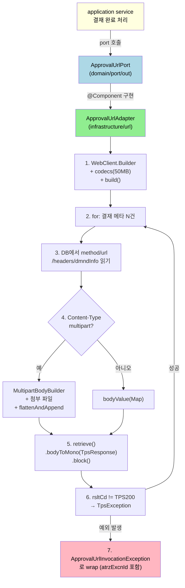

# 실무 사례 - TPS ApprovalUrlAdapter

---

> 본 챕터는 TPS `operator/ticket/approval` 모듈의 `ApprovalUrlAdapter` 한 클래스를 출발점으로 잡고, 앞서 다룬 7개 영역(Hexagonal port, codecs, 요청 빌딩, 응답 처리, 에러 처리, 필터, multipart, 동기 결정)이 한 클래스에서 어떻게 엮이는지를 풀어 본다. 각 절은 해당 학습 챕터로 deep link를 단다.


## 도메인 컨텍스트

> 어떤 비즈니스 흐름이 이 어댑터를 부르는지부터 안다.

TPS는 결재(approval) 도메인을 다룬다. 사용자가 결재 신청을 올리면 결재선의 사용자들이 차례로 승인하고, 마지막 결재자가 승인하면 결재가 완료된다. 결재 완료 시 사전에 등록된 외부 API들이 호출되어야 하는 비즈니스 요구가 있다. 예를 들어 휴가 결재가 완료되면 인사 시스템에 휴가 일정을 등록하고, 비용 결재가 완료되면 회계 시스템에 전표가 자동 생성된다.

문제는 결재 종류마다 부를 외부 API가 다르고, 한 결재가 여러 API를 부를 수도 있다는 점이다. 결재선 정의에 외부 API 메타(메서드·URL·헤더·본문 템플릿·첨부 파일 그룹)가 들어 있고, 결재 완료 시점에 그 메타를 읽어 동적으로 HTTP 호출을 조립한다.

`ApprovalUrlAdapter`가 그 조립을 책임진다.


## 1. Hexagonal port-out 배치

> WebClient를 인프라 어댑터로 격리한 구조 결정.

도메인 계층은 `ApprovalUrlPort` 인터페이스로 외부 호출을 추상화한다.

```java
// ApprovalUrlPort.java
public interface ApprovalUrlPort {
    void invokeForApprovalEnd(ApprovalEndDto aprvEndDto);
}
```

인프라 계층의 어댑터가 그 인터페이스를 구현한다.

```java
// ApprovalUrlAdapter.java:42-44
@Slf4j
@Component
@RequiredArgsConstructor
public class ApprovalUrlAdapter implements ApprovalUrlPort {
    // ...
}
```

이 분리가 가져오는 효과는 두 가지다.

1. **도메인이 WebClient를 모른다**. 결재 도메인 모델·서비스는 "외부 API 호출이 실패할 수 있다"는 사실만 알고, 그 호출이 WebClient인지 RestClient인지 RestTemplate인지 알지 못한다. 인프라 결정을 바꿔도 도메인 계층은 그대로다.
2. **테스트가 가능해진다**. 도메인 서비스 단위 테스트에서 `ApprovalUrlPort`를 mock으로 주입하면 외부 호출 없이 결재 완료 흐름을 검증할 수 있다.

이 패턴은 Hexagonal Architecture의 outbound port다. 외부 시스템과의 경계가 인터페이스 한 줄로 표현된다.

[01-02 빌드 챕터](01-02.WebClient%20빌드와%20인프라%20설정.md#webclientbuilder를-빈으로-둘-것인가-완성된-webclient를-빈으로-둘-것인가)에서 다룬 빌더 주입 패턴은 이 아키텍처의 자연스러운 결과다.


## 2. `WebClient.Builder` 주입과 호출 시점 빌드

> 빌드된 WebClient를 빈으로 두지 않고 빌더만 받아 호출 시점에 빌드한다.

```java
// ApprovalUrlAdapter.java:47, 72-73
private final WebClient.Builder webClientBuilder;
// ...
WebClient webClient = webClientBuilder.codecs(configurer -> configurer.defaultCodecs()
        .maxInMemorySize(50 * 1024 * 1024)).build();
```

호출이 들어올 때마다 50MB 메모리 한도가 박힌 WebClient를 새로 빌드한다. 이 결정의 근거를 추정하면 다음과 같다.

- 외부 API 호출이 첨부 파일을 본문에 담아 보낼 수 있어 응답도 클 가능성이 있다(첨부 영수증을 인사 시스템에 올리는 경우 등). 256KB 기본 한도로는 부족.
- 호출별로 서로 다른 메모리 한도가 필요할 가능성을 열어 둠. 다만 실제 코드에서는 50MB 고정이므로 이 가능성이 활용되지는 않음.

[01-02 챕터](01-02.WebClient%20빌드와%20인프라%20설정.md#exchangestrategies와-코덱-메모리-한도)에서 보았듯, 호출마다 빌드하는 비용은 작지 않다. 한 번 빌드한 WebClient를 필드로 캐시하거나 빈으로 옮기는 편이 자연스럽다.

```java
// 개선 후보
@Configuration
class ApprovalApiConfig {
    @Bean
    WebClient approvalWebClient(WebClient.Builder builder) {
        return builder.codecs(c -> c.defaultCodecs().maxInMemorySize(50 * 1024 * 1024)).build();
    }
}
```

호출당 빌드 비용을 한 번으로 줄인다. 50MB 한도가 사실상 모든 호출에 같이 적용되므로 캐시해도 행동이 변하지 않는다.


## 3. DB 메타로 동적 HTTP 호출 조립

> 외부 API 정보가 코드가 아니라 데이터에 있다. 메서드·URL·헤더·본문이 모두 DB에서 들어온다.

`ApprovalPrgrsInfoDtlDto`가 한 호출 단위 메타다. 결재 완료 시 해당 결재 ID로 묶인 모든 메타를 읽어 차례로 호출한다.

```java
// ApprovalUrlAdapter.java:67-95 (요지)
List<ApprovalPrgrsInfoDtlDto> aprvPrgrsInfoDtlDtoList = aprvExcnRepository
        .selectAprvPrgrsInfoDtlList(aprvEndDto.atrzExcnId());

for (ApprovalPrgrsInfoDtlDto item : aprvPrgrsInfoDtlDtoList) {
    HttpMethod httpMethod = HttpMethod.valueOf(item.httpMethod().toUpperCase());

    JsonNode rootNode = om.readTree(item.httpHder());
    Map<String, String> headerMap = new HashMap<>();
    headerMap.put("lastAprvUserId", aprvEndDto.rgtrId());

    JsonNode commonNode = rootNode.get("common");
    if (commonNode != null && commonNode.isObject()) {
        commonNode.fields()
                .forEachRemaining(entry -> headerMap.put(entry.getKey(), entry.getValue().asText()));
    }

    rootNode.fields().forEachRemaining(entry -> {
        if (!entry.getKey().equalsIgnoreCase("common")
                && !List.of("get", "post", "put", "delete", "patch", "head", "options", "trace")
                .contains(entry.getKey().toLowerCase())) {
            headerMap.put(entry.getKey(), entry.getValue().asText());
        }
    });
    // ...
}
```

세 단계가 보인다.

1. **메서드 동적 결정** — `HttpMethod.valueOf(item.httpMethod().toUpperCase())`. [01-03 요청 빌딩 챕터](01-03.요청%20빌딩%20(URI·헤더·본문).md#메서드-선택--get-post--vs-method)의 `method(HttpMethod)` 패턴이 정확히 이 자리에서 쓰인다.
2. **헤더 합성** — `httpHder` 컬럼이 JSON 문자열이다. `common` 노드 아래 모든 키-값을 헤더로, 메서드 키(`get`/`post`/...)는 제외하고 그 외 최상위 키도 헤더로 추가. `lastAprvUserId`는 코드에서 직접 박는다(마지막 결재자 ID).
3. **헤더 적용** — `headers(Consumer)` 형태로 일괄 추가. `Content-Type`만 제외(아래 절에서 풀이).

이 형태의 정당성은 외부 API가 운영 중에 추가·변경된다는 점이다. 코드 배포 없이 새 외부 API를 결재선 정의에 추가하려면 메타가 데이터에 있어야 한다.

함정도 분명하다.

- **헤더 키 충돌**. JSON에서 같은 키가 여러 번 나오면 마지막 값으로 덮어쓰기. `common`과 최상위에 같은 키가 있으면 최상위가 이긴다.
- **메서드 키 제외 로직의 의도가 불명확**. `httpHder` JSON 안에 `get`/`post`/... 같은 노드가 헤더가 아닌 다른 의미로 쓰일 수 있어 그것을 헤더로 잘못 추가하지 않으려는 보호 장치로 보이지만, 그 노드의 실제 용도는 데이터 스키마를 읽어야 알 수 있다.


## 4. multipart 자동 감지와 평탄화

> `Content-Type`을 보고 multipart인지 JSON인지 분기한다. multipart면 첨부 파일과 nested 본문을 평탄화해 폼 필드로 보낸다.

```java
// ApprovalUrlAdapter.java:96-101
boolean isMultipart = headerMap.entrySet()
        .stream()
        .anyMatch(e -> "content-type".equalsIgnoreCase(e.getKey()) && e.getValue()
                .toLowerCase()
                .contains("multipart/form-data"));
```

DB에서 읽은 헤더 중 `Content-Type`이 `multipart/form-data`를 포함하면 multipart 분기로 들어간다. 그렇지 않으면 JSON 분기.

### `Content-Type` 헤더를 일반 헤더로 추가하지 않는 이유

```java
// ApprovalUrlAdapter.java:104-108
.headers(headers -> headerMap.forEach((key, value) -> {
    if (!"content-type".equalsIgnoreCase(key)) {
        headers.add(key, value);
    }
}));
```

`Content-Type`이 일반 헤더 추가에서 제외되는 이유는 multipart의 경우 boundary 토큰을 WebClient가 자동 생성해 박아야 하기 때문이다. 호출자가 직접 박은 `Content-Type: multipart/form-data` 헤더는 boundary가 없어 서버가 본문을 파싱하지 못한다. [02-01 multipart 챕터](02-01.Multipart와%20파일%20업·다운로드.md#가장-단순한-형태--파일-한-개)에서 다룬 함정이다.

JSON 분기에서도 `Content-Type`을 명시적으로 박지 않는다. `bodyValue(map)`이 자동으로 `application/json`을 박는다. 다만 외부 API가 다른 Content-Type을 요구한다면(`application/vnd.api+json` 등) 이 부분에서 문제가 생길 여지가 있다.

### 첨부 파일 처리

```java
// ApprovalUrlAdapter.java:113-138 (요지)
List<AttachmentFileMetadata> attachmentFiles = attachmentFileQueryPort
        .findByGroupSn(item.atchFileGroupNo());
MultipartBodyBuilder builder = new MultipartBodyBuilder();

for (AttachmentFileMetadata file : attachmentFiles) {
    FileDownloadResponse fileResponse = attachmentFileReader.download(...);
    byte[] data = fileResponse.getAtchFileBytes();

    if (data == null || data.length == 0) {
        log.warn("파일 무시됨 (비어 있음): {}", file.getAtchFileNm());
        continue;
    }

    String fileName = file.getAtchFileNm();
    MediaType mediaType = determineMediaType(fileName);

    ByteArrayResource resource = new ByteArrayResource(data) {
        @Override
        public String getFilename() {
            return fileName;
        }
    };

    builder.part("files", resource).contentType(mediaType).filename(fileName);
}
```

외부 객체 저장소(또는 DB)에서 첨부 파일을 받아 `MultipartBodyBuilder`에 추가한다. 모든 파일이 같은 이름(`files`)으로 등록되어 다중 파일 업로드 형태가 된다.

`ByteArrayResource`를 익명 서브클래스로 감싸 `getFilename()`을 override하는 패턴이 등장한다. [02-01 multipart 챕터](02-01.Multipart와%20파일%20업·다운로드.md#메모리-안에-있는-바이트-배열을-보내는-패턴)에서 다룬 그대로다. 추가로 `builder.part(...).filename(fileName)`도 같이 호출해 두 군데에서 파일명이 박힌다.

### 본문 평탄화

```java
// ApprovalUrlAdapter.java:140-156
if (item.dmndInfo() != null) {
    Map<String, Object> dmndInfoMap = om.readValue(item.dmndInfo(), new TypeReference<>() {});
    dmndInfoMap.forEach((key, value) -> {
        if (value == null) {
            // null인 경우 Part를 추가하지 않음
        } else if (value instanceof Collection && ((Collection<?>) value).isEmpty()) {
            builder.part(key, "[]");
        } else if (value instanceof Map && ((Map<?, ?>) value).isEmpty()) {
            builder.part(key, "{}");
        } else if (value.getClass().isArray() && Array.getLength(value) == 0) {
            builder.part(key, "[]");
        } else {
            flattenAndAppend(builder, key, value);
        }
    });
}
```

`dmndInfo`(요청 정보)도 JSON 문자열이다. Map으로 파싱한 뒤 nested 구조를 dot/bracket 표기 폼 필드로 평탄화. `flattenAndAppend` 재귀는 [02-01 챕터](02-01.Multipart와%20파일%20업·다운로드.md#폼-필드-평탄화--tps의-flattenandappend)에서 풀이한 그대로다.

이 평탄화 패턴이 정당화되는 경우는 외부 API가 폼 필드를 요구할 때다. 새 API라면 메타 파트를 JSON으로 한 번에 보내는 편이 단순.


## 5. 응답 처리와 예외 wrap

> `.retrieve().bodyToMono(...).block()` + 응답 코드 검증 + 도메인 예외 wrap.

```java
// ApprovalUrlAdapter.java:175-190
TpsResponse<?> response = request.retrieve().bodyToMono(TpsResponse.class).block();

if (response == null) {
    log.error("[ApprovalUrlAdapter] API call to {} returned null response.", item.apiUrl());
    throw new TpsException(ErrorCodeGeneral.INTERNAL_ERROR, "[Approval End] API 응답이 null입니다.",
            "Downstream API call returned null.");
}
log.info("[ApprovalUrlAdapter] Response Body: {}", response);

String rsltCd = response.getRsltCd();
if (!"TPS200".equals(rsltCd)) {
    String rsltMsg = response.getRsltMsg();
    log.error("[ApprovalUrlAdapter] API call to {} failed. rsltCd: {}, rsltMsg: {}",
            item.apiUrl(), rsltCd, rsltMsg);
    throw new TpsException(ErrorCodeGeneral.INTERNAL_ERROR, rsltMsg, "[Approval End] API 요청 실패");
}
```

세 단계의 검증이다.

1. **`retrieve` + `bodyToMono` + `block`** — HTTP 4xx/5xx면 자동 `WebClientResponseException`. [01-04 챕터](01-04.응답%20처리%20(retrieve와%20exchangeToMono).md)의 표준 패턴.
2. **`null` 검증** — 빈 응답 본문 처리. [01-04 챕터의 함정](01-04.응답%20처리%20(retrieve와%20exchangeToMono).md#함정--자주-만나는-두-가지)에서 다룬 그대로.
3. **`rsltCd` 비즈니스 검증** — HTTP 200이지만 본문 안에 실패 코드가 박히는 API 패턴. [01-05 챕터](01-05.에러%20처리와%20재시도.md#tps-어댑터의-에러-처리--200-ok-안의-비즈니스-실패)에서 풀이.

외층에서 도메인 예외로 통일한다.

```java
// ApprovalUrlAdapter.java:54-65
public void invokeForApprovalEnd(ApprovalEndDto aprvEndDto) {
    try {
        invokeInternal(aprvEndDto);
    } catch (ApprovalUrlInvocationException e) {
        throw e;
    } catch (Exception e) {
        throw new ApprovalUrlInvocationException(
                aprvEndDto.atrzExcnId(),
                "결재 완료 후 외부 API 호출 실패: " + e.getMessage(),
                e);
    }
}
```

`Exception` 전부를 `ApprovalUrlInvocationException`으로 감싸 application service에 전달. 도메인 키(`atrzExcnId`)를 같이 박아 어느 결재 건이 실패했는지 추적 가능하게 한다.

`ApprovalUrlInvocationException`은 `TpsException`을 상속하는 도메인 예외다.

```java
// ApprovalUrlInvocationException.java
public class ApprovalUrlInvocationException extends TpsException {
    private final String atrzExcnId;

    public ApprovalUrlInvocationException(String atrzExcnId, String detailMsg, Throwable cause) {
        super(ErrorCodeApproval.APRV_URL_INVOKE_FAIL,
                ErrorCodeApproval.APRV_URL_INVOKE_FAIL.getRsltMsg(), detailMsg);
        initCause(cause);
        this.atrzExcnId = atrzExcnId;
    }
}
```

이 패턴은 [01-05 챕터의 도메인 예외 wrap](01-05.에러%20처리와%20재시도.md#tps-어댑터의-에러-처리--200-ok-안의-비즈니스-실패) 권장 형태에 정확히 부합한다.


## 6. 동기 호출과 for 루프 — 정당성과 개선 후보

> 가장 논쟁이 될 만한 결정. `.block()`을 매 호출마다 부르고 for 루프로 직렬 실행한다.

[02-02 동기 결정 챕터](02-02.동기·비동기%20결정%20(block%20안티패턴).md#tps-어댑터--동기-결정-분석)에서 결정 트리를 따라 정당성을 검토했다. 요약하면 다음과 같다.

- `@Component` 일반 서비스 계층에서 호출되므로 `.block()` 데드락 위험 없음.
- 결재 완료 후 한두 건의 외부 API 호출이라면 응답시간 누적이 문제 안 됨.
- 호출 간 의존성(앞 호출 결과를 본 뒤 다음 호출 진행 여부 결정)이 있다면 직렬 실행이 자연스러움.

개선 후보가 세 가지다. 우선순위 순으로 정리한다.

### A. RestClient로 마이그레이션 (Spring 6.1+)

호출이 동기·직렬이라면 RestClient가 자연스럽다. 코드 변경량은 작다.

```java
// 가상의 RestClient 버전
@Component
@RequiredArgsConstructor
public class ApprovalUrlAdapter implements ApprovalUrlPort {

    private final RestClient restClient;   // 빈으로 한 번 빌드된 클라이언트
    private final TrbServicesProperties trbServicesProperties;
    private final ObjectMapper om;
    // ... 나머지 의존성

    private void invokeInternal(ApprovalEndDto aprvEndDto) throws Exception {
        for (ApprovalPrgrsInfoDtlDto item : aprvPrgrsInfoDtlDtoList) {
            HttpMethod httpMethod = HttpMethod.valueOf(item.httpMethod().toUpperCase());
            // 헤더·본문 조립은 동일

            TpsResponse<?> response = restClient.method(httpMethod)
                    .uri(trbServicesProperties.resolveUrlByRequestPath(item.apiUrl()))
                    .headers(h -> headerMap.forEach((k, v) -> {
                        if (!"content-type".equalsIgnoreCase(k)) h.add(k, v);
                    }))
                    .body(buildBody(item, isMultipart))
                    .retrieve()
                    .body(TpsResponse.class);
            // 응답 검증 동일
        }
    }
}
```

차이는 다음 셋이다.

1. `.block()` 사라짐. Reactor 파이프라인 없으니 스택트레이스가 깨끗해짐.
2. `WebClient.Builder` 호출 시점 빌드가 사라짐. RestClient 인스턴스를 빈으로 한 번 만들어 재사용.
3. 학습 비용 감소. Reactor를 모르는 신규 인원이 코드를 읽기 쉬워짐.

multipart 처리는 동일한 `MultipartBodyBuilder`로 옮겨 간다. RestClient도 같은 헬퍼를 쓴다.

### B. ExchangeFilterFunction으로 로깅·인증 일원화

현재 로깅은 호출 코드 안에 직접 박혀 있다.

```java
// ApprovalUrlAdapter.java:170-173
log.info("[ApprovalUrlAdapter] Request URL: {}", item.apiUrl());
log.info("[ApprovalUrlAdapter] Request Headers: {}", headerMap);
log.info("[ApprovalUrlAdapter] Request Method: {}", item.httpMethod());
log.info("[ApprovalUrlAdapter] Request Body: {}", item.dmndInfo());
```

`ExchangeFilterFunction`으로 옮길 만하다. [01-06 챕터](01-06.ExchangeFilterFunction.md#tps-어댑터--필터-미사용-비교)에서 트레이드오프를 분석했다. 호출자가 늘어날 때 의미가 커진다.

향후 OAuth2 토큰 자동 첨부가 필요해진다면 `ServletOAuth2AuthorizedClientExchangeFilterFunction` 도입이 자연스럽다.

### C. 호출이 늘어날 때 병렬화

한 결재에 연결된 외부 API 호출이 5건 이상이고 각각 100ms 이상이면 응답시간 누적이 문제다. WebClient의 강점이 여기서 살아난다.

```java
List<Mono<TpsResponse<?>>> calls = aprvPrgrsInfoDtlDtoList.stream()
        .map(item -> buildRequestMono(item))
        .toList();

Flux.merge(calls)   // 동시 실행
        .doOnNext(response -> validateResponse(response))
        .blockLast();
```

순서가 의미 있다면 `Flux.concat`. 동시성 상한이 필요하면 `Flux.fromIterable(...).flatMap(call, concurrency)`.

다만 호출이 직렬로 의존하는 경우(앞 호출 실패 시 뒤 호출 중단) 병렬화 가치가 작다. TPS 어댑터의 현재 구조는 한 호출 실패 시 예외를 던지고 for 루프를 빠져나간다. 이 의미를 보존하려면 `concatMap` 또는 `concatMapDelayError`로 옮긴다.

### D. 재시도 추가

[01-05 챕터의 `Retry.backoff`](01-05.에러%20처리와%20재시도.md#재시도--retrybackoff) 패턴을 끼워 일시적 실패에 자동 복구를 거는 것이 가능하다. 다만 외부 API가 멱등성을 보장하는지가 선결 조건. POST 호출이 결재 완료의 부수 효과(전표 생성 등)를 만든다면 재시도가 두 번 적용될 위험.

대신 결재 완료 흐름 전체를 재시도하는 형태(상위 비즈니스 로직에서 retry)가 안전. 어댑터 자체에서 재시도를 거는 결정은 도메인 책임자와 협의 필요.


## 종합 — 한 페이지 요약

> 7개 영역이 한 클래스에서 어떻게 엮였는지를 도식으로 정리한다.



> 다이어그램 풀이: 도메인은 `ApprovalUrlPort` 인터페이스만 본다. 어댑터가 WebClient를 빌드하고, DB 메타로 호출을 조립하고, multipart/JSON 분기를 처리한 뒤, `.block()`으로 동기 응답을 받아 검증한다. 모든 인프라 예외는 `ApprovalUrlInvocationException`으로 wrap되어 도메인 키와 함께 도메인에 전달된다.

각 단계가 학습 묶음의 어느 챕터와 연결되는지를 표로 정리한다.

| 단계 | 학습 챕터 |
|------|----------|
| 1. Builder 주입 + 호출 시점 빌드 | [01-02. 빌드와 인프라 설정](01-02.WebClient%20빌드와%20인프라%20설정.md) |
| 2. for 루프 + 동기 호출 | [02-02. 동기·비동기 결정](02-02.동기·비동기%20결정%20(block%20안티패턴).md) |
| 3. 동적 메서드 + 헤더 조립 | [01-03. 요청 빌딩](01-03.요청%20빌딩%20(URI·헤더·본문).md) |
| 4. multipart 분기 + 평탄화 | [02-01. Multipart와 파일 업·다운로드](02-01.Multipart와%20파일%20업·다운로드.md) |
| 5. retrieve + bodyToMono + block | [01-04. 응답 처리](01-04.응답%20처리%20(retrieve와%20exchangeToMono).md) |
| 6. rsltCd 비즈니스 검증 | [01-05. 에러 처리와 재시도](01-05.에러%20처리와%20재시도.md) |
| 7. 도메인 예외 wrap | [01-05. 에러 처리와 재시도](01-05.에러%20처리와%20재시도.md) |
| 로깅 (직접) vs 필터 옮길 후보 | [01-06. ExchangeFilterFunction](01-06.ExchangeFilterFunction.md) |


## 무엇을 배웠는가

> 본 사례에서 가져갈 만한 패턴 3가지.

### 1. Hexagonal port-out으로 WebClient를 격리

도메인은 인터페이스 한 줄만 본다. 인프라 결정(WebClient/RestClient/RestTemplate)을 바꿔도 도메인 코드는 그대로다. 본 묶음 마지막 챕터에 사례를 둔 이유 중 하나가 이 구조의 가치다.

### 2. 200 OK 안의 비즈니스 실패를 도메인 예외로 wrap

WebClient의 자동 변환은 HTTP 코드만 본다. 응답 본문 안의 실패 코드는 호출 코드가 직접 검증해야 한다. 그 검증을 도메인 예외(`ApprovalUrlInvocationException`)로 통일하면 application service가 한 종류 예외만 처리하면 된다.

### 3. 동적 메타로 호출 조립할 때의 트레이드오프

코드 배포 없이 외부 API를 추가·변경할 수 있다는 유연성 vs. 메타 스키마 자체가 일종의 약속이고 그 약속을 코드와 데이터 양쪽에서 동기화해야 한다는 비용. TPS 어댑터는 전자가 더 큰 가치를 가진다고 결정한 사례다.


## 면접에서 받을 만한 질문

> 챕터 마무리 점검. 이 사례 분석으로 학습 묶음 전체를 한 번 더 점검한다.

1. `ApprovalUrlAdapter`는 왜 Hexagonal port-out 형태로 분리되어 있는가?
   - 답 요지: 도메인이 WebClient를 모르도록 격리. 인프라 결정 변경(RestClient 마이그레이션 등)이 도메인 코드를 건드리지 않음. 테스트에서 mock 주입 가능.
2. `WebClient.Builder`를 빈으로 받아 호출 시점에 `build()`하는 패턴은 정당한가?
   - 답 요지: 호출별로 다른 옵션이 필요할 때만. TPS 어댑터는 50MB 한도가 모든 호출에 같으므로 한 번 빌드해 캐시하는 편이 자연스러움.
3. `Content-Type` 헤더만 일반 헤더 추가에서 제외한 이유는?
   - 답 요지: multipart의 boundary 토큰을 WebClient가 자동 생성. 호출자가 직접 박은 `multipart/form-data` 헤더는 boundary가 없어 서버 파싱 실패.
4. 응답이 HTTP 200인데 `rsltCd`로 비즈니스 실패를 알리는 API는 어떻게 처리됐는가?
   - 답 요지: `bodyToMono`로 본문 받은 뒤 `rsltCd` 필드를 직접 비교해 `TPS200`이 아니면 `TpsException`을 던짐. 외층에서 `ApprovalUrlInvocationException`으로 wrap.
5. 이 어댑터를 RestClient로 마이그레이션하면 무엇이 좋아지는가?
   - 답 요지: `.block()` 사라짐(스택트레이스 단순화), `WebClient.Builder` 호출 시점 빌드 사라짐, Reactor 학습 비용 감소. 동작 자체는 동일.
6. `flattenAndAppend` 평탄화 패턴은 표준인가?
   - 답 요지: 표준 아님. dot/bracket 표기는 사내 약속. 새 API라면 메타를 JSON 파트로 한 번에 보내는 편이 모호함이 없음.


## 관련 문서

- [README (MOC)](README.md) — 11편 학습 묶음 전체 지도
- [01-02. WebClient 빌드와 인프라 설정](01-02.WebClient%20빌드와%20인프라%20설정.md) — Builder 호출 시점 빌드 패턴
- [01-05. 에러 처리와 재시도](01-05.에러%20처리와%20재시도.md) — 200 OK 안의 비즈니스 실패 처리
- [02-01. Multipart와 파일 업·다운로드](02-01.Multipart와%20파일%20업·다운로드.md) — `MultipartBodyBuilder` + 평탄화
- [02-02. 동기·비동기 결정](02-02.동기·비동기%20결정%20(block%20안티패턴).md) — `.block()`과 RestClient 마이그레이션 결정
