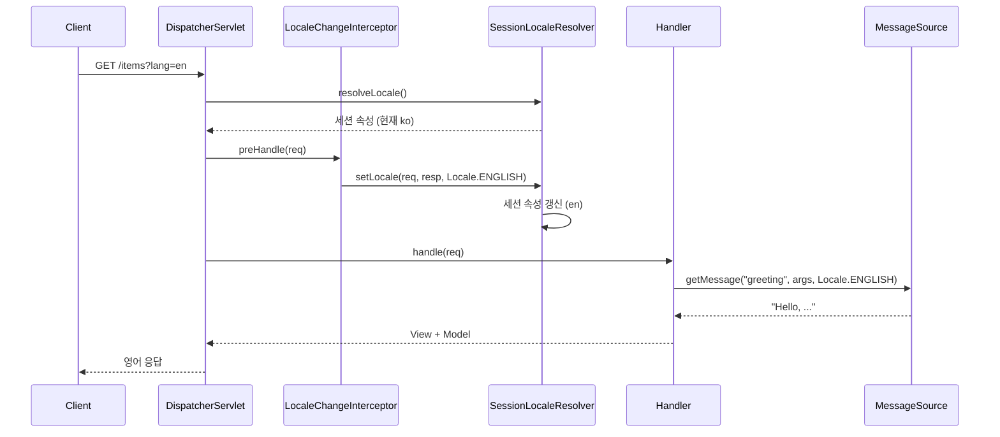
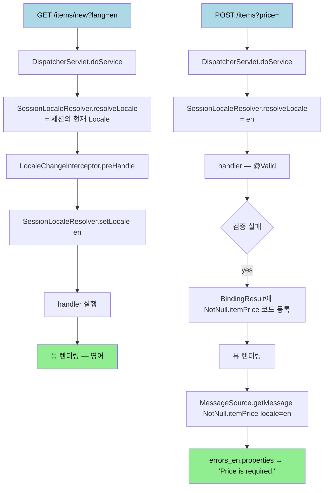

# 메시지·국제화 — MessageSource와 LocaleResolver
---

> 같은 응답을 한국어와 영어로 다르게 보여 주는 일은 두 가지 부품으로 분해됩니다. *어떤 텍스트를 쓸지* 고르는 `MessageSource` 와 *어떤 Locale 인지* 결정하는 `LocaleResolver`. 본 문서는 이 두 부품이 `DispatcherServlet` 흐름의 어디에 끼어들고, 어떻게 한 요청 안에서 협조하는지를 한 흐름으로 정리합니다.

## 진입 — 왜 메시지·국제화가 별도 주제인가

> `messages.properties` 한 파일에 한국어 메시지 몇 줄 적어 둔 것만으로 국제화를 다 안다고 착각하기 쉽습니다. 그러나 같은 메커니즘이 검증 오류 메시지·뷰 템플릿·예외 응답까지 한꺼번에 관통하고, 각 진입점이 *어떻게 Locale 을 결정하는가* 라는 작은 결정에 의존합니다.

검증 메시지 외부화는 [`02-01.Validation`](02-01.Validation%20—%20BindingResult에서%20Bean%20Validation까지.md) §9 에서 한 번 등장했습니다. 거기서는 "오류 메시지를 `errors.properties` 로 빼면 다국어 대응에 유리하다" 는 한 가지 효익만 강조했습니다. 그러나 다국어 대응이 *실제로 동작* 하려면 한 요청의 Locale 을 *누가·언제·어디서* 정하는가가 결정돼야 합니다. 그 결정의 주체가 `LocaleResolver` 이고, 그 결정을 바꿔 주는 도구가 `LocaleChangeInterceptor` 입니다.

본 편은 이 작은 결정들을 모아 한 그림을 그립니다. 사용자가 URL 쿼리에 `?lang=en` 을 붙였을 때 응답 메시지가 영어로 바뀌기까지의 흐름이 한 화면에서 보이는 것을 목표로 합니다.

## 1. 한 줄 정의

> Spring 의 국제화는 `MessageSource` 가 코드(`required.itemName`)와 Locale 을 받아 외부 파일에서 텍스트를 찾고, `LocaleResolver` 가 HTTP 요청마다 Locale 을 결정하며, `LocaleChangeInterceptor` 가 그 결정을 요청 단위로 덮어쓸 수 있게 해 주는 세 부품의 협업입니다.

한 문장에 세 부품(`MessageSource`, `LocaleResolver`, `LocaleChangeInterceptor`)이 모두 들어 있습니다. 본문은 이 한 문장을 §2 ~ §6 으로 풀어 갑니다.

## 2. MessageSource — 코드와 텍스트의 분리

> 메시지 외부화가 풀어 주는 가장 단순한 문제는 "메시지 텍스트가 자바 코드 안에 박혀 있어서 변경할 때마다 빌드해야 한다" 입니다. `MessageSource` 는 코드를 *키* 와 *Locale* 로 분리해 외부 properties 파일에서 찾게 만들어 줍니다.

### 2.1 인터페이스

`MessageSource` 의 핵심 메서드는 다음 한 개입니다.

```java
public interface MessageSource {
    String getMessage(String code, Object[] args, String defaultMessage, Locale locale);
    String getMessage(String code, Object[] args, Locale locale) throws NoSuchMessageException;
    String getMessage(MessageSourceResolvable resolvable, Locale locale);
}
```

세 인자가 한 번에 등장합니다.

- `code` 는 메시지 키입니다. `range.item.price` 같은 점 구분 식별자가 관례입니다.
- `args` 는 메시지 텍스트의 `{0}`, `{1}` 자리에 들어갈 값입니다. `new Object[]{1000, 1000000}` 으로 넘기면 `"가격은 1,000 ~ 1,000,000 까지 허용합니다."` 같은 텍스트가 나옵니다.
- `locale` 은 어느 언어 파일을 우선 볼지 결정합니다. `Locale.KOREAN` 이면 `messages_ko.properties` 를, `Locale.ENGLISH` 이면 `messages_en.properties` 를 먼저 봅니다.

### 2.2 Spring Boot 자동 구성

Spring Boot 환경에서는 `MessageSourceAutoConfiguration` 이 `messages.properties` 가 클래스패스에 있으면 자동으로 `MessageSource` 빈을 등록합니다. 설정 한 줄로 basename 을 바꿀 수 있습니다.

```yaml
spring:
  messages:
    basename: messages,errors
    encoding: UTF-8
    fallback-to-system-locale: false
    cache-duration: 10s
```

`basename: messages,errors` 는 두 개의 properties 시리즈를 합쳐서 본다는 뜻입니다. `messages_ko.properties`, `messages_en.properties`, `errors_ko.properties`, `errors_en.properties` 가 모두 같은 `MessageSource` 안에서 한 키 공간으로 합쳐집니다.

`fallback-to-system-locale: false` 는 운영 환경에서 자주 빠뜨리는 함정 방지용 설정입니다. 기본값이 `true` 라서, 한국어·영어 파일만 두고 일본어 요청이 들어왔을 때 *서버 OS 의 시스템 Locale* 로 폴백합니다. 운영 서버가 `en_US` 일 때 일본어 사용자가 영어 응답을 보는 흐름이 생깁니다. `false` 로 두면 시스템 Locale 을 건너뛰고 곧장 *기본 메시지* (`messages.properties` 의 한국어 또는 영어) 로 폴백합니다.

### 2.3 properties 파일 작성

`messages.properties` 와 언어별 변형이 한 키 공간을 공유합니다.

```properties
# messages.properties (fallback)
greeting=안녕하세요, {0}님
required.itemName=상품 이름은 필수입니다.
range.itemPrice=가격은 {0} ~ {1} 까지 허용합니다.

# messages_en.properties
greeting=Hello, {0}
required.itemName=Item name is required.
range.itemPrice=Price must be between {0} and {1}.
```

`getMessage("greeting", new Object[]{"홍길동"}, Locale.ENGLISH)` 는 `"Hello, 홍길동"` 을 반환합니다. 인자값 `홍길동` 은 Locale 과 무관하게 그대로 들어가고, 형식 텍스트만 영어로 바뀝니다.

### 2.4 폴백 체인 — 가장 구체적인 Locale 부터

`MessageSource` 는 한 요청에 대해 *가장 구체적인 Locale 부터 차례로* 파일을 시도합니다. `Locale("ko", "KR")` 로 `range.itemPrice` 를 찾는다면 다음 순서로 탐색합니다.

```
messages_ko_KR.properties      (지역까지 일치)
messages_ko.properties         (언어만 일치)
messages.properties            (기본 — 한국어로 작성된 fallback)
```

세 파일 중 가장 먼저 키가 발견된 곳의 값을 씁니다. 이 폴백 체인은 [`02-01.Validation`](02-01.Validation%20—%20BindingResult에서%20Bean%20Validation까지.md) §3.3 에서 본 `MessageCodesResolver` 의 *코드 우선순위* 와 비슷한 발상이지만 축이 다릅니다. `MessageCodesResolver` 는 *코드의 구체성* 으로 폴백하고, `MessageSource` 는 *Locale 의 구체성* 으로 폴백합니다. 두 메커니즘이 곱해져서 검증 메시지 한 줄을 찾는 데에 *(코드 4단계) × (Locale 3단계) = 12 가지* 후보가 만들어집니다.

## 3. LocaleResolver — Locale 을 결정하는 부품

> `MessageSource.getMessage(...)` 에 넘기는 `Locale` 인자는 어디서 오는가. Spring MVC 환경에서는 `DispatcherServlet` 이 매 요청마다 `LocaleResolver` 에 물어보고 그 결과를 컨트롤러·뷰까지 전파합니다.

### 3.1 인터페이스와 동작 위치

```java
public interface LocaleResolver {
    Locale resolveLocale(HttpServletRequest request);
    void setLocale(HttpServletRequest request, HttpServletResponse response, Locale locale);
}
```

`DispatcherServlet.doService()` 진입 직후 한 번 호출됩니다. 결정된 `Locale` 은 `LocaleContextHolder` 의 ThreadLocal 에 저장되어, 같은 요청을 처리하는 동안 어디서든 `LocaleContextHolder.getLocale()` 로 꺼낼 수 있습니다.

ThreadLocal 저장 메커니즘은 [`../06_aop/01-03.템플릿·콜백과 ThreadLocal`](../06_aop/01-03.템플릿·콜백과%20ThreadLocal%20—%20AOP%20등장%20직전의%20두%20시도.md) §5 에서 본 것과 같은 패턴입니다. 한 요청 = 한 스레드 모델에서 *어디서든 같은 Locale 을 본다* 는 일관성을 ThreadLocal 이 보장합니다. `DispatcherServlet` 이 요청 끝에 `LocaleContextHolder.resetLocaleContext()` 로 정리해 주므로 사용자가 직접 `remove()` 를 호출할 필요는 없습니다.

### 3.2 기본 구현체 세 가지

Spring 이 기본으로 제공하는 `LocaleResolver` 는 세 가지입니다.

| 구현체 | Locale 의 출처 | 변경 가능 여부 |
|--------|--------------|--------------|
| `AcceptHeaderLocaleResolver` | HTTP `Accept-Language` 헤더 | 변경 불가 — 헤더가 정답 |
| `SessionLocaleResolver` | `HttpSession` 의 속성 | `setLocale()` 로 세션 갱신 |
| `CookieLocaleResolver` | 응답 쿠키 | `setLocale()` 로 쿠키 굽기 |

Spring Boot 의 기본은 `AcceptHeaderLocaleResolver` 입니다. 브라우저가 보내는 `Accept-Language: ko-KR,ko;q=0.9,en-US;q=0.8` 헤더를 파싱해 `Locale("ko", "KR")` 을 만들어 줍니다. 이 방식은 *서버가 상태를 두지 않는다* 는 장점이 있지만, 사용자가 사이트에서 직접 언어를 바꾸려고 할 때는 부족합니다. 브라우저 설정을 바꾸지 않는 한 헤더가 그대로이기 때문입니다.

`SessionLocaleResolver` 는 사용자가 *언어 선택 화면* 같은 UI 에서 언어를 바꿨을 때 그 선택을 세션에 저장합니다. 세션이 살아 있는 동안은 헤더와 무관하게 사용자가 고른 언어가 적용됩니다. 다만 세션이 만료되면 선택도 사라지고, 다른 디바이스에서 같은 사용자가 접속하면 다시 헤더 기반으로 돌아갑니다.

`CookieLocaleResolver` 는 그 선택을 더 오래 유지하고 싶을 때 사용합니다. 응답에 `Set-Cookie` 로 굽고, 다음 요청부터는 그 쿠키를 읽어 Locale 을 결정합니다. 브라우저가 쿠키를 보관하는 만큼 유지되므로 세션보다 오래 갑니다.

### 3.3 빈으로 교체

기본값을 바꾸려면 `LocaleResolver` 이름으로 빈을 직접 등록합니다.

```java
@Configuration
public class WebI18nConfig {

    @Bean
    public LocaleResolver localeResolver() {
        SessionLocaleResolver resolver = new SessionLocaleResolver();
        resolver.setDefaultLocale(Locale.KOREAN);
        return resolver;
    }
}
```

빈 이름이 `localeResolver` 여야 `DispatcherServlet` 이 찾아 갑니다. Spring Boot 환경에서 이 빈을 등록하면 `WebMvcAutoConfiguration` 의 기본 `AcceptHeaderLocaleResolver` 가 비활성화되고 사용자 빈이 우선합니다.

## 4. LocaleChangeInterceptor — 요청 단위 덮어쓰기

> 사용자가 URL 쿼리에 `?lang=en` 을 붙였을 때 `SessionLocaleResolver` 의 세션 속성이 영어로 갱신되는 마법은 `LocaleChangeInterceptor` 가 해 줍니다. `LocaleResolver` 가 *결정* 한다면, 이쪽은 *덮어쓴다* 가 책임입니다.

### 4.1 동작 흐름

`LocaleChangeInterceptor` 는 `HandlerInterceptor` 입니다. `preHandle` 단계에서 쿼리 파라미터(기본값 `locale`) 를 확인하고, 있으면 `LocaleResolver.setLocale(...)` 을 호출해 갱신합니다.

```java
@Configuration
public class WebI18nConfig implements WebMvcConfigurer {

    @Bean
    public LocaleChangeInterceptor localeChangeInterceptor() {
        LocaleChangeInterceptor interceptor = new LocaleChangeInterceptor();
        interceptor.setParamName("lang");
        return interceptor;
    }

    @Override
    public void addInterceptors(InterceptorRegistry registry) {
        registry.addInterceptor(localeChangeInterceptor());
    }
}
```

`setParamName("lang")` 으로 파라미터 이름을 `lang` 으로 바꾼 뒤, `https://example.com/items?lang=en` 처럼 호출하면 다음 흐름이 일어납니다.



`LocaleChangeInterceptor` 가 `preHandle` 단계에서 *세션* 을 갱신했기 때문에, 컨트롤러가 호출되는 시점에는 이미 영어 Locale 이 반영되어 있습니다. 다음 요청부터는 `?lang=en` 이 없어도 세션에 영어가 남아 있어 영어 응답이 유지됩니다.

### 4.2 함정 — LocaleResolver 가 바뀔 수 없는 타입이면

`AcceptHeaderLocaleResolver` 는 `setLocale()` 호출 시 `UnsupportedOperationException` 을 던집니다. 이름 그대로 *Accept 헤더가 정답* 이라는 방침이라 외부에서 갱신할 수 없습니다. 따라서 `LocaleChangeInterceptor` 는 `SessionLocaleResolver` 또는 `CookieLocaleResolver` 와 짝을 이룰 때만 의미가 있습니다.

이 함정을 놓치고 인터셉터만 등록하면 `?lang=en` 요청이 *모든 요청에서 예외* 를 던지는 결과가 됩니다. 처음 한 번 인터셉터를 등록하고 테스트해 보면 바로 드러나는 함정이지만, 운영 중에 `LocaleResolver` 빈을 누가 `AcceptHeaderLocaleResolver` 로 되돌리면 같은 예외가 다시 등장합니다.

## 5. 한 흐름으로 — 검증 메시지가 영어로 바뀌는 시나리오

> 지금까지 본 세 부품(`MessageSource`·`LocaleResolver`·`LocaleChangeInterceptor`) 이 [`02-01.Validation`](02-01.Validation%20—%20BindingResult에서%20Bean%20Validation까지.md) 의 검증 흐름과 어떻게 만나는지를 끝부터 끝까지 따라갑니다.

### 5.1 시나리오 설정

브라우저는 한국어로 시작합니다. 사용자가 사이트 메뉴에서 영어를 골라 `?lang=en` 으로 페이지를 다시 열고, 가격이 빈 상태로 폼을 제출합니다.

준비물은 다음 다섯 가지입니다.

1. `messages.properties` (한국어) + `messages_en.properties` (영어)
2. `errors.properties` (한국어) + `errors_en.properties` (영어)
3. `application.yml` 의 `spring.messages.basename: messages,errors`
4. `SessionLocaleResolver` 빈
5. `LocaleChangeInterceptor` 빈(`paramName=lang`)

`errors_en.properties` 의 키는 검증이 만드는 메시지 코드와 그대로 맞춥니다.

```properties
# errors_en.properties
NotNull.itemPrice=Price is required.
Range.itemPrice=Price must be between {0} and {1}.
```

### 5.2 요청 흐름



흐름의 핵심은 두 번째 요청(`POST /items`)에 있습니다. `?lang=en` 이 사라졌어도 세션에 영어가 남아 있어 `SessionLocaleResolver.resolveLocale()` 이 영어를 반환하고, 그 Locale 이 검증 메시지 탐색까지 그대로 전파됩니다.

### 5.3 ThreadLocal 의 자리 다시 확인

`LocaleContextHolder` 의 ThreadLocal 이 한 요청 동안 Locale 을 보관해 주기 때문에, 컨트롤러·뷰·`MessageSource` 어디에서도 같은 Locale 을 봅니다. 한 요청 안에서 메서드 인자로 `Locale` 을 다섯 단계 전파할 필요가 사라집니다.

`Thymeleaf` 의 `#{required.itemName}` 같은 표현식도 내부에서 `MessageSource.getMessage("required.itemName", null, LocaleContextHolder.getLocale())` 를 호출합니다. 뷰 템플릿 한 줄이 *어느 Locale 에서 어느 키를 보는지* 가 본문 §2 ~ §4 의 부품 조합으로 환원되는 셈입니다.

## 6. 운영에서 빠뜨리기 쉬운 결정 세 가지

> 본 편의 마지막 절은 실무에서 자주 빠뜨리는 결정을 모은 점검 목록입니다. 세 가지 결정은 모두 *기본값이 아니기 때문에 한 번도 고민하지 않으면 그대로* 가 됩니다.

### 6.1 fallback-to-system-locale 을 false 로

`spring.messages.fallback-to-system-locale` 기본값이 `true` 라는 사실이 운영에서 가장 자주 의외의 결과를 만들어 냅니다. 미지원 언어 요청이 *서버 OS 의 시스템 Locale* 로 폴백하므로, 운영 서버 OS 설정에 따라 응답 언어가 바뀝니다. 컨테이너 이미지 교체로 OS Locale 이 `C` 에서 `en_US.UTF-8` 으로 바뀐 어느 날, 일본어 사용자가 한국어 대신 영어 응답을 받기 시작합니다. `false` 로 두고 *기본 messages.properties* 만 폴백 후보로 두면 응답 언어가 OS 와 무관하게 결정됩니다.

### 6.2 cache-duration 으로 핫리로드 끄고 켜기

`spring.messages.cache-duration` 의 기본값은 *영구 캐시* (-1) 입니다. 개발 단계에서 `messages_en.properties` 한 줄을 고치고도 캐시가 반영을 막아 답답해지는 경우, `cache-duration: 10s` 로 두면 10 초마다 파일을 다시 읽습니다. 운영 환경은 기본값(영구 캐시) 그대로 두는 편이 안전합니다. 환경별로 다른 값을 두는 프로필 설정이 자연스럽습니다.

### 6.3 Accept-Language 만으로는 부족한 시점 식별

API 서버라면 `AcceptHeaderLocaleResolver` 가 충분합니다. 클라이언트(브라우저·모바일 앱) 가 자기 Locale 을 헤더로 보내는 게 표준이고, 서버는 그걸 따르기만 하면 됩니다. 그러나 사용자가 *사이트에서 직접 언어를 고를 수 있는 UI* 가 있는 순간, Accept-Language 한 가지로는 부족합니다. 사용자의 명시적 선택이 헤더보다 우선해야 하기 때문입니다. 이 시점에 `SessionLocaleResolver` 또는 `CookieLocaleResolver` 로 교체하고 `LocaleChangeInterceptor` 를 같이 등록하는 게 자연스러운 진행입니다.

## 7. 면접 대비 요약

> 본 편을 읽은 뒤 다음 질문에 모두 답할 수 있어야 합니다.

1. `MessageSource` 가 한 요청에 대해 메시지 텍스트를 찾는 *Locale 폴백 체인* 은 어떤 순서인가? — 가장 구체적(`ko_KR`) → 언어만(`ko`) → 기본(`messages.properties`) 순으로, 가장 먼저 키가 발견된 파일의 값을 씁니다.
2. `spring.messages.fallback-to-system-locale` 의 기본값과 그 함정은? — 기본값 `true` 라서 미지원 Locale 이 서버 OS 의 시스템 Locale 로 폴백합니다. 컨테이너 OS Locale 변경이 사용자 응답 언어를 바꾸는 사고가 가능해 `false` 권장입니다.
3. `LocaleResolver` 의 기본 구현체 세 가지와 각각의 Locale 출처는? — `AcceptHeaderLocaleResolver` 가 HTTP 헤더, `SessionLocaleResolver` 가 세션 속성, `CookieLocaleResolver` 가 응답 쿠키입니다.
4. `LocaleChangeInterceptor` 가 `AcceptHeaderLocaleResolver` 와 함께 쓰면 안 되는 이유는? — `AcceptHeaderLocaleResolver.setLocale()` 이 `UnsupportedOperationException` 을 던집니다. 인터셉터가 갱신 시도를 하면 모든 요청에서 예외가 발생합니다.
5. `LocaleContextHolder` 가 *ThreadLocal* 을 쓰는 이유는? — 한 요청을 처리하는 동안 컨트롤러·뷰·`MessageSource` 가 같은 Locale 을 일관되게 보기 위해서입니다. [`../06_aop/01-03`](../06_aop/01-03.템플릿·콜백과%20ThreadLocal%20—%20AOP%20등장%20직전의%20두%20시도.md) §5 의 ThreadLocal 패턴과 같은 발상입니다.
6. 검증 메시지가 영어로 바뀌는 흐름에서, `LocaleResolver` 와 `MessageCodesResolver` 의 폴백 축은 어떻게 다른가? — `LocaleResolver` 가 *Locale 의 구체성* 으로 폴백하고, `MessageCodesResolver` 는 *메시지 코드의 구체성* 으로 폴백합니다. 두 축이 곱해져서 한 검증 오류의 메시지 후보는 12 가지(4 × 3) 가량이 됩니다.

각 질문에 막히면 본문의 해당 절(§2 ~ §6)로 돌아갑니다.

## 8. 다음에 읽을 것

- [`02-01.Validation — BindingResult에서 Bean Validation까지`](02-01.Validation%20—%20BindingResult에서%20Bean%20Validation까지.md) §3.3·§9 — `MessageCodesResolver` 의 코드 우선순위와 `errors.properties` 외부화의 검증 측 진입점
- [`../06_aop/01-03.템플릿·콜백과 ThreadLocal`](../06_aop/01-03.템플릿·콜백과%20ThreadLocal%20—%20AOP%20등장%20직전의%20두%20시도.md) §5 — `LocaleContextHolder` 가 의지하는 ThreadLocal 패턴의 일반론
- [`../03_mvc/01-01.Spring MVC — FrontController에서 DispatcherServlet까지`](../03_mvc/01-01.Spring%20MVC%20—%20FrontController에서%20DispatcherServlet까지.md) §4 — `LocaleResolver` 호출이 끼어드는 `doService()` 단계
- [Spring Framework Reference — MessageSource](https://docs.spring.io/spring-framework/reference/core/beans/context-introduction.html#context-functionality-messagesource) — `MessageSource` 의 공식 진입점
- [Spring Framework Reference — Locale Resolution](https://docs.spring.io/spring-framework/reference/web/webmvc/mvc-servlet/localeresolver.html) — `LocaleResolver`·`LocaleChangeInterceptor` 의 공식 진입점
