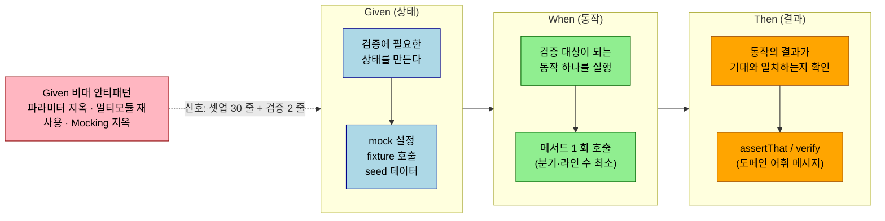

# JUnit 5 + AssertJ로 단위 테스트 작성

## 학습 목표

이 문서를 읽고 나면 다음을 할 수 있습니다.

1. Given-When-Then 세 구간의 책임 분리를 적용하고 Given 비대화의 세 가지 지옥(파라미터·멀티모듈 재사용·Mocking) 을 식별할 수 있습니다.
2. `BDDMockito.given().willReturn()` 과 `Mockito.when().thenReturn()` 의 어휘 차이를 비교하고 BDD 시나리오에 어느 쪽이 맞는지 판단할 수 있습니다.
3. `Clock.fixed` 로 시간 의존 도메인 정책을 결정적으로 박제하고, 도메인 객체에 `Clock` 을 주입하는 한 단계 indirection 비용으로 무엇을 사는지 설명할 수 있습니다.
4. Logback `ListAppender` 로 로그 산출물을 단위 테스트에서 검증하고, `try/finally detachAppender` 패턴이 누수를 어떻게 막는지 예측할 수 있습니다.


---

> 피라미드의 가장 아래층은 컨텍스트 없는 단위 테스트입니다. Spring 컨텍스트를 띄우지 않으므로 한 클래스당 수십 ms 안에 끝나고, 외부 의존이 없어 어떤 환경에서도 같은 결과가 나옵니다. 본 챕터는 JUnit 5 어노테이션·AssertJ fluent 단언·`Clock.fixed` 결정성·Logback `ListAppender` 로그 검증을 한 그릇에 정리합니다.


## 한 줄 정의

단위 테스트는 컨텍스트·외부 의존 없이 순수 함수에 가까운 코드의 분기를 빠르고 결정적으로 검증하는 층이며, JUnit 5 + AssertJ + `Clock.fixed` + Logback `ListAppender` 가 그 핵심 도구입니다.


## Given-When-Then 구조

> 단위 테스트의 본문 *내부* 구조를 결정하는 관습입니다. 카카오페이 Given Part 1·3 이 출발점입니다.

테스트 본문 세 구간의 책임은 다음과 같습니다.

```
Given — 검증에 필요한 *상태*를 만든다.
When  — 검증 대상이 되는 *동작* 하나를 실행한다.
Then  — 동작의 *결과*가 기대와 일치하는지 확인한다.
```

세 구간을 분리하는 이유는 *시선의 동선*입니다. 독자가 Given 에서 상태를 머리에 그리고, When 에서 트리거를 인식하고, Then 에서 기대를 확인합니다. 이 순서가 깨지면 *무엇이 검증되고 있는지* 파악하는 데 비용이 듭니다.

가장 흔한 깨짐은 Given 이 비대해질 때입니다. 카카오페이 Given Part 1 이 명시합니다.

> "복잡한 데이터 셋업으로 인해 테스트의 주요 관심사에 집중하기 어려운 문제."

데이터 셋업은 *검증이 아닙니다*. 검증을 가린다면 외부 자원으로 빼야 합니다.

다음 다이어그램은 Given-When-Then 세 구간의 *책임* 과 *시선 동선* 을 한 장에 박습니다. 독자가 본문을 읽을 때 머릿속에 그리는 순서가 곧 세 구간의 순서입니다.



세 구간을 순서대로 그릴 수 있어야 *독자의 인지 비용* 이 최소가 됩니다. Given 이 비대해지면 검증의 무게중심이 흐려져, 독자는 매번 *어디까지가 셋업이고 어디부터가 검증인지* 머릿속으로 다시 가르는 비용을 치릅니다. fixture 외부화는 *그 비용을 영구히 제거* 하는 도구입니다.

### BDDMockito 어휘 — `given().willReturn()` vs `when().thenReturn()`

같은 mock 설정도 두 가지 모양으로 표현됩니다.

```java
// Mockito.when — "이걸 호출하면 이걸 반환해라"
when(deployJobReader.findLatestContainerManifestId("JOB_1"))
    .thenReturn("MFST_001");

// BDDMockito.given — "이런 상태가 주어졌을 때"
given(deployJobReader.findLatestContainerManifestId("JOB_1"))
    .willReturn("MFST_001");
```

기능은 동일합니다. 의미가 다릅니다. `when().thenReturn()` 은 *행위*를 설명하지만, `given().willReturn()` 은 *상태*를 설명합니다. BDD 시나리오(Given/When/Then) 에서 Given 구간에 `given()` 이 자연스럽게 맞물립니다.

TPS `DefaultDeployDomainServiceTest`(`executor/engine/src/test/java/.../argocd/domain/deploy/DefaultDeployDomainServiceTest.java`) 가 그 예입니다.

```java
import static org.mockito.BDDMockito.given;

@ExtendWith(MockitoExtension.class)
class DefaultDeployDomainServiceTest {

    @Test
    void deploy_linksManifestAndTriggersArgoCd() {
        // Given
        given(deployJobReader.requireContainerStepByJobVersion("DEPLOY_JOB_001", 1))
                .willReturn(deployStepDetailItem);
        given(applicationInfoQueryPort.requireByApplicationName("app-1"))
                .willReturn(applicationInfo);

        // When
        deployDomainService.deploy(command);

        // Then
        verify(argoCdLinkPort).link(command, "MFST_001", 2);
    }
}
```

같은 코드를 `Mockito.when` 으로 쓰면 *Given 구간이 `when()` 로 시작하고 When 구간도 동사인 `when()` 어휘로 적혀* 혼동이 생깁니다. BDDMockito 는 그 어휘 충돌을 풉니다. Then 의 `verify()` 도 `then().should()` 로 대체하면 세 구간이 어휘 수준에서 가지런해집니다.

### 세 가지 지옥 — Given 이 비대해지는 패턴

카카오페이 Given Part 3 은 Given 단계에서 자주 만나는 *세 가지 지옥*을 명시합니다.

1. **파라미터 지옥** — 필드 20 개 중 검증에 필요한 건 3 개뿐인데 *나머지 17 개도 형식상 채워야* 합니다.
2. **멀티모듈 재사용 지옥** — `src/test/java` 의 헬퍼는 *다른 모듈에서 import 불가*.
3. **Mocking 지옥** — 외부 요청 DTO 와 도메인 객체가 *95% 같은 필드*를 가질 때 둘 다 만들어야 합니다.

해결은 *Fixture 추출*이며, `DomainFixture` + `DomainIoFixture` + `java-test-fixtures` 플러그인이 같은 방향에서 같은 문제를 풉니다. 본격적 패턴은 02-06 「Test Fixture 와 testFixtures」 에서 다룹니다.

### Given 외부화 — JSON 과 `@Sql`

객체 셋업이 *코드 안에서 너무 길어진다면* 외부 자원으로 뺍니다. 대표 도구가 JSON 파일(`readResource("fixtures/...")`) 과 `@Sql` 어노테이션입니다. 다만 외부화는 *복잡도가 임계치를 넘었을 때*만 합니다. 세 가지 비용이 따라오기 때문입니다.

1. *컴파일 타임 검증*이 사라집니다. JSON 필드가 도메인과 어긋나도 빌드는 통과하고 런타임에야 깨집니다.
2. *IDE 점프*가 끊깁니다. 도메인 필드 rename 시 JSON·SQL 파일까지 자동 따라가지 않습니다.
3. *fixture 변경 비용*이 커집니다. 한 시나리오만 미세 변형하고 싶을 때 새 파일을 만들어야 합니다.

TPS 는 SQL 외부 파일 대신 `TicketBaseDataSeeder`(`operator/ticket/src/test/java/.../testsupport/TicketBaseDataSeeder.java`) 같은 *Java 코드 시더*를 씁니다. `@Sql` 대비 장점은 *컴파일 타임 검증*이 되는 것, 단점은 *데이터 변경 비용*이 크다는 것입니다. 둘 다 같은 목적의 변종입니다.


## 왜 필요한가

> 결정성과 속도가 단위 테스트의 정체성입니다. 이 정체성을 깎으면서까지 단위 테스트를 늘리는 것은 의미가 없습니다.

도메인 정책의 분기가 단위 테스트의 1순위 표적입니다. 재시도 정책의 지수 백오프 공식, 권한 체크의 부정 매칭, 가격 계산의 반올림 규칙처럼 입력에서 출력까지가 순수한 함수면 단위 테스트가 가장 정확합니다. 통합 테스트로도 같은 결함을 잡을 수 있지만 한 케이스를 추가하는 비용이 수십 배 다릅니다. 단위 테스트가 빈약하면 정책 분기가 늘어날 때마다 통합 테스트의 시나리오 행렬이 폭발하고, 결국 한 번에 다 못 돌리는 무거운 회귀 묶음이 됩니다.

반대로 단위 테스트로는 잡지 못하는 결함도 분명히 존재합니다. JPA 매핑의 컬럼 타입 불일치, 트랜잭션 경계의 누수, 자동 설정 충돌 같은 결합 결함은 컨텍스트가 떠야만 드러나며, 단위 테스트로 흉내 내려고 하면 mock 이 누적되어 가짜 신뢰를 만듭니다. "단위 테스트로 가능한가?" 가 헷갈리면, 검증 대상이 외부 시스템·트랜잭션·설정에 의존하는지 자문해 봅니다. 이 셋 중 하나라도 본질이면 슬라이스 또는 통합으로 올립니다.


## 아키텍처

### JUnit 5 핵심 어노테이션

JUnit 5(공식 명칭 Jupiter) 는 JUnit 4 대비 어노테이션 모듈성과 확장 모델이 크게 정비됐습니다. 자주 쓰는 항목만 정리합니다.

| 어노테이션 | 역할 | 메모 |
|------------|------|------|
| `@Test` | 단일 테스트 | `expected` 속성 없음. 예외 단언은 `assertThrows` 또는 AssertJ `assertThatThrownBy` |
| `@DisplayName("...")` | 사람이 읽는 이름 | 한글·이모지·공백 자유. IDE 트리·리포트에 그대로 표시 |
| `@DisplayNameGeneration(ReplaceUnderscores.class)` | 메서드명의 `_` 를 공백으로 | 한국어 메서드명 컨벤션과 잘 어울림 |
| `@Nested` | 시나리오 그룹화 | inner class 로 묶어 상태별 시나리오 분리 |
| `@BeforeEach` / `@AfterEach` | 케이스 단위 라이프사이클 | 단위 테스트는 보통 생성자 주입 + 즉시 사용으로 충분 |
| `@BeforeAll` / `@AfterAll` | 클래스 단위 | 기본은 static. `@TestInstance(PER_CLASS)` 면 인스턴스 메서드 가능 |
| `@ParameterizedTest` + `@MethodSource`/`@ValueSource`/`@CsvSource` | 동일 로직, 다른 입력 | 입력 행렬이 늘어날 때 if 가 아니라 데이터로 표현 |
| `@RepeatedTest(n)` | 같은 테스트 n 회 | flaky 테스트 디버깅 용도 |
| `@DisabledIfSystemProperty`/`@EnabledOnOs` | 환경별 활성 | 기본은 `@Disabled` 보다 조건부가 안전 |
| `@Tag("...")` | 메타 라벨 | Gradle/Surefire `includeTags`·`excludeTags` 와 결합 |

확장(`@ExtendWith`) 은 다른 라이브러리(Mockito, Spring) 가 JUnit 5 라이프사이클에 끼어드는 진입점이며, 01-03 의 `MockitoExtension` 또는 01-04 의 `SpringExtension`(`@SpringBootTest` 가 메타로 포함) 형태로 등장합니다.

### AssertJ fluent 단언의 구조

JUnit 의 기본 단언(`assertEquals`, `assertTrue` 등) 은 동작은 정확하지만 IDE 자동완성이 약하고 실패 메시지가 제한적입니다. AssertJ 는 `assertThat(actual).<chain>` 형태의 fluent API 로 대상 타입에 맞는 단언이 자동완성으로 떠오르며, 실패 메시지가 차이의 위치를 자세히 보여 줍니다.


## 핵심 개념

### AssertJ — 실패 메시지가 도메인 어휘를 갖게 합니다

```java
import static org.assertj.core.api.Assertions.assertThat;
import static org.assertj.core.api.Assertions.assertThatThrownBy;

assertThat(messages).hasSize(2);
assertThat(messages).anyMatch(message -> message.contains("SERVER-INCOMING"));
assertThat(messages).noneMatch(message -> message.contains("DETAIL"));

assertThatThrownBy(() -> publisher.publish("agg-1", (byte[]) null, "topic-a"))
    .isInstanceOf(NullPointerException.class)
    .hasMessageContaining("payload");
```

AssertJ 의 가치는 `as("...")` 로 도메인 메시지를 붙일 수 있다는 점에서 한 단계 더 올라갑니다. 실패 시 "expected true but was false" 같은 빈약한 출력 대신 "개발계 Console Jenkins 가 가용해야 한다" 같은 도메인 언어로 실패가 보고되면 디버깅 시간이 줄어듭니다.

```java
assertThat(capacity.isUsable())
    .as("개발계 Jenkins capacity 는 usable 해야 한다 (UNKNOWN 이 아니어야)")
    .isTrue();
```

Hamcrest matcher 는 Spring 의 `MockMvc.andExpect(jsonPath(...).value(...))` 처럼 일부 API 가 직접 받기 때문에 슬라이스/통합 테스트에서는 여전히 만납니다. 단위 테스트의 직접 단언은 AssertJ 로 통일하는 편이 가독성이 일관됩니다.

### Clock.fixed — 시간을 결정적으로 박제합니다

시간을 다루는 도메인 정책(만료, 백오프, 보존 기간) 은 `LocalDateTime.now()` 또는 `Instant.now()` 를 직접 부르면 단위 테스트가 결정적이지 않습니다. Java 8 이후의 표준 패턴은 `java.time.Clock` 추상화를 도메인 객체에 주입하고, 테스트에서 `Clock.fixed(...)` 로 시간을 박제하는 것입니다.

```java
import java.time.Clock;
import java.time.LocalDateTime;
import java.time.ZoneOffset;

class OutboxRetryPolicyTest {

    private static final LocalDateTime NOW = LocalDateTime.of(2026, 5, 9, 12, 0, 0);
    private final Clock fixedClock = Clock.fixed(NOW.toInstant(ZoneOffset.UTC), ZoneOffset.UTC);
    private final OutboxRetryPolicy policy = new OutboxRetryPolicy(fixedClock);

    @Test
    @DisplayName("retryCount=3 → 다음 재시도 8초 후 (2^3 = 8)")
    void nextRetryAt_threeRetries_eightSeconds() {
        OutboxEvent event = newEvent(3);
        assertThat(policy.nextRetryAt(event)).isEqualTo(NOW.plusSeconds(8));
    }
}
```

도메인 객체가 `Clock` 을 받지 않고 `LocalDateTime.now()` 를 부르면 테스트가 시간대·DST·서버 시각 동기에 묶이며, CI 가 이상한 시간에 깨지는 flaky 테스트의 단골 원인이 됩니다. `Clock` 추상화는 한 단계의 indirection 비용으로 영구적인 결정성을 삽니다.

다음 다이어그램은 두 설계를 *시간 결정 위치* 의 차이로 한 장에 비교합니다. 같은 정책을 같은 입력으로 호출해도 시간을 *어디서 얻는가* 가 다르면 테스트 결정성이 갈립니다.

```mermaid
flowchart TB
    subgraph bad["❌ LocalDateTime.now() 직접 호출"]
        b_test["테스트<br>(시간 박제 불가)"]
        b_policy["RetryPolicy<br>nextRetryAt() { LocalDateTime.now()... }"]
        b_jvm["JVM 시스템 시계<br>(서버 시각·DST·시간대 의존)"]
        b_test --> b_policy --> b_jvm
        b_fail["flaky:<br>CI 가 자정 근처에 깨짐"]
        b_jvm -.-> b_fail
    end

    subgraph good["✅ Clock 주입 + Clock.fixed"]
        g_test["테스트<br>Clock.fixed(2026-05-09 12:00, UTC)"]
        g_policy["RetryPolicy(Clock clock)<br>nextRetryAt() { clock.instant()... }"]
        g_clock["주입된 Clock<br>(테스트=fixed, 운영=systemUTC)"]
        g_test --> g_policy --> g_clock
        g_pass["결정성:<br>매 실행 같은 결과"]
        g_clock -.-> g_pass
    end

    classDef badBox fill:#FFB6C1,color:#000,stroke:#8B0000,stroke-width:1px
    classDef goodBox fill:#90EE90,color:#000,stroke:#006400,stroke-width:1px
    class b_test,b_policy,b_jvm,b_fail badBox
    class g_test,g_policy,g_clock,g_pass goodBox
```



핵심은 *제어 역전* 입니다. 도메인 객체가 시간을 *직접 얻는* 대신 *주입받은 `Clock` 에게 물어보는* 형태가 되면, 테스트는 `Clock.fixed(...)` 한 줄로 시간 축을 박제할 수 있습니다. 운영에서는 `Clock.systemUTC()` 를 주입하므로 동작은 동일하고, 테스트만 결정성을 얻습니다. 이 한 단계의 indirection 이 백오프·만료·보존 기간 정책의 flaky 를 영구히 차단합니다.

`@MockBean` 이나 PowerMock 으로 정적 메서드를 우회하는 방식은 단위 테스트에서는 권장하지 않습니다. 컨텍스트가 떠야 하고 mock 의 영향 범위가 넓어, 빠르고 결정적이라는 단위 테스트의 정체성을 깎아 먹습니다.

### 한국어 DisplayName 과 ReplaceUnderscores

`@DisplayNameGeneration(DisplayNameGenerator.ReplaceUnderscores.class)` 를 클래스 레벨에 두면 메서드명의 `_` 가 공백으로 바뀌어 IDE 트리에 표시됩니다. 한국어 메서드명을 그대로 쓰면 한글 모음 안의 `_` 가 끼어 가독성이 떨어지므로, 둘을 결합한 컨벤션이 자리잡습니다.

```java
@DisplayNameGeneration(DisplayNameGenerator.ReplaceUnderscores.class)
class TcktMngControllerTest {

    @Nested
    class 티켓_시작_API_호출시 {

        @Test
        @DisplayName("[Green] 정상 흐름 - userId 헤더와 tcktNo가 유효하면 service를 호출하고 TpsResponse<Void> 성공 응답을 반환한다")
        void 정상_흐름이면_service를_호출하고_TpsResponse_성공_응답을_반환한다() throws Exception { ... }
    }
}
```

`@Nested` inner class 명도 `_` 가 공백으로 바뀌므로 "티켓 시작 API 호출시" 라는 그룹 라벨이 트리에 자연스럽게 보입니다. `[Green]` / `[Red]` 접두사는 happy/sad path 를 한눈에 구분하는 작은 컨벤션이며, 코드 리뷰에서 "이 테스트는 어떤 분기?" 를 따로 묻지 않게 해 주는 효과가 있습니다.

`@Nested` 는 *시나리오 카테고리가 3 개 이상 명확히 갈릴 때* 도입합니다. 메서드 4~5 개가 flat 하게 나열되어도 문제 없으면 `@Nested` 는 *과한 구조*다. 도입했다가 시나리오가 줄면 다시 flat 으로 돌리는 게 좋습니다. `@Nested` 는 *카테고리가 시나리오를 분류하는* 보조 도구지, *카테고리 자체를 만드는* 도구가 아닙니다.


## POJO 단위 vs Mock 단위

같은 "단위 테스트"라도 두 변종이 있고, 적합 시점이 다릅니다.

| 변종 | 의존성 처리 | 적합 시점 |
|------|------------|----------|
| **POJO 단위** | 의존성 없음 또는 *실제 객체* 직접 생성 | 도메인 객체, 값 객체, 정책 클래스 |
| **Mock 단위** | 의존성을 `@Mock` 으로 주입 | 어플리케이션 서비스, 어댑터 |

POJO 단위가 *더 가볍고 더 빠릅니다*. Mock 셋업 코드가 사라지고, *실제 동작*이 검증됩니다. 하지만 모든 클래스를 POJO 로 만들 수 있는 건 아닙니다. 외부 시스템 호출을 감싸는 어플리케이션 서비스는 *Mock 단위*가 자연스럽습니다. 결정은 *클래스의 책임*이 가릅니다.

TPS 안에서 둘이 같은 모듈에 공존합니다. `OutboxRetryPolicyTest` 는 POJO 단위(`Clock` 과 `OutboxEvent` 만 직접 생성). `EventPublisherTest` 는 Mock 단위(`OutboxEventRepository`, `AvroSerializer` 를 mock). 같은 message-lib 모듈 안에서도 책임에 따라 변종이 갈립니다.

판단의 한 줄 점검은 다음과 같습니다. "*POJO 로 못 짜는 게 정말 책임 분리 때문인지*" 를 먼저 봅니다. Mock 이 너무 많다는 신호는 *POJO 로 빼낼 도메인 객체가 있습니다*는 신호일 수 있습니다. Mock 단위의 본격적 패턴은 01-03 에서 다룹니다.


## 실습 — Logback ListAppender 로 로그 검증

로그 포맷·필터링 로직처럼 로그 자체가 산출물인 코드는 단위 테스트에서 검증해야 합니다. Logback `ListAppender` 는 메모리 기반 appender 로, 테스트가 끝난 뒤 어떤 메시지가 어떤 레벨로 남았는지 리스트로 확인할 수 있습니다.

```java
import ch.qos.logback.classic.Logger;
import ch.qos.logback.classic.spi.ILoggingEvent;
import ch.qos.logback.core.read.ListAppender;
import org.slf4j.LoggerFactory;

class WebLoggingFilterTest {
    private final Logger logger = (Logger) LoggerFactory.getLogger(WebLoggingFilter.class);

    @Test
    void 일반Api요청은요약로그를남긴다() throws Exception {
        WebLoggingFilter filter = new WebLoggingFilter();
        ListAppender<ILoggingEvent> appender = new ListAppender<>();
        appender.start();
        logger.addAppender(appender);

        try {
            MockHttpServletRequest request = new MockHttpServletRequest("GET", "/pipelines/1");
            request.setRemoteAddr("127.0.0.10");
            MockHttpServletResponse response = new MockHttpServletResponse();
            response.setContentType("application/json");

            filter.doFilter(request, response, new MockFilterChain());

            List<String> messages = appender.list.stream()
                .map(ILoggingEvent::getFormattedMessage)
                .toList();
            assertThat(messages).hasSize(2);
            assertThat(messages).anyMatch(m -> m.contains("SERVER-INCOMING method=GET, uri=/pipelines/1"));
            assertThat(messages).noneMatch(m -> m.contains("DETAIL"));
        } finally {
            logger.detachAppender(appender);
        }
    }
}
```

핵심은 `try { ... } finally { logger.detachAppender(appender); }` 로 appender 를 항상 떼어내는 것입니다. detach 를 잊으면 appender 가 다음 테스트로 leak 되어 메시지 리스트가 부풀고, 단위 테스트가 다른 테스트 순서에 의존하기 시작합니다. JUnit 5 `@AfterEach` 또는 `try-with-resources` 형태로 lifecycle 을 명시하는 편이 안전합니다.

`MockHttpServletRequest` / `MockHttpServletResponse` / `MockFilterChain` 은 `spring-test` 가 제공하는 가벼운 servlet API mock 이며, 컨텍스트를 띄우지 않은 채 필터/인터셉터를 검증할 때 1차 도구입니다.

### TPS 사례 — 결정성과 누수 방지

`OutboxRetryPolicyTest` 는 `Clock.fixed` 로 시간을 박제한 뒤 9 개 케이스로 지수 백오프 곡선(`2^retryCount` 초)과 max-retries 임계 판정의 결정성을 회귀 보호합니다. 정책 객체가 순수 함수에 가까워, 같은 검증을 통합 테스트에서 했다면 100 배 가까이 느렸을 것입니다.

`WebLoggingFilterTest` 는 6 개 케이스로 contextPath 유무, swagger-ui/api-docs 정적 리소스 필터링, 일반 API 의 incoming/outgoing 한 쌍 요약 로그 같은 분기를 모두 컨텍스트 없이 검증합니다. `MockHttpServletRequest` 의 `setContextPath` / `setServletPath` 가 핵심으로, 실제 톰캣을 띄우지 않고도 path-stripping 로직의 분기를 모두 커버합니다.

라이브러리 모듈의 `EventPublisherTest` 는 Mockito mock 으로 의존을 잘라내고 `ArgumentCaptor` 로 저장된 `OutboxEvent` 를 캡처해 payload·correlation id·UUID 채번 같은 인프라 메타데이터의 정확성을 검증합니다. 같은 검증을 EmbeddedKafka 통합 테스트로 했다면 한 케이스당 수 초가 들었을 텐데, 단위 테스트는 11 케이스를 1 초 안에 끝냅니다. 이 차이가 누적되면 단위 테스트의 ROI 가 분명해집니다.

`Jenkins305PTestFixtures`(`executor/engine/src/test/java/.../jenkins/e2e/support/Jenkins305PTestFixtures.java`) 는 도메인 fixture 가 *상수·enum·헬퍼 메서드*의 세 패턴을 어떻게 결합하는지 보여 줍니다.

```java
public final class Jenkins305PTestFixtures {

    public static final String PROJECT_ID = "SBH";
    public static final String PRESET_ID = "E2E";
    public static final TestJob SUCCESS_JOB = TestJob.SUCCESS;

    public enum TestJob {
        SUCCESS("E2E-SUCCESS", ExecutionJobStatus.SUCCESS),
        FAILURE("E2E-FAILURE", ExecutionJobStatus.FAILURE);

        private final String id;
        private final ExecutionJobStatus expectedTerminal;

        public String jobPath() { ... }
    }
}
```

세 가지가 한 곳에 모인 결과는 다음과 같습니다. (1) `PROJECT_ID = "SBH"` 같은 *의미 있는 상수*가 fixture 로 쓰여 테스트 본문에서 직접 문자열을 쓰지 않습니다. (2) `TestJob.SUCCESS`/`FAILURE` 처럼 *시나리오 변형*이 enum 하나로 모여 새 변형 추가가 단순합니다. (3) `jobPath()` 같은 *파생 값*이 fixture 안에 있어 테스트 본문이 도메인을 모른 채로도 쓸 수 있습니다.


## 함정과 회피

> 처음 만나면 디버깅에 시간이 가는 항목들입니다.

### 1. JUnit 4 와 5 의 어노테이션 패키지 혼선

`org.junit.Test` 가 아닌 `org.junit.jupiter.api.Test` 인지 import 를 확인합니다. JUnit 4 어노테이션을 쓰면 JUnit 5 launcher 가 그 메서드를 무시하고 통과시키므로, 단언이 절대 실패하지 않는 "조용한" 무력화가 발생합니다. 빌드 출력의 테스트 케이스 수가 어느 시점부터 줄었다면 이 사고를 의심합니다.

### 2. `assertThat` 의 import 두 가지

`org.assertj.core.api.Assertions.assertThat` 이 AssertJ, `org.junit.jupiter.api.Assertions.assertThat` 은 Hamcrest 호환입니다. IDE 자동 import 가 후자를 선택하면 fluent 체이닝이 안 떠 의문이 듭니다. AssertJ 를 일관 사용하기로 정했으면 IDE 의 favorite static import 에 등록합니다.

### 3. `@MockBean` 은 단위 테스트가 아닙니다

Spring 컨텍스트를 띄우는 어노테이션이라 단위 테스트의 정체성을 깎습니다. 단위 테스트에서는 `@Mock`(Mockito 단독) 또는 단순 생성자 주입을 쓰고, 컨텍스트가 필요한 시점에 슬라이스/통합으로 올립니다. 이 차이는 01-03 에서 다시 짚습니다.

### 4. `@Disabled` 의 영구화

깨지는 테스트를 빨리 통과시키려고 disable 하면, 그 테스트가 영구히 무력화됩니다. 잠시 끄려면 `@Disabled("이슈 #123 — 2026-06 까지")` 처럼 만료일을 메시지에 박아 두는 편이 안전합니다.


## 자가 점검 — 문제

> 답을 먼저 입으로 말해 보고, 막히면 아래 §정답 섹션을 확인합니다. 본문을 다시 펴 보지 말고 *자기 언어로* 설명할 수 있는지 점검하는 것이 목적입니다.

1. JUnit 4 어노테이션을 JUnit 5 launcher 에서 쓰면 어떤 일이 일어나는가?
2. AssertJ 와 JUnit/Hamcrest 의 `assertThat` 을 같이 import 하면 무엇이 문제인가?
3. `Clock.fixed` 가 결정성을 사는 비용은 무엇인가?
4. Logback `ListAppender` 를 `try { ... } finally { detachAppender(...) }` 로 감싸는 이유는?
5. `@MockBean` 이 단위 테스트의 정체성을 깎는 이유는?
6. "데이터 셋업은 검증이 아니다"가 정확히 의미하는 바는?
7. `Mockito.when` 대신 `BDDMockito.given` 을 쓰는 결정적 이유는?
8. Given 을 JSON·SQL 로 외부화하면 *왜 무조건 좋지는* 않은가?
9. `@Nested` 를 언제 도입하고 언제 피하나?
10. POJO 단위 테스트와 Mock 단위 테스트 중 *우선* 도전할 것은?


## 자가 점검 — 정답

1. launcher 가 그 메서드를 인식하지 못해 *조용히 무시* 합니다. 컴파일·빌드는 통과하고 테스트가 *돌지 않은 채로* 결과가 초록입니다. 단언이 절대 실패하지 않는 사실상의 무력화이므로, 빌드 출력의 테스트 케이스 수가 어느 시점부터 줄었다면 이 사고를 의심합니다.
2. 패키지가 다르고 시그니처가 달라 IDE 자동 import 가 후자를 고르면 fluent 체이닝이 안 뜹니다. AssertJ 를 일관 사용하기로 정했으면 IDE 의 favorite static import 에 `org.assertj.core.api.Assertions.assertThat` 을 등록해 항상 같은 import 가 선택되게 만듭니다.
3. 도메인 객체가 `Clock` 을 받도록 만드는 *한 단계 indirection* 입니다. 그 대가로 시간대·DST·서버 시각 동기에 묶이지 않는 영구적 결정성을 얻습니다. 운영 코드는 `Clock.systemUTC()` 를 주입받고 테스트는 `Clock.fixed(...)` 를 주입받으므로 동작 자체는 동일합니다.
4. detach 를 잊으면 appender 가 *루트 logger 에 그대로 붙은 채로* 다음 테스트로 leak 됩니다. 메시지 리스트가 부풀고, 테스트 순서에 의존하기 시작하며, 무엇보다 *왜 실패하는지* 파악이 어려워집니다. `try/finally` 또는 `@AfterEach` 로 lifecycle 을 명시하는 편이 안전합니다.
5. `@MockBean` 은 Spring 컨텍스트를 띄우는 어노테이션입니다. 컨텍스트 부팅 비용이 단위 테스트의 빠르고 결정적이라는 정체성을 깎고, mock 으로 잘라낸 의존이 실제 객체가 아니라는 점에서 검증 가치도 떨어집니다. 단위 층에서는 `@Mock`(Mockito 단독) 또는 생성자 주입을 쓰고, 컨텍스트가 본질일 때만 슬라이스/통합으로 올립니다.
6. 테스트의 *주요 관심사* 는 Then 구간에서 검증되는 동작이고, Given 은 그 검증을 받쳐 주는 *상태 셋업* 일 뿐입니다. 셋업에 30 줄이 들어가고 검증은 2 줄이라면 독자가 매번 30 줄을 머리에 그리는 비용을 치르므로, fixture·JSON·`@Sql` 로 외부화해 본문에 *검증 의도만* 남깁니다.
7. 어휘 충돌입니다. BDD 시나리오 세 구간이 Given/When/Then 인데 `Mockito.when()` 이 Given 구간에 들어가면 "when 으로 시작하는 줄이 Given 에 있다"는 모순이 코드에 박힙니다. `BDDMockito.given()` 은 그 충돌을 풀고, Then 구간의 `verify()` 도 `then().should()` 로 대체하면 세 구간이 어휘 수준에서 가지런해집니다.
8. 세 가지 비용이 따라옵니다. 컴파일 타임 검증이 사라져 JSON 필드가 도메인과 어긋나도 빌드는 통과합니다. IDE 점프가 끊겨 도메인 필드 rename 시 외부 파일이 자동 추적되지 않습니다. fixture 변경 비용이 커서 한 시나리오만 미세 변형하고 싶을 때 새 파일을 만들어야 합니다. 그래서 외부화는 *복잡도가 임계치를 넘었을 때만* 합니다.
9. 시나리오 카테고리가 3 개 이상 명확히 갈리고 각 카테고리 안에 의미 있는 케이스가 모이는 자리에서만 도입합니다. 메서드 4~5 개가 flat 하게 나열되어도 가독성이 나쁘지 않으면 `@Nested` 는 과한 구조입니다. 분류 도구지 분류 자체를 만드는 도구가 아니므로, 도입했다가 시나리오가 줄면 다시 flat 으로 돌립니다.
10. POJO 단위입니다. 같은 검증을 POJO 로 짤 수 있다면 항상 더 가볍고 *실제 동작* 이 검증됩니다. POJO 로 짤 수 없는 자리(외부 시스템 호출을 감싸는 어플리케이션 서비스 등) 만 Mock 단위가 자연스러우며, Mock 이 많다는 신호는 *POJO 로 빼낼 도메인 객체* 가 있다는 신호일 수 있어 책임 분리부터 점검합니다.


## 다음 챕터

01-03 은 단위 테스트가 컨트롤러로 확장될 때 자주 쓰는 Mockito 와 MockMvc 슬라이스를 다룹니다. `MockMvcBuilders.standaloneSetup` 과 `@WebMvcTest` 의 트레이드오프, BDDMockito `then().should()`, `ArgumentCaptor` 활용을 정리합니다.
