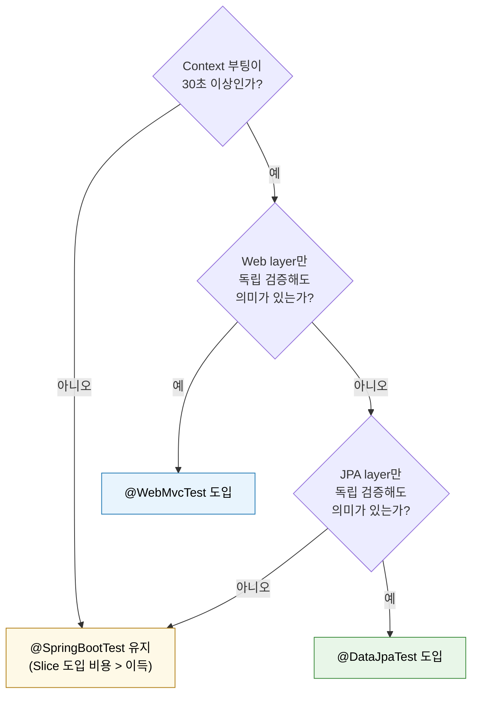

# Mockito와 MockMvc 슬라이스

---

> 컨트롤러는 단위 테스트만으로 충분하지 않다. 검증 어노테이션·JSON 바인딩·ControllerAdvice 의 예외 변환은 Spring MVC 의 협력 결과라 mock 으로 흉내 내면 가짜 신뢰만 만든다. MockMvc 는 톰캣을 띄우지 않고도 DispatcherServlet 흐름을 복원해 컨트롤러 슬라이스를 빠르고 결정적으로 검증한다.


## 한 줄 정의

슬라이스 테스트는 DispatcherServlet 흐름을 띄우되 도메인/인프라 빈은 mock 으로 잘라낸 층이며, Mockito 의 stubbing/검증 API 와 MockMvc 의 두 가지 셋업(`standaloneSetup` / `@WebMvcTest`)을 트레이드오프로 골라 쓴다.


## 왜 필요한가

> 단위 테스트와 통합 테스트 사이에 빈 공간이 있고, 컨트롤러 책임의 본질이 거기에 있다.

01-02 의 단위 테스트는 Spring 컨텍스트 없이 객체를 직접 생성한다. 컨트롤러도 그 방식으로 검증할 수는 있지만, 검증 어노테이션과 ControllerAdvice 가 동작하지 않으므로 사실상 서비스 호출 위임만 확인하게 된다. 슬라이스 테스트는 그 사이를 채운다. **DispatcherServlet 흐름을 띄우되 도메인/인프라 빈은 mock 으로 잘라낸다.** 비용은 단위 테스트의 몇 배로 늘지만 컨트롤러 책임의 본질을 모두 커버한다.

| 검증 대상 | 적합한 층 | 이유 |
|----------|---------|------|
| 서비스 호출 인자 변환 | 단위 또는 슬라이스 | 컨트롤러를 직접 생성해도 충분 |
| `@Valid` 검증 어노테이션 | 슬라이스 | 단위 테스트로는 검증 어노테이션이 동작하지 않음 |
| `ControllerAdvice` 예외 → 응답 매핑 | 슬라이스 | 어드바이스가 등록된 상태가 본질 |
| 인터셉터·필터·시큐리티 | 슬라이스(전체 컨텍스트) 또는 통합 | `@WebMvcTest` 는 일부만 등록 |
| JSON 바인딩 (`@RequestBody`) | 슬라이스 | Jackson 설정과 결합한 동작 |


## 아키텍처

### Mockito 핵심 API

| 도구 | 역할 |
|------|------|
| `@ExtendWith(MockitoExtension.class)` | JUnit 5 확장으로 mock 라이프사이클 자동 관리 |
| `@Mock` | mock 객체 생성. 필드/파라미터에 부착 |
| `@InjectMocks` | mock 을 생성자/세터로 주입한 SUT 생성 |
| `@Captor` | `ArgumentCaptor` 필드 선언 |
| `when(mock.foo()).thenReturn(...)` | stubbing — Mockito 클래식 |
| `given(mock.foo()).willReturn(...)` | BDDMockito — Given/When/Then 어휘 |
| `verify(mock).foo(...)` | 호출 검증 — Mockito 클래식 |
| `then(mock).should().foo(...)` | BDDMockito — Then 어휘 |
| `ArgumentCaptor.forClass(X.class)` | 호출 인자 캡처 후 단언 |
| `times(n)`/`never()`/`atLeastOnce()` | 호출 횟수 |
| `any()`/`anyString()`/`eq(x)` | 인자 매처 |

BDDMockito 는 `org.mockito.BDDMockito` 패키지의 정적 메서드(`given`, `then`)로 같은 의미를 표현한다. 코드 리뷰에서 Given-When-Then 흐름이 자연스럽게 읽혀 가독성이 좋다. 동일 테스트 안에서 두 스타일을 섞지 않는 것이 중요하며, 팀 단위로 한쪽으로 통일하는 편이 PR 리뷰 비용을 줄인다.

`MockitoExtension` 은 `@Mock`/`@InjectMocks`/`@Captor` 를 자동 초기화하고, 메서드 라이프사이클이 끝날 때 stubbing strictness 를 검사한다. 기본 strictness 는 `STRICT_STUBS` 로, 사용되지 않은 stubbing 이 있으면 테스트 실패로 보고한다. 이 정책이 의도와 어긋나면 `@MockitoSettings(strictness = LENIENT)` 로 풀 수 있다.

### Mock 도구의 4 단계 진화

Mockito 단독으로 끝나지 않는 자리가 있다. 컨텍스트 안 빈을 mock 으로 교체하거나, 외부 HTTP 응답을 흉내 내거나, 멀티모듈 간 mock 설정을 공유하는 시점에 도구가 갈린다. 카카오페이 Mock Part 1 이 정리한 *역사적 진화*가 다음과 같다 — 각 단계가 이전 단계의 한계를 푼다.

| 도구 | 사용 자리 | Context 재사용 | 멀티모듈 |
|------|----------|--------------|---------|
| **Mock Server** (WireMock / MockWebServer) | 외부 HTTP 의존성 | 무관 | 가능 |
| `@MockBean` | 단일 빈 mock | **불가** (Context 재초기화) | 가능 |
| `@TestConfiguration` | 공유 Mock 빈 | 가능 | **불가** |
| `java-test-fixtures` | 모듈 간 공유 fixture | 가능 | 가능 |

해석은 다음과 같다. (1) **Mock Server** 는 실제 환경과 가장 유사하지만 의존하는 모든 외부 시스템에 별도로 띄워야 해서 운영 비용이 폭증한다 — 04-04 의 WireMock 패턴이 이 자리다. (2) `@MockBean` 은 셋업이 간단하지만 *ApplicationContext 재초기화*가 일어나 빌드 시간을 늘린다. (3) `@TestConfiguration` 은 Mock 빈을 정적으로 등록해 Context 재사용을 푸는 대신, `src/test` 안에 있어서 *멀티모듈에서 import 불가*. (4) `java-test-fixtures` 는 `src/testFixtures/java` 로 코드를 모듈 의존성으로 공유해 둘 다 해결한다 — 02-06 에서 본격적으로 다룬다.

요점은 단순하다. `@MockBean` 은 *간단하지만 비쌌고*, `@TestConfiguration` 은 *재사용을 풀었지만 모듈 경계에서 막혔다*. `java-test-fixtures` 가 둘 다 푼다.

### MockMvc 의 두 가지 셋업

MockMvc 를 만드는 방법은 두 가지이며, 결정 축은 "검증 대상에 컨텍스트가 본질인가" 한 가지다.


## 핵심 개념

### standalone setup — 컨텍스트 없음

`MockMvcBuilders.standaloneSetup(controller)` 은 Spring 컨텍스트를 띄우지 않고 컨트롤러 인스턴스만 받아 DispatcherServlet 흐름을 흉내 낸다. 가장 빠르고 가장 가볍다. ControllerAdvice·HandlerInterceptor·ArgumentResolver 를 빌더 메서드로 명시 등록해야 동작한다.

```java
@ExtendWith(MockitoExtension.class)
@DisplayNameGeneration(DisplayNameGenerator.ReplaceUnderscores.class)
class TcktMngControllerTest {

    @Mock
    private TicketStartService ticketStartService;

    private MockMvc mockMvc;

    @BeforeEach
    void setUp() {
        TcktMngController controller = new TcktMngController(ticketStartService);
        mockMvc = MockMvcBuilders.standaloneSetup(controller)
            .setControllerAdvice(new TicketGlobalExceptionHandler())
            .build();
    }
}
```

장점은 속도와 가독성이다. 100~200ms 안에 컨트롤러 한 개의 모든 시나리오를 돈다. 단점은 실제 컨텍스트와의 차이로, 시큐리티 필터·MessageConverter 커스텀 설정·전역 검증기 등이 자동으로 붙지 않는다. 어드바이스를 매번 명시해야 하지만, 그 명시가 "이 컨트롤러는 이 어드바이스와 결합한다"는 계약을 코드로 남긴다는 면에서 장점이 되기도 한다.

### @WebMvcTest — 컨트롤러 슬라이스 컨텍스트

`@WebMvcTest(TcktMngController.class)` 는 web layer 자동 설정만 켜진 슬라이스 컨텍스트를 띄운다. 컨트롤러·`@ControllerAdvice`·`HandlerInterceptor`·`HttpMessageConverter` 가 자동 등록되고, 서비스/리포지토리는 빈에서 제외된다. 의존 빈은 `@MockBean`(Boot 3.4 부터는 `@MockitoBean`) 으로 등록한다.

```java
@WebMvcTest(TcktMngController.class)
class TcktMngControllerWebMvcTest {

    @Autowired MockMvc mockMvc;
    @MockBean TicketStartService ticketStartService;

    @Test
    void start_returnsOk() throws Exception {
        mockMvc.perform(post("/tckt_mng/v1/start/{tcktNo}", "TCKT000001")
                .header("userId", "admin")
                .accept(MediaType.APPLICATION_JSON))
            .andExpect(status().isOk());
    }
}
```

장점은 실제 컨텍스트에 가까운 동작이다. 검증 어노테이션·메시지 컨버터·시큐리티 자동 설정(없으면 안 켜짐) 의 결합 결과를 검증한다. 단점은 standalone 보다 수 배 느리다는 점, 그리고 `@MockBean` 이 컨텍스트 캐시를 갈라 누적 빌드 시간을 늘린다는 점이다. 보통 한 컨트롤러당 한 케이스만 슬라이스로 두고, 분기 다수는 standalone 으로 쓰는 절충이 자주 보인다.

### 선택 기준

판단 축은 "검증 대상에 컨텍스트가 본질인가" 한 가지다. 검증 어노테이션과 ControllerAdvice 의 결합만 보면 되면 standalone 이 충분하다. 시큐리티 필터·커스텀 메시지 컨버터·인터셉터까지 묶어 검증해야 하면 `@WebMvcTest` 또는 풀 컨텍스트 통합으로 올린다.

### TPS 가 `@WebMvcTest` 를 쓰지 않는 이유

TPS 코드베이스에서 `@WebMvcTest` 사용 수는 *0* 이다. 의식적 선택이며, 세 가지 이유가 결합되어 있다.

1. **Context 부팅 비용이 허용 범위 안이다**. `@SpringBootTest` 로 부팅해도 5~10 초 안에 Context 가 준비되고, 같은 Context 를 테스트 전체에서 재사용하므로 누적 비용이 작다. Slice 도입의 가장 큰 매력인 *부팅 속도 개선*이 비용 대비 작다.
2. **횡단 관심사를 통합으로 검증해야 한다**. TPS 는 correlation ID 헤더 자동 부착, 사용자 컨텍스트 ThreadLocal, MDC 전파 같은 횡단 관심사가 컨트롤러 동작에 깊이 묶여 있다. `@WebMvcTest` 는 `@Configuration` 빈이나 Aspect 를 제외하므로 *전체 Context* 에서 검증해야 회귀가 잡힌다.
3. **`@MockBean` 재초기화 역설**. `@WebMvcTest` 는 Service·Repository 빈이 Context 에 없어 *반드시 `@MockBean`* 으로 주입해야 한다. `@MockBean` 은 Context 재초기화를 유발하므로, 다른 조합을 쓰는 테스트마다 Context 가 새로 부팅된다. 부팅 비용을 줄이려는 의도였는데 *재초기화 비용으로 갚는* 역설이 생긴다.

대신 자리잡은 패턴이 `@SpringBootTest` + `@AutoConfigureMockMvc` 또는 위의 `standaloneSetup` 이다. 후자가 단위에 가까운 비용으로 컨트롤러 분기 검증을 처리하고, 전자가 횡단 관심사까지 묶어 검증한다. *둘 사이의 빈 공간*에 `@WebMvcTest` 가 있을 자리가 좁다.

### ArgumentCaptor — 인자 캡처 후 단언

`verify(mock).foo(eq(...), eq(...))` 로 모든 인자를 명시 매칭하기 어려운 경우에 쓴다. ArgumentCaptor 의 가치는 단언 위치를 호출 시점에서 분리한다는 점이다. `verify(...).save(eq(complexObject))` 는 객체 동등성을 모두 만족시켜야 하는데, 부분 단언이 필요한 경우 ArgumentCaptor 가 적합하다. 캡처한 값은 일반 객체이므로 AssertJ 로 그 위에 어떤 단언이든 쓸 수 있다.


## 실습 — MockMvc 요청·응답 단언과 ArgumentCaptor

### MockMvc 단언 체이닝

`MockMvc.perform(...)` 의 결과(`ResultActions`) 에 `andExpect`/`andDo`/`andReturn` 을 체이닝한다.

```java
mockMvc.perform(
        post(START_URL_TEMPLATE, VALID_TCKT_NO)
            .header("userId", VALID_USER_ID)
            .accept(MediaType.APPLICATION_JSON)
    )
    .andExpect(status().isOk())
    .andExpect(jsonPath("$.rsltCd").value("TPS200"))
    .andExpect(jsonPath("$.data").doesNotExist());

then(ticketStartService).should(times(1)).start(VALID_TCKT_NO, VALID_USER_ID);
```

`jsonPath` 는 Hamcrest matcher 를 받지만 AssertJ 와 혼용해도 문제가 없다. 응답 본문을 직접 단언하고 싶으면 `andReturn().getResponse().getContentAsString()` 으로 꺼내 AssertJ 로 이어간다. `andDo(print())` 는 디버깅용으로 요청·응답 전체를 stdout 에 찍어 준다.

`@Nested` inner class 로 시나리오를 그룹화하면 트리 구조가 잘 정리된다. `티켓_시작_API_호출시` inner class 안에 `정상_흐름이면_...`, `userId가_11자_이상이면_...` 같은 분기를 모아 두면, IDE 트리에서 한 컨트롤러의 시나리오가 한 단계 들여쓰기로 보인다.

### ArgumentCaptor 활용

메시징 라이브러리의 `EventPublisherTest` 가 좋은 예다. publisher 가 만든 `OutboxEvent` 의 payload·topic·correlation id 가 정확한지 검증한다.

```java
import org.mockito.ArgumentCaptor;
import static org.mockito.ArgumentMatchers.any;
import static org.mockito.Mockito.verify;
import static org.mockito.Mockito.when;

@Test
void publish_specificRecord_serializesAndSaves() {
    when(avroSerializer.serialize(eq("topic-a"), any(ExampleMessageAvro.class)))
        .thenReturn(new byte[]{1, 2, 3});
    EventPublisher publisher = new EventPublisher(repository, avroSerializer);

    ExampleMessageAvro record = ExampleMessageAvro.newBuilder()
        .setMessage("hi")
        .setCorrelationId("corr-1")
        .build();
    publisher.publish("agg-1", record, "topic-a");

    ArgumentCaptor<OutboxEvent> captor = ArgumentCaptor.forClass(OutboxEvent.class);
    verify(repository).save(captor.capture());

    OutboxEvent saved = captor.getValue();
    assertThat(saved.getPayload()).isEqualTo(new byte[]{1, 2, 3});
    assertThat(saved.getTopic()).isEqualTo("topic-a");
    assertThat(saved.getAggregateId()).isEqualTo("agg-1");
}
```

### TPS 사례 — standalone + ControllerAdvice 결합

`TcktMngControllerTest` 는 `MockMvcBuilders.standaloneSetup(controller).setControllerAdvice(new TicketGlobalExceptionHandler())` 로 standalone 셋업에 ControllerAdvice 를 명시 등록한다. `@Nested` inner class 로 시나리오를 그룹화하고, `[Green]`/`[Red]` 접두사로 happy/sad path 를 표시한다. `then(ticketStartService).should(never()).start(anyString(), anyString())` 처럼 BDDMockito 의 Then-Should 어휘로 호출 검증을 표현한다.

이 패턴의 가치는 컨트롤러 한 개의 분기 검증을 100ms 안에 끝낸다는 점이다. 같은 검증을 `@WebMvcTest` 로 했다면 컨텍스트 기동에 수 초가 들고 컨텍스트 캐시도 추가됐을 것이다. 시큐리티 필터까지 본질이 아니라면 standalone 이 압도적으로 유리하다.

`EventPublisherTest` 는 컨트롤러는 아니지만 같은 도구(Mockito + AssertJ + ArgumentCaptor)로 라이브러리 컴포넌트를 검증하는 좋은 예다. 11 케이스가 단위 테스트로 끝나, "발행 흐름의 모든 분기" 라는 표면적이 넓은 책임을 단위 층에서 처리한다.


## Mock 셋업이 거대하다 = 설계 개선 신호

> 카카오페이 Mock Part 2 의 핵심이다. 한 테스트에서 mock 을 7~8 개 설정하고 있다면 그 자체가 *책임 분리가 안 된 신호*다.

PartnerClient 사례가 직관적이다. 한 클래스가 HTTP 통신 *과* 비즈니스 로직을 둘 다 가지면 테스트할 때 두 종류 mock 을 모두 셋업해야 한다.

```java
// Before — 한 클래스에 두 책임
class PartnerClient {
    public Order fetchAndProcess(String orderId) {
        HttpResponse response = httpClient.get("/orders/" + orderId);  // HTTP
        Order order = parse(response);                                 // 비즈니스
        order.applyDiscount();                                         // 비즈니스
        return order;
    }
}

// After — 책임 분리
class PartnerHttpClient {
    public HttpResponse fetch(String orderId) { ... }  // HTTP 만
}
class OrderProcessor {
    public Order process(HttpResponse response) { ... }  // 비즈니스 만
}
```

`PartnerHttpClient` 는 Mock Server(WireMock) 로 HTTP 만 검증한다. `OrderProcessor` 는 POJO 단위 테스트로 비즈니스만 검증한다. mock 설정 수가 줄고 *각 테스트가 자기 관심사에 집중*한다. Part 2 의 메시지는 "테스트가 어렵다면 그 어려움이 곧 설계 피드백"이다.

같은 글은 `ResponseEntity` 같은 라이브러리 타입을 직접 반환하는 패턴도 비판한다. 라이브러리 타입이 상위 모듈로 전파되면 라이브러리 변경 시 영향이 모든 호출자에 퍼진다. `Pair<Int, T?>` 같은 *언어 기본 타입*으로 감싸면 외부 의존성이 어댑터 안에 갇힌다.

### Black Box 영역 격리

같은 글의 결론 메시지가 더 강하다.

> "Black Box 영역을 격리하는 것이 가장 중요하다. 테스트 불가능한 영역이 다른 구간으로 전이되지 않도록 설계해야 진정한 테스트 가능성을 확보할 수 있다."

Black Box 는 *제어할 수 없는 외부 시스템*(외부 API, 시간, 랜덤, DB, 메시지 큐) 이다. 이게 도메인 코드에 직접 섞이면 그 자리는 영영 테스트가 어려워진다. 해결책은 *port-adapter 패턴*이다.

```
도메인 ── 포트(인터페이스) ── 어댑터 ── 외부 시스템

도메인은 포트만 안다. 테스트에서 포트는 mock 으로 대체한다.
어댑터는 별도 통합 테스트로 외부 시스템과의 결합을 검증한다.
```

이 분리가 만들어지면 도메인 단위 테스트가 *Black Box 없이* 가능해진다. 어댑터 통합 테스트는 *Black Box 를 격리한 상태로* 검증된다. 두 자리가 깔끔히 갈린다. TPS `EventPublisher` 가 그 예다. `OutboxEventRepository` 인터페이스를 mock 으로 대체하고 EventPublisher 의 도메인 로직만 검증한다. JPA 결합은 `JpaOutboxEventRepositoryIT` 라는 별도 IT 에서 검증한다.


## `@DataJpaTest` — Slice 도입의 절충 패턴

`@WebMvcTest` 와 달리 `@DataJpaTest` 는 TPS 의 일부 영속성 IT 에서 쓰인다. JPA layer + 내장 H2 + 자동 롤백의 묶음이라 부팅이 빠르지만, *내장 H2 가 MariaDB 방언을 따라잡지 못한다*는 단점이 있다. 그래서 다음 형태로 절충한다.

```java
@DataJpaTest
@AutoConfigureTestDatabase(replace = Replace.NONE)  // 내장 H2 안 쓰고 실제 컨테이너 DB 사용
class TestJobSubtypeRepositoryIT {
    @Autowired private TestJobSubtypeRepository repository;

    @Test
    void findByType_returnsMatching() { ... }
}
```

`replace = Replace.NONE` 이 핵심이다. `@DataJpaTest` 기본 동작은 *내장 H2 로 datasource 를 교체*하지만, TPS 는 MariaDB 방언(`UPSERT`, `FOR UPDATE SKIP LOCKED`, 한국어 정렬 등) 을 검증해야 하므로 컨테이너 DB 를 유지한다. 결과적으로 *Slice 의 부분 로드 이득은 살리고 H2 의 방언 차이 위험은 피하는* 절충이다.

### Slice 도입 결정 트리

새 모듈을 시작할 때 Slice 어노테이션을 도입할지 결정하는 기준은 다음 세 가지를 *동시에* 본다.



핵심은 *Slice 가 푸는 문제(부팅 비용) 가 실제로 있는가*다. 모놀리스에서 Context 부팅이 30 초를 넘기 시작하면 Slice 의 가치가 급격히 커진다. 그 시점이 오기 전에는 *부분 로드의 위험*(통합 검증 누락, `@MockBean` 재초기화) 이 더 크다. 한 PR 이 100 개 이상 테스트를 실행해 누적 시간이 분 단위로 늘어나면 두 번째 임계 신호다.


## 함정과 회피

> 처음 만나면 디버깅에 시간이 가는 항목들이다.

### 1. strict stubbing 과 일괄 setup

`MockitoExtension` 의 strict stubbing 은 사용되지 않은 stubbing 을 실패로 본다. setup 메서드에서 모든 케이스를 위한 stubbing 을 한꺼번에 걸어 놓으면, 일부 케이스는 그 stubbing 을 안 써서 실패한다. stubbing 은 사용하는 케이스 안에서 거는 편이 깔끔하고, 공통 stubbing 은 모든 케이스가 쓰는 것에만 적용한다.

### 2. 시큐리티 + standalone setup 의 한계

`MockMvc` 의 `@WithMockUser` / `@WithUserDetails` 는 시큐리티가 컨텍스트에 켜져 있어야 동작한다. standalone setup 에서는 자동 동작하지 않고, `@WebMvcTest` 에서도 시큐리티 자동 설정이 명시 import 되어야 켜진다(`@AutoConfigureMockMvc(addFilters = true)`). 인증 흐름까지 검증하려면 `@SpringBootTest` 통합으로 올리는 편이 단순하다.

### 3. `@MockBean` 의 컨텍스트 캐시 분기

슬라이스 테스트가 늘어날수록 누적된다. Spring Boot 3.4 의 `@MockitoBean` 은 같은 의도지만 캐시 친화도가 더 낫다. 가능하면 `@MockBean` 대신 `@MockitoBean` 또는 standalone setup 을 우선 검토한다.

### 4. URL 템플릿 변수 직접 concat

`MockMvc` 의 `@PathVariable` URL 템플릿은 `post(START_URL_TEMPLATE, VALID_TCKT_NO)` 처럼 변수를 빌드 메서드 인자로 넘긴다. 직접 문자열 concat 으로 만들면 인코딩 처리가 다르고, 실패 시점이 늦어진다.

### 5. `src/main` 디렉터리에 Mock Bean 등록 금지

가장 큰 안티패턴은 *테스트 편의를 위해 main 에 Mock Bean 을 등록하는 관행*이다.

```java
// src/main/java/.../config/TestableConfig.java  ← 운영 코드에 있음!
@Configuration
class TestableConfig {
    @Bean
    @ConditionalOnProperty("app.use-mock-payment")
    PaymentGateway paymentGateway() {
        return new MockPaymentGateway();  // ← 테스트용 Mock 이 운영 빌드에 포함됨
    }
}
```

세 가지가 동시에 깨진다. (1) *운영 코드 오염* — 테스트 의도가 main 디렉터리에 박혀 코드 리뷰가 어려워진다. "이 빈은 운영용인가 테스트용인가" 가 매번 헷갈린다. (2) *프로덕션 배포 사고* — `app.use-mock-payment=true` 가 실수로 운영 환경에 켜지면 결제가 가짜로 통과한다. (3) *운영 빌드 아티팩트에 Mock 코드 포함* — 보안·라이선스 문제가 추가로 따라온다.

원칙은 단순하다. *테스트 자원은 항상 `src/test` 또는 `src/testFixtures` 에만 둔다*. main 에 들어가는 순간 *런타임 의존성 그래프에 박힌다*.


## 면접에서 받을 만한 질문

> 챕터 마무리 점검. 답을 입으로 한 번 말해 본다.

1. 컨트롤러를 단위 테스트만으로 검증하지 않는 이유는?
   - 답 요지: 검증 어노테이션·ControllerAdvice·JSON 바인딩이 모두 Spring MVC 의 협력 결과라, 단위 테스트로 흉내 내면 mock 누적으로 실제 동작과 멀어진다.
2. `standaloneSetup` 과 `@WebMvcTest` 의 결정 기준 한 문장은?
   - 답 요지: 검증 어노테이션·ControllerAdvice 결합만 보면 standalone, 시큐리티 필터·메시지 컨버터·인터셉터까지 묶여야 하면 `@WebMvcTest`.
3. `MockitoExtension` 의 strict stubbing 이 setup 메서드를 어떻게 어렵게 만드는가?
   - 답 요지: setup 에서 모든 케이스용 stubbing 을 일괄로 걸면 일부 케이스가 안 써서 실패한다. stubbing 은 사용하는 케이스 안에서 거는 편이 안전하다.
4. `ArgumentCaptor` 와 `verify(eq(...))` 는 언제 갈리는가?
   - 답 요지: 객체 동등성을 전부 만족시키기 어려운(부분 필드만 검증) 경우에 캡처. 캡처한 값은 일반 객체이므로 AssertJ 로 어떤 단언이든 이어갈 수 있다.
5. `@MockBean` 이 빌드 시간을 늘리는 메커니즘은?
   - 답 요지: mock 타입 집합이 컨텍스트 캐시 키의 일부라 한 줄만 달라도 컨텍스트가 추가로 뜬다. Boot 3.4 의 `@MockitoBean` 또는 standalone setup 을 우선 검토한다.
6. `@MockBean` 이 *왜 비싸*고 `@TestConfiguration` 이 어떻게 그 비용을 푸는가?
   - 답 요지: `@MockBean` 은 ApplicationContext 의 빈을 *런타임에 교체*해 캐시를 무효화한다. 100 개 테스트가 각자 다른 조합을 쓰면 Context 부팅이 100 번 일어난다. `@TestConfiguration` 은 Mock 빈을 *정적으로 등록*해 같은 Configuration 을 import 하는 테스트들이 Context 를 재사용한다. 빌드 시간이 분 단위로 차이 난다.
7. main 디렉터리에 Mock Bean 을 등록하면 안 되는 *기술적* 이유는?
   - 답 요지: 런타임 의존성 그래프에 테스트 의도가 박힌다. `@ConditionalOnProperty` 가드가 실수로 운영 환경에서 켜지면 가짜 빈이 운영을 처리한다. 운영 빌드 아티팩트에 Mock 코드가 포함되어 보안·라이선스 문제도 따라온다. 테스트 자원은 항상 `src/test` 또는 `src/testFixtures` 에만 둔다.
8. "Mock 이 7~8 개 셋업되어 있다" 는 신호를 어떻게 리팩토링으로 연결하나?
   - 답 요지: 세 단계로 본다. (1) 책임이 한 클래스에 너무 많은지 — HTTP·비즈니스·영속성이 섞여 있으면 가른다. (2) 외부 의존성이 너무 깊은지 — 라이브러리 타입이 도메인까지 전파되면 어댑터로 가둔다. (3) 진짜 mock 이 필요한지 — POJO 로 만들 수 있는 의존성이 있다면 실제 객체를 직접 생성한다.
9. Black Box 격리가 mock 전략의 중심에 있는 이유는?
   - 답 요지: 테스트가 어려운 영역을 한 곳에 가두면 나머지 코드가 자유로워진다. 외부 API·시간·랜덤·DB 가 도메인 곳곳에 직접 섞이면 모든 곳이 테스트 어려운 영역이 된다. 어댑터로 격리하면 *어댑터 한 곳만* 통합 테스트가 필요하고 도메인은 POJO 단위 테스트로 끝난다.
10. TPS 가 `@DataJpaTest` 에 `replace = Replace.NONE` 을 지정하는 이유는?
    - 답 요지: 기본 동작이 *내장 H2 로 datasource 를 교체*하기 때문이다. TPS 는 MariaDB 방언(`UPSERT`, `FOR UPDATE SKIP LOCKED`, 한국어 정렬 등) 을 검증해야 하므로 컨테이너 MariaDB 를 유지해야 한다. `Replace.NONE` 이 그 교체를 끄고 Slice 의 부분 로드 이득과 컨테이너의 방언 정확성을 동시에 잡는다.
11. Slice 도입의 *임계 신호* 는 무엇인가?
    - 답 요지: 세 가지를 동시에 본다. (1) Context 부팅이 30 초 이상. (2) 한 PR 이 100 개 이상 테스트를 실행해 누적 시간이 분 단위로 늘어남. (3) 수직 절단이 의미 있는 분리를 만드는지 — Web 만 따로, JPA 만 따로 검증해도 회귀가 잡히는 구조인지. 셋이 동시에 만족되지 않으면 Slice 는 *과한 도구*다.


## 다음 챕터

01-04 는 컨텍스트가 본질인 시점을 다룬다. `@SpringBootTest` 의 `webEnvironment` 옵션, `@DirtiesContext`/`@AutoConfigureMockMvc` 결합, AutoConfiguration 슬라이스 검증을 위한 `ApplicationContextRunner`, `@TestConfiguration` + `@EnableAutoConfiguration(exclude=...)` 를 쓰는 라이브러리 모듈의 자체 통합 패턴을 정리한다.
