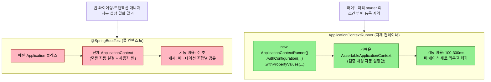
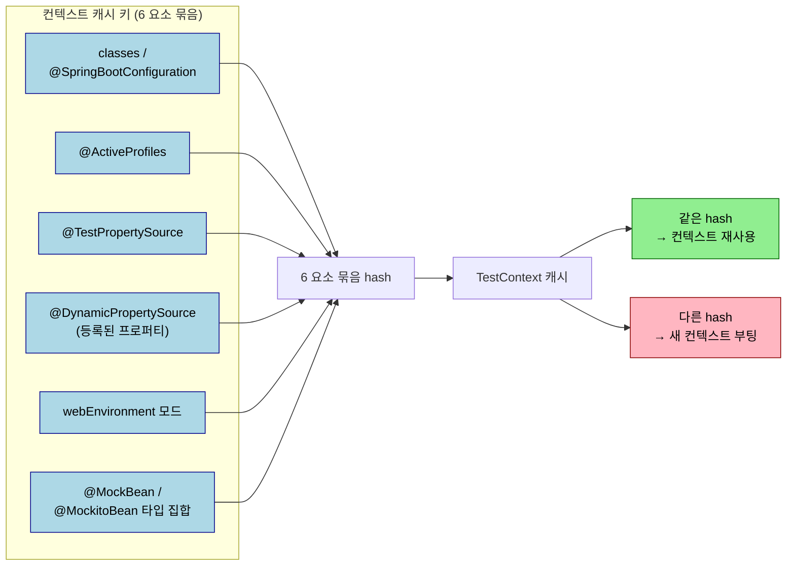

# @SpringBootTest와 ApplicationContextRunner

## 학습 목표

이 문서를 읽고 나면 다음을 할 수 있습니다.

1. `@SpringBootTest` 와 `ApplicationContextRunner` 가 잡는 결함의 차이를 비교하고 어느 자리에 어느 쪽을 쓸지 결정할 수 있습니다.
2. `webEnvironment` 4 가지 모드(MOCK/RANDOM_PORT/DEFINED_PORT/NONE) 의 트레이드오프를 설명하고 시나리오에 맞게 고를 수 있습니다.
3. 컨텍스트 캐시 키를 결정하는 요소를 3 가지 이상 들고, `@MockBean` 누적으로 캐시가 갈라지는 비용을 정량으로 예측할 수 있습니다.
4. 라이브러리 starter 의 빈 등록 계약(조건부 등록) 을 `ApplicationContextRunner` 로 100~300ms 안에 검증하는 테스트를 작성할 수 있습니다.


---

> 01-03 까지의 슬라이스 테스트는 컨텍스트의 일부만 띄웠습니다. 통합 테스트로 올라가면 자동 설정·빈 와이어링·트랜잭션 매니저 같은 결합 결과 자체가 검증 대상이 되며, `@SpringBootTest` 가 그 진입점입니다. 다만 풀 컨텍스트가 항상 답은 아닙니다. AutoConfiguration 라이브러리 검증에는 `ApplicationContextRunner` 가 적합니다.


## 한 줄 정의

`@SpringBootTest` 는 메인 애플리케이션의 자동 설정을 통째로 띄우는 통합 진입점이고, `ApplicationContextRunner` 는 라이브러리의 자동 설정 빈 등록 계약을 가벼운 컨테이너로 검증하는 도구입니다.


## 왜 필요한가

> 풀 컨텍스트가 답인 자리와 가벼운 자체 컨테이너가 답인 자리는 다릅니다. 둘을 섞으면 빌드가 무거워지거나 검증 의도가 흐려집니다.

`@SpringBootTest` 가 잡는 결함은 자동 설정·빈 와이어링·트랜잭션 매니저처럼 결합 결과 자체입니다. 단위 테스트나 슬라이스로는 이 결합이 보이지 않습니다. 그러나 모든 검증을 `@SpringBootTest` 로 올리면 컨텍스트 기동 비용이 누적되고, 한 테스트가 수 초로 늘어나 빌드가 무거워집니다.

라이브러리 starter 를 만들면 또 다른 검증 요구가 생깁니다. "schema-registry url 이 설정되면 retry 빈을 등록하고, 없으면 안 한다" 같은 조건부 빈 등록 계약입니다. `@SpringBootTest` 로 실행하면 메인 애플리케이션이 필요해 라이브러리 단독 검증이 어렵습니다. `ApplicationContextRunner` 는 같은 의도를 100~300ms 짜리 자체 컨테이너에서 풉니다.

두 도구가 다른 결함을 잡는다는 점이 이 챕터의 출발점입니다. 풀 컨텍스트 통합과 라이브러리 자체 검증의 분장이 명확해지면 빌드 시간이 누적되지 않고, 검증 의도도 흐려지지 않습니다.

다음 다이어그램은 두 도구가 *어떤 결함* 을 잡고 *얼마나 무거운 컨테이너* 를 띄우는지를 한 장에 정리합니다. 같은 "자동 설정 검증" 이라는 의도지만 적용 자리와 비용이 다릅니다.



`@SpringBootTest` 는 메인 애플리케이션 컨텍스트를 *통째로* 띄우므로 결합 결과(빈 와이어링·트랜잭션 매니저·필터 체인) 가 검증됩니다. `ApplicationContextRunner` 는 *필요한 자동 설정만* 골라 띄우므로 라이브러리의 *조건부 빈 등록* 같은 좁은 계약에 맞습니다. 둘을 섞어 쓰면 빌드 시간이 누적되거나 검증 의도가 흐려집니다 — 도구 선택이 곧 검증 의도의 표현입니다.


## 아키텍처

### @SpringBootTest 의 webEnvironment 옵션

`@SpringBootTest` 는 메인 애플리케이션의 자동 설정을 그대로 띄웁니다. `webEnvironment` 속성으로 web 계층을 어떻게 처리할지 4 가지 모드를 선택합니다.

| 모드 | 의미 | 사용처 |
|------|------|--------|
| `MOCK`(기본) | Servlet API 를 mock 으로 채움. `MockMvc` 와 결합 | API 호출 시나리오, 톰캣 기동 비용 회피 |
| `RANDOM_PORT` | 임의 포트로 실제 서버 기동 | 외부 클라이언트(WebTestClient/RestClient)로 호출 |
| `DEFINED_PORT` | `server.port` 로 기동 | 로컬 디버깅. CI 에서는 포트 충돌 위험 |
| `NONE` | 웹 환경 없음 | 배치/메시지 컨슈머만 검증 |

`MOCK` + `@AutoConfigureMockMvc` 조합이 가장 흔합니다. 톰캣을 띄우지 않고도 DispatcherServlet 흐름을 통합 컨텍스트에서 검증할 수 있어 비용이 낮습니다. 외부에서 실제 HTTP 로 들어오는 흐름까지 검증하려면 `RANDOM_PORT` 로 올립니다.

```java
@DirtiesContext
@AutoConfigureMockMvc
@ActiveProfiles("test")
@SpringBootTest(
    classes = ExecutorApplication.class,
    webEnvironment = SpringBootTest.WebEnvironment.MOCK
)
class ExampleMessageFlowE2ETest { ... }
```

`classes` 속성은 어느 메인 애플리케이션 컨텍스트를 띄울지를 명시합니다. 멀티모듈 프로젝트에서 메인 클래스를 자동 탐색하지 못할 때 또는 두 개 이상의 진입점이 있을 때 필요합니다.

### ApplicationContextRunner 의 위치

`ApplicationContextRunner` 는 `@SpringBootTest` 와 같은 의도(자동 설정 검증)를 라이브러리 단위에서 풉니다. `WebApplicationContextRunner` 와 `ReactiveWebApplicationContextRunner` 는 같은 패턴의 web/reactive 변형입니다.


## 핵심 개념

### 결합 어노테이션 — `@ActiveProfiles`, `@DirtiesContext`, `@AutoConfigureMockMvc`

`@ActiveProfiles("test")` 는 `application-test.yml` 같은 프로필 전용 설정을 활성화합니다. test 프로필에서 외부 서비스 URL 을 stub 으로 바꾸고, 스케줄러 interval 을 무한대로 늘려 자동 실행을 억제하는 식으로 결정성을 확보합니다. 프로필 분리는 yml 파일 수가 늘어 보일 수 있지만 환경 의존을 한곳에 모은다는 면에서 유지보수가 쉽습니다.

`@DirtiesContext` 는 컨텍스트 캐시를 무효화합니다. 빈 상태가 테스트 간 leak 되어 결과가 변할 수 있을 때 명시합니다. 단점은 컨텍스트가 다시 떠 비용이 든다는 점이며, 남용하면 빌드가 분 단위로 늘어납니다. 가장 흔한 패턴은 클래스 레벨에 한 번 붙이고, 테스트 간 격리가 필요한 자원(예: Outbox 테이블, Kafka 토픽 오프셋) 은 `@BeforeEach` 의 cleanup 으로 처리하는 것입니다.

`@AutoConfigureMockMvc` 는 컨텍스트에 `MockMvc` 빈을 등록해 `@Autowired` 로 주입받게 합니다. `@SpringBootTest(webEnvironment=MOCK)` 와 자주 쌍을 이루며, `@WebMvcTest` 와 달리 풀 컨텍스트를 띄우므로 시큐리티·인터셉터·전역 검증기가 모두 활성화됩니다.

### 컨텍스트 캐시 — 양날의 검

`@SpringBootTest` 는 같은 어노테이션 조합을 가진 테스트 사이에 컨텍스트를 공유합니다. 100 개 테스트가 같은 설정이면 컨텍스트가 1 개만 떠 빌드가 빠릅니다. 캐시 키는 다음 요소들의 조합으로 결정됩니다.

- `classes` 또는 `@SpringBootConfiguration` 자동 탐색 결과
- `@ActiveProfiles`
- `@TestPropertySource`
- `@DynamicPropertySource` 의 등록된 프로퍼티
- `webEnvironment` 모드
- `@MockBean`/`@MockitoBean` 의 타입 집합

`@MockBean` 한 줄이 다르면 캐시 키가 갈라져 컨텍스트가 추가로 뜹니다. 슬라이스/통합 테스트가 늘어나기 시작하면 `gradle test --info` 로 "Application context starts/stops" 횟수를 모니터링합니다. 한 빌드에 컨텍스트가 10 개 이상 뜨면 `@MockBean` 사용처를 줄일 후보입니다.

다음 다이어그램은 캐시 키를 구성하는 6 요소가 어떻게 묶여 *같은 컨텍스트 재사용 vs 새 컨텍스트 부팅* 을 가르는지를 한 장에 박습니다. 같은 묶음의 키를 가진 테스트 클래스들끼리만 컨텍스트를 공유합니다.



이 그림이 *왜* `@MockBean` 누적이 빌드 시간을 갉는지를 한눈에 보여 줍니다. 6 요소 중 하나만 달라도 hash 가 갈라져 컨텍스트가 추가로 뜨는데, `@MockBean` 타입 집합은 테스트 클래스별로 가장 쉽게 달라지는 자리입니다. `@TestConfiguration` 한 곳에 공통 mock 을 모아 *같은 타입 집합* 을 만들면 캐시가 잘 합쳐집니다.

`@DirtiesContext(classMode = AFTER_CLASS)` 는 클래스 단위로 컨텍스트를 폐기합니다. 메서드 단위(`AFTER_EACH_TEST_METHOD`) 는 비용이 커서 마지막 수단으로만 씁니다.

### @TestConfiguration + @EnableAutoConfiguration(exclude=...)

라이브러리 자체 통합 테스트(IT) 에서 메인 애플리케이션이 없으면, 테스트가 직접 자동 설정 가져올 클래스를 짜야 합니다.

```java
@SpringBootTest(classes = KafkaErrorIntegrationIT.TestConfig.class)
@EmbeddedKafka(
    partitions = 1,
    controlledShutdown = true,
    topics = {"test-business-topic", "tps.v305p.dlq"}
)
class KafkaErrorIntegrationIT {

    @Configuration
    @EnableAutoConfiguration(exclude = {
        OutboxAutoConfiguration.class,
        MessagingTracingAutoConfiguration.class,
        KafkaJsonConsumerConfig.class,
        KafkaRetryTemplateConfig.class,
        TopicConfig.class,
        HibernateJpaAutoConfiguration.class,
        DataSourceAutoConfiguration.class
    })
    static class TestConfig {
        @Bean StubListener stubListener() { return new StubListener(); }
    }

    static class StubListener {
        @KafkaListener(topics = "test-business-topic", groupId = "test-error-group")
        public void onMessage(@Payload Object payload) { }
    }
}
```

`@EnableAutoConfiguration(exclude = {...})` 로 검증 대상이 아닌 자동 설정을 제외해 컨텍스트를 가볍게 만듭니다. JPA·DataSource 가 검증 대상이 아니면 빼는 편이 컨테이너 기동을 단축합니다. `@SpringBootTest(classes = ...TestConfig.class)` 로 명시 진입점을 지정해, 메인 애플리케이션이 없는 라이브러리에서도 자동 설정 흐름을 그대로 쓸 수 있게 합니다.


## 실습 — ApplicationContextRunner 로 라이브러리 계약 검증

자체 starter·자동 설정 라이브러리를 만들면, "어떤 조건에서 어떤 빈이 등록되는가" 라는 계약을 검증해야 합니다.

```java
import org.springframework.boot.autoconfigure.AutoConfigurations;
import org.springframework.boot.test.context.runner.ApplicationContextRunner;

class KafkaRetryTemplateConfigTest {

    private final ApplicationContextRunner runner = new ApplicationContextRunner()
        .withConfiguration(AutoConfigurations.of(
            KafkaAutoConfiguration.class,
            KafkaRetryTemplateConfig.class
        ));

    @Test
    @DisplayName("schema.registry.url 이 설정되면 retryKafkaTemplate 빈이 KafkaAvroSerializer 로 등록된다")
    void retryKafkaTemplate_isRegistered_whenSchemaRegistryConfigured() {
        runner
            .withPropertyValues(
                "spring.kafka.bootstrap-servers=localhost:9092",
                "spring.kafka.properties.schema.registry.url=http://schema-registry:8081"
            )
            .run(context -> {
                assertThat(context).hasBean(KafkaRetryTemplateConfig.RETRY_KAFKA_TEMPLATE_BEAN_NAME);

                @SuppressWarnings("unchecked")
                KafkaTemplate<String, SpecificRecord> template = context.getBean(
                    KafkaRetryTemplateConfig.RETRY_KAFKA_TEMPLATE_BEAN_NAME,
                    KafkaTemplate.class
                );
                ProducerFactory<String, SpecificRecord> factory = template.getProducerFactory();
                Map<String, Object> props = factory.getConfigurationProperties();

                assertThat(props.get(ProducerConfig.VALUE_SERIALIZER_CLASS_CONFIG))
                    .isEqualTo(KafkaAvroSerializer.class);
                assertThat(props.get("schema.registry.url"))
                    .isEqualTo("http://schema-registry:8081");
            });
    }

    @Test
    @DisplayName("schema.registry.url 미설정 시 retry 전용 빈은 만들지 않는다 (Avro 비활성 환경 호환)")
    void retryKafkaTemplate_isAbsent_whenSchemaRegistryMissing() {
        runner
            .withPropertyValues("spring.kafka.bootstrap-servers=localhost:9092")
            .run(context -> assertThat(context)
                .doesNotHaveBean(KafkaRetryTemplateConfig.RETRY_KAFKA_TEMPLATE_BEAN_NAME));
    }
}
```

핵심 요소는 세 가집니다.

1. **`withConfiguration(AutoConfigurations.of(...))`** — 검증 대상 자동 설정과 의존하는 Spring 의 자동 설정만 명시합니다.
2. **`withPropertyValues(...)`** — 환경별 분기를 시뮬레이션합니다.
3. **`run(context -> { ... })` 안에서 단언** — `AssertableApplicationContext` 의 `hasBean`/`doesNotHaveBean` 으로 등록 여부를, `getBean(...)` 으로 등록된 빈의 실제 동작을 검증합니다.

`ApplicationContextRunner` 는 컨텍스트를 가볍게 만들고 폐기합니다. 한 케이스가 100~300ms 수준이며, 라이브러리의 모든 분기를 한 클래스 안에서 다 돌려도 빌드 시간이 거의 늘지 않습니다. `@SpringBootTest` 로 같은 검증을 했다면 한 케이스당 수 초가 들었을 것입니다.

### TPS 사례 — 라이브러리 자체 검증의 두 도구

> 이 챕터가 인용하는 네 자리의 실 파일 경로를 한 자리에 모아 둡니다. `ApplicationContextRunner` 와 `@SpringBootTest + @TestConfiguration` 가 같은 모듈(`message-lib`) 안에 *검증 의도별* 로 분리되어 있습니다.
>
> | 자리 | 파일 경로 (`~/okestro/tps-gitlab2/` 기준) |
> |------|------|
> | `ApplicationContextRunner` 빈 등록 계약 | `message-lib/src/test/java/org/okestro/tps/messaging/config/KafkaRetryTemplateConfigTest.java` |
> | `ApplicationContextRunner` + reflection 결합 | `message-lib/src/test/java/org/okestro/tps/messaging/tracing/MessagingTracingAutoConfigurationIT.java` |
> | `@SpringBootTest + @TestConfiguration` (EmbeddedKafka) | `message-lib/src/test/java/org/okestro/tps/messaging/config/KafkaErrorIntegrationIT.java` |
> | 풀 E2E (`@SpringBootTest + @AutoConfigureMockMvc`) | `executor/engine/src/test/java/org/okestro/tps/example/e2e/ExampleMessageFlowE2ETest.java` |

메시징 라이브러리는 `ApplicationContextRunner` 와 `@SpringBootTest + @TestConfiguration + EmbeddedKafka` 를 검증 대상에 따라 분리합니다.

`KafkaRetryTemplateConfigTest` 는 "schema.registry.url 이 있으면 retryKafkaTemplate 등록, 없으면 미등록" 이라는 라이브러리 계약을 `ApplicationContextRunner` 로 검증합니다. 두 케이스 모두 100~300ms 안에 끝나며, EmbeddedKafka 를 띄우지 않습니다. 이 분기는 빈 등록 조건에 한정된 검증이라 컨테이너가 필요 없습니다.

`MessagingTracingAutoConfigurationIT` 는 더 흥미롭습니다. `ApplicationContextRunner` 로 컨텍스트를 띄워 `CorrelationIdRecordInterceptor` 가 모든 `ConcurrentKafkaListenerContainerFactory` 빈에 자동 부착되는지 reflection 으로 검증하고, interceptor 의 set/clear ThreadLocal 흐름은 컨텍스트 없이 직접 호출해 검증합니다. 한 클래스 안에서 두 종류의 검증을 결합하되, 각각이 가장 가벼운 도구를 씁니다.

```java
@Test
@DisplayName("S1: interceptor 가 모든 ConcurrentKafkaListenerContainerFactory 빈에 자동 부착된다")
void S1_interceptor_autoAttachedToAllListenerFactories() {
    contextRunner.run(context -> {
        ConcurrentKafkaListenerContainerFactory<?, ?> factory =
            context.getBean(ConcurrentKafkaListenerContainerFactory.class);
        CorrelationIdRecordInterceptor interceptor =
            context.getBean(CorrelationIdRecordInterceptor.class);

        Object attached = ReflectionTestUtils.getField(factory, "recordInterceptor");
        assertThat(attached).isSameAs(interceptor);
    });
}
```

`ConcurrentKafkaListenerContainerFactory` 가 `recordInterceptor` getter 를 노출하지 않아 `ReflectionTestUtils.getField` 로 검증합니다. reflection 은 본래 신중해야 하지만, "라이브러리가 외부 빈에 자동 부착되었는가" 라는 계약은 다른 방법으로 검증하기 어렵습니다. 이런 케이스가 reflection 의 적정한 용도입니다.

`KafkaErrorIntegrationIT` 는 EmbeddedKafka 가 본질이라 `@SpringBootTest + @TestConfiguration` 패턴을 씁니다. 자세한 내용은 02-02 챕터에서 다룹니다.


## 함정과 회피

> 처음 만나면 디버깅에 시간이 가는 항목들입니다.

### 1. `@SpringBootConfiguration` 자동 탐색의 임의 선택

멀티모듈 프로젝트에서 두 개 이상이 보이면 임의 선택이 발생할 수 있고, 의도와 다른 컨텍스트가 뜹니다. `classes = ...Application.class` 를 명시하는 편이 안전합니다.

### 2. `@DynamicPropertySource` 의 supplier 의무

정적 메서드여야 하고, `DynamicPropertyRegistry.add(key, supplier)` 형태로 supplier 를 넘겨야 합니다. 직접 값을 넘기면 컨텍스트 시작 시점이 아니라 메서드 호출 시점에 evaluate 되어 엉뚱한 값이 들어갈 수 있습니다.

### 3. `@MockBean` 누적으로 인한 캐시 갈라짐

같은 mock 을 여러 클래스에서 쓰면 공통 부모 추상 테스트 클래스(`AbstractMariaDbIntegrationTest` 같은 패턴) 에 `@MockBean` 을 모아 캐시 키를 일치시킵니다.

### 4. `@TestPropertySource` vs `@DynamicPropertySource`

전자는 정적이고 후자는 동적(예: Testcontainers JDBC URL) 입니다. 둘을 잘못 섞으면 동적 값이 정적 키를 덮지 못해 디버깅이 어렵습니다. Testcontainers 와 결합할 때는 `@DynamicPropertySource` 를 우선합니다.

### 5. `@MockitoBean` 버전 의존

Boot 3.4 이상에서만 동작합니다. 3.x 초기 버전이면 `@MockBean` 을 그대로 쓰되, 캐시 갈라짐을 인지합니다.


## 자가 점검 — 문제

> 답을 먼저 입으로 말해 보고, 막히면 아래 §정답 섹션을 확인합니다. 본문을 다시 펴 보지 말고 *자기 언어로* 설명할 수 있는지 점검하는 것이 목적입니다.

1. `@SpringBootTest` 의 `webEnvironment` 4가지 중 `MOCK` 을 가장 자주 쓰는 이유는?
2. 컨텍스트 캐시 키를 결정하는 요소를 3가지 이상 들 수 있는가?
3. `ApplicationContextRunner` 가 `@SpringBootTest` 보다 적합한 자리는 어디인가?
4. `@DynamicPropertySource` 와 `@TestPropertySource` 를 같이 쓸 때 함정은?
5. 라이브러리 자체 IT 에 `@TestConfiguration + @EnableAutoConfiguration(exclude=...)` 가 필요한 이유는?


## 자가 점검 — 정답

1. 톰캣을 띄우지 않고도 DispatcherServlet 흐름을 통합 컨텍스트 안에서 검증할 수 있어 비용이 낮기 때문입니다. `MockMvc` 와 결합하면 컨트롤러·필터·인터셉터·시큐리티가 모두 활성화된 상태에서 API 호출 시나리오를 빠르게 검증할 수 있고, 실제 HTTP 호출이 본질일 때만 `RANDOM_PORT` 로 올립니다.
2. 6 요소 중 셋 이상을 들 수 있어야 합니다. `classes` 또는 `@SpringBootConfiguration` 자동 탐색 결과, `@ActiveProfiles`, `@TestPropertySource`, `@DynamicPropertySource` 가 등록한 프로퍼티, `webEnvironment` 모드, `@MockBean`/`@MockitoBean` 의 타입 집합. 한 요소만 달라도 캐시 hash 가 갈라져 컨텍스트가 추가로 뜹니다.
3. AutoConfiguration 라이브러리의 *조건부 빈 등록* 계약을 검증하는 자리입니다. 메인 애플리케이션 없이 `withConfiguration(AutoConfigurations.of(...))` 로 검증 대상 자동 설정만 띄우고, `withPropertyValues(...)` 로 환경 분기를 시뮬레이션해 한 케이스를 100~300ms 안에 봅니다. `@SpringBootTest` 로 같은 검증을 하면 한 케이스가 수 초로 늘어납니다.
4. 정적/동적 키의 결합이 헷갈리고, 같은 키에 두 소스가 동시에 값을 넣으면 우선순위가 직관과 어긋나 디버깅이 어렵습니다. 특히 Testcontainers 결합처럼 컨테이너 기동 후에야 결정되는 값(JDBC URL 등) 은 정적 `@TestPropertySource` 로는 표현할 수 없으므로 `@DynamicPropertySource` 를 우선합니다.
5. 라이브러리 모듈에는 메인 애플리케이션이 없어 `@SpringBootTest` 가 자동 탐색할 진입점이 없습니다. `@TestConfiguration` 으로 명시 진입점을 만들고 `@EnableAutoConfiguration(exclude = {...})` 로 검증 대상이 아닌 자동 설정(DataSource·JPA 등) 을 제외하면, 라이브러리 자체 자동 설정 흐름을 그대로 쓰면서도 컨텍스트가 가벼워집니다.


## 다음 챕터

02-01 부터는 통합 테스트 영역으로 들어갑니다. Testcontainers 와 `@ServiceConnection`, init script, Object Mother 시드 패턴, Gradle `integrationTest` task 분리를 정리합니다.
