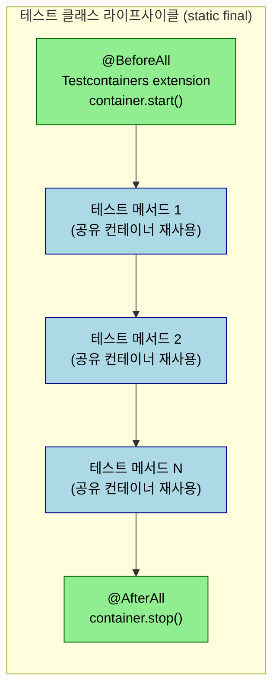
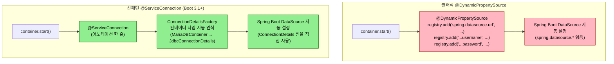

# Testcontainers와 진짜 DB 통합 테스트

## 학습 목표

이 문서를 읽고 나면 다음을 할 수 있습니다.

1. 클래식 `@Testcontainers` + `@DynamicPropertySource` 패턴과 Boot 3.1+ `@ServiceConnection` 신패턴을 비교하고 어느 자리에 어느 쪽을 쓸지 판단할 수 있습니다.
2. `@Container static final` 의 클래스 단위 공유 라이프사이클을 그림 없이 설명하고, 인스턴스 필드로 두면 어떤 비용이 생기는지 예측할 수 있습니다.
3. Context 재사용을 깨뜨리는 5 요인을 식별하고, `@MockBean` 조합 다양화가 빌드 시간에 미치는 영향을 정량으로 설명할 수 있습니다.
4. 컨테이너 init script 와 `@BeforeEach` reset+seed 의 책임 분장을 적용해 통합 테스트의 결정성과 비용을 동시에 잡을 수 있습니다.


JPA·MyBatis 매핑이 깨졌는지, 트랜잭션 경계가 의도대로 닫혔는지, 네이티브 쿼리가 컬럼 타입과 맞는지 같은 결함은 H2 같은 인메모리 DB로는 잡히지 않는 경우가 많습니다. MariaDB 의 `JSON` 타입, MySQL 의 `BIT(1)` 매핑, 페이지네이션 함수 차이, 콜레이션 정렬 같은 차이가 결정적이며, 이를 회피하려고 H2 호환 모드를 쓰면 실제 운영 DB 와의 갭이 더 커집니다. Testcontainers 는 Docker 컨테이너로 진짜 DB 를 띄워 통합 테스트 안에서 사용하게 해 줍니다. 이 챕터는 클래식 `@Testcontainers` 패턴과 Spring Boot 3.1+ 의 `@ServiceConnection` 신패턴, 시드 데이터·도메인 assertion 헬퍼·Gradle task 분리를 정리합니다.


## 통합 테스트가 잡는 결함

진짜 DB 가 본질인 결함은 다음과 같습니다.

- JPA 엔티티 매핑과 실제 컬럼 타입의 불일치 — 한국 자모 정렬, JSON·BLOB 컬럼 길이, 시간 정밀도(`DATETIME(6)` vs `TIMESTAMP`)
- 네이티브 쿼리 / QueryDSL 의 함수가 DB 별로 다르게 동작 (`LIMIT` 위치, `ROW_NUMBER()`, JSON 함수)
- 트랜잭션 격리 수준과 락 동작 — `READ_COMMITTED` 와 `SERIALIZABLE` 차이, `SELECT FOR UPDATE` 의 인덱스 의존
- 명명 전략(`UpperSnakeCaseNamingStrategy` 같은 커스텀) 이 실제 컬럼명과 매핑되는가
- DB 별 시퀀스/AUTO_INCREMENT 동작과 트랜잭션 내 행동 차이

H2 호환 모드는 위 결함을 거의 잡지 못합니다. 운영이 MariaDB 면 통합 테스트도 MariaDB, 운영이 PostgreSQL 이면 통합 테스트도 PostgreSQL 이 원칙입니다.


## 클래식 @Testcontainers 패턴

JUnit 5 의 `@Testcontainers` 확장 + `@Container` 필드 + `@DynamicPropertySource` 의 조합이 클래식입니다. 메시징 라이브러리의 `OutboxPollerIT` 가 이 형태를 보여 줍니다.

```java
@SpringBootTest(classes = OutboxPollerIT.TestConfig.class)
@EmbeddedKafka(partitions = 1, controlledShutdown = true)
@Testcontainers
class OutboxPollerIT {

    @Container
    static final MariaDBContainer<?> MARIA_DB = new MariaDBContainer<>("mariadb:10.11")
        .withDatabaseName("tps_test")
        .withInitScript("testcontainers-init.sql");

    @DynamicPropertySource
    static void registerProps(DynamicPropertyRegistry registry) {
        registry.add("spring.datasource.url", MARIA_DB::getJdbcUrl);
        registry.add("spring.datasource.username", MARIA_DB::getUsername);
        registry.add("spring.datasource.password", MARIA_DB::getPassword);
        registry.add("spring.jpa.hibernate.ddl-auto", () -> "none");
    }
}
```

핵심은 세 가집니다. 첫째, `@Container static final` 필드는 클래스 단위로 컨테이너 라이프사이클을 가져 한 번 띄워 모든 테스트가 공유합니다. JUnit 5 확장이 컨테이너의 시작/정지를 자동으로 다룹니다. 둘째, `@DynamicPropertySource` 가 컨테이너 기동 후 결정되는 JDBC URL 을 Spring 프로퍼티로 등록합니다. supplier 형태로 넘겨야 컨텍스트 시작 시점에 평가됩니다. 셋째, `withInitScript("testcontainers-init.sql")` 로 컨테이너 기동 시 DDL 을 주입합니다. Hibernate `ddl-auto=none` 과 결합해, 테스트가 검증하는 스키마가 운영과 동일한 init 흐름을 거치게 합니다.

`@Testcontainers(disabledWithoutDocker = true)` 옵션은 Docker 가 없는 환경에서 통합 테스트를 자동 skip 시킵니다. 로컬 머신에 Docker 가 없는 개발자가 단위 테스트만 빠르게 돌리고 싶을 때 유용합니다.

다음 다이어그램은 `@Container static final` 컨테이너가 클래스 단위로 한 번 떠서 모든 테스트 메서드를 공유하는 라이프사이클을 그림으로 박습니다. 같은 컨테이너를 인스턴스 필드(`@Container` 만, `static` 없음) 로 두면 박스가 메서드마다 하나씩 늘어나, 한 클래스 안에서 컨테이너 N 개가 순차로 뜨고 내려가는 형태가 됩니다.



인스턴스 필드로 두면 위 그림의 `start` → `stop` 사이클이 *메서드마다* 반복됩니다. 컨테이너 기동에 수 초가 걸리므로 한 클래스가 메서드 10 개면 빌드가 수십 초 늘어납니다. `static final` 이 사실상의 표준인 이유가 이 그림에서 한눈에 보입니다.


## Spring Boot 3.1+ @ServiceConnection 신패턴

Spring Boot 3.1 부터 `spring-boot-testcontainers` 가 `@ServiceConnection` 어노테이션을 도입했습니다. `@DynamicPropertySource` 보일러플레이트가 사라지고, 컨테이너 종류별로 Spring 이 직접 적절한 프로퍼티를 매핑합니다. operator/ticket 의 `AbstractMariaDbIntegrationTest` 가 이 패턴입니다.

```java
@Tag("integration")
@ActiveProfiles("test")
@SpringBootTest
public abstract class AbstractMariaDbIntegrationTest {

    @ServiceConnection
    @SuppressWarnings("resource")
    protected static final MariaDBContainer<?> MARIADB =
        new MariaDBContainer<>(DockerImageName.parse("mariadb:10.11"))
            .withDatabaseName("TPS")
            .withUrlParam("characterEncoding", "utf8")
            .withUrlParam("useUnicode", "true");

    static {
        MARIADB.start();
    }

    @Autowired
    private JdbcTemplate jdbcTemplate;

    @BeforeEach
    protected void setUpBaseData() {
        TicketTestUserContext.setDefaultUser();
        TicketBaseDataSeeder.resetAndSeed(jdbcTemplate);
    }
}
```

차이는 두 가집니다. `@Testcontainers` 확장이 없고 `static {}` 블록에서 직접 `start()` 를 부릅니다. `@DynamicPropertySource` 메서드도 없습니다. `@ServiceConnection` 한 줄이 JDBC URL·username·password 를 자동으로 Spring DataSource 자동 설정에 연결합니다. `MariaDBContainer` 외에 `KafkaContainer`, `RedisContainer`, `MongoDBContainer` 등 대부분의 인프라 컨테이너가 같은 패턴을 지원합니다.

`AbstractMariaDbIntegrationTest` 같은 추상 베이스 클래스는 `@Tag("integration")` 과 `@ActiveProfiles("test")` 를 한 곳에 모아 둡니다. 통합 테스트가 늘어나도 어노테이션 일관성이 유지되며, 컨텍스트 캐시가 잘 합쳐져 빌드가 빨라집니다. `@BeforeEach` 의 `TicketBaseDataSeeder.resetAndSeed(jdbcTemplate)` 는 매 테스트마다 시드를 초기화합니다.

다음 다이어그램은 `@ServiceConnection` 이 클래식 `@DynamicPropertySource` 보일러플레이트를 어떻게 자동 매핑으로 대체하는지를 두 경로로 비교합니다. 같은 결과(Spring DataSource 가 컨테이너에 연결됨) 를 만들지만 코드 경로의 길이가 다릅니다.



신패턴은 supplier 인자 3 개 등록을 한 어노테이션으로 줄입니다. `ConnectionDetailsFactory` 가 컨테이너 타입별로 등록되어 있어, `KafkaContainer` 면 `KafkaConnectionDetails` 가, `RedisContainer` 면 `RedisConnectionDetails` 가 자동으로 만들어집니다. 보일러플레이트는 라이브러리 안에 있고 사용처는 어노테이션만 답니다.


## 시드 데이터와 Object Mother 패턴

진짜 DB 가 떠 있어도 매 테스트가 같은 초기 상태에서 시작해야 결정적입니다. 시드를 만드는 두 가지 흐름이 있습니다.

**컨테이너 init script**: 테이블 생성과 정적 마스터 데이터(코드 테이블, 권한 코드) 를 컨테이너 기동 시점에 한 번 주입합니다. `withInitScript("testcontainers-init.sql")` 또는 `withCopyFileToContainer(...)` 로 SQL 을 넘깁니다. 컨테이너 단위로 한 번만 실행되므로 매 테스트마다 다시 돌지 않습니다.

**테스트 베이스의 reset+seed**: 매 테스트가 시작될 때 트랜잭션 데이터(워크플로우, 티켓, 결재 같은 가변 도메인 데이터) 를 리셋하고 다시 채웁니다. `@BeforeEach` 에서 `TRUNCATE` 또는 `DELETE` 로 비우고, fixture 메서드로 시나리오에 필요한 데이터를 넣습니다.

```java
@BeforeEach
void setUpWorkflowApiCreateIT() {
    clearWorkflowAggregateTables();
}
```

테스트별 fixture 는 **Object Mother** 패턴으로 정리하면 가독성이 좋습니다. `WorkflowApiRequestFixture.nonApprovalComponentRequest()`, `WorkflowApiRequestFixture.wholeTaskCreateRequest()` 처럼 의도가 드러나는 정적 메서드로 시나리오 입력을 만듭니다.

```java
WorkflowCreateRequestDto requestDto = WorkflowApiRequestFixture.wholeTaskCreateRequest();
requestDto.setStepList(List.of(WorkflowApiRequestFixture.stepRequest(
    10,
    "Build",
    List.of(WorkflowApiRequestFixture.nonApprovalComponentRequest())
)));
```

대안으로 `FixtureMonkey`, `EasyRandom` 같은 자동 생성 도구가 있습니다. 입력의 다양성을 자동으로 확보해 코너 케이스를 발견하기 쉽지만, 회귀 보호 테스트에서는 결정성이 우선이라 정적 메서드 fixture 가 더 적합니다.


## 도메인 assertion 헬퍼

통합 테스트의 단언이 길어지면 가독성이 급격히 떨어집니다. `assertThat(workflowRepository.findByCode(...).getStepList())...` 같은 라인이 5~6 개 늘어 가면 한눈에 무엇을 검증하는지 보이지 않습니다. 도메인 단위의 assertion 헬퍼를 베이스 클래스(또는 TestSupport) 에 모으면 각 테스트가 의도만 표현합니다.

```java
assertWorkflowSequenceValue(8);
assertWorkflowCoreAggregateCounts(
    WorkflowApiRequestFixture.GENERATED_WORKFLOW_CODE,
    WorkflowApiRequestFixture.INITIAL_WORKFLOW_VERSION,
    new WorkflowCoreAggregateCounts(1, 2, 1, 1, 1)
);
assertWorkflowVersionCreated();
assertWorkflowAuditUsers(CREATOR_USER_ID);
assertNoApprovalPersistence(
    WorkflowApiRequestFixture.GENERATED_WORKFLOW_CODE,
    WorkflowApiRequestFixture.INITIAL_WORKFLOW_VERSION
);
```

헬퍼는 내부에서 JdbcTemplate 또는 EntityManager 로 데이터를 조회하고 AssertJ 단언을 합쳐 도메인 의미가 위반되면 실패하게 만듭니다. 헬퍼 이름이 도메인 어휘를 따르므로 테스트는 시나리오 묘사에 가까워집니다. 새 시나리오를 추가할 때도 fixture 와 헬퍼를 조합해 빠르게 표현됩니다.


## Gradle integrationTest task 분리와 가드

01-01 에서 본 것처럼 통합 테스트는 별도 task 로 분리합니다. operator/ticket 의 build.gradle 은 추가로 환경 가드를 둡니다.

```groovy
def testcontainersDockerSocketOverride = providers
    .environmentVariable('TESTCONTAINERS_DOCKER_SOCKET_OVERRIDE')
    .map { it.trim() ? it.trim() : '/var/run/docker.sock' }
    .orElse('/var/run/docker.sock')

tasks.register('integrationTest', Test) {
    useJUnitPlatform { includeTags 'integration' }
    include '**/*IT.class'

    environment 'TESTCONTAINERS_DOCKER_SOCKET_OVERRIDE', testcontainersDockerSocketOverride.get()

    doFirst {
        String dockerSocketOverride = testcontainersDockerSocketOverride.get()
        if (dockerSocketOverride.contains('.colima') || dockerSocketOverride.startsWith('/Users/')) {
            throw new GradleException(
                'TESTCONTAINERS_DOCKER_SOCKET_OVERRIDE must be /var/run/docker.sock for colima integration tests.'
            )
        }
        if (testcontainersRyukDisabled.get().equalsIgnoreCase('true')) {
            throw new GradleException('TESTCONTAINERS_RYUK_DISABLED must not be true for integrationTest.')
        }
    }
}
```

두 가지 가드를 봅니다. Colima 같은 사용자별 Docker 소켓 경로가 누군가의 환경에서 통합 테스트로 흘러들면 다른 사람의 머신에서 테스트가 실패할 수 있어 빌드 시점에 차단합니다. 또 Testcontainers Ryuk 가 꺼지면 컨테이너 누수가 일어나 다음 빌드 포트 충돌의 원인이 되므로, 이것도 빌드 시점에 차단합니다. 빌드 스크립트가 코드라는 사실을 이용해 운영 사고를 가장 값싼 단계에서 잡습니다.


## `@DirtiesContext` 회피와 Context 재사용

> 통합 테스트의 빌드 시간은 *Context 부팅 횟수*가 결정합니다. 한 번 뜬 Context 를 여러 테스트가 재사용해야 빌드가 분 단위로 늘지 않습니다.

`@DirtiesContext` 는 *테스트 후 ApplicationContext 를 무효화*해 다음 테스트에서 새로 부팅시킵니다.

```java
@SpringBootTest
@DirtiesContext  // ← 매 테스트 후 Context 재부팅
class OrderServiceTest { ... }
```

`@SpringBootTest` 가 수 초~수십 초의 부팅을 요구하므로 `@DirtiesContext` 가 붙은 테스트가 100 개면 *총 비용이 빌드 시간 분 단위*로 누적됩니다. TPS 는 이 어노테이션을 거의 쓰지 않습니다. 대신 다음 세 가지로 격리를 만듭니다.

1. **`@BeforeEach` 시더로 리셋** — `TicketBaseDataSeeder.resetAndSeed(jdbcTemplate)` 가 매 테스트 전 DB 를 *초기 상태*로 되돌립니다. Context 는 재사용됩니다.
2. **`@Transactional` 자동 롤백** — 영속성 변경만 검증한다면 트랜잭션 범위를 테스트와 묶어 자동 롤백.
3. **`@AfterEach` 로 ThreadLocal 정리** — `TicketTestUserContext.clear()` 같은 *공유 상태*만 명시적으로 정리.

Context 는 재사용하고 *데이터·ThreadLocal·외부 상태*만 매 테스트마다 리셋합니다.

### Context 재사용을 깨뜨리는 다섯 요인

같은 `@SpringBootTest` 라도 다음 다섯 가지 조건이 Context 를 재초기화시킵니다. Spring TestContext 가 *Context 캐시 키*에 이 요소들을 포함하기 때문입니다.

| 조건 | 영향 |
|------|------|
| `@MockBean` 조합이 다른 테스트 클래스 | 각 조합마다 Context 새로 부팅 |
| `@DirtiesContext` | 명시적 무효화 |
| `properties = {"foo=bar"}` 추가 | 다른 properties 조합마다 Context 분리 |
| `@TestPropertySource` 다름 | 같은 영향 |
| `@ContextConfiguration` 다름 | 같은 영향 |

빌드 시간을 가장 크게 갉는 것은 *`@MockBean` 조합의 다양성*입니다. 100 개 테스트가 각자 다른 `@MockBean` 조합을 쓰면 Context 가 100 번 부팅됩니다. 대안은 *`@TestConfiguration`* 에 공통 Mock 빈을 모으고 모든 테스트가 import 하게 만드는 것 — 01-03 의 Mock 도구 진화 표가 그 결정 근거입니다.

### `@ActiveProfiles` 다중 활성

`@ActiveProfiles("test")` 는 `application-test.yml` 을 로딩합니다. 여러 profile 을 동시에 활성화할 수도 있습니다.

```java
@ActiveProfiles({"test", "local-docker"})  // 두 profile 이 합쳐짐
```

TPS 는 *test profile* 과 *local-docker profile* 을 함께 쓰는 자리가 있습니다. 후자는 *로컬 docker-compose 에서만 활성화되는 PoC 컨트롤러* 를 켠다 — `@Profile("local-docker")` 가 붙은 빈이 그 짝입니다. 두 profile 조합이 *같은 Context 캐시 키*에 묶이려면 모든 테스트가 동일한 조합을 써야 하므로, profile 추가 시 Context 분기 비용을 의식합니다.


## 함정과 회피

H2 와 MariaDB 의 어휘 차이로 인한 결함이 가장 흔합니다. H2 호환 모드(`MODE=MySQL`) 는 거의 비슷해 보이지만 인덱스 힌트, JSON 함수, AUTO_INCREMENT 와 시퀀스 동작이 미묘하게 다릅니다. 운영과 같은 DB 종류를 띄우는 편이 항상 안전합니다.

Hibernate 의 `CamelCaseToUnderscoresNamingStrategy` 가 기본인 환경에서 `@Table(name="TB_TRB_OX_001")` 같은 대문자 테이블명을 그대로 쓰려면 `spring.jpa.hibernate.naming.physical-strategy` 를 `PhysicalNamingStrategyStandardImpl` 로 강제해야 합니다. 이 설정이 빠지면 init script 의 테이블과 매핑 사이에 case 차이가 생겨 디버깅이 길어집니다.

`@Container` 가 인스턴스 필드면 메서드마다 컨테이너가 새로 뜹니다. 한 케이스가 수십 초 걸려 통합 테스트가 사실상 막힙니다. `static final` 로 클래스 단위로 두는 것이 사실상의 표준입니다.

`@ServiceConnection` 은 Spring Boot 3.1 + `spring-boot-testcontainers` 의존이 필요합니다. Boot 3.0 이하면 `@DynamicPropertySource` 클래식 패턴을 그대로 씁니다.

컨테이너 기동 시간을 줄이려고 같은 컨테이너를 여러 클래스에서 공유하고 싶다면 추상 베이스 클래스에 `static final` 컨테이너를 두고 상속합니다. JVM 단위로 한 번만 뜨면서 컨텍스트 캐시도 합쳐집니다. Singleton container 패턴(`Testcontainers.exposeHostPorts`) 은 더 가볍지만 라이프사이클을 직접 관리해야 해 베이스 클래스 상속이 일반적으로 더 단순합니다.


## TPS 사례 — 두 가지 패턴의 분장

> 이 챕터가 인용하는 다섯 자리의 실 파일 경로를 한 자리에 모아 둡니다. 패키지 구조와 추상 베이스 상속 관계를 IDE 에서 그대로 열어 볼 수 있습니다.
>
> | 자리 | 파일 경로 (`~/okestro/tps-gitlab2/` 기준) |
> |------|------|
> | 추상 베이스 (`@ServiceConnection`) | `operator/ticket/src/test/java/org/okestro/tps/operator/ticket/testsupport/AbstractMariaDbIntegrationTest.java` |
> | 시드 (`resetAndSeed`) | `operator/ticket/src/test/java/org/okestro/tps/operator/ticket/testsupport/TicketBaseDataSeeder.java` |
> | 컨테이너 스모크 | `operator/ticket/src/test/java/org/okestro/tps/operator/ticket/testsupport/MariaDbContainerSmokeIT.java` |
> | 워크플로우 IT 베이스 | `operator/ticket/src/test/java/org/okestro/tps/operator/ticket/workflow/presentation/WorkflowApiTestSupport.java` |
> | 워크플로우 시나리오 IT | `operator/ticket/src/test/java/org/okestro/tps/operator/ticket/workflow/presentation/WorkflowApiCreateIT.java` |
> | adapter-only IT | `operator/app/src/test/java/org/okestro/tps/operator/infrastructure/adapter/PipelineRegistrationAdapterIT.java` |

operator/ticket 은 `@ServiceConnection` 신패턴을 추상 베이스에 두고, 내부 통합 테스트가 모두 이를 상속합니다. 한 줄(`@ServiceConnection`) 로 DataSource 가 자동 연결되고, init script 가 필요한 마스터 데이터는 `TicketBaseDataSeeder.resetAndSeed(jdbcTemplate)` 로 매 테스트 직전에 다시 채웁니다. `WorkflowApiTestSupport` 는 `AbstractMariaDbIntegrationTest` 를 상속하면서 MockMvc + ObjectMapper + 도메인 assertion 헬퍼를 묶고, 각 시나리오 IT(`WorkflowApiCreateIT`, `WorkflowApiUpdateIT`, `WorkflowApiDeleteIT`...) 가 그 위에 시나리오별 inner class 를 얹습니다. 결과적으로 시나리오 IT 는 fixture 호출 + 헬퍼 호출 + 결과 단언이 시나리오 흐름과 1:1 로 보입니다.

```java
class WorkflowApiCreateIT extends WorkflowApiTestSupport {

    @Test
    @DisplayName("[Green] 선택 업무코드 워크플로우 생성 시 애그리거트와 감사 사용자를 저장한다")
    void createWorkflowWithSelectedTaskCodesStoresWorkflowAggregate() throws Exception {
        seedWorkflowSequence(WorkflowApiRequestFixture.SEQUENCE_BEFORE_WORKFLOW_0008);
        seedDefaultTaskCodes();

        createWorkflow(
            createRequestWithSingleComponent(WorkflowApiRequestFixture.nonApprovalComponentRequest()),
            CREATOR_USER_ID
        )
            .andExpect(status().isOk())
            .andExpect(jsonPath("$.rsltCd").value("TPS200"))
            .andExpect(jsonPath("$.data").value(nullValue()));

        assertWorkflowSequenceValue(8);
        assertWorkflowCoreAggregateCounts(
            WorkflowApiRequestFixture.GENERATED_WORKFLOW_CODE,
            WorkflowApiRequestFixture.INITIAL_WORKFLOW_VERSION,
            new WorkflowCoreAggregateCounts(1, 2, 1, 1, 1)
        );
        assertWorkflowVersionCreated();
        assertWorkflowAuditUsers(CREATOR_USER_ID);
    }
}
```

message-lib 의 `OutboxPollerIT` 는 다른 이유로 클래식 `@Testcontainers` 를 씁니다. `@EmbeddedKafka` 와 결합해야 하고, `@TestConfiguration` 으로 컨텍스트를 직접 조립하기 때문에 `@DynamicPropertySource` 로 명시 등록이 더 깔끔합니다. 두 패턴이 공존하는 배경은 "라이브러리 모듈은 명시 조립, 애플리케이션 모듈은 추상 베이스 + ServiceConnection" 이라는 분장이며, 어느 쪽도 한 가지 패턴을 강제할 필요는 없습니다.

### adapter-only IT — 전체 Context + 외부만 mock

세 번째 변종은 *adapter 계층만 검증*하는 IT 다. `PipelineRegistrationAdapterIT`(`operator/app/src/test/java/.../PipelineRegistrationAdapterIT.java`) 가 그 예입니다.

```java
@SpringBootTest
@ActiveProfiles("test")
class PipelineRegistrationAdapterIT {
    @Autowired private PipelineRegistrationAdapter adapter;
    @MockBean private ExternalRegistryClient client;  // ← 외부만 mock

    @Test
    void register_callsClientAndPersists() {
        adapter.register(command);
        verify(client).register(...);
        // DB 검증
    }
}
```

전체 Context 를 부팅하지만 *외부 시스템(ExternalRegistryClient)만 mock* 합니다. adapter ↔ DB 결합은 *실제*로 검증됩니다. 통합 테스트의 가장 흔한 패턴이며, 위 `@DirtiesContext` 회피와 결합해 *외부 mock 조합을 통일*하면 Context 캐시도 잘 합쳐집니다.


## 자가 점검 — 문제

> 답을 먼저 입으로 말해 보고, 막히면 아래 §정답 섹션을 확인합니다. 본문을 다시 펴 보지 말고 *자기 언어로* 설명할 수 있는지 점검하는 것이 목적입니다.

1. H2 호환 모드(`MODE=MySQL`) 대신 운영과 같은 DB 종류를 띄우는 이유는?
2. 클래식 `@Testcontainers` 와 Boot 3.1+ `@ServiceConnection` 의 결정 기준은?
3. `@Container` 를 `static final` 로 두는 이유는?
4. 컨테이너 init script 와 `@BeforeEach` reset+seed 의 분장은?
5. Testcontainers Ryuk 을 끄지 말아야 하는 이유와 빌드 가드 형태는?
6. `@DirtiesContext` 를 *어쩔 수 없이* 써야 하는 자리는 어디인가?
7. Context 재사용률을 가장 크게 해치는 요인은?


## 자가 점검 — 정답

1. JSON 함수·AUTO_INCREMENT 와 시퀀스 동작·인덱스 힌트가 미묘하게 다르기 때문입니다. JPA 매핑이 운영 컬럼 타입과 안 맞거나, 네이티브 쿼리가 DB 별 함수에 의존하거나, 트랜잭션 격리 수준이 락 동작에 영향을 주는 결함은 H2 호환 모드에서는 잡히지 않습니다. 운영이 MariaDB 면 통합 테스트도 MariaDB 가 원칙입니다.
2. 컨텍스트 조립 방식이 기준입니다. `@TestConfiguration` 으로 컨텍스트를 직접 조립하는 라이브러리 IT 는 `@DynamicPropertySource` 로 명시 등록이 깔끔합니다. 반면 애플리케이션 모듈의 추상 베이스 + 풀 자동 설정 흐름에는 `@ServiceConnection` 한 줄이 ConnectionDetailsFactory 자동 인식과 잘 맞아 보일러플레이트가 사라집니다.
3. 인스턴스 필드면 메서드마다 컨테이너가 새로 뜹니다. 한 케이스의 setup 만으로 수 초가 사라지고, 메서드 10 개짜리 클래스가 수십 초 늘어납니다. `static final` 은 클래스 단위로 한 번만 띄워 모든 메서드가 공유하게 만들어 빌드 비용을 결정적으로 줄입니다.
4. 변경 빈도와 비용으로 갈립니다. 마스터 데이터(코드 테이블, 권한 코드) 같이 변하지 않는 정적 데이터는 init script 로 컨테이너 단위 한 번만 주입하고, 트랜잭션 데이터(워크플로우·티켓·결재) 같이 시나리오마다 달라지는 가변 데이터는 매 테스트 직전 `resetAndSeed` 로 다시 채웁니다. 결정성과 비용의 균형이 이 분장의 핵심입니다.
5. Ryuk 는 JVM 비정상 종료 시 남은 컨테이너를 청소하는 sidecar 입니다. 이걸 끄면 비정상 종료 후 컨테이너가 남아 다음 빌드가 같은 포트 점유로 깨집니다. 빌드 스크립트의 `doFirst` 블록에서 `TESTCONTAINERS_RYUK_DISABLED=true` 환경변수가 들어오면 `GradleException` 을 던져 빌드 시작 시점에 차단하는 가드를 둡니다.
6. 세 자리입니다. 첫째, Spring Cache 같은 *글로벌 캐시* 를 비워야 하는데 외부에서 리셋할 방법이 없을 때. 둘째, `@Configuration` 자체 변경을 검증하려고 다른 설정으로 다시 부팅이 필요할 때. 셋째, 외부 라이브러리가 ApplicationContext 상태를 더럽히는 알 수 없는 자리. 모두 *최후의 수단* 이며, 가능한 한 시더 리셋·ThreadLocal 정리·트랜잭션 자동 롤백으로 해결합니다.
7. `@MockBean` *조합의 다양성* 입니다. Spring TestContext 가 Context 캐시 키에 `@MockBean` 빈 목록을 포함하므로, 100 개 테스트가 각자 다른 조합을 쓰면 Context 가 100 번 부팅됩니다. `@TestConfiguration` 한 곳에 공통 Mock 빈을 모으고 모든 테스트가 import 하게 만들면, 같은 캐시 키를 공유해 부팅이 한 번으로 줄어듭니다. 빌드 시간이 분 단위로 차이 납니다.


## 다음 챕터

02-02 는 메시징 인프라로 넘어간입니다. `spring-kafka-test` 의 `@EmbeddedKafka` vs Testcontainers `KafkaContainer` 트레이드오프, DLQ 라우팅 검증, `ErrorHandlingDeserializer` 와 Test Double, `@RetryableTopic` 컴파일 타임 가드를 정리합니다.
