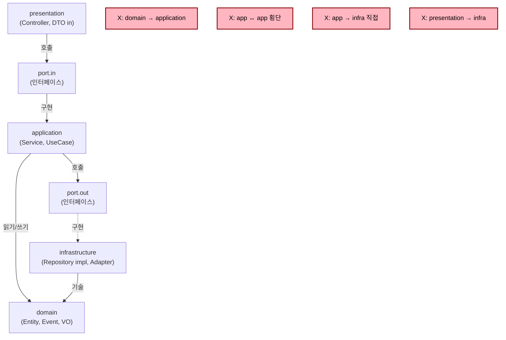
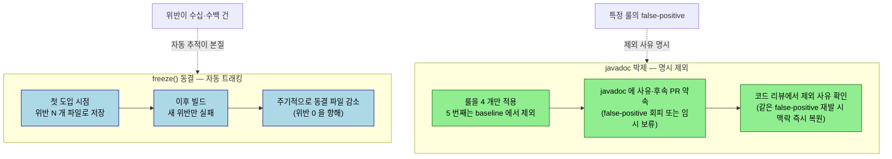

# ArchUnit으로 아키텍처 가드레일

## 학습 목표

이 문서를 읽고 나면 다음을 할 수 있습니다.

1. ArchUnit 의 `slices` · `noClasses` DSL 두 축으로 헥사고날·Domain-first 5룰을 작성할 수 있습니다.
2. 코드 리뷰가 잡지 못하는 역방향 의존·횡단 결합 결함이 왜 ArchUnit 으로만 잡히는지 설명할 수 있습니다.
3. `freeze()` 와 javadoc 박제 두 가지 점진 도입 전략의 트레이드오프를 비교할 수 있습니다.
4. ArchUnit 으로 표현 불가능한 자리(어노테이션 속성값 등) 를 식별하고 reflection 가드로 보완할지 판단할 수 있습니다.


헥사고날·Clean·Domain-first 같은 아키텍처 약속은 코드 리뷰에서만 강제하면 한 분기 안에 무너집니다. 새 컴포넌트를 만들 때 누군가 "이번만" 도메인에서 인프라 클래스를 직접 부르고, 그게 머지되면 "이미 있는 사례" 가 되어 다음 위반의 정당화가 됩니다. ArchUnit 은 이 약속을 빌드 시점의 검증 가능한 룰로 변환해, 코드 베이스가 시간이 지나면서 부패하는 것을 막습니다. 이 챕터는 핵심 DSL, 헥사고날·Domain-first 5룰 베이스라인, 점진 도입 시의 false-positive 회피 패턴을 정리합니다.


## 코드 리뷰만으로는 잡히지 않는 결함

다음 결함들은 사람의 주의력으로 잡기 어렵습니다.

- 도메인 패키지가 application 패키지를 거꾸로 import 하는 역방향 의존
- application 패키지의 service 끼리 서로를 참조하는 횡단 결합
- application 이 infrastructure 를 직접 참조 (port-out 인터페이스를 우회)
- presentation 이 infrastructure 를 import 해 영속성 객체가 컨트롤러까지 노출
- 도메인 sub-layer 사이의 사이클 (entity ↔ event 를 서로가 import)

이 결함들은 IDE 가 자동 import 를 제안하면서 한 줄짜리 변경으로 들어오기 때문에 PR diff 에서 눈에 잘 띄지 않습니다. ArchUnit 룰은 빌드를 깨뜨려 머지 자체를 막습니다.


## ArchUnit 의 핵심 도구

ArchUnit 은 클래스패스를 분석해 자체 모델로 import 한 뒤, fluent DSL 로 룰을 표현합니다. JUnit 5 와 결합 시 어노테이션이 단순합니다.

```java
import com.tngtech.archunit.junit.AnalyzeClasses;
import com.tngtech.archunit.junit.ArchTest;
import com.tngtech.archunit.lang.ArchRule;

@AnalyzeClasses(packages = "org.okestro.tps.jenkins")
class ArchitectureTest {

    @ArchTest
    static final ArchRule rule = ...;
}
```

`@AnalyzeClasses(packages = ...)` 가 분석 대상 패키지를, `@ArchTest static final ArchRule` 필드가 룰을 정의합니다. ArchUnit 이 이를 인식해 자동으로 검증하고, 위반이 있으면 어떤 클래스가 어떤 클래스를 위반 형태로 의존하는지 자세한 메시지를 출력합니다.

기본 DSL 두 가지를 알면 대부분의 룰을 만들 수 있습니다.

`slices` — 패키지 그룹 사이의 사이클·의존을 봅니다.

```java
slices()
    .matching("..jenkins.domain.(*)..")
    .should().beFreeOfCycles();
```

`(*)` 는 와일드카드로 슬라이스를 정의합니다. 위 룰은 `jenkins.domain.foo`, `jenkins.domain.bar`, `jenkins.domain.baz` 같은 sub-package 사이에 사이클이 없어야 한다고 강제합니다.

`noClasses().that().resideInAPackage(...).should().dependOnClassesThat().resideInAnyPackage(...)` — 패키지 의존 금지.

```java
noClasses()
    .that().resideInAPackage("..jenkins.domain..")
    .should().dependOnClassesThat()
    .resideInAnyPackage(
        "..jenkins.application..",
        "..jenkins.presentation..",
        "..jenkins.infrastructure.."
    );
```

도메인 패키지가 다른 layer 를 import 하지 않는다는 핵심 약속을 한 줄로 표현합니다. `..` 는 모든 sub-package 를 의미합니다.


## 헥사고날 · Domain-first 5룰 베이스라인

다음 다이어그램은 5룰이 강제하는 의존 방향을 한 장에 정리합니다. 화살표는 *허용된* import 방향이며, 점선은 port 인터페이스를 거치는 우회 경로입니다. ArchUnit 룰은 이 그림에서 *역방향* 또는 *횡단* 화살표가 생기는 순간 빌드를 깨뜨립니다.



룰 1·2 는 domain 행, 룰 3 은 application→infrastructure 화살표 금지, 룰 4 는 application 내부 횡단, 룰 5 는 명명 규칙입니다. 다이어그램의 빨간 박스 4개가 ArchUnit 이 빌드 시점에 잡는 위반 케이스입니다.


다음 5룰은 헥사고날·Clean·DDD 등 도메인 중심 아키텍처에서 공통적으로 강제해 두면 좋은 베이스라인입니다.

### 룰 1 — 도메인 sub-layer 사이클 금지

```java
@ArchTest
static final ArchRule no_domain_cycles = slices()
    .matching("..jenkins.domain.(*)..")
    .should().beFreeOfCycles();
```

도메인 안의 entity·valueobject·event·service 같은 sub-package 가 서로를 거꾸로 참조하면 결합이 단단해집니다. 한 번 사이클이 생기면 추출·이동이 어려워지므로 처음부터 차단합니다.

### 룰 2 — domain 격리 (다른 layer 모름)

```java
@ArchTest
static final ArchRule domain_isolation = noClasses()
    .that().resideInAPackage("..jenkins.domain..")
    .should().dependOnClassesThat()
    .resideInAnyPackage(
        "..jenkins.application..",
        "..jenkins.presentation..",
        "..jenkins.infrastructure.."
    );
```

도메인은 application·presentation·infrastructure 어느 쪽도 import 하지 않습니다. 도메인이 자체 어휘 안에서만 표현되어야 한다는 핵심 약속입니다.

### 룰 3 — application 은 infrastructure 직접 의존 금지

```java
@ArchTest
static final ArchRule application_does_not_touch_infrastructure = noClasses()
    .that().resideInAPackage("..jenkins.application..")
    .should().dependOnClassesThat()
    .resideInAPackage("..jenkins.infrastructure..");
```

application 은 port-out 인터페이스를 통해서만 infrastructure 와 통신합니다. 직접 import 가 들어오는 순간 의존성 역전이 깨지고, 인프라 변경의 파급이 application 까지 번집니다.

### 룰 4 — application service 끼리 의존 금지

```java
@ArchTest
static final ArchRule services_do_not_depend_on_each_other = noClasses()
    .that().resideInAPackage("..jenkins.application")
    .and().haveSimpleNameEndingWith("Service")
    .should().dependOnClassesThat()
    .resideInAPackage("..jenkins.application")
    .andShould().haveSimpleNameEndingWith("Service");
```

application service 끼리 직접 호출하면 책임 경계가 모호해집니다. 공통 로직은 도메인 객체로 끌어올리거나 별도 application policy 로 분리합니다. 이 룰은 처음에는 공격적으로 보이지만, 한 번 통과시키면 application layer 의 응집이 일관되게 유지됩니다.

### 룰 5 — 명명 규칙 (선택적)

```java
@ArchTest
static final ArchRule controllers_named_consistently = classes()
    .that().resideInAPackage("..presentation..")
    .and().areAnnotatedWith(RestController.class)
    .should().haveSimpleNameEndingWith("Controller");
```

명명 규칙은 팀별로 다르므로 베이스라인에 항상 포함되지는 않습니다. 다만 `*Controller`, `*Repository`, `*Adapter` 같은 일관된 접미사는 패키지 구조를 읽기 쉽게 만듭니다.


## 점진 도입과 false-positive 회피

새 모듈에 5룰을 한 번에 적용하면 빌드가 수십 건의 위반으로 깨집니다. 한 번에 모든 위반을 고치기는 어려우므로 점진 도입이 현실적입니다.

다음 다이어그램은 두 가지 점진 도입 전략 — `freeze()` 파일 동결과 javadoc 박제(룰 제외 + 사유 주석) — 의 분장을 한 장에 박습니다. 같은 의도(기존 위반 허용 + 새 위반 차단) 를 다른 메커니즘으로 풉니다.



선택 기준은 *위반의 성격* 입니다. 위반이 수십~수백 건으로 *기계적 정리* 가 본질이면 `freeze()` 가 적합하고, 특정 룰이 inner class 자기참조 같은 *구조적 false-positive* 로 깨지면 javadoc 박제가 적합합니다. 두 전략은 한 모듈 안에 공존할 수 있으며, TPS `ApprovalArchitectureTest` 가 후자의 모범을 보여 줍니다.

기존 위반을 동결하는 방법으로 ArchUnit 의 `freeze()` 기능이 있습니다. 첫 도입 시점의 위반을 파일로 저장하고, 그 이후의 새 위반만 빌드를 깨뜨립니다. 시간이 지나면서 동결된 위반을 줄여 가는 식입니다.

inner class 자기참조 같은 false-positive 도 자주 만납니다. ArchUnit 이 inner class 를 별개 클래스로 보면서 "outer 가 inner 를 의존" 으로 잡는 경우가 있습니다. operator/ticket 의 `ApprovalArchitectureTest` 가 이 사례를 주석으로 남깁니다.

```java
// application/service 끼리 의존 금지 룰: ArchUnit 의 inner-class 자기참조 false-positive
// (예: ApprovalTriggerQueryService → ApprovalTriggerQueryService$CompnKey 가 위반으로 잡힘)
// 회피를 위해 본 baseline 에서는 제외. 위반 0 상태는 grep 으로 수동 검증
// (./gradlew :ticket:dependencies / 또는 grep "private final Approval[A-Z].*(Service|Invoker)").
// 후속 PR 에서 customCondition + topLevelClass 필터로 정식 룰 추가 예정.
```

이런 주석이 가치 있습니다. 룰을 일시 제외한 이유와 후속 계획을 명시해, 다음 사람이 같은 false-positive 에 부딪혔을 때 맥락을 빠르게 복원합니다. 룰을 끄는 것 자체가 나쁜 것이 아니라, **왜 끄는지·언제 다시 켤지** 가 명시되지 않는 것이 문제입니다.

`ImportOption.DoNotIncludeTests` 옵션은 분석 대상에서 테스트 코드를 제외합니다. 테스트가 의도적으로 도메인을 마음대로 import 하는 것이 자연스럽기 때문입니다.

```java
@AnalyzeClasses(
    packages = "org.okestro.tps.operator.ticket.approval",
    importOptions = {ImportOption.DoNotIncludeTests.class}
)
class ApprovalArchitectureTest { ... }
```


## ArchUnit 이 적합한 자리, 적합하지 않은 자리

ArchUnit 은 패키지 의존·명명 규칙·어노테이션 부착 같은 정적 구조를 검증합니다. 적합한 자리입니다.

- 헥사고날 layer 경계 강제
- 도메인이 외부 라이브러리(JPA, Spring 등) 어노테이션을 갖지 않는다는 약속
- 모든 컨트롤러가 `@RestController` 를 가져야 한다는 명명/어노테이션 규약
- `package-info.java` 의 명시 의존 그래프

적합하지 않은 자리도 있습니다.

- 어노테이션 속성값(예: `@RetryableTopic(kafkaTemplate = "...")` 의 문자열) 까지 검사 — reflection 가드(02-02 챕터) 가 더 직관적입니다
- 메서드 호출 그래프 같은 동적 의존 — runtime 분석 도구가 적합니다
- 시간에 따라 변하는 의존 — module dependency 그래프 변화 추적은 다른 도구로

Spring Modulith 가 ArchUnit 위에 모듈 경계 검증을 더 추상화해 제공합니다. 멀티모듈 프로젝트에서 모듈 단위 의존 그래프를 명시하고 싶다면 Modulith 의 `ApplicationModules.of(MyApp.class).verify()` 가 가벼운 시작점이 됩니다.


## 함정과 회피

`@ArchTest` 필드는 `static final` 이어야 합니다. 인스턴스 필드면 ArchUnit JUnit 5 확장이 룰을 인식하지 못합니다.

분석 범위를 좁게 잡으면 룰이 적용 안 되는 코드가 늘어납니다. `packages = "org.okestro.tps"` 처럼 루트로 넓게 잡으면 모든 코드가 룰을 받습니다. 단 분석 시간이 늘어나므로, 큰 모노레포에서는 모듈별 룰 클래스를 두는 편이 균형이 좋습니다.

룰 한 줄에 모든 의존을 담으면 위반 메시지가 길어집니다. 룰을 의도 단위로 쪼개면 어떤 약속이 깨졌는지 메시지로 바로 보입니다. 위 5룰처럼 한 룰이 한 가지 의도만 표현하는 분장이 권장됩니다.

ArchUnit 캐시는 클래스패스 변경에 민감합니다. 빌드가 캐시되어 결과가 옛날과 같은 것 같으면 `./gradlew clean test` 로 재실행합니다.

룰을 끄는 데 익숙해지지 않습니다. `@Disabled` 또는 `// @ArchTest` 주석 처리 대신, 위 사례처럼 룰 정의를 남겨 두고 사유와 후속 계획을 적습니다. 룰 자체가 사라지면 약속도 사라집니다.


## TPS 사례 — 5룰 베이스라인 위에 점진 도입 주석

`org.okestro.tps.jenkins.ArchitectureTest` 는 5룰 베이스라인을 명시하고, 도입 배경을 클래스 javadoc 에 남깁니다.

```java
/**
 * 305P jenkins 도메인 의존성 룰 (v305p/references/dependency-rules.md §5).
 *
 * 2026-05-08 jenkins 도메인의 domain → application/dto 역방향 5건 사례를 계기로
 * 도입. 같은 패턴 재발을 컴파일/테스트 시점에 차단한다.
 */
@AnalyzeClasses(packages = "org.okestro.tps.jenkins")
class ArchitectureTest {

    @ArchTest static final ArchRule no_domain_cycles = ...;
    @ArchTest static final ArchRule domain_isolation = ...;
    @ArchTest static final ArchRule application_does_not_touch_infrastructure = ...;
    @ArchTest static final ArchRule services_do_not_depend_on_each_other = ...;
}
```

위 주석이 가치 있습니다. 어떤 사고가 룰 도입의 계기였는지가 코드 베이스 안에 박제되며, 6 개월 뒤에도 "왜 이 룰이 있는가" 가 즉시 복원됩니다. 5룰 표준화는 다른 도메인(approval, tool, pipeline 등) 으로 확장 시에도 동일 패턴을 재사용하게 합니다.

`org.okestro.tps.operator.ticket.approval.ApprovalArchitectureTest` 는 4룰 + transitional 주석으로, 도입 시점의 false-positive 와 일부 룰 보류 사유를 코드에 적습니다. 점진 도입의 모범이라고 할 수 있습니다. "지금은 4룰부터, 5번째 룰은 customCondition 으로 후속 PR 에서" 라는 약속이 코드와 함께 남습니다.


## 자가 점검 — 문제

> 답을 먼저 입으로 말해 보고, 막히면 아래 §정답 섹션을 확인합니다. 본문을 다시 펴 보지 말고 *자기 언어로* 설명할 수 있는지 점검하는 것이 목적입니다.

1. ArchUnit 룰이 코드 리뷰보다 잡기 좋은 결함은?
2. `slices().matching("..(*)..").should().beFreeOfCycles()` 가 사이클을 막는 의미는?
3. 5룰 베이스라인을 한 번에 적용하지 않고 점진 도입하는 방법은?
4. ArchUnit 이 적합하지 않은 자리는 어디인가?
5. `@ArchTest` 필드가 `static final` 이 아니면 어떻게 되는가?


## 자가 점검 — 정답

1. IDE 자동 import 가 한 줄로 들여온 역방향 의존, application 끼리 횡단 결합, presentation 이 infrastructure 를 직접 import 하는 케이스가 핵심입니다. 모두 PR diff 에서 눈에 잘 띄지 않는데, ArchUnit 은 빌드 자체를 깨뜨려 머지를 막습니다.
2. 와일드카드 슬라이스로 sub-package 군을 정의해 그 사이에 사이클이 없어야 한다고 강제합니다. 한 번 사이클이 생기면 추출·이동이 막혀 리팩토링 비용이 급격히 올라갑니다.
3. `freeze()` 로 첫 도입 시점 위반을 파일로 동결하고 이후 새 위반만 빌드를 깨뜨리는 방법이 한 가지입니다. 또는 룰을 4개부터 켜고 false-positive 사유와 후속 계획을 javadoc 에 박제해 두 가지 트레이드오프 중 팀 문화에 맞는 쪽을 고릅니다.
4. 어노테이션 속성값 검사(`@RetryableTopic(kafkaTemplate = ...)` 같은) 는 reflection 가드가 더 직관적입니다. 메서드 호출 그래프 같은 동적 의존이나 시간 축으로 변하는 의존은 별도 분석 도구의 영역입니다.
5. ArchUnit JUnit 5 확장이 룰을 인식하지 못해 인스턴스 필드면 룰이 조용히 사라집니다. CI 가 통과해도 실제로는 검증이 안 도는 상태라 가장 위험합니다.


## 다음 챕터

02-04 는 외부 시스템 의존이 있는 E2E 영역을 다룹니다. WireMock 으로 Jenkins/SonarQube webhook 같은 외부 API 응답을 결정적으로 주입하고, 스케줄러 자동 실행을 억제하면서 복구·카오스 시나리오를 검증하는 패턴을 정리합니다.
