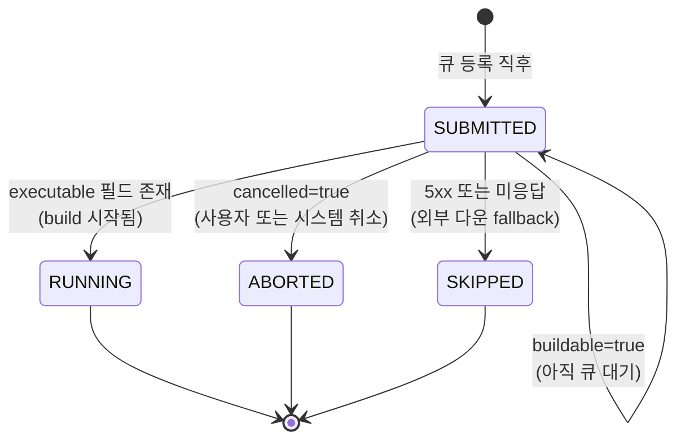
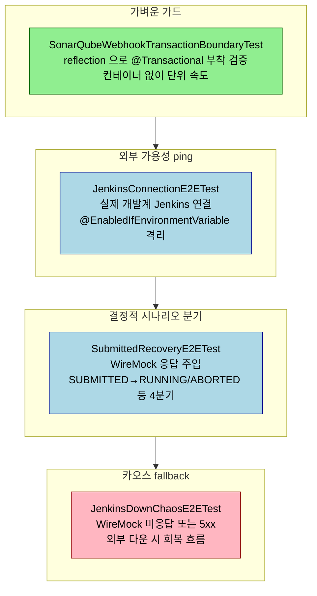

# WireMock과 외부 시스템 E2E

## 학습 목표

이 문서를 읽고 나면 다음을 할 수 있습니다.

1. WireMock 의 `stubFor` · `urlMatching` · `verify` 세 API 로 외부 API 응답·호출 검증 시나리오를 작성할 수 있습니다.
2. 스케줄러 자동 실행 억제 + UseCase 수동 호출 패턴이 왜 결정성을 확보하는지 설명할 수 있습니다.
3. "stub 미설정 = 호출 안 됨" 음성 검증과 `wm.verify(0, ...)` 의 차이를 비교하고 어느 자리에 어느 쪽을 쓸지 판단할 수 있습니다.
4. 큐 응답 형태(`executable`·`cancelled`·`buildable`·5xx) 에 따른 SUBMITTED → RUNNING/ABORTED/SUBMITTED-유지/SKIPPED 분기를 결정적으로 검증할 수 있습니다.


외부 API 의존이 있는 코드는 자체 테스트만으로는 동작 보장이 어렵습니다. Jenkins 큐 API 가 어떤 형식으로 응답하는지, SonarQube webhook 의 payload 가 어떤 필드를 가지는지, 외부 시스템이 5xx 를 던질 때 우리 코드가 어떻게 회복하는지 같은 질문은 실제 외부 호출 또는 외부와 동등한 stub 응답이 있어야 답할 수 있습니다. WireMock 은 HTTP 응답을 코드로 정의하고, 테스트 안에서 외부 시스템 동작을 결정적으로 흉내 내는 도구입니다. 이 챕터는 WireMock 의 기본 사용, 스케줄러 자동 실행 억제와 UseCase 수동 호출, "stub 미설정 = 호출 안 됨" 음성 검증, 트랜잭션 경계의 reflection 가드를 묶어 정리합니다.


## 외부 시스템 E2E 가 잡는 결함

이 영역의 결함은 다른 어느 층에서도 잡히지 않습니다.

- 외부 응답 형식 변화 — 필드 이름이 변한 경우, optional 이 required 로 변한 경우
- 5xx · timeout · connection refused 시 우리 코드의 회복 흐름
- 큐 대기 → 실행 → 완료 같은 외부 라이프사이클 전이에 따른 우리 상태 머신의 전이
- 멱등성 — 같은 요청이 두 번 들어왔을 때 외부에 두 번 호출되는지 또는 한 번만 호출되는지
- 카오스 시나리오 — 외부가 일시 중단되었다가 복구할 때의 재시도/복구 흐름

이런 결함은 단위·슬라이스·통합 테스트로는 잡히지 않습니다. 외부 응답을 mock 으로 흉내 내면 결국 우리가 만든 mock 만 검증하게 되어, 실제 외부 형식과 어긋날 때 발견할 길이 없습니다. WireMock 은 실제 HTTP 통신 흐름을 그대로 두면서 응답만 코드로 박제합니다.

다음 다이어그램은 외부(Jenkins) 큐 응답 형태에 따라 우리 ExecutionJob 상태가 어떻게 전이되는지를 한 장에 정리합니다. WireMock 은 각 응답 형태를 stub 한 줄로 흉내 내므로, 네 갈래 분기를 모두 결정적으로 검증할 수 있습니다.



이 네 분기는 모두 `SubmittedRecoveryE2ETest` 한 클래스 안에서 검증됩니다. 각 테스트는 WireMock stub 응답 한 줄을 다르게 두고 `recoveryUseCase.recoverSubmitted(job)` 를 같은 방식으로 호출합니다. 분기 차이는 응답 형태 한 곳에만 박혀 있어 테스트가 어떤 상태 전이를 검증하는지 한눈에 보입니다.


## WireMock 기본 사용

WireMock 은 HTTP 서버를 띄우고 stub 매핑을 코드로 정의합니다. Spring Boot 통합은 보통 사용자가 만든 베이스 클래스(`JenkinsWireMockSupport` 같은) 가 담당합니다.

```java
import static com.github.tomakehurst.wiremock.client.WireMock.*;

class SubmittedRecoveryE2ETest extends JenkinsWireMockSupport {

    @Test
    @DisplayName("(a) findQueueItem executable → SUBMITTED → RUNNING 전이 + EXCN outbox 발행")
    void executableFound_recoversToRunningAndPublishesExcn() {
        wm.stubFor(get(urlMatching(".*/queue/item/" + QUEUE_ID + "/api/json"))
            .willReturn(aResponse().withStatus(200)
                .withBody(String.format(
                    "{\"executable\":{\"number\":%d,\"url\":\"http://x/job/x/%d/\"},\"cancelled\":false}",
                    BUILD_NO, BUILD_NO
                ))));

        ExecutionJob job = jobQueryPort.findByStatus(ExecutionJobStatus.SUBMITTED).get(0);
        recoveryUseCase.recoverSubmitted(job);

        ExecutionJobEntity entity = reload(jobExcnId);
        assertThat(entity.getExcnStts()).isEqualTo(ExecutionJobStatus.RUNNING);
        assertThat(entity.getBuildNo()).isEqualTo(BUILD_NO);
    }
}
```

핵심 API 세 가지면 대부분의 시나리오를 표현합니다.

- `stubFor(get(urlMatching(...)).willReturn(aResponse().withStatus(...).withBody(...)))` — 매칭과 응답
- `urlMatching(regex)`, `urlPathEqualTo(path)`, `urlEqualTo(url)` — URL 매칭 강도 차이
- `aResponse().withStatus(200).withBody(json).withHeader("Content-Type", "application/json")` — 응답 빌더

매칭은 첫 번째 일치하는 stub 이 선택됩니다. 정규식 매칭(`urlMatching`) 은 유연하지만 의도와 다른 stub 이 잡히면 디버깅이 길어지므로, 가능하면 `urlPathEqualTo` 같은 명시적 매칭을 우선합니다. `wm.verify(getRequestedFor(urlMatching(...)))` 로 호출이 일어났는지 검증할 수 있습니다.


## 스케줄러 자동 실행을 억제하고 UseCase 를 수동 호출합니다

복구·재시도 흐름은 보통 스케줄러가 주기적으로 트리거합니다. 테스트가 스케줄러 자동 실행에 의존하면 결과가 timing 에 묶이고, flaky 테스트가 생깁니다. 두 단계로 결정성을 확보합니다.

첫째, test 프로필의 스케줄러 interval 을 무한대로 늘리거나 `@EnableScheduling` 을 비활성화해 자동 실행을 막습니다. `application-test.yml` 에서 `app.scheduler.interval=PT100Y` 같은 값으로 설정하거나, `@SpringBootTest` 의 `properties = {"spring.task.scheduling.pool.size=0"}` 로 풀을 0 으로 만듭니다.

둘째, 검증 시점에 UseCase 또는 스케줄러 메서드를 직접 호출합니다.

```java
ExecutionJob job = jobQueryPort.findByStatus(ExecutionJobStatus.SUBMITTED).get(0);
recoveryUseCase.recoverSubmitted(job);
```

이 패턴의 장점은 테스트가 "스케줄러가 깨어났을 때의 동작" 을 직접 표현한다는 점입니다. timing 에 의존하지 않아 빌드 환경별로 결과가 달라지지 않습니다. 스케줄러 자체의 트리거 로직을 검증하고 싶으면 별도 단위 테스트로 분리합니다.


## "stub 미설정 = 호출 안 됨" 음성 검증

WireMock 은 stub 이 설정되지 않은 호출이 들어오면 매치 실패로 보고합니다. 이 동작이 음성 검증의 도구가 됩니다. SubmittedRecoveryE2ETest 가 이 패턴을 활용합니다.

```java
// stopBuild 미호출 검증 — WireMock 에 stub 자체를 두지 않았으므로 호출 시 미스매치 발생.
// (테스트 끝까지 fail 없이 통과 = stop 엔드포인트가 호출되지 않았음)
```

명시적으로 "이 endpoint 가 호출되지 않아야 한다" 를 검증하는 두 가지 방법이 있습니다. `wm.verify(0, postRequestedFor(urlMatching(".*stopBuild.*")))` 로 호출 횟수가 0 임을 직접 단언하거나, stub 자체를 두지 않은 채 테스트가 통과하는지 보는 방식입니다. 두 번째가 더 가볍고 의도가 명확합니다. stub 미설정 endpoint 가 호출되면 WireMock 이 응답을 못 줘 우리 코드가 IO 에러로 실패합니다.

이 음성 검증은 정상 진행 빌드 보호 같은 안전 동작을 검증할 때 가치가 큽니다. 사용자 의도와 다르게 외부 호출이 늘어나는 회귀를 빌드에서 잡습니다.


## 외부 시스템 가용성 ping

자기 환경에서 의존하는 외부 시스템이 정말 있는지 확인하는 가장 단순한 E2E 도 있습니다. 빌드 환경에 외부 시스템이 살아 있을 때만 의미가 있는 테스트로, CI 의 일부 영역에서만 활성화됩니다.

```java
@DirtiesContext
@ActiveProfiles("test")
@SpringBootTest(
    classes = ExecutorApplication.class,
    webEnvironment = SpringBootTest.WebEnvironment.MOCK
)
class JenkinsConnectionE2ETest {

    @Autowired private ToolInfoPersistencePort toolInfoPort;
    @Autowired private JenkinsQueryPort jenkinsQueryPort;

    @Test
    @DisplayName("Jenkins - 개발계 Console Jenkins에 연결하고 실행기 수를 반환한다")
    void jenkins_connectAndDetectK8sAgent_returnsExecutorCount() {
        JenkinsConnectionInfo connectionInfo = toolInfoPort.loadByTlId(Jenkins305PTestFixtures.TL_ID);
        assertThat(connectionInfo.isValid()).isTrue();

        JenkinsHealthResult health = jenkinsQueryPort.checkHealth(connectionInfo);
        assertThat(health.available())
            .as("개발계 Console Jenkins가 가용해야 한다")
            .isTrue();

        JenkinsCapacityInfo capacity = jenkinsQueryPort.getCapacity(connectionInfo);
        assertThat(capacity.isUsable())
            .as("개발계 Jenkins capacity 는 usable 해야 한다 (UNKNOWN 이 아니어야)")
            .isTrue();
    }
}
```

이런 테스트는 보통 개발계 환경 빌드에서만 도는 별도 task 로 분리하거나 `@EnabledIfEnvironmentVariable("DEV_E2E", "true")` 같은 조건부 활성화로 격리합니다. 외부 시스템이 죽었을 때 PR 빌드가 깨지면 안 되기 때문입니다. AssertJ `as(...)` 로 도메인 의미가 메시지에 보이게 해 두면, 실패 시 "외부 환경 자체의 문제" 인지 "우리 코드의 문제" 인지 빠르게 구분할 수 있습니다.


## 트랜잭션 경계 가드 (reflection)

스케줄러나 webhook 진입점이 `@Transactional` 을 갖지 않으면 도중 실패 시 부분 commit 으로 데이터 일관성이 깨집니다. 이런 경계는 coding style 로 강제하기 어렵고, 코드 리뷰에서 빠뜨리기 쉽습니다. reflection 으로 어노테이션 존재만 가볍게 검증하면 회귀를 빌드 시점에 잡습니다.

```java
class SonarQubeWebhookTransactionBoundaryTest {

    @Test
    @DisplayName("웹훅 서비스 handle 진입점은 트랜잭션을 연다")
    void webhookHandle_isTransactional() throws NoSuchMethodException {
        Method handle = SonarQubeWebhookService.class.getMethod(
            "handle",
            SonarQubeWebhookCommand.class
        );

        assertThat(handle.isAnnotationPresent(Transactional.class)).isTrue();
    }

    @Test
    @DisplayName("타임아웃 스케줄러 진입점은 트랜잭션을 연다")
    void schedulerExpire_isTransactional() throws NoSuchMethodException {
        Method expireTimedOutWebhookWaits = SonarQubeWebhookTimeoutScheduler.class.getMethod(
            "expireTimedOutWebhookWaits"
        );

        assertThat(expireTimedOutWebhookWaits.isAnnotationPresent(Transactional.class)).isTrue();
    }
}
```

이 가드는 컨테이너를 띄우지 않으므로 단위 테스트 속도로 동작합니다. ArchUnit 으로도 비슷한 검증이 가능하지만 어노테이션 존재만 보면 reflection 이 더 직관적입니다. 트랜잭션 propagation 까지 검증하고 싶으면 어노테이션 속성을 reflection 으로 읽어 단언합니다.


## 카오스·복구 시나리오

WireMock 의 진가는 외부 시스템의 비정상 상태를 결정적으로 흉내 내는 데 있습니다. 5xx, timeout, malformed response 같은 시나리오를 한 줄로 만듭니다.

```java
// 5xx 응답
wm.stubFor(get(urlMatching(".*/queue/item/.*")).willReturn(aResponse().withStatus(503)));

// 응답 지연
wm.stubFor(get(urlMatching(".*"))
    .willReturn(aResponse().withStatus(200).withFixedDelay(15_000)));

// 빈 본문 / 깨진 JSON
wm.stubFor(get(urlMatching(".*"))
    .willReturn(aResponse().withStatus(200).withBody("not a json")));
```

복구·카오스 E2E 의 핵심은 우리 코드가 이런 비정상 응답을 만났을 때 어떻게 회복하는가를 결정적으로 검증하는 것입니다. 외부 시스템을 직접 끌 수 없는 환경에서, WireMock stub 변경 한 줄로 시뮬레이션이 됩니다.

`toxiproxy` 같은 더 정교한 도구는 패킷 손실·대역폭 제한 같은 더 낮은 계층 카오스를 흉내 낼 수 있습니다. WireMock 은 응용 프로토콜 수준이므로 이런 영역은 다루지 않습니다. 카오스 깊이가 더 필요하면 toxiproxy 컨테이너와 결합니다.


## 함정과 회피

WireMock 의 stub 매칭은 첫 번째 매칭이 우선입니다. 같은 URL 에 여러 stub 을 두면 의도와 다른 stub 이 잡힐 수 있습니다. `priority` 옵션으로 명시적 우선순위를 줄 수 있고, 가능하면 매칭을 좁게 만듭니다.

`wm.resetAll()` 또는 `wm.resetMappings()` 를 `@BeforeEach` 에서 호출해 stub 이 테스트 간 leak 되지 않게 합니다. 베이스 클래스가 자동으로 reset 하면 더 단순합니다.

`urlMatching(".*")` 같은 너무 넓은 매칭은 다른 stub 의 동작을 가립니다. 디버깅 시점에 임시로 쓰고, 커밋 전에 좁힙니다.

WireMock 응답에 `withFixedDelay` 를 쓰면 테스트 시간이 늘어납니다. 카오스 검증에는 필요하지만, 일반 happy path 에는 쓰지 않습니다.

외부 시스템 ping E2E 는 환경 의존입니다. PR 빌드에 항상 포함하면 외부 다운 시 빌드가 깨집니다. 별도 task 또는 조건부 활성화로 분리합니다.


## TPS 사례 — recovery / chaos / connection / boundary 의 분장

executor 모듈은 외부 시스템 E2E 를 4 가지 라인으로 분장합니다. 다음 다이어그램은 각 라인이 어떤 결함을 잡고 어떤 도구로 검증하는지를 한 장에 정리합니다. 가벼운 가드부터 무거운 카오스까지 *검증 비용 순서* 로 늘어서 있어, 어느 라인이 어느 자리를 채우는지 한눈에 보입니다.



각 라인이 다른 종류의 결함을 잡으며 어느 라인도 다른 라인을 대체하지 않습니다. reflection 가드가 잡지 못하는 동적 회복 흐름은 WireMock 결정적 시나리오가, 정상 시나리오가 잡지 못하는 외부 다운 상황은 카오스 라인이 채웁니다.

실제 파일 위치는 다음과 같이 한 모듈(`executor/engine`) 안에서 의도별로 패키지가 갈립니다.

| 라인 | 파일 경로 (executor/engine 기준) |
|------|----------|
| 가용성 ping | `src/test/java/org/okestro/tps/jenkins/e2e/integration/JenkinsConnectionE2ETest.java` |
| 결정적 분기 검증 | `src/test/java/org/okestro/tps/jenkins/e2e/recovery/SubmittedRecoveryE2ETest.java` |
| 카오스 fallback | `src/test/java/org/okestro/tps/jenkins/e2e/recovery/JenkinsDownChaosE2ETest.java` |
| WireMock 공통 베이스 | `src/test/java/org/okestro/tps/jenkins/e2e/wiremock/JenkinsWireMockSupport.java` |
| 트랜잭션 경계 가드 | `src/test/java/org/okestro/tps/sonarqube/application/SonarQubeWebhookTransactionBoundaryTest.java` |

`JenkinsConnectionE2ETest` — 외부 가용성 ping. 개발계 Jenkins 에 실제로 연결되는지만 보는 가벼운 검증.

`SubmittedRecoveryE2ETest` — WireMock 으로 Jenkins 큐 API 응답을 주입하고, ExecutionRecoverScheduler 의 recoveryUseCase 를 수동 호출해 SUBMITTED → RUNNING/ABORTED/SUBMITTED-유지/SKIPPED 4 가지 분기를 결정적으로 검증. 각 분기는 큐 응답 형태(`executable` 존재, `cancelled=true`, `buildable=true`, 5xx 응답) 로 표현됩니다.

`JenkinsDownChaosE2ETest` — Jenkins 가 다운된 상태(WireMock 미응답 또는 5xx) 에서 우리 코드의 fallback 동작을 검증. 같은 `e2e/recovery` 패키지 안에 두어 정상 분기(`SubmittedRecoveryE2ETest`) 와 카오스 분기를 한 자리에서 비교할 수 있게 분장합니다.

`JenkinsWireMockSupport` — 4 라인 중 WireMock 기반 두 라인이 공통으로 상속하는 베이스 클래스. `e2e/wiremock` 패키지에 독립적으로 두어 stub 매핑·reset 정책 같은 공통 셋업을 한 자리에서 관리합니다.

`SonarQubeWebhookTransactionBoundaryTest` — webhook 진입점과 timeout 스케줄러가 `@Transactional` 을 갖는지를 reflection 으로 가볍게 검증. Jenkins 4 라인과 패키지가 분리되어 있고(`sonarqube/application`) WireMock 도 쓰지 않습니다. 도구가 reflection 한 가지로 끝나는 경량 가드라 위치가 다르다는 점이 분장의 일관성을 보여 줍니다.

이 분장이 가치 있습니다. 가벼운 가드(`@Transactional` reflection) 부터 가용성 ping(외부 살아 있는지), 결정적 시나리오 분기(WireMock 응답 주입), 카오스(다운 시뮬레이션) 까지 검증 비용 순서대로 나뉘어 있습니다. 각 라인이 다른 종류의 결함을 잡으며, 어느 것도 다른 라인을 대체하지 않습니다.

```java
// recovery 의 결정성 패턴 — UseCase 직접 호출 + WireMock 응답 주입 + DB/outbox 단언
ExecutionJob job = jobQueryPort.findByStatus(ExecutionJobStatus.SUBMITTED).get(0);
recoveryUseCase.recoverSubmitted(job);

ExecutionJobEntity entity = reload(jobExcnId);
assertThat(entity.getExcnStts()).isEqualTo(ExecutionJobStatus.RUNNING);

// outbox 1건 적재 단언
List<OutboxEventEntity> events = entityManager.createQuery("""
        select e from OutboxEventEntity e where e.aggregateId = :id
        """, OutboxEventEntity.class)
    .setParameter("id", jobExcnId)
    .getResultList();
assertThat(events).hasSize(1);
```

DB · outbox · WireMock verify 를 한 테스트 안에서 함께 단언해, 외부 호출 → 우리 상태 전이 → 후속 메시지 발행 사이의 결합이 정상인지를 한 시나리오로 봅니다.


## 자가 점검 — 문제

> 답을 먼저 입으로 말해 보고, 막히면 아래 §정답 섹션을 확인합니다. 본문을 다시 펴 보지 말고 *자기 언어로* 설명할 수 있는지 점검하는 것이 목적입니다.

1. 외부 응답을 mock 으로 흉내 내지 않고 WireMock 을 쓰는 이유는?
2. 스케줄러 자동 실행을 억제하고 UseCase 를 수동 호출하는 이유는?
3. "stub 미설정 = 호출 안 됨" 음성 검증이 `wm.verify(0, ...)` 보다 좋은 점은?
4. `@Transactional` 부착 여부를 reflection 가드로 잡는 자리는?
5. 외부 가용성 ping E2E 를 PR 빌드에 두지 않는 이유는?


## 자가 점검 — 정답

1. mock 으로 외부 응답을 만들면 결국 우리가 만든 mock 의 형식만 검증하게 됩니다. 외부 시스템이 실제로 어떤 필드명·status·payload 를 돌려주는지와는 무관한 검증이 되어 회귀가 발견되지 않습니다. WireMock 은 HTTP 통신 흐름은 실제 그대로 두고 응답만 코드로 박제하므로, 우리 클라이언트가 진짜 외부와 동일한 파싱·에러 처리 경로를 타게 됩니다.
2. 스케줄러가 자동으로 깨어나는 시점에 검증이 묶이면 결과가 빌드 환경 timing 에 의존해 flaky 테스트가 생깁니다. test 프로필의 interval 을 사실상 무한대로 늘리거나 task scheduler pool 을 0 으로 만들어 자동 트리거를 끄고, 검증 시점에 UseCase 또는 스케줄러 메서드를 직접 호출합니다. "스케줄러가 깨어났을 때의 동작" 을 표현하는 의도가 코드에 그대로 드러납니다.
3. 의도가 더 명확합니다. `wm.verify(0, ...)` 는 한 줄을 추가해야 하지만, stub 자체를 두지 않으면 호출이 발생하는 순간 WireMock 이 응답을 주지 못해 우리 코드가 IO 에러로 즉시 실패합니다. 검증 누락이 정적으로 박힌 형태라 누락이 빌드 단계에서 잡힙니다. 가벼운 대신 표현력이 약하므로, 호출 횟수까지 단언하고 싶을 때는 `verify(n, ...)` 가 필요합니다.
4. 스케줄러·webhook 같이 외부 트리거가 진입점인 자리입니다. 도중 실패 시 부분 commit 으로 데이터 일관성이 깨질 수 있어 `@Transactional` 부착이 필수인데, 코드 리뷰에서 빠뜨리기 쉽습니다. ArchUnit 으로도 검증 가능하지만 어노테이션 존재만 보면 reflection 한 줄이 더 직관적이고 컨테이너 없이 단위 속도로 돕니다.
5. PR 빌드는 외부 시스템 가용성에 의존하면 안 됩니다. 외부가 다운되면 무관한 PR 까지 빌드가 깨져 작업이 막힙니다. `@EnabledIfEnvironmentVariable` 또는 별도 gradle task 로 격리해 개발계 환경 빌드에서만 돌게 두고, PR 빌드는 WireMock 기반의 결정적 시나리오만 돕니다.


## 다음 챕터

마지막 02-05 챕터는 지금까지 분리해서 본 도구들을 한 흐름으로 묶습니다. operator API → DB Outbox → Poller → Kafka → executor consumer 풀 흐름을 한 테스트로 검증할 때 필요한 것 — race 흡수 폴링, CloudEvents 헤더, ThreadLocal 누수 방지, `entityManager.clear()` 재조회 — 을 TPS `ExampleMessageFlowE2ETest` 와 `OutboxPollerIT` 사례로 풀어 분석합니다.
