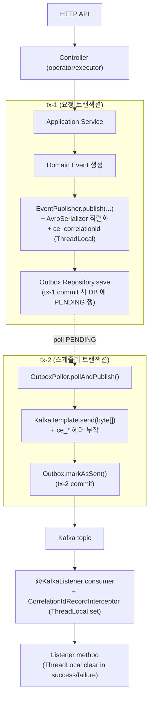
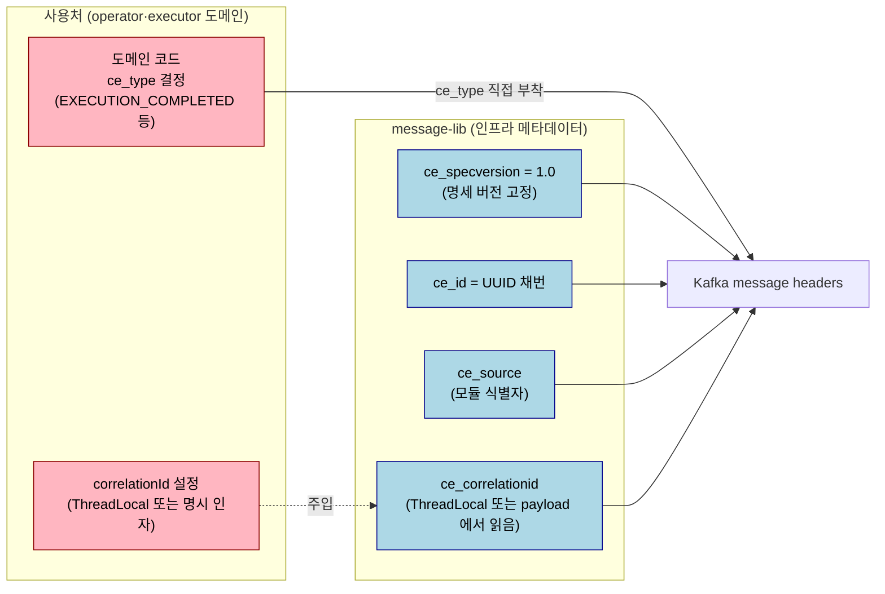

# TPS 메시징 플로우 종합 E2E

## 학습 목표

이 문서를 읽고 나면 다음을 할 수 있습니다.

1. API → Outbox → Kafka → Consumer 풀 라이프사이클의 두 트랜잭션 경계(tx-1·tx-2)와 두 race window 를 그림 없이 설명할 수 있습니다.
2. race 흡수 폴링에서 `entityManager.clear()` 가 누락되면 어떤 false negative 가 나는지 예측하고, 직접 폴링 헬퍼와 Awaitility 의 트레이드오프를 비교할 수 있습니다.
3. CloudEvents 헤더 4종(`ce_specversion`·`ce_id`·`ce_source`·`ce_correlationid`) 의 검증 방식을 작성하고, 라이브러리가 `ce_type` 을 채우지 않는 책임 분장 이유를 설명할 수 있습니다.
4. ThreadLocal 누수 검증을 success·failure 두 콜백 양쪽에서 봐야 하는 이유를 판단하고, `@AfterEach` clear 위생 패턴을 적용할 수 있습니다.


마지막 챕터는 지금까지 분리해서 본 도구들을 한 흐름으로 묶습니다. 도메인 이벤트가 API 진입점에서 발생해 DB Outbox 에 적재되고, 폴러가 트랜잭션 격리 안에서 폴링해 Kafka 로 발행하며, 컨슈머가 받아 후속 처리에 들어가는 풀 라이프사이클이 하나의 시나리오로 검증되어야 비로소 우리는 메시징 흐름을 신뢰할 수 있습니다. 이 종합 E2E 가 잡는 결함은 어느 한 층의 테스트로도 잡히지 않습니다. operator/executor 모듈 사이의 결합, Outbox 트랜잭션 경계, Kafka 헤더 정확성, ThreadLocal 누수 방지가 모두 한 테스트 안에서 검증됩니다. 이 챕터는 `ExampleMessageFlowE2ETest`(executor) 와 `OutboxPollerIT`(message-lib) 두 테스트를 풀어 분석하면서, 풀 E2E 작성 시 필요한 race 흡수 폴링·CloudEvents 헤더 검증·ThreadLocal 위생·재조회 패턴을 정리합니다.


## 풀 E2E 의 가치와 비용

풀 E2E 가 잡는 결함은 다음과 같습니다.

- 트랜잭션 경계가 Kafka 발행과 DB commit 사이에 어긋나 발행 후 롤백되는 흐름
- Outbox 폴러가 PENDING 행을 발행 후 SENT 마킹하는 race window 가 너무 넓어 중복 발행
- 메시지 헤더(CloudEvents specversion·id·source·correlationid) 가 컨슈머 측에서 누락
- 컨슈머가 받은 ThreadLocal correlationId 가 다음 메시지로 leak
- 컨슈머의 deserialize 가 producer 측의 Avro 스키마와 어긋나 ClassCast
- DLQ 라우팅과 retry 토픽 발행이 Avro 직렬화기로 흐르지 않음

각 결함이 다른 도구·다른 코드 영역에 분산되어 있어서, 통합 테스트로 분리해 보면 서로의 결합 부분이 누락됩니다. 풀 E2E 는 이 결합을 한 시점에 봅니다.

비용은 만만치 않습니다. operator + executor + DB + Kafka 가 동시에 떠야 하고, 한 테스트가 5~10초 걸리며, 컨텍스트 캐시가 갈라지면 빌드 시간이 빠르게 늘어납니다. 그래서 풀 E2E 는 양을 늘리는 게 아니라 핵심 시나리오 1~2개로 두고, 결함 종류별 분기는 단위/통합 테스트에서 잡는 분장이 합리적입니다.


## 풀 E2E 흐름 그림



이 그림에서 핵심 race 가 두 군데 있습니다. 첫째, tx-1 commit 과 tx-2 의 폴링 사이의 시간차. 둘째, Kafka 발행 commit 과 SENT 마킹 commit 사이의 race(폴러가 발행 후 SENT 마킹 트랜잭션을 닫기 직전에 같은 행을 다른 스레드가 다시 폴링해 중복 발행 가능).

E2E 가 이 race 의 윈도우를 검증할 수는 없지만(시점에 따라 달라지므로), 흐름이 결국 SENT 로 안정화되는지를 awaitility 폴링으로 확인할 수 있습니다.


## ExampleMessageFlowE2ETest 분해

> 이 챕터가 풀어 보는 다섯 자리의 실 파일 경로를 한 자리에 모아 둡니다. 어느 코드가 어느 모듈에 있고 어느 패키지로 분장되어 있는지 알면 본문의 코드 인용을 그대로 IDE 에서 열어 보며 학습할 수 있습니다.
>
> | 자리 | 파일 경로 (`~/okestro/tps-gitlab2/` 기준) |
> |------|------|
> | 풀 E2E (시나리오) | `executor/engine/src/test/java/org/okestro/tps/example/e2e/ExampleMessageFlowE2ETest.java` |
> | Outbox 폴러 IT | `message-lib/src/test/java/org/okestro/tps/messaging/application/outbox/OutboxPollerIT.java` |
> | ThreadLocal 누수 IT | `message-lib/src/test/java/org/okestro/tps/messaging/tracing/MessagingTracingAutoConfigurationIT.java` |
> | ThreadLocal interceptor (src) | `message-lib/src/main/java/org/okestro/tps/messaging/tracing/CorrelationIdRecordInterceptor.java` |
> | ThreadLocal context (src) | `message-lib/src/main/java/org/okestro/tps/messaging/tracing/CorrelationIdContext.java` |

`executor/engine` 의 `ExampleMessageFlowE2ETest` 는 위 흐름의 후반부(executor) 를 풀 E2E 로 검증합니다. operator 가 만들어 낼 메시지를 executor 가 직접 만들고, Outbox → Kafka 로 흘러가는 전체를 한 테스트 안에 둡니다.

### 베이스 셋업

```java
@DirtiesContext
@AutoConfigureMockMvc
@ActiveProfiles("test")
@SpringBootTest(
    classes = ExecutorApplication.class,
    webEnvironment = SpringBootTest.WebEnvironment.MOCK
)
class ExampleMessageFlowE2ETest {

    @Autowired private MockMvc mockMvc;
    @Autowired private OutboxPoller outboxPoller;
    @Autowired private EntityManager entityManager;
    @Autowired private JdbcTemplate jdbcTemplate;

    @Value("${spring.kafka.bootstrap-servers}") private String bootstrapServers;
    @Value("${spring.kafka.properties.schema.registry.url}") private String schemaRegistryUrl;

    @BeforeEach
    void cleanUp() {
        jdbcTemplate.execute("DELETE FROM TB_TRB_OX_001");
    }
}
```

`@DirtiesContext` 는 테스트 클래스 종료 후 컨텍스트를 폐기합니다. Outbox 폴러 같은 백그라운드 스케줄러가 살아 있으면 다음 테스트로 leak 되므로 명시합니다. `@AutoConfigureMockMvc` 로 MockMvc 빈을 받고, MockMvc 로 API 진입점을 호출합니다. Kafka 는 외부 또는 Testcontainers 로 실제 broker 에 연결한다(`@Value` 로 주입된 bootstrap-servers 가 실제 broker 주소). DB 는 운영과 동일 종류로 띄웁니다.

### 시나리오 본문

```java
@Test
@DisplayName("publish API 호출 후 outbox를 거쳐 ExampleMessageAvro 메시지가 Kafka에 발행된다")
void publishApi_EndToEndFlow_KafkaContainsExampleMessageAvro() throws Exception {
    String correlationId = "corr-e2e-1";
    try (Consumer<String, ExampleMessageAvro> consumer = createExampleMessageAvroConsumer()) {
        Map<TopicPartition, Long> startOffsets = captureEndOffsets(
            consumer, Topics.EXECUTOR_EVT_EXAMPLE.getValue());

        // 1. API 진입점 호출 → 컨트롤러 → 서비스 → EventPublisher → Outbox.save → tx-1 commit
        mockMvc.perform(post("/executor/api/example/publish")
                .contextPath("/executor/api")
                .contentType(MediaType.APPLICATION_JSON)
                .content("""
                    {
                      "message": "hello executor",
                      "correlationId": "%s"
                    }
                    """.formatted(correlationId)))
            .andExpect(status().isOk())
            .andExpect(jsonPath("$.status").value("published"))
            .andExpect(jsonPath("$.topic").value(Topics.EXECUTOR_EVT_EXAMPLE.getValue()));

        entityManager.clear();

        // 2. PENDING 상태로 Outbox 에 기록되었는지
        OutboxEventEntity pendingEvent = awaitOutboxEventByPayloadCorrelation(
            correlationId, OutboxStatus.PENDING, Duration.ofSeconds(5));
        assertThat(pendingEvent.getStatus()).isEqualTo(OutboxStatus.PENDING);
        assertThat(pendingEvent.getTopic()).isEqualTo(Topics.EXECUTOR_EVT_EXAMPLE.getValue());

        // 3. payload 자체가 Avro 직렬화 결과로 정확한지
        ExampleMessageAvro persistedMessage = deserializeOutboxPayload(pendingEvent.getPayload());
        assertThat(persistedMessage.getMessage()).isEqualTo("hello executor");
        assertThat(persistedMessage.getCorrelationId()).isEqualTo(correlationId);

        // 4. Kafka 컨슈머로 같은 메시지가 도착했는지
        ExampleMessageAvro consumedMessage = awaitPublishedMessage(
            consumer, correlationId, pendingEvent.getId(), startOffsets);
        assertThat(consumedMessage.getMessage()).isEqualTo("hello executor");
        assertThat(consumedMessage.getCorrelationId()).isEqualTo(correlationId);

        // 5. 결국 SENT 마킹이 commit 되는지 (race 흡수 폴링)
        OutboxEventEntity sentEvent = awaitSentStatus(pendingEvent.getId(), Duration.ofSeconds(5));
        assertThat(sentEvent.getStatus()).isEqualTo(OutboxStatus.SENT);
        assertThat(sentEvent.getSentAt()).isNotNull();
    }
}
```

5단계 단언이 한 흐름의 다른 측면을 봅니다. 1단계는 API 진입점의 응답 형식, 2단계는 DB 의 Outbox 적재, 3단계는 직렬화 결과, 4단계는 Kafka 도착, 5단계는 결국의 SENT 마킹. 어느 한 단계가 빠지면 다른 단계의 결함이 가려집니다.

### race 흡수 폴링 패턴

5단계의 핵심은 race 흡수입니다. Kafka 도착이 관찰됐어도 SENT 마킹의 tx-2 commit 이 같은 시점에 끝나지 않을 수 있습니다. 따라서 단순 `assertThat(...)` 으로는 race 에 빠지면 false negative 가 납니다. 결국 안정화되는지를 폴링으로 확인합니다.

```java
/**
 * Kafka 발행은 관측됐지만 markAsSent(TX-2) 커밋이 아직 안 끝난 race를 흡수한다.
 * 스케줄 폴러와 수동 호출이 동시에 돌 수 있어 Kafka 도착 시점 ≠ SENT 커밋 시점이다.
 */
private OutboxEventEntity awaitSentStatus(String eventId, Duration timeout) {
    Instant deadline = Instant.now().plus(timeout);
    OutboxEventEntity event = null;
    while (Instant.now().isBefore(deadline)) {
        entityManager.clear();
        event = entityManager.createQuery("""
                select e
                from OutboxEventEntity e
                where e.id = :eventId
                """, OutboxEventEntity.class)
            .setParameter("eventId", eventId)
            .getSingleResult();
        if (event.getStatus() == OutboxStatus.SENT) {
            return event;
        }
        try {
            Thread.sleep(100);
        } catch (InterruptedException ie) {
            Thread.currentThread().interrupt();
            break;
        }
    }
    return event;
}
```

핵심은 두 가집니다. `entityManager.clear()` 를 매 폴링 iteration 에서 부릅니다. JPA 1차 캐시가 있으면 같은 row 가 캐시된 상태로 반환되어 영원히 PENDING 으로 보입니다. 그리고 timeout 안에 안정화되지 않으면 마지막으로 본 상태를 그대로 반환해, 단언 단계에서 `assertThat(sentEvent.getStatus()).isEqualTo(SENT)` 가 실제 상태와 함께 실패하게 둡니다.

`Awaitility` 라이브러리를 추가하면 위 코드가 한 줄로 줄어듭니다.

```java
await().atMost(Duration.ofSeconds(5)).untilAsserted(() -> {
    entityManager.clear();
    OutboxEventEntity event = ... ;
    assertThat(event.getStatus()).isEqualTo(OutboxStatus.SENT);
});
```

라이브러리 추가가 부담이면 직접 폴링 헬퍼를 두는 편도 충분합니다. 위 TPS 코드는 후자의 선택이며, 헬퍼 한 곳에 로직을 모은다는 면에서 가독성이 좋습니다.


## CloudEvents 헤더 검증

Kafka 메시지 헤더에 CloudEvents 형식을 따르는 메타데이터가 부착되면 컨슈머가 메시지의 종류·발생지·correlation 을 표준 방식으로 식별할 수 있습니다. `OutboxPollerIT` 가 헤더 정확성을 검증합니다.

| 헤더 키 | 의미 | 검증 |
|---------|------|------|
| `ce_specversion` | CloudEvents 명세 버전 (보통 `1.0`) | 고정 문자열 단언 |
| `ce_id` | 메시지 고유 ID (UUID) | UUID 정규식 매치 |
| `ce_source` | 발생 모듈 식별자 | 모듈별 고정 문자열 |
| `ce_correlationid` | 추적용 correlation ID | publisher 가 받은 또는 자동 채번한 값 |

`ce_type` 같은 도메인 의미 헤더는 라이브러리가 결정하지 않습니다. 라이브러리는 인프라 메타데이터에 한정하고, 도메인 의미는 사용처가 책임진다는 분장입니다. 이 분장이 라이브러리 안정성에 중요합니다. 라이브러리에 도메인 의미가 새어들면 사용처가 늘어날수록 라이브러리가 변경되며, 변경이 라이브러리 사용처 전체에 파급됩니다.

다음 다이어그램은 한 Kafka 헤더 묶음 안에서 *누가 어느 키를 채우는지* 를 분장으로 정리합니다. 점선은 사용처가 라이브러리에 *주입* 하는 경로(ThreadLocal 또는 명시 인자) 이고, 실선은 라이브러리가 *직접* 채우는 키입니다.



같은 헤더 묶음 안에서 두 책임이 갈리는 자리가 한 장에 보입니다. `ce_type` 만 사용처가 직접 부착하고, 나머지 4종은 라이브러리가 자동 채웁니다. 이 경계가 흐려져 라이브러리가 `ce_type` 까지 결정하면, 새 도메인 이벤트가 추가될 때마다 라이브러리 변경이 따라오고 그 변경이 모든 사용처 모듈로 파급됩니다.


## CorrelationIdContext — ThreadLocal 누수 방지

correlationId 가 ThreadLocal 로 흐르면 한 메시지의 correlationId 가 다음 메시지로 leak 될 위험이 있습니다. `MessagingTracingAutoConfigurationIT` 가 6 시나리오로 누수를 감시합니다.

```java
@Test
@DisplayName("S3: success 콜백에서 ThreadLocal 이 clear 된다 (정상 종료 누수 방지)")
void S3_successCallback_clearsThreadLocal() {
    CorrelationIdRecordInterceptor interceptor = new CorrelationIdRecordInterceptor();
    ConsumerRecord<Object, Object> record = recordWithCorrelationId("corr-success");

    interceptor.intercept(record, null);
    assertThat(CorrelationIdContext.get()).contains("corr-success");

    interceptor.success(record, null);
    assertThat(CorrelationIdContext.get()).isEmpty();
}

@Test
@DisplayName("S4: failure 콜백에서 ThreadLocal 이 clear 된다 (예외 종료 누수 방지)")
void S4_failureCallback_clearsThreadLocal() {
    CorrelationIdRecordInterceptor interceptor = new CorrelationIdRecordInterceptor();
    ConsumerRecord<Object, Object> record = recordWithCorrelationId("corr-failure");

    interceptor.intercept(record, null);
    assertThat(CorrelationIdContext.get()).contains("corr-failure");

    interceptor.failure(record, new RuntimeException("test"), null);
    assertThat(CorrelationIdContext.get()).isEmpty();
}
```

핵심은 success 와 failure 콜백 양쪽에서 clear 가 호출되는지를 확인한다는 점입니다. 정상 종료에서만 clear 하면 예외 경로로 누수가 나고, 두 경로를 모두 검증해야 회귀 보호가 완전합니다.

테스트 클래스의 `@AfterEach` 에서도 clear 를 부르는 위생 패턴이 보입니다.

```java
@AfterEach
void cleanUp() {
    CorrelationIdContext.clear();
}
```

이 cleanup 이 없으면 한 테스트의 ThreadLocal 이 다음 테스트로 leak 되어 결과가 달라집니다. ThreadLocal 을 사용하는 모든 테스트는 lifecycle hook 으로 clear 하는 습관이 안전합니다.


## OutboxPollerIT 의 5가지 시나리오

`OutboxPollerIT` 는 폴러 자체를 단위 통합 수준에서 검증합니다. EmbeddedKafka + Testcontainers MariaDB 조합으로 5 시나리오를 결정적으로 봅니다.

- S1 — PENDING 폴링 → Kafka 발행 + SENT 마킹 + CloudEvents 헤더 4종 정확성
- S2 — Kafka 발행 실패 → reschedule (PENDING 복귀 + retry_count 증가 + next_retry_dt 설정)
- S3 — 재시도 max 초과 → DEAD 마킹 + dead 카운터 증가
- S4 — cleanupSentEvents → 보존 기간 초과 SENT 삭제
- S5 — ce_type 헤더 미발행 (도메인 의미는 라이브러리가 결정하지 않음)

`@Scheduled` 스케줄러는 활성하지 않고 `pollAndPublish()` 와 `cleanupSentEvents()` 를 수동 호출해 결정성을 확보합니다. 02-04 의 "스케줄러 자동 실행 억제 + UseCase 수동 호출" 패턴을 그대로 적용합니다.

`spring.kafka.*` 자동 설정은 EmbeddedKafka 와 충돌하지 않도록 라이브러리 자동 설정을 모두 exclude 하고 직접 KafkaTemplate 을 만듭니다.

```java
@Configuration
@EnableAutoConfiguration(exclude = {
    OutboxAutoConfiguration.class,
    MessagingTracingAutoConfiguration.class,
    KafkaJsonConsumerConfig.class,
    ...
})
static class TestConfig {
    @Bean PlatformTransactionManager transactionManager(EntityManagerFactory emf) { ... }
}
```

이 분장이 라이브러리 IT 의 모범이라고 할 수 있습니다. 라이브러리 자체 자동 설정을 검증 대상에서만 켜고, 그 외 자동 설정(예: 자체 다른 라이브러리 모듈) 은 모두 exclude 해 컨텍스트가 가볍게 떠 있는입니다.


## 함정과 회피

`@DirtiesContext` 없이 풀 E2E 를 운영하면 컨텍스트가 다른 테스트와 공유되어 Outbox 폴러가 다음 테스트로 leak 됩니다. 결과가 timing 에 묶이며, 빌드가 환경마다 다르게 깨집니다. 풀 E2E 는 보통 클래스 단위 격리가 필요합니다.

`entityManager.clear()` 누락은 race 흡수 폴링의 단골 함정입니다. 1차 캐시가 row 를 stale 한 상태로 들고 있어 영원히 PENDING 으로 보입니다. 폴링 iteration 마다 clear 하는 것이 안전합니다.

UUID 정규식은 lower-case 와 upper-case 차이가 있습니다. JDK `UUID.toString()` 은 lower-case 출력이지만 외부에서 들어온 값이 mixed case 일 수 있어, 정규식은 `[0-9a-fA-F]{8}-...` 형태로 양쪽을 허용하는 편이 안전합니다.

`@Value("${spring.kafka.bootstrap-servers}")` 가 Testcontainers Kafka 로 동적 주입되려면 `@DynamicPropertySource` 또는 `@ServiceConnection` 이 컨테이너 기동 후 값을 등록해야 합니다. 정적 yml 값으로는 컨테이너 포트 매핑이 따라오지 못합니다.

테스트가 Kafka offset commit 상태에 의존하면 다음 테스트가 영향을 받습니다. consumer groupId 에 unique suffix 를 붙이거나, 매 테스트마다 startOffsets 을 캡처해 검증 시작점을 명시합니다.

`@SpringBootTest` 의 컨텍스트가 무거워지면 한 케이스가 10초 이상 걸리는 일이 생깁니다. 풀 E2E 가 5개 이상이면 풀어 보고, 결합 결함이 본질이 아닌 시나리오는 통합/슬라이스 테스트로 내립니다.


## 자가 점검 — 문제

> 답을 먼저 입으로 말해 보고, 막히면 아래 §정답 섹션을 확인합니다. 본문을 다시 펴 보지 말고 *자기 언어로* 설명할 수 있는지 점검하는 것이 목적입니다.

1. 풀 E2E 가 잡는 결함 중 통합 테스트로 분리하면 누락되는 것은?
2. race 흡수 폴링에서 `entityManager.clear()` 가 필수인 이유는?
3. 라이브러리가 CloudEvents 헤더에서 `ce_type` 을 채우지 않고 사용처에 맡기는 이유는?
4. ThreadLocal 누수 검증을 success 와 failure 두 콜백 모두에서 봐야 하는 이유는?
5. 풀 E2E 를 많이 두지 않는 분장이 합리적인 이유는?


## 자가 점검 — 정답

1. 결합 부분의 결함이 핵심입니다. 트랜잭션 경계와 Kafka 발행 사이의 어긋남(발행 후 롤백), Outbox 폴러가 PENDING 을 SENT 로 마킹하는 race window, CloudEvents 헤더가 컨슈머 측에서 누락되는 흐름, ThreadLocal correlationId 가 다음 메시지로 leak 되는 경로. 모두 두 모듈·두 트랜잭션·두 스레드의 *접점* 에서 생기는 결함이라 어느 한 쪽만 보면 사라집니다.
2. JPA 1차 캐시는 영속성 컨텍스트 안의 같은 식별자 entity 를 *한 번만 로드* 하고 이후 같은 인스턴스를 돌려줍니다. 폴러가 별도 트랜잭션에서 PENDING → SENT 로 commit 해도, 검증 측 영속성 컨텍스트는 이전 PENDING 인스턴스를 그대로 들고 있어 영원히 PENDING 으로 보입니다. 매 iteration 마다 clear 해야 재조회 쿼리가 실제 DB row 를 읽어 옵니다.
3. 라이브러리는 *사용처 늘어남에 따른 변경 파급* 이 가장 큰 비용입니다. `ce_type` 같이 도메인 의미가 들어 있는 키를 라이브러리가 결정하면 새 이벤트가 추가될 때마다 라이브러리가 변경되고, 그 변경이 모든 사용처 모듈로 파급됩니다. 인프라 메타데이터(`ce_specversion`·`ce_id`·`ce_source`·`ce_correlationid`) 만 라이브러리가 자동 채우고, 도메인 의미는 사용처가 직접 부착하는 분장이 라이브러리 안정성을 지킵니다.
4. 정상 종료에서만 clear 하면 예외 경로로 누수가 납니다. 컨슈머 메서드가 throw 하면 success 콜백 대신 failure 콜백이 호출되므로, 두 콜백 모두에서 `CorrelationIdContext.get()` 이 비어 있는지 확인해야 회귀 보호가 완전해집니다. `@AfterEach` 의 `CorrelationIdContext.clear()` 까지 두면 테스트 간 leak 도 차단됩니다.
5. 한 케이스가 5~10초 + `@DirtiesContext` 로 인한 컨텍스트 캐시 갈라짐 때문에 빌드 시간이 빠르게 늘어납니다. 핵심 시나리오 1~2개로 두고, 결함 종류별 분기(헤더 4종, race window, ThreadLocal 시나리오 등) 는 단위·통합 테스트에서 잡는 분장이 균형이 좋습니다. 풀 E2E 는 *결합 자체* 가 본질인 자리에만 둡니다.


## 시리즈를 닫으며

이 묶음의 9개 챕터를 한 줄로 요약하면 "어느 층의 테스트가 어떤 결함을 잡는지를 알고, 그에 맞는 도구를 가장 가벼운 비용으로 쓴다" 가 됩니다. 단위 테스트가 잡을 수 있는 결함을 통합 테스트로 끌어올리면 빌드가 무거워지고, 통합 테스트가 잡아야 할 결함을 단위 테스트로 흉내 내려 하면 mock 누적으로 가짜 신뢰를 만듭니다.

층별로 잡는 결함의 분장은 다음과 같습니다.

- **단위(01-02)** — 도메인 정책 분기, 시간·정렬 결정성, 로그 포맷
- **슬라이스(01-03)** — 컨트롤러 검증 어노테이션, ControllerAdvice 결합, Mockito 호출 검증
- **컨텍스트(01-04)** — `@SpringBootTest` 결합, AutoConfiguration 라이브러리 계약
- **DB 통합(02-01)** — JPA 매핑·네이티브 쿼리, 트랜잭션 경계, 운영 DB 와의 등가성
- **메시징 통합(02-02)** — Producer/Consumer wire format, DLQ 라우팅, `@RetryableTopic` 가드
- **아키텍처(02-03)** — 패키지 의존, 명명 규칙, 어노테이션 부착
- **외부 시스템 E2E(02-04)** — 외부 응답 형식, 카오스·복구, 트랜잭션 경계 가드
- **풀 E2E(02-05)** — API → Outbox → Kafka → Consumer 결합, race 흡수, ThreadLocal 위생

이 분장을 한 그림으로 들고 가면, 새로운 기능을 추가하거나 회귀를 보호할 때 어떤 층에 테스트를 추가할지가 빠르게 결정됩니다. 결국 좋은 테스트 전략은 도구의 다양성이 아니라 어떤 도구를 어디에 쓰는가의 분장이며, 이 묶음이 그 분장에 도움이 되기를 바랍니다.
