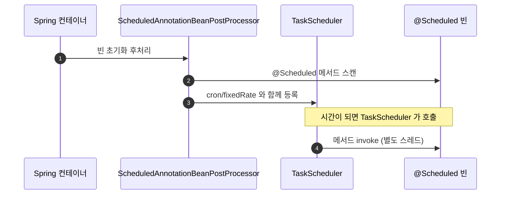
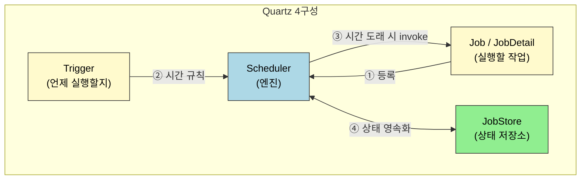
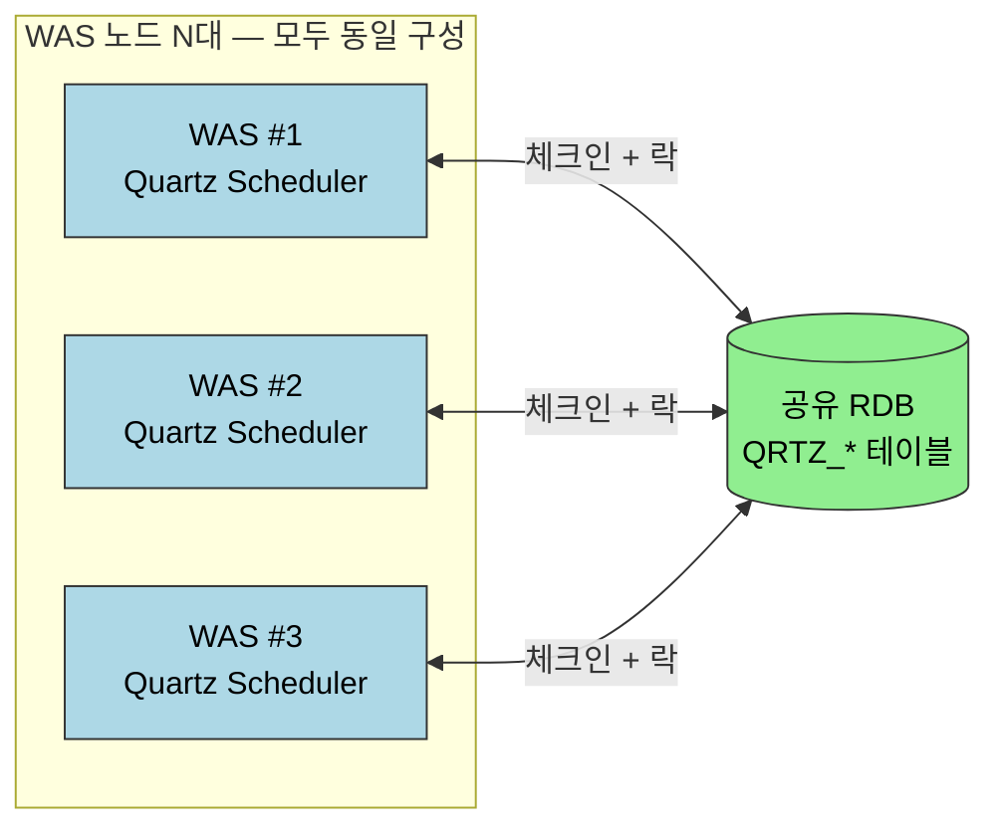
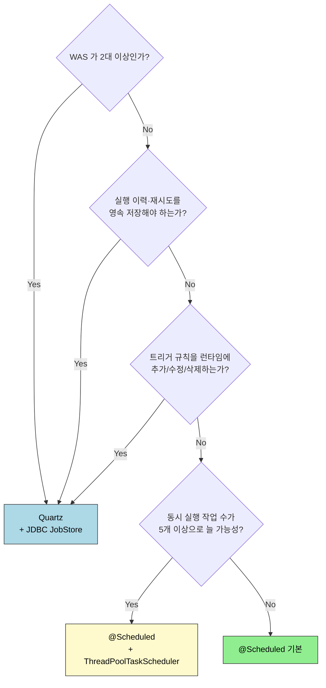

# 스프링 스케줄링 — @Scheduled에서 Quartz까지
---

> "정해진 시각에 무언가를 자동으로 돌린다" 라는 문장 한 줄을 Spring 에서 어떻게 풀어내는지, `@Scheduled` 한 줄로 시작해 `ThreadPoolTaskScheduler` 로 스레드를 분리하고, 마지막에는 Quartz 의 `Scheduler`/`Job`/`Trigger`/`JobStore` 4구성으로 다중 WAS 환경까지 일관되게 따라갑니다. 본 문서를 다 읽으면 "지금 우리 프로젝트는 `@Scheduled` 로 충분한가, Quartz 로 가야 하는가" 를 표 한 장으로 결정할 수 있어야 합니다.

## 진입 — 왜 AOP 문서와 같은 폴더에 두는가

> `@Scheduled` 는 어노테이션 하나로 메서드를 가로채 별도 스레드에서 호출합니다. 그 가로채기를 가능하게 하는 메커니즘이 AOP 프록시이므로, 같은 `05_aop/` 폴더에 묶어 학습합니다.

`@Scheduled` 가 붙은 빈은 Spring 이 기동 시점에 `ScheduledAnnotationBeanPostProcessor` 로 한 번 훑어서 메서드를 찾아내고, 해당 메서드를 `TaskScheduler` 에 등록합니다. 호출 시점에 프록시가 메서드를 한 번 가로채는 모양이라는 점에서 `@Transactional`, `@Async`, `@Cacheable` 과 같은 가족입니다. 따라서 "메서드를 빈 안에서 직접 호출하면 동작하지 않는다" 같은 AOP 프록시 제약이 그대로 적용됩니다. 같은 폴더에 두는 이유가 여기에 있습니다.

## 1. 한 줄 정의

> 스케줄링은 "특정 시점 또는 특정 주기에 코드를 자동으로 실행" 시키는 기술이며, Spring 은 가벼운 `@Scheduled` 부터 본격적인 `Quartz` 통합까지 같은 추상 위에서 단계적으로 제공합니다.

핵심 용어를 먼저 정리합니다.

| 용어 | 한 줄 정의 | 비유 |
|------|-----------|------|
| `Job` | 실제로 실행할 작업 코드 그 자체 | "주방에서 만들 요리 레시피" |
| `Trigger` | Job 을 *언제* 실행할지 결정하는 규칙 | "월요일 11시에 점심을 차린다" 라는 시간 약속 |
| `Scheduler` | Job 과 Trigger 를 묶어 시간이 되면 호출해 주는 엔진 | 약속을 들고 있다가 시간이 되면 주방장을 부르는 매니저 |
| `JobStore` | Job·Trigger 의 상태를 보관하는 저장소 (RAM 또는 DB) | 매니저가 적어 둔 약속 노트 |

## 2. 배치 vs 스케줄러 — 헷갈리는 두 개념

> 두 단어는 같은 자동화 영역에서 자주 나오지만 책임이 다릅니다. 스케줄러는 "언제 실행할지" 를 책임지고, 배치는 "한 번에 무엇을 얼마나 처리할지" 를 책임집니다.

- **배치 프로그램**: 대량의 데이터를 묶어서 일괄 처리하는 프로그램입니다. 정기적 대량 집계, 로그 파일 가공, 야간 정산 등이 대표적입니다. Spring Batch 같은 프레임워크가 이 영역을 담당합니다.
- **스케줄러**: 특정 시각이나 주기에 코드를 호출해 주는 트리거 엔진입니다. 호출당한 코드가 무엇을 하는지는 관심사가 아닙니다. "주기적 백업" 같은 가벼운 자동화부터 "배치 작업의 기동 신호" 까지 포함합니다.

실무에서는 **스케줄러가 배치를 호출하는 조합** 이 가장 흔합니다. Quartz `Trigger` 가 매일 02:00 에 발동되어 Spring Batch `Job` 한 건을 기동하는 식입니다.

### Java 표준이 이미 제공하던 것들

Spring 이 등장하기 전부터 Java 표준은 두 가지 스케줄링 도구를 갖고 있었습니다.

`java.util.Timer` 는 `TimerTask` 를 단일 스레드에서 순차 실행합니다.

```java
@Test
void timer() throws InterruptedException {
    Timer timer1 = new Timer();
    Timer timer2 = new Timer();

    TimerTask task11 = new TimerTask() {
        @Override
        public void run() {
            System.out.println("작업1-1 수행! " + Thread.currentThread());
        }
    };
    TimerTask task12 = new TimerTask() {
        @Override
        public void run() {
            System.out.println("작업1-2 수행! " + Thread.currentThread());
        }
    };

    timer1.schedule(task11, 5000);       // 5초 후 1회
    timer1.schedule(task12, 5000, 2000); // 5초 후 첫 실행, 이후 2초마다

    timer2.schedule(new TimerTask() {
        @Override public void run() { System.out.println("작업2-1 " + Thread.currentThread()); }
    }, 5000);

    TimeUnit.SECONDS.sleep(10);
}
```

`Timer` 는 간단하지만 **단일 스레드** 구조이므로 한 작업이 길어지면 다음 작업이 모두 밀립니다. 예외 한 번이면 타이머 자체가 죽습니다. 그래서 동시성과 복구가 필요한 환경에서는 다음 도구를 씁니다.

`ScheduledExecutorService` 는 `java.util.concurrent` 의 스레드 풀 기반 스케줄러입니다.

```java
@Test
void scheduler() throws InterruptedException {
    ScheduledExecutorService executor = Executors.newScheduledThreadPool(3);

    Runnable task1 = () -> System.out.println("작업1 " + Thread.currentThread());
    Runnable task2 = () -> System.out.println("작업2 " + Thread.currentThread());
    Runnable task3 = () -> System.out.println("작업3 " + Thread.currentThread());

    executor.schedule(task1, 5, TimeUnit.SECONDS);                  // 5초 후 1회
    executor.scheduleAtFixedRate(task2, 5, 2, TimeUnit.SECONDS);    // 시작 시각 기준 2초 간격
    executor.scheduleWithFixedDelay(task3, 5, 2, TimeUnit.SECONDS); // 종료 시각 기준 2초 간격

    TimeUnit.SECONDS.sleep(10);
    executor.shutdown();
}
```

여기서 한 가지만 짚어 둡니다. `scheduleAtFixedRate` 와 `scheduleWithFixedDelay` 의 차이는 **간격을 어디 기준으로 재느냐** 입니다. 전자는 "직전 실행 *시작* 시각 + 간격", 후자는 "직전 실행 *종료* 시각 + 간격" 입니다. 작업이 길어졌을 때 다음 실행이 겹치느냐 밀리느냐가 갈리는 지점이며, Spring `@Scheduled` 의 `fixedRate`/`fixedDelay` 가 동일한 의미를 그대로 물려받습니다.

## 3. @Scheduled — Spring 내장 스케줄러

> `@Scheduled` 는 메서드 한 곳에 시간 규칙을 선언하면 Spring 이 기동 시점에 `TaskScheduler` 로 등록해 자동 호출해 주는 가장 가벼운 옵션입니다.



기본 사용은 `@EnableScheduling` 한 번과 `@Scheduled` 한 줄이면 끝납니다. 그러나 기본 `TaskScheduler` 는 **단일 스레드** 입니다. 같은 시각에 여러 `@Scheduled` 메서드가 트리거되면 한 줄로 줄을 서서 실행됩니다. 한 메서드가 5분짜리면 그 5분간 다른 모든 스케줄이 멈춥니다. 이 한계가 다음 절로 넘어가는 이유입니다.

## 4. ThreadPoolTaskScheduler — 단일 스레드 한계 넘기

> `@Scheduled` 가 여러 개 있고 동시 실행이 필요하면 `TaskScheduler` 빈을 `ThreadPoolTaskScheduler` 로 교체해 풀 크기를 명시합니다.

```java
@Configuration
@EnableScheduling
public class SchedulingConfig implements SchedulingConfigurer {

    @Override
    public void configureTasks(ScheduledTaskRegistrar registrar) {
        registrar.setTaskScheduler(taskScheduler());
    }

    @Bean
    public ThreadPoolTaskScheduler taskScheduler() {
        ThreadPoolTaskScheduler scheduler = new ThreadPoolTaskScheduler();
        scheduler.setPoolSize(5);
        scheduler.setThreadNamePrefix("sched-");
        scheduler.setWaitForTasksToCompleteOnShutdown(true);
        return scheduler;
    }
}
```

이 정도면 단일 인스턴스 환경에서 **여러 가벼운 주기 작업** 은 충분히 굴러갑니다. 그러나 다음 세 가지가 필요한 순간 `@Scheduled` 만으로는 부족합니다.

1. 실행 이력·실패 재시도·미실행 보정(misfire) 을 *영속* 저장소에 남겨야 합니다.
2. WAS 가 여러 대인데 같은 작업이 한 번만 실행되어야 합니다(중복 방지).
3. 트리거 규칙을 런타임에 추가·수정·삭제해야 합니다(코드 재배포 없이).

세 가지 중 하나라도 해당하면 Quartz 로 넘어갈 차례입니다.

## 5. Quartz Scheduler — 본격 스케줄링 엔진

> Quartz 는 Job·Trigger·Scheduler·JobStore 4구성으로 스케줄링을 모델링한 오픈소스 엔진입니다. Spring 은 `SchedulerFactoryBean` 으로 컨테이너 친화적으로 감싸 통합합니다.



### 5.1 Job — 실행할 작업

`Job` 인터페이스의 `execute(JobExecutionContext)` 메서드 한 곳에 비즈니스 로직이 들어갑니다. 실행 시점에 필요한 부수 데이터는 `JobDataMap` 에 담아 전달합니다.

```java
public class MyJob implements Job {
    @Override
    public void execute(JobExecutionContext context) throws JobExecutionException {
        JobDataMap dataMap = context.getJobDetail().getJobDataMap();
        String email = dataMap.getString("email");
        String filePath = dataMap.getString("filePath");
        System.out.println("email = " + email);
        System.out.println("filePath = " + filePath);
    }
}
```

Job 클래스를 그대로 등록하지 않고 `JobDetail` 로 한 번 감쌉니다. `JobDetail` 은 "어떤 Job 클래스를, 어떤 키로, 어떤 부가 데이터와 함께 등록할지" 를 모은 메타데이터입니다.

```java
JobDetail jobDetail = JobBuilder.newJob(MyJob.class)
        .withIdentity("myJob", "group1")
        .usingJobData("email", "user@example.com")
        .usingJobData("filePath", "/path/to/file")
        .build();
```

`JobDetail` 에서 자주 들여다보는 속성은 다음과 같습니다.

```java
JobKey jobKey = jobDetail.getKey();
String description = jobDetail.getDescription();
Class<? extends Job> jobClass = jobDetail.getJobClass();
JobDataMap dataMap = jobDetail.getJobDataMap();
boolean isDurable = jobDetail.isDurable();
boolean isPersistJobDataAfterExecution = jobDetail.isPersistJobDataAfterExecution();
boolean isConcurrentExecutionDisallowed = jobDetail.isConcurrentExectionDisallowed();
boolean requestsRecovery = jobDetail.requestsRecovery();
```

`isDurable` 은 "트리거가 없어도 Job 이 살아남는가", `requestsRecovery` 는 "비정상 종료 시 다음 기동에서 자동 복구할 것인가" 를 의미합니다. 두 속성이 뒤에 나오는 클러스터 모드에서 의미를 갖습니다.

### 5.2 Scheduler — Job 과 Trigger 를 묶는 엔진

순수 Java 환경에서는 `StdSchedulerFactory.getDefaultScheduler()` 로 인스턴스를 얻고 `start()`/`scheduleJob()`/`shutdown()` 으로 수명 주기를 다룹니다.

```java
Scheduler scheduler = StdSchedulerFactory.getDefaultScheduler();
scheduler.start();
scheduler.scheduleJob(jobDetail, trigger);
scheduler.deleteJob(job.getKey());
scheduler.shutdown();
```

Spring 환경에서는 `SchedulerFactoryBean` 을 빈으로 등록하는 쪽을 권장합니다. 이렇게 해야 의존성 주입, 트랜잭션, AOP, 이벤트 리스너를 모두 컨테이너의 일관된 방식으로 적용할 수 있습니다.

```java
@Bean
public SchedulerFactoryBean schedulerFactoryBean(Trigger trigger,
                                                 @Qualifier("printJob") JobDetail jobDetail) {
    SchedulerFactoryBean schedulerFactory = new SchedulerFactoryBean();
    schedulerFactory.setAutoStartup(true);
    schedulerFactory.setStartupDelay(1);
    schedulerFactory.setQuartzProperties(quartzProperties());
    return schedulerFactory;
}

private Properties quartzProperties() {
    PropertiesFactoryBean propertiesFactoryBean = new PropertiesFactoryBean();
    propertiesFactoryBean.setLocation(new ClassPathResource("quarts.properties"));
    Properties properties = null;
    try {
        propertiesFactoryBean.afterPropertiesSet();
        properties = propertiesFactoryBean.getObject();
    } catch (IOException e) {
        throw new RuntimeException(e);
    }
    return properties;
}
```

`quarts.properties` 예시는 다음과 같습니다. 기본 설정·스레드 풀·JobStore·클러스터·플러그인 영역으로 묶여 있습니다.

```properties
# 스케줄러 기본 설정
org.quartz.scheduler.instanceName=MyScheduler
org.quartz.scheduler.instanceId=AUTO

# 스레드 풀 설정
org.quartz.threadPool.class=org.quartz.simpl.SimpleThreadPool
org.quartz.threadPool.threadCount=3
org.quartz.threadPool.threadPriority=5

# JobStore 설정 (RAM)
org.quartz.jobStore.class=org.quartz.simpl.RAMJobStore
org.quartz.jobStore.misfireThreshold=60000

# 클러스터 설정
org.quartz.jobStore.isClustered=false
org.quartz.jobStore.clusterCheckinInterval=20000

# 플러그인 설정
org.quartz.plugin.shutdownHook.class=org.quartz.plugins.management.ShutdownHookPlugin
org.quartz.plugin.shutdownHook.cleanShutdown=true
```

### 5.3 등록 패턴

Job 이 이미 등록되어 있는지 여부에 따라 `scheduleJob` 의 시그니처를 바꿔 호출합니다.

```java
if (Objects.isNull(scheduler.getJobDetail(jobKey)))
    scheduler.scheduleJob(jobDetail, lastTrigger);
else
    scheduler.scheduleJob(lastTrigger);
```

이미 등록된 Job 에 트리거만 추가로 붙이고 싶을 때 두 번째 분기가 필요합니다.

### 5.4 Listener — Job/Trigger 수명 주기 가로채기

`JobListener` 는 Job 의 실행 전/후/거부 시점에 호출되며, 운영 로깅이나 감사 로그에 자주 활용됩니다.

```java
@Component
public class JobsListener implements JobListener {
    @Override public String getName() { return "myJobListener"; }
    @Override public void jobToBeExecuted(JobExecutionContext context) {
        System.out.println("Job 실행되기 이전에 수행됩니다.");
    }
    @Override public void jobExecutionVetoed(JobExecutionContext context) {
        System.out.println("Job 실행이 거부되었을 때 수행됩니다.");
    }
    @Override public void jobWasExecuted(JobExecutionContext context, JobExecutionException jobException) {
        System.out.println("Job 실행 이후에 수행됩니다.");
    }
}
```

`TriggerListener` 는 트리거 발동·미발동(misfire)·완료 시점에 호출됩니다.

```java
@Component
public class TriggersListener implements TriggerListener {
    @Override public String getName() { return "MyTriggerListener"; }
    @Override public void triggerFired(Trigger trigger, JobExecutionContext context) {
        System.out.println("Trigger fired: " + trigger.getKey());
    }
    @Override public boolean vetoJobExecution(Trigger trigger, JobExecutionContext context) {
        return false;
    }
    @Override public void triggerMisfired(Trigger trigger) {
        System.out.println("Trigger misfired: " + trigger.getKey());
    }
    @Override public void triggerComplete(Trigger trigger, JobExecutionContext context,
                                          Trigger.CompletedExecutionInstruction triggerInstructionCode) {
        System.out.println("Trigger completed: " + trigger.getKey());
    }
}
```

리스너 등록은 `SchedulerFactoryBean` 에 모아 둘 수 있습니다.

```java
schedulerFactory.setGlobalJobListeners(jobsListener);
schedulerFactory.setGlobalTriggerListeners(triggersListener);
```

`triggerMisfired` 가 중요한 이유는 다음 절에서 다룰 **JobStore** 와 직접 연결되기 때문입니다. 트리거가 정해진 시각에 실행되지 못한 사실을 영속화해야 하므로, misfire 처리 정책과 저장소 선택은 함께 결정해야 합니다.

## 6. JobStore — RAM vs JDBC

> JobStore 는 Job·Trigger·실행 이력을 보관하는 영속 계층이며, 어떤 구현을 고르느냐에 따라 재기동 후 상태 복원 가능 여부와 클러스터링 가능 여부가 함께 결정됩니다.

| 항목 | `RAMJobStore` | `JDBCJobStoreTX` / `JobStoreCMT` |
|------|---------------|----------------------------------|
| 저장 위치 | JVM 힙 메모리 | RDB (`QRTZ_*` 테이블 11개) |
| 재기동 후 상태 | 모두 소실 | 그대로 복원 |
| 성능 | 가장 빠름 | RDB I/O 비용 부담 |
| 클러스터링 | 불가 | 가능 (`isClustered=true`) |
| 적합한 환경 | 단일 인스턴스, 일회성 작업 | 다중 인스턴스, 운영 환경 |

운영 환경에서 Quartz 를 도입하는 가장 큰 이유 한 가지를 꼽으라면 **JDBC JobStore + 클러스터 모드** 의 조합입니다. 단순히 "주기적 실행" 만 필요하다면 `@Scheduled` 로 충분합니다.

## 7. Trigger 종류 — SimpleTrigger / CronTrigger

> Trigger 는 Job 의 실행 시점을 결정하는 규칙이며, 단순 주기에는 `SimpleTrigger`, 복잡한 캘린더 규칙에는 `CronTrigger` 를 사용합니다.

`TriggerBuilder` 가 두 종류의 트리거를 한 API 로 생성합니다.

```java
Trigger trigger = TriggerBuilder.newTrigger()
        .withIdentity("complexTrigger", "group1")
        .forJob(jobDetail)
        .startAt(DateBuilder.futureDate(10, DateBuilder.IntervalUnit.MINUTE))
        .withSchedule(CronScheduleBuilder.cronSchedule("0/30 * * * * ?"))
        .endAt(DateBuilder.futureDate(1, DateBuilder.IntervalUnit.HOUR))
        .usingJobData("myKey", "myValue")
        .withPriority(5)
        .modifiedByCalendar("myCalendar")
        .build();
```

`DateBuilder` 가 함께 등장하는 이유는 `java.util.Date` 가 불변이 아니라서 직접 다루면 사이드 이펙트가 생기기 때문입니다. `DateBuilder` 의 `futureDate` 같은 팩토리로 받으면 비교적 안전합니다.

### 7.1 SimpleTrigger

고정 간격·고정 횟수 반복을 원할 때 사용합니다.

```java
Trigger trigger = TriggerBuilder.newTrigger()
        .withIdentity("simpleTrigger", "group1")
        .startNow()
        .withSchedule(SimpleScheduleBuilder.simpleSchedule()
                .withIntervalInSeconds(60)
                .withRepeatCount(5)
                .withMisfireHandlingInstructionFireNow())
        .build();
```

`withMisfireHandlingInstructionFireNow()` 가 의미하는 바는 "정각에 실행되지 못한 트리거가 있다면 *지금 즉시* 한 번 실행합니다" 입니다. 운영자가 결정해야 하는 정책 영역입니다.

### 7.2 CronTrigger

요일·월·시간 같은 캘린더 규칙이 필요할 때 사용합니다.

```java
Trigger cronTrigger = TriggerBuilder.newTrigger()
        .withIdentity("weeklyTrigger", "group1")
        .withSchedule(CronScheduleBuilder.cronSchedule("0 30 10 ? * MON"))
        .build();
```

cron 표현식 `0 30 10 ? * MON` 은 "매주 월요일 오전 10시 30분 00초" 를 의미합니다. Quartz cron 은 표준 6/7 필드(초·분·시·일·월·요일·연도) 구조이며, `?` 는 "일과 요일 중 하나만 지정" 이라는 규칙 때문에 비워 두는 자리입니다.

## 8. Multi-WAS 환경 — Cluster 모드

> WAS 가 두 대 이상인 환경에서 같은 Job 이 한 번만 실행되도록 보장하려면, JDBC JobStore 위에 `isClustered=true` 를 켜고 모든 노드가 동일한 DB 를 바라보게 구성합니다.



동작 원리를 한 문장으로 요약하면 "각 노드가 일정 간격(`clusterCheckinInterval`) 으로 DB 에 자신의 생존을 기록하고, 트리거가 발동될 때 행 단위 락으로 단 한 노드만 실행을 잡는다" 입니다. 노드 하나가 죽어도 다른 노드가 `requestsRecovery=true` 인 Job 을 인계받아 다시 실행합니다.

클러스터 모드를 켤 때 충족해야 할 전제 조건이 몇 가지 있습니다.

1. 모든 노드의 `org.quartz.scheduler.instanceName` 이 동일해야 합니다(같은 클러스터로 묶이는 키).
2. 모든 노드의 `org.quartz.scheduler.instanceId` 는 `AUTO` 로 서로 달라야 합니다(노드 식별).
3. 모든 노드의 시스템 시계가 거의 일치해야 합니다(시간 동기화가 흐트러지면 락 경합도 함께 어긋납니다).
4. JobStore 가 `JDBCJobStoreTX` 또는 `JobStoreCMT` 여야 합니다(RAMJobStore 는 불가).

이 네 가지 중 어느 하나라도 흔들리면 "두 노드에서 Job 이 중복 실행되었다" 같은 사고로 직결됩니다.

## 9. 상태가 있는 Job — @PersistJobDataAfterExecution / @DisallowConcurrentExecution

> Quartz Job 은 기본적으로 상태가 없다고 가정합니다. 실행 사이에 데이터를 유지하고 싶다면 `@PersistJobDataAfterExecution`, 같은 Job 의 동시 실행을 막고 싶다면 `@DisallowConcurrentExecution` 을 함께 붙입니다.

`JobDataMap` 의 값을 다음 실행으로 이어 가고 싶을 때 다음과 같이 작성합니다.

```java
@PersistJobDataAfterExecution
public class StatefulJob implements Job {
    public void execute(JobExecutionContext context) throws JobExecutionException {
        JobDataMap dataMap = context.getJobDetail().getJobDataMap();
        int count = dataMap.getInt("count");
        count++;
        dataMap.put("count", count);
        System.out.println("Job is running for the " + count + " time");
    }
}
```

문제는 같은 Job 을 여러 트리거로 등록하면 동일 시점에 동시 실행될 수 있고, `JobDataMap` 을 동시에 갱신하면서 race condition 이 발생한다는 점입니다. 예시로 10초 트리거 두 개와 5초 트리거 한 개를 같은 Job 에 묶어 보면 같은 시각의 +3 누적 대신 각자 +1 만 반영되는 결과가 나타납니다.

```java
private void applyStatefulSchedule() {
    JobKey jobKey = JobKey.jobKey("stateful key1", "stateful group");
    JobDetail jobDetail = jobDetailService.statefulBuild(jobKey);

    TriggerKey triggerKey  = TriggerKey.triggerKey("stateful key1", "stateful group");
    Trigger trigger        = triggerService.everySeconds(jobKey, triggerKey);

    TriggerKey triggerKey2 = TriggerKey.triggerKey("stateful key2", "stateful group");
    Trigger trigger2       = triggerService.everySeconds(jobKey, triggerKey2);

    TriggerKey triggerKey3 = TriggerKey.triggerKey("stateful key3", "stateful group");
    Trigger trigger3       = triggerService.everySeconds2(jobKey, triggerKey3);

    schedule(jobDetail, trigger,  jobKey, triggerKey);
    schedule(jobDetail, trigger2, jobKey, triggerKey2);
    schedule(jobDetail, trigger3, jobKey, triggerKey3);
}
```

해결책은 `@DisallowConcurrentExecution` 을 함께 붙이는 것입니다. 한 Job 클래스에 대한 동시 실행을 Quartz 가 직렬화해 줍니다.

```java
@PersistJobDataAfterExecution
@DisallowConcurrentExecution
public class StatefulJob implements Job {

    @Override
    public void execute(JobExecutionContext context) {
        JobDataMap dataMap = context.getJobDetail().getJobDataMap();
        int count = dataMap.getInt("count");
        count++;

        try {
            Thread.sleep(1000);
        } catch (InterruptedException e) {
            Thread.currentThread().interrupt();
        }

        dataMap.put("count", count);
        System.out.println("Job is running for the " + count + " time");
    }
}
```

두 어노테이션은 거의 항상 **세트로** 사용합니다. "상태를 영속하려면 동시 실행도 함께 막아야 합니다" 가 기본 원칙입니다.

## 10. @Scheduled vs Quartz 결정 트리

> 둘 중 무엇을 쓸지 결정할 때 다섯 가지만 점검하면 충분합니다.



비교 표로 한 번 더 정리합니다.

| 항목 | `@Scheduled` 기본 | `@Scheduled` + ThreadPool | Quartz + JDBC |
|------|------------------|---------------------------|---------------|
| 설정 비용 | 어노테이션 1줄 | 설정 클래스 1개 | 의존성·DDL·설정 모두 필요 |
| 동시 실행 | 단일 스레드 | 풀 크기까지 병렬 | 풀 + 분산 |
| 재기동 후 복원 | 없음 | 없음 | 있음 |
| 클러스터 중복 방지 | 불가 | 불가 | 가능 |
| 동적 트리거 변경 | 어렵다 | 어렵다 | API 로 자유롭게 |
| 학습 곡선 | 낮음 | 낮음 | 중간 이상 |

## 11. 면접 대비 요약

- 배치와 스케줄러의 차이는 "무엇을 처리하는가(배치) vs 언제 호출할까(스케줄러)" 의 차이입니다. 보통 스케줄러가 배치를 호출하는 조합으로 함께 사용됩니다.
- `@Scheduled` 는 `ScheduledAnnotationBeanPostProcessor` 가 기동 시점에 스캔해서 `TaskScheduler` 에 등록하는 구조이며, 기본 `TaskScheduler` 가 단일 스레드라는 점이 가장 큰 함정입니다.
- `scheduleAtFixedRate` 와 `scheduleWithFixedDelay` 는 간격을 "시작 시각 기준" 으로 재느냐 "종료 시각 기준" 으로 재느냐가 갈리는 지점이며, 작업이 길어졌을 때 다음 실행 겹침 여부를 결정합니다.
- Quartz 는 Job(무엇을)·Trigger(언제)·Scheduler(엔진)·JobStore(상태 저장소) 4구성으로 모델링되며, JobStore 를 `JDBCJobStoreTX` 로 두고 `isClustered=true` 를 켜야 다중 WAS 중복 실행을 막을 수 있습니다.
- 상태를 유지하는 Job 은 `@PersistJobDataAfterExecution` 과 `@DisallowConcurrentExecution` 을 세트로 사용해야 race condition 을 피할 수 있습니다.
- `@Scheduled` 와 Quartz 의 선택 기준은 "다중 WAS / 영속 이력 / 동적 트리거" 세 가지이며, 셋 중 어느 하나라도 필요하면 Quartz, 아니면 `@Scheduled` 입니다.

## 12. 다음에 읽을 것

- 같은 폴더의 [01-01. 횡단 관심사와 AOP — 프록시로 풀어내기](./01-01.횡단 관심사와 AOP — 프록시로 풀어내기.md) 에서 `@Scheduled` 가 의존하는 프록시 메커니즘의 뿌리를 함께 살펴봅니다.
- [Spring Framework Reference — Scheduling](https://docs.spring.io/spring-framework/reference/integration/scheduling.html) 에서 `TaskScheduler`/`TaskExecutor` 의 추상 계층을 한 번 더 정리합니다.
- [Quartz Examples (GitHub)](https://github.com/quartz-scheduler/quartz/tree/main/examples/src/main/java/org/quartz/examples) 의 예제들을 차례대로 돌려 보면 Listener·Calendar·Plugin 의 실제 동작이 손에 잡힙니다.
- 다중 WAS 운영을 본격적으로 설계할 때는 [Multi-WAS Cluster 환경 구현 (advenoh)](https://blog.advenoh.pe.kr/spring/Multi-WAS-환경을-위한-Cluster-환경의-Quartz-Job-Scheduler-구현/) 가 실전 함정을 잘 정리해 두었습니다.
