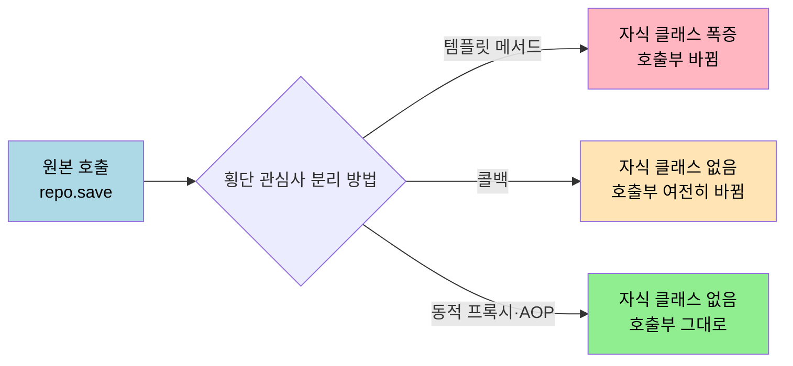
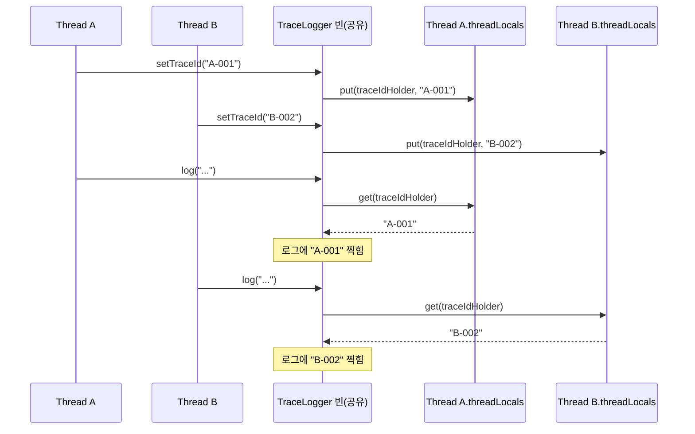
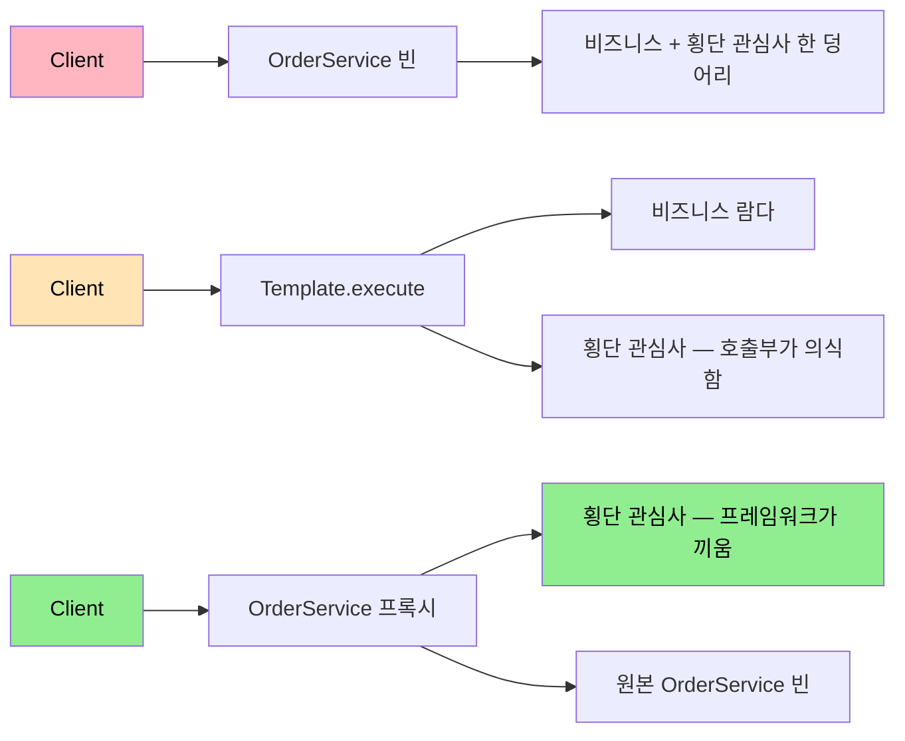

# 템플릿·콜백과 ThreadLocal — AOP 등장 직전의 두 시도
---

> [`01-01. 횡단 관심사와 AOP`](01-01.횡단%20관심사와%20AOP%20—%20프록시로%20풀어내기.md) 의 §2 는 "필터·인터셉터로 풀리지 않는다" 로 끝나고, §3 는 곧바로 JDK 동적 프록시로 점프합니다. 그 사이에는 자바 개발자들이 객체지향 패턴만으로 횡단 관심사를 풀어 보려 했던 두 가지 진지한 시도가 있었습니다. 본 문서는 그 두 시도(템플릿 메서드·콜백 패턴, ThreadLocal)가 어떤 자리를 메웠고 어디서 한계에 부딪혀 결국 동적 프록시·AOP 가 등장했는지를 한 흐름으로 묶습니다.

## 진입 — 왜 이 두 시도가 AOP 와 같은 폴더에 있는가

> AOP 어노테이션부터 외운 사람에게는 "왜 이 패턴들을 굳이 또 봐야 하느냐" 가 자연스러운 의문입니다. 답은 단순합니다. 두 시도의 *해결한 부분* 과 *남은 한계* 가 그대로 동적 프록시·AOP 의 설계 동기로 이어지기 때문입니다.

템플릿 메서드와 콜백 패턴은 "코드 구조" 로 횡단 관심사를 떼어 내려 했고, ThreadLocal 은 "데이터의 흐름" 으로 횡단 관심사를 격리하려 했습니다. 둘 다 부분적으로는 성공했고 지금도 실무에서 자주 쓰입니다. 그러나 두 도구 모두 *그 코드를 쓰는 쪽* 이 의식적으로 협조해야 한다는 공통 한계가 있습니다. 인터페이스 메서드 하나를 빠뜨리거나 `remove()` 한 줄을 잊으면 격리가 깨집니다. AOP 는 바로 이 "쓰는 쪽의 협조" 자체를 프레임워크가 가로채는 방식으로 풀어 줍니다.

이 흐름을 보지 않고 `@Aspect` 부터 쓰면, AOP 가 *왜* 굳이 동적 프록시 같은 무거운 도구를 끌고 와야 했는지 답이 안 나옵니다. 본 편은 그 답을 두 패턴의 한계로부터 끌어냅니다.

## 1. 한 줄 정의

> 템플릿 메서드·콜백 패턴은 변하는 부분과 변하지 않는 부분을 *상속* 또는 *람다 전달* 로 분리하는 객체지향 도구이고, ThreadLocal 은 같은 객체가 여러 스레드에서 공유돼도 데이터만은 스레드별로 격리되게 해 주는 자바 표준 클래스입니다. 두 도구는 AOP 가 동적 프록시로 한 번에 풀어 버린 두 가지 문제 — 코드 중복과 상태 공유 — 를 각각의 방식으로 풀어 본 시도입니다.

한 문장에 두 도구의 동작 방식(상속·람다·ThreadLocal)과 풀어낸 문제(중복·상태 공유)가 모두 들어 있습니다. 본문은 이 한 문장을 §2 ~ §5 로 풀어 갑니다.

## 2. 출발 — 같은 코드가 반복되는 풍경

> 두 시도 모두 같은 풍경에서 시작합니다. 비즈니스 로직 한 줄을 감싸는 *시작·정리* 코드가 모든 메서드에 똑같이 반복되는 풍경입니다.

다음은 실행 시간을 측정하는 로직을 메서드마다 직접 박은 코드입니다.

```java
@Service
public class OrderService {
    public Order place(OrderCommand cmd) {
        long start = System.currentTimeMillis();
        log.info("place() 시작");
        try {
            // 비즈니스 로직 — 한 줄
            return orderRepository.save(cmd.toOrder());
        } finally {
            long elapsed = System.currentTimeMillis() - start;
            log.info("place() 종료 elapsed={}ms", elapsed);
        }
    }

    public Order cancel(Long orderId) {
        long start = System.currentTimeMillis();
        log.info("cancel() 시작");
        try {
            // 비즈니스 로직 — 한 줄
            return orderRepository.cancel(orderId);
        } finally {
            long elapsed = System.currentTimeMillis() - start;
            log.info("cancel() 종료 elapsed={}ms", elapsed);
        }
    }
}
```

두 메서드의 6 줄 중 *비즈니스 한 줄* 만 다르고 나머지는 동일합니다. 메서드가 100 개면 이 보일러플레이트가 100 번 반복되고, 로깅 포맷을 한 번 바꾸려면 100 군데를 손대야 합니다. 횡단 관심사 — 본문에서는 "어디서나 반복되는 부가 로직" — 의 전형적인 풍경입니다.

이 풍경을 직접 풀어 보는 첫 시도가 §3 의 템플릿 메서드 패턴입니다.

## 3. 템플릿 메서드 패턴 — 상속으로 분리하는 시도

> 변하지 않는 *틀(템플릿)* 을 부모 클래스에 두고, 변하는 부분 한 군데만 자식 클래스가 채우게 합니다. 상속을 활용한 가장 고전적인 OO 도구입니다.

### 3.1 패턴의 구조

부모 클래스가 시간 측정과 try-finally 의 큰 틀을 잡고, 추상 메서드 `call()` 한 군데만 비워 둡니다.

```java
public abstract class AbstractTemplate {
    public void execute() {
        long start = System.currentTimeMillis();
        log.info("{} 시작", taskName());
        try {
            call();
        } finally {
            long elapsed = System.currentTimeMillis() - start;
            log.info("{} 종료 elapsed={}ms", taskName(), elapsed);
        }
    }

    protected abstract void call();
    protected abstract String taskName();
}
```

자식이 비즈니스 한 줄만 채웁니다.

```java
public class PlaceOrderTemplate extends AbstractTemplate {
    private final OrderRepository repo;
    private final OrderCommand cmd;
    public PlaceOrderTemplate(OrderRepository repo, OrderCommand cmd) {
        this.repo = repo;
        this.cmd = cmd;
    }
    @Override protected void call() { repo.save(cmd.toOrder()); }
    @Override protected String taskName() { return "place()"; }
}
```

호출부는 인스턴스를 만들고 `execute()` 만 부르면 됩니다.

```java
new PlaceOrderTemplate(orderRepository, cmd).execute();
```

### 3.2 풀린 것과 남은 한계

풀린 것은 분명합니다. 시간 측정·로깅의 `try-finally` 보일러플레이트가 부모 한 군데로 모이고, 자식은 *비즈니스* 만 적습니다. 100 개 메서드라도 자식 100 개를 두면 끝납니다.

남은 한계도 분명합니다.

1. **클래스 폭증** — 비즈니스 메서드 하나당 자식 클래스 하나가 필요합니다. 100 개 메서드면 100 개 클래스입니다. IDE 의 패키지 탐색기가 자식 클래스로 가득 차고, 이름 짓기도 점점 어려워집니다.
2. **상속 강제** — 자식은 반드시 `AbstractTemplate` 을 상속해야 합니다. 이미 다른 부모를 갖고 있는 클래스에는 적용할 수 없고, 자바는 단일 상속만 허용하므로 다른 횡단 관심사용 부모와 합치기도 어렵습니다.
3. **호출부가 바뀜** — 기존 `orderService.place(cmd)` 한 줄이 `new PlaceOrderTemplate(repo, cmd).execute()` 로 바뀝니다. 메서드 시그니처가 사라지고 인스턴스 생성·`execute()` 로 갈리니, 같은 도메인의 다른 코드도 같이 손대야 합니다.

세 한계 중 가장 무거운 것은 3번입니다. 횡단 관심사를 떼어 내려 했는데 *비즈니스 호출 방식* 자체가 바뀐다는 사실은, 이 도구가 "투명한 횡단 관심사 분리" 라는 목표에 부합하지 않는다는 신호입니다.

## 4. 콜백 패턴 — 람다로 분리하는 시도

> 자식 클래스를 만들 게 아니라, *변하는 부분* 을 함수 객체(콜백)로 메서드 인자에 전달합니다. 같은 발상을 상속 대신 *위임* 으로 푼 도구입니다.

### 4.1 패턴의 구조

템플릿 클래스가 한 번만 만들어집니다. 비즈니스 로직은 `Runnable` 같은 함수형 인터페이스로 받습니다.

```java
@Component
public class TimeTemplate {
    public <T> T execute(String taskName, Supplier<T> task) {
        long start = System.currentTimeMillis();
        log.info("{} 시작", taskName);
        try {
            return task.get();
        } finally {
            long elapsed = System.currentTimeMillis() - start;
            log.info("{} 종료 elapsed={}ms", taskName, elapsed);
        }
    }
}
```

호출부가 자식 클래스 대신 람다를 넘깁니다.

```java
@Service
@RequiredArgsConstructor
public class OrderService {
    private final TimeTemplate template;
    private final OrderRepository repo;

    public Order place(OrderCommand cmd) {
        return template.execute("place()", () -> repo.save(cmd.toOrder()));
    }
    public Order cancel(Long orderId) {
        return template.execute("cancel()", () -> repo.cancel(orderId));
    }
}
```

### 4.2 풀린 것과 남은 한계

콜백 패턴이 풀어 준 부분은 두 가지로 정리됩니다.

1. **자식 클래스 폭증 해소** — `TimeTemplate` 인스턴스 하나가 모든 호출을 처리하므로, 비즈니스 메서드마다 새 클래스를 만들 필요가 사라집니다.
2. **단일 상속 제약 해소** — `OrderService` 가 어떤 부모를 갖든 영향이 없습니다. 횡단 관심사 도입이 도메인 객체의 상속 구조를 묶지 않습니다.

남은 한계도 두 가지입니다.

1. **호출부가 여전히 바뀜** — `repo.save(cmd.toOrder())` 한 줄이 `template.execute("place()", () -> repo.save(cmd.toOrder()))` 가 됩니다. 모든 비즈니스 메서드를 손대야 한다는 사실은 변하지 않았습니다. 단지 손대는 모양이 깔끔해졌을 뿐입니다.
2. **횡단 관심사 추가가 곱셈식 비용** — 시간 측정 외에 트랜잭션도 자동으로 걸어야 한다면 `TransactionTemplate` 을 또 만들고, 두 템플릿을 어떻게 결합할지 결정해야 합니다. `template.execute("place()", () -> tx.execute(() -> repo.save(...)))` 같은 중첩이 생깁니다.

콜백 패턴은 Spring 의 `JdbcTemplate`, `TransactionTemplate`, `RestTemplate` 같은 이름에 그대로 박혀 있어 지금도 살아 있는 도구입니다. 다만 그 이름들은 모두 *명시적으로 호출* 해야 합니다. AOP 가 푸는 자리는 "호출부 자체가 횡단 관심사를 의식하지 않게 만들기" 입니다.



세 방법의 차이는 한 축으로 줄어듭니다. **호출부가 바뀌는가**. 동적 프록시는 호출부를 건드리지 않고도 같은 결과를 얻습니다. [`01-01`](01-01.횡단%20관심사와%20AOP%20—%20프록시로%20풀어내기.md) §3 으로 진입하면 그 방식이 어떻게 가능한지가 이어집니다.

## 5. ThreadLocal — 데이터 흐름의 시도

> §3·§4 가 "코드 구조" 의 시도였다면, ThreadLocal 은 "데이터의 흐름" 의 시도입니다. 같은 객체가 여러 스레드에서 호출돼도 *내부에 담은 값만은* 스레드별로 격리되도록 만드는 자바 표준 도구입니다.

### 5.1 왜 등장했는가 — 공유 객체의 상태 오염

Spring 빈은 기본 싱글톤입니다. WAS 가 [`01_core/02-01`](../01_core/02-01.WAS와%20서블릿%20—%20HTTP%20처리의%20토대.md) §4 에서 본 것처럼 *1 요청 = 1 스레드* 모델로 동작하므로, 한 빈이 여러 스레드에서 동시에 호출됩니다. 인스턴스 필드를 두고 거기 값을 쌓는 순간 다른 스레드 호출과 섞입니다.

```java
@Component
public class TraceLogger {
    private String currentTraceId;   // 위험 — 인스턴스 필드

    public void log(String message) {
        log.info("[{}] {}", currentTraceId, message);
    }

    public void setTraceId(String traceId) {
        this.currentTraceId = traceId;
    }
}
```

스레드 A 가 `setTraceId("A-001")` 직후 `log()` 를 부르기 전에, 스레드 B 가 `setTraceId("B-002")` 를 실행하면 A 의 로그가 B 의 traceId 로 찍힙니다. 디버깅이 거의 불가능해집니다.

가장 단순한 해법은 메서드 인자로 traceId 를 매번 넘기는 것입니다. 그러나 `Service → Repository` 같은 다섯 단계 호출 체인 전부에 인자를 추가하는 비용이 큽니다. ThreadLocal 은 이 인자 전파를 *눈에 안 보이는 채로* 대신 해 줍니다.

### 5.2 API — set / get / remove

`ThreadLocal<T>` 의 핵심 API 는 세 개입니다.

```java
@Component
public class TraceLogger {
    private final ThreadLocal<String> traceIdHolder = new ThreadLocal<>();

    public void log(String message) {
        log.info("[{}] {}", traceIdHolder.get(), message);
    }

    public void setTraceId(String traceId) {
        traceIdHolder.set(traceId);
    }

    public void clearTraceId() {
        traceIdHolder.remove();
    }
}
```

`set(value)` 가 *현재 스레드 전용 슬롯* 에 값을 저장하고, `get()` 이 *현재 스레드 슬롯* 의 값을 읽습니다. 다른 스레드가 같은 `traceIdHolder` 인스턴스로 `get()` 을 부르면 *그 스레드의 슬롯* 을 본 결과를 받습니다. 슬롯은 JVM 의 `Thread` 객체 안 `threadLocals` 맵에 저장됩니다.



같은 `traceIdHolder` 변수이지만 슬롯은 스레드마다 따로 있습니다. 같은 빈을 공유해도 데이터는 섞이지 않습니다.

### 5.3 메모리 누수 — remove() 의 필수성

ThreadLocal 의 가장 자주 만나는 함정은 **WAS 스레드 풀** 과의 조합입니다. 톰캣은 요청마다 새 스레드를 만들지 않고 풀에서 꺼냈다가 돌려놓습니다. 요청 처리 끝에 `remove()` 를 부르지 않으면 *다음 요청* 이 같은 스레드를 빌렸을 때 이전 요청의 값을 그대로 봅니다.

```java
@RestController
@RequiredArgsConstructor
public class OrderController {
    private final TraceLogger traceLogger;

    @PostMapping("/orders")
    public ResponseEntity<?> create(@RequestBody OrderRequest req) {
        traceLogger.setTraceId(UUID.randomUUID().toString());
        try {
            return ResponseEntity.ok(orderService.place(req.toCommand()));
        } finally {
            traceLogger.clearTraceId();   // 필수 — 스레드 풀로 돌아가기 전 정리
        }
    }
}
```

`finally` 블록에서 `remove()` 를 빠뜨리면 두 가지 문제가 동시에 발생합니다.

1. **이전 traceId 의 누출** — 같은 스레드를 다음 요청이 빌렸을 때 이전 요청의 traceId 를 그대로 봅니다. 로그가 엉뚱한 요청 식별자로 찍혀 디버깅이 거의 불가능해집니다.
2. **메모리 누수** — traceId 값이 무거운 객체(예: 사용자 인증 정보 전체)이면 GC 되지 않고 스레드 풀에 묶여 *진정한 의미의* 메모리 누수가 됩니다. 스레드 풀의 모든 스레드가 누적되면 힙이 천천히 차오릅니다.

### 5.4 풀린 것과 남은 한계

풀린 것은 다음 두 가지입니다.

1. **상태 격리** — 싱글톤 빈이 인스턴스 필드 없이도 요청별 상태(traceId, 인증 정보, 트랜잭션 컨텍스트)를 다룰 수 있습니다.
2. **인자 전파 비용 제거** — `Service → Repository` 다섯 단계에 traceId 인자를 끼우지 않아도 됩니다.

남은 한계는 한 가지에 모입니다.

1. **`remove()` 호출의 책임이 *쓰는 쪽* 에 있음** — 컨트롤러나 필터가 try-finally 로 정리해 줘야 합니다. 한 군데라도 빠뜨리면 §5.3 의 누수가 발생합니다. 마이크로서비스의 100 개 컨트롤러 메서드에 매번 `traceLogger.clearTraceId()` 를 적는 비용은 §2 의 시간 측정 로깅과 정확히 같은 *횡단 관심사* 입니다.

여기서 그림이 닫힙니다. ThreadLocal 은 *상태* 차원의 횡단 관심사를 해결했지만, *그 ThreadLocal 을 정리하는 호출* 자체가 또 다른 횡단 관심사로 남았습니다. 결국 `set`·`remove` 한 쌍을 자동으로 끼워 넣을 도구가 따로 필요해지고, 그 도구가 바로 동적 프록시·AOP 입니다.

## 6. AOP 로의 자연스러운 다리

> §3·§4·§5 의 한계를 한 줄로 모으면 모두 같은 말이 됩니다. *호출부가 횡단 관심사를 의식해야 한다*. 동적 프록시·AOP 는 이 의식 자체를 프레임워크가 떠맡습니다.

### 6.1 세 도구가 남긴 미해결 과제

| 시도 | 풀린 부분 | 남은 한계 |
|------|---------|---------|
| 템플릿 메서드 | 보일러플레이트 부모로 모임 | 자식 클래스 폭증, 단일 상속 강제, 호출부 바뀜 |
| 콜백 패턴 | 자식 폭증·상속 제약 해소 | 호출부 여전히 바뀜, 중첩 횡단 관심사 결합 비용 |
| ThreadLocal | 상태 격리·인자 전파 비용 제거 | `remove()` 호출이 또 다른 횡단 관심사로 남음 |

세 도구 모두 *코드를 쓰는 쪽* 이 의식적으로 협조해야 합니다. 호출부에 `template.execute(...)` 를 적든, `finally { remove(); }` 를 적든 마찬가지입니다.

### 6.2 AOP 가 가져온 전환

[`01-01`](01-01.횡단%20관심사와%20AOP%20—%20프록시로%20풀어내기.md) §3 의 동적 프록시는 *호출부를 건드리지 않고* 같은 결과를 만듭니다. `orderService.place(cmd)` 한 줄을 그대로 두고도 프록시가 호출을 가로채 시간 측정·traceId 설정·`remove()` 까지 자동으로 처리합니다. 호출자는 횡단 관심사를 의식할 필요가 없어집니다.

이 전환을 가능하게 한 핵심 한 줄은 다음과 같습니다. *프록시 객체가 원본과 같은 인터페이스를 구현해 호출자에게 같은 모양을 보여 주는 동안, 그 안에서 부가 로직을 실행한다.* 객체지향 패턴은 *호출자를 바꿔서* 분리했고, AOP 는 *호출자가 보는 객체를 바꿔치기해서* 분리했습니다.



위 흐름의 세 번째 행이 동적 프록시·AOP 의 자리입니다. 횡단 관심사의 "어디서 끼어드는가" 와 "누가 끼워 넣는가" 가 분리되어 있다는 사실이 이 그림의 요점입니다.

### 6.3 ThreadLocal 의 자리는 사라지지 않음

오해를 미리 풀어 둡니다. AOP 가 등장했다고 ThreadLocal 이 폐기되는 게 아닙니다. Spring 의 `TransactionSynchronizationManager` 는 트랜잭션 컨텍스트(현재 connection·rollback-only 플래그)를 ThreadLocal 로 보관하고, Spring Security 의 `SecurityContextHolder` 도 기본 전략이 ThreadLocal 입니다. AOP 는 `set`·`remove` 한 쌍을 자동으로 끼워 넣어 주는 역할을 맡고, ThreadLocal 자체는 그 안쪽의 *값 저장소* 로 그대로 살아 있습니다.

같은 그림이 콜백 패턴에도 적용됩니다. `JdbcTemplate` 은 AOP 와 별개로 여전히 *명시적 호출* 의 자리를 차지합니다. SQL 한 줄을 위해 `Connection` 열고 닫는 자원 관리 같은 *호출자가 의식할 필요가 있는* 횡단 관심사에는 콜백이 더 적합합니다. AOP 와 콜백은 배타적 도구가 아니라 *어디까지를 호출자가 알아야 하는가* 기준에 따라 갈리는 두 도구입니다.

## 7. 면접 대비 요약

> 본 편을 읽은 뒤 다음 질문에 모두 답할 수 있어야 합니다.

1. 템플릿 메서드 패턴이 횡단 관심사를 *완전히* 떼어 내지 못한 세 가지 이유는? — 자식 클래스 폭증, 단일 상속 강제, 호출부가 `execute()` 로 바뀜.
2. 콜백 패턴이 템플릿 메서드의 한계 중 어떤 두 가지를 풀었고, 어떤 한 가지는 그대로 남겼는가? — 자식 폭증과 상속 제약을 풀었고, *호출부가 여전히 바뀐다* 는 한계는 그대로입니다.
3. ThreadLocal 이 풀어 준 두 가지 문제와 그래도 남은 한 가지 한계는? — 싱글톤 빈의 상태 격리와 인자 전파 비용 제거를 풀었고, `remove()` 호출 책임이 호출자에게 남았습니다.
4. ThreadLocal 메모리 누수가 *왜 WAS 스레드 풀에서만* 문제가 되는가? — 스레드 풀이 스레드를 재사용하기 때문입니다. 새 요청이 같은 스레드를 빌리면 이전 값이 그대로 보입니다.
5. 동적 프록시·AOP 가 객체지향 패턴 세 가지와 결정적으로 다른 한 줄은? — *호출부를 건드리지 않고* 같은 결과를 만듭니다. 객체지향 패턴은 호출자를 바꾸고, AOP 는 호출자가 보는 객체를 바꿔치기합니다.
6. AOP 도입 후에도 ThreadLocal 과 콜백 패턴이 살아 있는 두 가지 예시는? — `TransactionSynchronizationManager` / `SecurityContextHolder` 가 ThreadLocal, `JdbcTemplate` / `TransactionTemplate` 이 콜백입니다.

각 질문에 막히면 본문의 해당 절(§3 ~ §6)로 돌아갑니다.

## 8. 다음에 읽을 것

- [`01-01.횡단 관심사와 AOP — 프록시로 풀어내기`](01-01.횡단%20관심사와%20AOP%20—%20프록시로%20풀어내기.md) §3 — 동적 프록시가 호출부를 건드리지 않고 같은 결과를 만드는 구체 메커니즘
- [`../01_core/02-01.WAS와 서블릿 — HTTP 처리의 토대`](../01_core/02-01.WAS와%20서블릿%20—%20HTTP%20처리의%20토대.md) §4 — ThreadLocal 누수의 무대인 스레드 풀
- [`../01_core/01-02.Spring과 디자인 패턴`](../01_core/01-02.Spring과%20디자인%20패턴.md) — 템플릿 메서드·콜백 패턴의 일반론과 다른 패턴들의 자리
- [Spring Framework Reference — JDBC Core](https://docs.spring.io/spring-framework/reference/data-access/jdbc/core.html) — 콜백 패턴이 살아 있는 `JdbcTemplate` 의 공식 진입점
- [Java SE — ThreadLocal](https://docs.oracle.com/javase/8/docs/api/java/lang/ThreadLocal.html) — 표준 API 1차 자료
