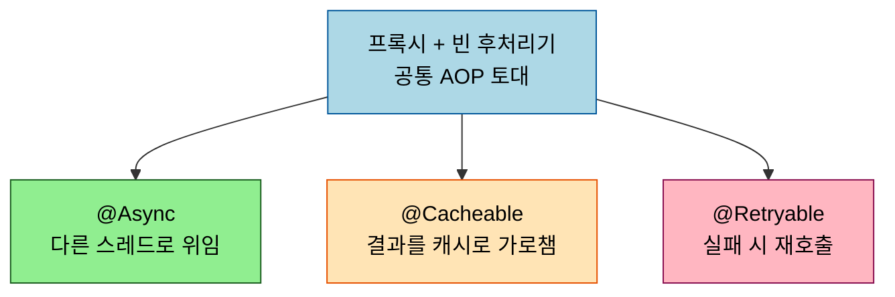
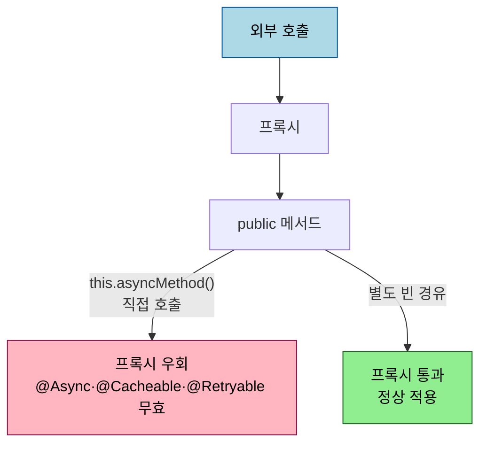

# 어노테이션 기반 AOP 응용 — @Async·@Cacheable·@Retryable

---

> `@Async`·`@Cacheable`·`@Retryable` 은 서로 다른 일을 하지만 한 뿌리에서 나옵니다. 셋 다 *프록시와 빈 후처리기* 라는 같은 AOP 토대 위에 선 응용입니다. 그래서 사용법은 달라도 같은 함정 — 자기호출 시 동작하지 않음 — 을 공유합니다. 본 문서는 세 어노테이션을 *비교* 합니다. 프록시가 어떻게 만들어지는지의 메커니즘은 [`01-01`](01-01.횡단%20관심사와%20AOP%20—%20프록시로%20풀어내기.md) 에 있으니 재서술하지 않고 링크로 위임합니다.

## 0. 학습 목표

이 문서를 읽고 나면 `@Async`·`@Cacheable`·`@Retryable` 이 각각 무엇을 가로채는지 설명하고, 셋이 같은 프록시 토대 위라서 공유하는 함정(자기호출)을 답하며, 어느 상황에 무엇을 쓰는지 비교할 수 있습니다.

## 1. 공통 토대 — 같은 프록시 위의 세 응용

세 어노테이션은 모두 `@Enable*` 로 기능을 켜고, 빈 후처리기가 대상 빈을 프록시로 감싸 메서드 호출을 가로채는 구조입니다. 이 메커니즘([`01-01 §5`](01-01.횡단%20관심사와%20AOP%20—%20프록시로%20풀어내기.md))은 셋이 똑같이 공유하고, 차이는 *가로챈 다음 무엇을 하느냐* 에 있습니다. `@Async` 는 호출을 다른 스레드로 넘기고, `@Cacheable` 은 결과를 캐시에서 꺼내거나 저장하며, `@Retryable` 은 실패 시 다시 호출합니다.

## 2. @Async — 호출을 다른 스레드로

`@Async` 는 `@EnableAsync` 로 켜고, 붙은 메서드 호출을 별도 스레드(기본 `TaskExecutor`)에서 실행합니다. 호출자는 기다리지 않고 즉시 반환받습니다. 주의할 제약이 있습니다. Spring 6.0 부터 `@Async` 메서드의 반환 타입은 *`Future` 또는 `void` 로 강제* 됩니다 — 다른 타입을 쓰면 예외가 던져집니다.

예외 처리가 반환 타입에 따라 갈립니다. `Future`(또는 `CompletableFuture`)를 반환하면 호출자가 `get()` 할 때 예외가 전파되어 잡을 수 있습니다. 그러나 `void` 를 반환하면 예외가 *호출자에게 전달되지 않고 사라집니다*. 공식 문서는 이 경우 `AsyncUncaughtExceptionHandler` 를 등록해 잡으라고 안내합니다. "비동기로 던졌으니 호출자는 결과를 모른다" 는 성질이 그대로 예외에도 적용되는 것입니다.

## 3. @Cacheable — 결과를 가로채 캐시로

`@Cacheable` 은 `@EnableCaching` 으로 켜고, 메서드 결과를 `CacheManager` 가 관리하는 캐시에 저장·조회합니다. 같은 키로 다시 호출되면 메서드 본문을 실행하지 않고 캐시 값을 돌려줍니다. 키는 기본적으로 인자로 만들어지며, `key`·`condition`·`unless` 속성으로 캐시 여부를 세밀하게 정합니다.

| 어노테이션 | 동작 |
|-----------|------|
| `@Cacheable` | 캐시에 있으면 꺼내고, 없으면 실행 후 저장 |
| `@CachePut` | 항상 실행하고 결과로 캐시 갱신 |
| `@CacheEvict` | 캐시 항목 제거 |

캐시 추상화의 핵심은 *어떤 캐시 구현(Redis·Caffeine 등)을 쓰든 어노테이션은 같다* 는 것입니다. AOP 가 메서드 결과를 가로채는 지점만 표준화하고, 실제 저장은 `CacheManager` 구현에 위임하기 때문입니다.

## 4. @Retryable — 실패 시 다시 호출

`@Retryable` 은 Spring Framework 본체가 아니라 *Spring Retry* 라이브러리가 제공하며, `@EnableRetry` 로 켭니다. 붙은 메서드가 지정한 예외로 실패하면 `maxAttempts` 까지 다시 호출하고, `backoff` 로 재시도 간격을 둡니다. 모든 시도가 실패하면 `@Recover` 가 붙은 메서드로 폴백합니다.

[`01-01 §8`](01-01.횡단%20관심사와%20AOP%20—%20프록시로%20풀어내기.md) 이 직접 만든 `@Retry` 예제로 "AOP 로 재시도를 어떻게 구현하나" 를 보여줬다면, 여기서는 그 일을 표준화한 라이브러리가 `@Retryable` 입니다. 직접 만들 필요 없이 어노테이션만 붙이면 되고, `@Recover` 로 최종 실패 처리까지 선언적으로 분리할 수 있습니다.

## 5. 공유 함정 — 자기호출

세 어노테이션의 가장 중요한 공통점은 *모두 프록시 기반이라 자기호출에 똑같이 당한다* 는 것입니다. 같은 클래스 안에서 메서드가 자기 자신의 `@Async`·`@Cacheable`·`@Retryable` 메서드를 직접 호출하면 프록시를 거치지 않아 비동기·캐시·재시도가 *전혀 적용되지 않습니다*. 메커니즘과 대안(자기 주입·구조 분리)은 [`01-01 §9`](01-01.횡단%20관심사와%20AOP%20—%20프록시로%20풀어내기.md) 에 정리돼 있으니 여기서는 "셋 다 같은 함정을 공유한다" 는 사실만 박아 둡니다.

| 어노테이션 | 활성화 | 가로챈 뒤 | 자기호출 함정 |
|-----------|--------|----------|--------------|
| `@Async` | `@EnableAsync` | 다른 스레드 실행 (반환 Future/void) | 공유 |
| `@Cacheable` | `@EnableCaching` | 캐시 조회·저장 | 공유 |
| `@Retryable` | `@EnableRetry` (Spring Retry) | 실패 시 재호출 + `@Recover` | 공유 |

## 6. 면접 대비 체크리스트

> 이 문서를 다 읽은 뒤 다음 질문에 답할 수 있어야 합니다.

1. `@Async`·`@Cacheable`·`@Retryable` 이 "같은 토대 위의 응용" 이라는 말은 무슨 뜻입니까?
2. `@Async` 메서드의 반환 타입이 `void` 일 때와 `Future` 일 때 예외 처리는 어떻게 갈립니까?
3. 세 어노테이션이 자기호출에서 모두 동작하지 않는 이유는 무엇입니까? 왜 셋이 같은 함정을 공유합니까?
4. `@Retryable`(Spring Retry)은 01-01 의 직접 만든 `@Retry` 예제와 무엇이 다릅니까?
