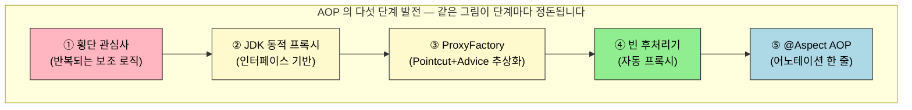
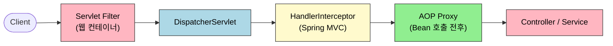
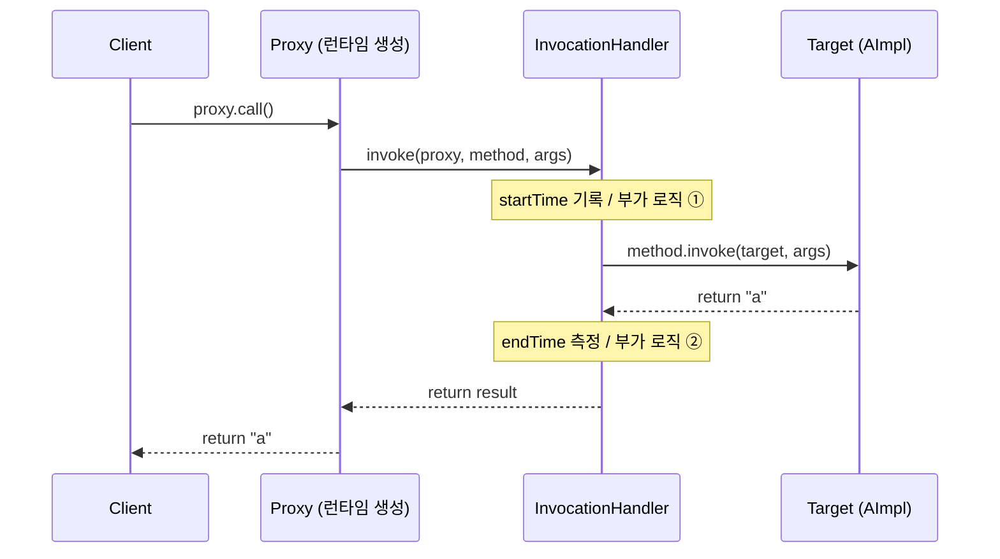
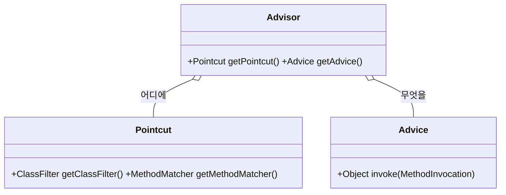
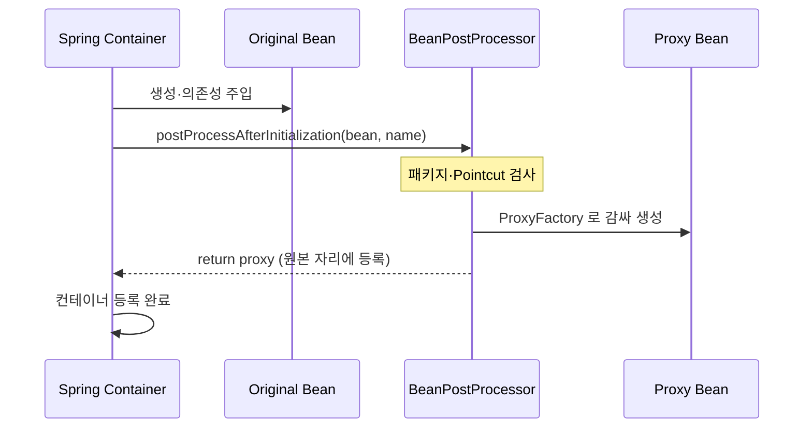
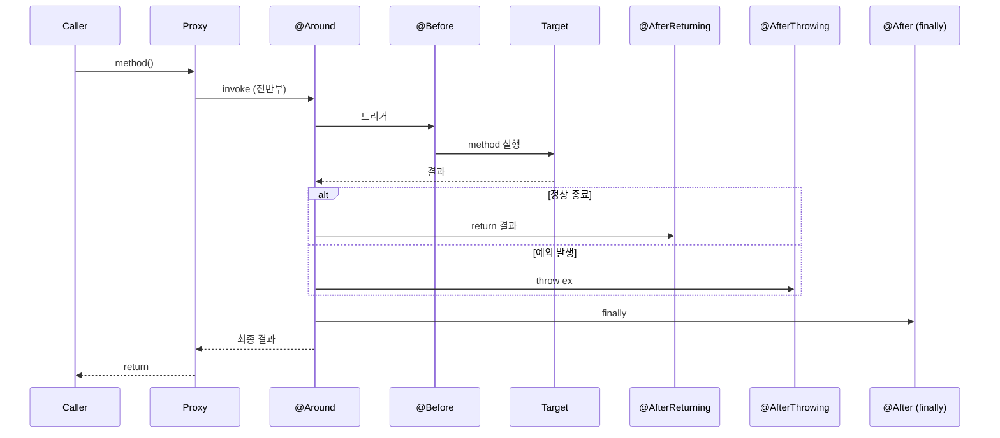

# 횡단 관심사와 AOP — 프록시로 풀어내기
---

> 로깅·트랜잭션·인증 같은 코드가 컨트롤러·서비스·리포지토리에 동일한 모양으로 흩어지는 문제를 "횡단 관심사" 한 단어로 묶고, 자바 표준 프록시에서 출발해 Spring `@Aspect` AOP 까지 같은 그림이 어떻게 정돈되었는지 따라갑니다. 본 문서를 다 읽으면 `@Around` 한 줄이 빈 후처리기 안에서 어떤 `Advisor` 를 만들고, 그 `Advisor` 가 어떤 프록시에 끼워 넣어지는지 한 흐름으로 말할 수 있어야 합니다.

## 진입 — 왜 AOP 가 필요했는가

> 비즈니스 코드 사이에 같은 모양의 보조 로직이 반복해서 끼어드는 순간이 출발점입니다.

서비스 메서드가 열 개 있다고 가정합니다. 모든 메서드 시작에 `log.info("진입 ...")` 한 줄, 끝에 소요 시간 측정 한 줄, 예외가 나면 롤백 한 줄이 따라붙습니다. 어느 누구도 이 세 줄을 비즈니스 로직이라고 부르지 않지만, 메서드를 펼치면 비즈니스 로직보다 이 세 줄이 더 많아 보입니다. 한 군데를 고치려면 열 군데를 똑같이 고쳐야 하고, 새 메서드를 만들면 또 똑같이 붙여 넣습니다.

이 반복을 한 곳에서 정의하고 "어디에 끼울지" 만 선언으로 지정하는 기술이 AOP 입니다. AOP 는 Java 의 `Proxy` 클래스에서 시작해 Spring 의 `ProxyFactory`, `BeanPostProcessor`, `@Aspect` 까지 단계별로 발전했습니다. 본 문서는 그 발전 단계를 그대로 따라가며, 각 단계가 "이전 단계의 어떤 불편함을 없앴는지" 를 함께 묻습니다.

## 1. 한 줄 정의

> AOP 는 비즈니스 로직(핵심 관심사)과 보조 로직(횡단 관심사)을 분리해, 보조 로직을 한 곳에 정의하고 선언으로 적용 위치를 지정하는 기술입니다. Spring AOP 는 이 적용을 런타임 프록시로 구현합니다.

핵심 키워드 세 개를 미리 정리합니다.

| 용어 | 한 줄 정의 | 비유 |
|------|-----------|------|
| `Aspect` | 횡단 관심사를 모듈화한 단위 (Advice + Pointcut) | "야근하는 개발팀에 택시비 지급" 이라는 *제도* 자체 |
| `Advice` | 실제로 끼워 넣을 보조 로직 | 택시비를 *얼마* 줄지 정의한 규정 |
| `Pointcut` | Advice 가 적용될 지점을 고르는 필터 | *누가* 야근 대상인지 정하는 기준 |



이후 §2 부터 §6 까지가 위 다섯 단계를 그대로 따라갑니다. §7 부터는 어노테이션 표면(Pointcut 표현식, Advice 5종)을 들여다보고, §9 에서는 운영 코드에서 가장 자주 만나는 함정(internal call, proxy-target-class)을 정리합니다.

## 2. 횡단 관심사와 일반적 해결 — 필터·인터셉터의 한계

> 횡단 관심사를 처리하는 도구로는 Servlet `Filter`, Spring `HandlerInterceptor`, AOP 세 종류가 있고, 적용 *시점* 과 *대상* 이 달라 셋 중 어느 것을 쓸지는 "어디까지 끼어드느냐" 로 결정합니다.



세 도구의 책임을 한 줄씩 설명하면 다음과 같습니다. `Filter` 는 Servlet API 의 일부로 `DispatcherServlet` 에 요청이 도달하기 전·후에 동작하므로 Spring 범위 밖이며, 응답 Body 까지 직접 수정할 수 있습니다. `Interceptor` 는 Spring 이 제공하며 `DispatcherServlet` 과 컨트롤러 사이에서 동작하고, URL 패턴 매칭이 더 세밀합니다. AOP 는 빈 메서드 호출의 앞뒤에 끼어들어 컨트롤러뿐 아니라 서비스·리포지토리 어디든 적용할 수 있습니다.

### Filter — 웹 컨테이너 단계의 부가 작업

```java
public interface Filter {
    public default void init(FilterConfig filterConfig) throws ServletException {}
    public void doFilter(ServletRequest request,
                         ServletResponse response,
                         FilterChain chain) throws IOException, ServletException;
    public default void destroy() {}
}
```

`doFilter` 안에서 `chain.doFilter(request, response)` 호출이 핵심입니다. 호출 *전* 코드는 요청 처리 전에 실행되고, 호출 *후* 코드는 응답 직전에 실행됩니다. 등록은 `FilterRegistrationBean` 으로 합니다.

```java
@Slf4j
public class LogFilter implements Filter {
    @Override
    public void doFilter(ServletRequest request, ServletResponse response,
                         FilterChain chain) throws IOException, ServletException {
        String uri = ((HttpServletRequest) request).getRequestURI();
        String uuid = UUID.randomUUID().toString();
        log.info("REQUEST [{}][{}]", uuid, uri);
        chain.doFilter(request, response);
        log.info("RESPONSE [{}][{}]", uuid, uri);
    }
}

@Configuration
public class WebConfig {
    @Bean
    public FilterRegistrationBean<Filter> logFilter(){
        FilterRegistrationBean<Filter> bean = new FilterRegistrationBean<>();
        bean.setFilter(new LogFilter());
        bean.setOrder(1);
        bean.addUrlPatterns("/*");
        return bean;
    }
}
```

### Interceptor — Spring MVC 단계의 부가 작업

`HandlerInterceptor` 는 세 콜백을 제공합니다. `preHandle` 은 컨트롤러 호출 전, `postHandle` 은 컨트롤러 호출 후 `ModelAndView` 생성 전, `afterCompletion` 은 요청 처리 전체가 끝난 후 (`finally` 위치) 호출됩니다.

```java
public interface HandlerInterceptor {
    default boolean preHandle(HttpServletRequest req, HttpServletResponse res,
                              Object handler) throws Exception { return true; }

    default void postHandle(HttpServletRequest req, HttpServletResponse res,
                            Object handler,
                            @Nullable ModelAndView mv) throws Exception {}

    default void afterCompletion(HttpServletRequest req, HttpServletResponse res,
                                 Object handler,
                                 @Nullable Exception ex) throws Exception {}
}

@Configuration
public class WebConfig implements WebMvcConfigurer {
    @Override
    public void addInterceptors(InterceptorRegistry registry) {
        registry.addInterceptor(new LogInterceptor())
                .addPathPatterns("/**")
                .excludePathPatterns("/login/**", "/logout/**")
                .order(1);
    }
}
```

### 두 도구의 한계 — 왜 AOP 가 더 필요한가

필터와 인터셉터는 모두 HTTP 요청 경계에서만 동작합니다. 예컨대 "모든 `Service` 클래스 메서드의 실행 시간을 측정" 하라는 요구는 둘로 풀 수 없습니다. 컨트롤러를 거치지 않는 스케줄러나 메시지 리스너가 호출하는 서비스 메서드는 HTTP 경계 밖이기 때문입니다. AOP 는 메서드 단위 어디든 끼어들 수 있어, 횡단 관심사를 *적용 위치* 와 *적용 로직* 두 축으로 자유롭게 조합할 수 있게 합니다.

## 3. JDK 동적 프록시 — 같은 원리를 자바 표준으로

> JDK 동적 프록시는 Reflection API 의 `Proxy.newProxyInstance` 로 *인터페이스* 구현체를 런타임에 생성해 주는 자바 표준 기술입니다. AOP 의 모든 흐름은 결국 이 한 가지 원리의 응용입니다.

프록시 패턴 자체는 새로운 개념이 아닙니다. 원본 객체(Target)를 그대로 두고, 같은 인터페이스를 구현한 대리(Proxy)가 호출을 가로채 부가 로직을 끼워 넣는 디자인 패턴입니다. 정적 프록시는 인터페이스마다 사람이 클래스를 작성해야 해서 인터페이스가 100개면 클래스도 100개가 됩니다. 동적 프록시는 런타임에 그 100개를 JVM 이 만들어 줍니다.

### 핵심 API — `Proxy.newProxyInstance` 와 `InvocationHandler`

```java
public interface InvocationHandler {
    Object invoke(Object proxy, Method method, Object[] args) throws Throwable;
}
```

`InvocationHandler` 의 `invoke` 한 메서드가 프록시의 모든 메서드 호출을 가로챕니다. `method.invoke(target, args)` 로 원본 호출을 위임하고, 그 앞뒤에 부가 로직을 둡니다.

```java
@Slf4j
@RequiredArgsConstructor
public class TimeInvocationHandler implements InvocationHandler {
    private final Object target;

    @Override
    public Object invoke(Object proxy, Method method, Object[] args) throws Throwable {
        log.info("TimeProxy 실행");
        long startTime = System.currentTimeMillis();
        Object result = method.invoke(target, args);
        long endTime = System.currentTimeMillis();
        log.info("TimeProxy 종료 resultTime={}", endTime - startTime);
        return result;
    }
}

@Test
void dynamicA(){
    AInterface target = new AImpl();
    AInterface proxy = (AInterface) Proxy.newProxyInstance(
            AInterface.class.getClassLoader(),
            new Class[]{AInterface.class},
            new TimeInvocationHandler(target));
    proxy.call();
}
```

`Proxy.newProxyInstance` 의 세 인자는 다음과 같습니다. 첫째는 클래스 로더로 보통 대상 인터페이스의 로더를 그대로 씁니다. 둘째는 프록시가 구현할 인터페이스 배열입니다. 셋째가 위에서 정의한 `InvocationHandler` 입니다.



### 메서드 필터링 — 어디까지 적용할지 직접 분기

핸들러 내부에서 `method.getName()` 으로 메서드를 골라 적용할 수 있습니다. 이 시점에 이미 *Pointcut(어디에)* 과 *Advice(무엇을)* 가 한 메서드 안에 섞여 있다는 사실을 기억해 두면, §4 에서 둘을 분리한 동기가 자연스럽게 이해됩니다.

```java
@Override
public Object invoke(Object proxy, Method method, Object[] args) throws Throwable {
    if (method.getName().equals("sum")) {
        // 위 TimeInvocationHandler 와 동일한 측정 로직
        return measureAndInvoke(target, method, args);
    }
    return method.invoke(target, args);
}
```

### 제약 — 인터페이스가 없으면 못 만든다

JDK 동적 프록시의 한계는 명확합니다. 반드시 인터페이스가 있어야 합니다. 인터페이스가 없는 구체 클래스를 프록시로 감싸려면 **CGLIB** 가 필요합니다. CGLIB 는 바이트코드를 조작해 구체 클래스를 *상속* 한 프록시를 만들어 줍니다. 핵심 API 는 `Enhancer` + `MethodInterceptor` (Spring 의 동명 인터페이스와 다른 cglib 패키지의 것) 조합입니다.

```java
@Test
void cglibTest() {
    Enhancer enhancer = new Enhancer();
    enhancer.setSuperclass(Subject.class);
    enhancer.setCallback(new MyProxyInterceptor(new Subject()));
    Subject proxy = (Subject) enhancer.create();
    proxy.call();
}
```

`MyProxyInterceptor.intercept(obj, method, args, methodProxy)` 의 시그니처는 `InvocationHandler.invoke` 와 거의 같지만 인터페이스 자체가 다릅니다. 여기서 *두 API 의 차이* 가 새로운 문제를 만듭니다. 인터페이스가 있으면 `InvocationHandler` 를, 없으면 `MethodInterceptor` 를 구현해야 하는데, 같은 부가 로직을 두 번 구현해야 한다면 추상화 비용이 너무 큽니다. 이 문제를 해결한 것이 다음 단계의 `ProxyFactory` 입니다.

## 4. 프록시 팩토리와 Advisor — Pointcut + Advice 의 추상화

> Spring `ProxyFactory` 는 인터페이스 유무를 보고 JDK 동적 프록시와 CGLIB 중 알맞은 것을 자동으로 고르며, 개발자는 `Advice` 한 종류만 구현하면 됩니다. `Pointcut + Advice = Advisor` 라는 추상화가 이 단계에서 정착합니다.

`ProxyFactory` 는 `Advice` 라는 단일 추상을 제공합니다. 개발자는 Spring 의 `org.aopalliance.intercept.MethodInterceptor` (이름이 CGLIB 와 같지만 다른 인터페이스입니다)를 구현하고, `ProxyFactory` 가 내부에서 적절한 프록시 기술을 골라 그 `Advice` 를 호출하는 `InvocationHandler` 또는 `MethodInterceptor` 로 감쌉니다.

### Advice — 단일화된 부가 로직

```java
@Slf4j
public class TimeAdvice implements MethodInterceptor {
    @Override
    public Object invoke(MethodInvocation invocation) throws Throwable {
        long startTime = System.currentTimeMillis();
        Object proceed = invocation.proceed();
        log.info("TimeProxy 종료 resultTime={}", System.currentTimeMillis() - startTime);
        return proceed;
    }
}

@Test
void advice(){
    AInterface target = new AImpl();
    ProxyFactory proxyFactory = new ProxyFactory(target);
    proxyFactory.addAdvice(new TimeAdvice());
    proxyFactory.setProxyTargetClass(true);   // 강제 CGLIB
    AInterface proxy = (AInterface) proxyFactory.getProxy();
    proxy.call();
}
```

`MethodInvocation.proceed()` 가 핵심입니다. `target` 을 넘기지 않아도 다음 Advice 또는 Target 으로 호출이 자동으로 이어집니다.

Spring Boot 는 기본값으로 `proxyTargetClass=true` 를 설정합니다. 인터페이스가 있어도 CGLIB 를 사용해 구체 클래스 기반 프록시를 만든다는 뜻이며, 그 이유는 §9 에서 다시 짚습니다.

### Pointcut, Advice, Advisor 의 관계



`Pointcut` 은 "어디에 적용할지", `Advice` 는 "무엇을 적용할지" 만 책임집니다. 둘을 하나로 묶은 단위가 `Advisor` 입니다. 이렇게 책임을 쪼개야 같은 `Advice` 를 여러 `Pointcut` 에 재사용할 수 있고, 같은 `Pointcut` 을 여러 `Advice` 와 조합할 수도 있습니다.

```java
@Test
void advisorTest1(){
    CInterface target = new CImpl();
    ProxyFactory proxyFactory = new ProxyFactory(target);
    DefaultPointcutAdvisor advisor =
            new DefaultPointcutAdvisor(Pointcut.TRUE, new TimeAdvice());
    proxyFactory.addAdvisor(advisor);
    CInterface proxy = (CInterface) proxyFactory.getProxy();
    proxy.call();
}
```

### Spring 이 기본 제공하는 Pointcut

`Pointcut` 을 직접 구현할 일은 거의 없습니다. Spring 은 자주 쓰이는 형태를 미리 제공합니다.

| 종류 | 클래스 | 매칭 기준 |
|------|--------|----------|
| 메서드 이름 | `NameMatchMethodPointcut` | `call`, `find*` 같은 단순 이름 |
| 정규식 | `JdkRegexpMethodPointcut` | `.*sum.*` 같은 패턴 |
| 어노테이션 | `AnnotationMatchingPointcut` | `@MyAnnotation` 부착 여부 |
| AspectJ 표현식 | `AspectJExpressionPointcut` | `execution(* com.example..*(..))` |

실무에서는 `AspectJExpressionPointcut` 이 표현력이 가장 좋아 사실상 표준입니다. §7 에서 표현식 문법을 자세히 다룹니다.

### `ProxyFactory` 만으로는 부족한 이유

여기까지만 보면 잘 동작합니다. 그런데 운영 코드에는 보통 빈이 수십~수백 개입니다. 빈 하나마다 `ProxyFactory` 를 만들고, `addAdvisor` 하고, `getProxy()` 한 결과를 다시 빈으로 등록해야 한다면 설정 코드만 수백 줄이 됩니다. 무엇보다 `@ComponentScan` 으로 자동 등록된 빈에는 이 절차를 끼워 넣을 자리가 없습니다. 이 두 문제를 해결한 것이 *빈 후처리기* 입니다.

## 5. 빈 후처리기 — 자동 프록시 생성기

> `BeanPostProcessor` 는 Spring 컨테이너가 빈을 등록하기 직전에 빈을 가로채 *조작하거나 완전히 다른 객체로 교체* 할 수 있는 확장 지점입니다. AOP 자동 프록시는 이 후처리기 한 종류일 뿐입니다.



### 가장 단순한 후처리기 — 객체 교체

```java
@Slf4j
static class AToBPostProcessor implements BeanPostProcessor {
    @Override
    public Object postProcessAfterInitialization(Object bean, String beanName) throws BeansException {
        log.info("beanName={} bean={}", beanName, bean);
        if (bean instanceof A) {
            return new B();
        }
        return bean;
    }
}
```

A 로 등록된 빈을 B 로 바꿔치는 코드입니다. 이 단순 메커니즘이 AOP 자동 프록시의 토대입니다. 후처리기가 "원본 빈 대신 프록시" 를 반환하면, 컨테이너는 그 사실을 모르고 프록시를 그대로 등록합니다.

### `AnnotationAwareAspectJAutoProxyCreator`

`spring-boot-starter-aop` 의존성만 추가하면, Spring Boot 는 `AnnotationAwareAspectJAutoProxyCreator` 라는 빈 후처리기를 자동 등록합니다. 이 후처리기는 다음 절차로 동작합니다.

1. 컨테이너에 등록된 모든 `Advisor` 빈을 수집합니다.
2. 각 빈에 대해 `Advisor` 의 `Pointcut` 이 매칭되는지 검사합니다.
3. 매칭된 빈을 `ProxyFactory` 로 감싸 프록시로 교체합니다.

```java
@Slf4j
@Configuration
@EnableAspectJAutoProxy   // Spring Boot 에서는 자동 등록되어 생략 가능
static class BasicConfig {
    @Bean(name = "beanA")
    public A a() { return new A(); }

    @Bean(name = "beanB")
    public B b() { return new B(); }

    @Bean
    public Advisor timeAdvisor(){
        AspectJExpressionPointcut aspectJPointcut = new AspectJExpressionPointcut();
        aspectJPointcut.setExpression("within(com.example.study.aop.BeanPostProcessorTest.A)");
        return new DefaultPointcutAdvisor(aspectJPointcut, new TimeAdvice());
    }
}
```

위 설정만으로 `A` 는 프록시로 등록되고, `B` 는 원본 그대로 등록됩니다. 개발자가 작성한 코드는 `Advisor` 빈 등록 한 줄뿐입니다. `ProxyFactory` 시절의 수동 등록은 사라졌습니다.

## 6. Spring AOP 와 @Aspect — 같은 그림의 정리된 표면

> `@Aspect` 는 `Advisor` 빈을 직접 만들지 않아도 어노테이션 한 줄로 동일한 효과를 내도록 정리한 표면입니다. 내부적으로는 `@Aspect` 클래스를 읽어 `Advisor` 로 변환하고, `AnnotationAwareAspectJAutoProxyCreator` 가 그 `Advisor` 를 그대로 사용합니다.

### AOP 적용 시점 세 가지

AOP 가 끼어드는 시점은 세 가지로 갈립니다. **컴파일 시점** 위빙은 `.java → .class` 단계에서 부가 로직을 박아 넣으므로 특수 컴파일러가 필요합니다. **클래스 로딩 시점** 위빙은 클래스 로더가 `.class` 를 JVM 에 올리기 전에 바이트코드를 조작합니다(Java Instrumentation). Spring AOP 는 셋째인 **런타임 시점** 위빙을 채택해 프록시 객체로 부가 로직을 적용합니다. 위 두 방식보다 표현력은 좁지만, 별도 빌드 도구나 자바 에이전트 없이 동작합니다.

### `@Aspect` 한 클래스

```java
@Slf4j
@Component
@Aspect
public class TimeAdviceAspect {

    @Around("within(com.example.study.aop.AutoProxyConfig.A)")
    public Object invoke(ProceedingJoinPoint joinPoint) throws Throwable {
        log.info("TimeProxy 실행");
        long startTime = System.currentTimeMillis();

        Object proceed = joinPoint.proceed();

        long endTime = System.currentTimeMillis();
        log.info("TimeProxy 종료 resultTime={}", endTime - startTime);
        return proceed;
    }
}
```

§5 의 `Advisor` 빈 등록과 비교하면, `@Aspect` + `@Around` 두 어노테이션이 모든 설정을 흡수했습니다. `@Component` 로 스캔된 이 클래스를 빈 후처리기가 발견하면, 메서드 위 `@Around("...")` 의 표현식과 메서드 본문을 묶어 내부적으로 `Advisor` 를 만들고, 일치하는 빈을 프록시로 교체합니다.

### Pointcut 분리와 조합

같은 표현식을 여러 Advice 가 공유한다면, `@Pointcut` 으로 분리해 이름을 부여하고 `&&` `||` `!` 로 조합할 수 있습니다.

```java
@Slf4j @Aspect
public class AspectV3 {
    @Pointcut("execution(* hello.aop.order..*(..))")
    private void allOrder(){}

    @Pointcut("execution(* *..*Service.*(..))")
    private void allService(){}

    @Around("allOrder() && allService()")
    public Object doTransaction(ProceedingJoinPoint jp) throws Throwable {
        // try { proceed() / 커밋 } catch { 롤백 } finally { 릴리즈 }
        return jp.proceed();
    }
}
```

다른 클래스의 Pointcut 도 패키지 경로 + 메서드명으로 참조할 수 있어, 공통 Pointcut 클래스를 따로 두는 패턴이 자주 등장합니다.

### Aspect 적용 순서 — `@Order`

여러 Aspect 가 같은 메서드에 적용될 때, 순서는 보장되지 않습니다. 명시하려면 `@Aspect` *클래스 단위* 로 `@Order` 를 붙입니다. `@Around` 메서드 단위로는 지정할 수 없어, 보통 클래스를 `static class` 로 쪼개 각각에 `@Order` 를 답니다. 숫자가 작을수록 먼저 실행됩니다.

```java
@Slf4j
public class AspectV5Order {

    @Aspect @Order(2)
    public static class LogAspect{
        @Around("hello.aop.order.aop.Pointcuts.allOrder()")
        public Object doLog(ProceedingJoinPoint jp) throws Throwable {
            log.info("[log] {}", jp.getSignature());
            return jp.proceed();
        }
    }

    @Aspect @Order(1)
    public static class TxAspect{
        @Around("hello.aop.order.aop.Pointcuts.orderAndService()")
        public Object doTx(ProceedingJoinPoint jp) throws Throwable {
            return jp.proceed();   // 트랜잭션 시작/커밋/롤백 로직
        }
    }
}
```

## 7. Pointcut 표현식 — execution / within / args / @annotation

> Pointcut 표현식은 AspectJ 문법을 빌려 옵니다. 실무에서는 `execution` 한 가지만 깊이 알아도 대부분 해결되며, 나머지는 보조 도구입니다.

### 지시자 한눈에

| 지시자 | 매칭 대상 | 사용 빈도 |
|--------|----------|----------|
| `execution` | 메서드 시그니처 (접근제어자·반환타입·패키지·메서드명·파라미터) | ⭐⭐⭐⭐⭐ |
| `within` | 타입(클래스) 단위 | ⭐⭐ |
| `args` | 런타임에 전달된 인수 타입 | ⭐ |
| `this` | 프록시 객체 타입 | ⭐ |
| `target` | Target 객체 타입 | ⭐ |
| `@target` / `@within` | 클래스에 부착된 어노테이션 | ⭐⭐ |
| `@annotation` | 메서드에 부착된 어노테이션 | ⭐⭐⭐⭐ |
| `@args` | 인수 타입에 부착된 어노테이션 | ⭐ |
| `bean` | Spring 빈 이름 (Spring 전용) | ⭐⭐ |

### `execution` — 가장 자주 쓰는 표현식

```
execution(접근제어자? 반환타입 선언타입?메서드이름(파라미터) 예외?)
```

`?` 가 붙은 자리는 생략할 수 있고, `*` 와 `..` 같은 와일드카드를 쓸 수 있습니다. 의미 차이는 다음과 같습니다.

| 기호 | 의미 |
|------|------|
| `*` | 한 토큰을 자유롭게 매칭 (메서드명·패키지명 한 단계) |
| `..` | 패키지 경로의 *임의 깊이* 또는 파라미터의 *임의 개수* |

```java
// 정확 매칭
pointcut.setExpression("execution(public String hello.aop.member.MemberServiceImpl.hello(String))");

// 모든 메서드 / 메서드 이름 패턴 / 하위 패키지 포함
pointcut.setExpression("execution(* *(..))");
pointcut.setExpression("execution(* hel*(..))");
pointcut.setExpression("execution(* hello.aop..*.*(..))");

// 부모 타입으로 매칭 (구현체에도 그대로 적용됨)
pointcut.setExpression("execution(* hello.aop.member.MemberService.*(..))");
```

### `args` vs `execution` — 정적 vs 동적

같은 파라미터 매칭처럼 보여도 둘은 결정 시점이 다릅니다. `execution(* *(String))` 은 *메서드 시그니처* 가 `String` 인지를 컴파일 정보로 판단합니다. `args(String)` 은 *런타임에 실제로 전달된 인수* 가 `String` 의 인스턴스인지 봅니다. 그래서 `args(java.io.Serializable)` 는 `String` 도 매칭되지만, `execution(* *(java.io.Serializable))` 은 시그니처가 정확히 `Serializable` 이어야만 매칭됩니다.

### `@annotation` — 어노테이션 기반 매칭

실전 AOP 에서 가장 자주 쓰는 패턴입니다. 메서드에 직접 어노테이션을 붙여 적용 의도를 코드 옆에 드러낼 수 있습니다.

```java
@Override
@MethodAop("test value")
public String hello(String param) {
    return "ok";
}
```

```java
@Aspect
static class AtAnnotationAspect {
    @Around("@annotation(hello.aop.member.annotation.MethodAop)")
    public Object doAtAnnotation(ProceedingJoinPoint joinPoint) throws Throwable {
        log.info("[@annotation] {}", joinPoint.getSignature());
        return joinPoint.proceed();
    }
}
```

### `@target` 사용 시 주의

`@target` 은 *실행 객체의 클래스* 에 어노테이션이 있는지 런타임에 판단합니다. 그런데 프록시 생성 자체는 컨테이너 로딩 시점에 일어나므로, `@target` 만 단독으로 쓰면 Spring 은 모든 빈에 프록시를 시도합니다. 일부 빈은 `final` 클래스라 CGLIB 가 상속할 수 없어 오류가 발생합니다. 그래서 보통 `execution(* hello.aop..*(..)) && @target(...)` 처럼 `execution` 으로 범위를 좁히고 `@target` 을 보조 조건으로 씁니다.

## 8. Advice 5종 — @Before / @After / @Around / @AfterReturning / @AfterThrowing

> Advice 다섯 종은 `@Around` 한 가지로 모두 흉내 낼 수 있습니다. 그럼에도 나머지 넷이 존재하는 이유는, 의도를 어노테이션 이름으로 분명히 드러내고 `proceed()` 호출 누락 같은 실수를 원천 차단하기 위함입니다.

### 호출 순서



### `@Around` — 가장 강력하나 가장 위험

```java
@Around("hello.aop.order.aop.Pointcuts.orderAndService()")
public Object doTransaction(ProceedingJoinPoint joinPoint) throws Throwable {
    try {
        log.info("[트랜잭션 시작] {}", joinPoint.getSignature());
        Object result = joinPoint.proceed();
        log.info("[트랜잭션 커밋] {}", joinPoint.getSignature());
        return result;
    } catch (Exception e) {
        log.info("[트랜잭션 롤백] {}", joinPoint.getSignature());
        throw e;
    } finally {
        log.info("[리소스 릴리즈] {}", joinPoint.getSignature());
    }
}
```

`ProceedingJoinPoint.proceed()` 를 직접 호출해야 Target 이 실행됩니다. 호출을 깜빡 잊으면 Target 이 영원히 실행되지 않는 치명적 버그가 됩니다. 반환값 변경, 예외 변환, 호출 자체 차단 같은 강한 권한이 필요한 경우에만 사용합니다.

### `@Before` — 호출 전 단순 부가 로직

```java
@Before("hello.aop.order.aop.Pointcuts.orderAndService()")
public void doBefore(JoinPoint joinPoint) {
    log.info("[before] {}", joinPoint.getSignature());
}
```

`JoinPoint` 만 받습니다. `proceed()` 가 없어 호출 누락 실수가 원천적으로 불가능합니다. 로깅·검증처럼 "전에 한 번만 하면 되는" 작업에 적합합니다.

### `@AfterReturning` / `@AfterThrowing` / `@After`

세 종은 공통적으로 `JoinPoint` 를 받고 `proceed()` 가 없습니다. 발화 시점만 다릅니다.

```java
@AfterReturning(value = "Pointcuts.orderAndService()", returning = "result")
public void doReturn(JoinPoint jp, Object result) { /* 정상 반환 시 */ }

@AfterThrowing(value = "Pointcuts.orderAndService()", throwing = "ex")
public void doThrowing(JoinPoint jp, Exception ex) { /* 예외 발생 시 */ }

@After(value = "Pointcuts.orderAndService()")
public void doAfter(JoinPoint jp) { /* 정상·예외 무관 finally 위치 */ }
```

`returning`/`throwing` 속성에 적은 이름은 메서드 파라미터 이름과 정확히 일치해야 하며, 타입을 `Object`/`Exception` 으로 두면 모든 반환·예외를 받습니다. `@AfterThrowing` 은 예외를 *관찰* 만 하고 다시 던집니다. 예외를 흡수하거나 변환하려면 `@Around` 가 필요합니다. `@After` 는 리소스 해제 같은 finally 성 작업에 적합합니다.

### 실전 예제 — `@Trace` + `@Retry`

두 어노테이션을 직접 만들고, 각각을 `@Before` 와 `@Around` Aspect 가 처리하는 패턴입니다. 실무에서 가장 자주 등장하는 형태이며, "로깅은 `@Before`, 재시도는 `@Around`" 의 역할 분담이 명확합니다.

```java
@Target(ElementType.METHOD) @Retention(RetentionPolicy.RUNTIME)
public @interface Trace {}

@Target(ElementType.METHOD) @Retention(RetentionPolicy.RUNTIME)
public @interface Retry { int value() default 3; }
```

```java
@Slf4j @Aspect
public class TraceAspect {
    @Before("@annotation(hello.aop.exam.annotation.Trace)")
    public void doTrace(JoinPoint jp) {
        log.info("[trace] {} args={}", jp.getSignature(), jp.getArgs());
    }
}

@Slf4j @Aspect
public class RetryAspect {
    @Around("@annotation(retry)")
    public Object doRetry(ProceedingJoinPoint jp, Retry retry) throws Throwable {
        int maxRetry = retry.value();
        Exception exceptionHolder = null;
        for (int retryCount = 1; retryCount <= maxRetry; retryCount++) {
            try {
                log.info("[retry] try count={}/{}", retryCount, maxRetry);
                return jp.proceed();
            } catch (Exception e) {
                exceptionHolder = e;
            }
        }
        throw exceptionHolder;
    }
}
```

```java
@Repository
public class ExamRepository {
    private static int seq = 0;

    @Trace @Retry(value = 4)
    public String save(String itemId){
        seq++;
        if (seq % 5 == 0) throw new IllegalStateException("예외 발생");
        return "ok";
    }
}
```

`@Around` 의 두 번째 파라미터 `Retry retry` 는 표현식 안의 `@annotation(retry)` 의 `retry` 이름과 매칭됩니다. 이 패턴으로 어노테이션의 속성값(예: `value = 4`)을 Aspect 내부에서 그대로 사용할 수 있습니다.

## 9. 실전 주의 — internal call, proxy-target-class

> Spring AOP 는 *프록시 방식* 입니다. 프록시를 거치지 않은 호출은 AOP 가 적용되지 않습니다. 가장 흔한 함정은 같은 클래스 안의 메서드끼리 호출하는 *internal call* 입니다.

### internal call 문제

```java
@Slf4j
@Component
public class CallServiceV0 {

    public void external(){
        log.info("call external");
        internal();   // ⚠️ 같은 객체의 this 호출 → 프록시를 거치지 않음
    }

    public void internal() {
        log.info("call internal");
    }
}
```

외부에서 `external()` 을 호출하면 프록시가 가로채 AOP 가 적용되지만, `external()` 안에서 호출한 `internal()` 은 `this.internal()` 과 같습니다. 여기서 `this` 는 원본 객체이지 프록시가 아닙니다. 그래서 `internal()` 에 적용된 Aspect 는 무시됩니다.

### 대안 1 — 자기 자신 주입 (setter)

```java
@Component
public class CallServiceV1 {
    private CallServiceV1 self;
    @Autowired
    public void setSelf(CallServiceV1 self) { this.self = self; }  // 주입되는 것은 프록시

    public void external(){ self.internal(); }
    public void internal() { /* ... */ }
}
```

생성자 주입은 순환 사이클이 만들어져 컨테이너 기동이 실패합니다. setter 주입이나 필드 주입을 써야 하며, Spring Boot 2.6+ 에서는 `spring.main.allow-circular-references=true` 가 필요합니다.

### 대안 2 — `ObjectProvider` 지연 조회

```java
@Component @RequiredArgsConstructor
public class CallServiceV2 {
    private final ObjectProvider<CallServiceV2> provider;

    public void external(){ provider.getObject().internal(); }
    public void internal() { /* ... */ }
}
```

`ObjectProvider` 가 호출 시점에 빈을 가져오므로 순환 참조가 생기지 않습니다.

### 대안 3 — 구조 분리 (권장)

```java
@Component @RequiredArgsConstructor
public class CallServiceV3 {
    private final InternalService internalService;
    public void external(){ internalService.internal(); }
}

@Component
public class InternalService {
    public void internal() { /* ... */ }
}
```

대안 1·2 가 기술적 우회라면, 대안 3 은 설계 차원의 해결입니다. `internal()` 이 별도 책임을 가진다는 사실 자체를 코드로 드러내며, 이후 테스트·재사용도 쉬워집니다. 실무에서는 이 대안을 우선 검토합니다.

### `proxy-target-class` — JDK 동적 프록시 vs CGLIB

Spring Boot 의 기본값은 `spring.aop.proxy-target-class=true` 입니다. 인터페이스가 있어도 CGLIB 로 *구체 클래스 기반* 프록시를 만든다는 뜻입니다. 그 이유는 두 가지입니다. 첫째, JDK 동적 프록시로 만든 객체는 *인터페이스 타입* 으로만 주입할 수 있어, 구체 클래스로 주입받는 코드가 깨집니다. 둘째, `@target`·`@within` 같은 지시자가 구체 클래스 타입을 필요로 하는 경우가 있습니다. CGLIB 기반은 이 둘을 모두 만족합니다. 단점은 `final` 클래스나 `final` 메서드는 프록시를 만들 수 없다는 점이지만, Spring 빈은 대개 이 제약을 안 받습니다.

### `this` vs `target` — 표현식에서의 차이

| 지시자 | 의미 |
|--------|------|
| `this` | 프록시 객체의 타입을 기준으로 매칭 |
| `target` | Target(원본) 객체의 타입을 기준으로 매칭 |

JDK 동적 프록시는 인터페이스 기반이므로 `this(SomeImpl)` 매칭에서 빠지고, CGLIB 는 구체 클래스를 상속하므로 매칭됩니다. 평소에는 두 지시자의 차이를 의식할 일이 거의 없지만, 프록시 기술을 바꾸면 동작이 달라지므로 이 차이를 기억해 두어야 합니다.

## 10. 면접 대비 요약

> 본 묶음을 마친 뒤 다음 일곱 질문에 모두 답할 수 있어야 합니다.

1. 횡단 관심사가 Filter·Interceptor 로 해결되지 않는 영역은 무엇이며, 왜 AOP 가 필요한가? — 두 도구는 HTTP 경계에서만 동작하지만, AOP 는 메서드 단위로 어디든 끼어들 수 있어 스케줄러·메시지 리스너가 호출하는 서비스에도 적용할 수 있습니다.
2. JDK 동적 프록시와 CGLIB 의 차이는? `Proxy.newProxyInstance` 와 `Enhancer` 가 각각 어떤 제약을 가지는가? — 전자는 인터페이스 기반, 후자는 구체 클래스 상속 기반입니다. 후자는 `final` 클래스를 감쌀 수 없습니다.
3. `Pointcut`, `Advice`, `Advisor` 의 관계를 한 문장으로 설명할 수 있는가? — Advisor 는 "어디에(Pointcut) + 무엇을(Advice)" 한 쌍을 묶은 단위입니다.
4. Spring Boot 에서 AOP 가 자동으로 적용되는 메커니즘은? — `spring-boot-starter-aop` 가 등록한 `AnnotationAwareAspectJAutoProxyCreator` 빈 후처리기가 `Advisor` 빈을 수집해 매칭되는 빈을 프록시로 교체합니다.
5. `@Around` 와 `@Before` 의 차이, 그리고 `@Around` 만 위험한 이유는? — `@Around` 는 `proceed()` 를 직접 호출해야 하며, 호출을 빠뜨리면 Target 이 영원히 실행되지 않는 버그가 됩니다.
6. `execution` 과 `args` 가 같은 파라미터 패턴 같지만 다른 점은? — `execution` 은 시그니처(정적), `args` 는 런타임 인수(동적)로 판단합니다.
7. internal call 문제가 발생하는 이유와 대안 세 가지는? — 같은 객체의 this 호출이 프록시를 거치지 않아 발생합니다. 자기 자신 주입, `ObjectProvider` 지연 조회, 구조 분리 세 가지가 있으며 마지막이 권장됩니다.

## 11. 다음에 읽을 것

- [Spring 통합 MOC](../README.md) — Spring 분산 문서 진입점
- [Spring MVC — FrontController 에서 DispatcherServlet 까지](../03_mvc/01-01.Spring%20MVC%20—%20FrontController에서%20DispatcherServlet까지.md) — Interceptor 가 어디서 끼어드는지 한 흐름으로 정리
- [예외 처리 — 서블릿에서 @ControllerAdvice 까지](../08_exception-handling/01-01.예외%20처리%20—%20서블릿에서%20@ControllerAdvice까지.md) — `@ControllerAdvice` 가 AOP 와 어떻게 연결되는지 확인
- [Spring Framework Reference — AOP](https://docs.spring.io/spring-framework/reference/core/aop.html) — 본 문서가 따라간 공식 문서
- [Spring Framework Reference — AOP APIs](https://docs.spring.io/spring-framework/reference/core/aop-api.html) — `ProxyFactory`·`Advisor` API 의 1차 자료
