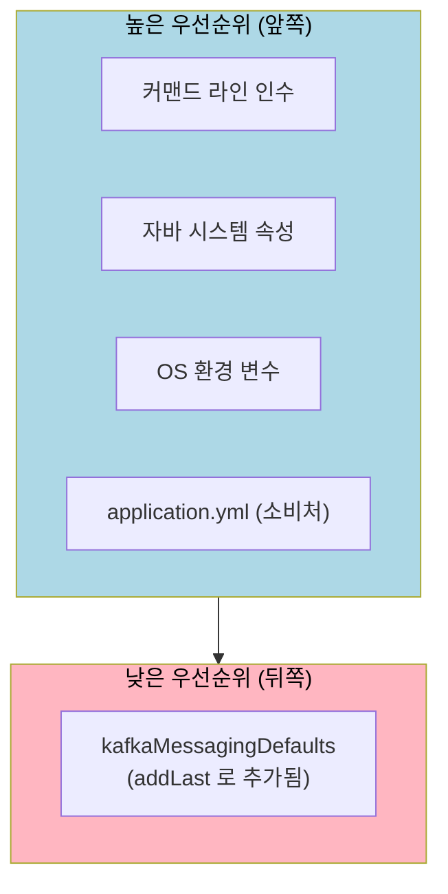
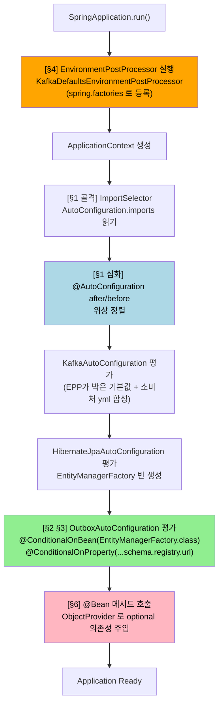

# 자동 구성 심화 — 순서·게이트·기본값 주입
---

> [01-02](01-02.자동%20구성%20—%20@AutoConfiguration과%20@Conditional.md) 가 자동 구성의 *기본 골격* 이라면, 본 문서는 그 골격으로 못 푸는 사내 케이스를 통해 자동 구성의 *심화 도구 4개* 를 정리합니다. 자동 구성 클래스끼리의 *순서 제어*(`after`/`before`), 빈 *존재* 를 조건으로 거는 `@ConditionalOnBean`, 설정 키 *존재* 자체를 게이트로 쓰는 `@ConditionalOnProperty(name = ...)`, 그리고 ApplicationContext 가 만들어지기 *전* 에 기본값을 박는 `EnvironmentPostProcessor` 입니다. 끝까지 읽으면 사내 `message-lib` 가 왜 이 네 도구를 골랐는지 코드를 보지 않고도 설명할 수 있게 됩니다.

## 진입 — 기본 자동 구성으로 안 풀리는 사내 케이스

> 본 절은 §1 정의로 들어가기 전, *왜* 심화 도구들이 필요했는지 사내 라이브러리의 한 컷을 보여 줍니다. 진입 절은 번호를 붙이지 않습니다.

사내 `tps-gitlab2/message-lib` 는 outbox 패턴으로 Kafka 이벤트를 발행하는 공용 라이브러리입니다. 사용자(소비 프로젝트)는 의존성만 추가하면 `EventPublisher` 가 자동으로 등록되어 주입받아 쓸 수 있어야 합니다. [01-03](01-03.커스텀%20스타터%20만들기.md) 에서 본 커스텀 스타터 패턴 그대로입니다.

그런데 막상 만들어 보면 기본 도구 두 개로는 부족한 자리가 네 군데 나옵니다.

1. `OutboxPoller` 는 `KafkaTemplate` 과 `EntityManager` 를 주입받아야 합니다. 그런데 이 둘은 스프링 부트의 `KafkaAutoConfiguration`·`HibernateJpaAutoConfiguration` 이 만들어 줍니다. *내가 먼저 떠 버리면* 둘은 아직 존재하지 않아 주입이 실패합니다.
2. outbox 는 JPA 가 있는 프로젝트에서만 의미가 있습니다. JPA 클래스가 클래스패스에 있어도(`@ConditionalOnClass`) 사용자가 JPA 를 *켜지 않았으면* 그래도 비활성이어야 합니다.
3. Avro 직렬화기는 Schema Registry URL 이 *설정돼 있을 때만* 등록해야 합니다. 값을 *비교* 하는 게 아니라, 키 자체가 *있느냐 없느냐* 가 조건입니다.
4. 사내 라이브러리는 Kafka 의 안전 기본값(`acks=all`·`enable.idempotence=true`·`ErrorHandlingDeserializer`)을 *라이브러리 단에서* 박고 싶습니다. 그런데 이 값들을 `@Configuration` 빈으로 만들면 이미 `KafkaAutoConfiguration` 이 프로퍼티를 읽고 빈을 만든 *뒤* 입니다 — 너무 늦습니다.

본 문서는 이 네 가지 자리를 차례로 풀어 갑니다. 각 절은 *왜* 그 도구가 그 자리를 채우는지, 사내 코드 한 컷이 그것을 어떻게 쓰는지로 구성합니다.

## 1. 자동 구성에는 순서가 있다 — `after` / `before`

> 이 개념은 [01-02 §3](01-02.자동%20구성%20—%20@AutoConfiguration과%20@Conditional.md) 의 `ImportSelector` 가 *후보로 올리는* 단계 다음에 일어나는, *후보들 사이* 의 위상 정렬입니다. 클래스패스에 자동 구성 후보가 수백 개라 누가 누구보다 먼저 평가돼야 하는지를 정해야 합니다.

[01-02 §3](01-02.자동%20구성%20—%20@AutoConfiguration과%20@Conditional.md) 에서 `AutoConfiguration.imports` 가 자동 구성 클래스 목록을 모두 후보로 올린다고 했습니다. 그 후보들 사이에는 *암묵적 의존성* 이 있습니다. `OutboxPoller` 가 `KafkaTemplate` 을 주입받으려면 `KafkaAutoConfiguration` 이 먼저 평가되어 그 빈을 만들어 둬야 합니다. 그 순서를 보장하는 도구가 `@AutoConfiguration` 의 `after` / `before` 속성입니다.

```java
// 사내: org.okestro.tps.messaging.infrastructure.outbox.OutboxAutoConfiguration
@AutoConfiguration(after = {
        KafkaAutoConfiguration.class,       // KafkaTemplate이 먼저 생성되어야 함
        HibernateJpaAutoConfiguration.class // EntityManager가 먼저 생성되어야 함
})
@ConditionalOnBean(EntityManagerFactory.class)
@EnableScheduling
@EntityScan(basePackageClasses = OutboxEventEntity.class)
@EnableConfigurationProperties(OutboxProperties.class)
public class OutboxAutoConfiguration {
    // ...
}
```

`after` 에 두 자동 구성 클래스가 박혀 있습니다. 이 한 줄이 "이 자동 구성은 `KafkaAutoConfiguration` 과 `HibernateJpaAutoConfiguration` 이 *모두 평가된 뒤* 에 평가돼야 한다"를 스프링 부트에 알립니다. 반대 방향이 필요하면 `before` 를 씁니다. 둘 다 같은 의미인데 *내 위치를 어디에 두는지* 만 다릅니다.

### `dependsOn` 과는 어떻게 다른가

빈 단위의 `@DependsOn` 은 *빈 인스턴스화 순서* 를 정합니다. 반면 `@AutoConfiguration(after = ...)` 는 *자동 구성 클래스 평가 순서* 를 정합니다. 더 거시적인 단위입니다.

| 도구 | 단위 | 영향 |
|------|------|------|
| `@DependsOn("beanA")` | 개별 빈 | A 가 인스턴스화된 뒤 이 빈 생성 |
| `@AutoConfiguration(after = AutoConfigX.class)` | 자동 구성 클래스 전체 | X 클래스 안의 모든 빈 정의가 평가된 뒤 이 클래스 평가 |

사내 OutboxAutoConfiguration 의 경우 빈 하나하나에 `@DependsOn` 을 박는 대신, `KafkaAutoConfiguration` *전체* 가 끝난 뒤에 자기를 평가하게 합니다. `KafkaTemplate` 외에도 ProducerFactory·ConsumerFactory 등 여러 빈이 같은 자동 구성에서 나오는데, 그 묶음을 한 번에 보장하는 게 자연스럽기 때문입니다.

### `@AutoConfigureBefore`·`@AutoConfigureAfter` 어노테이션도 같은 일

Spring Boot 2.7 이전 코드를 읽다 보면 `@AutoConfigureBefore`·`@AutoConfigureAfter` 가 보입니다. 3.x 에서는 `@AutoConfiguration` 어노테이션의 `before`/`after` 속성으로 통합돼 같은 결과를 냅니다. 새 코드는 속성 형태가 권장입니다.

## 2. 빈 존재를 조건으로 — `@ConditionalOnBean`

> `@ConditionalOnMissingBean` 이 "없을 때만 기본값을 제공" 이었다면, 본 절의 `@ConditionalOnBean` 은 그 *반대* 입니다. *있을 때만 활성화* 하는 조건이며, 두 어노테이션이 짝을 이뤄 자동 구성의 *환경 의존성* 을 표현합니다.

[01-02 §2](01-02.자동%20구성%20—%20@AutoConfiguration과%20@Conditional.md) 에서 본 `@ConditionalOnMissingBean` 은 "사용자가 직접 등록 안 했을 때만 기본 빈을 제공" 하는 *예의* 였습니다. 그런데 자동 구성 자체가 *특정 빈이 있을 때만 의미가 있는* 경우도 있습니다. outbox 는 JPA 가 있어야만 동작합니다 — 클래스만 있고 JPA 가 켜져 있지 않으면 outbox 도 무의미합니다.

```java
// 사내: OutboxAutoConfiguration 클래스 선언부
@AutoConfiguration(after = { KafkaAutoConfiguration.class, HibernateJpaAutoConfiguration.class })
@ConditionalOnBean(EntityManagerFactory.class)  // JPA가 없으면 Outbox 비활성화
public class OutboxAutoConfiguration { /* ... */ }
```

`@ConditionalOnBean(EntityManagerFactory.class)` 한 줄이 자동 구성 클래스 *전체* 의 활성 여부를 가릅니다. JPA 자동 구성이 평가되지 않아 `EntityManagerFactory` 빈이 없으면, outbox 자동 구성 전체가 통째로 비활성됩니다.

### 왜 `@ConditionalOnClass` 가 아니라 `@ConditionalOnBean` 인가

`spring-boot-starter-data-jpa` 의존성이 클래스패스에 있어도 사용자가 실제로 JPA 를 사용하지 않는 경우가 있습니다. 예를 들어 같은 모듈에서 일부 통합 테스트만 JPA 를 끄고 돌리거나, 부분 활성화를 위해 자동 구성을 `exclude` 한 경우입니다. 이때 `@ConditionalOnClass` 는 "클래스가 있다" 로 통과하지만 실제로 빈은 없어 주입이 실패합니다.

| 어노테이션 | 평가 시점 | 통과 기준 |
|----------|---------|----------|
| `@ConditionalOnClass` | 자동 구성 후보 선별 시점 | 클래스가 클래스패스에 있음 |
| `@ConditionalOnBean` | 자동 구성 *평가 단계* | 해당 빈이 *실제로 등록됨* |
| `@ConditionalOnMissingBean` | 자동 구성 *평가 단계* | 해당 빈이 *등록되지 않음* |

`@ConditionalOnBean` 은 *다른 자동 구성이 만든 빈* 을 본다는 게 핵심입니다. 그래서 §1 의 `after` 와 거의 짝으로 쓰입니다. "X 다음에 평가되고, X 가 만든 빈이 있으면 활성화" 가 한 묶음입니다.

### `@ConditionalOnMissingBean(name = ...)` — 이름으로 가르기

같은 계열의 변종으로 *이름* 을 지정하는 형태가 있습니다. 같은 타입의 빈이 여러 개 필요할 때 이름으로 구별합니다.

```java
@Bean("outboxTransactionTemplate")
@ConditionalOnMissingBean(name = "outboxTransactionTemplate")
@ConditionalOnBean(PlatformTransactionManager.class)
public TransactionTemplate outboxTransactionTemplate(PlatformTransactionManager tx) {
    return new TransactionTemplate(tx);
}
```

사내 OutboxAutoConfiguration 은 outbox 전용 `TransactionTemplate` 을 만듭니다. 그런데 사용자 프로젝트에 *다른* `TransactionTemplate` 이 이미 있을 수 있으므로, 타입이 아니라 *이름* 으로 "이 이름의 빈이 없을 때만" 을 표현합니다. 비즈니스 TX 와 폴링 TX 를 분리하려는 의도입니다.

## 3. 키 존재 자체를 게이트로 — `@ConditionalOnProperty(name = ...)`

> [01-02 §2](01-02.자동%20구성%20—%20@AutoConfiguration과%20@Conditional.md) 의 `@ConditionalOnProperty` 는 "설정값이 *특정 값* 일 때" 가 일반 사용법이지만, 본 절은 그 변종 — *값을 보지 않고 키 존재만 확인* 하는 형태를 다룹니다.

`@ConditionalOnProperty` 는 `value` 와 `havingValue` 로 *값 비교* 를 합니다. `featureA.enabled = true` 같은 boolean 토글이 대표 사용법입니다. 그런데 *값이 무엇이든* "이 키가 설정돼 있기만 하면" 활성화하고 싶을 때가 있습니다. 사내 라이브러리에서 Avro 직렬화기가 그렇습니다.

```java
// 사내: OutboxAutoConfiguration#avroSerializer
@Bean
@ConditionalOnProperty(name = "spring.kafka.properties.schema.registry.url")
@ConditionalOnMissingBean
public AvroSerializer avroSerializer(
        @Value("${spring.kafka.properties.schema.registry.url}") String schemaRegistryUrl
) {
    return new AvroSerializer(schemaRegistryUrl);
}
```

`value`·`havingValue` 가 빠져 있습니다. 이 형태는 "키가 *어떤 값으로든* 설정돼 있으면 true" 로 해석됩니다. Schema Registry URL 은 환경마다 값이 다르므로(개발 `http://schema:8081` / 운영 `https://schema.prod.../`), 라이브러리가 특정 값을 강제할 수 없습니다. 키 존재 자체가 *"이 환경은 Avro 를 쓴다"* 의 충분 조건입니다.

같은 패턴이 자동 구성 클래스 레벨에도 박힙니다.

```java
// 사내: KafkaRetryTemplateConfig 클래스 선언부
@AutoConfiguration(after = KafkaAutoConfiguration.class)
@ConditionalOnProperty(name = "spring.kafka.properties.schema.registry.url")
public class KafkaRetryTemplateConfig { /* ... */ }
```

이번에는 자동 구성 클래스 *전체* 가 같은 키에 묶여 있습니다. URL 이 없으면 retry/DLT 용 Avro KafkaTemplate 자체가 등록되지 않습니다.

### 왜 값 검증을 하지 않는가

URL 형식 검증은 *빈 생성 시점* 이 더 명확합니다. 잘못된 형식이면 `AvroSerializer` 생성자에서 즉시 예외가 나고, 애플리케이션이 fail-fast 합니다. [02-02 §4](02-02.@ConfigurationProperties와%20타입%20안전%20설정.md) 의 `@Validated` 와 같은 철학입니다 — "잘못된 설정으로 일단 떠서 운영 중에 터지는" 대신 "잘못된 설정이면 아예 안 뜨는" 안전한 실패입니다.

자동 구성 어노테이션은 *값의 정합성* 을 책임지지 않습니다. *키 존재로 켜고 끄는 스위치* 역할만 합니다. 정합성은 빈 생성 시점이 더 적합한 자리입니다.

### `matchIfMissing` — 기본 활성 토글

`@ConditionalOnProperty(name = "feature.x", havingValue = "true", matchIfMissing = true)` 는 "값이 명시적으로 false 가 아니면 활성" 으로 해석됩니다. 라이브러리 기능을 *기본 켜고* 사용자가 명시적으로 끄게 할 때 씁니다. 사내 코드에서 본 패턴은 아니지만 같은 어노테이션의 짝꿍 옵션이라 알아 둡니다.

## 4. ApplicationContext 이전 단계의 기본값 — `EnvironmentPostProcessor`

> `@Configuration` 빈은 ApplicationContext *안에서* 만들어집니다. 그 컨텍스트가 만들어지기 *전* 단계에 끼어들어야 하는 일은 다른 도구가 필요합니다. `EnvironmentPostProcessor`(이하 EPP) 가 그 자리입니다.

### 왜 `@Configuration` 으로는 못 푸는가

Spring Boot 의 `KafkaAutoConfiguration` 은 `spring.kafka.*` 프로퍼티를 읽어 `KafkaTemplate`·`ProducerFactory` 빈을 만듭니다. 이 일은 ApplicationContext *안* 에서 일어납니다. 라이브러리가 *라이브러리 기본값* 으로 `acks=all`·`enable.idempotence=true` 같은 안전 설정을 박고 싶다면, 그 값들이 `KafkaAutoConfiguration` 이 읽기 *전에* `Environment` 에 들어 있어야 합니다.

`@Configuration` 빈으로 만들면 이미 `KafkaAutoConfiguration` 이 평가된 뒤라 너무 늦습니다. 반대로 EPP 는 *ApplicationContext 가 만들어지기 전 단계* 에 실행되어 `Environment` 의 `PropertySource` 를 직접 수정할 수 있습니다.

```text
SpringApplication.run() 호출
  └─ Environment 준비
       └─ EnvironmentPostProcessor 실행  ★ ← 여기서 PropertySource 추가
       └─ ApplicationContext 생성
            └─ AutoConfiguration 평가 (KafkaAutoConfiguration 포함)
                 └─ Environment 에서 spring.kafka.* 읽어 빈 생성
```

EPP 가 단계상 *위쪽* 에 있어 `KafkaAutoConfiguration` 이 보는 `Environment` 에는 이미 라이브러리 기본값이 들어 있습니다.

### 사내 코드 — `KafkaDefaultsEnvironmentPostProcessor`

```java
// 사내: org.okestro.tps.messaging.config.KafkaDefaultsEnvironmentPostProcessor
public class KafkaDefaultsEnvironmentPostProcessor implements EnvironmentPostProcessor {

    @Override
    public void postProcessEnvironment(ConfigurableEnvironment environment, SpringApplication application) {
        Map<String, Object> defaults = new LinkedHashMap<>();

        // acks=all + retries>0 + enable.idempotence=true 트리오는 단일 파티션 EOS(중복 없는 전송) 조건
        // 셋 중 하나라도 빠지면 브로커 재시도 시 같은 메시지가 두 번 들어가거나 ack 손실로 누락이 생김
        defaults.put("spring.kafka.producer.acks", "all");
        defaults.put("spring.kafka.producer.retries", "3");
        defaults.put("spring.kafka.producer.properties.enable.idempotence", "true");

        // ErrorHandlingDeserializer 로 감싸 두면 역직렬화 실패가 record header 로 전달되어
        // ErrorHandler → DLQ 격리 흐름을 탄다 (감싸지 않으면 같은 offset 무한 재시도 함정)
        defaults.put("spring.kafka.consumer.key-deserializer",
                "org.springframework.kafka.support.serializer.ErrorHandlingDeserializer");
        defaults.put("spring.kafka.consumer.value-deserializer",
                "org.springframework.kafka.support.serializer.ErrorHandlingDeserializer");

        // 가장 낮은 우선순위로 등록 → 소비 프로젝트 application.yml 이 오버라이드 가능
        environment.getPropertySources().addLast(
                new MapPropertySource("kafkaMessagingDefaults", defaults)
        );
    }
}
```

핵심은 마지막 두 줄입니다. `addLast` 로 `PropertySource` 를 추가합니다. [02-01 §3](02-01.외부%20설정%20—%20커맨드라인부터%20application.yml까지.md) 에서 `Environment` 가 여러 `PropertySource` 를 합성한다고 했습니다. 그 합성에서 *맨 뒤에* 들어가는 게 가장 낮은 우선순위입니다.



이 순서가 라이브러리 기본값의 *예의* 입니다. 같은 키가 소비처 `application.yml` 에도 있으면 *소비처가 이깁니다*. 라이브러리는 *기본값만 제공* 하고 최종 결정권은 사용자에게 남깁니다. [01-02 §2](01-02.자동%20구성%20—%20@AutoConfiguration과%20@Conditional.md) 의 `@ConditionalOnMissingBean` 이 *빈 단위* 로 한 일을, EPP 의 `addLast` 는 *프로퍼티 단위* 로 합니다.

### 왜 안전 기본값을 라이브러리에서 박는가

`acks=all` 한 줄을 빼먹으면 일부 메시지가 누락될 수 있고, `enable.idempotence=true` 가 없으면 브로커 재시도가 중복 발행을 만듭니다. 이 세 가지를 모든 소비처가 `application.yml` 에 빠짐없이 적게 하는 대신, 라이브러리가 *기본값* 으로 박아 두면 소비처가 까먹어도 안전한 상태로 떠납니다. *기본값이 안전한 쪽으로 박혀 있다* 가 라이브러리 설계의 미덕입니다.

## 5. EPP 는 `.imports` 가 아닌 `META-INF/spring.factories`

> [01-03 §3](01-03.커스텀%20스타터%20만들기.md) 에서 자동 구성 클래스는 `META-INF/spring/...AutoConfiguration.imports` 에 등록한다고 했습니다. 그런데 EPP 는 *그 파일에 등록할 수 없습니다*. 왜 그런지, 어디에 등록해야 하는지가 본 절의 주제입니다.

### 왜 `.imports` 가 안 되는가

`AutoConfiguration.imports` 는 [01-02 §3](01-02.자동%20구성%20—%20@AutoConfiguration과%20@Conditional.md) 의 `ImportSelector` 가 읽습니다. 그리고 `ImportSelector` 는 `@EnableAutoConfiguration` 이 트리거합니다 — 그 어노테이션은 *ApplicationContext 안의 설정 클래스* 가 가지고 있는 마커입니다. 즉 `.imports` 의 모든 항목은 ApplicationContext 가 *만들어지는 도중* 에 평가됩니다.

EPP 는 §4 에서 본 것처럼 ApplicationContext *이전 단계* 에 실행됩니다. 컨텍스트 안의 `ImportSelector` 가 닿지 못합니다. 그래서 별도 등록 통로가 필요합니다.

### 등록 위치 — `META-INF/spring.factories`

옛날부터 있던 `spring.factories` 가 그 역할을 지금도 합니다. 자동 구성 클래스만 `.imports` 로 옮겼고, 컨텍스트 외부의 SPI(Service Provider Interface)들은 `spring.factories` 에 그대로 남아 있습니다.

```text
# 사내: src/main/resources/META-INF/spring.factories
org.springframework.boot.env.EnvironmentPostProcessor=\
org.okestro.tps.messaging.config.KafkaDefaultsEnvironmentPostProcessor
```

키가 *인터페이스의 FQCN*, 값이 *구현체의 FQCN* 입니다. 스프링 부트는 시작 시점에 클래스패스의 모든 `spring.factories` 를 읽어 키별로 구현체를 찾아 실행합니다. EPP 외에도 `ApplicationContextInitializer`·`SpringApplicationRunListener`·`FailureAnalyzer` 같은 컨텍스트 외부 SPI 들이 같은 파일을 씁니다.

### 두 파일의 역할 분리

| 등록 파일 | 등록 대상 | 평가 시점 |
|----------|----------|----------|
| `META-INF/spring/org.springframework.boot.autoconfigure.AutoConfiguration.imports` | 자동 구성 클래스 (`@AutoConfiguration`) | ApplicationContext *안* |
| `META-INF/spring.factories` | EPP·Initializer·RunListener 등 컨텍스트 외부 SPI | ApplicationContext *전·후* |

"`spring.factories` 는 구버전 방식" 이라는 설명을 종종 보지만, 정확히는 *자동 구성 등록만* 새 파일로 옮겨졌고 컨텍스트 외부 SPI 는 여전히 `spring.factories` 가 표준입니다. 사내 message-lib 도 두 파일을 *동시에* 가지고 있는 이유가 이것입니다.

## 6. Optional 의존성 — `ObjectProvider<T>`

> 라이브러리가 *있어도 좋고 없어도 좋은* 의존성을 표현하는 도구입니다. `@Autowired(required = false)` 의 더 안전하고 명시적인 형태로, 사내 OutboxAutoConfiguration 이 세 군데에서 씁니다.

### 왜 `@Autowired(required = false)` 가 아닌가

`@Autowired(required = false)` 는 의존성이 없으면 `null` 을 주입합니다. 받는 쪽 코드가 매번 null 체크를 해야 하고, 빈 그래프 분석 시점에 의존성이 *얼마나 있을 수 있는지* 가 불분명합니다. `ObjectProvider<T>` 는 같은 일을 더 표현적으로 합니다.

```java
// 사내: OutboxAutoConfiguration#outboxRetryPolicy
@Bean
@ConditionalOnMissingBean
public OutboxRetryPolicy outboxRetryPolicy(
        ObjectProvider<Clock> clockProvider
) {
    // Clock 빈이 있으면 그것을, 없으면 systemUTC 를 기본값으로
    return new OutboxRetryPolicy(clockProvider.getIfAvailable(Clock::systemUTC));
}
```

`getIfAvailable(Supplier<T> defaultSupplier)` 는 빈이 있으면 그것을 반환하고, 없으면 람다로 받은 기본값을 만들어 줍니다. null 체크가 *값 결정 한 줄* 안으로 압축됩니다.

### 사내 활용 — 세 가지 패턴

```java
// (1) MeterRegistry 가 없으면 no-op OutboxMetrics
@Bean
@ConditionalOnMissingBean
public OutboxMetrics outboxMetrics(
        ObjectProvider<MeterRegistry> meterRegistryProvider
        , OutboxEventRepository repo
) {
    MeterRegistry registry = meterRegistryProvider.getIfAvailable();
    return registry == null ? new OutboxMetrics() : new OutboxMetrics(registry, repo);
}

// (2) AvroSerializer 가 없으면 byte[] 오버로드만 가능한 EventPublisher
@Bean
@ConditionalOnMissingBean
public EventPublisher eventPublisher(OutboxEventRepository repo
        , ObjectProvider<AvroSerializer> avroSerializerProvider) {
    return new EventPublisher(repo, avroSerializerProvider.getIfAvailable());
}
```

세 군데 모두 *공통 패턴* 입니다 — 의존성이 있으면 풍부한 동작, 없으면 축소된 동작. 라이브러리는 *환경에 맞춰 자기 표현을 줄이는* 자유를 가집니다. Actuator 없이도 outbox 가 돌고, Schema Registry 없이도 byte[] 직렬화로 발행 자체는 가능합니다.

### `getObject()` vs `getIfAvailable()`

`ObjectProvider` 의 메서드는 의도에 따라 골라 씁니다.

| 메서드 | 동작 |
|--------|------|
| `getObject()` | 빈이 없으면 `NoSuchBeanDefinitionException` |
| `getIfAvailable()` | 빈이 없으면 `null` |
| `getIfAvailable(Supplier)` | 빈이 없으면 람다 기본값 |
| `getIfUnique()` | 후보가 여럿이면 `null` (모호함 회피) |
| `stream()` | 모든 후보를 Stream 으로 |

사내 코드는 "없을 때 fallback" 의도이므로 거의 모두 `getIfAvailable` 변종을 씁니다.

## 7. 부팅 순서 — message-lib 한 컷

> 위 §1~§6 의 도구들이 *함께* 동작할 때 어떤 순서로 펼쳐지는지 한 다이어그램으로 봅니다. 시점 차이가 이 도구들의 *역할 분리* 를 설명합니다.



EPP 가 컨텍스트 *밖* 에서 기본값을 박고, 컨텍스트 *안* 에서는 `after` 가 평가 순서를 잡으며, 그 평가 시점에 `@ConditionalOnBean`·`@ConditionalOnProperty` 가 활성 여부를 판단하고, 마침내 빈을 만들 때 `ObjectProvider` 가 optional 의존성을 해결합니다. 네 도구가 *서로 다른 시점* 에 끼어들어 자동 구성의 의도를 완성합니다.

## 8. 정리

| 도구 | 푸는 문제 | 사내 사례 |
|------|----------|----------|
| `@AutoConfiguration(after = X.class)` | 자동 구성 클래스 평가 순서 | OutboxAutoConfig 가 Kafka/JPA 다음 |
| `@ConditionalOnBean(T.class)` | 다른 빈이 *있을 때만* 활성 | `EntityManagerFactory` 가 있어야 outbox |
| `@ConditionalOnProperty(name = ...)` (값 없음) | 설정 키 *존재* 자체가 게이트 | schema.registry.url 있으면 AvroSerializer |
| `EnvironmentPostProcessor` | ApplicationContext 이전 단계 기본값 주입 | Kafka 안전 기본값 (acks=all, idempotence) |
| `META-INF/spring.factories` | 컨텍스트 외부 SPI 등록 | EPP 등록 (`.imports` 불가) |
| `@EnableConfigurationProperties` | 자동 구성에서 properties 클래스만 등록 | `OutboxProperties` |
| `@ConditionalOnMissingBean(name = ...)` | 이름 단위 충돌 회피 | `outboxTransactionTemplate` |
| `ObjectProvider<T>` | optional 의존성 표현 | MeterRegistry/Clock/AvroSerializer |

## 9. 면접에서 받을 만한 질문

> 다섯 질문에 *먼저 스스로 답해 보세요.* 자답이 끝나면 아래 §정답 (자답 후 펼치기) 으로 내려갑니다.

1. `@AutoConfiguration(after = KafkaAutoConfiguration.class)` 는 무엇을 보장하는가? `@DependsOn` 과 단위가 어떻게 다른가?
   - 답 요지: 자동 구성 *클래스 평가 순서* 를 보장. `@DependsOn` 은 *빈 단위*.
2. `@ConditionalOnClass` 와 `@ConditionalOnBean` 의 평가 시점 차이는?
   - 답 요지: OnClass 는 *후보 선별 시점* (클래스 존재만), OnBean 은 *평가 단계* (다른 자동 구성이 실제 빈을 만들었는지).
3. `@ConditionalOnProperty(name = ...)` 에 `value`·`havingValue` 가 없으면 어떻게 해석되는가? 왜 값 검증을 자동 구성에 두지 않는가?
   - 답 요지: 키가 *어떤 값으로든* 있으면 활성. 값 정합성은 빈 생성 시점 fail-fast 가 더 명확.
4. `EnvironmentPostProcessor` 가 `@Configuration` 으로는 못 푸는 일은 무엇인가? `addLast` 와 `addFirst` 의 우선순위 함의는?
   - 답 요지: 자동 구성이 프로퍼티를 *읽기 전* 단계에 기본값 주입. addLast=최저 우선순위(소비처 yml 이 덮어씀), addFirst=최고.
5. `META-INF/spring.factories` 와 `AutoConfiguration.imports` 의 등록 대상은 어떻게 다른가?
   - 답 요지: 후자는 *자동 구성 클래스* 전용, 전자는 EPP 같은 *컨텍스트 외부 SPI* 용. "구버전" 이 아니라 *역할 분리*.

## 10. 정답 (자답 후 펼치기)

> 위 §9 의 5개 질문에 *먼저 자답한 뒤* 아래를 읽으세요. 자답 없이 먼저 읽으면 학습 효과가 0 입니다.

### 정답 1 — `@AutoConfiguration(after = ...)` 의 보장 단위

자동 구성 *클래스 전체* 의 평가 순서를 보장합니다. `KafkaAutoConfiguration` 안에 들어 있는 모든 빈 정의(`KafkaTemplate`·`ProducerFactory`·`ConsumerFactory` 등)가 *모두 평가된 뒤* 에 내 자동 구성이 평가됩니다. `@DependsOn` 은 *개별 빈 인스턴스화* 순서를 정하는 데 비해, 자동 구성 단위는 더 거시적입니다. 사내 OutboxAutoConfiguration 의 경우 `KafkaTemplate` 외에도 ProducerFactory 등 여러 빈에 간접 의존하므로, 묶음을 한 번에 기다리는 `after` 가 자연스럽습니다.

### 정답 2 — OnClass vs OnBean 평가 시점

`@ConditionalOnClass` 는 `ImportSelector` 가 자동 구성 *후보를 선별* 하는 시점에 평가됩니다. 클래스가 클래스패스에 있기만 하면 통과합니다. `@ConditionalOnBean` 은 자동 구성이 *실제로 평가되는 단계* 에 평가되며, 다른 자동 구성이 *그 빈을 실제로 만들었는지* 까지 봅니다. 그래서 클래스는 있지만 사용자가 JPA 를 끈 경우 같은 상황을 OnBean 만 정확히 가려낼 수 있습니다. 사내 OutboxAutoConfiguration 이 `@ConditionalOnClass(EntityManager.class)` 가 아니라 `@ConditionalOnBean(EntityManagerFactory.class)` 를 쓰는 이유가 이것입니다.

### 정답 3 — 값 없는 `@ConditionalOnProperty` 의 의미

`@ConditionalOnProperty(name = "x.y.z")` 에 `value`/`havingValue` 가 없으면 "키 `x.y.z` 가 *어떤 값으로든* 설정돼 있으면 true" 로 해석됩니다. Schema Registry URL 처럼 *환경마다 값이 다른* 설정에 적합합니다. 값의 *정합성* 검증을 자동 구성 어노테이션에 두지 않는 이유는 두 가지입니다. 첫째, 자동 구성 어노테이션은 *스위치* 의도이지 validator 가 아닙니다. 둘째, 잘못된 형식(예: 깨진 URL)은 *빈 생성 시점* 에 즉시 예외로 fail-fast 하는 게 운영 진단에 더 명확합니다. 이는 [02-02 §4](02-02.@ConfigurationProperties와%20타입%20안전%20설정.md) 의 `@Validated` 가 시작 시점에 막는 것과 같은 철학입니다.

### 정답 4 — EPP 의 자리와 우선순위

`@Configuration` 빈은 ApplicationContext *안에서* 만들어지므로, `KafkaAutoConfiguration` 이 `Environment` 에서 프로퍼티를 *이미 읽은 뒤* 입니다. 라이브러리가 *기본값* 으로 끼어들려면 컨텍스트가 만들어지기 *전* 단계여야 하고, 그 자리가 EPP 입니다. `addLast` 는 `PropertySource` 를 가장 *낮은 우선순위* 로 추가하므로 소비처 `application.yml`·`-D` 시스템 속성·커맨드 라인 인수가 모두 이를 덮어씁니다. *기본값만 제공하고 최종 결정권은 사용자에게 남기는* 라이브러리 예의입니다. `addFirst` 는 반대로 최고 우선순위 — 사용자조차 덮을 수 없게 막는 경우에만 씁니다(일반 라이브러리에서는 거의 안 씀).

### 정답 5 — 두 등록 파일의 역할 분리

`AutoConfiguration.imports` 는 *자동 구성 클래스(`@AutoConfiguration`)* 만 등록합니다. ApplicationContext 안에서 `ImportSelector` 가 읽기 때문입니다. `spring.factories` 는 *컨텍스트 외부 SPI* — `EnvironmentPostProcessor`·`ApplicationContextInitializer`·`SpringApplicationRunListener`·`FailureAnalyzer` 등을 등록합니다. 이들은 ApplicationContext 가 만들어지기 *전·후* 에 동작하므로 `ImportSelector` 가 닿지 못합니다. "`spring.factories` 는 구버전" 이라는 흔한 오해는 *자동 구성 등록만* 새 파일로 옮겨진 점을 일반화한 결과이며, 실제로는 두 파일이 *서로 다른 역할* 로 공존합니다. 사내 message-lib 도 둘을 모두 가지고 있습니다.

## 11. 다음에 읽을 것

- [01-02.자동 구성 — @AutoConfiguration과 @Conditional](01-02.자동%20구성%20—%20@AutoConfiguration과%20@Conditional.md) — 본 문서가 심화한 자동 구성의 골격
- [01-03.커스텀 스타터 만들기](01-03.커스텀%20스타터%20만들기.md) — `AutoConfiguration.imports` 등록 절차
- [02-01.외부 설정 — 커맨드라인부터 application.yml까지](02-01.외부%20설정%20—%20커맨드라인부터%20application.yml까지.md) §3 — EPP 가 끼어드는 `PropertySource` 합성 순서
- [02-02.@ConfigurationProperties와 타입 안전 설정](02-02.@ConfigurationProperties와%20타입%20안전%20설정.md) — `OutboxAutoConfiguration` 이 함께 쓰는 `@EnableConfigurationProperties`
