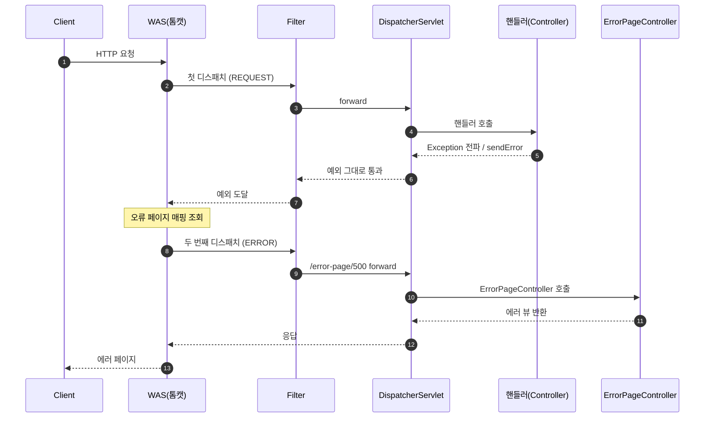
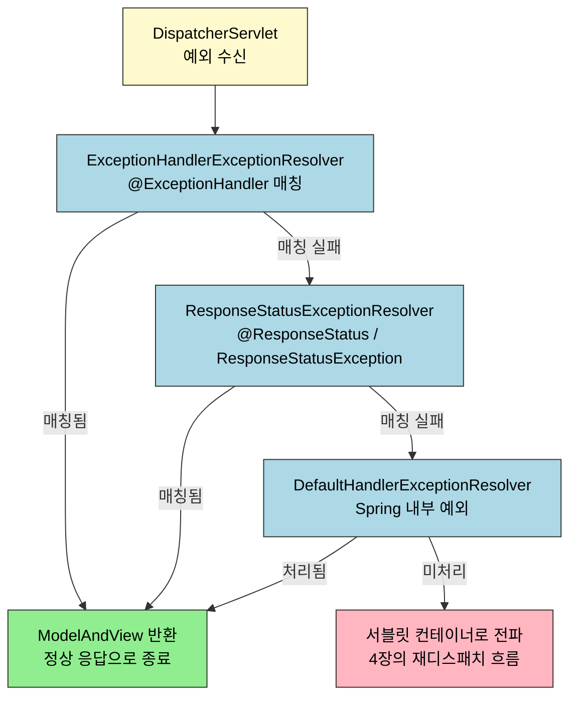
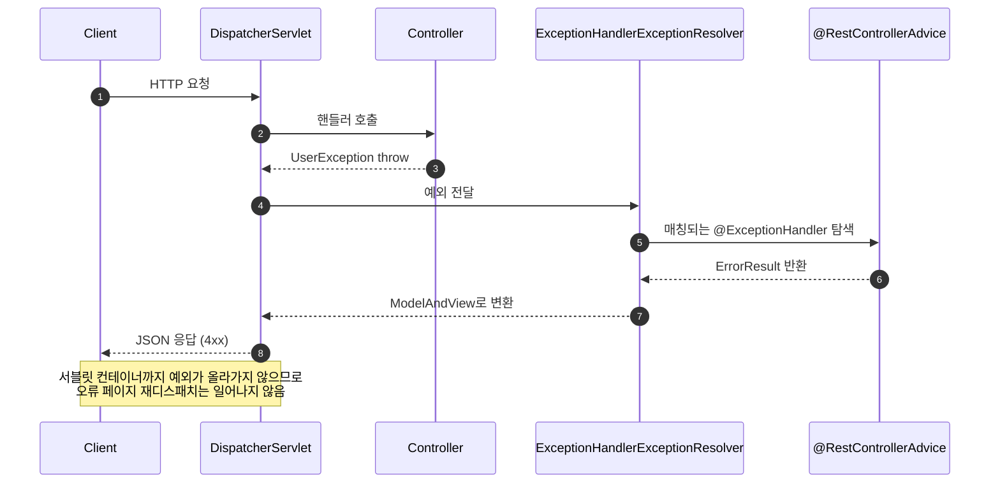

# 예외 처리 — 서블릿에서 @ControllerAdvice까지
---

> 서블릿 컨테이너가 예외를 어떻게 다루는지부터 출발해, Spring Boot 의 `BasicErrorController`, `HandlerExceptionResolver` 체인, 그리고 `@ControllerAdvice` 까지 한 흐름으로 정리합니다. 면접에서 "Spring 의 예외 처리는 어떻게 동작하나" 라는 질문을 받았을 때, 서블릿 레벨의 재호출 흐름부터 `@RestControllerAdvice` 의 전역 처리까지 끊김 없이 답할 수 있는 수준을 목표로 합니다.

## 진입 — 예외 처리가 왜 별도 주제인가

> Spring 의 예외 처리는 단순히 `try-catch` 를 보기 좋게 모아 놓은 것이 아닙니다. 서블릿 컨테이너가 예외를 받아서 다시 컨트롤러를 호출하는 흐름이 먼저 있고, Spring 은 그 흐름 위에서 "에러 처리라는 공통 관심사" 를 분리하기 위해 `HandlerExceptionResolver` 라는 별도 인터페이스를 만들었습니다.

웹 애플리케이션은 요청마다 별도 스레드에서 처리되므로, 컨트롤러에서 던진 예외가 잡히지 않으면 결국 WAS(톰캣) 까지 전달됩니다. WAS 는 이 예외를 보고 "오류 페이지를 다시 요청" 하는 형태로 처리하는데, 이 재요청 흐름을 그대로 두면 비즈니스 로직 곳곳에 에러 분기 코드가 흩어집니다. Spring 은 이 재요청을 가로채서 컨트롤러 단에서 깔끔하게 끝낼 수 있도록 `HandlerExceptionResolver` 와 `@ExceptionHandler`, `@ControllerAdvice` 같은 도구를 단계별로 얹어 왔습니다.

본 문서는 그 단계를 그대로 따라갑니다. 서블릿 레벨에서 예외가 어디까지 올라가는지, Spring Boot 가 그것을 어떻게 자동화했는지, 그 다음 Spring MVC 가 그 위에 어떤 추상화를 더했는지 순서대로 봅니다.

## 1. 한 줄 정의

> Spring 의 예외 처리는 컨트롤러에서 던진 예외를 `DispatcherServlet` 이 받아 `HandlerExceptionResolver` 체인에 넘기고, 그중 하나가 적절한 `ModelAndView` 또는 응답을 만들어 반환함으로써 WAS 까지 예외가 흘러가는 것을 막는 메커니즘입니다.

한 문장에 세 부품 — `DispatcherServlet`, `HandlerExceptionResolver`, `ModelAndView` — 이 들어 있습니다. 면접에서는 이 셋이 각각 어떤 역할을 맡는지, 그리고 그 위의 `@ExceptionHandler` / `@ControllerAdvice` / `@ResponseStatus` 가 이 셋과 어떻게 연결되는지까지 답할 수 있어야 진짜 아는 것입니다. 그 답을 서블릿 흐름부터 차근차근 끌어옵니다.

## 2. 서블릿 컨테이너의 예외 흐름

> 예외가 컨트롤러에서 터졌을 때 어디까지 올라가는지를 먼저 알아야 합니다. Spring 의 예외 처리 도구들은 모두 "이 흐름의 어느 단계를 가로채는가" 로 구분할 수 있기 때문입니다.

### 2.1 두 가지 경로 — Exception 전파와 sendError

서블릿 레벨에서 오류 상황은 두 가지로 나뉩니다.

1. **Exception 전파**: 컨트롤러가 던진 예외가 잡히지 않고 서블릿 밖으로 빠져나가는 경로입니다. WAS 가 이 예외를 받아 오류 처리 루틴을 시작합니다.
2. **`HttpServletResponse#sendError` 호출**: 컨트롤러가 직접 HTTP 상태 코드와 메시지를 지정해 오류임을 알리는 경로입니다. WAS 는 응답 직전에 이 호출을 보고 동일하게 오류 처리 루틴을 시작합니다.

`sendError` 의 사용 예는 다음과 같습니다.

```java
@GetMapping("/error-404")
public void error404(HttpServletResponse response) throws IOException {
    response.sendError(404, "404 오류!"); // 상태코드, 에러 메시지
}

@GetMapping("/error-500")
public void error500(HttpServletResponse response) throws IOException {
    response.sendError(500, "내부 서버 오류");
}
```

`sendError()` 를 호출하면 서블릿 컨테이너는 등록된 오류 페이지를 찾고, 없으면 톰캣이 제공하는 기본 오류 페이지를 응답으로 내려보냅니다.

### 2.2 WAS 가 예외를 받았을 때 — 재호출 흐름

서블릿 컨테이너는 예외가 자기까지 올라오거나 `sendError` 가 호출되면, **요청을 새로 만들어 등록된 오류 페이지로 다시 디스패치** 합니다. 이때 처음 들어왔던 필터·서블릿·인터셉터가 한 번 더 호출됩니다. 이 흐름을 다이어그램으로 그리면 다음과 같습니다.



핵심은 화살표 5번 이후입니다. 예외가 WAS 까지 올라간 뒤 WAS 가 **새 요청을 만들어** 다시 디스패치하기 때문에, 필터와 인터셉터가 두 번씩 호출됩니다. 이 중복 호출이 뒤에서 다룰 `DispatcherType` 필터링과 인터셉터 경로 제외의 원인입니다.

## 3. 오류 페이지 등록 — web.xml 과 WebServerFactoryCustomizer

> 서블릿 표준에서는 `web.xml` 에 `<error-page>` 로 매핑을 적었지만, Spring Boot 는 자바 코드로 동일 등록을 할 수 있는 `WebServerFactoryCustomizer` 를 제공합니다. 어느 쪽이든 결과물은 같습니다 — "이 상태 코드 / 이 예외가 발생하면 이 URL 로 다시 디스패치하라" 라는 규칙을 컨테이너에 박아 두는 것입니다.

### 3.1 자바 설정 — WebServerFactoryCustomizer

Spring Boot 에서는 `WebServerFactoryCustomizer<ConfigurableWebServerFactory>` 를 구현한 빈을 등록하면 됩니다.

```java
@Component
public class WebServerCustomizer implements WebServerFactoryCustomizer<ConfigurableWebServerFactory> {

    @Override
    public void customize(ConfigurableWebServerFactory factory) {
		    // 예외 페이지 등록 (404, 500)
        ErrorPage errorPage404 = new ErrorPage(HttpStatus.NOT_FOUND, "/error-page/404");
        ErrorPage errorPage500 = new (HttpStatus.INTERNAL_SERVER_ERROR, "/error-page/500");

				// 특정 예외의 페이지 등록
        ErrorPage errorPageEx = new (RuntimeException.class, "/error-page/500");

				// 페이지 등록
        factory.addErrorPages(errorPage404, errorPage500, errorPageEx);
    }
}
```

여기서 정리할 점이 두 가지 있습니다.

- 서블릿은 `Exception` 이 밖으로 전달되거나 `response.sendError()` 가 호출되면 설정된 오류 페이지를 찾습니다.
- 상태 코드뿐 아니라 **특정 예외 클래스** 를 기준으로도 매핑할 수 있습니다. 위 예제에서 `RuntimeException` 이 발생하면 `/error-page/500` 으로 보내라는 매핑이 그 경우입니다.

### 3.2 오류 페이지 컨트롤러가 받는 정보

WAS 가 오류 페이지로 다시 디스패치할 때, 원래 발생한 예외 정보를 `HttpServletRequest` 의 attribute 에 실어 보냅니다. 어떤 키들이 있는지 보는 것이 가장 빠릅니다.

```java
@Slf4j
@Controller
public class ErrorPageController {

    //RequestDispatcher 상수로 정의되어 있음
    public static final String ERROR_EXCEPTION = "javax.servlet.error.exception";
    public static final String ERROR_EXCEPTION_TYPE = "javax.servlet.error.exception_type";
    public static final String ERROR_MESSAGE = "javax.servlet.error.message";
    public static final String ERROR_REQUEST_URI = "javax.servlet.error.request_uri";
    public static final String ERROR_SERVLET_NAME = "javax.servlet.error.servlet_name";
    public static final String ERROR_STATUS_CODE = "javax.servlet.error.status_code";

    @RequestMapping("/error-page/404")
    public String errorPage404(HttpServletRequest request, HttpServletResponse response) {
        log.info("errorPage 404");
        printErrorInfo(request);
        return "error-page/404";
    }

    @RequestMapping("/error-page/500")
    public String errorPage500(HttpServletRequest request, HttpServletResponse response) {
        log.info("errorPage 500");
        printErrorInfo(request);
        return "error-page/500";
    }

    private void printErrorInfo(HttpServletRequest request){
        log.info("ERROR_EXCEPTION: {}", request.getAttribute(ERROR_EXCEPTION));
        log.info("ERROR_EXCEPTION_TYPE: {}", request.getAttribute(ERROR_EXCEPTION_TYPE));
        log.info("ERROR_MESSAGE: {}", request.getAttribute(ERROR_MESSAGE));
        log.info("ERROR_REQUEST_URI: {}", request.getAttribute(ERROR_REQUEST_URI));
        log.info("ERROR_SERVLET_NAME: {}", request.getAttribute(ERROR_SERVLET_NAME));
        log.info("ERROR_STATUS_CODE: {}", request.getAttribute(ERROR_STATUS_CODE));
        log.info("dispatchType = {}", request.getDispatcherType());
    }
}
```

여기서 마지막 줄 `getDispatcherType()` 이 중요합니다. 첫 요청은 `REQUEST`, 오류 페이지 재디스패치는 `ERROR` 로 찍힙니다. 이 차이가 필터 중복 호출을 막을 단서가 됩니다.

## 4. Spring Boot 의 BasicErrorController

> 오류 페이지를 매번 손으로 만드는 일은 반복이 심하므로, Spring Boot 는 `/error` 라는 기본 매핑과 `BasicErrorController` 라는 기본 컨트롤러를 자동으로 등록합니다. 직접 등록하지 않아도 Boot 가 깔린 시점부터 오류 페이지 처리가 동작하는 이유입니다.

### 4.1 자동 등록 위치 — ErrorMvcAutoConfiguration

`ErrorMvcAutoConfiguration` 이 다음 빈을 자동으로 띄웁니다.

```java
@Configuration(proxyBeanMethods = false)
@EnableWebMvc
public class ErrorMvcAutoConfiguration {

    @Bean
    @ConditionalOnMissingBean(value = ErrorController.class, search = SearchStrategy.CURRENT)
    public BasicErrorController basicErrorController(ErrorAttributes errorAttributes) {
        return new BasicErrorController(errorAttributes);
    }

    // 여기서는 기본적인 ErrorController를 빈으로 등록하는 방법을 보여줍니다.
    // 실제 구현에서는 오류 페이지의 경로 설정, 커스텀 오류 뷰의 등록 등 추가적인 설정이 포함됩니다.
}
```

`@ConditionalOnMissingBean` 의 의미를 짚어 두는 게 좋습니다. 사용자가 직접 `ErrorController` 빈을 등록하지 않은 경우에만 Boot 가 기본 구현을 띄웁니다. 다시 말해, 사용자가 원하면 같은 인터페이스로 갈아 끼울 수 있도록 비워 둔다는 뜻입니다.

`BasicErrorController` 는 `/error` 경로에 매핑되어 있고, 오류 발생 시 컨테이너가 위 자동 매핑을 따라 이 경로로 다시 디스패치합니다.

### 4.2 응답에 담기는 정보와 노출 정책

`BasicErrorController` 는 다음과 같은 키를 모델에 담아 뷰에 전달합니다.

```java
* timestamp: Fri Feb 05 00:00:00 KST 2021
* status: 400
* error: Bad Request
* exception: org.springframework.validation.BindException
* trace: 예외 trace
* message: Validation failed for object='data'. Error count: 1
* errors: Errors(BindingResult)
* path: 클라이언트 요청 경로 (`/hello`)
```

이 키들을 운영 환경에서 그대로 다 노출하면 스택 트레이스가 클라이언트에 보이게 되므로 보안 문제가 됩니다. Spring Boot 는 각 필드별로 노출 정책을 따로 둡니다.

```java
server.error.include-exception=true
server.error.include-message=on_param
server.error.include-stacktrace=on_param
server.error.include-binding-errors=on_param
```

각 값의 의미는 다음과 같습니다.

- `never` : 사용하지 않음
- `always` : 항상 사용
- `on_param` : 파라미터가 있을 때 사용

운영에서는 보통 `never` 또는 `on_param` 으로 두고, 디버그 시점에만 쿼리 파라미터로 활성화합니다.

### 4.3 전체 호출 흐름과 중복 호출

Spring Boot 가 자동 등록한 흐름을 텍스트로 정리하면 다음과 같습니다.

```yaml
# 예외 전달흐름
WAS(톰캣) -> 필터 -> 서블릿(디스패처 서블릿) -> 인터셉터 -> 컨트롤러

# 컨트롤러 예외 발생
컨트롤러(예외발생) -> 인터셉터 -> 서블릿(디스패처 서블릿) -> 필터 -> WAS(톰캣)

# 전체 흐름
# 최종적으로 BasicErrorController 호출
# 필터, 인터셉터, 디스패쳐 서블릿이 중복적으로 호출된다.
WAS(톰캣) -> 필터 -> 서블릿(디스패처 서블릿) -> 인터셉터 -> 컨트롤러
-> 컨트롤러(예외발생) -> 인터셉터 -> 서블릿(디스패처 서블릿) -> 필터 -> WAS(톰캣)
-> WAS(톰캣) -> 필터 -> 서블릿(디스패처 서블릿) -> 인터셉터 -> 컨트롤러(BasicErrorController)
```

세 번째 흐름이 핵심입니다. 결국 기본 에러 처리는 **에러 컨트롤러를 한 번 더 호출** 하는 일이고, 그 과정에서 필터와 인터셉터가 중복 호출됩니다.

### 4.4 중복 호출 방지 — DispatcherType 과 경로 제외

필터는 서블릿 표준이므로 `DispatcherType` 으로 어느 디스패치 시점에 동작할지 지정할 수 있습니다. 기본값은 `REQUEST` 한 가지뿐이므로 사실 그대로 두면 중복 호출이 일어나지 않습니다. 실제로 중복 흐름을 확인해 보고 싶다면 `ERROR` 를 같이 등록합니다.

```java
public enum DispatcherType {
    REQUEST, // 클라이언트 요청
    ERROR  , // 오류 요청
    FORWARD, // 서블릿에서 다른 서블릿 요청
    INCLUDE, // 서블릿에서 다른 서블릿이나 JSP결과 포함
    ASYNC    // 비동기 서블릿 호출
}
```

```java
@Configuration
public class WebConfig{

    @Bean
    public FilterRegistrationBean<Filter> logFilter(){
        FilterRegistrationBean<Filter> filterRegistrationBean = new FilterRegistrationBean<>();

				// DispatcherType - Request, Error 추가
        filterRegistrationBean.setDispatcherTypes(DispatcherType.ERROR, DispatcherType.REQUEST);

        return filterRegistrationBean;
    }
}
```

인터셉터는 Spring 의 기능이라 `DispatcherType` 으로 제어할 수 없습니다. 대신 오류 페이지로 가는 URL 을 `excludePathPatterns` 로 빼는 방식으로 중복 호출을 막습니다.

```java
@Configuration
public class WebConfig implements WebMvcConfigurer {

		// 인터셉터 등록
    @Override
    public void addInterceptors(InterceptorRegistry registry) {
        registry.addInterceptor(new LogInterceptor())
                .order(1)
                .addPathPatterns("/**")
                .excludePathPatterns(
                        "/css/**", "/*.ico"
                        , "/error", "/error-page/**" //오류 페이지 경로
                );
    }
}
```

이 두 트릭을 알아 두면, "필터·인터셉터를 단 한 번만 타게 하려면 어떻게 하나" 라는 질문에 즉답할 수 있습니다.

## 5. HandlerExceptionResolver — Spring MVC 의 예외 진입점

> 서블릿 레벨의 재호출 흐름은 알겠지만, 그 흐름을 매번 타게 두면 비즈니스 로직에서 에러 처리 코드가 흩어집니다. Spring 은 컨트롤러가 던진 예외를 `DispatcherServlet` 안에서 처리하고 정상 응답으로 바꿔 버리는 진입점 — `HandlerExceptionResolver` — 를 둡니다. 이 인터페이스 한 개가 뒤이어 나올 `@ExceptionHandler`, `@ControllerAdvice`, `@ResponseStatus` 의 공통 기반입니다.

### 5.1 인터페이스 정의

```java
public interface HandlerExceptionResolver {
    ModelAndView resolveException(HttpServletRequest request, 
											            HttpServletResponse response, 
											            Object handler, 
											            Exception ex);
}
```

여기서 `handler` 는 예외가 발생한 컨트롤러 객체를 가리킵니다. 예외가 발생하면 `DispatcherServlet` 까지 전달되고, Spring 은 등록된 `HandlerExceptionResolver` 구현체들을 순서대로 적용해 예외를 처리합니다. 이 인터페이스가 잡아서 `ModelAndView` 를 반환하면 WAS 입장에서는 정상 응답으로 보이므로, 4장에서 본 "오류 페이지 재디스패치" 흐름이 일어나지 않습니다.

### 5.2 기본 구현체 4종과 우선순위

Spring 은 다음 네 가지 구현체를 빈으로 등록해 둡니다.

1. `DefaultErrorAttributes`: 에러 속성을 저장하지만 직접 예외를 처리하지는 않습니다.
2. `ExceptionHandlerExceptionResolver`: `Controller` 나 `ControllerAdvice` 에 있는 `@ExceptionHandler` 를 통해 에러 응답을 처리합니다.
3. `ResponseStatusExceptionResolver`: HTTP 상태 코드를 지정하는 `@ResponseStatus` 또는 `ResponseStatusException` 을 처리합니다.
4. `DefaultHandlerExceptionResolver`: 스프링 내부에서 발생하는 기본 예외들을 처리합니다.

우선순위는 `ExceptionHandler` → `ResponseStatus` → `DefaultHandler` 순서입니다. 즉, 같은 예외에 두 가지 처리 후보가 있으면 `@ExceptionHandler` 가 항상 먼저 잡습니다.

이 체인을 그림으로 그리면 다음과 같습니다.



체인의 마지막 노드 `E` 가 중요합니다. 어떤 리졸버도 처리하지 못한 예외만 4장의 서블릿 재디스패치 흐름으로 빠집니다. 즉, 리졸버가 한 번이라도 잡으면 `BasicErrorController` 는 호출되지 않습니다.

### 5.3 직접 구현해 보기

학습 목적으로 직접 만들어 보면 인터페이스의 의도가 분명해집니다. `RuntimeException` 을 200 으로 바꿔 응답하는 예제입니다.

```java
@GetMapping("/java-error")
public ResponseEntity<String> getError(){
    throw new RuntimeException();
}
```

```java
@Slf4j
public class MyHandlerExceptionResolver implements HandlerExceptionResolver {

    @Override
    public ModelAndView resolveException(HttpServletRequest request,
                                         HttpServletResponse response,
                                         Object handler,
                                         Exception ex)
    {
        // RuntimeException 예외 발생시 200으로 상태코드 변경(원래는 500)
        if (ex instanceof RuntimeException) {
            log.info("RuntimeException을 200코드로 변경");
            response.setStatus(HttpServletResponse.SC_OK);
            return new ModelAndView();
        }
        return null;
    }
}
```

등록은 `WebMvcConfigurer#extendHandlerExceptionResolvers` 로 합니다.

```java
@Configuration
public class WebConfig implements WebMvcConfigurer {

		// ExceptionHandler 등록
    @Override
    public void extendHandlerExceptionResolvers(List<HandlerExceptionResolver> resolvers) {
        resolvers.add(new MyHandlerExceptionResolver());
    }
}
```

여기서 메서드 이름이 두 개라는 점에 주의합니다.

- `configureHandlerExceptionResolvers()` : 스프링이 기본으로 제공하는 리졸버를 모두 제거하고 사용자 리스트로 갈아끼웁니다.
- `extendHandlerExceptionResolvers()` : 기본 리졸버는 그대로 두고 뒤에 추가합니다.

기본 리졸버(특히 `ExceptionHandlerExceptionResolver`)가 사라지면 `@ExceptionHandler` 가 안 먹게 되므로, 직접 추가할 때는 거의 항상 `extend` 쪽을 씁니다. 그리고 실무에서는 직접 구현하는 일이 드뭅니다 — 대신 다음 절부터 나오는 Spring 제공 도구를 씁니다.

## 6. @ExceptionHandler — 컨트롤러 메서드 단위 처리

> `HandlerExceptionResolver` 를 직접 구현하지 않아도, 컨트롤러 안에 `@ExceptionHandler` 가 붙은 메서드를 두면 `ExceptionHandlerExceptionResolver` 가 그 메서드를 찾아 호출해 줍니다. 컨트롤러별로 발생하는 예외를 그 컨트롤러 안에서 가장 가까이 처리할 수 있는 것이 강점입니다.

```java
@RestController
public class ExceptionHandlingController {

    // IllegalArgumentException 처리
    @ExceptionHandler(IllegalArgumentException.class)
    public ResponseEntity<String> handleIllegalArgument(IllegalArgumentException e) {
        return ResponseEntity.status(HttpStatus.BAD_REQUEST).body(e.getMessage());
    }

    // UserException 처리
    @ExceptionHandler(UserException.class)
    public ResponseEntity<String> handleUserException(UserException e) {
        return ResponseEntity.status(HttpStatus.INTERNAL_SERVER_ERROR).body(e.getMessage());
    }

    // 모든 Exception 처리
    @ExceptionHandler(Exception.class)
    public ResponseEntity<String> handleException(Exception e) {
        return ResponseEntity.status(HttpStatus.INTERNAL_SERVER_ERROR).body("An error occurred");
    }

    @GetMapping("/test")
    public String test(@RequestParam(required = false) String param) {
        // 로직..
    }
}
```

여기서 두 가지를 짚어 둡니다.

- `@ExceptionHandler` 는 `@ControllerAdvice` 또는 `@Controller` 어노테이션 내부의 메서드에 추가해야 동작합니다. 임의의 `@Component` 안에 두면 호출되지 않습니다.
- `@ExceptionHandler` 에 등록된 예외 클래스와 메서드 파라미터로 받는 예외 클래스가 다르면 컴파일 시점에는 잡히지 않고 런타임 시점에 예외가 발생합니다. 이 부분은 IDE 검사로도 잘 안 잡히므로 두 자리를 같이 보는 습관이 필요합니다.

매칭 우선순위는 "가장 구체적인 예외 우선" 입니다. 위 예제에서 `IllegalArgumentException` 이 발생하면 첫 번째 메서드가 잡고, `handleException(Exception)` 은 호출되지 않습니다.

## 7. @ControllerAdvice — 전역 예외 처리

> 컨트롤러 안에 `@ExceptionHandler` 를 두는 방식은 한 컨트롤러에만 적용된다는 한계가 있습니다. 여러 컨트롤러에서 공통으로 발생하는 예외는 별도 클래스에 모아 두는 편이 깔끔하고, 그 자리가 `@ControllerAdvice` 입니다.

### 7.1 정의와 기본 사용

`@ControllerAdvice` 는 대상으로 지정한 여러 컨트롤러에 `@ExceptionHandler`, `@InitBinder` 기능을 부여해 주는 어노테이션입니다. 컨트롤러와 예외 처리를 분리하는 게 도입 동기입니다.

```java
@RestControllerAdvice(basePackages = "hello.exception.api")
public class ExControllerAdvice {

    @ResponseStatus(HttpStatus.BAD_REQUEST)
    @ExceptioHandler(IllegalArgumentException.class)
    public ErrorResult illegalExHandler(IllegalArgumentException e){
        log.error("[exceptionHandler] ex", e);
        return new ErrorResult("BAD", e.getMessage());
    }

    @ExceptionHandler
    public ResponseEntity<ErrorResult> userExHandler(UserException e){
        log.error("[exceptionHandler ex", e);
        ErrorResult errorResult = new ErrorResult("USER-EX", e.getMessage());
        return new ResponseEntity(errorResult, HttpStatus.BAD_REQUEST);
    }

    @ResponseStatus(HttpStatus.INTERNAL_SERVER_ERROR)
    @ExceptionHandler
    public ErrorResult exHandler(Exception e){
        log.error("[exceptionHandler] ex", e);
        return new ErrorResult("EX", "내부오류");
    }
}
```

`@RestControllerAdvice` 는 `@ControllerAdvice` 에 `@ResponseBody` 가 합쳐진 어노테이션입니다. JSON 응답을 내려야 하는 API 서버에서는 거의 이쪽을 씁니다. 위 예제에서 `@ExceptionHandler` 의 괄호 안에 클래스를 안 적은 경우는 메서드 파라미터의 예외 타입(`UserException`, `Exception`)을 보고 매칭합니다.

### 7.2 적용 범위 좁히기

`@ControllerAdvice` 는 기본적으로 모든 컨트롤러에 적용되지만, 속성으로 범위를 좁힐 수 있습니다.

```java
// @RestController 어노테이션 범위에 지정
@ControllerAdvice(annotations = RestController.class)
public class ExampleAdvice1 {}

// 특정 패키지 범위
@ControllerAdvice("org.example.controllers")
public class ExampleAdvice2 {}

// 특정 클래스 범위
@ControllerAdvice(assignableTypes = {ControllerInterface.class,
        AbstractController.class})
public class ExampleAdvice3 {}
```

한 애플리케이션에 화면용 컨트롤러와 API 용 컨트롤러가 섞여 있을 때 이 범위 지정이 유용합니다. API 쪽에는 JSON 응답을 내려 주는 `@RestControllerAdvice` 를, 화면 쪽에는 뷰 이름을 반환하는 `@ControllerAdvice` 를 두는 식입니다.

### 7.3 요청 흐름 — Advice 가 끼어드는 자리

`@ControllerAdvice` 가 등록된 상태에서 컨트롤러가 예외를 던졌을 때 무슨 일이 벌어지는지 흐름으로 보면 이렇습니다.



마지막 `Note` 가 핵심입니다. `@ControllerAdvice` 로 잡힌 예외는 `BasicErrorController` 까지 가지 않습니다. 클라이언트는 그저 "정상 응답으로 보이는 4xx" 를 받습니다.

## 8. ResponseStatusException — 한 줄로 끝내는 경우

> 예외 클래스를 새로 만들 정도는 아니고, 특정 지점에서만 상태 코드를 바꿔 던지고 싶을 때를 위한 도구입니다. `@ResponseStatus` 와 `ResponseStatusException` 두 가지가 있습니다.

### 8.1 @ResponseStatus — 예외 클래스 자체에 박기

특정 예외 클래스가 항상 특정 상태 코드로 매핑된다면, 예외 클래스 위에 `@ResponseStatus` 를 붙여 두는 것으로 끝납니다.

```java
@ResponseStatus(code = HttpStatus.BAD_REQUEST, reason = "잘못된 요청 오류")
public class BadRequestException extends RuntimeException {}
```

```java
throw new ResponseStatusException(HttpStatus.NOT_FOUND, "error.bad", new IllegalArgumentException());
```

이 어노테이션은 `ResponseStatusExceptionResolver` 가 읽어 처리합니다. 이 리졸버는 5장에서 본 체인의 두 번째 자리에 있습니다.

### 8.2 ResponseStatusException — 예외 클래스에 손대지 않는 경우

라이브러리에서 던지는 예외처럼 `@ResponseStatus` 를 붙일 수 없는 경우에는 `ResponseStatusException` 을 직접 던집니다.

```java
@GetMapping("/status-exception")
public ResponseEntity<?> getStatusException() {
    throw new ResponseStatusException(HttpStatus.NOT_FOUND, "Item Not Found");
}
```

- `@ResponseStatus` 와 동일하게 `ResponseStatusExceptionResolver` 가 처리합니다.
- 다만 한계가 있어, 실무에서는 `@ExceptionHandler` 가 가장 많이 쓰입니다. 그 한계는 두 가지입니다.
    - 예외가 한 번 WAS 까지 전달되는 형태로 동작합니다.
    - 같은 예외 처리 코드가 여러 컨트롤러에 중복될 수 있습니다.

요약하면, 한 군데에서 한두 번만 쓰는 가벼운 케이스에는 `ResponseStatusException` 이 편하고, 여러 컨트롤러에 걸친 공통 처리는 `@RestControllerAdvice` 가 맞습니다.

## 9. 면접 대비 요약

> 본 문서를 다 읽은 뒤 다음 질문에 즉답할 수 있어야 합니다.

1. 서블릿 컨테이너가 예외를 받았을 때 어떤 흐름으로 오류 페이지를 보여 주나? (재디스패치, 두 번째 호출의 `DispatcherType` 이 `ERROR`)
2. Spring Boot 는 어떤 자동 설정으로 오류 페이지 처리를 자동화하나? (`ErrorMvcAutoConfiguration`, `BasicErrorController`, `/error` 매핑)
3. 필터와 인터셉터가 중복 호출되는 이유와 막는 방법은? (재디스패치 때문, 필터는 `DispatcherType.REQUEST` 기본값, 인터셉터는 `excludePathPatterns`)
4. `HandlerExceptionResolver` 의 기본 구현체 네 개와 적용 우선순위는? (`ExceptionHandler` → `ResponseStatus` → `DefaultHandler`, `DefaultErrorAttributes` 는 처리하지 않음)
5. `@ExceptionHandler` 와 `@ControllerAdvice` 의 차이는? (전자는 컨트롤러 안에서만, 후자는 여러 컨트롤러에 걸친 전역 처리)
6. `@RestControllerAdvice` 와 `@ControllerAdvice` 의 차이는? (`@ResponseBody` 포함 여부)
7. `@ResponseStatus` 와 `ResponseStatusException` 은 언제 갈리나? (예외 클래스를 직접 만들 수 있느냐 여부, 그리고 중복 처리 가능성)
8. `configureHandlerExceptionResolvers` 와 `extendHandlerExceptionResolvers` 의 차이는? (전자는 기본 리졸버를 모두 제거, 후자는 뒤에 추가만)

각 질문에 막히면 본문의 해당 절을 다시 봅니다 — 1·3 번은 4장, 2 번은 4.1·4.2, 4·8 번은 5장, 5·6 번은 7장, 7 번은 8장입니다.

## 10. 다음에 읽을 것

- [Spring MVC — FrontController에서 DispatcherServlet까지](../03_mvc/01-01.Spring%20MVC%20—%20FrontController에서%20DispatcherServlet까지.md) — `DispatcherServlet` 이 어떻게 생겼는지를 알고 와야 `HandlerExceptionResolver` 가 끼어드는 자리가 보입니다.
- [Spring Framework Reference — Exception Handling](https://docs.spring.io/spring-framework/reference/web/webmvc/mvc-servlet/exceptionhandlers.html) — 본 문서가 따라가는 공식 문서 진입점.
- [Spring Framework Reference — @ExceptionHandler](https://docs.spring.io/spring-framework/reference/web/webmvc/mvc-controller/ann-exceptionhandler.html) — 메서드 시그니처에 받을 수 있는 인자 종류 목록은 공식 문서 표를 직접 보는 편이 빠릅니다.
