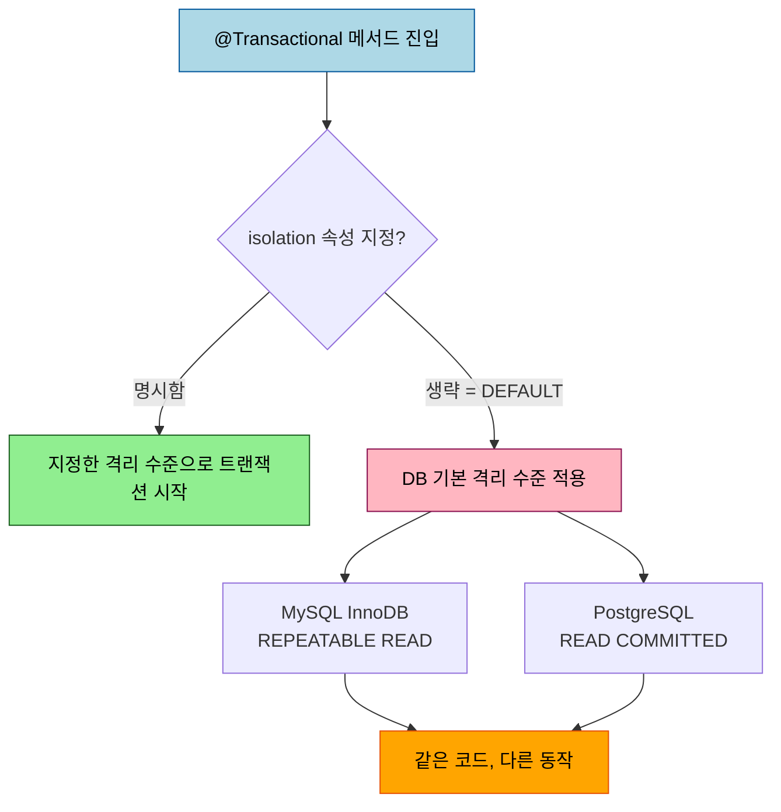
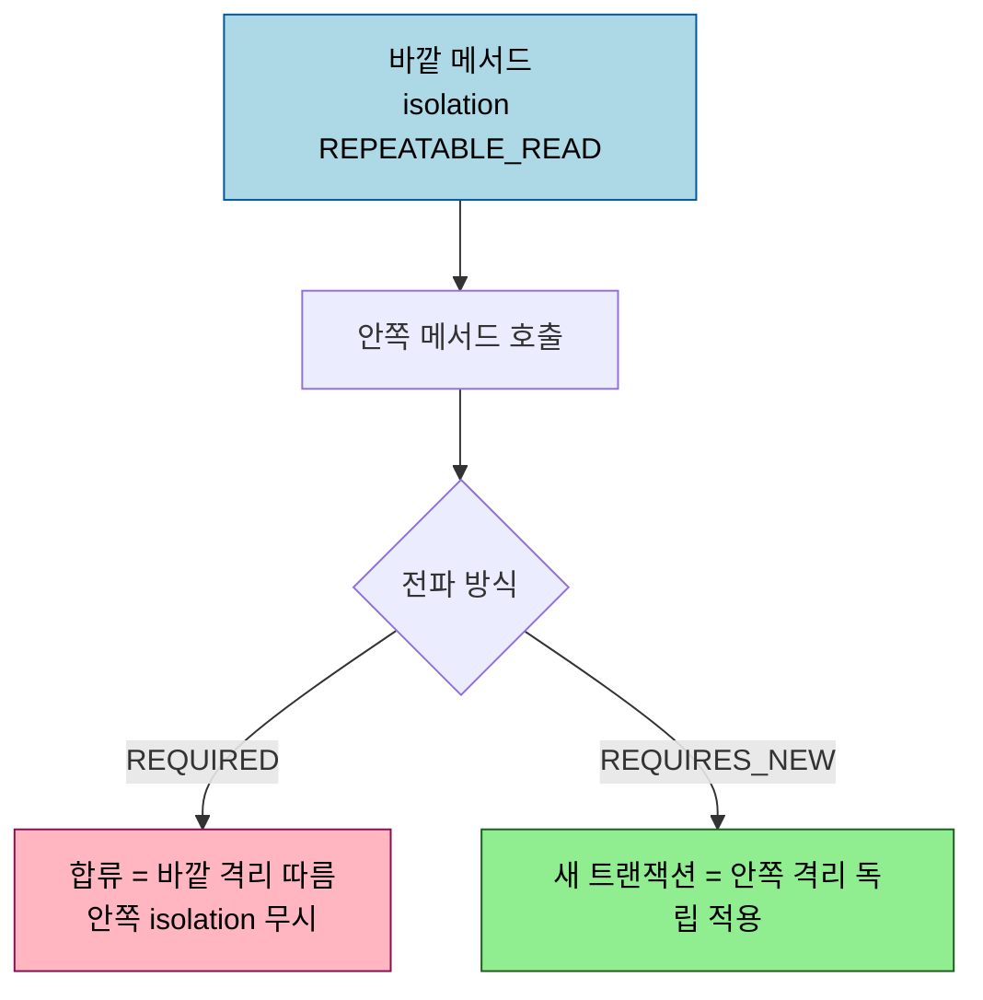

# 트랜잭션 격리 수준 — Spring 관점

---

> 이 문서를 읽고 나면 DB 격리 수준 네 단계가 막는 이상현상을 한 줄로 떠올리고(정의의 상세는 05_data 에 위임합니다), `@Transactional(isolation=...)` 이 Spring 에서 어떻게 적용되는지, 기본값 `DEFAULT` 가 왜 "DB 에 맡긴다"는 뜻인지 설명할 수 있습니다.


## 1. 격리 수준 빠른 복습 — 상세는 05_data 에 위임

격리 수준이 무엇을 막는지의 정의, 그리고 Dirty Read·Non-Repeatable Read·Phantom Read 세 이상현상의 의미는 DB 이론 영역이라 본 문서에서 다시 적지 않습니다. 정본은 [`05_data/sql/04-02 동시성제어와 락`](../../05_data/sql/04-02.동시성제어와%20락.md) 과 [`05_data/theory/01-04 트랜잭션과 격리 수준`](../../05_data/theory/01-04.트랜잭션과%20격리%20수준.md) 에 있습니다.

한 줄 요약만 들고 시작합니다. 격리 수준이 높아질수록 막는 이상현상이 늘어나고, 그만큼 동시성은 떨어집니다. `READ_UNCOMMITTED` 가 가장 느슨하고 `SERIALIZABLE` 이 가장 엄격합니다. 본 문서의 관심은 "이 선택을 Spring 에서 어떻게 코드로 거는가" 입니다.

## 2. `@Transactional(isolation = ...)` — Isolation enum

Spring 에서 격리 수준은 `@Transactional` 의 `isolation` 속성으로 선언합니다. 값은 `org.springframework.transaction.annotation.Isolation` enum 으로, SQL 표준 네 수준에 `DEFAULT` 를 더한 다섯 가지입니다.

```java
import org.springframework.transaction.annotation.Isolation;
import org.springframework.transaction.annotation.Transactional;

@Transactional(isolation = Isolation.REPEATABLE_READ)
public Order placeOrder(OrderCommand command) {
    // 이 메서드가 도는 동안 같은 행을 다시 읽어도 값이 바뀌지 않습니다.
    ...
}
```

| Isolation 값 | 의미 |
|--------------|------|
| `DEFAULT` | 기본값. 사용하는 DB 의 기본 격리 수준을 그대로 따릅니다 |
| `READ_UNCOMMITTED` | 커밋되지 않은 변경도 읽습니다 |
| `READ_COMMITTED` | 커밋된 변경만 읽습니다 |
| `REPEATABLE_READ` | 트랜잭션 안에서 같은 행의 반복 읽기를 보장합니다 |
| `SERIALIZABLE` | 직렬 실행과 같은 결과를 보장합니다 |

`@Transactional` 의 기본 설정은 전파 `REQUIRED`, 격리 `ISOLATION_DEFAULT` 입니다. 즉 `isolation` 을 적지 않으면 Spring 은 격리 수준을 직접 정하지 않고 DB 에 위임합니다. Spring 공식 문서가 "default isolation level of `ISOLATION_DEFAULT`" 라고 못박는 부분이 이 지점입니다. 이 점이 다음 절의 함정으로 이어집니다.

## 3. `DEFAULT` 의 함정 — 같은 코드, 다른 DB, 다른 동작

`isolation` 을 생략하면 격리 수준이 코드가 아니라 DB 기본값으로 결정됩니다. 문제는 DB 마다 기본값이 다르다는 데 있습니다. MySQL(InnoDB) 의 기본은 `REPEATABLE READ`, PostgreSQL 의 기본은 `READ COMMITTED` 입니다. 그래서 `@Transactional` 만 붙인 똑같은 코드가 MySQL 에서는 반복 읽기를 보장하고 PostgreSQL 에서는 보장하지 않습니다.



운영 DB 와 로컬·테스트 DB 가 다른 종류라면 이 차이가 "로컬에서는 멀쩡한데 운영에서만 깨지는" 버그로 나타납니다. 격리 수준에 의존하는 로직이라면 `isolation` 을 명시해 DB 종류와 무관하게 같은 동작을 보장하는 편이 안전합니다.

## 4. JPA 1차 캐시가 격리를 가리는 함정

JPA 를 쓰면 격리 수준을 시험하다 헷갈리는 지점이 하나 더 있습니다. 같은 트랜잭션 안에서 같은 엔티티를 `find` 로 두 번 조회하면, 두 번째 조회는 DB 로 나가지 않고 영속성 컨텍스트의 1차 캐시에서 같은 인스턴스를 돌려줍니다. 그래서 격리 수준이 `READ_COMMITTED` 라서 원래는 두 번째 읽기에서 값이 바뀌어야 하는 상황에도, JPA 사용자는 "반복 읽기가 되는 것처럼" 관찰하게 됩니다.

이것은 DB 격리 수준이 올라간 게 아니라 *조회가 DB 까지 가지 않은* 것입니다. 1차 캐시를 비우고(`em.clear()`) 다시 조회하거나 JPQL 로 강제 조회하면 격리 수준의 실제 동작이 드러납니다. 격리 수준을 검증하는 테스트를 짤 때 이 차이를 모르면 "격리가 되는 줄 알았는데 캐시였다" 는 잘못된 결론에 이릅니다. 락과 영속성 컨텍스트의 관계는 [`05_data/jpa/04-02 낙관적 비관적 락`](../../05_data/jpa/04-02.낙관적%20비관적%20락.md) 에서 더 다룹니다.

## 5. 전파와 격리의 상호작용

격리 수준은 트랜잭션 단위로 적용됩니다. 그래서 전파(Propagation)로 트랜잭션이 어떻게 묶이느냐가 격리에도 영향을 줍니다. `REQUIRED` 로 기존 트랜잭션에 합류하면 바깥 트랜잭션의 격리 수준을 따릅니다. 안쪽 메서드에 다른 `isolation` 을 적어도 새 물리 트랜잭션이 시작되지 않으므로 무시됩니다. 반면 `REQUIRES_NEW` 는 별도의 물리 트랜잭션을 열기 때문에 그 메서드에 건 격리 수준이 독립적으로 적용됩니다.



전파 자체의 규칙(REQUIRED·REQUIRES_NEW·NESTED, 물리 트랜잭션과 논리 트랜잭션)은 [`05_data/jpa/04-01 스프링 트랜잭션 §7`](../../05_data/jpa/04-01.스프링%20트랜잭션.md) 에 정리돼 있으니, 여기서는 "격리는 물리 트랜잭션 단위" 라는 결론만 들고 갑니다.

## 6. 면접 대비 체크리스트

> 이 문서를 다 읽은 뒤 다음 질문에 답할 수 있어야 합니다.

1. `@Transactional` 에 `isolation` 을 적지 않으면 격리 수준은 무엇이 결정합니까? 그 기본값의 이름과 의미를 말할 수 있습니까?
2. 같은 `@Transactional` 코드가 MySQL 과 PostgreSQL 에서 다르게 동작할 수 있는 이유는 무엇입니까?
3. JPA 에서 같은 행을 두 번 조회했을 때 값이 안 바뀌는 것이 항상 격리 수준 때문이라고 말할 수 없는 이유는 무엇입니까?
