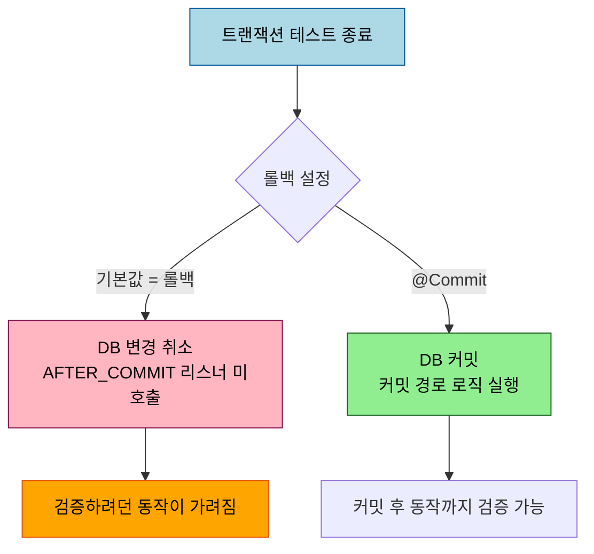
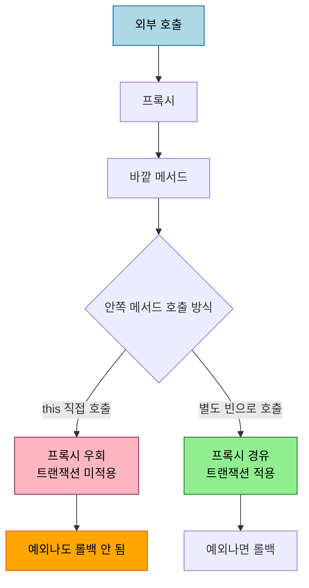

# @Transactional 테스트 가드

---

> 이 문서를 읽고 나면 테스트에 붙은 `@Transactional` 의 자동 롤백 동작과 그 함정을 설명하고, 프로덕션 트랜잭션 경계 — 자기호출과 전파 — 를 테스트로 어떻게 노출시키는지 답할 수 있습니다.


## 1. 테스트의 `@Transactional` 은 자동 롤백입니다

같은 `@Transactional` 이라도 테스트에 붙으면 의미가 달라집니다. 프로덕션 코드의 `@Transactional` 은 정상 종료 시 커밋합니다. 그러나 Spring TestContext 프레임워크에서 트랜잭션 테스트는 *기본적으로 테스트가 끝나면 롤백* 합니다. Spring 공식 문서는 "test transactions are automatically rolled back after the completion of a test" 라고 명시합니다. 테스트가 DB 를 더럽히지 않고 서로 격리되도록 하는 장치입니다.

```java
@SpringBootTest
@Transactional
class OrderServiceTest {

    @Autowired OrderService orderService;
    @Autowired OrderRepository orderRepository;

    @Test
    void 주문을_저장하면_조회된다() {
        // Given — 주문 커맨드
        OrderCommand command = new OrderCommand("coffee", 2);

        // When — 주문 저장
        Order saved = orderService.placeOrder(command);

        // Then — 같은 트랜잭션 안에서 조회 가능 (테스트 종료 시 롤백)
        assertThat(orderRepository.findById(saved.getId())).isPresent();
    }
}
```

`@DataJpaTest` 도 같은 원리로 동작합니다. JPA 슬라이스 테스트는 메서드마다 트랜잭션을 열고 끝에서 롤백하므로, 테스트가 남긴 데이터가 다음 테스트로 새지 않습니다.

## 2. 자동 롤백의 함정 — 커밋 경로가 안 탑니다

자동 롤백은 편하지만, *커밋이 일어나야만 도는 로직* 을 테스트에서 못 보게 만드는 함정이 있습니다. 대표적으로 `@TransactionalEventListener(phase = AFTER_COMMIT)` 으로 등록한 이벤트 리스너는 커밋이 일어나야 호출됩니다. 테스트가 롤백으로 끝나면 그 리스너는 영영 호출되지 않아, 정작 검증하려던 동작이 조용히 건너뛰어집니다. DB 의 지연 제약(deferred constraint)이나 트리거도 커밋 시점에 평가되므로 마찬가지로 가려집니다.

이럴 때는 자동 롤백을 끕니다. `@Commit` 을 붙이면 테스트가 끝나도 트랜잭션을 커밋합니다. Spring 공식 문서는 `@Commit` 이 `@Rollback(false)` 의 의미를 더 분명히 드러내는 대체재라고 설명합니다.



다만 `@Commit` 을 쓰면 테스트가 DB 에 흔적을 남기므로, 정리(`@Sql` 스크립트나 수동 삭제)를 같이 설계해야 합니다. 무심코 클래스 전체에 `@Commit` 을 걸면 테스트 격리가 깨집니다.

## 3. 자기호출 함정을 테스트로 잡기

`@Transactional` 의 기본 동작 모드는 프록시입니다. Spring 공식 문서는 "Local calls within the same class cannot get intercepted that way" 라고 못박습니다. 즉 같은 클래스 안에서 메서드가 자기 자신의 다른 `@Transactional` 메서드를 직접 호출하면 프록시를 거치지 않아 트랜잭션이 걸리지 않습니다. 이 함정의 원리는 [`05_data/jpa/04-01 §3-1`](../../05_data/jpa/04-01.스프링%20트랜잭션.md) 에 정리돼 있고, 여기서는 그 함정을 *테스트로 드러내는* 방법만 봅니다.

핵심은 자기호출 경로가 의도한 롤백을 못 한다는 사실을 단언으로 고정하는 것입니다. 자기호출로 부른 안쪽 메서드가 예외를 던져도, 트랜잭션이 안 걸렸으니 바깥에서 이미 저장한 데이터가 롤백되지 않고 남습니다.



```java
@Test
void 자기호출은_트랜잭션이_걸리지_않아_롤백되지_않는다() {
    // Given — 내부에서 self-invocation 으로 저장+예외를 일으키는 시나리오
    SignupCommand command = new SignupCommand("user-1");

    // When — 자기호출 경로 실행 (안쪽 @Transactional 이 프록시를 못 탐)
    assertThatThrownBy(() -> memberService.signupViaSelfInvocation(command))
            .isInstanceOf(IllegalStateException.class);

    // Then — 롤백이 안 되어 데이터가 남아 있음 (함정을 고정하는 단언)
    assertThat(memberRepository.findByName("user-1")).isPresent();
}
```

이 테스트가 통과한다는 것은 "자기호출은 트랜잭션이 안 걸린다" 는 함정이 코드에 그대로 살아 있다는 신호입니다. 함정을 고쳤다면(별도 빈으로 분리해 프록시를 타게 하면) 이 테스트는 빨개지고, 롤백을 기대하는 새 단언으로 바꿔야 합니다.

## 4. 전파 동작을 테스트로 검증

`REQUIRES_NEW` 가 부모 트랜잭션 롤백과 무관하게 살아남는지 같은 전파 동작은 단언으로 검증할 수 있습니다. 다만 테스트 메서드 자체에 `@Transactional` 이 걸려 있으면 테스트 트랜잭션과 대상 트랜잭션이 얽혀 결과가 흐려집니다. 전파를 검증할 때는 테스트 메서드에 `@Transactional` 을 걸지 않고, `TransactionTemplate` 으로 트랜잭션 경계를 코드에서 명시적으로 그어 주는 편이 깔끔합니다.

```java
@Test
void REQUIRES_NEW_는_부모_롤백에도_살아남는다() {
    // Given — 부모 트랜잭션 안에서 REQUIRES_NEW 로그를 남기고 부모만 롤백
    LogCommand command = new LogCommand("audit-1");

    // When — 부모 트랜잭션이 롤백되도록 실행
    assertThatThrownBy(() -> auditService.logThenFailParent(command))
            .isInstanceOf(RuntimeException.class);

    // Then — REQUIRES_NEW 로 분리된 로그는 커밋되어 남아 있음
    assertThat(auditLogRepository.findByKey("audit-1")).isPresent();
}
```

이벤트 발행이나 외부 호출을 함께 검증할 때는, 그 일이 *일어났다는 사실* 만 확인합니다. 발행된 이벤트의 필드값까지 이 테스트에서 단언하면 이벤트 형상이 바뀔 때 무관한 테스트가 깨집니다. 발행은 `verify(publisher).publishEvent(any(OrderSavedEvent.class))` 처럼 타입만 검증하고, 필드값 검증은 그 이벤트 객체의 단위 테스트로 분리합니다.

## 5. 면접 대비 체크리스트

> 이 문서를 다 읽은 뒤 다음 질문에 답할 수 있어야 합니다.

1. 테스트에 붙은 `@Transactional` 과 프로덕션의 `@Transactional` 은 정상 종료 시 동작이 어떻게 다릅니까?
2. 자동 롤백 때문에 검증이 가려지는 대표적인 경우는 무엇이고, 어떻게 끕니까?
3. 자기호출 함정을 테스트로 노출시킬 때, 통과하는 테스트는 무엇을 의미합니까? 함정을 고치면 그 테스트는 어떻게 됩니까?
