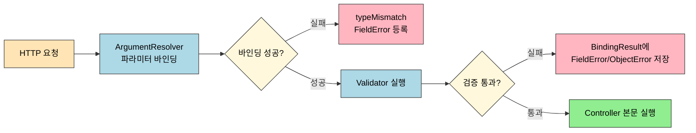

# 수동 검증과 BindingResult

---

> 데이터 바인딩이 끝난 직후, 요청이 비즈니스 규칙을 만족하는지 확인하는 단계가 검증입니다. 가장 원초적인 형태인 수동 검증과 `BindingResult` 부터 봅니다. 컨트롤러가 직접 `if` 로 검사해 오류를 쌓고, 그 분기가 길어지면 `Validator` 로 분리하는 흐름입니다. 선언적 Bean Validation 은 다음 편([`01-02.Bean Validation과 그룹 검증`](01-02.Bean%20Validation과%20그룹%20검증.md))에서 다룹니다.

## 진입 — 바인딩 다음 단계

> 바인딩 본체([`../02_data-binding/01-01.HTTP 요청·응답과 메시지 컨버터`](../02_data-binding/01-01.HTTP%20요청·응답과%20메시지%20컨버터.md))에서 `HttpMessageConverter` 가 본문을 객체로 바꾸고 `ArgumentResolver` 가 파라미터를 채우는 단계까지 추적했습니다. 검증은 그 바로 다음 단계에서, *바인딩에 성공한 필드* 만을 대상으로 실행됩니다.

스프링 부트는 데이터 검증을 위해 여러 접근 방식을 제공합니다. 검증 처리는 데이터의 유효성을 확인하고 타입 불일치 같은 입력 오류를 사용자에게 알려주는 데 쓰입니다. 검증이 다루는 요청은 크게 두 가지 타입입니다. `@ModelAttribute`가 받는 폼 데이터와 `@RequestBody`가 받는 JSON 본문입니다. 두 요청 모두 `@Valid`나 `@Validated` 어노테이션으로 처리할 수 있지만 실패 시 처리 방식에 차이가 있습니다.

- `@ModelAttribute`는 `BindingResult`를 사용하여 메서드 안에서 바로 오류를 처리할 수 있습니다.
- `@RequestBody`는 검증 실패 시 `MethodArgumentNotValidException` 예외를 발생시켜 별도의 예외 처리기에서 관리합니다.



## 1. 한 줄 정의

> 검증은 *타입이 맞춰진 객체*가 *도메인이 요구하는 제약*까지 만족하는지를 확인하는 단계입니다. 바인딩이 "값이 들어왔는가"를 묻는다면, 검증은 "이 값이 비즈니스 규칙에 맞는가"를 묻습니다.

바인딩 단계에서 이미 타입 불일치(예: 가격 필드에 문자 입력)는 걸러집니다. 그렇기에 검증 단계가 보는 입력은 이미 *타입은 맞는* 상태입니다. 검증이 추가로 확인하는 것은 "이 값이 0보다 큰가", "이 문자열이 비어 있지 않은가", "두 필드의 곱이 임계값 이상인가" 같은 *도메인 규칙*입니다. 두 단계를 섞어 쓰면 "왜 검증 메서드에 도달하지 않는가"를 추적할 때 길을 잃기 쉽습니다.

## 2. 검증 두 갈래 — 수동 검증 vs Bean Validation

> 컨트롤러가 직접 `if`로 검사하고 `BindingResult`에 오류를 쌓는 방식이 첫 번째 갈래입니다. 두 번째 갈래는 DTO에 어노테이션을 붙여 두고 스프링이 자동으로 검증을 수행하게 맡기는 방식입니다.

| 갈래 | 검증 위치 | 추가 의존성 | 장점 | 단점 |
|------|----------|------------|------|------|
| 수동 검증 (`BindingResult`) | 컨트롤러 본문 | 없음 | 분기·복합 조건을 표현하기 쉬움 | 컨트롤러 비대화, 중복 |
| Bean Validation (`@Validated`) | DTO 필드 어노테이션 | `spring-boot-starter-validation` | 선언적·재사용 가능 | 필드 조합·분기 규칙 표현이 제한적 |

두 방식은 배타적이지 않습니다. 단일 필드 제약은 Bean Validation으로 선언하고, 두 필드 조합 같은 복합 규칙은 컨트롤러나 별도 `Validator`에서 `BindingResult`에 직접 쌓는 혼용이 흔합니다. 본 편은 첫 번째 갈래(수동 검증)를, 두 번째 갈래는 [`01-02.Bean Validation과 그룹 검증`](01-02.Bean%20Validation과%20그룹%20검증.md) 에서 이어 봅니다.

## 3. BindingResult — 컨트롤러에서 직접 받기

> `BindingResult`는 스프링이 제공하는 검증 오류 보관 객체입니다. 컨트롤러 메서드 시그니처에 *바인딩 대상 바로 다음* 파라미터로 선언하면, 그 객체에 대한 오류를 모아 받습니다.

```java
@PostMapping("/add")
public String addItemV1(@ModelAttribute Item item, BindingResult bindingResult) {
    if (!StringUtils.hasText(item.getItemName())) {
        bindingResult.addError(new FieldError("item", "itemName", "상품 이름은 필수입니다."));
    }

    if (item.getPrice() == null || item.getPrice() < 1000 || item.getPrice() > 1000000) {
        bindingResult.addError(new FieldError("item", "price", "가격은 1,000 ~ 1,000,000 까지 허용합니다."));
    }

    if (item.getQuantity() == null || item.getQuantity() >= 10000) {
        bindingResult.addError(new FieldError("item", "quantity", "수량은 최대 9,999 까지 허용합니다."));
    }

    if (item.getPrice() != null && item.getQuantity() != null) {
        int resultPrice = item.getPrice() * item.getQuantity();
        if (resultPrice < 10000) {
            bindingResult.addError(new ObjectError("item", "가격 * 수량의 합은 10,000원 이상이어야 합니다. 현재 값 = " + resultPrice));
        }
    }

    if (bindingResult.hasErrors()) {
        return "validation/v2/addForm";
    }

    // ...
}
```

`BindingResult`는 인터페이스이며 `Errors`를 상속합니다. `Errors`만 써도 동작하지만 `BindingResult`가 헬퍼 메서드가 많아 사용성이 더 좋습니다. 발생한 오류는 두 종류로 분류해 보관합니다.

- `FieldError`는 특정 필드에 대한 검증 실패 정보를 담습니다.
- `ObjectError`는 객체 레벨의 오류, 곧 단일 필드가 아닌 객체 전체에 대한 검증 실패를 담습니다.

JSP나 Thymeleaf 같은 뷰 템플릿을 쓰는 경우 이 오류 정보에 직접 접근할 수 있어 폼 화면 재출력 시 입력값과 에러를 함께 보여줄 수 있습니다.

### 3.1 rejectValue / reject — 메시지 코드 기반 등록

> `addError`로 메시지 문자열을 직접 넣는 대신, *오류 코드*를 넘기면 메시지 소스에서 실제 문장을 찾아 채우는 방식이 `rejectValue`와 `reject`입니다. 다국어와 메시지 일원화를 함께 챙길 때 쓰입니다.

```java
// FieldError → rejectValue()
if (!StringUtils.hasText(item.getItemName())) {
    bindingResult.rejectValue("itemName", "required");
}
if (item.getPrice() == null || item.getPrice() < 1000 || item.getPrice() > 1000000) {
    bindingResult.rejectValue("price", "range", new Object[]{1000, 1000000}, null);
}
if (item.getQuantity() == null || item.getQuantity() >= 9999) {
    bindingResult.rejectValue("quantity", "max", new Object[]{9999}, null);
}

// ObjectError → reject()
if (item.getPrice() != null && item.getQuantity() != null) {
    int resultPrice = item.getPrice() * item.getQuantity();
    if (resultPrice < 10000) {
        bindingResult.reject("totalPriceMin", new Object[]{10000, resultPrice}, null);
    }
}
```

두 메서드의 시그니처는 다음과 같습니다.

```java
void rejectValue(String field,           // 오류 발생 필드 이름
                 String errorCode,       // 오류 코드, 화면에서 메시지를 찾기 위한 키
                 Object[] errorArgs,     // 메시지 인자 값
                 String defaultMessage); // 메시지가 없는 경우 기본 메시지

void reject(String errorCode,            // 전역 오류 코드
            Object[] errorArgs,          // 메시지 인자 값
            String defaultMessage);      // 메시지가 없을 때 기본 메시지
```

### 3.2 MessageCodesResolver — 오류 코드 확장 규칙

> `MessageCodesResolver`와 그 구현체 `DefaultMessageCodesResolver`는 검증에서 *어떤 메시지 키를 어떤 순서로 찾을지*를 결정합니다. 같은 오류 코드라도 객체별·필드별·타입별로 코드를 확장해 우선순위대로 탐색하는 일을 맡습니다.

```properties
typeMismatch.item.name=상품 이름에는 문자열이어야 합니다.
typeMismatch.item.price=상품 가격에는 숫자를 입력해야 합니다.
```

```java
private final MessageCodesResolver messageCodesResolver = new DefaultMessageCodesResolver();

@PostMapping("/items")
public String addItem(@RequestBody Item item, BindingResult bindingResult) {
    // MessageCodesResolver로 메시지 코드 생성
    String[] errorCodes = messageCodesResolver.resolveMessageCodes("typeMismatch", "item.name");

    // 생성된 메시지 코드로 오류 메시지를 BindingResult에 추가
    bindingResult.rejectValue("name", errorCodes[0]);

    if (bindingResult.hasErrors()) {
        return "itemForm";
    }

    // 성공 시 다음 페이지로 리다이렉트
    return "redirect:/success";
}
```

`rejectValue`에 단일 코드만 넘겨도 내부에서 `MessageCodesResolver`가 호출되어 *세부 코드 → 일반 코드* 순으로 후보를 만들고 메시지를 탐색합니다. 메시지 키를 `errors.properties` 로 외부화하는 방법은 [`01-02.Bean Validation과 그룹 검증`](01-02.Bean%20Validation과%20그룹%20검증.md) 의 메시지 절에서 이어 봅니다.

## 4. Validator 분리 — 컨트롤러 비대화 막기

> 검증 분기가 길어지면 컨트롤러가 비대해집니다. 스프링 `Validator` 인터페이스를 구현해 검증 로직을 별도 클래스로 옮기고, `WebDataBinder`에 등록해 자동 실행시키는 패턴이 표준 해법입니다.

```java
public interface Validator {
    boolean supports(Class<?> clazz);
    void validate(Object target, Errors errors);
}
```

```java
@Component
public class ItemValidator implements Validator {

    @Override
    public boolean supports(Class<?> clazz) {
        return Item.class.isAssignableFrom(clazz); // 검증 대상임을 표시
    }

    @Override
    public void validate(Object target, Errors errors) {
        Item item = (Item) target;

        ValidationUtils.rejectIfEmptyOrWhitespace(errors, "itemName", "required");

        if (item.getPrice() == null || item.getPrice() < 1000 || item.getPrice() > 1000000) {
            errors.rejectValue("price", "range", new Object[]{1000, 1000000}, null);
        }

        if (item.getQuantity() == null || item.getQuantity() > 10000) {
            errors.rejectValue("quantity", "max", new Object[]{9999}, null);
        }

        if (item.getPrice() != null && item.getQuantity() != null) {
            int resultPrice = item.getPrice() * item.getQuantity();
            if (resultPrice < 10000) {
                errors.reject("totalPriceMin", new Object[]{10000, resultPrice}, null);
            }
        }
    }
}
```

`supports`는 이 검증기가 어떤 타입을 다룰 수 있는지를 알리고, `validate`는 실제 검증 본문입니다. 등록 방식은 두 가지입니다. 컨트롤러에서 직접 호출하거나, `WebDataBinder`에 등록해 자동 실행시키거나입니다.

```java
private final ItemValidator itemValidator;

@PostMapping("/add")
public String addItemV5(@ModelAttribute Item item, BindingResult bindingResult) {
    // 컨트롤러 직접 호출
    itemValidator.validate(item, bindingResult);

    if (bindingResult.hasErrors()) {
        return "validation/v2/addForm";
    }

    return "redirect:/validation/v2/items";
}
```

```java
private final ItemValidator itemValidator;

@InitBinder
public void init(WebDataBinder dataBinder) {
    dataBinder.addValidators(itemValidator);
}

// @Validated 어노테이션으로 자동 검증
@PostMapping("/add")
public String addItemV6(@Validated @ModelAttribute Item item, BindingResult bindingResult) {
    if (bindingResult.hasErrors()) {
        return "validation/v2/addForm";
    }

    return "redirect:/validation/v2/items";
}
```

위 코드에서 `@Validated` 대신 `@Valid`를 사용해도 정상 동작합니다. `@Valid`는 자바 표준 어노테이션이고, `@Validated`는 스프링 특화 어노테이션이라는 차이만 있습니다.

## 5. BindingResult vs ControllerAdvice — 어디서 오류를 처리할 것인가

> 스프링 부트에서 데이터 유효성을 검증할 때 `BindingResult`를 통해 직접 사용하는 방식과 `ControllerAdvice`를 활용하는 방식이 있습니다. 둘은 책임 위치가 다릅니다.

### BindingResult로 직접 처리

`BindingResult`는 컨트롤러 안에서 유효성 검사를 직접 제어합니다. 여러 필드에서 오류가 발생한 경우 각 필드별로 메시지를 사용자에게 자세히 보여줄 수 있습니다. 다만 컨트롤러 코드가 길어지고, 비슷한 분기가 여러 컨트롤러에 반복되기 쉽습니다.

### ControllerAdvice로 전역 처리

`@ControllerAdvice`(또는 `@RestControllerAdvice`)와 `@ExceptionHandler`를 조합하면 모든 예외 처리 로직을 중앙에서 관리해 응답 형식을 통일할 수 있습니다. 표준화된 응답을 제공할 수 있지만, 특정 엔드포인트만의 맞춤 응답을 제공하기는 까다롭습니다. `@RequestBody` 검증 실패 시 발생하는 `MethodArgumentNotValidException`을 여기서 잡아 일관된 4xx 응답으로 변환하는 패턴이 가장 흔합니다.

## 6. 면접 대비 요약

- **검증은 바인딩 다음 단계이다**라고 한 문장으로 말할 수 있어야 합니다. 바인딩 단계에서 타입이 맞춰진 뒤, 검증 단계가 도메인 규칙을 본다는 흐름이 핵심입니다.
- **`BindingResult`는 반드시 검증 대상 파라미터 바로 다음에 와야 합니다.** 위치를 어기면 스프링이 어느 객체의 오류를 모을지 알 수 없어 예외가 던져집니다.
- **`rejectValue`/`reject`에 오류 코드를 넘기면** 내부에서 `MessageCodesResolver`가 세부 코드에서 일반 코드 순으로 후보를 만들어 메시지를 찾습니다.
- **단일 필드 제약은 Bean Validation, 복합 규칙은 Validator나 컨트롤러 내 직접 검증**이라는 분업이 실무 합의입니다.

## 7. 다음에 읽을 것

- [`01-02.Bean Validation과 그룹 검증`](01-02.Bean%20Validation과%20그룹%20검증.md) — 선언적 표준 어노테이션, 그룹 검증, `@RequestBody` 통합, 메시지 외부화.
- [`../02_data-binding/01-01.HTTP 요청·응답과 메시지 컨버터`](../02_data-binding/01-01.HTTP%20요청·응답과%20메시지%20컨버터.md) — 검증의 전 단계인 바인딩과 메시지 변환.
- [`../01_core/03-01.Spring MVC — FrontController에서 DispatcherServlet까지`](../01_core/03-01.Spring%20MVC%20—%20FrontController에서%20DispatcherServlet까지.md) — 검증이 일어나는 위치(HandlerAdapter 내부)의 전체 그림.
