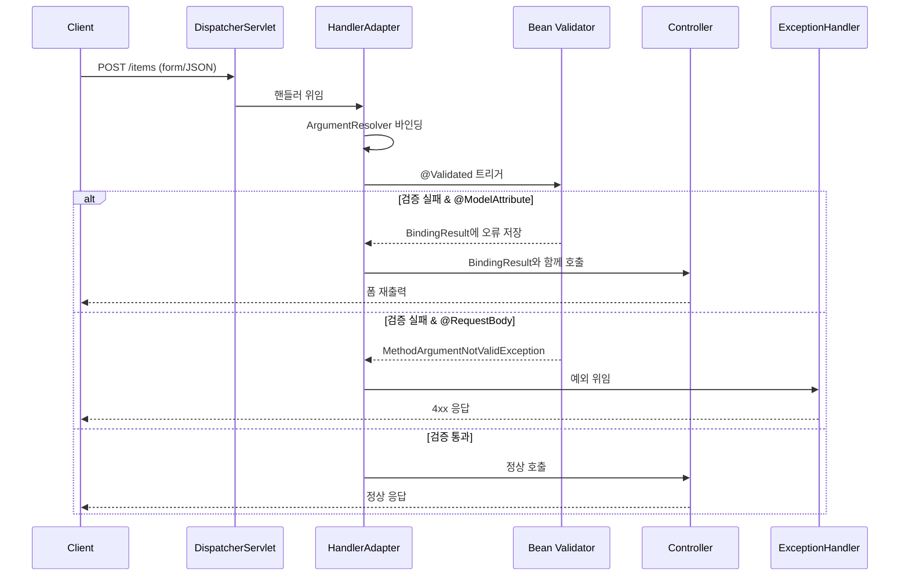

# Bean Validation과 그룹 검증

---

> 앞 편([`01-01.수동 검증과 BindingResult`](01-01.수동%20검증과%20BindingResult.md))의 수동 검증은 분기를 표현하기 좋지만 컨트롤러가 비대해집니다. 같은 검증을 DTO 필드에 어노테이션으로 선언해 두고 스프링이 자동으로 수행하게 맡기는 방식이 Bean Validation 입니다. 표준 제약 어노테이션부터 그룹 검증, `@RequestBody` 통합, 메시지 외부화까지 이어 봅니다.

## 1. Bean Validation — 표준 어노테이션

> Bean Validation은 특정 구현체가 아니라 Bean Validation 2.0(JSR-380)을 기반으로 한 기술 표준입니다. 이 표준은 다양한 어노테이션과 인터페이스로 구성되어 있습니다.

```groovy
implementation 'org.springframework.boot:spring-boot-starter-validation'
```

검증의 구현체로는 Hibernate Validator가 널리 쓰입니다. 이름에 Hibernate가 들어가지만 ORM과는 직접적인 연관이 없으며 Bean Validation 여러 구현체 중 하나로 보면 됩니다.

자주 쓰이는 제약 어노테이션은 다음과 같습니다.

```java
@NotNull    // 필드 값이 null이 아니어야 합니다.
@NotEmpty   // 필드 값이 null이 아니며, 빈 문자열("")이 아니어야 합니다.
@NotBlank   // 필드 값이 null이 아니며, 공백을 포함한 빈 문자열이 아니어야 합니다.
@AssertTrue // 필드 값이 true여야 합니다.
@Size       // 문자열, 컬렉션, 맵, 배열의 크기가 지정된 범위 안에 있어야 합니다.
@Min, @Max  // 숫자가 지정된 최소값 이상, 최대값 이하이어야 합니다.
@Pattern    // 문자열이 정규 표현식과 일치해야 합니다.
```

스프링은 다음 순서로 입력 데이터의 처리와 검증을 진행합니다.

1. **데이터 바인딩과 타입 변환** — `@ModelAttribute` 사용 시 각 필드에 대해 타입 변환을 시도합니다. 변환에 성공하면 다음 단계인 Validator가 적용되고, 변환에 실패하면 타입 불일치로 `FieldError`가 생성되어 `typeMismatch` 오류로 분류됩니다.
2. **Bean Validation 적용** — 바인딩에 성공한 필드만 검증 대상이 됩니다. 검증 과정에서 오류가 발견되면 `FieldError` 또는 `ObjectError`가 `BindingResult` 객체에 저장됩니다.

```java
@Data
public class Item {
    private Long id;

    @NotBlank
    private String itemName;

    @NotNull
    @Range(min = 1000, max = 1000000)
    private Integer price;

    @NotNull
    @Max(9999)
    private Integer quantity;

    public Item() {}
    public Item(String itemName, Integer price, Integer quantity) {
        this.itemName = itemName;
        this.price = price;
        this.quantity = quantity;
    }
}
```

다음은 스프링 컨테이너 없이 표준 API만으로 검증기를 실행해 보는 예입니다. 단위 테스트로 검증 어노테이션의 동작을 빠르게 확인할 때 유용합니다.

```java
public class BeanValidationTest {
    @Test
    void beanValidation() {
        // ValidatorFactory를 생성합니다. Bean Validation 기본 구현을 제공합니다.
        ValidatorFactory factory = Validation.buildDefaultValidatorFactory();

        // Validator 인스턴스를 가져옵니다. 데이터 모델 검증에 사용합니다.
        Validator validator = factory.getValidator();

        // 검증할 Item 객체를 생성합니다. 공백 이름, 0 가격, 10000 수량.
        Item item = new Item(" ", 0, 10000);

        // 검증을 수행하고 위반된 제약 조건들의 집합을 반환받습니다.
        Set<ConstraintViolation<Item>> violations = validator.validate(item);

        for (ConstraintViolation<Item> violation : violations) {
            System.out.println("violation=" + violation);
            System.out.println("violation.message=" + violation.getMessage());
        }
    }
}
```

```java
@PostMapping("/items/new")
public String addItem(@ModelAttribute @Valid Item item, BindingResult bindingResult) {
    if (bindingResult.hasErrors()) {
        return "itemForm"; // 오류가 있으면 폼 페이지로 반환
    }
    // 비즈니스 로직 실행
    return "redirect:/items";
}
```



## 2. 그룹 검증 — 등록과 수정의 규칙이 다를 때

> `Bean Validation`으로 데이터 검증을 효율적으로 할 수 있지만, 하나의 DTO로 등록과 수정에서 다른 검증 요구사항이 발생할 수 있습니다. 이 경우 `groups` 기능으로 어노테이션이 적용될 상황을 구분합니다.

예컨대 Item 도메인에서 등록과 수정의 요구사항이 다음과 같이 갈릴 수 있습니다.

- **등록**: id 값 필수 아님, 수량 9999 제한
- **수정**: id 값 필수, 수량 제한 없음

`Bean Validation`은 이 문제를 해결하기 위해 `groups`를 제공합니다. 다만 실제로 등록과 수정에서 동일한 DTO를 그대로 쓰는 경우가 드물어, 일반적으로는 폼 객체 자체를 분리하는 방식이 더 자주 쓰입니다.

```java
// 등록 그룹
public interface SaveCheck {}

// 수정 그룹
public interface UpdateCheck {}
```

```java
@Data
public class Item {
    @NotNull(groups = UpdateCheck.class)  // 수정 시에만 적용
    private Long id;

    @NotBlank(groups = {SaveCheck.class, UpdateCheck.class})
    private String itemName;

    @NotNull(groups = {SaveCheck.class, UpdateCheck.class})
    @Range(min = 1000, max = 1000000, groups = {SaveCheck.class, UpdateCheck.class})
    private Integer price;

    @NotNull(groups = {SaveCheck.class, UpdateCheck.class})
    @Max(value = 9999, groups = SaveCheck.class)  // 등록 시에만 적용
    private Integer quantity;
}
```

```java
// 등록 그룹
@PostMapping("/add")
public String addItemV2(@Validated(SaveCheck.class)
                        @ModelAttribute Item item,
                        BindingResult bindingResult, RedirectAttributes redirectAttributes) {}

// 수정 그룹
@PostMapping("/{itemId}/edit")
public String editV2(@PathVariable Long itemId,
                     @Validated(UpdateCheck.class)
                     @ModelAttribute Item item,
                     BindingResult bindingResult) {}
```

그룹 기능을 쓰려면 `@Valid` 가 아니라 `@Validated` 가 필요합니다. `@Valid` 는 자바 표준 어노테이션이라 `groups` 속성을 받지 못하고, 그룹 지정은 스프링 특화 어노테이션인 `@Validated` 만 지원합니다.

### 2.1 Form 전송 객체 분리 — 실무 권장 패턴

> 그룹 검증으로 한 DTO를 재사용하는 대신, 등록용·수정용 폼 객체를 따로 두는 편이 가독성과 유지보수성이 더 좋다는 합의가 있습니다. DTO마다 의도가 명시되어 어노테이션 조합이 단순해지기 때문입니다.

```java
@Data
public class ItemSaveForm {
    @NotBlank
    private String itemName;

    @NotNull
    @Range(min = 1000, max = 1000000)
    private Integer price;

    @NotNull
    @Max(value = 9999)
    private Integer quantity;
}
```

```java
@Data
public class ItemUpdateForm {
    @NotNull
    private Long id;

    @NotBlank
    private String itemName;

    @NotNull
    @Range(min = 1000, max = 1000000)
    private Integer price;

    // 수정에서는 수량 제한 없음
    private Integer quantity;
}
```

## 3. HTTP 메시지 컨버터와의 통합 — @RequestBody

> Bean Validation은 HTTP 메시지 컨버터와 통합되어 JSON 같은 HTTP Body 데이터를 처리할 때도 유효성 검증을 자동으로 적용합니다. 다만 *바인딩 실패가 검증보다 먼저 일어난다*는 점이 `@ModelAttribute`와 가장 다른 지점입니다.

`@Valid`, `@Validated`, `@RequestBody`를 함께 사용하는 컨트롤러 예입니다.

```java
@RestController
public class MemberController {

    @PostMapping("/member")
    public ResponseEntity<?> createMember(@Valid @RequestBody MemberDto memberDto, BindingResult result) {
        if (result.hasErrors()) {
            FieldError error = result.getFieldError();
            ErrorResponse errorResponse = new ErrorResponse(error.getDefaultMessage());
            return new ResponseEntity<>(errorResponse, HttpStatus.BAD_REQUEST);
        }

        SuccessResponse successResponse = new SuccessResponse("Member created successfully");
        return new ResponseEntity<>(successResponse, HttpStatus.CREATED);
    }
}
```

요청 본문 형태별 동작은 다음과 같이 갈립니다.

- **성공 요청**: 예) `{"itemName":"hello", "price":1000, "quantity": 10}` — 성공적으로 데이터가 바인딩되고 검증이 통과됩니다.
- **타입 불일치 실패**: 예) `{"itemName":"hello", "price":"A", "quantity": 10}` — `HttpMessageNotReadableException`이 발생하며 `HttpMessageConverter` 단계에서 실패하므로 검증 로직이 실행되지 않습니다.
- **검증 오류 요청**: 예) `{"itemName":"hello", "price":1000, "quantity": 10000}` — quantity의 최대 허용 범위를 넘어 `MethodArgumentNotValidException`이 발생합니다.

### 3.1 @ModelAttribute vs @RequestBody

| 구분 | `@ModelAttribute` | `@RequestBody` |
|------|------------------|---------------|
| 주 용도 | URL 쿼리 스트링, POST 폼 데이터 객체 바인딩 | HTTP body로 객체 생성 |
| 바인딩 단위 | 필드 단위 (필드별 독립) | 본문 전체 (한 번에) |
| 타입 불일치 시 | 다른 필드는 정상 처리되고 해당 필드만 `typeMismatch` | 컨트롤러 메서드 자체가 호출되지 않아 검증 절차도 진행되지 않음 |

`@ModelAttribute`는 필드 단위로 데이터가 바인딩되어 특정 필드에서 타입 불일치가 발생해도 나머지는 정상 처리됩니다. 반면 `@RequestBody`는 데이터 변환에 실패하면 컨트롤러 메서드 자체가 호출되지 않기 때문에 검증 절차 또한 진행되지 않습니다.

## 4. 오류 메시지 — MessageSource와 errors.properties

> `MessageSource`는 스프링 프레임워크의 국제화 기능을 지원하는 인터페이스이며, 이를 통해 에러 메시지를 외부에서 관리할 수 있습니다. 코드와 메시지 문자열을 분리하면 다국어 대응과 메시지 일괄 수정이 쉬워집니다.

```yaml
spring:
  messages:
    basename: messages,errors
```

위 설정으로 `errors.properties`, `errors_[언어].properties` 파일들을 사용할 수 있습니다.

```properties
required.item.itemName=상품 이름은 필수입니다.
range.item.price=가격은 {0} ~ {1} 까지 허용합니다.
max.item.quantity=수량은 최대 {0} 까지 허용합니다.
totalPriceMin=가격 * 수량의 합은 {0}원 이상이어야 합니다. 현재 값 = {1}
```

```java
public class MessageService {

    @Autowired
    private MessageSource messageSource;

    public String getRequiredItemNameMessage(Locale locale) {
        return messageSource.getMessage("required.item.itemName", null, locale);
    }

    public String getRangeItemPriceMessage(int min, int max, Locale locale) {
        Object[] args = {min, max};
        return messageSource.getMessage("range.item.price", args, locale);
    }

    public String getMaxItemQuantityMessage(int max, Locale locale) {
        Object[] args = {max};
        return messageSource.getMessage("max.item.quantity", args, locale);
    }

    public String getTotalPriceMinMessage(int min, int current, Locale locale) {
        Object[] args = {min, current};
        return messageSource.getMessage("totalPriceMin", args, locale);
    }
}
```

`MessageSource` 자동 구성과 Locale 폴백 체인, `LocaleResolver` 의 동작은 검증만의 주제가 아니라 응답 메시지 전반의 언어 결정 문제입니다. 그 상세는 [`../02_data-binding/03-01.메시지·국제화 — MessageSource와 LocaleResolver`](../02_data-binding/03-01.메시지·국제화%20—%20MessageSource와%20LocaleResolver.md) 에 두고, 여기서는 검증 메시지를 외부화하는 연결점만 봅니다.

## 5. 면접 대비 요약

- **`@Valid`와 `@Validated`의 차이**는 표준(Jakarta) vs 스프링 특화로 정리합니다. 그룹 기능을 쓰려면 `@Validated`가 필요합니다.
- **`@ModelAttribute`와 `@RequestBody`의 검증 실패 처리가 다른 이유**는 바인딩 단위가 다르기 때문입니다. 폼은 필드 단위라 일부 실패가 다른 필드의 검증을 막지 않지만, JSON 본문은 전체 변환이 한 번에 일어나 실패하면 컨트롤러에 도달하지 않습니다.
- **그룹 검증과 폼 객체 분리** 중 실무는 후자를 더 선호합니다. DTO마다 의도가 명시되어 어노테이션 조합이 단순해지기 때문입니다.
- **검증 메시지 외부화**는 `errors.properties` 와 `MessageSource` 로 코드와 문장을 분리해 다국어·일괄 수정을 쉽게 만듭니다.

## 6. 다음에 읽을 것

- [`02-01.커스텀 ConstraintValidator`](02-01.커스텀%20ConstraintValidator.md) — 표준 어노테이션으로 안 되는 검증을 직접 만드는 방법.
- [`01-01.수동 검증과 BindingResult`](01-01.수동%20검증과%20BindingResult.md) — 선언적 검증의 전 단계인 수동 검증.
- [`../02_data-binding/03-01.메시지·국제화 — MessageSource와 LocaleResolver`](../02_data-binding/03-01.메시지·국제화%20—%20MessageSource와%20LocaleResolver.md) — 검증 메시지의 언어를 결정하는 국제화.
