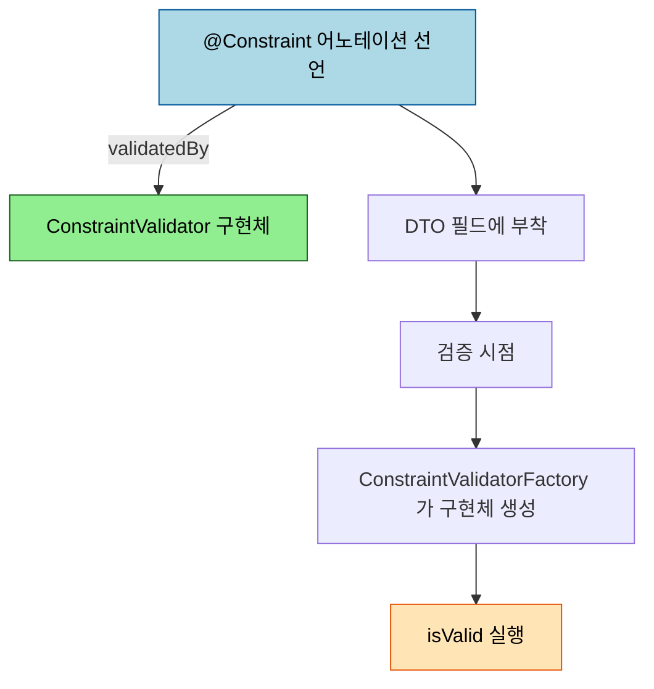
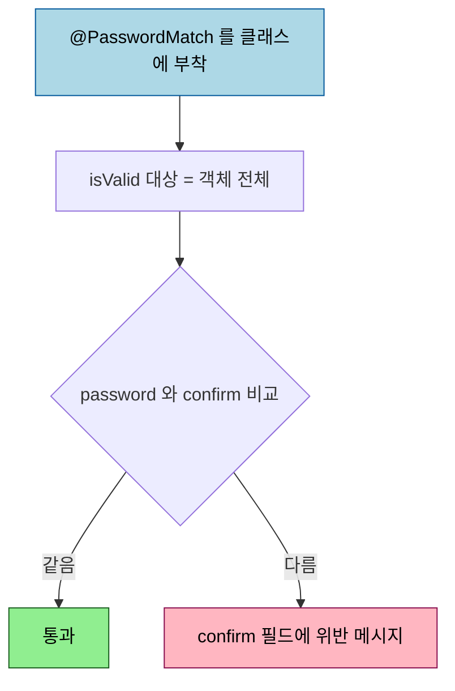

# 커스텀 ConstraintValidator

---

> 표준 제약 어노테이션(`@NotBlank`·`@Size`·`@Pattern` 등)으로 표현되지 않는 검증은 직접 만들 수 있습니다. `@Constraint` 메타 어노테이션으로 제약을 선언하고 `ConstraintValidator` 로 동작을 구현하면, 도메인 규칙을 표준 제약과 같은 선언적 문법으로 쓸 수 있습니다.


## 0. 학습 목표

이 문서를 읽고 나면 표준 제약으로 안 되는 검증을 `@Constraint` 와 `ConstraintValidator` 로 직접 만들고, `isValid` 안에서 `ConstraintValidatorContext` 로 메시지를 커스터마이즈하며, 두 필드를 함께 보는 클래스 레벨 제약을 작성할 수 있습니다.

## 1. 언제 커스텀이 필요한가

표준 어노테이션은 단일 필드의 형식·범위·존재를 검사하는 데 강합니다. 그러나 도메인 규칙은 종종 그 틀을 벗어납니다. "사업자등록번호 체크섬이 맞는가", "비밀번호와 비밀번호 확인이 같은가", "할인 시작일이 종료일보다 앞서는가" 같은 규칙은 표준 어노테이션 조합으로 표현하기 어렵습니다. 앞 편([`01-02.Bean Validation과 그룹 검증`](01-02.Bean%20Validation과%20그룹%20검증.md))의 `@Range`·`@Max` 가 단일 값만 보는 것과 대비됩니다.

이럴 때 선택지는 둘입니다. [`01-01`](01-01.수동%20검증과%20BindingResult.md) 의 수동 검증·`Validator` 로 컨트롤러나 별도 클래스에서 검사하거나, 아니면 제약을 어노테이션으로 만들어 DTO 필드에 선언적으로 붙이거나입니다. 후자가 커스텀 `ConstraintValidator` 이고, 같은 규칙을 여러 DTO 에서 재사용할 때 값어치가 큽니다.

## 2. `@Constraint` 메타 어노테이션 선언

커스텀 제약은 두 조각으로 이뤄집니다. 제약을 *선언* 하는 어노테이션과, 그 제약의 *동작* 을 구현하는 `ConstraintValidator` 입니다. Spring 공식 문서의 표현으로는 "A `@Constraint` annotation declares the constraint and its configurable properties, while an implementation of the `jakarta.validation.ConstraintValidator` interface implements the constraint's behavior" 입니다. 어노테이션은 `@Constraint(validatedBy = ...)` 로 자신을 구현할 Validator 를 가리킵니다.



`@interface` 정의에는 제약이 붙을 수 있는 위치(`@Target`)와 유지 정책(`@Retention`), 그리고 Bean Validation 이 요구하는 세 속성 — `message`·`groups`·`payload` — 을 둡니다.

```java
@Target({ElementType.FIELD, ElementType.METHOD})
@Retention(RetentionPolicy.RUNTIME)
@Constraint(validatedBy = BusinessNumberValidator.class)
public @interface BusinessNumber {
    String message() default "유효하지 않은 사업자등록번호입니다.";
    Class<?>[] groups() default {};
    Class<? extends Payload>[] payload() default {};
}
```

`message` 는 검증 실패 시 기본 메시지이고, `groups` 는 앞 편의 그룹 검증과 연결됩니다. 세 속성은 표준이 요구하는 형식이라 생략하면 컴파일이 통과해도 런타임에 거부됩니다.

## 3. `ConstraintValidator` 구현 — initialize / isValid

동작은 `ConstraintValidator<A, T>` 를 구현해 채웁니다. `A` 는 제약 어노테이션 타입, `T` 는 검증 대상 타입입니다. `initialize` 는 어노테이션 속성을 읽어 초기 상태를 잡고(필요할 때만), `isValid` 가 실제 판정을 합니다.

```java
public class BusinessNumberValidator implements ConstraintValidator<BusinessNumber, String> {

    @Override
    public void initialize(BusinessNumber constraintAnnotation) {
        // 어노테이션 속성을 읽어 둘 것이 있으면 여기서 보관합니다.
    }

    @Override
    public boolean isValid(String value, ConstraintValidatorContext context) {
        if (value == null) {
            return true; // null 여부는 @NotNull 의 책임으로 넘깁니다.
        }
        return checksumMatches(value);
    }
}
```

`isValid` 가 `null` 을 통과시키는 관례에 주의합니다. "값이 있어야 한다" 는 `@NotNull` 의 책임이고, 커스텀 제약은 "값이 있다면 그 값이 규칙에 맞는가" 만 보는 편이 책임이 깔끔합니다. 이 구현체는 스프링 빈으로 만들어져 의존성 주입을 받을 수 있습니다. 공식 문서는 `LocalValidatorFactoryBean` 이 `SpringConstraintValidatorFactory` 를 구성해 "your custom `ConstraintValidators` benefit from dependency injection like any other Spring bean" 이라고 설명합니다. 그래서 외부 조회가 필요한 검증이면 Validator 안에 리포지토리를 `@Autowired` 로 받을 수 있습니다.

`ConstraintValidatorContext` 로는 기본 메시지를 끄고 필드별 메시지를 따로 붙일 수 있습니다.

```java
context.disableDefaultConstraintViolation();
context.buildConstraintViolationWithTemplate("체크섬이 일치하지 않습니다.")
       .addConstraintViolation();
```

## 4. 클래스 레벨 제약 — 두 필드 비교

단일 필드로는 표현할 수 없는 "두 필드의 관계" 는 어노테이션을 *클래스* 에 붙여 해결합니다. `@Target` 에 `TYPE` 을 더하고, `isValid` 의 대상 타입을 객체 전체로 잡으면 두 필드를 함께 볼 수 있습니다. 비밀번호 확인이 대표적입니다.



```java
@Target(ElementType.TYPE)
@Retention(RetentionPolicy.RUNTIME)
@Constraint(validatedBy = PasswordMatchValidator.class)
public @interface PasswordMatch {
    String message() default "비밀번호가 일치하지 않습니다.";
    Class<?>[] groups() default {};
    Class<? extends Payload>[] payload() default {};
}
```

```java
public class PasswordMatchValidator implements ConstraintValidator<PasswordMatch, SignupForm> {

    @Override
    public boolean isValid(SignupForm form, ConstraintValidatorContext context) {
        if (form.getPassword() == null || form.getConfirm() == null) {
            return true;
        }
        boolean matched = form.getPassword().equals(form.getConfirm());
        if (!matched) {
            context.disableDefaultConstraintViolation();
            context.buildConstraintViolationWithTemplate(context.getDefaultConstraintMessageTemplate())
                   .addPropertyNode("confirm")
                   .addConstraintViolation();
        }
        return matched;
    }
}
```

`addPropertyNode("confirm")` 으로 위반을 특정 필드에 귀속시키면, 객체 전체 오류가 아니라 `confirm` 필드 오류로 화면에 표시할 수 있습니다.

## 5. 그룹·메시지와의 결합

커스텀 제약도 표준 제약과 똑같이 `groups` 와 메시지 외부화에 참여합니다. 어노테이션의 `groups()` 속성이 [`01-02`](01-02.Bean%20Validation과%20그룹%20검증.md) 의 그룹 검증과 그대로 맞물려, 등록과 수정에서 다르게 적용할 수 있습니다. `message` 기본값 대신 `{businessNumber.invalid}` 처럼 메시지 키를 넣으면 `errors.properties` 의 문장을 끌어다 씁니다. 결국 커스텀 제약은 "표준 제약처럼 보이고 표준 제약처럼 동작하는" 자신만의 제약을 만드는 일입니다.

## 6. 면접 대비 체크리스트

> 이 문서를 다 읽은 뒤 다음 질문에 답할 수 있어야 합니다.

1. 커스텀 제약을 만들 때 `@Constraint` 어노테이션과 `ConstraintValidator` 구현체는 각각 무엇을 담당합니까?
2. `isValid` 가 `null` 을 보통 통과시키는 이유는 무엇입니까?
3. 두 필드를 비교하는 검증은 왜 필드가 아니라 클래스 레벨 제약으로 만듭니까?
