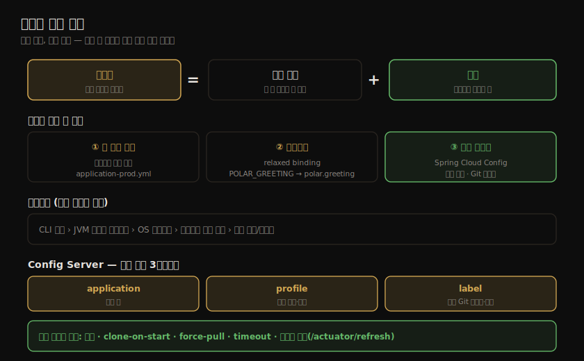
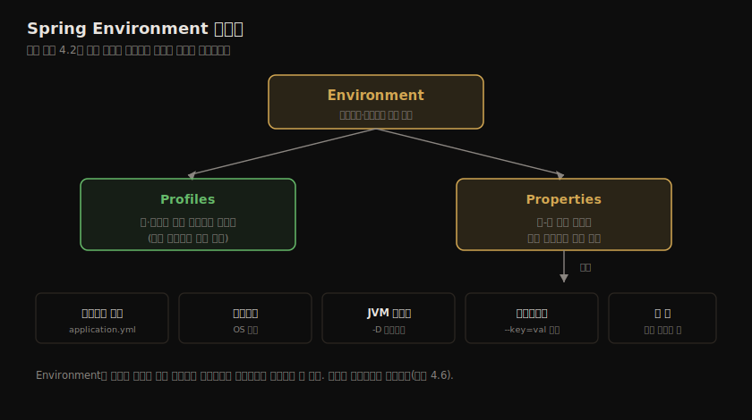
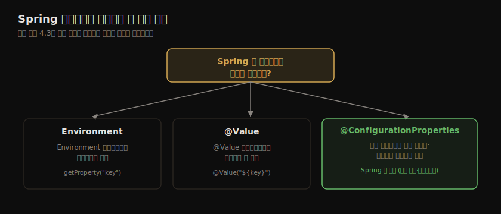
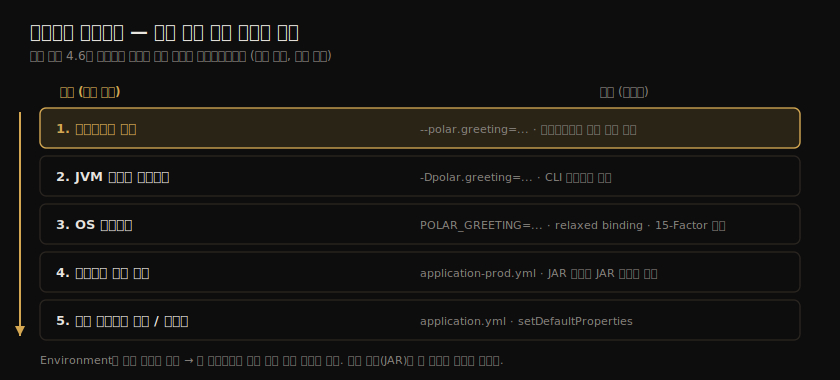
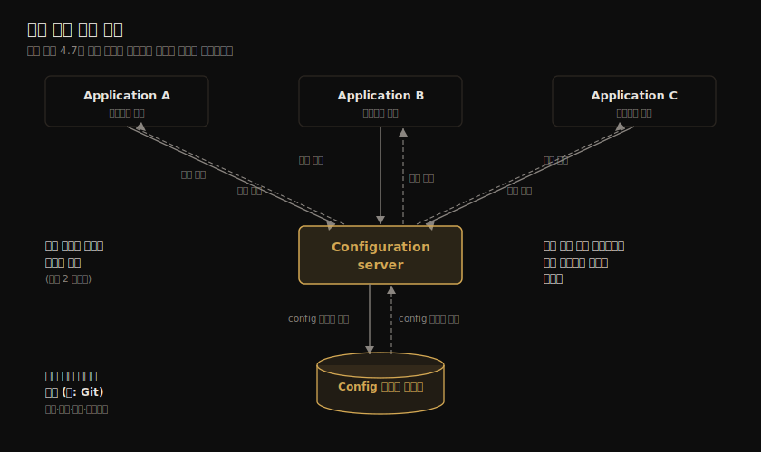
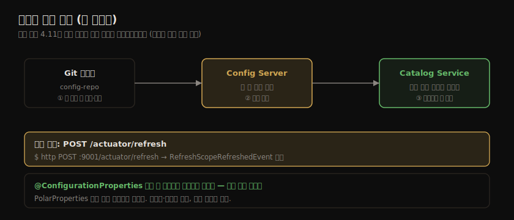

# 외부화 설정 관리
---
> 같은 빌드를 환경마다 다시 만들지 않고, 환경마다 바뀌는 값만 코드 밖에서 주입하는 것이 외부화 설정입니다. 15-Factor 방법론은 릴리스를 "불변 빌드 + 설정"으로 봅니다. 이 장은 Spring의 프로퍼티·프로파일 추상화부터 환경변수·커맨드라인 주입, Spring Cloud Config 중앙 집중 설정 서버까지를 정리합니다.


## 핵심 요약

클라우드 네이티브 앱에서 설정은 "배포 간에 바뀔 가능성이 있는 모든 것"입니다. 15-Factor 방법론은 릴리스를 **불변 빌드(immutable build)와 설정의 조합**으로 정의합니다. 같은 빌드 산출물(JAR·컨테이너 이미지)을 개발·테스트·운영에 그대로 쓰고, 환경마다 다른 값만 외부에서 주입합니다. 빌드를 환경별로 다시 만들면 "테스트한 것과 배포한 것이 다른" 문제가 생기므로, 빌드는 한 번 만들고 설정으로만 환경 차이를 흡수합니다.

Spring은 이를 **Environment 추상화**로 지원합니다. Environment는 출처가 어디든(프로퍼티 파일·환경변수·JVM 시스템 프로퍼티·커맨드라인 인자·설정 서비스) 같은 방식으로 프로퍼티와 프로파일에 접근하게 해 줍니다. 같은 키가 여러 출처에 있으면 **우선순위**로 결정합니다. 높은 쪽부터 CLI 인자 › JVM 시스템 프로퍼티 › OS 환경변수 › 프로파일 특정 파일 › 일반 파일/기본값 순입니다. 덕분에 JAR을 안 바꾸고도 운영에서 환경변수나 CLI 인자로 값을 덮어쓸 수 있습니다.

커스텀 프로퍼티 접근은 `@ConfigurationProperties`가 권장됩니다. 타입 안전하고 IDE 메타데이터를 제공하기 때문입니다. 프로파일은 *환경 이름*(dev·prod)이 아니라 *기능 이름*으로 명명해야 앱이 환경에 결합되지 않습니다. 여러 앱·여러 환경의 설정을 한곳에서 관리해야 할 때는 Spring Cloud Config Server로 Git 백엔드 기반 중앙 집중 설정을 둡니다. 다만 설정 서버는 단일 장애점이 되므로 복제·타임아웃·재시도로 복원력을 확보합니다.




## 학습 목표

이 장을 읽고 나면 다음을 할 수 있어야 합니다.

- 릴리스를 "불변 빌드 + 설정"으로 보는 15-Factor 관점과, 설정을 외부화하는 이유를 설명합니다.
- Spring Environment 추상화로 프로퍼티와 프로파일에 통합 접근하는 방식을 이해합니다.
- 프로퍼티 접근 세 방법(Environment·@Value·@ConfigurationProperties)을 구분하고, 왜 @ConfigurationProperties가 권장되는지 압니다.
- 프로퍼티 우선순위 규칙을 알고, 환경변수·JVM 프로퍼티·CLI 인자로 값을 외부에서 덮어씁니다.
- 프로파일을 기능 플래그로 쓰되 환경 이름 프로파일의 안티패턴을 피합니다.
- Spring Cloud Config Server(Git 백엔드)와 Client(타임아웃·재시도·런타임 갱신)를 구성합니다.


## 본문 정리

### Spring의 프로퍼티와 프로파일

#### Environment 추상화

Spring은 설정 접근을 Environment 인터페이스로 추상화합니다. Environment는 두 축을 제공합니다. **프로퍼티**는 키-값 설정 데이터이고, **프로파일**은 특정 조건에서만 활성화되는 빈·설정의 논리적 묶음입니다. 애플리케이션 코드는 값이 프로퍼티 파일에서 왔는지 환경변수에서 왔는지 몰라도, Environment를 통해 같은 방식으로 접근합니다.



#### 프로퍼티에 접근하는 세 가지 방법

Spring 앱에서 프로퍼티에 접근하는 방법은 세 가지입니다.

- **Environment 인터페이스** — `environment.getProperty("key")`로 직접 조회합니다. 가장 저수준이고 타입 변환을 직접 해야 합니다.
- **@Value 주입** — `@Value("${key}")`로 필드·파라미터에 값을 주입합니다. 간단하지만 키가 문자열이라 오타에 약하고 묶음 관리가 어렵습니다.
- **@ConfigurationProperties** — 애너테이션을 붙인 클래스·레코드에 연관된 프로퍼티를 한 번에 바인딩합니다. 타입 안전하고, 묶어서 관리하며, 설정 메타데이터(IDE 자동완성)를 제공합니다.



> Spring 팀은 커스텀 프로퍼티에 `@ConfigurationProperties`를 권장합니다. 타입 안전성과 메타데이터 때문입니다.

```java
@ConfigurationProperties(prefix = "polar")
public record PolarProperties(
    String greeting     // polar.greeting 프로퍼티에 바인딩
) {}
```

`@ConfigurationPropertiesScan`을 메인 클래스에 붙이면 `@ConfigurationProperties` 빈을 스캔합니다. 의존성에 Spring Boot Configuration Processor를 추가하면, IDE가 인식하는 설정 메타데이터가 생성됩니다.

```groovy
dependencies {
  annotationProcessor 'org.springframework.boot:spring-boot-configuration-processor'
}
```

#### 프로파일을 기능 플래그로

프로파일은 특정 프로파일이 활성화됐을 때만 빈을 등록하거나 설정을 적용하는 데 씁니다. 중요한 원칙은 프로파일을 **환경 이름이 아니라 기능 이름으로 명명**하라는 것입니다. `dev`·`prod` 같은 환경 프로파일로 빈을 게이팅하면 앱이 특정 환경에 결합돼 불변성이 깨집니다.

> ⚠️ `@Profile("prod")`로 빈을 켜고 끄는 방식은 안티패턴입니다. 앱이 "운영 환경"이라는 개념을 알게 되어, 같은 빌드를 다른 환경에 그대로 쓰지 못하게 됩니다. 대신 기능 플래그(`@ConditionalOnProperty`)로 동작을 토글합니다.

```java
@Bean
@ConditionalOnProperty(name = "polar.testdata.enabled", havingValue = "true")
CommandLineRunner testDataLoader() {
    // polar.testdata.enabled=true 일 때만 등록
}
```

이렇게 하면 "운영"이라는 환경 이름 대신 "테스트 데이터 적재"라는 기능 단위로 켜고 끕니다. 어느 환경에서든 그 기능이 필요하면 프로퍼티 하나로 제어합니다.

### 외부화 설정 — 우선순위와 주입

#### 프로퍼티 우선순위

같은 키가 여러 출처에 있을 때 Spring Boot는 정해진 우선순위로 값을 결정합니다. 높은 쪽이 낮은 쪽을 덮습니다.



1. **커맨드라인 인자** — `--polar.greeting=...` (가장 높음)
2. **JVM 시스템 프로퍼티** — `-Dpolar.greeting=...`
3. **OS 환경변수** — `POLAR_GREETING=...`
4. **프로파일 특정 파일** — `application-prod.yml` (JAR 바깥이 JAR 안보다 높음)
5. **일반 프로퍼티 파일 / 기본값** — `application.yml`

핵심은 **같은 빌드(JAR)를 안 바꾸고 설정만 덮어쓴다**는 점입니다. 운영에서 값을 바꾸려고 재빌드할 필요가 없습니다.

#### 커맨드라인·JVM·환경변수 주입

```bash
# 커맨드라인 인자
java -jar app.jar --polar.greeting="Welcome"

# JVM 시스템 프로퍼티
java -Dpolar.greeting="Welcome" -jar app.jar

# OS 환경변수 (relaxed binding)
export POLAR_GREETING="Welcome"
java -jar app.jar
```

환경변수는 **relaxed binding** 규칙을 따릅니다. `POLAR_GREETING`(대문자·밑줄)이 `polar.greeting`(소문자·점)으로 매핑됩니다. 컨테이너 환경에서는 환경변수가 설정 주입의 표준 수단이라, 15-Factor도 환경변수 기반 설정을 권장합니다.

### Spring Cloud Config Server — 중앙 집중 설정

여러 앱·여러 환경의 설정이 늘면 앱마다 파일을 흩어 두는 방식은 관리가 어렵습니다. 중앙 집중 설정 서버는 모든 외부 프로퍼티를 한곳에서 관리하고, 앱들이 요청하면 응답합니다.



#### Config Server 구성

```groovy
dependencies {
  implementation 'org.springframework.cloud:spring-cloud-config-server'
}

dependencyManagement {
  imports {
    mavenBom "org.springframework.cloud:spring-cloud-dependencies:2021.0.3"  // 릴리스 트레인
  }
}
```

```java
@SpringBootApplication
@EnableConfigServer        // Config Server 활성화
public class ConfigServiceApplication {
    public static void main(String[] args) {
        SpringApplication.run(ConfigServiceApplication.class, args);
    }
}
```

```yaml
spring:
  cloud:
    config:
      server:
        git:
          uri: https://github.com/<org>/config-repo
          default-label: main
          timeout: 5                # Git 연결 타임아웃(초)
          clone-on-start: true      # 시작 시 저장소 복제 (첫 요청 지연 방지)
          force-pull: true          # 로컬 변경 무시하고 원격 강제 반영
```

#### 설정 식별 3파라미터

Config Server는 세 파라미터로 설정을 식별합니다.

- **{application}** — 어느 애플리케이션의 설정인가 (`spring.application.name`)
- **{profile}** — 어느 환경·기능 프로파일인가
- **{label}** — 어느 Git 브랜치·태그·커밋인가

```
GET /{application}/{profile}/{label}
예: GET /catalog-service/prod/main
```

#### 복원력 — 단일 장애점 완화

설정 서버는 모든 앱이 의존하므로 단일 장애점이 됩니다. 이를 완화하는 수단은 다음과 같습니다.

- **복제** — 설정 서버 인스턴스를 최소 2개 이상 둡니다.
- **clone-on-start** — 시작 시 Git을 미리 복제해 첫 요청 지연과 Git 일시 장애 영향을 줄입니다.
- **force-pull / timeout** — 로컬 상태 오염을 막고, Git 응답 지연 시 빠르게 실패하도록 타임아웃을 둡니다.

### Spring Cloud Config Client — 연결과 갱신

#### Config Client 구성

Spring Boot 2.4 이후 표준은 `bootstrap.yml`이 아니라 `spring.config.import`입니다.

```groovy
dependencies {
  implementation 'org.springframework.cloud:spring-cloud-starter-config'
}
```

```yaml
spring:
  application:
    name: catalog-service       # {application} = catalog-service
  config:
    import: "optional:configserver:"   # Config Server에서 설정 가져오기 (없어도 시작)
  cloud:
    config:
      uri: http://localhost:8888
      request-connect-timeout: 5000    # 연결 타임아웃(ms)
      request-read-timeout: 5000       # 읽기 타임아웃(ms)
      fail-fast: true                  # 설정 못 가져오면 즉시 실패
      retry:
        max-attempts: 6
        initial-interval: 1000         # 첫 재시도 간격(ms)
        multiplier: 1.1                # 지수 백오프 배수
        max-interval: 2000
```

`optional:` 접두사는 설정 서버가 없어도 앱을 시작하게 합니다. 운영에서 설정 서버 의존을 강제하려면 `optional:`을 빼고 `fail-fast: true` + Spring Retry로 지수 백오프 재시도를 둡니다.

> Spring Retry를 쓰려면 `spring-retry`와 `spring-boot-starter-aop` 의존성이 필요합니다. `fail-fast`가 true일 때만 재시도가 동작합니다.

#### 런타임 설정 갱신

설정을 바꿨을 때 앱을 재시작하지 않고 반영하려면, 변경 신호를 받아 설정을 쓰는 부분만 리로드합니다.



```bash
# Git 저장소에서 값 변경·푸시 후, 클라이언트에 갱신 신호
http POST :9001/actuator/refresh
```

```yaml
management:
  endpoints:
    web:
      exposure:
        include: refresh        # /actuator/refresh 엔드포인트 노출
```

`/actuator/refresh` 호출 시 `RefreshScopeRefreshedEvent`가 발생합니다. `@ConfigurationProperties` 빈은 이 이벤트를 **기본으로** 듣기 때문에, 코드 변경 없이 최신 설정으로 리로드됩니다. 재시작·재빌드 없이 설정만 갱신되고 변경 추적성도 보장됩니다.


## 심화 학습

### `spring.config.import` vs `bootstrap.yml`

책(2021, Spring Cloud 2021.0.3)은 과도기라 `bootstrap.yml`과 `spring.config.import`를 함께 언급할 수 있습니다. 현재(Spring Boot 2.4+) 표준은 `spring.config.import`입니다. 기존 `bootstrap.yml` 방식은 별도 부트스트랩 컨텍스트를 만들어 메인 컨텍스트보다 먼저 설정을 로드하는 방식인데, 레거시로 분류됩니다. `bootstrap.yml`을 계속 쓰려면 `spring-cloud-starter-bootstrap` 의존성을 명시해야 합니다. 새 프로젝트는 `spring.config.import: "optional:configserver:"`를 씁니다. 이는 공식 레퍼런스로 교차검증한 현재 표준입니다.

### Spring Boot 3의 @ConstructorBinding 변화

`@ConfigurationProperties`를 불변 클래스(생성자 바인딩)로 쓸 때, 과거에는 `@ConstructorBinding`을 붙여야 했습니다. Spring Boot 3부터는 **생성자가 하나뿐이면 `@ConstructorBinding`을 생략**해도 자동으로 생성자 바인딩이 됩니다(Java 레코드가 대표적). `@ConstructorBinding`은 생성자가 여럿이라 어느 것을 쓸지 지정해야 할 때만 필요합니다. 또한 패키지가 `org.springframework.boot.context.properties.bind.ConstructorBinding`으로 이동했습니다.

### Spring Cloud Bus로 일괄 갱신

`/actuator/refresh`는 인스턴스 하나만 갱신합니다. 운영에서 같은 앱의 여러 인스턴스를 한 번에 갱신하려면 Spring Cloud Bus를 씁니다. RabbitMQ·Kafka 같은 메시지 브로커로 갱신 이벤트를 브로드캐스트하고, `/actuator/busrefresh` 한 번으로 버스에 연결된 모든 인스턴스가 갱신됩니다. Git 저장소 웹훅을 Config Monitor에 연결하면, 푸시 시 자동으로 버스 갱신을 트리거할 수 있습니다.

### 시크릿 암호화는 별도 관심사

설정 외부화와 시크릿 관리는 다른 문제입니다. Config Server의 Git 저장소에 비밀번호·API 키를 평문으로 두면 안 됩니다. Config Server는 대칭·비대칭 키 기반 암호화(`{cipher}` 접두사)를 지원하지만, 운영에서는 HashiCorp Vault·클라우드 시크릿 매니저 같은 전용 도구가 더 적합합니다. 이 책은 시크릿 관리를 뒤 장(14장)에서 다루므로, 여기서는 설정 외부화의 범위만 정리합니다.


## 실무 적용 포인트

**이런 상황에서 사용하세요.**

- 같은 빌드를 여러 환경에 배포하면서 환경마다 값만 바꿔야 할 때 외부화 설정을 씁니다. 컨테이너 환경에서는 환경변수가 표준입니다.
- 여러 마이크로서비스의 설정을 한곳에서 버전 관리·감사하고 싶을 때 Spring Cloud Config Server(Git 백엔드)를 둡니다.
- 운영 중 설정을 재배포 없이 바꿔야 할 때 `/actuator/refresh`(단일) 또는 Spring Cloud Bus(다수)를 씁니다.

**주의할 점.**

- ⚠️ 프로파일을 환경 이름(dev·prod)으로 빈 게이팅에 쓰지 마세요. 앱이 환경에 결합돼 불변성이 깨집니다. 기능 이름 + `@ConditionalOnProperty`로 토글하세요.
- ⚠️ Config Server는 단일 장애점입니다. 복제·타임아웃·재시도 없이 운영에 올리면 설정 서버 장애가 전체 앱 시작을 막습니다.
- ⚠️ 시크릿을 설정 저장소에 평문으로 두지 마세요. 암호화나 전용 시크릿 매니저를 씁니다(14장).
- ⚠️ `optional:configserver:`의 `optional:`을 운영에서 무심코 두면, 설정 서버 장애 시 기본값으로 잘못 기동할 수 있습니다. 의존을 강제하려면 `optional:`을 빼고 `fail-fast`를 켭니다.


## 면접 대비

**한 줄 정의** — 외부화 설정은 불변 빌드를 환경마다 다시 만들지 않고, 환경 간에 바뀌는 값만 코드 밖에서 주입해 "같은 빌드, 다른 설정"을 실현하는 것입니다.

**핵심 포인트 세 가지**

- 릴리스 = 불변 빌드 + 설정. 빌드는 한 번 만들고 설정으로만 환경 차이를 흡수합니다.
- 같은 키는 우선순위 높은 출처가 이깁니다. CLI 인자 › JVM 프로퍼티 › 환경변수 › 프로파일 파일 › 일반 파일.
- 중앙 집중 설정 서버는 편리하지만 단일 장애점이라, 복제·타임아웃·재시도로 복원력을 확보해야 합니다.

**자주 묻는 질문**

- *@Value와 @ConfigurationProperties의 차이는?* — @Value는 문자열 키로 값 하나를 주입해 간단하지만 오타에 약합니다. @ConfigurationProperties는 연관 프로퍼티를 타입 안전한 객체로 묶어 바인딩하고 메타데이터를 제공해 Spring 팀이 권장합니다.
- *프로파일을 dev·prod로 나누면 왜 안 되나?* — 환경 이름 프로파일로 빈을 게이팅하면 앱이 환경 개념을 알게 되어, 같은 빌드를 다른 환경에 그대로 쓰지 못합니다. 기능 이름 프로파일이나 `@ConditionalOnProperty`로 동작을 토글해야 불변성이 지켜집니다.
- *재시작 없이 설정을 바꾸려면?* — `/actuator/refresh`를 호출하면 `RefreshScopeRefreshedEvent`가 발생하고, @ConfigurationProperties 빈이 기본으로 이를 들어 리로드합니다. 여러 인스턴스는 Spring Cloud Bus로 일괄 갱신합니다.
- *Config Server가 죽으면 앱이 못 뜨나?* — `optional:`을 쓰면 없어도 기동하고, 의존을 강제하면 `fail-fast` + Spring Retry로 지수 백오프 재시도합니다. 근본 완화는 설정 서버 복제입니다.


## 핵심 개념 체크리스트

- [ ] 릴리스를 "불변 빌드 + 설정"으로 보는 15-Factor 관점을 설명할 수 있다.
- [ ] Spring Environment 추상화가 프로퍼티·프로파일에 통합 접근하게 하는 원리를 안다.
- [ ] 프로퍼티 접근 세 방법(Environment·@Value·@ConfigurationProperties)을 구분하고 권장안을 안다.
- [ ] 프로퍼티 우선순위 5단계를 순서대로 말할 수 있다.
- [ ] relaxed binding(`POLAR_GREETING` → `polar.greeting`)을 설명할 수 있다.
- [ ] 프로파일을 기능 이름으로 명명해야 하는 이유와 환경 이름 프로파일의 안티패턴을 안다.
- [ ] Config Server의 식별 3파라미터(application·profile·label)를 안다.
- [ ] Config Server의 단일 장애점 완화 수단(복제·clone-on-start·force-pull·timeout)을 안다.
- [ ] `spring.config.import`가 `bootstrap.yml`을 대체한 현재 표준임을 안다.
- [ ] `/actuator/refresh`와 RefreshScopeRefreshedEvent로 런타임 갱신하는 흐름을 설명할 수 있다.


## 참고 자료

- *Cloud Native Spring in Action*, Thomas Vitale (Manning, 2021) — 4장 「Externalized configuration management」
- Spring Boot Reference — Externalized Configuration — https://docs.spring.io/spring-boot/reference/features/external-config.html
- Spring Cloud Config Reference — https://docs.spring.io/spring-cloud-config/reference/
- Spring Cloud Bus — https://docs.spring.io/spring-cloud-bus/reference/
- 같은 주제 노션 원본(가공 전 보관소): `_notion_import/msa/[Spring MSA] 02-1 외부 설정.md`, `02-3 Spring Cloud Config.md`
- 같은 책 5장: [클라우드 데이터 영속화와 관리](05.클라우드%20데이터%20영속화와%20관리.md) — DB 자격 증명 외부화로 이어짐
