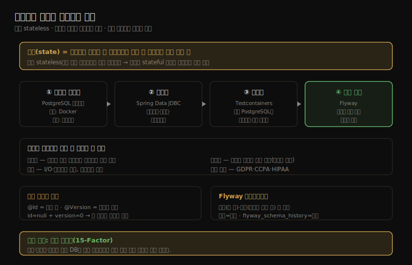
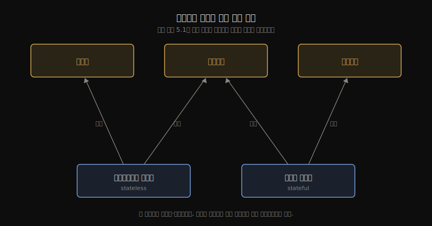
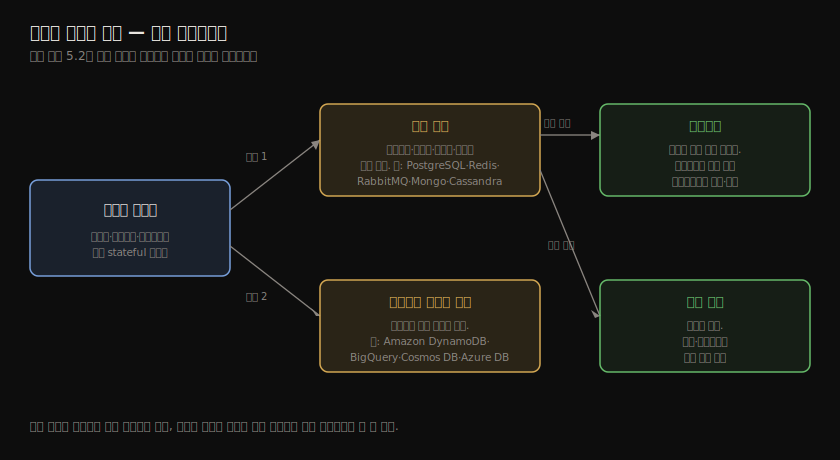
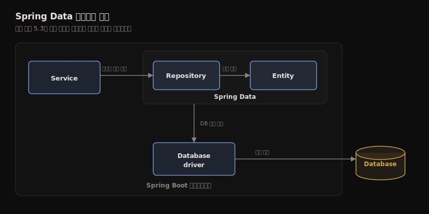
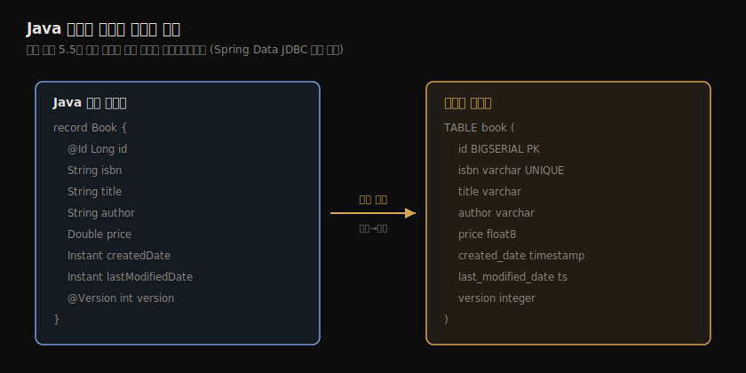
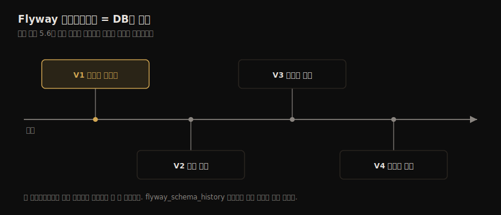

# 클라우드 데이터 영속화와 관리
---
> 클라우드 네이티브 앱은 상태를 갖지 않도록(stateless) 설계하지만, 상태를 어딘가에는 저장해야 합니다. 이 장은 그 "어딘가"인 데이터 서비스를 클라우드에서 다루는 법을 정리합니다. PostgreSQL을 컨테이너로 띄우고, Spring Data JDBC로 영속화 계층을 붙이고, Testcontainers로 실제 DB에 대해 테스트하고, Flyway로 운영 환경의 스키마를 버전 관리하는 흐름입니다.


## 핵심 요약

상태(state)는 서비스를 종료하고 새 인스턴스를 띄울 때 보존되어야 하는 모든 것입니다. 클라우드 네이티브 애플리케이션은 stateless로 설계합니다. 컴퓨팅 노드가 여러 클러스터·지역·클라우드에 흩어지는 동적 인프라에서 상태가 살아남기 어렵기 때문입니다. 그래서 상태를 다루는 책임을 **데이터 서비스**라는 몇 안 되는 컴포넌트로 몰아넣습니다. 데이터 서비스는 PostgreSQL·Redis·Cassandra 같은 데이터 저장소나 RabbitMQ·Kafka 같은 메시징 시스템처럼, 클라우드 아키텍처에서 의도적으로 stateful하게 설계한 부분입니다.

이 장의 실습 대상은 3장에서 만든 Catalog Service입니다. 이 앱은 영속 저장소가 없어서 종료하면 추가한 책 데이터가 모두 사라지고, 그 결과 수평 확장도 할 수 없습니다. 여기에 PostgreSQL 영속화 계층을 붙이는 것이 5장의 목표입니다.

작업은 네 단계로 이어집니다. 첫째, 데이터 서비스를 컨테이너(로컬)와 매니지드 서비스(운영)로 다루는 선택지를 보고 PostgreSQL을 Docker로 띄웁니다. 둘째, Spring Data JDBC로 드라이버·엔티티·리포지토리를 정의해 영속화 계층을 만듭니다. 셋째, Testcontainers로 운영과 동일한 PostgreSQL에 대해 슬라이스 테스트와 통합 테스트를 작성합니다. 넷째, Flyway로 운영 환경의 스키마를 버전 관리하며 진화시킵니다. 이 모든 단계를 관통하는 원칙은 15-Factor 방법론의 **환경 동등성**(environment parity)입니다. 개발·테스트·운영이 같은 DB를 쓸수록 운영에서만 터지는 버그를 줄입니다.




## 학습 목표

이 장을 읽고 나면 다음을 할 수 있어야 합니다.

- 클라우드 네이티브 시스템에서 애플리케이션 서비스(stateless)와 데이터 서비스(stateful)를 구분하고, 데이터 서비스 선택 시 고려할 네 가지(확장성·복원력·성능·규정 준수)를 설명합니다.
- PostgreSQL을 Docker 컨테이너로 띄우고, 환경변수로 사용자·비밀번호·DB 이름을 설정합니다.
- Spring Data JDBC로 영속 엔티티(`@Id`·`@Version`)·리포지토리(`CrudRepository`)·트랜잭션(`@Transactional`)을 정의합니다.
- JDBC 감사(`@EnableJdbcAuditing`)로 생성·수정 메타데이터를 자동 기록합니다.
- Testcontainers로 실제 PostgreSQL에 대해 `@DataJdbcTest` 슬라이스 테스트와 `@SpringBootTest` 통합 테스트를 작성합니다.
- Flyway로 스키마를 초기화하고, 운영 환경에서 컬럼 추가 같은 변경을 무중단으로 적용합니다.


## 본문 정리

### 클라우드 네이티브 시스템의 데이터 서비스

#### stateless 앱과 stateful 데이터 서비스

전통적으로는 가능한 한 많은 것을 하나의 거대한 DB 서버에 저장했습니다. 새 서버를 들이는 일이 비싸고 오래 걸렸기 때문입니다. 클라우드는 다릅니다. 탄력적·셀프서비스·온디맨드 프로비저닝을 제공해서, 며칠~몇 달 걸리던 작업이 몇 분으로 줄었습니다. 예를 들어 Azure에서 PostgreSQL 서버를 띄우는 일은 `az postgres server create` 명령 한 줄입니다.

클라우드 인프라의 기본 구성 요소 세 가지(컴퓨팅·스토리지·네트워크)로 보면 앱과 데이터 서비스의 차이가 분명해집니다. 애플리케이션 서비스는 stateless라서 컴퓨팅과 네트워크 자원만 씁니다. 데이터 서비스는 stateful이라 상태를 영속화할 스토리지가 추가로 필요합니다.



#### 데이터 서비스를 고를 때 따지는 네 가지

데이터 서비스는 대개 DB나 메시지 브로커 같은 기성품(off-the-shelf)입니다. 가장 알맞은 기술을 고르려면 네 가지 속성을 따집니다.

**확장성(Scalability)** — 데이터 서비스도 워크로드 증감에 맞춰 확장해야 합니다. 다만 클라우드에서는 데이터 양이 그 어느 때보다 크고 갑자기 늘 수 있어서, 데이터 저장소에 대한 안전한 접근을 보장하면서 확장하는 일이 새로운 과제입니다.

**복원력(Resilience)** — 데이터 서비스도 장애에 견뎌야 하고, 특정 저장 기술로 영속화된 데이터 자체도 복원력이 있어야 합니다. 데이터 손실을 막는 핵심 전략은 복제입니다. 여러 클러스터·지역에 데이터를 복제하면 더 견고해지지만 비용이 듭니다. 관계형 DB는 데이터 일관성을 보장하며 복제하고, 일부 비관계형 DB는 높은 복원력을 주지만 일관성을 늘 보장하지는 못합니다(이른바 최종 일관성, eventual consistency).

**성능(Performance)** — 복제 방식이 성능에 영향을 줍니다. 성능은 저장 기술의 I/O 접근 지연과 네트워크 지연으로도 제한됩니다. 스토리지가 그것을 쓰는 데이터 서비스에 비해 어디에 위치하는지가 중요해지는데, 이는 stateless 앱에서는 만나지 않던 관심사입니다.

**규정 준수(Compliance)** — 영속 데이터는 보통 비즈니스에 중요하고 법·규제·고객 합의로 보호되는 정보를 담습니다. 유럽의 GDPR, 캘리포니아의 CCPA, 미국 의료 데이터의 HIPAA가 예입니다. 그래서 의료·금융처럼 민감한 데이터를 다루는 조직은 데이터 관리 통제를 위해 온프레미스 저장소를 선호하기도 합니다.

#### 누가 관리하느냐로 나뉘는 분류

데이터 서비스는 책임 주체로 나뉩니다. **클라우드 제공자가 관리**하는 쪽은 PostgreSQL·Redis·MariaDB 같은 업계 표준 서비스(Amazon RDS, Azure Database, Google Cloud SQL)와, 클라우드 전용으로 만든 서비스(서버리스 데이터 웨어하우스 Google BigQuery, 비관계형 Azure Cosmos DB)를 제공합니다. **직접 관리**하는 쪽은 복잡도가 늘지만 통제권이 커집니다. 가상 머신 기반 전통 방식을 쓰거나, 컨테이너로 묶어 쿠버네티스 같은 통합 인터페이스로 컴퓨팅·스토리지를 함께 다루며 비용을 줄일 수 있습니다.



#### PostgreSQL을 컨테이너로 실행

Catalog Service는 책 데이터를 PostgreSQL에 저장합니다. 대부분의 클라우드 제공자가 PostgreSQL을 매니지드 서비스로 제공해 고가용성·복원력·영속 스토리지 부담을 덜어 줍니다. 15-Factor의 환경 동등성을 위해 개발에서도 PostgreSQL을 쓰며, 로컬에서는 Docker로 띄웁니다.

```bash
docker run -d \
    --name polar-postgres \              # 컨테이너 이름
    -e POSTGRES_USER=user \              # 관리자 사용자명
    -e POSTGRES_PASSWORD=password \      # 관리자 비밀번호
    -e POSTGRES_DB=polardb_catalog \     # 생성할 DB 이름
    -p 5432:5432 \                       # 5432 포트로 노출
    postgres:14.4                        # Docker Hub에서 받는 이미지
```

직접 만든 이미지가 아니라 Docker Hub에서 받는 이미지(`postgres:14.4`)라는 점, 컨테이너 생성 시 환경변수로 DB를 설정한다는 점이 새롭습니다.

> ⚠️ 이 책은 Docker 볼륨을 다루지 않습니다. 로컬 컨테이너에 저장한 데이터는 컨테이너를 제거하면 사라집니다. 이 장 주제를 생각하면 역설적이지만, 운영에서는 스토리지 관련 관심사를 클라우드 제공자가 처리하므로 직접 다룰 일이 없다는 전제입니다. 컨테이너 중지·시작·재생성은 `docker stop`·`docker start`·`docker rm -fv polar-postgres`로 합니다.

### Spring Data JDBC로 데이터 영속화

Spring은 Spring Data 프로젝트로 다양한 영속화 기술을 지원합니다. 관계형(JDBC·JPA·R2DBC)과 비관계형(Cassandra·Redis·Neo4J·MongoDB) 모듈이 있고, 공통 추상화와 패턴을 제공해 모듈 사이를 옮겨 다니기 쉽습니다. 앱과 DB의 상호작용에는 세 가지 핵심 요소가 있습니다.

- **데이터베이스 드라이버** — 특정 DB와의 연동을 제공합니다(커넥션 팩토리 경유). 관계형은 명령형/블로킹 앱에서 JDBC 드라이버, 리액티브/논블로킹 앱에서 R2DBC 드라이버를 씁니다.
- **엔티티** — DB에 영속화되는 도메인 객체입니다. 각 인스턴스를 식별할 기본 키 필드를 가져야 하고, 애너테이션으로 Java 객체와 DB 항목의 매핑을 설정합니다.
- **리포지토리** — 데이터 저장·조회를 위한 추상화입니다. Spring Data가 기본 구현을 제공하고 각 모듈이 확장합니다.



#### Spring Data JDBC vs Spring Data JPA

Spring Data JPA는 Spring Data에서 가장 많이 쓰이는 모듈입니다. Jakarta EE에 포함된 JPA 표준 명세에 기반하고, Hibernate가 대표 구현입니다. 강력하고 검증된 ORM 프레임워크지만 복잡합니다. 영속성 컨텍스트·지연 로딩·더티 체킹·세션 같은 개념을 모르면 디버깅이 어려운 문제를 만날 수 있습니다.

Spring Data JDBC는 더 최근에 추가됐습니다. DDD의 애그리거트·애그리거트 루트·리포지토리 개념을 따라 관계형 DB와 통합합니다. 가볍고 단순해서, 도메인을 바운디드 컨텍스트로 정의하는 마이크로서비스에 잘 맞습니다. SQL 쿼리에 대한 통제권을 더 주고 불변 엔티티를 쓸 수 있게 합니다. 다만 JPA의 모든 기능을 제공하지는 않아서 모든 시나리오의 대체재는 아닙니다.

> 저자는 클라우드 네이티브 앱에 잘 맞고 단순하다는 이유로 Spring Data JDBC를 택했습니다. Spring Data 공통 추상화 덕에 JDBC에서 JPA로 전환하기도 쉽습니다.

#### JDBC로 DB에 연결

Spring Data JDBC와 특정 DB 드라이버를 의존성에 추가합니다.

```groovy
dependencies {
  // ...
  implementation 'org.springframework.boot:spring-boot-starter-data-jdbc'
  runtimeOnly 'org.postgresql:postgresql'   // PostgreSQL JDBC 드라이버
}
```

PostgreSQL은 Catalog Service의 백킹 서비스입니다. 15-Factor에 따라 첨부된 자원(attached resource)으로 다뤄야 하고, 자원 바인딩으로 첨부합니다. 바인딩은 ① 드라이버·서버 위치·연결할 DB를 정하는 URL과 ② 연결을 맺을 사용자명·비밀번호로 이뤄집니다. Spring Boot 덕에 이 값들을 설정 프로퍼티로 줄 수 있어, 값만 바꾸면 첨부된 DB를 교체할 수 있습니다.

```yaml
spring:
  datasource:
    username: user
    password: password
    url: jdbc:postgresql://localhost:5432/polardb_catalog
    hikari:
      connection-timeout: 2000     # 풀에서 커넥션을 얻기까지 최대 대기(ms)
      maximum-pool-size: 5         # 풀이 유지하는 최대 커넥션 수
```

DB 커넥션을 열고 닫는 일은 상대적으로 비쌉니다. 그래서 매 접근마다 새로 만들지 않고 미리 여러 개를 맺어 재사용하는 **커넥션 풀링**을 씁니다. Spring Boot는 HikariCP를 쓰며, 최소한 커넥션 타임아웃과 최대 풀 크기는 설정하기를 권합니다. 둘 다 앱의 복원력과 성능에 영향을 줍니다.

#### 영속 엔티티 정의

Catalog Service에는 이미 도메인 엔티티인 `Book` 레코드가 있습니다. 도메인이 단순하므로 이 레코드를 영속 엔티티로도 씁니다. Spring Data JDBC는 불변 엔티티를 권장하고, Java 레코드는 불변이며 전체 인자 생성자를 노출하므로 좋은 선택입니다.

영속 엔티티에는 식별자 필드(기본 키)가 있어야 합니다. `@Id`(`org.springframework.data.annotation` 패키지)로 표시하고, DB가 자동으로 고유 식별자를 생성합니다. 동시 수정에 대비해 **낙관적 잠금**(optimistic locking)을 쓰는데, `@Version` 필드가 0부터 세며 수정마다 자동 증가합니다. 사용자는 동시에 읽을 수 있고, 수정 시도 시 마지막 읽기 이후 변경이 있었으면 예외가 발생합니다.

> `@Id` 필드가 null이고 `@Version` 필드가 0이면 Spring Data JDBC는 새 객체로 간주해 DB에 삽입하며 식별자를 생성합니다. 값이 있으면 이미 있는 객체로 보고 수정합니다.

```java
public record Book (

  @Id                                            // 기본 키
  Long id,

  @NotBlank(message = "The book ISBN must be defined.")
  @Pattern(
    regexp = "^([0-9]{10}|[0-9]{13})$",
    message = "The ISBN format must be valid."
  )
  String isbn,

  @NotBlank(message = "The book title must be defined.")
  String title,

  @NotBlank(message = "The book author must be defined.")
  String author,

  @NotNull(message = "The book price must be defined.")
  @Positive(message = "The book price must be greater than zero.")
  Double price,

  @Version                                       // 낙관적 잠금용 버전 번호
  int version

){
  public static Book of(                         // 비즈니스 필드만 받는 정적 팩토리
    String isbn, String title, String author, Double price
  ) {
    return new Book(
      null, isbn, title, author, price, 0        // id=null, version=0 → 새 객체
    );
  }
}
```

> ISBN은 도메인 엔티티의 자연 키(business key)입니다. 이것을 기본 키로 쓸 수도 있지만, 저자는 도메인 관심사와 영속화 구현 세부를 분리하려고 기술 키(surrogate key)를 따로 뒀습니다.

> ⚠️ Spring Data JPA는 변경 가능한 객체로 동작해 Java 레코드를 쓸 수 없습니다. JPA 엔티티는 `@Entity`를 붙이고 인자 없는 생성자를 노출해야 합니다. 식별자 애너테이션도 `javax.persistence` 패키지의 `@Id`·`@Version`을 씁니다.

영속 엔티티는 관계형 자원으로 자동 매핑됩니다. 클래스·필드명은 소문자로, 카멜 케이스는 밑줄로 이어진 단어로 바뀝니다. `Book` 레코드는 `book` 테이블로, `title` 필드는 `title` 컬럼으로 매핑됩니다.



매핑이 동작하려면 테이블이 정의돼 있어야 합니다. Spring Data는 시작 시 `schema.sql`로 스키마를, `data.sql`로 데이터를 초기화하는 기능을 제공합니다(`src/main/resources`에 둠). 데모·실험에는 편하지만 운영에는 한계가 있어, 뒤에서 Flyway로 대체합니다.

```sql
DROP TABLE IF EXISTS book;
CREATE TABLE book (
  id                  BIGSERIAL PRIMARY KEY NOT NULL,    -- DB가 생성하는 기본 키
  author              varchar(255) NOT NULL,
  isbn                varchar(255) UNIQUE NOT NULL,      -- ISBN은 책마다 유일
  price               float8 NOT NULL,
  title               varchar(255) NOT NULL,
  version             integer NOT NULL                   -- 엔티티 버전 번호
);
```

PostgreSQL은 내장 인메모리 DB가 아니므로 스키마 초기화를 명시적으로 켭니다.

```yaml
spring:
  sql:
    init:
      mode: always
```

#### JDBC 감사 켜기

각 행의 생성·최근 수정 시각을 아는 일은 유용합니다. 인증·인가를 붙인 뒤에는 누가 만들고 수정했는지도 기록할 수 있습니다. 이를 데이터베이스 감사(auditing)라 합니다. Spring Data JDBC는 설정 클래스에 `@EnableJdbcAuditing`을 붙여 모든 영속 엔티티의 감사를 켭니다.

```java
@Configuration             // Spring 설정 클래스
@EnableJdbcAuditing        // 영속 엔티티 감사 활성화
public class DataConfig {}
```

> ⚠️ Spring Data JPA는 `@EnableJpaAuditing`으로 켜고, 엔티티 클래스에 `@EntityListeners(AuditingEntityListener.class)`를 붙여 감사 이벤트를 듣게 해야 합니다. Spring Data JDBC처럼 자동으로 되지 않습니다.

감사를 켜면 생성·수정·삭제마다 감사 이벤트가 생깁니다. 전용 애너테이션으로 필드에 메타데이터를 담습니다.

| 애너테이션 | 엔티티 필드에서의 역할 |
|---|---|
| `@CreatedBy` | 엔티티를 만든 사용자. 생성 시 정해지고 바뀌지 않음 |
| `@CreatedDate` | 엔티티가 생성된 시각. 생성 시 정해지고 바뀌지 않음 |
| `@LastModifiedBy` | 가장 최근 수정한 사용자. 생성·수정마다 갱신 |
| `@LastModifiedDate` | 가장 최근 수정 시각. 생성·수정마다 갱신 |

`Book` 레코드에 `createdDate`·`lastModifiedDate` 필드를 추가합니다(생성 시 null, Spring Data가 내부에서 채움). 12장에서 Spring Security 도입 후 누가 만들고 수정했는지도 기록하도록 확장합니다. 스키마에도 `created_date`·`last_modified_date` 컬럼(`timestamp` 타입)을 더합니다.

#### Spring Data 리포지토리

리포지토리 패턴은 출처와 무관하게 데이터에 접근하는 추상화입니다. 비즈니스 로직을 담은 도메인 계층은 데이터가 어디서 오는지 몰라도 됩니다. Spring Data 리포지토리는 관계형이든 비관계형이든 같은 추상화를 쓰게 해 주는, Spring Data의 가장 값진 기능입니다.

인터페이스만 정의하면 시작 시 Spring Data가 구현을 즉석에서 생성합니다. `BookRepository`가 표준 CRUD를 쓰도록 `CrudRepository`를 확장하고, ISBN 기반 접근은 명시적으로 선언합니다.

```java
public interface BookRepository
    extends CrudRepository<Book,Long> {            // 관리 엔티티(Book), 기본 키 타입(Long)

  Optional<Book> findByIsbn(String isbn);          // Spring Data가 런타임에 구현
  boolean existsByIsbn(String isbn);

  @Modifying                                       // DB 상태를 바꾸는 연산
  @Query("delete from Book where isbn = :isbn")    // Spring Data가 쓸 쿼리 선언
  void deleteByIsbn(String isbn);
}
```

커스텀 쿼리는 두 가지로 정의합니다. ① `@Query` 애너테이션으로 SQL 유사 구문을 직접 줍니다. ② 명명 규칙을 따른 쿼리 메서드로 정의합니다(`find`·`exists`·`delete`·`count` + `By` + 프로퍼티 표현식 + 비교·정렬 연산자 조합). 작성 시점 기준으로 Spring Data JDBC는 명명 규칙을 읽기 연산에만 지원하고, Spring Data JPA는 전부 지원합니다.

Spring Data가 제공하는 리포지토리는 모든 연산이 트랜잭션 컨텍스트로 설정돼 있습니다. `CrudRepository`의 메서드는 모두 트랜잭션이라 `saveAll()`을 안전하게 호출할 수 있습니다. 직접 추가한 쿼리 메서드는 어느 것을 트랜잭션에 넣을지 직접 정합니다. `deleteByIsbn()`은 DB 상태를 바꾸므로 `@Transactional`을 붙입니다.

```java
@Modifying
@Transactional                               // 트랜잭션 안에서 실행
@Query("delete from Book where isbn = :isbn")
void deleteByIsbn(String isbn);
```

> Spring Data JDBC에서는 상태를 바꾸는 모든 커스텀 연산(생성·수정·삭제)이 트랜잭션 안에서 실행돼야 합니다.

### Spring과 Testcontainers로 영속화 테스트

운영과 같은 기술(컨테이너 PostgreSQL)로 개발한 것은 15-Factor의 환경 동등성을 향한 좋은 한 걸음입니다. 데이터 소스는 환경 차이의 주요 원인입니다. 로컬에서 H2·HSQL 같은 인메모리 DB를 쓰는 관행이 흔하지만, 이는 앱의 예측 가능성과 견고성을 해칩니다. 모든 관계형 DB가 SQL을 쓰고 Spring Data JDBC가 일반 추상화를 줘도, 벤더마다 방언과 고유 기능이 있어 운영과 같은 DB로 개발·테스트해야 운영에서만 나는 오류를 잡습니다.

테스트에도 같은 논리가 적용됩니다. 통합 테스트는 외부 서비스와의 통합도 검증해야 하는데, H2를 쓰면 신뢰도가 떨어집니다. 지속적 전달에서는 모든 커밋이 릴리스 후보입니다. 배포 파이프라인의 자동 테스트가 운영과 다른 백킹 서비스를 쓰면, 안전한 배포 전에 추가 수동 테스트가 필요해집니다. 그래서 환경 간 격차를 줄이는 일이 핵심입니다. Testcontainers는 통합 테스트 맥락에서 백킹 서비스를 컨테이너로 쉽게 쓰게 해 주는 Java 테스트 라이브러리입니다.

#### Testcontainers 설정

Testcontainers는 JUnit을 지원하고, DB·메시지 브로커·웹 서버 같은 가볍고 일회성인 컨테이너를 제공합니다. PostgreSQL 모듈 의존성을 추가합니다.

```groovy
ext {
  set('testcontainersVersion', "1.17.3")                 // Testcontainers 버전
}

dependencies {
  testImplementation 'org.testcontainers:postgresql'     // PostgreSQL 컨테이너 관리
}

dependencyManagement {
  imports {
    mavenBom "org.testcontainers:testcontainers-bom:${testcontainersVersion}"  // BOM
  }
}
```

테스트 시 앞서 설정한 `spring.datasource.url` 대신 Testcontainers가 제공하는 PostgreSQL 인스턴스를 쓰게 합니다. `src/test/resources`에 `application-integration.yml`을 만들면 `integration` 프로파일이 켜졌을 때 이 값이 메인을 덮습니다.

```yaml
spring:
  datasource:
    url: jdbc:tc:postgresql:14.4:///      # Testcontainers의 PostgreSQL 모듈, 14.4 버전
```

#### @DataJdbcTest 슬라이스 테스트

Spring Boot는 특정 애플리케이션 슬라이스에 쓰이는 컴포넌트만 로드하는 슬라이스 테스트를 지원합니다. 데이터 슬라이스는 `@DataJdbcTest`로 테스트합니다. 이 애너테이션은 Spring Data JDBC 엔티티·리포지토리를 컨텍스트에 포함하고, 테스트 케이스마다 컨텍스트를 준비할 때 쓰는 하위 수준 객체 `JdbcAggregateTemplate`을 자동 구성합니다.

```java
@DataJdbcTest                                                          // Data JDBC 컴포넌트에 집중
@Import(DataConfig.class)                                              // 감사 활성화를 위해 임포트
@AutoConfigureTestDatabase(                                            // 내장 테스트 DB 대체 비활성
  replace = AutoConfigureTestDatabase.Replace.NONE
)
@ActiveProfiles("integration")                                         // application-integration.yml 로드
class BookRepositoryJdbcTests {

  @Autowired
  private BookRepository bookRepository;

  @Autowired
  private JdbcAggregateTemplate jdbcAggregateTemplate;                 // DB와 상호작용하는 하위 객체

  @Test
  void findBookByIsbnWhenExisting() {
    // Given — JdbcAggregateTemplate으로 테스트 대상 데이터 준비
    var bookIsbn = "1234561237";
    var book = Book.of(bookIsbn, "Title", "Author", 12.90);
    jdbcAggregateTemplate.insert(book);

    // When — 리포지토리로 ISBN 조회
    Optional<Book> actualBook = bookRepository.findByIsbn(bookIsbn);

    // Then — 존재하고 ISBN이 일치
    assertThat(actualBook).isPresent();
    assertThat(actualBook.get().isbn()).isEqualTo(book.isbn());
  }
}
```

`@DataJdbcTest`는 각 테스트 메서드를 트랜잭션으로 실행하고 끝에 롤백해 DB를 깨끗하게 유지합니다. 위 테스트 실행 후 DB에는 생성한 책이 남지 않습니다. 내부적으로 Testcontainers가 테스트 실행 전 PostgreSQL 컨테이너를 만들고 끝에 제거합니다.

#### @SpringBootTest 통합 테스트

`@SpringBootTest`로 전체 통합 테스트를 합니다. Testcontainers 설정은 `integration` 프로파일이 켜진 모든 테스트에 적용되므로, 통합 테스트 클래스에 프로파일을 추가하면 됩니다.

```java
@SpringBootTest(webEnvironment = SpringBootTest.WebEnvironment.RANDOM_PORT)
@ActiveProfiles("integration")                                             // 통합 프로파일 활성화
class CatalogServiceApplicationTests {
  // ...
}
```

### Flyway로 운영 환경 데이터베이스 관리

애플리케이션 소스를 버전 관리하듯 DB 변경도 기록하는 것이 좋습니다. DB의 상태를 결정론적·자동으로 추론하고, 특정 변경이 적용됐는지, 처음부터 어떻게 재생성하는지, 어떻게 통제·반복·신뢰 가능하게 마이그레이션하는지가 필요합니다. Java 생태계에서 가장 많이 쓰는 도구는 Flyway와 Liquibase이고, 둘 다 Spring Boot에 통합됩니다.

#### Flyway 이해 — DB를 위한 버전 관리

Flyway는 DB 상태의 버전에 대한 단일 진실 공급원(SSOT)을 제공하고 변경을 증분으로 추적합니다. 변경을 자동화하고 상태를 재현하거나 롤백할 수 있습니다. 모든 DB 변경을 마이그레이션이라 부르며, 버전 마이그레이션과 반복 마이그레이션으로 나뉩니다.

- **버전 마이그레이션**(versioned) — 고유 버전 번호로 식별되고 순서대로 정확히 한 번 적용됩니다. 각 버전마다 효과를 되돌리는 undo 마이그레이션을 선택적으로 둘 수 있습니다. 스키마·테이블·컬럼·시퀀스 생성·변경·삭제나 데이터 교정에 씁니다.
- **반복 마이그레이션**(repeatable) — 체크섬이 바뀔 때마다 적용됩니다. 뷰·프로시저·패키지 생성·갱신에 씁니다.

두 마이그레이션 모두 표준 SQL 스크립트(DDL 변경에 유용)나 Java 클래스(데이터 마이그레이션 같은 DML 변경에 유용)로 정의합니다. Flyway는 처음 실행될 때 자동 생성하는 `flyway_schema_history` 테이블로 어떤 마이그레이션이 적용됐는지 추적합니다. 마이그레이션을 Git 저장소의 커밋으로, 스키마 히스토리 테이블을 모든 커밋을 담은 저장소 로그로 그려 볼 수 있습니다.



> Flyway 사용의 전제는 관리하려는 DB와 올바른 접근 권한을 가진 사용자가 이미 존재해야 한다는 점입니다. Flyway로 사용자를 관리해서는 안 됩니다.

Spring Boot는 Flyway 자동 구성을 제공합니다. 통합 시 SQL 마이그레이션은 `src/main/resources/db/migration`에서, Java 마이그레이션은 `src/main/java/db/migration`에서 찾습니다. 스키마·데이터 마이그레이션 실행은 15-Factor의 관리 프로세스(admin process)에 해당하고, 여기서는 앱 자체에 임베드해 시작 단계에 실행합니다.

```groovy
dependencies {
  implementation 'org.flywaydb:flyway-core'
}
```

#### Flyway로 스키마 초기화

첫 변경은 보통 스키마 초기화입니다. 기존 `schema.sql`을 지우고 `spring.sql.init.mode` 프로퍼티를 제거한 뒤, `src/main/resources/db/migration` 폴더에 SQL 마이그레이션을 둡니다. 파일명은 정해진 패턴을 따릅니다.

- **접두사** — 버전 마이그레이션은 `V`
- **버전** — 점이나 밑줄로 구분(예: `2.0.1`)
- **구분자** — 밑줄 둘: `__`
- **설명** — 밑줄로 구분한 단어들
- **접미사** — `.sql`

`V1__Initial_schema.sql`에 스키마 초기화 SQL을 둡니다(버전 번호 뒤 밑줄 두 개에 주의).

```sql
CREATE TABLE book (                                     -- book 테이블 정의
  id                  BIGSERIAL PRIMARY KEY NOT NULL,   -- id를 기본 키로 선언
  author              varchar(255) NOT NULL,
  isbn                varchar(255) UNIQUE NOT NULL,     -- isbn은 유일
  price               float8 NOT NULL,
  title               varchar(255) NOT NULL,
  created_date        timestamp NOT NULL,
  last_modified_date  timestamp NOT NULL,
  version             integer NOT NULL
);
```

Flyway가 스키마 변경을 관리하면 버전 관리의 모든 이점을 얻습니다.

#### Flyway로 DB 진화

Catalog Service를 운영에 배포해 책 데이터가 쌓인 뒤, 출판사 정보를 제공하라는 새 요구가 생겼다고 합시다. 이미 운영 중이고 데이터가 있으므로, Flyway로 `book` 테이블에 `publisher` 컬럼을 더하는 새 변경을 적용합니다. `V2__Add_publisher_column.sql`을 만듭니다.

```sql
ALTER TABLE book
ADD COLUMN publisher varchar(255);
```

`Book` 레코드도 갱신합니다. 운영에는 출판사 정보 없는 책이 이미 있으므로, 새 필드는 선택(optional)이어야 기존 데이터가 무효가 되지 않습니다.

```java
public record Book (
  @Id
  Long id,
  // ...
  String publisher,      // 새로 추가한 선택 필드
  @CreatedDate
  Instant createdDate,
  @LastModifiedDate
  Instant lastModifiedDate,
  @Version
  int version
){
  public static Book of(
    String isbn, String title, String author, Double price, String publisher
  ) {
    return new Book(
      null, isbn, title, author, price, publisher, null, null, 0
    );
  }
}
```

새 버전을 배포하면 Flyway는 이미 적용된 `V1`을 건너뛰고 `V2`만 실행합니다. 이후 직원이 새 책을 추가할 때 출판사명을 넣을 수 있고, 기존 데이터도 여전히 유효합니다.

`publisher`를 필수로 만들려면 세 번째 버전에서 두 단계로 처리합니다. SQL 마이그레이션으로 `publisher` 컬럼을 NOT NULL로 강제하고, Java 마이그레이션으로 출판사 없는 기존 책에 값을 채웁니다. 이 두 단계 방식은 업그레이드 중 하위 호환성을 보장하는 흔한 패턴입니다. 보통 같은 앱의 여러 인스턴스가 돌고, 새 버전 배포는 무중단을 위해 한 번에 일부 인스턴스만 갱신하는 롤링 업그레이드로 합니다. 업그레이드 중에는 구·신 버전이 함께 도므로, 최신 버전의 DB 변경이 적용된 뒤에도 구 인스턴스가 올바로 돌아야 합니다.


## 심화 학습

### Testcontainers JDBC URL 스킴은 의존성 추가만으로 동작

책의 `jdbc:tc:postgresql:14.4:///` URL 스킴은 Testcontainers의 JDBC 지원 기능입니다. 별도 코드 없이 JDBC URL의 `jdbc:` 뒤에 `tc:`를 끼워 넣으면, Testcontainers가 커넥션 시점에 컨테이너를 띄우고 연결을 가로챕니다. 클래스패스에 `org.testcontainers:postgresql`과 도커 환경만 있으면 됩니다. 공식 문서(java.testcontainers.org)는 이 방식을 "JDBC support"로 부르며, 컨테이너 재사용·초기화 스크립트 같은 옵션을 URL 파라미터로 붙일 수 있다고 설명합니다.

### Spring Boot 3 이후 변화 — `@ServiceConnection`

책(2021, Spring Boot 2.7)은 `application-integration.yml`에서 `spring.datasource.url`을 Testcontainers 스킴으로 덮는 방식을 씁니다. Spring Boot 3.1부터는 `@ServiceConnection` 애너테이션이 추가돼, 테스트의 `@Container`로 띄운 컨테이너를 Spring Boot가 자동으로 데이터 소스 프로퍼티에 연결합니다(공식 레퍼런스 "Testcontainers" 절). URL 스킴 트릭이나 프로퍼티 덮어쓰기 없이 컨테이너 빈만 선언하면 됩니다. 책의 방식도 여전히 유효하지만, 현재 표준은 `@ServiceConnection`입니다. 이는 책 출간 후 추가된 기능이므로 1차 자료(공식 docs)로 교차검증해 적었습니다.

### Spring Data JDBC의 애그리거트 경계

본문은 Spring Data JDBC가 DDD의 애그리거트·애그리거트 루트를 따른다고만 짚습니다. 더 들어가면, Spring Data JDBC는 애그리거트 루트 단위로만 리포지토리를 만들고, 한 애그리거트를 저장할 때 그에 속한 자식 엔티티를 한 번에 처리합니다(공식 레퍼런스 "Persisting Entities"). JPA의 지연 로딩·영속성 컨텍스트가 없는 대신, 애그리거트를 통째로 읽고 쓰는 단순한 모델을 강제합니다. 이 단순함이 마이크로서비스의 바운디드 컨텍스트와 잘 맞는다는 본문 주장의 근거입니다.

### `schema.sql` 초기화의 함정

본문은 `spring.sql.init.mode: always`로 PostgreSQL에서도 `schema.sql`을 실행하게 합니다. 주의할 점은, JPA를 함께 쓸 때 Hibernate의 `ddl-auto`와 `schema.sql` 초기화가 실행 순서로 충돌할 수 있다는 것입니다. 그래서 본문도 운영에서는 이 내장 초기화 대신 Flyway·Liquibase 같은 전용 도구를 쓰라고 합니다. Flyway를 도입하면 `spring.sql.init.mode`를 제거하는 이유가 여기 있습니다. 둘을 함께 두면 테이블 생성이 중복됩니다.


## 실무 적용 포인트

**이런 상황에서 사용하세요.**

- 마이크로서비스가 자기 바운디드 컨텍스트의 데이터만 단순 CRUD로 다룰 때는 Spring Data JDBC가 JPA보다 가볍고 SQL 통제권이 명확합니다. 복잡한 객체 그래프·지연 로딩·2차 캐시가 필요하면 JPA를 택합니다.
- 통합 테스트에서 운영과 같은 DB로 검증해야 할 때 Testcontainers를 씁니다. 인메모리 DB는 빠르지만 벤더 방언 차이로 운영 버그를 놓칩니다.
- 운영 DB 스키마를 코드로 추적·재현·롤백해야 할 때 Flyway를 도입합니다. 마이그레이션 파일이 곧 변경 이력입니다.

**주의할 점.**

- ⚠️ DB 자격 증명을 `application.yml`에 평문으로 두지 마세요. 본문 예제는 학습용이며, 운영에서는 환경변수·시크릿 매니저로 외부화합니다(4장의 외부화 설정과 직접 연결됩니다).
- ⚠️ Flyway로 사용자(user)를 관리하지 마세요. DB와 권한 있는 사용자는 미리 존재해야 하고, Flyway는 그 위에서 스키마 변경만 담당합니다.
- ⚠️ 운영에서 컬럼을 추가할 때 NOT NULL을 한 번에 걸지 마세요. 기존 데이터가 무효가 됩니다. 선택 필드로 추가 → 데이터 백필 → NOT NULL 강제의 두 단계로 하위 호환성을 지킵니다. 롤링 업그레이드 중 구·신 버전이 공존하기 때문입니다.
- ⚠️ HikariCP 풀 크기를 무작정 키우지 마세요. 과한 커넥션은 DB 쪽 부하가 됩니다. HikariCP 위키의 풀 사이징 분석을 출발점으로 삼습니다.


## 면접 대비

**한 줄 정의** — 클라우드 네이티브 데이터 영속화는 앱을 stateless로 유지하면서 상태를 데이터 서비스로 격리하고, 환경 동등성을 지키며 Spring Data JDBC·Testcontainers·Flyway로 영속화·테스트·버전 관리를 일관되게 하는 것입니다.

**핵심 포인트 세 가지**

- 상태는 데이터 서비스로 몰아 격리합니다. 앱은 stateless여야 동적 클라우드 인프라에서 수평 확장됩니다.
- 환경 동등성이 품질을 좌우합니다. 개발·테스트·운영이 같은 DB(컨테이너·Testcontainers)를 써야 운영에서만 나는 버그를 잡습니다.
- DB 변경도 버전 관리합니다. Flyway 마이그레이션이 곧 커밋이고, `flyway_schema_history`가 곧 로그입니다.

**자주 묻는 질문**

- *Spring Data JDBC와 JPA의 차이는?* — JDBC는 DDD 애그리거트 기반의 가볍고 단순한 모델로 불변 엔티티·명시적 SQL을 쓰고, JPA는 Hibernate 기반으로 영속성 컨텍스트·지연 로딩 같은 풍부한 기능을 주지만 복잡합니다. 마이크로서비스의 단순 CRUD에는 JDBC가 잘 맞습니다.
- *낙관적 잠금은 어떻게 동작하나?* — `@Version` 필드가 0부터 세며 수정마다 증가합니다. 수정 시도 시 마지막 읽기 이후 버전이 바뀌었으면 예외를 던져, 동시 수정으로 인한 덮어쓰기를 막습니다.
- *왜 인메모리 DB 대신 Testcontainers인가?* — 모든 관계형 DB가 SQL을 써도 벤더 방언·고유 기능이 달라, 운영과 다른 DB로 테스트하면 신뢰도가 떨어집니다. Testcontainers는 운영과 같은 DB를 일회성 컨테이너로 띄워 격차를 없앱니다.
- *운영 DB에 컬럼을 무중단으로 추가하려면?* — 선택 필드로 추가하고, 데이터를 백필한 뒤, 별도 버전에서 NOT NULL을 강제하는 두 단계로 합니다. 롤링 업그레이드 중 구·신 인스턴스가 공존하므로 하위 호환성을 지켜야 합니다.


## 핵심 개념 체크리스트

- [ ] 상태(state)의 정의와, 앱을 stateless로 두고 데이터 서비스를 stateful로 격리하는 이유를 설명할 수 있다.
- [ ] 데이터 서비스 선택 시 따지는 네 가지(확장성·복원력·성능·규정 준수)를 각각 한 문장으로 설명할 수 있다.
- [ ] Spring Data의 세 핵심 요소(드라이버·엔티티·리포지토리)의 역할을 구분할 수 있다.
- [ ] `@Id`·`@Version`의 역할과, 새 객체 판정(id=null·version=0) 규칙을 안다.
- [ ] 낙관적 잠금이 `@Version`으로 동시 수정을 막는 메커니즘을 설명할 수 있다.
- [ ] `@EnableJdbcAuditing`과 네 가지 감사 애너테이션의 역할을 안다.
- [ ] `CrudRepository` 확장과 커스텀 쿼리 두 방식(`@Query`·명명 규칙)을 구분한다.
- [ ] `@DataJdbcTest` 슬라이스 테스트와 `@SpringBootTest` 통합 테스트의 차이, Testcontainers 연동 방식을 안다.
- [ ] Flyway의 버전·반복 마이그레이션 차이와 파일 명명 규칙(`V1__설명.sql`)을 안다.
- [ ] 운영 컬럼 추가 시 선택 필드 → 백필 → NOT NULL의 두 단계 무중단 패턴을 설명할 수 있다.


## 참고 자료

- *Cloud Native Spring in Action*, Thomas Vitale (Manning, 2021) — 5장 「Persisting and managing data in the cloud」
- Spring Data JDBC Reference — https://docs.spring.io/spring-data/relational/reference/jdbc.html
- Spring Boot Reference (Testcontainers·@ServiceConnection) — https://docs.spring.io/spring-boot/reference/testing/testcontainers.html
- Testcontainers for Java — https://java.testcontainers.org
- Flyway Documentation — https://documentation.red-gate.com/fd
- HikariCP — About Pool Sizing — https://github.com/brettwooldridge/HikariCP/wiki/About-Pool-Sizing
- 같은 책 4장: [외부화 설정 관리](04.외부화%20설정%20관리.md) — DB 자격 증명 외부화의 근거
