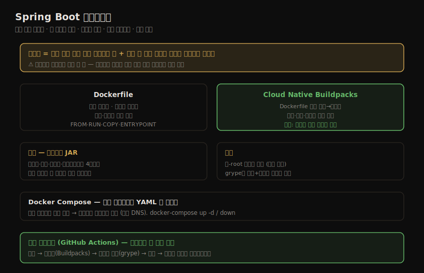
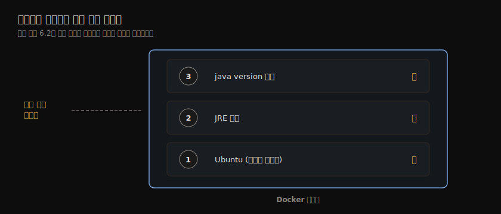
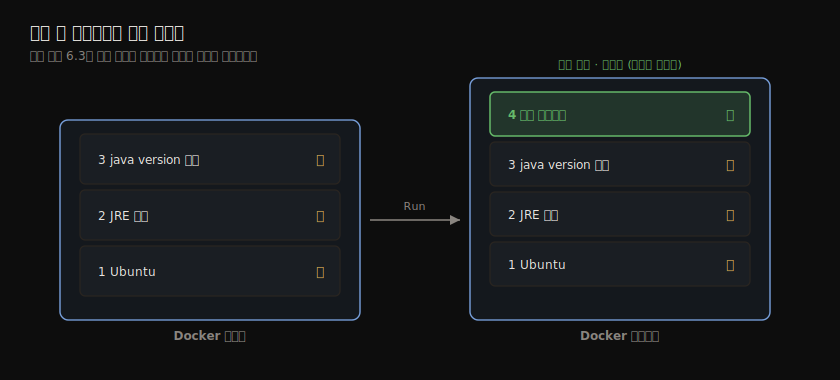
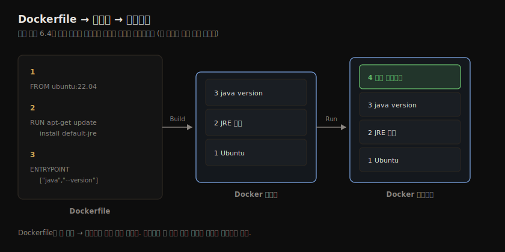
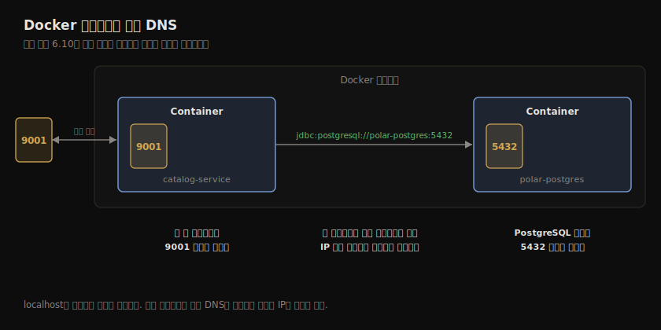
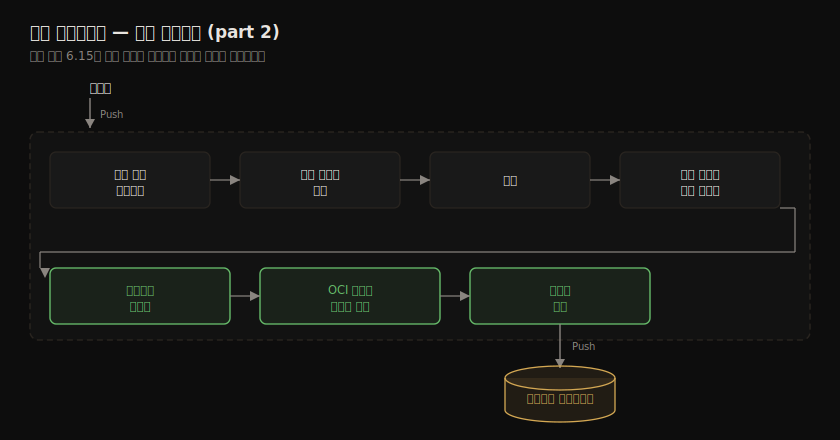

# Spring Boot 컨테이너화
---
> Catalog Service를 쿠버네티스에 올리기 전, Spring Boot 앱을 컨테이너 이미지로 패키징하고 그 생애주기를 다루는 법을 정리합니다. OCI 이미지의 레이어 구조부터 Dockerfile과 Cloud Native Buildpacks 두 방식, 여러 컨테이너를 묶는 Docker Compose, 그리고 GitHub Actions로 이미지 빌드·게시를 자동화하는 커밋 스테이지까지 이어집니다.


## 핵심 요약

컨테이너 이미지는 안에 든 애플리케이션을 실행하는 데 필요한 모든 것을 담은 가볍고 실행 가능한 패키지입니다. 이미지는 **순서 있는 읽기 전용 레이어**들로 구성되고, 각 레이어는 하나의 명령이 만든 변경분입니다. 맨 아래가 베이스 이미지이고 그 위로 변경이 쌓입니다. 이미지를 컨테이너로 실행하면 맨 위에 쓰기 가능한 컨테이너 레이어가 하나 더 얹히는데, 이 레이어는 휘발성이라 컨테이너를 지우면 사라집니다. 레이어가 모두 읽기 전용이라는 점은 보안 함의가 있습니다. 하위 레이어에 시크릿을 두면 상위에서 지워도 원본 레이어에 남아 노출되므로, 비밀번호·암호화 키를 이미지에 넣어선 안 됩니다.

Spring Boot 앱을 이미지로 만드는 길은 두 가지입니다. **Dockerfile**은 명령을 나열한 레시피로, 세밀한 통제권을 주지만 성능·보안을 직접 챙겨야 합니다. **Cloud Native Buildpacks**는 Dockerfile 없이 소스 코드에서 곧장 프로덕션급 OCI 이미지를 만들어 주고, 보안·성능·재현성을 자동으로 처리합니다. 저자의 권고는 "특별한 이유가 없으면 Buildpacks를 쓰라"입니다. Spring Boot 플러그인에 Buildpacks가 통합돼 있어 `./gradlew bootBuildImage` 한 줄로 이미지를 만듭니다.

성능을 위해서는 Spring Boot 2.3+의 **레이어드 JAR**(layered-JAR)를 씁니다. JAR를 의존성·로더·스냅샷 의존성·애플리케이션 네 레이어로 나눠, 자주 바뀌는 내 코드만 별도 레이어에 두면 변경 시 그 레이어만 다시 빌드·전송됩니다. 보안을 위해서는 root가 아닌 전용 사용자로 실행하고, 이미지를 grype로 취약점 스캔합니다. 여러 컨테이너는 Docker CLI 대신 **Docker Compose**(YAML)로 묶어 함께 관리하고, 같은 네트워크에 두면 Docker 내장 DNS로 컨테이너 이름으로 서로를 찾습니다. 마지막으로 **GitHub Actions** 커밋 스테이지에 패키징·스캔·게시 단계를 더해, 한 번 빌드한 이미지를 릴리스 후보로 컨테이너 레지스트리에 올립니다.




## 학습 목표

이 장을 읽고 나면 다음을 할 수 있어야 합니다.

- 컨테이너 이미지의 레이어 구조(읽기 전용 레이어 + 쓰기 가능한 컨테이너 레이어)와 copy-on-write를 설명합니다.
- Dockerfile의 주요 명령(FROM·RUN·COPY·ENTRYPOINT 등)으로 이미지를 정의하고, `docker build`·`run`·`push`로 다룹니다.
- 포트 포워딩과 Docker 내장 DNS(컨테이너 이름으로 통신)를 이해합니다.
- 레이어드 JAR + 멀티 스테이지 빌드로 효율적인 이미지를 만들고, 비-root 사용자·취약점 스캔으로 보안을 강화합니다.
- Cloud Native Buildpacks(Paketo)로 Dockerfile 없이 이미지를 만들고 레지스트리에 게시합니다.
- Docker Compose로 여러 컨테이너를 묶어 관리하고, 컨테이너 디버깅을 설정합니다.
- GitHub Actions 커밋 스테이지에 패키징·스캔·게시 단계를 추가합니다.


## 본문 정리

### Docker에서 컨테이너 이미지 다루기

Docker Engine은 클라이언트/서버 구조입니다. Docker CLI(클라이언트)가 Docker 서버와 통신하고, 서버는 Docker 데몬을 통해 이미지·컨테이너·네트워크 같은 자원을 관리하며 컨테이너 레지스트리와 이미지를 주고받습니다.

#### 컨테이너 이미지 이해 — 레이어

컨테이너 이미지는 순서 있는 명령 실행의 산물이고, 각 명령이 하나의 레이어를 만듭니다. 보통 베이스 이미지에서 시작해 그 위에 변경을 쌓습니다. 예를 들어 ① Ubuntu를 베이스로 ② JRE 설치 ③ `java --version` 실행 — 세 명령이 각각 레이어가 됩니다.



모든 레이어는 **읽기 전용**입니다. 한 번 적용되면 못 바꾸고, 바꾸려면 그 위에 새 레이어를 얹습니다. 상위 레이어 변경은 하위에 영향을 주지 않습니다. 이를 **copy-on-write**라 합니다. 원본의 복사본을 상위 레이어에 만들고, 변경은 원본이 아니라 복사본에 적용됩니다.

이미지를 컨테이너로 실행하면 기존 레이어들 위에 마지막 레이어 하나가 자동으로 얹힙니다. **컨테이너 레이어**는 유일하게 쓰기 가능하고, 실행 중 만들어지는 데이터를 저장합니다. 쓰기 가능하지만 휘발성이라, 컨테이너를 지우면 그 레이어에 저장된 모든 것이 사라집니다.



> ⚠️ 레이어가 모두 읽기 전용이라는 점은 보안 함의가 있습니다. 하위 레이어에 시크릿·민감 정보를 절대 두지 마세요. 상위 레이어에서 지워도 하위에 그대로 남아 접근 가능합니다. 비밀번호·암호화 키를 이미지에 패키징해선 안 됩니다.

#### Dockerfile로 이미지 만들기

OCI 형식을 따라, 명령 시퀀스를 **Dockerfile**이라는 파일에 나열해 이미지를 정의합니다. 각 명령은 `INSTRUCTION arguments` 형식입니다.

```dockerfile
FROM ubuntu:22.04                                      # 베이스 이미지
RUN apt-get update && apt-get install -y default-jre   # JRE 설치 (새 레이어)
ENTRYPOINT ["java", "--version"]                       # 컨테이너 실행 진입점
```

> ENTRYPOINT를 지정하지 않으면 컨테이너가 실행 파일로 동작하지 않습니다. 컨테이너는 VM과 달리 운영체제가 아니라 작업(task)을 실행하기 위한 것이라, `docker run ubuntu`는 진입점 작업이 없어 바로 종료됩니다.

주요 Dockerfile 명령은 다음과 같습니다.

| 명령 | 설명 | 예 |
|---|---|---|
| `FROM` | 베이스 이미지 지정 (첫 명령이어야 함) | `FROM ubuntu:22.04` |
| `LABEL` | 키/값 메타데이터 추가 | `LABEL version="1.2.1"` |
| `ARG` | 빌드 시점에 전달할 변수 정의 | `ARG JAR_FILE` |
| `RUN` | 새 레이어에서 명령 실행 | `RUN apt-get install ...` |
| `COPY` | 호스트 파일을 컨테이너로 복사 | `COPY app.jar app.jar` |
| `USER` | 이후 명령·실행을 수행할 사용자 지정 | `USER spring` |
| `ENTRYPOINT` | 컨테이너 실행 시 실행할 프로그램 (마지막 것만 적용) | `ENTRYPOINT ["/bin/bash"]` |
| `CMD` | 실행 컨테이너 기본값 (ENTRYPOINT 있으면 인자로 전달) | `CMD ["sleep", "10"]` |

```bash
docker build -t my-java-image:1.0.0 .   # Dockerfile → 이미지 (마지막 점 주의)
docker run --rm my-java-image:1.0.0     # 이미지 → 컨테이너 (--rm: 종료 후 자동 제거)
```



> 레이어 방식은 빌드를 빠르게 합니다. 각 레이어는 이전 레이어와의 델타이고 Docker가 모두 캐시합니다. 하나만 바꾸면 그 레이어와 이후만 다시 만들고, 레지스트리에서 새 버전을 받을 때도 바뀐 레이어만 내려받습니다. 그래서 **자주 바뀌는 명령일수록 Dockerfile 뒤쪽에 두라**고 권합니다.

#### GitHub Container Registry에 게시

컨테이너 레지스트리는 이미지에 대해 Maven 저장소가 Java 라이브러리에 대한 것과 같은 역할입니다. Docker 설치 시 기본은 Docker Hub(`docker.io`)입니다. 이 책은 GitHub Container Registry(`ghcr.io`)를 씁니다. 개인 계정에서 무료(공개 저장소)이고, 공개 이미지를 익명·무제한으로 받을 수 있으며, 소스 코드와 통합되고, 용도별 토큰(PAT)을 발급할 수 있기 때문입니다. GitHub Actions에서 접근하면 PAT 없이도 토큰이 자동 구성됩니다.

이미지 이름은 `<registry>/<namespace>/<name>[:<tag>]` 규칙을 따릅니다. Docker Hub는 호스트명을 생략하고, GitHub은 `ghcr.io`를 명시해야 합니다. 네임스페이스는 사용자명을 소문자로 씁니다. 태그를 안 주면 `latest`가 기본입니다.

```bash
docker login ghcr.io                                                  # PAT로 인증
docker tag my-java-image:1.0.0 ghcr.io/<username>/my-java-image:1.0.0 # 완전 수식 이름 부여
docker push ghcr.io/<username>/my-java-image:1.0.0                    # 게시
```

> PAT는 `write:packages` 스코프로 발급하고, 값은 한 번만 보여 주므로 저장해 둡니다. 게시한 이미지 저장소는 기본 비공개입니다.

### Spring Boot 앱을 컨테이너 이미지로 패키징

#### 컨테이너화 준비 — 포트 포워딩과 Docker DNS

컨테이너는 격리된 컨텍스트(자원·네트워크)에서 실행되므로 두 문제가 생깁니다. 네트워크로 앱에 어떻게 도달할지, 다른 컨테이너와 어떻게 상호작용할지입니다.

**포트 포워딩**(포트 매핑)으로 컨테이너화된 앱을 외부에서 접근하게 합니다. 컨테이너는 기본적으로 Docker 호스트 안 격리 네트워크에 속합니다. `docker run -p 9001:9001`에서 앞이 외부 포트, 뒤가 컨테이너 포트입니다.

**Docker 내장 DNS 서버**로 같은 네트워크의 컨테이너끼리 호스트명·IP가 아니라 컨테이너 이름으로 서로를 찾습니다. localhost는 컨테이너 내부를 가리키므로, 컨테이너 안 Catalog Service는 `jdbc:postgresql://localhost:5432`로 PostgreSQL에 닿지 못합니다. 대신 컨테이너 이름을 써서 `jdbc:postgresql://polar-postgres:5432`로 호출합니다.



```bash
docker network create catalog-network                     # 네트워크 생성
docker run -d --name polar-postgres --net catalog-network \
    -e POSTGRES_USER=user -e POSTGRES_PASSWORD=password \
    -e POSTGRES_DB=polardb_catalog -p 5432:5432 postgres:14.4
```

#### Dockerfile로 컨테이너화

클라우드 네이티브 앱은 자기완결적(self-contained)입니다. Spring Boot는 런타임 환경만 빼고 필요한 모든 것을 담은 독립 실행 JAR로 패키징하므로, 이미지에는 OS·JRE·JAR만 있으면 됩니다.

```dockerfile
FROM eclipse-temurin:17                                # JRE 내장 베이스 이미지
WORKDIR workspace                                      # 작업 디렉토리
ARG JAR_FILE=build/libs/*.jar                          # JAR 위치 빌드 인자
COPY ${JAR_FILE} catalog-service.jar                   # JAR 복사
ENTRYPOINT ["java", "-jar", "catalog-service.jar"]     # 실행 진입점
```

```bash
./gradlew clean bootJar                  # JAR 빌드
docker build -t catalog-service .        # 이미지 빌드 (Maven은 --build-arg JAR_FILE=target/*.jar)
docker run -d --name catalog-service --net catalog-network -p 9001:9001 \
    -e SPRING_DATASOURCE_URL=jdbc:postgresql://polar-postgres:5432/polardb_catalog \
    -e SPRING_PROFILES_ACTIVE=testdata catalog-service
```

> `localhost`를 가리키던 `spring.datasource.url`을 환경변수 `SPRING_DATASOURCE_URL`로 덮어, localhost를 컨테이너 이름 `polar-postgres`로 바꿉니다. 4장의 외부화 설정이 그대로 쓰입니다.

#### 프로덕션 이미지 — 성능

레이어드 아키텍처는 빌드 시점과 실행 시점 모두에서 캐싱·재사용 이점을 줍니다. 그런데 독립 실행 JAR를 통째로 한 레이어에 복사하면, 앱을 조금만 바꿔도 그 레이어 전체를 다시 빌드합니다. REST 엔드포인트 하나만 추가해도 모든 Spring 라이브러리까지 함께 다시 빌드되는 셈입니다.

Spring Boot 2.3+의 **레이어드 JAR** 모드(2.4+ 기본값)가 이를 개선합니다. JAR를 다음 네 레이어로 나눕니다(아래부터).

- **dependencies** — 주요 의존성 (자주 안 바뀜)
- **spring-boot-loader** — Spring Boot 로더 클래스
- **snapshot-dependencies** — 스냅샷 의존성
- **application** — 내 애플리케이션 클래스·리소스 (자주 바뀜)

자주 바뀌는 내 코드(application)를 자주 안 바뀌는 의존성과 다른 레이어에 두면, 엔드포인트를 추가해도 application 레이어만 다시 빌드·전송됩니다. **멀티 스테이지 빌드**로 1단계에서 JAR 레이어를 추출하고, 2단계에서 각 레이어를 별도 이미지 레이어로 둡니다. 원본 JAR는 1단계와 함께 버려집니다.

```dockerfile
FROM eclipse-temurin:17 AS builder                      # 1단계
WORKDIR workspace
ARG JAR_FILE=build/libs/*.jar
COPY ${JAR_FILE} catalog-service.jar
RUN java -Djarmode=layertools -jar catalog-service.jar extract   # 레이어 추출

FROM eclipse-temurin:17                                 # 2단계
WORKDIR workspace
COPY --from=builder workspace/dependencies/ ./
COPY --from=builder workspace/spring-boot-loader/ ./
COPY --from=builder workspace/snapshot-dependencies/ ./
COPY --from=builder workspace/application/ ./
ENTRYPOINT ["java", "org.springframework.boot.loader.JarLauncher"]   # 레이어에서 실행
```

#### 프로덕션 이미지 — 보안

컨테이너는 기본적으로 root 사용자로 실행돼 Docker 호스트에 root 접근을 얻을 위험이 있습니다. 최소 권한 원칙에 따라 비-권한 사용자를 만들어 진입점 프로세스를 실행합니다.

```dockerfile
FROM eclipse-temurin:17
RUN useradd spring           # spring 사용자 생성
USER spring                  # spring을 현재 사용자로
WORKDIR workspace
# ... (레이어 COPY)
ENTRYPOINT ["java", "org.springframework.boot.loader.JarLauncher"]
```

최신 베이스 이미지·라이브러리를 쓰고, 이미지를 grype로 취약점 스캔하는 것이 모범 사례입니다. 코드베이스뿐 아니라 이미지도 스캔해야 하는데, 이미지에는 코드 분석에 없던 시스템 라이브러리가 들어 있기 때문입니다.

```bash
docker build -t catalog-service .
grype catalog-service        # 이미지 취약점 스캔
```

#### Dockerfile냐 Buildpacks냐

Dockerfile은 강력하고 세밀한 통제권을 주지만, 관리 부담이 크고 가치 흐름에 여러 과제를 남깁니다. 개발자는 성능·보안 관심사보다 코드에 집중하고 싶고, 운영자는 조직 전체에서 Dockerfile 준수를 통제·동기화하기 어렵습니다.

Cloud Native Buildpacks는 일관성·보안·성능·거버넌스에 초점을 둔 다른 접근입니다. 개발자는 Dockerfile 없이 소스 코드에서 프로덕션급 이미지를 자동 생성하고, 운영자는 조직 전체의 산출물을 정의·통제·보안합니다.

> 저자의 일반 권고: **특별한 이유가 없으면 Buildpacks를 쓰라.** 둘 다 유효하고 프로덕션에서 쓰입니다. (Dockerfile 없이 Java 앱을 이미지로 만드는 또 다른 선택지로 Google의 Jib도 있습니다.)

#### Cloud Native Buildpacks로 컨테이너화

Cloud Native Buildpacks는 CNCF 프로젝트로, "애플리케이션 소스 코드를 어느 클라우드에서나 실행 가능한 이미지로 변환"합니다. Heroku·Pivotal의 PaaS 운영 경험에서 발전했고, Spring Boot 2.3+부터 Gradle·Maven 플러그인에 통합돼 별도 CLI(`pack`) 설치가 필요 없습니다. 앱 유형 자동 감지, 캐싱·레이어링, 재현 가능한 빌드, 보안 모범 사례, GraalVM 네이티브 이미지를 지원합니다.

컨테이너 생성은 빌더 이미지가 조율하고, Spring Boot 플러그인은 Paketo Buildpacks 빌더를 씁니다. 빌드팩 시퀀스는 모듈식·커스터마이즈 가능합니다(빌드팩 추가·교체, 빌더 교체).

```groovy
bootBuildImage {                              // Buildpacks로 OCI 이미지 빌드 태스크
  imageName = "${project.name}"               // 이미지 이름 (로컬은 latest 태그)
  environment = ["BP_JVM_VERSION" : "17.*"]   // 설치할 JVM 버전
}
```

```bash
./gradlew bootBuildImage     # Dockerfile 없이 이미지 생성
```

Spring Boot 2.4+부터 플러그인이 이미지를 레지스트리에 직접 게시할 수 있습니다. 인증 정보는 Gradle 프로퍼티로 외부화해, 유연성(레지스트리 교체)과 보안(토큰을 버전 관리에 넣지 않음)을 확보합니다.

```groovy
bootBuildImage {
  imageName = "${project.name}"
  environment = ["BP_JVM_VERSION" : "17.*"]
  docker {
    publishRegistry {
      username = project.findProperty("registryUsername")
      password = project.findProperty("registryToken")
      url = project.findProperty("registryUrl")
    }
  }
}
```

```bash
./gradlew bootBuildImage \
    --imageName ghcr.io/<username>/catalog-service \
    --publishImage \
    -PregistryUrl=ghcr.io -PregistryUsername=<username> -PregistryToken=<token>
```

> 자격 증명의 황금률: **비밀번호를 절대 넘기지 말 것.** 서비스에 자원 접근을 위임해야 하면 비밀번호 대신 액세스 토큰을 씁니다.

> ⚠️ 지금까지 암묵적 `latest` 태그를 썼습니다. 프로덕션에서는 권장되지 않습니다(버전 처리는 15장).

### Docker Compose로 컨테이너 관리

컨테이너가 여럿이면 Docker CLI는 번거롭습니다. 명령이 길어 오류가 잦고 읽기 어렵고 버전 관리가 까다롭습니다. Docker Compose는 YAML 파일로 어떤 컨테이너를 어떤 특성으로 실행할지 기술하고, 생애주기를 함께 관리합니다.

#### Compose로 생애주기 관리

`docker-compose.yml`의 두 루트 섹션은 `version`(문법 버전)과 `services`(실행할 컨테이너 명세)입니다. `volumes`·`networks`는 선택입니다.

```yaml
version: "3.8"
services:
  catalog-service:
    depends_on:
      - polar-postgres                        # PostgreSQL 다음에 시작
    image: "catalog-service"
    container_name: "catalog-service"
    ports:
      - 9001:9001
    environment:
      - BPL_JVM_THREAD_COUNT=50               # Paketo: JVM 스택 메모리 스레드 수
      - SPRING_DATASOURCE_URL=jdbc:postgresql://polar-postgres:5432/polardb_catalog
      - SPRING_PROFILES_ACTIVE=testdata

  polar-postgres:
    image: "postgres:14.4"
    container_name: "polar-postgres"
    ports:
      - 5432:5432
    environment:
      - POSTGRES_USER=user
      - POSTGRES_PASSWORD=password
      - POSTGRES_DB=polardb_catalog
```

> 네트워크를 명시하지 않으면 Compose가 자동으로 하나 만들어 모든 컨테이너를 넣습니다. 그래서 컨테이너 이름으로 서로를 호출할 수 있습니다.

```bash
docker-compose up -d      # 백그라운드(detached)로 시작
docker-compose down       # 중지·제거
```

#### Spring Boot 컨테이너 디버깅

컨테이너 안에서 도는 프로세스는 로컬에 없어 IDE가 디버거를 바로 붙이지 못합니다. Paketo 이미지는 디버그 모드용 환경변수(`BPL_DEBUG_ENABLED`·`BPL_DEBUG_PORT`)를 지원합니다. JVM이 디버그 연결을 듣게 하고, 디버그 포트를 컨테이너 밖으로 노출한 뒤, IDE 원격 디버거를 그 포트에 연결합니다.

```yaml
catalog-service:
    ports:
      - 9001:9001
      - 8001:8001                        # 디버그 포트 노출
    environment:
      - BPL_DEBUG_ENABLED=true           # 디버그 연결 수락 (Buildpacks 제공)
      - BPL_DEBUG_PORT=8001              # 디버그 포트
      # ...
```

### 배포 파이프라인 — 패키징과 게시

3장에서 시작한 배포 파이프라인의 커밋 스테이지를 이어 갑니다. 커밋 스테이지는 빌드·단위 테스트·통합 테스트·정적 분석·패키징을 거쳐 실행 가능한 산출물(릴리스 후보)을 레지스트리에 게시합니다.

#### 커밋 스테이지에서 릴리스 후보 빌드

지속적 전달과 15-Factor의 핵심 원칙은 **산출물을 한 번만 빌드**하는 것입니다. 커밋 스테이지 끝에서 만든 컨테이너 이미지를 이후 모든 단계에서 재사용합니다. 어느 단계에서든 문제(테스트 실패)가 드러나면 릴리스 후보는 기각되고, 모든 단계를 통과하면 프로덕션 배포 준비가 된 것입니다.

산출물을 빌드한 뒤 게시 전에 추가 작업을 할 수 있습니다. grype로 이미지를 취약점 스캔하는 것이 그 예입니다. 이미지에는 코드 스캔에 없던 시스템 라이브러리가 있어, 코드베이스와 산출물을 모두 스캔해야 합니다. 게시 후에는 Sigstore 같은 도구로 이미지에 서명해 정당한 이미지임을 보장할 수도 있습니다.



#### GitHub Actions로 이미지 게시

워크플로 정의는 저장소 루트의 `.github/workflows`에 둡니다. 환경변수로 레지스트리·이미지 이름·버전 같은 사실을 저장하면 쉽게 바꿀 수 있습니다.

```yaml
name: Commit Stage
on: push

env:
  REGISTRY: ghcr.io                                    # GitHub Container Registry
  IMAGE_NAME: <username>/catalog-service               # 소문자 사용자명
  VERSION: latest                                      # 당분간 latest 태그
```

`build` 잡이 성공하고 main 브랜치일 때 실행되는 `package` 잡을 더합니다. Buildpacks로 패키징하되, 먼저 스캔하려고 바로 push하지는 않습니다.

```yaml
jobs:
  build:
    ...
  package:
    name: Package and Publish
    if: ${{ github.ref == 'refs/heads/main' }}   # main 브랜치에서만
    needs: [ build ]                             # build 성공 시에만
    runs-on: ubuntu-22.04
    permissions:
      contents: read                             # 저장소 체크아웃
      packages: write                            # 레지스트리 업로드
      security-events: write                     # 보안 이벤트 제출
    steps:
      - name: Checkout source code
        uses: actions/checkout@v3
      - name: Set up JDK
        uses: actions/setup-java@v3
        with:
          distribution: temurin
          java-version: 17
          cache: gradle
      - name: Build container image
        run: |
          chmod +x gradlew
          ./gradlew bootBuildImage \
            --imageName ${{ env.REGISTRY }}/${{ env.IMAGE_NAME }}:${{ env.VERSION }}
```

이어서 grype로 이미지를 스캔해 보고서를 GitHub에 올리고, 레지스트리에 인증한 뒤 push합니다.

```yaml
      - name: OCI image vulnerability scanning
        uses: anchore/scan-action@v3
        id: scan
        with:
          image: ${{ env.REGISTRY }}/${{ env.IMAGE_NAME }}:${{ env.VERSION }}
          fail-build: false                            # 취약점 있어도 빌드 실패 안 함
          severity-cutoff: high
          acs-report-enable: true
      - name: Upload vulnerability report
        uses: github/codeql-action/upload-sarif@v2     # SARIF 보고서 업로드
        if: success() || failure()
        with:
          sarif_file: ${{ steps.scan.outputs.sarif }}
      - name: Log into container registry
        uses: docker/login-action@v2
        with:
          registry: ${{ env.REGISTRY }}
          username: ${{ github.actor }}                # GitHub Actions 제공
          password: ${{ secrets.GITHUB_TOKEN }}        # GitHub Actions 제공
      - name: Publish container image
        run: docker push ${{ env.REGISTRY }}/${{ env.IMAGE_NAME }}:${{ env.VERSION }}
```

> GitHub Actions에서 게시하고 저장소 이름을 딴 이미지는 자동으로 소스 코드와 연결됩니다. 이미지 가시성은 연결된 코드 저장소를 따릅니다.

> ⚠️ 취약점 보고서 업로드(`upload-sarif`)는 공개 저장소가 필요합니다(엔터프라이즈 구독이면 비공개도 가능). 비공개로 두려면 이 단계를 건너뜁니다.


## 심화 학습

### `org.springframework.boot.loader.JarLauncher`의 패키지 변화

책(2021, Spring Boot 2.7)은 레이어드 JAR 진입점으로 `org.springframework.boot.loader.JarLauncher`를 씁니다. Spring Boot 3.2부터 로더 클래스가 `org.springframework.boot.loader.launch.JarLauncher`로 이동했습니다(공식 레퍼런스 "Executable Jar Format"). Spring Boot 3.2+ 기반 Dockerfile을 직접 쓴다면 진입점을 새 패키지로 바꿔야 합니다. Buildpacks를 쓰면 이 변화를 도구가 알아서 처리하므로 신경 쓸 일이 없습니다. 이는 책 출간 후 변한 API라 공식 docs로 교차검증해 적었습니다.

### Paketo의 빌더와 스택, 그리고 ARM64

본문은 Paketo가 Bellsoft Liberica OpenJDK를 기본 빌드팩으로 쓴다고 짚습니다. Paketo의 구조는 빌더(builder) = 빌드팩 시퀀스 + 스택(stack, 빌드·실행 베이스 이미지)으로 나뉩니다(paketo.io). 책 출간 시점에는 ARM64 지원이 실험적이라 Apple Silicon에서 `--platform linux/amd64`나 실험 빌더가 필요했지만, 현재 Paketo 스택은 멀티 아키텍처(ARM64 포함)를 정식 지원합니다. Apple Silicon에서도 추가 인자 없이 네이티브로 빌드됩니다.

### `docker-compose`(v1) vs `docker compose`(v2)

책은 `docker-compose`(하이픈) 명령을 씁니다. 이는 Python 기반 Compose v1입니다. 현재 표준은 Go로 재작성돼 Docker CLI에 플러그인으로 통합된 **Compose v2**(`docker compose`, 공백)입니다. v1은 2023년 수명 종료됐습니다. `docker-compose.yml` 파일 형식은 그대로 호환되고, 명령만 `docker compose up -d`처럼 바뀝니다. 또한 v2부터 `version:` 최상위 키는 더 이상 필요 없습니다(deprecated).

### 레이어드 JAR vs uber-JAR — 왜 이미지에서만 문제인가

uber-JAR(전통 독립 실행 JAR)는 모든 의존성·클래스·리소스를 한 압축 파일에 담습니다. JVM이 직접 실행할 때는 문제가 없지만, **컨테이너 이미지에 넣을 때만** 비효율이 드러납니다. 한 레이어에 통째로 들어가면 캐시 단위가 JAR 전체가 되기 때문입니다. 레이어드 JAR는 JAR 내부 폴더 구조를 변경 빈도에 따라 갈라, 이미지 레이어 캐싱과 결합시킵니다. 이미지 빌드·전송 최적화가 목적이지, JVM 실행 자체를 빠르게 하는 것은 아닙니다.


## 실무 적용 포인트

**이런 상황에서 사용하세요.**

- Spring Boot 앱을 이미지로 만들 때, 특별한 통제 요구가 없으면 Buildpacks(`bootBuildImage`)를 씁니다. Dockerfile은 베이스 이미지·OS 패키지를 세밀히 통제해야 할 때 선택합니다.
- 로컬에서 앱+DB+설정서버 같은 여러 컨테이너를 함께 띄울 때 Docker Compose로 한 파일에 묶습니다.
- CI에서 한 번 빌드한 이미지를 릴리스 후보로 삼아 이후 단계에 재사용합니다. GitHub Actions 커밋 스테이지에 패키징·스캔·게시를 넣습니다.

**주의할 점.**

- ⚠️ 시크릿을 이미지 레이어에 넣지 마세요. 상위에서 지워도 하위 읽기 전용 레이어에 남습니다. 환경변수·시크릿 매니저로 주입합니다.
- ⚠️ 컨테이너를 root로 실행하지 마세요. `useradd` + `USER`로 비-권한 사용자를 만듭니다(최소 권한 원칙).
- ⚠️ 코드베이스만 스캔하고 이미지를 안 스캔하면 시스템 라이브러리 취약점을 놓칩니다. 둘 다 grype로 스캔합니다.
- ⚠️ 자격 증명에 비밀번호 대신 토큰을 쓰고, 토큰을 버전 관리에 넣지 마세요. Gradle 프로퍼티·GitHub Secrets로 외부화합니다.
- ⚠️ 프로덕션에서 `latest` 태그에 의존하지 마세요. 같은 태그가 다른 이미지를 가리켜 재현성이 깨집니다(버전 전략은 15장).


## 면접 대비

**한 줄 정의** — 컨테이너화는 Spring Boot 앱과 실행에 필요한 모든 것을 읽기 전용 레이어로 쌓은 OCI 이미지로 패키징해, 어느 환경에서나 동일하게 실행 가능한 산출물을 만드는 것입니다.

**핵심 포인트 세 가지**

- 이미지는 읽기 전용 레이어의 합이고, 실행 시 쓰기 가능한 휘발성 컨테이너 레이어가 얹힙니다. 시크릿을 레이어에 두면 안 됩니다.
- 레이어드 JAR로 자주 바뀌는 코드와 안 바뀌는 의존성을 분리하면 이미지 빌드·전송이 효율적입니다.
- 산출물은 한 번만 빌드합니다. 커밋 스테이지에서 만든 이미지가 릴리스 후보이고, 이후 단계에서 재사용됩니다.

**자주 묻는 질문**

- *Dockerfile과 Buildpacks 중 무엇을 쓰나?* — Dockerfile은 세밀한 통제권을 주지만 성능·보안을 직접 챙겨야 합니다. Buildpacks는 소스에서 곧장 프로덕션급 이미지를 만들고 보안·성능·재현성을 자동 처리합니다. 특별한 이유가 없으면 Buildpacks를 권합니다.
- *레이어드 JAR가 왜 효율적인가?* — JAR를 의존성·로더·스냅샷·애플리케이션 네 레이어로 나눠, 자주 바뀌는 내 코드만 별도 레이어에 둡니다. 변경 시 그 레이어만 다시 빌드·전송되어 클라우드 대역폭·시간을 아낍니다.
- *컨테이너 안 앱이 다른 컨테이너 DB에 어떻게 닿나?* — 같은 Docker 네트워크에 두면 내장 DNS가 컨테이너 이름으로 해석합니다. localhost가 아니라 `jdbc:postgresql://polar-postgres:5432`처럼 컨테이너 이름을 씁니다.
- *왜 컨테이너를 root로 실행하면 안 되나?* — root 컨테이너가 침해되면 Docker 호스트에 root 접근을 얻을 위험이 있습니다. 최소 권한 원칙에 따라 비-권한 사용자로 진입점을 실행합니다.
- *산출물을 한 번만 빌드한다는 원칙은 왜 중요한가?* — 단계마다 다시 빌드하면 "테스트한 것과 배포한 것이 다른" 문제가 생깁니다. 커밋 스테이지에서 만든 이미지를 끝까지 재사용해야 검증의 의미가 보존됩니다.


## 핵심 개념 체크리스트

- [ ] 컨테이너 이미지의 읽기 전용 레이어와 실행 시 추가되는 쓰기 가능한 컨테이너 레이어를 구분할 수 있다.
- [ ] copy-on-write와, 시크릿을 레이어에 두면 안 되는 보안 이유를 설명할 수 있다.
- [ ] Dockerfile 주요 명령(FROM·RUN·COPY·ENTRYPOINT·USER)의 역할을 안다.
- [ ] 포트 포워딩과 Docker 내장 DNS(컨테이너 이름 통신)의 차이를 안다.
- [ ] 레이어드 JAR 네 레이어와, 멀티 스테이지 빌드로 이미지를 효율화하는 방식을 설명할 수 있다.
- [ ] 비-root 사용자 실행과 이미지 취약점 스캔(grype)의 필요성을 안다.
- [ ] Dockerfile과 Buildpacks의 트레이드오프, 저자의 권고(특별한 이유 없으면 Buildpacks)를 안다.
- [ ] `bootBuildImage`로 이미지를 빌드·게시하고, 인증 정보를 외부화하는 이유를 안다.
- [ ] Docker Compose의 services·environment 구조와 자동 네트워크 생성을 안다.
- [ ] 산출물 한 번만 빌드 원칙과, 커밋 스테이지의 패키징·스캔·게시 흐름을 설명할 수 있다.


## 참고 자료

- *Cloud Native Spring in Action*, Thomas Vitale (Manning, 2021) — 6장 「Containerizing Spring Boot」
- Spring Boot Reference — Container Images — https://docs.spring.io/spring-boot/reference/packaging/container-images/index.html
- Cloud Native Buildpacks — https://buildpacks.io
- Paketo Buildpacks — https://paketo.io
- Open Container Initiative — https://opencontainers.org
- grype (취약점 스캐너) — https://github.com/anchore/grype
- 같은 책 5장: [클라우드 데이터 영속화와 관리](05.클라우드%20데이터%20영속화와%20관리.md) — 컨테이너로 띄운 PostgreSQL과 이어짐
