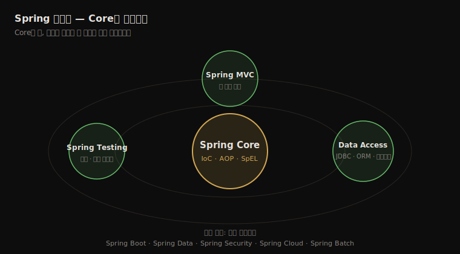
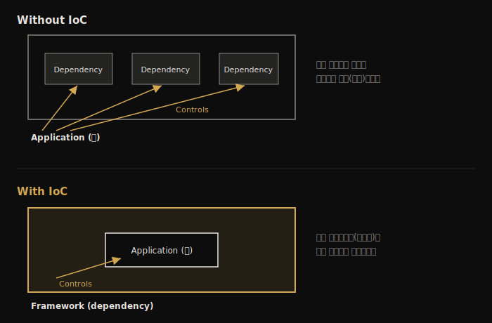

# Spring과 프레임워크
---
> Spring을 코드로 다루기 전에, 프레임워크가 무엇이고 언제 써야 하며 언제 피해야 하는지를 먼저 정리합니다. Spring은 단일 프레임워크가 아니라 여러 프로젝트로 이뤄진 생태계라는 점, 그 중심에 IoC(제어의 역전)가 있다는 점, 그리고 백엔드 말고도 쓰임새가 넓다는 점이 1장의 뼈대입니다.

## 핵심 요약

프레임워크는 애플리케이션을 만들 때 매번 밑바닥부터 짜야 할 공통 기능을 미리 제공하는 골격입니다. Spring은 그런 프레임워크 중 자바 생태계에서 가장 널리 쓰이며, 정확히 말하면 하나의 프레임워크가 아니라 Spring Core·Spring Data·Spring Boot 같은 여러 프로젝트가 모인 생태계입니다. 이 생태계의 중심에는 IoC(Inversion of Control, 제어의 역전)가 있어, 애플리케이션이 직접 흐름을 통제하는 대신 프레임워크가 객체 생성과 메서드 호출을 대신 맡습니다. 다만 프레임워크가 늘 정답은 아니며, 작은 footprint가 필요하거나 보안상 커스텀 코드만 허용되는 상황에서는 일부러 쓰지 않는 판단도 필요합니다.

## 학습 목표

> 이 내용을 읽고 나면 다음을 할 수 있습니다.

1. 프레임워크가 무엇이고 어떤 가치를 주는지 한 문장으로 설명할 수 있습니다.
2. Spring이 단일 프레임워크가 아니라 생태계라는 점과 그 핵심 프로젝트를 구분할 수 있습니다.
3. IoC가 무엇이고 "제어의 역전"이라는 이름이 어디서 왔는지 설명할 수 있습니다.
4. Spring을 백엔드 외에 어떤 시나리오에 쓸 수 있는지 예를 들 수 있습니다.
5. 프레임워크를 쓰지 말아야 할 상황 네 가지를 판단 근거와 함께 말할 수 있습니다.

## 본문 정리

### 1. 프레임워크란 무엇인가

프레임워크는 애플리케이션을 그 위에 얹어 짓는 공통 기능의 묶음입니다. 로깅, 트랜잭션, 보안, 애플리케이션 간 통신, 캐싱 같은 기능은 거의 모든 앱이 똑같이 필요로 합니다. 앱마다 이런 기능을 새로 짜는 대신 검증된 구현을 가져다 쓰면, 시간과 비용을 아끼고 버그 가능성을 줄이며, 같은 기능을 이해하는 개발자 커뮤니티의 도움까지 얻습니다.

> 💬 **비유**: 프레임워크는 Ikea 같은 조립가구 매장과 비슷합니다. 옷장을 주문했는데 조립된 완제품이 아니라 부품과 설명서가 오는 것이 가구점이라면, 프레임워크는 한술 더 떠 *옷장·책상·식탁을 만들 수 있는 모든 부품*을 한꺼번에 보냅니다. 그중 옷장에 맞는 부품을 골라 조립하는 것은 개발자의 몫입니다. 어떤 기능을 골라 어떻게 조립할지는 만들려는 앱의 요구사항이 정합니다.

여기서 중요한 구분이 하나 나옵니다. 앱 코드는 **비즈니스 로직**과 **플럼버(plumbing, 배관)**로 나뉩니다. 비즈니스 로직은 "링크를 클릭하면 인보이스를 생성한다"처럼 사용자의 기대를 구현하는 코드이고, 앱마다 다릅니다. 반면 보안·로깅·데이터 정합성 같은 플럼버는 어느 앱이나 비슷하게 필요합니다.

> 💬 **비유**: 사용자가 보는 앱은 빙산과 같습니다. 수면 위로 드러난 작은 부분이 비즈니스 로직이고, 물 밑에 잠긴 거대한 덩어리가 보안·로깅·데이터 처리 같은 플럼버입니다. 엔터프라이즈 앱에서는 이 잠긴 부분 대부분을 의존성(프레임워크)이 제공하기에 우리 눈에 보이지 않을 뿐입니다.

저자는 25년 묵은 자바 SE 시스템을 Spring으로 전환하면서 전체 코드의 40% 이상을 걷어낸 경험을 듭니다. 프레임워크의 효과를 체감한 사례입니다.

### 2. Spring 생태계

Spring을 흔히 "프레임워크"라 부르지만, 실제로는 여러 프로젝트가 모인 생태계입니다. 그 핵심을 솔라시스템에 비유하면 Spring Core가 가운데 별이고, 나머지 기능들이 그 중력에 묶인 행성처럼 둘러쌉니다.

개발자가 보통 "Spring 프레임워크"라 부를 때 가리키는 핵심 모듈은 다음 넷입니다.

| 모듈 | 역할 | 책에서 다루는 장 |
|------|------|-----------------|
| Spring Core | IoC 컨테이너(Context), AOP, SpEL 등 기반 기능 | 2~6장 |
| Spring MVC | HTTP 요청을 처리하는 웹 앱 개발 | 7장~ |
| Spring Data Access | SQL DB 연결, JDBC, ORM 연동, 트랜잭션 | 12~14장 |
| Spring Testing | 단위·통합 테스트 도구 | 15장 |

이 핵심을 둘러싼 바깥 궤도에는 독립적으로 개발되는 프로젝트들이 있습니다. Spring Boot, Spring Data, Spring Security, Spring Cloud, Spring Batch 등이며, 각각 별도 팀이 맡고 공식 사이트(spring.io/projects)에 따로 문서가 있습니다. 하나의 앱에서 여러 프로젝트를 함께 쓰는 일이 흔합니다.

#### IoC — 제어의 역전

Spring Core의 동작 원리가 IoC(Inversion of Control)입니다. 원래는 앱이 자기 코드로 실행을 통제하면서 필요한 의존성을 불러다 씁니다. IoC에서는 이 관계가 뒤집혀, 프레임워크(의존성)가 앱을 통제합니다. 여기서 "역전(inversion)"이라는 이름이 나옵니다. 통제란 객체 인스턴스를 생성하거나 메서드를 호출하는 행위를 뜻하며, 우리가 작성한 설정에 따라 Spring이 우리 클래스의 객체를 만들고 메서드를 가로채 기능을 덧붙입니다.

IoC를 구현하는 장치가 **IoC 컨테이너**이고, 흔히 **Spring Context**라 부릅니다. 우리가 특정 객체를 Spring에 알려 두면, 컨테이너가 그 객체를 우리가 설정한 방식대로 관리합니다. 책은 2~5장에서 이 IoC를, 6장에서 AOP(메서드를 가로채 기능을 덧붙이는 aspect)를 다룹니다.

#### 헷갈리기 쉬운 두 이름 — Spring Data Access vs Spring Data

이름이 비슷해 혼동하기 쉬운 둘을 구분해야 합니다.

| 이름 | 정체 | 내용 |
|------|------|------|
| Spring Data Access | Spring Core의 **모듈** | 트랜잭션·JDBC 같은 기본 데이터 접근 구현 |
| Spring Data | 생태계의 **독립 프로젝트** | DB 접근을 한 단계 추상화, SQL·NoSQL 폭넓게 지원 |

#### Spring Boot — 설정보다 관습

Spring Boot는 "convention over configuration(설정보다 관습)"을 도입한 프로젝트입니다. 모든 설정을 직접 작성하는 대신 기본 설정을 제공하고, 우리는 관습과 다른 부분만 바꿉니다. 결과적으로 작성할 코드가 줄어듭니다.

#### 대안도 함께 본다

Spring 생태계 전체를 대체하는 단일 대안은 말하기 어렵지만, 개별 구성요소에는 대안이 있습니다. IoC 컨테이너에는 Jakarta EE(CDI·EJB)나 Google Guice가, Spring Security에는 Apache Shiro가, Spring MVC에는 Play 프레임워크가 있습니다. 클라우드 네이티브를 겨냥한 Red Hat Quarkus도 빠르게 성숙하고 있습니다. 저자의 조언은 "어떤 솔루션도 유일한 정답으로 믿지 말고 늘 대안을 함께 검토하라"는 것입니다.

### 3. 실무에서 Spring을 쓰는 시나리오

Spring을 백엔드 전용으로만 보는 시각이 흔하지만, 쓰임새는 더 넓습니다.

| 시나리오 | Spring의 역할 |
|----------|---------------|
| 백엔드 앱 | 서버 측에서 데이터 관리·클라이언트 요청 처리. 다른 백엔드·DB·메시지 브로커와 통신. Spring이 가장 자주 쓰이는 영역 |
| 자동화 테스트 앱 | 시스템 흐름을 검증하는 별도 앱. Selenium·Cucumber와 함께 IoC 컨테이너·Spring Data·REST 호출에 Spring을 활용 |
| 데스크톱 앱 | 빈도는 낮지만 IoC 컨테이너로 객체를 관리해 유지보수성을 높이거나, 백엔드 통신·캐싱에 활용 |
| 모바일 앱 | Spring for Android 프로젝트로 REST 클라이언트와 보안 API 접근을 지원 |

### 4. 프레임워크를 쓰지 말아야 할 때

> 💬 **비유**: 빵을 자르는 데 전기톱을 쓰는 격이 될 수 있습니다. 결과를 얻더라도 더 힘들고, 빵 부스러기만 남을지 모릅니다. 도구가 일에 비해 과하면 오히려 손해입니다.

다음 네 상황에서는 프레임워크를 피하는 편이 낫습니다.

1. **작은 footprint가 필요할 때** — 컨테이너에 배포하는 서버리스 함수처럼 앱을 최대한 작게 유지해야 하면, 프레임워크 의존성을 더하기보다 초기화를 빠르게 하고 크기를 줄이는 쪽이 낫습니다.
2. **보안 요구가 커스텀 코드를 강제할 때** — 국방·정부 기관처럼 오픈소스 취약점 노출을 극도로 꺼리는 경우, 기능을 직접 다시 구현하기도 합니다.
3. **커스터마이징이 과도할 때** — 프레임워크 구성요소를 너무 많이 고쳐 결국 안 쓰느니만 못한 코드량이 나온다면, 잘못된 프레임워크를 골랐거나 아예 쓰지 말아야 한다는 신호입니다.
4. **전환 이득이 없을 때** — 이미 잘 동작하는 앱을 단지 유행한다는 이유로 새 프레임워크로 바꾸면, 시간·비용을 들이고도 더 나쁜 결과와 불확실성만 얻을 수 있습니다.

> 💬 저자의 실패담: JDBC 직접 호출로 짠 지저분한 코드를 개선하려 할 때, 일부는 Spring의 `JdbcTemplate`로 줄이자고 했고 다른 일부는 인기 있던 Hibernate로 가자고 했습니다. PoC를 몇 달 진행한 끝에 Hibernate 전환은 이득이 없고 버그 위험만 크다고 판단해 포기했고, 결국 `JdbcTemplate`로 코드를 깔끔하게 줄였습니다. 인기가 곧 적합함은 아니라는 교훈입니다.

## 심화 학습

> 책은 2021년 기준 Spring 5/Spring Boot 2를 전제로 합니다. 이후 변화를 보강합니다.

- **Spring 6 · Spring Boot 3 (2022~)**: 베이스라인이 Java 17, Jakarta EE 9+로 올라가면서 패키지 네임스페이스가 `javax.*`에서 `jakarta.*`로 전면 교체됐습니다. 책의 코드를 최신 버전에서 돌리면 import 경로가 달라질 수 있습니다.
- **GraalVM Native Image**: Spring Boot 3는 AOT 컴파일로 네이티브 실행 파일을 만들어 시작 시간과 메모리를 크게 줄입니다. 1장에서 footprint를 이유로 프레임워크를 피하던 서버리스 시나리오를, 이제는 Spring을 쓰면서도 일부 해소할 수 있는 길이 열린 셈입니다. 저자가 언급한 Quarkus의 강점과 정면으로 겹치는 지점입니다.
- **Kotlin**: 책은 자바 예제만 쓰지만, JVM 생태계에서 Spring + Kotlin 조합이 꾸준히 늘고 있습니다. Spring은 공식적으로 Kotlin 확장(DSL·null 안정성 연동)을 지원합니다.

## 실무 적용 포인트

### 이런 상황에서 사용하세요

- 데이터 저장·앱 간 통신·보안·로깅이 두루 필요한 일반적인 백엔드 서비스를 만들 때
- 자동화 테스트 앱에서 객체 관리·DB 검증·REST 호출을 정돈하고 싶을 때
- 팀 규모가 있고, 커뮤니티 지식과 검증된 구현의 이점을 누리고 싶을 때

### 주의할 점

- ⚠️ "인기 있으니까"는 도입 근거가 못 됩니다. 전환·도입이 실제 이득(유지보수성·성능·보안)을 주는지 먼저 따져야 합니다.
- ⚠️ Spring을 고를 때도 개별 구성요소의 대안(Quarkus·Guice·Shiro 등)을 함께 검토해야 합니다.
- ⚠️ 서버리스·초경량 앱에서는 프레임워크 의존성이 시작 시간과 크기에 부담을 줄 수 있습니다.

## 면접 대비

### 한 줄 정의

"프레임워크란 앱마다 반복되는 공통 기능을 미리 제공해, 개발자가 비즈니스 로직에 집중하도록 돕는 골격입니다. Spring은 그중 자바 생태계에서 가장 널리 쓰이는 프레임워크 생태계입니다."

### 핵심 포인트 3가지

1. Spring은 단일 프레임워크가 아니라 Spring Core·Data·Boot 등으로 이뤄진 **생태계**입니다.
2. 그 동작 원리는 **IoC(제어의 역전)**로, 앱이 아니라 프레임워크가 객체 생성·메서드 호출을 통제합니다.
3. 프레임워크는 만능이 아니며, footprint·보안·과도한 커스터마이징·이득 없는 전환 상황에서는 **안 쓰는 판단**도 실력입니다.

### 자주 묻는 질문

Q: IoC에서 "역전(inversion)"은 무엇이 뒤집힌다는 뜻인가요?
A: 통제의 방향입니다. 보통은 앱이 자기 코드로 실행을 통제하며 의존성을 불러 쓰지만, IoC에서는 프레임워크가 앱의 객체 생성과 메서드 호출을 대신 통제합니다.

Q: Spring과 Spring Boot의 차이는 무엇인가요?
A: Spring(Core)은 IoC 컨테이너 같은 기반 기능을 제공하는 핵심이고, Spring Boot는 그 위에서 "설정보다 관습" 원칙으로 기본 설정을 제공해 작성할 코드를 줄여 주는 별도 프로젝트입니다.

Q: Spring Data Access와 Spring Data는 같은 건가요?
A: 다릅니다. Spring Data Access는 Spring Core의 모듈로 JDBC·트랜잭션 같은 기본 데이터 접근을 담당하고, Spring Data는 그 위에 DB 접근을 한 단계 추상화한 독립 프로젝트입니다.

## 핵심 개념 체크리스트

- [ ] 프레임워크의 가치를 비즈니스 로직과 플럼버 구분으로 설명할 수 있는가?
- [ ] Spring이 생태계라는 점과 핵심 4개 모듈을 말할 수 있는가?
- [ ] IoC의 "역전"이 무엇을 뜻하는지 한 문장으로 설명할 수 있는가?
- [ ] Spring Data Access와 Spring Data를 구분할 수 있는가?
- [ ] Spring Boot의 "설정보다 관습"이 무엇인지 설명할 수 있는가?
- [ ] 프레임워크를 쓰지 말아야 할 네 가지 상황을 근거와 함께 말할 수 있는가?

## 참고 자료

- 공식 프로젝트 목록: [spring.io/projects](https://spring.io/projects)
- 연관 노트: [객체지향 원리 적용 — DI와 IoC](../../01_core/01-01.객체지향%20원리%20적용%20—%20DI와%20IoC.md)
- 연관 서적: Cloud Native Spring in Action (Thomas Vitale, Manning)
